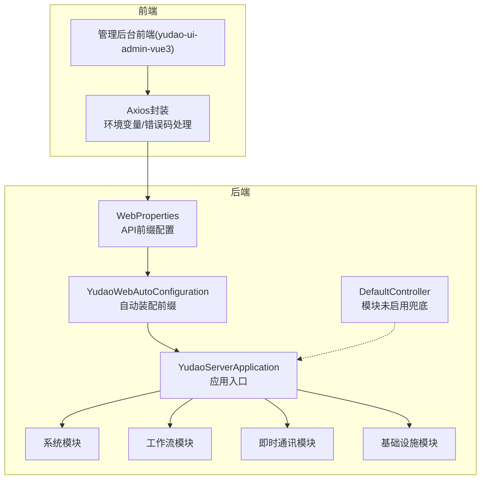
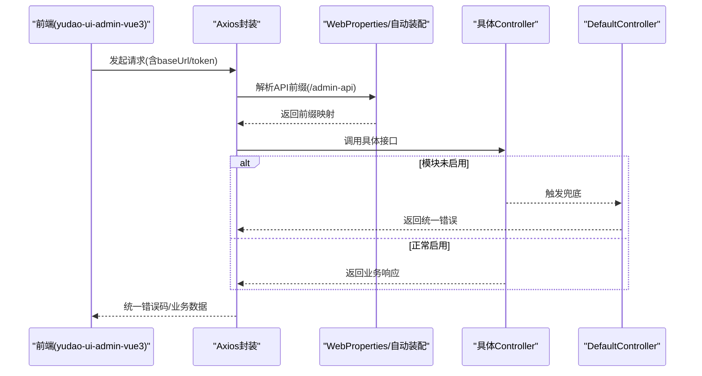
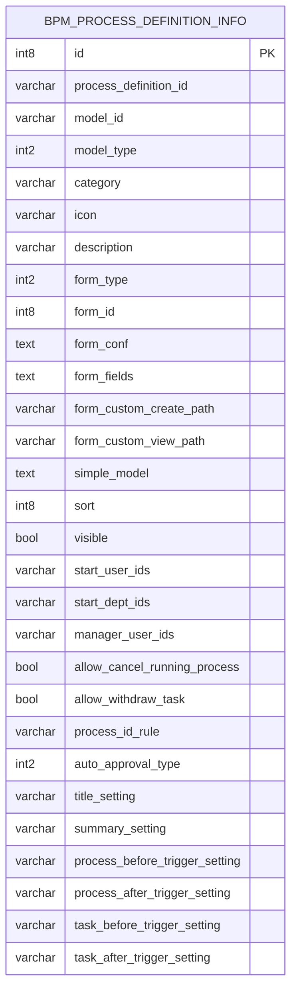
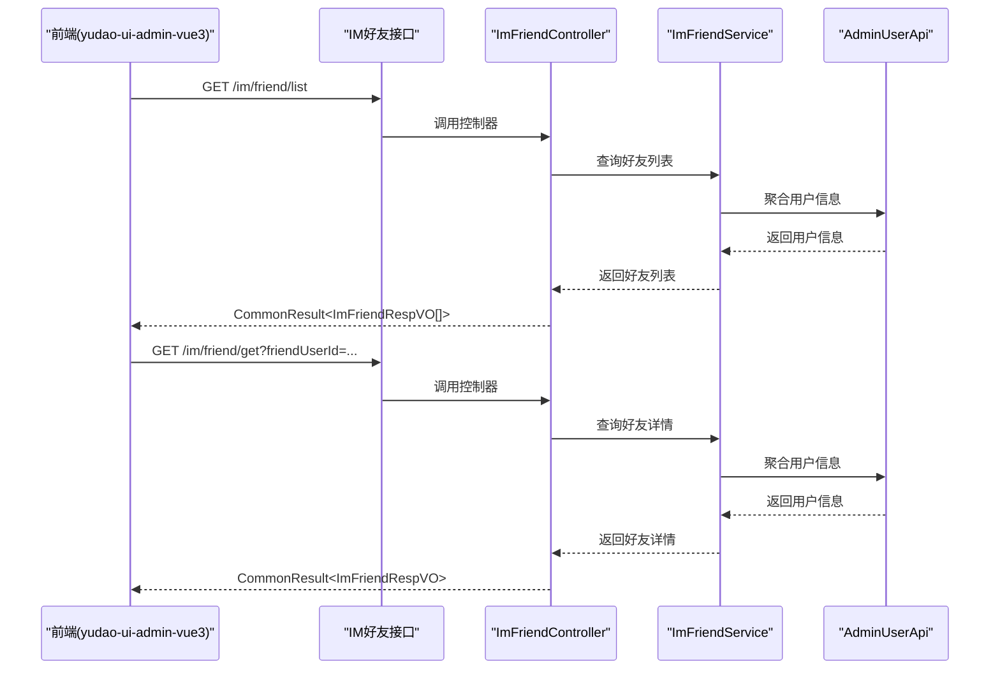
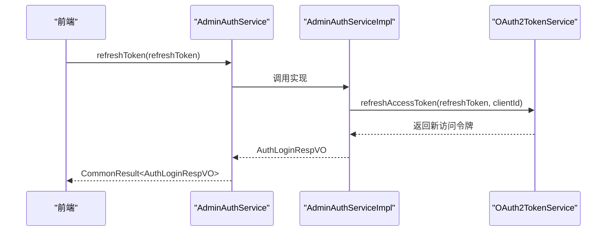
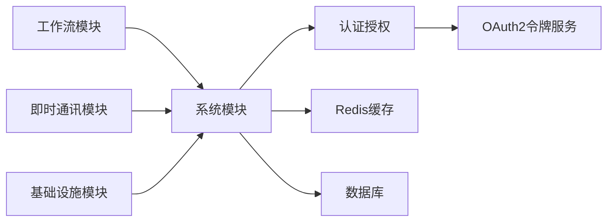

# API接口文档

<cite>
**本文引用的文件**
- [DEVELOPMENT-GUIDE.md](file://DEVELOPMENT-GUIDE.md)
- [DefaultController.java](file://yudao-server/src/main/java/cn/iocoder/yudao/server/controller/DefaultController.java)
- [WebProperties.java](file://yudao-framework/yudao-spring-boot-starter-web/src/main/java/cn/iocoder/yudao/framework/web/config/WebProperties.java)
- [YudaoWebAutoConfiguration.java](file://yudao-framework/yudao-spring-boot-starter-web/src/main/java/cn/iocoder/yudao/framework/web/config/YudaoWebAutoConfiguration.java)
- [GlobalErrorCodeConstants.java](file://yudao-framework/yudao-common/src/main/java/cn/iocoder/yudao/framework/common/exception/enums/GlobalErrorCodeConstants.java)
- [http-client.env.json](file://script/idea/http-client.env.json)
- [AdminAuthServiceImpl.java](file://yudao-module-system/src/main/java/cn/iocoder/yudao/module/system/service/auth/AdminAuthServiceImpl.java)
- [AdminAuthService.java](file://yudao-module-system/src/main/java/cn/iocoder/yudao/module/system/service/auth/AdminAuthService.java)
- [BpmProcessDefinitionRespVO.java](file://yudao-module-bpm/src/main/java/cn/iocoder/yudao/module/bpm/controller/admin/definition/vo/process/BpmProcessDefinitionRespVO.java)
- [create_tables.sql](file://yudao-module-bpm/src/test/resources/sql/create_tables.sql)
- [bpm.sql](file://sql/postgresql/bpm.sql)
- [ImFriendController.java](file://yudao-module-im/src/main/java/cn/iocoder/yudao/module/im/controller/admin/friend/ImFriendController.java)
- [index.ts](file://yudao-ui/yudao-ui-admin-vue3/src/api/im/friend/index.ts)
</cite>

## 目录
1. [简介](#简介)
2. [项目结构](#项目结构)
3. [核心组件](#核心组件)
4. [架构总览](#架构总览)
5. [详细组件分析](#详细组件分析)
6. [依赖分析](#依赖分析)
7. [性能考虑](#性能考虑)
8. [故障排查指南](#故障排查指南)
9. [结论](#结论)
10. [附录](#附录)

## 简介
本文件为“芋道Ruoyi-Vue-Pro”项目的API接口文档，面向前后端开发者与集成方，系统性说明RESTful API的设计规范、URL命名约定、HTTP方法使用、状态码标准、错误码体系、认证授权流程、以及各模块（系统管理、工作流、即时通讯）的接口定义与调用示例。同时给出API版本管理策略、向后兼容性保障建议、性能优化与限流策略。

## 项目结构
- 后端采用多模块架构，按业务域拆分：系统管理、基础设施、工作流、即时通讯、报表、运营等模块。
- 前端采用Vue3 + TypeScript，通过Axios封装统一的请求层，配合环境变量与错误码处理。
- API统一前缀由后端自动装配配置，分别对管理后台与APP提供独立前缀，便于网关或反向代理隔离与安全控制。

图表来源
- [WebProperties.java:1-31](file://yudao-framework/yudao-spring-boot-starter-web/src/main/java/cn/iocoder/yudao/framework/web/config/WebProperties.java#L1-L31)
- [YudaoWebAutoConfiguration.java:32-66](file://yudao-framework/yudao-spring-boot-starter-web/src/main/java/cn/iocoder/yudao/framework/web/config/YudaoWebAutoConfiguration.java#L32-L66)
- [DefaultController.java:1-33](file://yudao-server/src/main/java/cn/iocoder/yudao/server/controller/DefaultController.java#L1-L33)

章节来源
- [WebProperties.java:1-31](file://yudao-framework/yudao-spring-boot-starter-web/src/main/java/cn/iocoder/yudao/framework/web/config/WebProperties.java#L1-L31)
- [YudaoWebAutoConfiguration.java:32-66](file://yudao-framework/yudao-spring-boot-starter-web/src/main/java/cn/iocoder/yudao/framework/web/config/YudaoWebAutoConfiguration.java#L32-L66)
- [DefaultController.java:1-33](file://yudao-server/src/main/java/cn/iocoder/yudao/server/controller/DefaultController.java#L1-L33)

## 核心组件
- API前缀与路由前缀
  - 管理后台前缀：/admin-api
  - APP前缀：/app-api
  - 通过WebProperties与YudaoWebAutoConfiguration自动装配，统一设置RequestMappingHandlerMapping的pathPrefixes。
- 错误码与通用响应
  - 使用全局错误码常量，覆盖服务端错误、自定义错误、未知错误等。
  - 默认控制器在模块未启用时返回统一错误提示，避免404暴露内部细节。
- 认证与授权
  - 系统模块提供登录、Token刷新、注销等能力，基于OAuth2访问令牌。
- 前端调用
  - 前端通过Axios封装统一请求，结合环境变量配置baseUrl与token。

章节来源
- [WebProperties.java:19-31](file://yudao-framework/yudao-spring-boot-starter-web/src/main/java/cn/iocoder/yudao/framework/web/config/WebProperties.java#L19-L31)
- [YudaoWebAutoConfiguration.java:45-66](file://yudao-framework/yudao-spring-boot-starter-web/src/main/java/cn/iocoder/yudao/framework/web/config/YudaoWebAutoConfiguration.java#L45-L66)
- [GlobalErrorCodeConstants.java:29-41](file://yudao-framework/yudao-common/src/main/java/cn/iocoder/yudao/framework/common/exception/enums/GlobalErrorCodeConstants.java#L29-L41)
- [DefaultController.java:23-33](file://yudao-server/src/main/java/cn/iocoder/yudao/server/controller/DefaultController.java#L23-L33)
- [http-client.env.json:1-20](file://script/idea/http-client.env.json#L1-L20)

## 架构总览
后端通过自动装配为不同包路径的Controller设置不同的API前缀，前端根据环境变量选择对应前缀发起请求；默认控制器在模块未启用时返回统一错误，避免泄露模块状态。

图表来源
- [WebProperties.java:19-31](file://yudao-framework/yudao-spring-boot-starter-web/src/main/java/cn/iocoder/yudao/framework/web/config/WebProperties.java#L19-L31)
- [YudaoWebAutoConfiguration.java:45-66](file://yudao-framework/yudao-spring-boot-starter-web/src/main/java/cn/iocoder/yudao/framework/web/config/YudaoWebAutoConfiguration.java#L45-L66)
- [DefaultController.java:23-33](file://yudao-server/src/main/java/cn/iocoder/yudao/server/controller/DefaultController.java#L23-L33)

## 详细组件分析

### RESTful API 设计规范
- URL命名约定
  - 使用名词复数形式表达资源集合，如“/admin-api/system/user/list”
  - 资源路径层级清晰，子资源通过斜杠拼接，如“/admin-api/system/dept/{id}”
  - 动作通过HTTP方法体现，不使用动词，如“POST /admin-api/system/dept/create”表示创建
- HTTP方法使用
  - GET：查询单个/多个资源、导出等
  - POST：创建资源
  - PUT：更新资源
  - DELETE：删除资源
- 请求参数
  - 查询参数：GET请求使用@RequestParam
  - 请求体：POST/PUT使用@RequestBody，配合@Valid进行参数校验
- 响应格式
  - 统一包装为CommonResult<T>，包含code、message、data三要素
  - 成功时code通常为200，失败时使用全局错误码常量
- 状态码标准
  - 200：成功
  - 401：未认证或Token无效
  - 403：权限不足
  - 404：资源不存在（模块未启用时由DefaultController统一返回NOT_IMPLEMENTED）
  - 500：服务器异常
  - 501：功能未实现/未开启
- 权限控制
  - 使用@PreAuthorize进行方法级权限校验，如“@ss.hasPermission('system:dept:create')”

章节来源
- [DEVELOPMENT-GUIDE.md:201-251](file://DEVELOPMENT-GUIDE.md#L201-L251)

### 系统管理模块（用户、角色、菜单、部门等）
- URL前缀：/admin-api/system/*
- 示例接口（以部门为例）
  - POST /admin-api/system/dept/create：创建部门
  - PUT /admin-api/system/dept/update：更新部门
  - DELETE /admin-api/system/dept/delete?id={id}：删除部门
  - GET /admin-api/system/dept/get?id={id}：获取部门详情
  - GET /admin-api/system/dept/list：查询部门列表
- 请求参数
  - 创建/更新：@Valid + @RequestBody，参数对象包含必填字段与校验规则
  - 查询：@RequestParam传入id或分页/筛选条件
- 响应格式
  - 成功返回CommonResult<T>，其中T为具体VO类型
- 权限要求
  - 使用@PreAuthorize进行权限校验，如“system:dept:*”系列权限

章节来源
- [DEVELOPMENT-GUIDE.md:201-251](file://DEVELOPMENT-GUIDE.md#L201-L251)

### 工作流模块（流程定义、任务管理、流程监控）
- URL前缀：/admin-api/bpm/*
- 流程定义
  - 响应VO包含流程定义基本信息，如id、version、name、key、category、modelType、modelId等
- 数据模型
  - bpm_process_definition_info表存储流程定义扩展信息，包含分类、图标、表单类型、可见性、排序、起始用户/部门、管理员、是否允许撤回/撤回任务、标题/摘要设置、触发器设置等字段
- 接口要点
  - 通过Swagger注解标注接口用途与参数
  - 响应VO继承模型元信息，补充流程定义特有字段

图表来源
- [bpm.sql:164-196](file://sql/postgresql/bpm.sql#L164-L196)

章节来源
- [BpmProcessDefinitionRespVO.java:1-35](file://yudao-module-bpm/src/main/java/cn/iocoder/yudao/module/bpm/controller/admin/definition/vo/process/BpmProcessDefinitionRespVO.java#L1-L35)
- [create_tables.sql:50-74](file://yudao-module-bpm/src/test/resources/sql/create_tables.sql#L50-L74)

### 即时通讯模块（消息、群组、好友关系）
- URL前缀：/admin-api/im/*
- 好友关系
  - 前端定义了ImFriendRespVO与ImFriendUpdateReqVO，包含关系记录编号、好友用户编号、免打扰、展示备注、置顶、拉黑、状态、添加/删除时间、聚合用户信息（昵称、头像等）
  - 前端提供获取好友列表与好友详情的接口调用方式
- 控制器与服务
  - 控制器负责接收请求、参数校验、调用服务层并返回CommonResult
  - 服务层处理业务逻辑并与系统用户API交互

图表来源
- [ImFriendController.java:1-27](file://yudao-module-im/src/main/java/cn/iocoder/yudao/module/im/controller/admin/friend/ImFriendController.java#L1-L27)
- [index.ts:30-38](file://yudao-ui/yudao-ui-admin-vue3/src/api/im/friend/index.ts#L30-L38)

章节来源
- [ImFriendController.java:1-27](file://yudao-module-im/src/main/java/cn/iocoder/yudao/module/im/controller/admin/friend/ImFriendController.java#L1-L27)
- [index.ts:1-38](file://yudao-ui/yudao-ui-admin-vue3/src/api/im/friend/index.ts#L1-L38)

### 认证授权接口（登录、Token刷新、权限验证）
- 登录与Token刷新
  - 刷新访问令牌：AdminAuthService声明refreshToken，AdminAuthServiceImpl实现基于OAuth2的令牌刷新
  - 登录成功后创建访问令牌并返回AuthLoginRespVO
- 注销
  - AdminAuthServiceImpl提供logout，删除访问令牌并记录登出日志
- 前端集成
  - 通过http-client.env.json配置baseUrl与token，便于本地调试与联调

图表来源
- [AdminAuthService.java:65-88](file://yudao-module-system/src/main/java/cn/iocoder/yudao/module/system/service/auth/AdminAuthService.java#L65-L88)
- [AdminAuthServiceImpl.java:222-237](file://yudao-module-system/src/main/java/cn/iocoder/yudao/module/system/service/auth/AdminAuthServiceImpl.java#L222-L237)

章节来源
- [AdminAuthService.java:65-88](file://yudao-module-system/src/main/java/cn/iocoder/yudao/module/system/service/auth/AdminAuthService.java#L65-L88)
- [AdminAuthServiceImpl.java:212-237](file://yudao-module-system/src/main/java/cn/iocoder/yudao/module/system/service/auth/AdminAuthServiceImpl.java#L212-L237)
- [http-client.env.json:1-20](file://script/idea/http-client.env.json#L1-L20)

### API调用示例与SDK使用指南
- JavaScript（前端Axios）
  - 在yudao-ui-admin-vue3中，通过config/axios封装统一请求，结合环境变量设置baseUrl与token
  - 示例：获取好友列表与好友详情的接口调用方式
- Java（后端）
  - 使用Spring MVC注解定义Controller，统一参数校验与权限控制
  - 使用CommonResult作为统一响应包装

章节来源
- [index.ts:30-38](file://yudao-ui/yudao-ui-admin-vue3/src/api/im/friend/index.ts#L30-L38)
- [http-client.env.json:1-20](file://script/idea/http-client.env.json#L1-L20)

### API版本管理策略与向后兼容性
- 版本策略
  - 采用前缀区分不同版本，如/admin-api/v1、/admin-api/v2，便于平滑迁移
- 向后兼容
  - 新增字段采用可选策略，不破坏旧客户端解析
  - 保持URL与HTTP方法不变，仅扩展响应内容
  - 对废弃接口提供过渡期并发布迁移指南

[本节为通用指导，无需特定文件引用]

### 性能优化与限流策略
- 缓存
  - 对高频查询（如字典、配置、菜单树）启用Redis缓存，降低数据库压力
- 分页与筛选
  - 默认分页大小限制，避免一次性返回过多数据
- 并发控制
  - 对敏感接口（登录、刷新Token）实施限流，防止暴力破解与刷接口
- 日志与监控
  - 结合操作日志与链路追踪，定位慢接口与异常

[本节为通用指导，无需特定文件引用]

## 依赖分析
- 模块耦合
  - 系统模块为认证授权核心，被其他模块广泛依赖
  - 工作流与即时通讯模块相对独立，通过统一前缀暴露接口
- 外部依赖
  - OAuth2令牌服务、Redis缓存、数据库
- 循环依赖
  - 通过接口与DTO解耦，避免循环依赖

图表来源
- [AdminAuthServiceImpl.java:212-237](file://yudao-module-system/src/main/java/cn/iocoder/yudao/module/system/service/auth/AdminAuthServiceImpl.java#L212-L237)

章节来源
- [AdminAuthServiceImpl.java:212-237](file://yudao-module-system/src/main/java/cn/iocoder/yudao/module/system/service/auth/AdminAuthServiceImpl.java#L212-L237)

## 性能考虑
- 接口层面
  - 合理使用分页与索引，避免全表扫描
  - 对热点数据增加缓存，减少重复计算
- 网络层面
  - 前端按需加载，避免一次性请求过多接口
  - 合理设置超时与重试策略
- 安全层面
  - 对高风险接口增加限流与白名单校验

[本节为通用指导，无需特定文件引用]

## 故障排查指南
- 常见错误码
  - 501：功能未实现/未开启（模块未启用时由DefaultController返回）
  - 500：服务器异常
  - 900：重复请求
  - 901：演示模式禁止写操作
  - 999：未知错误
- 排查步骤
  - 确认模块是否启用（/admin-api/bpm/**等路径）
  - 检查Token有效性与过期时间
  - 查看操作日志与链路追踪
  - 核对权限是否满足（@PreAuthorize）

章节来源
- [GlobalErrorCodeConstants.java:29-41](file://yudao-framework/yudao-common/src/main/java/cn/iocoder/yudao/framework/common/exception/enums/GlobalErrorCodeConstants.java#L29-L41)
- [DefaultController.java:23-33](file://yudao-server/src/main/java/cn/iocoder/yudao/server/controller/DefaultController.java#L23-L33)

## 结论
本API文档基于项目现有实现，明确了RESTful设计规范、统一前缀与错误码体系、认证授权流程，并对系统管理、工作流、即时通讯三大模块提供了接口说明与调用示例。建议在后续迭代中持续完善接口文档与版本管理策略，确保向后兼容与性能稳定。

## 附录
- 环境变量与示例
  - http-client.env.json提供本地与网关两种环境的baseUrl与token配置，便于快速联调

章节来源
- [http-client.env.json:1-20](file://script/idea/http-client.env.json#L1-L20)