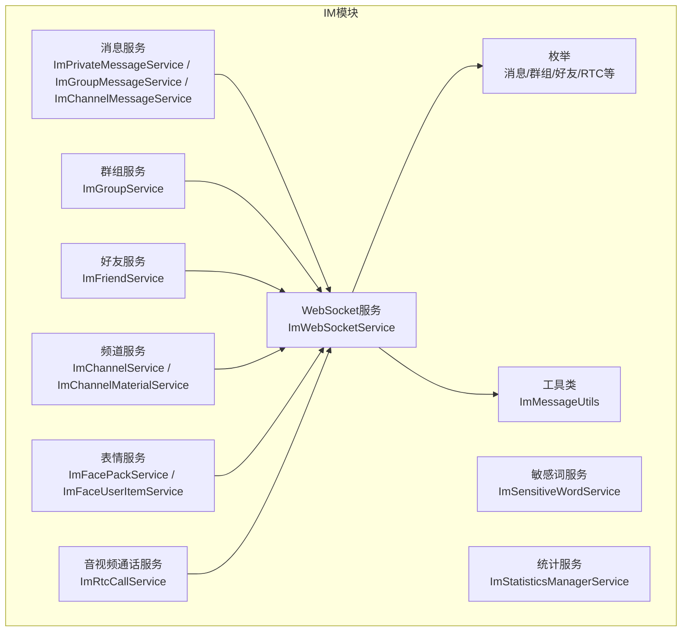
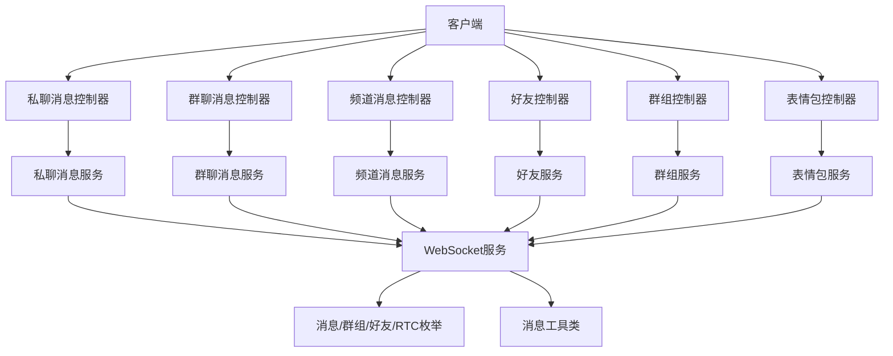
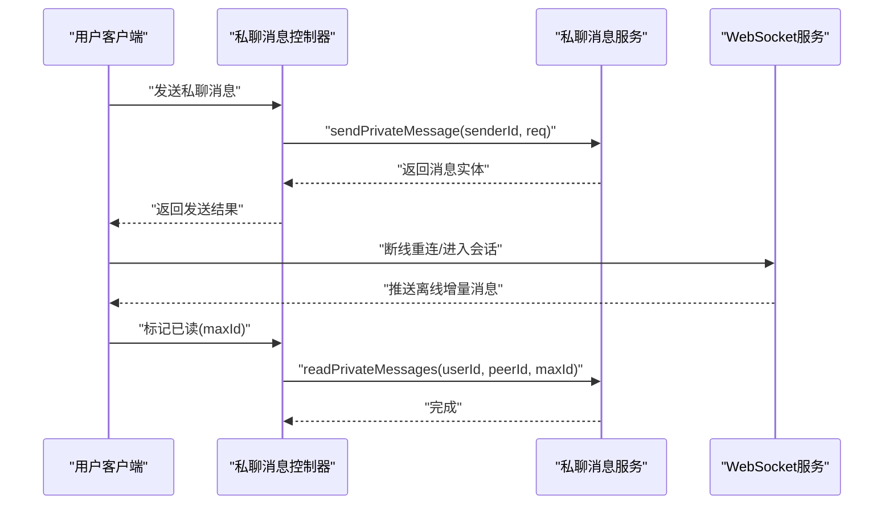
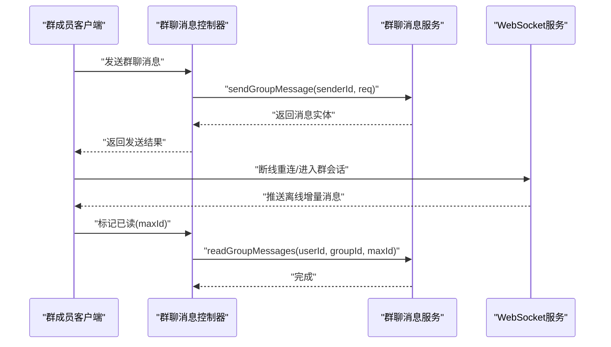
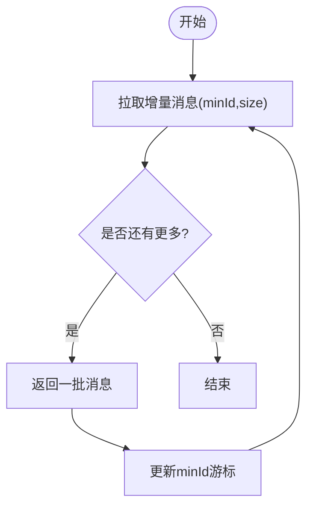
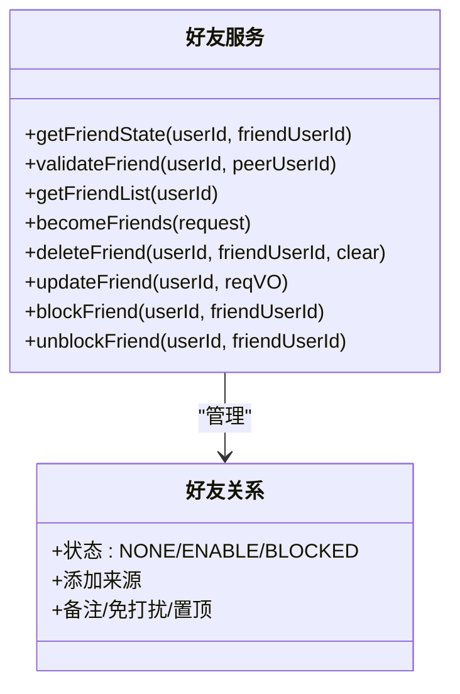
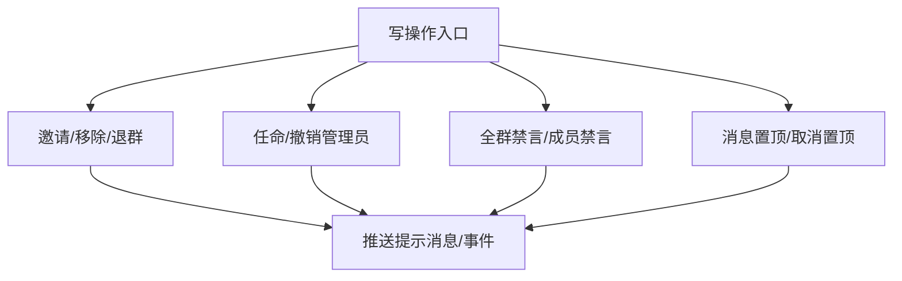
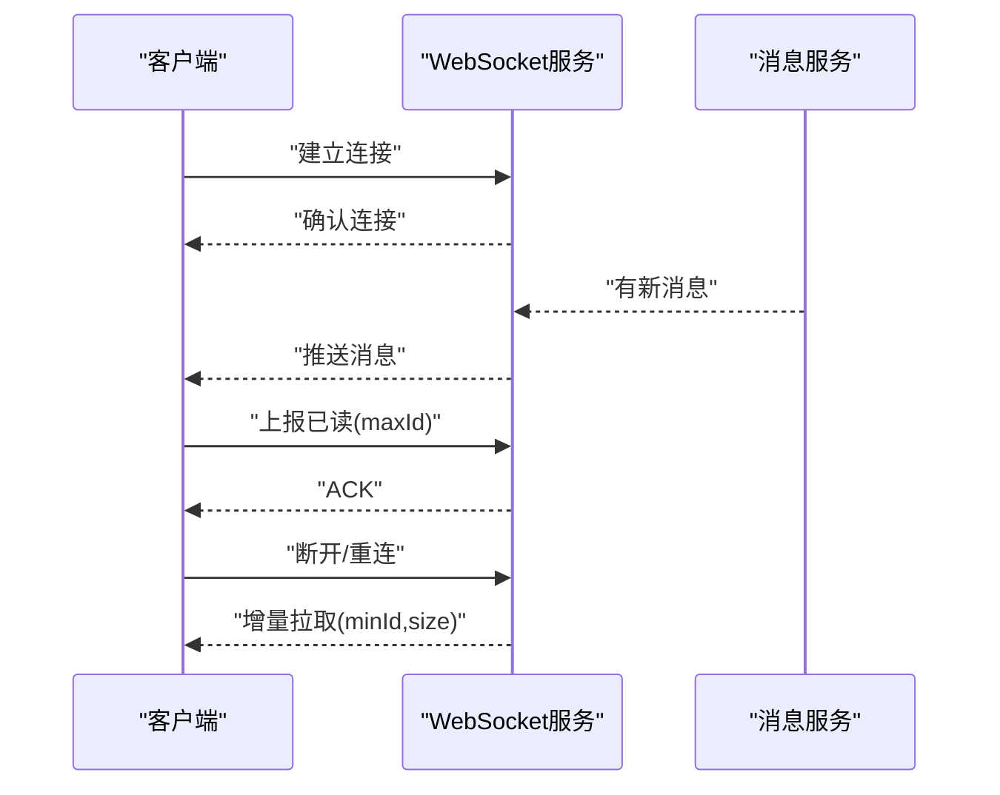
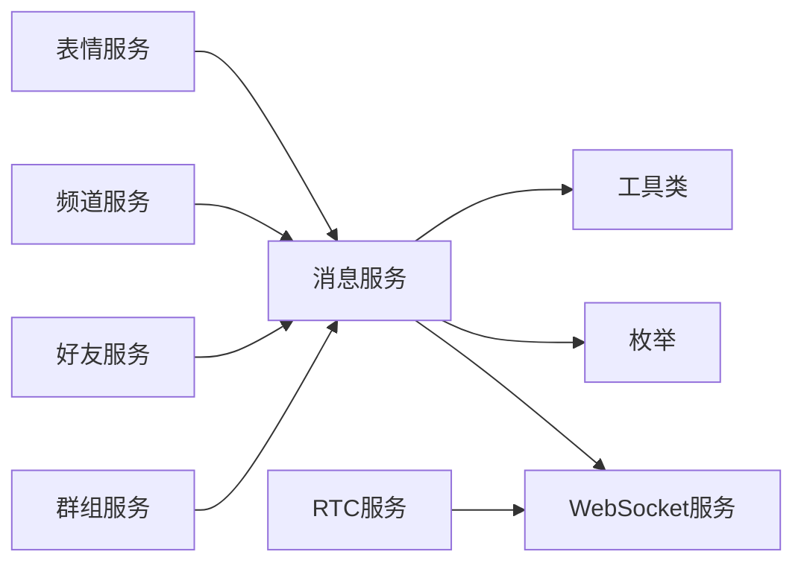

# 即时通讯API

<cite>
**本文引用的文件**
- [ImPrivateMessageService.java](file://yudao-module-im/src/main/java/cn/iocoder/yudao/module/im/service/message/ImPrivateMessageService.java)
- [ImGroupMessageService.java](file://yudao-module-im/src/main/java/cn/iocoder/yudao/module/im/service/message/ImGroupMessageService.java)
- [ImChannelMessageService.java](file://yudao-module-im/src/main/java/cn/iocoder/yudao/module/im/service/message/ImChannelMessageService.java)
- [ImFriendService.java](file://yudao-module-im/src/main/java/cn/iocoder/yudao/module/im/service/friend/ImFriendService.java)
- [ImGroupService.java](file://yudao-module-im/src/main/java/cn/iocoder/yudao/module/im/service/group/ImGroupService.java)
- [ImWebSocketService.java](file://yudao-module-im/src/main/java/cn/iocoder/yudao/module/im/service/websocket/ImWebSocketService.java)
- [ImMessageUtils.java](file://yudao-module-im/src/main/java/cn/iocoder/yudao/module/im/util/ImMessageUtils.java)
- [ImMessageTypeEnum.java](file://yudao-module-im/src/main/java/cn/iocoder/yudao/module/im/enums/message/ImMessageTypeEnum.java)
- [ImMessageStatusEnum.java](file://yudao-module-im/src/main/java/cn/iocoder/yudao/module/im/enums/message/ImMessageStatusEnum.java)
- [ImGroupMessageReceiptStatusEnum.java](file://yudao-module-im/src/main/java/cn/iocoder/yudao/module/im/enums/message/ImGroupMessageReceiptStatusEnum.java)
- [ImConversationTypeEnum.java](file://yudao-module-im/src/main/java/cn/iocoder/yudao/module/im/enums/ImConversationTypeEnum.java)
- [ImChannelMaterialTypeEnum.java](file://yudao-module-im/src/main/java/cn/iocoder/yudao/module/im/enums/channel/ImChannelMaterialTypeEnum.java)
- [ImFriendStateEnum.java](file://yudao-module-im/src/main/java/cn/iocoder/yudao/module/im/enums/friend/ImFriendStateEnum.java)
- [ImGroupMemberRoleEnum.java](file://yudao-module-im/src/main/java/cn/iocoder/yudao/module/im/enums/group/ImGroupMemberRoleEnum.java)
- [ImRtcCallStatusEnum.java](file://yudao-module-im/src/main/java/cn/iocoder/yudao/module/im/enums/rtc/ImRtcCallStatusEnum.java)
- [ImRtcCallMediaTypeEnum.java](file://yudao-module-im/src/main/java/cn/iocoder/yudao/module/im/enums/rtc/ImRtcCallMediaTypeEnum.java)
- [ImRtcCallEndReasonEnum.java](file://yudao-module-im/src/main/java/cn/iocoder/yudao/module/im/enums/rtc/ImRtcCallEndReasonEnum.java)
- [ImRtcParticipantRoleEnum.java](file://yudao-module-im/src/main/java/cn/iocoder/yudao/module/im/enums/rtc/ImRtcParticipantRoleEnum.java)
- [ImRtcParticipantStatusEnum.java](file://yudao-module-im/src/main/java/cn/iocoder/yudao/module/im/enums/rtc/ImRtcParticipantStatusEnum.java)
- [ImChannelMaterialService.java](file://yudao-module-im/src/main/java/cn/iocoder/yudao/module/im/service/channel/ImChannelMaterialService.java)
- [ImChannelService.java](file://yudao-module-im/src/main/java/cn/iocoder/yudao/module/im/service/channel/ImChannelService.java)
- [ImFacePackService.java](file://yudao-module-im/src/main/java/cn/iocoder/yudao/module/im/service/face/ImFacePackService.java)
- [ImFaceUserItemService.java](file://yudao-module-im/src/main/java/cn/iocoder/yudao/module/im/service/face/ImFaceUserItemService.java)
- [ImSensitiveWordService.java](file://yudao-module-im/src/main/java/cn/iocoder/yudao/module/im/service/sensitiveword/ImSensitiveWordService.java)
- [ImStatisticsManagerService.java](file://yudao-module-im/src/main/java/cn/iocoder/yudao/module/im/service/statistics/ImStatisticsManagerService.java)
- [ImRtcCallService.java](file://yudao-module-im/src/main/java/cn/iocoder/yudao/module/im/service/rtc/ImRtcCallService.java)
- [ImChannelMaterialController.java](file://yudao-module-im/src/main/java/cn/iocoder/yudao/module/im/controller/admin/channel/ImChannelMaterialController.java)
- [ImFacePackController.java](file://yudao-module-im/src/main/java/cn/iocoder/yudao/module/im/controller/admin/face/ImFacePackController.java)
- [ImFaceUserItemController.java](file://yudao-module-im/src/main/java/cn/iocoder/yudao/module/im/controller/admin/face/ImFaceUserItemController.java)
- [ImFriendController.java](file://yudao-module-im/src/main/java/cn/iocoder/yudao/module/im/controller/admin/friend/ImFriendController.java)
- [ImFriendRequestController.java](file://yudao-module-im/src/main/java/cn/iocoder/yudao/module/im/controller/admin/friend/ImFriendRequestController.java)
- [ImGroupController.java](file://yudao-module-im/src/main/java/cn/iocoder/yudao/module/im/controller/admin/group/ImGroupController.java)
- [ImGroupMemberController.java](file://yudao-module-im/src/main/java/cn/iocoder/yudao/module/im/controller/admin/group/ImGroupMemberController.java)
- [ImGroupRequestController.java](file://yudao-module-im/src/main/java/cn/iocoder/yudao/module/im/controller/admin/group/ImGroupRequestController.java)
</cite>

## 目录
1. [简介](#简介)
2. [项目结构](#项目结构)
3. [核心组件](#核心组件)
4. [架构总览](#架构总览)
5. [详细组件分析](#详细组件分析)
6. [依赖分析](#依赖分析)
7. [性能考虑](#性能考虑)
8. [故障排查指南](#故障排查指南)
9. [结论](#结论)
10. [附录](#附录)

## 简介
本文件面向即时通讯模块的API接口文档，覆盖消息API（私聊、群聊、频道）、好友API（申请、同意、拒绝、删除、拉黑/解除）、群组API（创建、成员管理、禁言、转让、置顶）、频道内容与材料管理API、WebSocket实时通信协议与断线重连策略，以及消息类型、消息格式、附件上传、存储策略、离线消息处理与消息回执机制。同时提供客户端集成要点与错误处理建议。

## 项目结构
IM模块采用“服务层 + 控制器 + 数据对象 + 枚举 + 工具类”的分层组织方式，消息、好友、群组、频道、表情包、敏感词、统计、RTC等子域清晰划分，便于扩展与维护。

图示来源
- [ImPrivateMessageService.java:1-105](file://yudao-module-im/src/main/java/cn/iocoder/yudao/module/im/service/message/ImPrivateMessageService.java#L1-L105)
- [ImGroupMessageService.java:1-160](file://yudao-module-im/src/main/java/cn/iocoder/yudao/module/im/service/message/ImGroupMessageService.java#L1-L160)
- [ImChannelMessageService.java:1-76](file://yudao-module-im/src/main/java/cn/iocoder/yudao/module/im/service/message/ImChannelMessageService.java#L1-L76)
- [ImFriendService.java:1-125](file://yudao-module-im/src/main/java/cn/iocoder/yudao/module/im/service/friend/ImFriendService.java#L1-L125)
- [ImGroupService.java:1-252](file://yudao-module-im/src/main/java/cn/iocoder/yudao/module/im/service/group/ImGroupService.java#L1-L252)
- [ImWebSocketService.java](file://yudao-module-im/src/main/java/cn/iocoder/yudao/module/im/service/websocket/ImWebSocketService.java)
- [ImMessageUtils.java](file://yudao-module-im/src/main/java/cn/iocoder/yudao/module/im/util/ImMessageUtils.java)
- [ImChannelService.java](file://yudao-module-im/src/main/java/cn/iocoder/yudao/module/im/service/channel/ImChannelService.java)
- [ImChannelMaterialService.java](file://yudao-module-im/src/main/java/cn/iocoder/yudao/module/im/service/channel/ImChannelMaterialService.java)
- [ImFacePackService.java](file://yudao-module-im/src/main/java/cn/iocoder/yudao/module/im/service/face/ImFacePackService.java)
- [ImFaceUserItemService.java](file://yudao-module-im/src/main/java/cn/iocoder/yudao/module/im/service/face/ImFaceUserItemService.java)
- [ImSensitiveWordService.java](file://yudao-module-im/src/main/java/cn/iocoder/yudao/module/im/service/sensitiveword/ImSensitiveWordService.java)
- [ImStatisticsManagerService.java](file://yudao-module-im/src/main/java/cn/iocoder/yudao/module/im/service/statistics/ImStatisticsManagerService.java)
- [ImRtcCallService.java](file://yudao-module-im/src/main/java/cn/iocoder/yudao/module/im/service/rtc/ImRtcCallService.java)

章节来源
- [ImPrivateMessageService.java:1-105](file://yudao-module-im/src/main/java/cn/iocoder/yudao/module/im/service/message/ImPrivateMessageService.java#L1-L105)
- [ImGroupMessageService.java:1-160](file://yudao-module-im/src/main/java/cn/iocoder/yudao/module/im/service/message/ImGroupMessageService.java#L1-L160)
- [ImChannelMessageService.java:1-76](file://yudao-module-im/src/main/java/cn/iocoder/yudao/module/im/service/message/ImChannelMessageService.java#L1-L76)
- [ImFriendService.java:1-125](file://yudao-module-im/src/main/java/cn/iocoder/yudao/module/im/service/friend/ImFriendService.java#L1-L125)
- [ImGroupService.java:1-252](file://yudao-module-im/src/main/java/cn/iocoder/yudao/module/im/service/group/ImGroupService.java#L1-L252)
- [ImWebSocketService.java](file://yudao-module-im/src/main/java/cn/iocoder/yudao/module/im/service/websocket/ImWebSocketService.java)
- [ImMessageUtils.java](file://yudao-module-im/src/main/java/cn/iocoder/yudao/module/im/util/ImMessageUtils.java)
- [ImChannelService.java](file://yudao-module-im/src/main/java/cn/iocoder/yudao/module/im/service/channel/ImChannelService.java)
- [ImChannelMaterialService.java](file://yudao-module-im/src/main/java/cn/iocoder/yudao/module/im/service/channel/ImChannelMaterialService.java)
- [ImFacePackService.java](file://yudao-module-im/src/main/java/cn/iocoder/yudao/module/im/service/face/ImFacePackService.java)
- [ImFaceUserItemService.java](file://yudao-module-im/src/main/java/cn/iocoder/yudao/module/im/service/face/ImFaceUserItemService.java)
- [ImSensitiveWordService.java](file://yudao-module-im/src/main/java/cn/iocoder/yudao/module/im/service/sensitiveword/ImSensitiveWordService.java)
- [ImStatisticsManagerService.java](file://yudao-module-im/src/main/java/cn/iocoder/yudao/module/im/service/statistics/ImStatisticsManagerService.java)
- [ImRtcCallService.java](file://yudao-module-im/src/main/java/cn/iocoder/yudao/module/im/service/rtc/ImRtcCallService.java)

## 核心组件
- 消息服务：负责私聊、群聊、频道消息的发送、拉取、已读上报、历史查询、撤回、回执统计等。
- 好友服务：负责好友关系状态查询、验证、删除、更新、拉黑/解除黑名单等。
- 群组服务：负责群创建、更新、解散、成员邀请/移除/退群、管理员任命/撤销、禁言/解除禁言、消息置顶/取消置顶、群主转让等。
- 频道服务：负责频道消息的拉取、已读上报、管理后台推送与分页查询、材料管理。
- 表情包服务：负责表情包与用户表情项的管理。
- 敏感词服务：负责敏感词检测与替换。
- 统计服务：负责IM相关统计数据的聚合与查询。
- WebSocket服务：负责实时消息推送、断线重连、多端同步等。
- 工具类：负责消息格式化、序列化、校验等辅助能力。

章节来源
- [ImPrivateMessageService.java:1-105](file://yudao-module-im/src/main/java/cn/iocoder/yudao/module/im/service/message/ImPrivateMessageService.java#L1-L105)
- [ImGroupMessageService.java:1-160](file://yudao-module-im/src/main/java/cn/iocoder/yudao/module/im/service/message/ImGroupMessageService.java#L1-L160)
- [ImChannelMessageService.java:1-76](file://yudao-module-im/src/main/java/cn/iocoder/yudao/module/im/service/message/ImChannelMessageService.java#L1-L76)
- [ImFriendService.java:1-125](file://yudao-module-im/src/main/java/cn/iocoder/yudao/module/im/service/friend/ImFriendService.java#L1-L125)
- [ImGroupService.java:1-252](file://yudao-module-im/src/main/java/cn/iocoder/yudao/module/im/service/group/ImGroupService.java#L1-L252)
- [ImWebSocketService.java](file://yudao-module-im/src/main/java/cn/iocoder/yudao/module/im/service/websocket/ImWebSocketService.java)
- [ImMessageUtils.java](file://yudao-module-im/src/main/java/cn/iocoder/yudao/module/im/util/ImMessageUtils.java)

## 架构总览
IM模块以服务层为核心，控制器负责HTTP接口定义，枚举与工具类提供类型安全与通用逻辑，WebSocket服务贯穿消息推送与多端同步。

图示来源
- [ImPrivateMessageService.java:1-105](file://yudao-module-im/src/main/java/cn/iocoder/yudao/module/im/service/message/ImPrivateMessageService.java#L1-L105)
- [ImGroupMessageService.java:1-160](file://yudao-module-im/src/main/java/cn/iocoder/yudao/module/im/service/message/ImGroupMessageService.java#L1-L160)
- [ImChannelMessageService.java:1-76](file://yudao-module-im/src/main/java/cn/iocoder/yudao/module/im/service/message/ImChannelMessageService.java#L1-L76)
- [ImFriendService.java:1-125](file://yudao-module-im/src/main/java/cn/iocoder/yudao/module/im/service/friend/ImFriendService.java#L1-L125)
- [ImGroupService.java:1-252](file://yudao-module-im/src/main/java/cn/iocoder/yudao/module/im/service/group/ImGroupService.java#L1-L252)
- [ImWebSocketService.java](file://yudao-module-im/src/main/java/cn/iocoder/yudao/module/im/service/websocket/ImWebSocketService.java)
- [ImMessageUtils.java](file://yudao-module-im/src/main/java/cn/iocoder/yudao/module/im/util/ImMessageUtils.java)

## 详细组件分析

### 私聊消息API
- 发送私聊消息
  - 用户端：提供发送请求参数对象，支持幂等、好友校验、敏感词过滤、引用解析等。
  - 系统调用：提供DTO发送接口，便于内部系统批量或跨模块调用。
- 撤回私聊消息
  - 支持按消息ID撤回，返回提示信息。
- 拉取私聊消息（增量）
  - 支持基于最小消息ID游标增量拉取，控制拉取数量。
- 标记私聊消息已读
  - 支持按最大消息ID一次性翻转未读为已读，避免竞态。
- 查询对方已读最大消息ID
  - 用于多端/离线场景下的已读位置补齐。
- 查询私聊历史消息（游标拉取）
  - 支持按游标倒序拉取历史消息。
- 管理后台
  - 提供分页查询与详情查询接口。

图示来源
- [ImPrivateMessageService.java:19-90](file://yudao-module-im/src/main/java/cn/iocoder/yudao/module/im/service/message/ImPrivateMessageService.java#L19-L90)

章节来源
- [ImPrivateMessageService.java:1-105](file://yudao-module-im/src/main/java/cn/iocoder/yudao/module/im/service/message/ImPrivateMessageService.java#L1-L105)

### 群聊消息API
- 发送群聊消息
  - 用户端：支持幂等、敏感词、引用解析、@解析等。
  - 系统调用：支持内部批量推送，可显式指定推送目标用户集合。
- 撤回群聊消息
  - 支持按消息ID撤回，返回提示信息。
- 拉取群聊消息（增量）
  - 支持基于最小消息ID游标增量拉取。
- 标记群聊消息已读
  - 支持按最大消息ID一次性翻转未读为已读。
- 获取群消息已读用户列表
  - 支持查询已读该消息的用户集合。
- 查询群聊历史消息（游标拉取）
  - 支持按游标倒序拉取历史消息。
- 已读位置缓存清理
  - 支持退群、批量踢人、解散群等场景下的缓存清理。

图示来源
- [ImGroupMessageService.java:21-100](file://yudao-module-im/src/main/java/cn/iocoder/yudao/module/im/service/message/ImGroupMessageService.java#L21-L100)

章节来源
- [ImGroupMessageService.java:1-160](file://yudao-module-im/src/main/java/cn/iocoder/yudao/module/im/service/message/ImGroupMessageService.java#L1-L160)

### 频道消息API
- 拉取当前用户应收的频道消息（离线增量）
  - 支持基于游标增量拉取，按ID升序返回。
- 上报频道消息已读位置
  - 支持同步向自身多端推送READ事件。
- 批量查询用户在多个频道下的已读游标
  - 返回 channelId → 已读最大消息ID 的映射。
- 管理后台
  - 立即推送频道消息、分页查询消息、删除消息。

图示来源
- [ImChannelMessageService.java:22-48](file://yudao-module-im/src/main/java/cn/iocoder/yudao/module/im/service/message/ImChannelMessageService.java#L22-L48)

章节来源
- [ImChannelMessageService.java:1-76](file://yudao-module-im/src/main/java/cn/iocoder/yudao/module/im/service/message/ImChannelMessageService.java#L1-L76)

### 好友API
- 关系状态查询
  - 支持获取用户视角下与指定用户的友好关系状态。
- 关系验证
  - 支持校验能否对指定用户发起私聊或邀请等动作。
- 好友列表查询
  - 支持获取全部/有效/双向有效好友列表。
- 建立/恢复好友关系
  - 内部入口：双向建立、单向静默恢复。
- 删除/更新/拉黑/解除拉黑
  - 支持单向软删除、更新备注/免打扰/置顶、拉黑/解除拉黑。

图示来源
- [ImFriendService.java:23-115](file://yudao-module-im/src/main/java/cn/iocoder/yudao/module/im/service/friend/ImFriendService.java#L23-L115)
- [ImFriendStateEnum.java](file://yudao-module-im/src/main/java/cn/iocoder/yudao/module/im/enums/friend/ImFriendStateEnum.java)

章节来源
- [ImFriendService.java:1-125](file://yudao-module-im/src/main/java/cn/iocoder/yudao/module/im/service/friend/ImFriendService.java#L1-L125)

### 群组API
- 群创建/更新/解散
  - 群主创建并自动成为群主，支持更新群信息与解散群。
- 群存在性与容量校验
  - 校验群存在且未封禁、未解散，校验入群人数上限。
- 群列表查询
  - 支持获取用户有效群列表及近期退群群信息。
- 成员管理
  - 邀请入群、退群、移除成员、添加/撤销管理员、群主转让。
- 禁言管理
  - 支持全群禁言/取消、成员禁言/取消。
- 消息管理
  - 支持消息置顶/取消置顶。
- 管理后台
  - 支持封禁/解封/解散群、分页查询群列表。

图示来源
- [ImGroupService.java:114-216](file://yudao-module-im/src/main/java/cn/iocoder/yudao/module/im/service/group/ImGroupService.java#L114-L216)

章节来源
- [ImGroupService.java:1-252](file://yudao-module-im/src/main/java/cn/iocoder/yudao/module/im/service/group/ImGroupService.java#L1-L252)

### 频道内容与材料管理API
- 频道内容管理
  - 拉取增量消息、已读上报、批量查询已读游标、管理后台推送/分页/删除。
- 材料管理
  - 材料类型枚举用于区分图片、文件、富文本等。

章节来源
- [ImChannelMessageService.java:1-76](file://yudao-module-im/src/main/java/cn/iocoder/yudao/module/im/service/message/ImChannelMessageService.java#L1-L76)
- [ImChannelMaterialTypeEnum.java](file://yudao-module-im/src/main/java/cn/iocoder/yudao/module/im/enums/channel/ImChannelMaterialTypeEnum.java)

### 表情包API
- 表情包管理
  - 表情包的增删改查与用户表情项绑定。
- 用户表情项
  - 支持用户表情项的保存、查询与管理。

章节来源
- [ImFacePackService.java](file://yudao-module-im/src/main/java/cn/iocoder/yudao/module/im/service/face/ImFacePackService.java)
- [ImFaceUserItemService.java](file://yudao-module-im/src/main/java/cn/iocoder/yudao/module/im/service/face/ImFaceUserItemService.java)

### WebSocket实时通信与协议
- 连接建立
  - 基于Spring WebSocket配置，建立长连接通道。
- 消息推送
  - 私聊/群聊/频道消息、好友关系变更、系统提示等通过WebSocket推送至多端。
- 断线重连
  - 客户端应携带游标（如minId）进行增量拉取，结合“对方已读最大消息ID”接口补齐已读状态。
- 多端同步
  - 已读上报同步向自身其他端广播READ事件。

图示来源
- [ImWebSocketService.java](file://yudao-module-im/src/main/java/cn/iocoder/yudao/module/im/service/websocket/ImWebSocketService.java)
- [ImPrivateMessageService.java:60-81](file://yudao-module-im/src/main/java/cn/iocoder/yudao/module/im/service/message/ImPrivateMessageService.java#L60-L81)
- [ImGroupMessageService.java:74-80](file://yudao-module-im/src/main/java/cn/iocoder/yudao/module/im/service/message/ImGroupMessageService.java#L74-L80)
- [ImChannelMessageService.java:32-39](file://yudao-module-im/src/main/java/cn/iocoder/yudao/module/im/service/message/ImChannelMessageService.java#L32-L39)

章节来源
- [ImWebSocketService.java](file://yudao-module-im/src/main/java/cn/iocoder/yudao/module/im/service/websocket/ImWebSocketService.java)
- [ImPrivateMessageService.java:60-81](file://yudao-module-im/src/main/java/cn/iocoder/yudao/module/im/service/message/ImPrivateMessageService.java#L60-L81)
- [ImGroupMessageService.java:74-80](file://yudao-module-im/src/main/java/cn/iocoder/yudao/module/im/service/message/ImGroupMessageService.java#L74-L80)
- [ImChannelMessageService.java:32-39](file://yudao-module-im/src/main/java/cn/iocoder/yudao/module/im/service/message/ImChannelMessageService.java#L32-L39)

### 消息类型、格式与附件上传
- 消息类型
  - 文本、图片、文件、语音、视频、表情、系统提示等，类型枚举定义明确。
- 消息格式
  - 使用工具类进行消息体格式化与序列化，确保跨端一致性。
- 附件上传
  - 通过文件服务上传附件，消息中携带附件标识与下载地址。

章节来源
- [ImMessageTypeEnum.java](file://yudao-module-im/src/main/java/cn/iocoder/yudao/module/im/enums/message/ImMessageTypeEnum.java)
- [ImMessageUtils.java](file://yudao-module-im/src/main/java/cn/iocoder/yudao/module/im/util/ImMessageUtils.java)

### 存储策略、离线消息与回执
- 存储策略
  - 私聊/群聊/频道消息分别持久化，支持游标拉取与历史查询。
- 离线消息
  - 增量拉取配合游标，保障断线重连后不丢失消息。
- 回执机制
  - 私聊：基于“对方已读最大消息ID”补齐已读状态。
  - 群聊：已读用户列表与批量清理缓存，保证成员变更场景一致性。

章节来源
- [ImPrivateMessageService.java:71-81](file://yudao-module-im/src/main/java/cn/iocoder/yudao/module/im/service/message/ImPrivateMessageService.java#L71-L81)
- [ImGroupMessageService.java:82-128](file://yudao-module-im/src/main/java/cn/iocoder/yudao/module/im/service/message/ImGroupMessageService.java#L82-L128)

## 依赖分析
- 服务间耦合
  - 消息服务依赖WebSocket服务进行实时推送；群组/好友服务在成员变更时清理已读缓存。
- 外部依赖
  - 文件服务用于附件上传；Redis用于已读游标缓存；数据库用于消息与关系持久化。
- 循环依赖
  - 通过接口与工具类解耦，避免循环依赖。

图示来源
- [ImPrivateMessageService.java:1-105](file://yudao-module-im/src/main/java/cn/iocoder/yudao/module/im/service/message/ImPrivateMessageService.java#L1-L105)
- [ImGroupMessageService.java:1-160](file://yudao-module-im/src/main/java/cn/iocoder/yudao/module/im/service/message/ImGroupMessageService.java#L1-L160)
- [ImChannelMessageService.java:1-76](file://yudao-module-im/src/main/java/cn/iocoder/yudao/module/im/service/message/ImChannelMessageService.java#L1-L76)
- [ImFriendService.java:1-125](file://yudao-module-im/src/main/java/cn/iocoder/yudao/module/im/service/friend/ImFriendService.java#L1-L125)
- [ImGroupService.java:1-252](file://yudao-module-im/src/main/java/cn/iocoder/yudao/module/im/service/group/ImGroupService.java#L1-L252)
- [ImWebSocketService.java](file://yudao-module-im/src/main/java/cn/iocoder/yudao/module/im/service/websocket/ImWebSocketService.java)
- [ImMessageUtils.java](file://yudao-module-im/src/main/java/cn/iocoder/yudao/module/im/util/ImMessageUtils.java)

章节来源
- [ImPrivateMessageService.java:1-105](file://yudao-module-im/src/main/java/cn/iocoder/yudao/module/im/service/message/ImPrivateMessageService.java#L1-L105)
- [ImGroupMessageService.java:1-160](file://yudao-module-im/src/main/java/cn/iocoder/yudao/module/im/service/message/ImGroupMessageService.java#L1-L160)
- [ImChannelMessageService.java:1-76](file://yudao-module-im/src/main/java/cn/iocoder/yudao/module/im/service/message/ImChannelMessageService.java#L1-L76)
- [ImFriendService.java:1-125](file://yudao-module-im/src/main/java/cn/iocoder/yudao/module/im/service/friend/ImFriendService.java#L1-L125)
- [ImGroupService.java:1-252](file://yudao-module-im/src/main/java/cn/iocoder/yudao/module/im/service/group/ImGroupService.java#L1-L252)
- [ImWebSocketService.java](file://yudao-module-im/src/main/java/cn/iocoder/yudao/module/im/service/websocket/ImWebSocketService.java)
- [ImMessageUtils.java](file://yudao-module-im/src/main/java/cn/iocoder/yudao/module/im/util/ImMessageUtils.java)

## 性能考虑
- 增量拉取与游标
  - 通过minId游标减少重复传输，降低带宽与CPU消耗。
- 已读缓存
  - Redis缓存已读最大消息ID，避免频繁查询数据库。
- 批量推送
  - 群聊消息支持显式目标集合，避免重复查询成员活跃状态。
- 幂等与去重
  - 发送接口幂等，结合消息ID去重，提升可靠性。
- 分页与限制
  - 历史查询与管理后台分页查询，限制单次返回数量，防止内存压力。

## 故障排查指南
- 常见错误码
  - 好友关系：拉黑、非好友、已删除等状态导致无法发起私聊。
  - 群组：成员上限、权限不足、群不存在/已解散。
  - 消息：类型不支持、敏感词拦截、引用/提及解析失败。
- 客户端处理建议
  - 断线重连：携带minId游标拉取增量消息；收到“对方已读最大消息ID”后补齐本地已读。
  - 已读竞态：使用一次性翻转接口，避免并发更新导致的不一致。
  - 错误分类：网络错误、业务错误、鉴权错误，分别进行重试/提示/引导。
- 服务端监控
  - 统计服务用于观测消息吞吐、延迟与错误率；敏感词服务用于内容合规。

章节来源
- [ImFriendStateEnum.java](file://yudao-module-im/src/main/java/cn/iocoder/yudao/module/im/enums/friend/ImFriendStateEnum.java)
- [ImGroupMemberRoleEnum.java](file://yudao-module-im/src/main/java/cn/iocoder/yudao/module/im/enums/group/ImGroupMemberRoleEnum.java)
- [ImMessageStatusEnum.java](file://yudao-module-im/src/main/java/cn/iocoder/yudao/module/im/enums/message/ImMessageStatusEnum.java)
- [ImGroupMessageReceiptStatusEnum.java](file://yudao-module-im/src/main/java/cn/iocoder/yudao/module/im/enums/message/ImGroupMessageReceiptStatusEnum.java)

## 结论
IM模块提供了完善的消息、好友、群组、频道、表情包与实时通信能力，具备良好的扩展性与稳定性。通过增量拉取、已读缓存、幂等与批量推送等机制，兼顾性能与可靠性。建议在客户端实现断线重连与已读补齐策略，并结合管理后台进行内容治理与合规监控。

## 附录
- 控制器与服务对应关系
  - 私聊消息：控制器与服务一一对应，遵循“用户端/管理后台”双入口。
  - 群聊消息：控制器与服务一一对应，支持系统批量推送。
  - 频道消息：控制器与服务一一对应，管理后台支持推送/分页/删除。
  - 好友：控制器与服务一一对应，内部入口用于建立/恢复好友关系。
  - 群组：控制器与服务一一对应，成员管理与禁言/置顶等写操作集中于群组服务。
  - 频道材料：控制器与服务一一对应，材料类型枚举用于内容识别。
  - 表情包：控制器与服务一一对应，用户表情项独立管理。
  - WebSocket：服务统一处理推送与多端同步。
  - 工具类与枚举：全局共享，确保类型安全与格式一致。

章节来源
- [ImChannelMaterialController.java](file://yudao-module-im/src/main/java/cn/iocoder/yudao/module/im/controller/admin/channel/ImChannelMaterialController.java)
- [ImFacePackController.java](file://yudao-module-im/src/main/java/cn/iocoder/yudao/module/im/controller/admin/face/ImFacePackController.java)
- [ImFaceUserItemController.java](file://yudao-module-im/src/main/java/cn/iocoder/yudao/module/im/controller/admin/face/ImFaceUserItemController.java)
- [ImFriendController.java](file://yudao-module-im/src/main/java/cn/iocoder/yudao/module/im/controller/admin/friend/ImFriendController.java)
- [ImFriendRequestController.java](file://yudao-module-im/src/main/java/cn/iocoder/yudao/module/im/controller/admin/friend/ImFriendRequestController.java)
- [ImGroupController.java](file://yudao-module-im/src/main/java/cn/iocoder/yudao/module/im/controller/admin/group/ImGroupController.java)
- [ImGroupMemberController.java](file://yudao-module-im/src/main/java/cn/iocoder/yudao/module/im/controller/admin/group/ImGroupMemberController.java)
- [ImGroupRequestController.java](file://yudao-module-im/src/main/java/cn/iocoder/yudao/module/im/controller/admin/group/ImGroupRequestController.java)