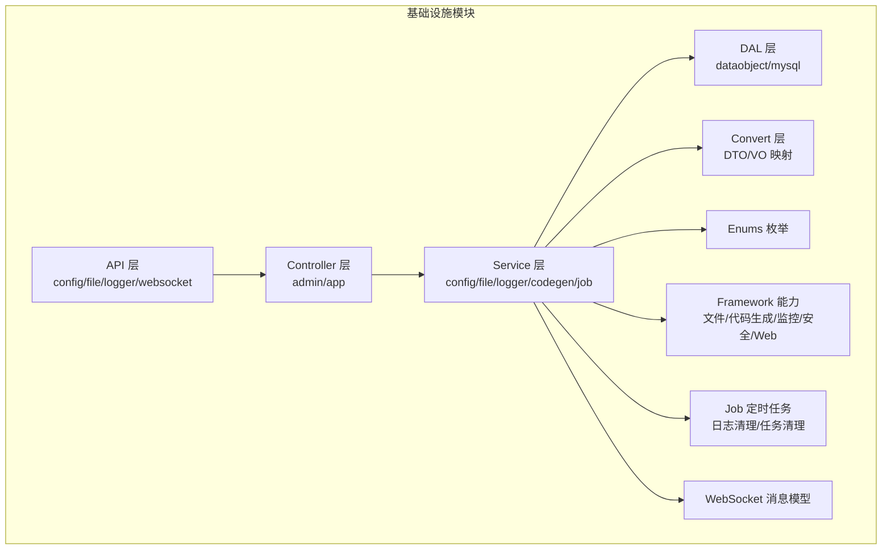
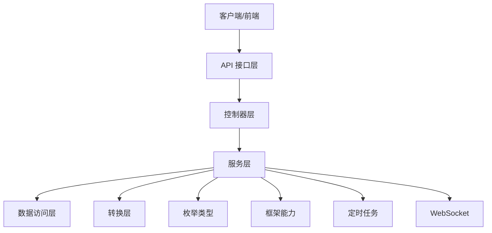
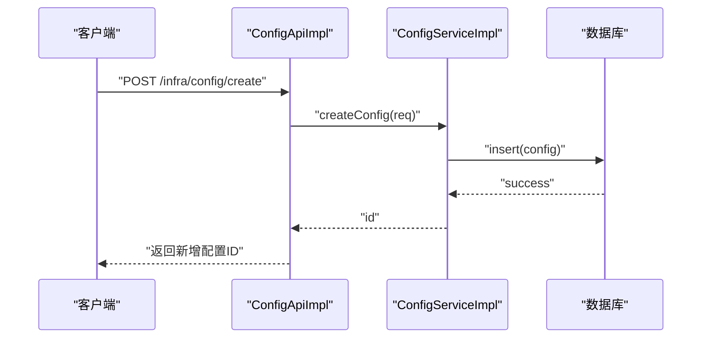
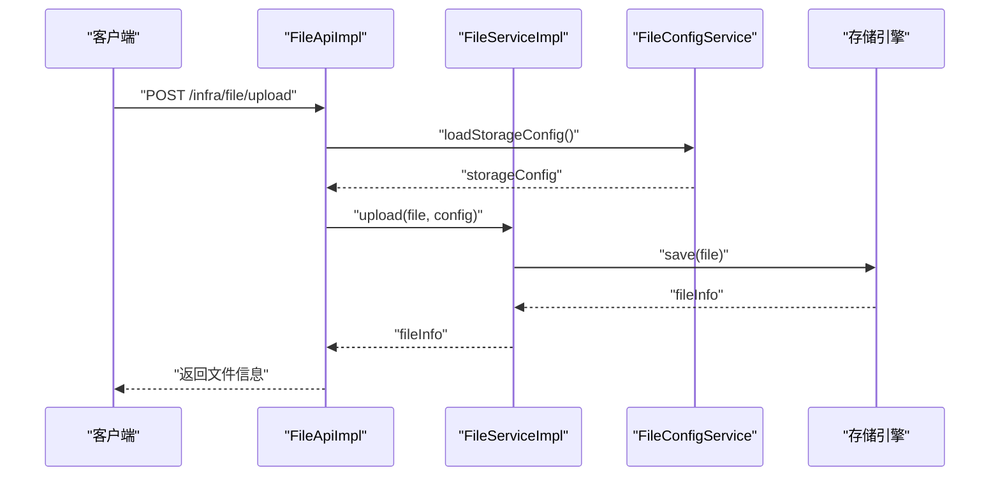
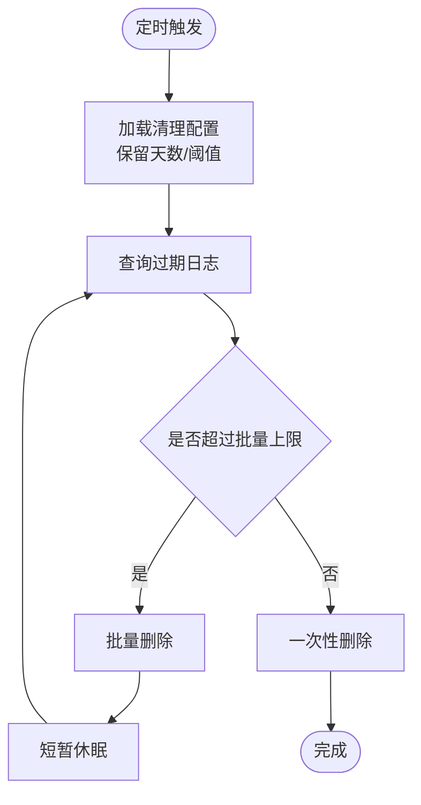
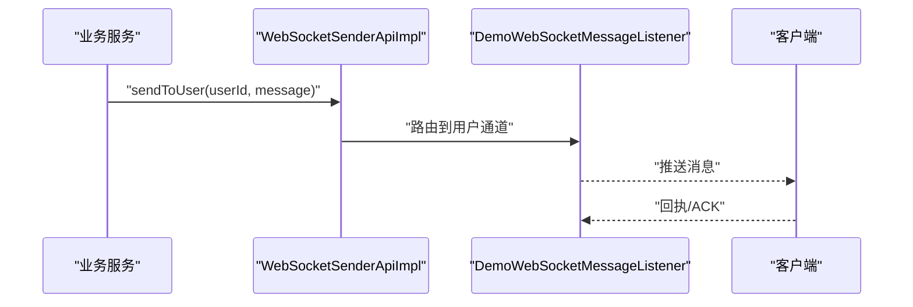
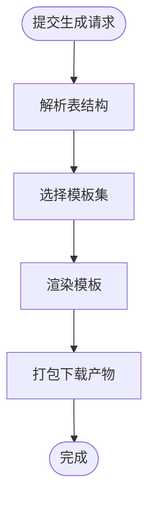
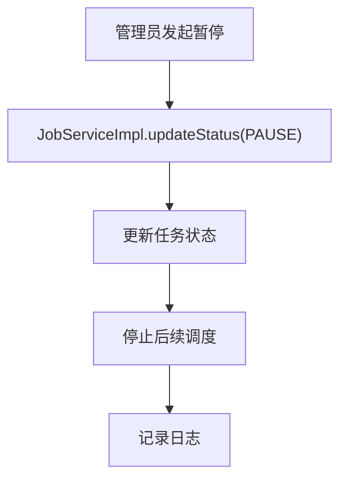
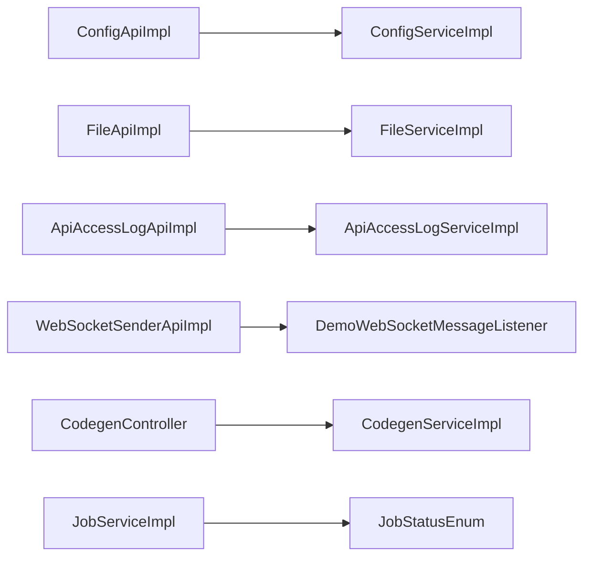

# 基础设施API

<cite>
**本文引用的文件**
- [ConfigApi.java](file://yudao-module-infra/src/main/java/cn/iocoder/yudao/module/infra/api/config/ConfigApi.java)
- [ConfigApiImpl.java](file://yudao-module-infra/src/main/java/cn/iocoder/yudao/module/infra/api/config/ConfigApiImpl.java)
- [FileApi.java](file://yudao-module-infra/src/main/java/cn/iocoder/yudao/module/infra/api/file/FileApi.java)
- [FileApiImpl.java](file://yudao-module-infra/src/main/java/cn/iocoder/yudao/module/infra/api/file/FileApiImpl.java)
- [ApiAccessLogApiImpl.java](file://yudao-module-infra/src/main/java/cn/iocoder/yudao/module/infra/api/logger/ApiAccessLogApiImpl.java)
- [ApiErrorLogApiImpl.java](file://yudao-module-infra/src/main/java/cn/iocoder/yudao/module/infra/api/logger/ApiErrorLogApiImpl.java)
- [WebSocketSenderApi.java](file://yudao-module-infra/src/main/java/cn/iocoder/yudao/module/infra/api/websocket/WebSocketSenderApi.java)
- [WebSocketSenderApiImpl.java](file://yudao-module-infra/src/main/java/cn/iocoder/yudao/module/infra/api/websocket/WebSocketSenderApiImpl.java)
- [CodegenController.java](file://yudao-module-infra/src/main/java/cn/iocoder/yudao/module/infra/controller/admin/codegen/CodegenController.java)
- [CodegenService.java](file://yudao-module-infra/src/main/java/cn/iocoder/yudao/module/infra/service/codegen/CodegenService.java)
- [CodegenServiceImpl.java](file://yudao-module-infra/src/main/java/cn/iocoder/yudao/module/infra/service/codegen/CodegenServiceImpl.java)
- [JobService.java](file://yudao-module-infra/src/main/java/cn/iocoder/yudao/module/infra/service/job/JobService.java)
- [JobServiceImpl.java](file://yudao-module-infra/src/main/java/cn/iocoder/yudao/module/infra/service/job/JobServiceImpl.java)
- [FileConfigService.java](file://yudao-module-infra/src/main/java/cn/iocoder/yudao/module/infra/service/file/FileConfigService.java)
- [FileConfigServiceImpl.java](file://yudao-module-infra/src/main/java/cn/iocoder/yudao/module/infra/service/file/FileConfigServiceImpl.java)
- [FileService.java](file://yudao-module-infra/src/main/java/cn/iocoder/yudao/module/infra/service/file/FileService.java)
- [FileServiceImpl.java](file://yudao-module-infra/src/main/java/cn/iocoder/yudao/module/infra/service/file/FileServiceImpl.java)
- [ConfigService.java](file://yudao-module-infra/src/main/java/cn/iocoder/yudao/module/infra/service/config/ConfigService.java)
- [ConfigServiceImpl.java](file://yudao-module-infra/src/main/java/cn/iocoder/yudao/module/infra/service/config/ConfigServiceImpl.java)
- [ApiAccessLogService.java](file://yudao-module-infra/src/main/java/cn/iocoder/yudao/module/infra/service/logger/ApiAccessLogService.java)
- [ApiAccessLogServiceImpl.java](file://yudao-module-infra/src/main/java/cn/iocoder/yudao/module/infra/service/logger/ApiAccessLogServiceImpl.java)
- [ApiErrorLogService.java](file://yudao-module-infra/src/main/java/cn/iocoder/yudao/module/infra/service/logger/ApiErrorLogService.java)
- [ApiErrorLogServiceImpl.java](file://yudao-module-infra/src/main/java/cn/iocoder/yudao/module/infra/service/logger/ApiErrorLogServiceImpl.java)
- [DemoWebSocketMessageListener.java](file://yudao-module-infra/src/main/java/cn/iocoder/yudao/module/infra/websocket/DemoWebSocketMessageListener.java)
- [DemoReceiveMessage.java](file://yudao-module-infra/src/main/java/cn/iocoder/yudao/module/infra/websocket/message/DemoReceiveMessage.java)
- [DemoSendMessage.java](file://yudao-module-infra/src/main/java/cn/iocoder/yudao/module/infra/websocket/message/DemoSendMessage.java)
- [AccessLogCleanJob.java](file://yudao-module-infra/src/main/java/cn/iocoder/yudao/module/infra/job/logger/AccessLogCleanJob.java)
- [ErrorLogCleanJob.java](file://yudao-module-infra/src/main/java/cn/iocoder/yudao/module/infra/job/logger/ErrorLogCleanJob.java)
- [JobLogCleanJob.java](file://yudao-module-infra/src/main/java/cn/iocoder/yudao/module/infra/job/job/JobLogCleanJob.java)
- [FileConfigConvert.java](file://yudao-module-infra/src/main/java/cn/iocoder/yudao/module/infra/convert/file/FileConfigConvert.java)
- [ConfigConvert.java](file://yudao-module-infra/src/main/java/cn/iocoder/yudao/module/infra/convert/config/ConfigConvert.java)
- [CodegenConvert.java](file://yudao-module-infra/src/main/java/cn/iocoder/yudao/module/infra/convert/codegen/CodegenConvert.java)
- [ConfigTypeEnum.java](file://yudao-module-infra/src/main/java/cn/iocoder/yudao/module/infra/enums/config/ConfigTypeEnum.java)
- [JobStatusEnum.java](file://yudao-module-infra/src/main/java/cn/iocoder/yudao/module/infra/enums/job/JobStatusEnum.java)
- [ApiErrorLogProcessStatusEnum.java](file://yudao-module-infra/src/main/java/cn/iocoder/yudao/module/infra/enums/logger/ApiErrorLogProcessStatusEnum.java)
- [ErrorCodeConstants.java](file://yudao-module-infra/src/main/java/cn/iocoder/yudao/module/infra/enums/ErrorCodeConstants.java)
- [YudaoServerApplication.java](file://yudao-server/src/main/java/cn/iocoder/yudao/server/YudaoServerApplication.java)
- [application.yaml](file://yudao-server/src/main/resources/application.yaml)
- [application-dev.yaml](file://yudao-server/src/main/resources/application-dev.yaml)
- [application-local.yaml](file://yudao-server/src/main/resources/application-local.yaml)
- [logback-spring.xml](file://yudao-server/src/main/resources/logback-spring.xml)
- [Dockerfile](file://yudao-server/Dockerfile)
</cite>

## 目录
1. [简介](#简介)
2. [项目结构](#项目结构)
3. [核心组件](#核心组件)
4. [架构总览](#架构总览)
5. [详细组件分析](#详细组件分析)
6. [依赖关系分析](#依赖关系分析)
7. [性能考虑](#性能考虑)
8. [故障排查指南](#故障排查指南)
9. [结论](#结论)
10. [附录](#附录)

## 简介
本文件为“基础设施模块”的API接口文档，覆盖以下能力域：
- 配置管理：系统配置的增删改查与分类管理
- 文件管理：文件上传、下载、删除与批量操作
- 日志管理：操作日志、错误日志的查询、导出与清理
- WebSocket：消息推送、连接管理与订阅机制
- 代码生成：表结构解析、代码模板生成与下载
- 定时任务：任务的创建、修改、暂停、恢复与清理

同时提供文件存储策略、日志级别配置、WebSocket连接池等技术细节，并给出完整的API调用示例与集成指南。

## 项目结构
基础设施模块位于 yudao-module-infra，采用按功能域分层的组织方式：
- api：对外暴露的领域接口（如配置、文件、日志、WebSocket）
- controller：Admin与App两类控制器，Admin用于后台管理，App用于移动端或开放接口
- service：业务服务层，封装具体业务逻辑
- dal：数据访问层（DO/DAO/MySQL）
- convert：DTO/VO与DO之间的映射转换
- enums：枚举类型（配置类型、任务状态、日志处理状态等）
- framework：框架级能力（文件存储、代码生成、监控、安全、Web）
- job：定时任务作业（日志清理、任务日志清理）
- websocket：WebSocket消息模型与监听器
- resources：模板资源（代码生成模板、文件存储配置）

图表来源
- [ConfigApi.java](file://yudao-module-infra/src/main/java/cn/iocoder/yudao/module/infra/api/config/ConfigApi.java)
- [FileApi.java](file://yudao-module-infra/src/main/java/cn/iocoder/yudao/module/infra/api/file/FileApi.java)
- [ApiAccessLogApiImpl.java](file://yudao-module-infra/src/main/java/cn/iocoder/yudao/module/infra/api/logger/ApiAccessLogApiImpl.java)
- [WebSocketSenderApi.java](file://yudao-module-infra/src/main/java/cn/iocoder/yudao/module/infra/api/websocket/WebSocketSenderApi.java)
- [CodegenController.java](file://yudao-module-infra/src/main/java/cn/iocoder/yudao/module/infra/controller/admin/codegen/CodegenController.java)
- [FileConfigService.java](file://yudao-module-infra/src/main/java/cn/iocoder/yudao/module/infra/service/file/FileConfigService.java)
- [ConfigService.java](file://yudao-module-infra/src/main/java/cn/iocoder/yudao/module/infra/service/config/ConfigService.java)
- [ApiAccessLogService.java](file://yudao-module-infra/src/main/java/cn/iocoder/yudao/module/infra/service/logger/ApiAccessLogService.java)
- [JobService.java](file://yudao-module-infra/src/main/java/cn/iocoder/yudao/module/infra/service/job/JobService.java)

章节来源
- [YudaoServerApplication.java](file://yudao-server/src/main/java/cn/iocoder/yudao/server/YudaoServerApplication.java)
- [application.yaml](file://yudao-server/src/main/resources/application.yaml)
- [application-dev.yaml](file://yudao-server/src/main/resources/application-dev.yaml)
- [application-local.yaml](file://yudao-server/src/main/resources/application-local.yaml)

## 核心组件
- 配置管理API：通过 ConfigApi 提供系统配置的增删改查与分类管理能力；后端由 ConfigServiceImpl 实现，支持按类型过滤与分页查询。
- 文件管理API：通过 FileApi 提供文件上传、下载、删除与批量操作；FileConfigService 管理文件存储配置，FileServiceImpl 执行具体文件操作。
- 日志管理API：通过 ApiAccessLogApiImpl 与 ApiErrorLogApiImpl 提供日志查询、导出与清理；配套定时任务 AccessLogCleanJob、ErrorLogCleanJob、JobLogCleanJob。
- WebSocket API：通过 WebSocketSenderApi 提供消息推送能力；DemoWebSocketMessageListener 与消息模型 DemoReceiveMessage/DemoSendMessage 展示订阅与消息收发。
- 代码生成API：通过 CodegenController 与 CodegenService 提供表结构解析、模板选择与代码生成下载。
- 定时任务API：通过 JobService/JobServiceImpl 提供任务的创建、修改、暂停、恢复与清理。

章节来源
- [ConfigApi.java](file://yudao-module-infra/src/main/java/cn/iocoder/yudao/module/infra/api/config/ConfigApi.java)
- [FileApi.java](file://yudao-module-infra/src/main/java/cn/iocoder/yudao/module/infra/api/file/FileApi.java)
- [ApiAccessLogApiImpl.java](file://yudao-module-infra/src/main/java/cn/iocoder/yudao/module/infra/api/logger/ApiAccessLogApiImpl.java)
- [ApiErrorLogApiImpl.java](file://yudao-module-infra/src/main/java/cn/iocoder/yudao/module/infra/api/logger/ApiErrorLogApiImpl.java)
- [WebSocketSenderApi.java](file://yudao-module-infra/src/main/java/cn/iocoder/yudao/module/infra/api/websocket/WebSocketSenderApi.java)
- [CodegenController.java](file://yudao-module-infra/src/main/java/cn/iocoder/yudao/module/infra/controller/admin/codegen/CodegenController.java)
- [JobService.java](file://yudao-module-infra/src/main/java/cn/iocoder/yudao/module/infra/service/job/JobService.java)

## 架构总览
基础设施模块遵循“接口-控制器-服务-数据访问-转换-枚举-框架-定时任务-WebSocket”的分层架构，各层职责清晰，耦合度低，便于扩展与维护。

图表来源
- [ConfigApiImpl.java](file://yudao-module-infra/src/main/java/cn/iocoder/yudao/module/infra/api/config/ConfigApiImpl.java)
- [FileApiImpl.java](file://yudao-module-infra/src/main/java/cn/iocoder/yudao/module/infra/api/file/FileApiImpl.java)
- [ApiAccessLogServiceImpl.java](file://yudao-module-infra/src/main/java/cn/iocoder/yudao/module/infra/service/logger/ApiAccessLogServiceImpl.java)
- [WebSocketSenderApiImpl.java](file://yudao-module-infra/src/main/java/cn/iocoder/yudao/module/infra/api/websocket/WebSocketSenderApiImpl.java)
- [CodegenServiceImpl.java](file://yudao-module-infra/src/main/java/cn/iocoder/yudao/module/infra/service/codegen/CodegenServiceImpl.java)
- [JobServiceImpl.java](file://yudao-module-infra/src/main/java/cn/iocoder/yudao/module/infra/service/job/JobServiceImpl.java)

## 详细组件分析

### 配置管理API
- 功能概述
  - 支持系统配置的新增、删除、修改、查询与分页列表
  - 支持按配置类型进行分类筛选
  - 支持配置键值对的动态更新与生效
- 关键接口
  - ConfigApi：声明配置管理相关方法（新增、删除、修改、分页查询、详情等）
  - ConfigApiImpl：接口实现，负责调用 ConfigService
  - ConfigService/ConfigServiceImpl：业务逻辑实现，封装持久化与缓存更新
  - ConfigConvert：配置对象转换
  - ConfigTypeEnum：配置类型枚举
- 典型流程（新增配置）

图表来源
- [ConfigApiImpl.java](file://yudao-module-infra/src/main/java/cn/iocoder/yudao/module/infra/api/config/ConfigApiImpl.java)
- [ConfigServiceImpl.java](file://yudao-module-infra/src/main/java/cn/iocoder/yudao/module/infra/service/config/ConfigServiceImpl.java)

章节来源
- [ConfigApi.java](file://yudao-module-infra/src/main/java/cn/iocoder/yudao/module/infra/api/config/ConfigApi.java)
- [ConfigApiImpl.java](file://yudao-module-infra/src/main/java/cn/iocoder/yudao/module/infra/api/config/ConfigApiImpl.java)
- [ConfigService.java](file://yudao-module-infra/src/main/java/cn/iocoder/yudao/module/infra/service/config/ConfigService.java)
- [ConfigServiceImpl.java](file://yudao-module-infra/src/main/java/cn/iocoder/yudao/module/infra/service/config/ConfigServiceImpl.java)
- [ConfigConvert.java](file://yudao-module-infra/src/main/java/cn/iocoder/yudao/module/infra/convert/config/ConfigConvert.java)
- [ConfigTypeEnum.java](file://yudao-module-infra/src/main/java/cn/iocoder/yudao/module/infra/enums/config/ConfigTypeEnum.java)

### 文件管理API
- 功能概述
  - 文件上传：支持单文件与多文件上传，支持多种存储策略（本地、S3、FTP、SFTP）
  - 文件下载：根据文件编号下载对应文件
  - 文件删除：支持单个与批量删除
  - 文件配置：管理文件存储策略与参数
- 关键接口
  - FileApi：声明文件相关方法（上传、下载、删除、分页列表、配置管理等）
  - FileApiImpl：接口实现
  - FileService/FileServiceImpl：文件业务逻辑
  - FileConfigService/FileConfigServiceImpl：文件存储配置管理
  - FileConfigConvert：文件配置转换
- 存储策略
  - 本地存储：适合开发与小规模部署
  - S3兼容存储：适合云存储与高可用场景
  - FTP/SFTP：适合传统企业环境
- 典型流程（上传文件）

图表来源
- [FileApiImpl.java](file://yudao-module-infra/src/main/java/cn/iocoder/yudao/module/infra/api/file/FileApiImpl.java)
- [FileServiceImpl.java](file://yudao-module-infra/src/main/java/cn/iocoder/yudao/module/infra/service/file/FileServiceImpl.java)
- [FileConfigServiceImpl.java](file://yudao-module-infra/src/main/java/cn/iocoder/yudao/module/infra/service/file/FileConfigServiceImpl.java)

章节来源
- [FileApi.java](file://yudao-module-infra/src/main/java/cn/iocoder/yudao/module/infra/api/file/FileApi.java)
- [FileApiImpl.java](file://yudao-module-infra/src/main/java/cn/iocoder/yudao/module/infra/api/file/FileApiImpl.java)
- [FileService.java](file://yudao-module-infra/src/main/java/cn/iocoder/yudao/module/infra/service/file/FileService.java)
- [FileServiceImpl.java](file://yudao-module-infra/src/main/java/cn/iocoder/yudao/module/infra/service/file/FileServiceImpl.java)
- [FileConfigService.java](file://yudao-module-infra/src/main/java/cn/iocoder/yudao/module/infra/service/file/FileConfigService.java)
- [FileConfigServiceImpl.java](file://yudao-module-infra/src/main/java/cn/iocoder/yudao/module/infra/service/file/FileConfigServiceImpl.java)
- [FileConfigConvert.java](file://yudao-module-infra/src/main/java/cn/iocoder/yudao/module/infra/convert/file/FileConfigConvert.java)

### 日志管理API
- 功能概述
  - 操作日志：记录接口访问、参数、结果与耗时
  - 错误日志：记录异常堆栈、处理状态与重试次数
  - 查询与导出：支持分页查询与Excel导出
  - 清理策略：定时清理过期日志，释放存储空间
- 关键接口
  - ApiAccessLogApiImpl：操作日志查询与导出
  - ApiErrorLogApiImpl：错误日志查询与导出
  - ApiAccessLogService/ApiAccessLogServiceImpl：操作日志业务
  - ApiErrorLogService/ApiErrorLogServiceImpl：错误日志业务
  - AccessLogCleanJob：操作日志清理
  - ErrorLogCleanJob：错误日志清理
  - JobLogCleanJob：定时任务日志清理
- 典型流程（清理过期日志）

图表来源
- [AccessLogCleanJob.java](file://yudao-module-infra/src/main/java/cn/iocoder/yudao/module/infra/job/logger/AccessLogCleanJob.java)
- [ErrorLogCleanJob.java](file://yudao-module-infra/src/main/java/cn/iocoder/yudao/module/infra/job/logger/ErrorLogCleanJob.java)
- [JobLogCleanJob.java](file://yudao-module-infra/src/main/java/cn/iocoder/yudao/module/infra/job/job/JobLogCleanJob.java)

章节来源
- [ApiAccessLogApiImpl.java](file://yudao-module-infra/src/main/java/cn/iocoder/yudao/module/infra/api/logger/ApiAccessLogApiImpl.java)
- [ApiErrorLogApiImpl.java](file://yudao-module-infra/src/main/java/cn/iocoder/yudao/module/infra/api/logger/ApiErrorLogApiImpl.java)
- [ApiAccessLogService.java](file://yudao-module-infra/src/main/java/cn/iocoder/yudao/module/infra/service/logger/ApiAccessLogService.java)
- [ApiAccessLogServiceImpl.java](file://yudao-module-infra/src/main/java/cn/iocoder/yudao/module/infra/service/logger/ApiAccessLogServiceImpl.java)
- [ApiErrorLogService.java](file://yudao-module-infra/src/main/java/cn/iocoder/yudao/module/infra/service/logger/ApiErrorLogService.java)
- [ApiErrorLogServiceImpl.java](file://yudao-module-infra/src/main/java/cn/iocoder/yudao/module/infra/service/logger/ApiErrorLogServiceImpl.java)
- [ApiErrorLogProcessStatusEnum.java](file://yudao-module-infra/src/main/java/cn/iocoder/yudao/module/infra/enums/logger/ApiErrorLogProcessStatusEnum.java)

### WebSocket API
- 功能概述
  - 消息推送：向指定用户或频道推送消息
  - 连接管理：建立、保持与断开WebSocket连接
  - 订阅机制：基于用户标识或频道进行订阅与退订
- 关键接口
  - WebSocketSenderApi：声明消息发送接口
  - WebSocketSenderApiImpl：消息发送实现
  - DemoWebSocketMessageListener：消息监听器示例
  - DemoReceiveMessage/DemoSendMessage：消息模型
- 典型流程（消息推送）

图表来源
- [WebSocketSenderApiImpl.java](file://yudao-module-infra/src/main/java/cn/iocoder/yudao/module/infra/api/websocket/WebSocketSenderApiImpl.java)
- [DemoWebSocketMessageListener.java](file://yudao-module-infra/src/main/java/cn/iocoder/yudao/module/infra/websocket/DemoWebSocketMessageListener.java)
- [DemoReceiveMessage.java](file://yudao-module-infra/src/main/java/cn/iocoder/yudao/module/infra/websocket/message/DemoReceiveMessage.java)
- [DemoSendMessage.java](file://yudao-module-infra/src/main/java/cn/iocoder/yudao/module/infra/websocket/message/DemoSendMessage.java)

章节来源
- [WebSocketSenderApi.java](file://yudao-module-infra/src/main/java/cn/iocoder/yudao/module/infra/api/websocket/WebSocketSenderApi.java)
- [WebSocketSenderApiImpl.java](file://yudao-module-infra/src/main/java/cn/iocoder/yudao/module/infra/api/websocket/WebSocketSenderApiImpl.java)
- [DemoWebSocketMessageListener.java](file://yudao-module-infra/src/main/java/cn/iocoder/yudao/module/infra/websocket/DemoWebSocketMessageListener.java)
- [DemoReceiveMessage.java](file://yudao-module-infra/src/main/java/cn/iocoder/yudao/module/infra/websocket/message/DemoReceiveMessage.java)
- [DemoSendMessage.java](file://yudao-module-infra/src/main/java/cn/iocoder/yudao/module/infra/websocket/message/DemoSendMessage.java)

### 代码生成API
- 功能概述
  - 表结构解析：从数据库读取表与字段元数据
  - 模板选择：支持多种前端框架与模板类型
  - 代码生成与下载：生成Controller、Service、Mapper、Vue页面等
- 关键接口
  - CodegenController：管理端控制器，提供生成入口
  - CodegenService/CodegenServiceImpl：生成业务逻辑
  - CodegenConvert：生成相关转换
  - 模板资源：位于 resources/codegen 下，包含 Java、SQL、Vue 等模板族
- 典型流程（代码生成）

图表来源
- [CodegenController.java](file://yudao-module-infra/src/main/java/cn/iocoder/yudao/module/infra/controller/admin/codegen/CodegenController.java)
- [CodegenServiceImpl.java](file://yudao-module-infra/src/main/java/cn/iocoder/yudao/module/infra/service/codegen/CodegenServiceImpl.java)
- [CodegenConvert.java](file://yudao-module-infra/src/main/java/cn/iocoder/yudao/module/infra/convert/codegen/CodegenConvert.java)

章节来源
- [CodegenController.java](file://yudao-module-infra/src/main/java/cn/iocoder/yudao/module/infra/controller/admin/codegen/CodegenController.java)
- [CodegenService.java](file://yudao-module-infra/src/main/java/cn/iocoder/yudao/module/infra/service/codegen/CodegenService.java)
- [CodegenServiceImpl.java](file://yudao-module-infra/src/main/java/cn/iocoder/yudao/module/infra/service/codegen/CodegenServiceImpl.java)
- [CodegenConvert.java](file://yudao-module-infra/src/main/java/cn/iocoder/yudao/module/infra/convert/codegen/CodegenConvert.java)

### 定时任务API
- 功能概述
  - 任务生命周期管理：创建、修改、暂停、恢复、删除
  - 任务日志：记录执行时间、状态、异常
  - 清理策略：定期清理历史执行日志
- 关键接口
  - JobService/JobServiceImpl：任务管理与调度
  - JobStatusEnum：任务状态枚举
  - JobLogCleanJob：任务日志清理
- 典型流程（暂停任务）

图表来源
- [JobServiceImpl.java](file://yudao-module-infra/src/main/java/cn/iocoder/yudao/module/infra/service/job/JobServiceImpl.java)
- [JobLogCleanJob.java](file://yudao-module-infra/src/main/java/cn/iocoder/yudao/module/infra/job/job/JobLogCleanJob.java)
- [JobStatusEnum.java](file://yudao-module-infra/src/main/java/cn/iocoder/yudao/module/infra/enums/job/JobStatusEnum.java)

章节来源
- [JobService.java](file://yudao-module-infra/src/main/java/cn/iocoder/yudao/module/infra/service/job/JobService.java)
- [JobServiceImpl.java](file://yudao-module-infra/src/main/java/cn/iocoder/yudao/module/infra/service/job/JobServiceImpl.java)
- [JobStatusEnum.java](file://yudao-module-infra/src/main/java/cn/iocoder/yudao/module/infra/enums/job/JobStatusEnum.java)
- [JobLogCleanJob.java](file://yudao-module-infra/src/main/java/cn/iocoder/yudao/module/infra/job/job/JobLogCleanJob.java)

## 依赖关系分析
- 组件内聚与耦合
  - API 层仅暴露领域接口，不直接依赖具体实现，降低耦合
  - Service 层聚合 DAL、Convert、Enum 与 Framework 能力，形成高内聚
  - Controller 仅编排调用，避免复杂业务逻辑
- 外部依赖
  - 文件存储：抽象于 FileConfigService，可替换实现
  - 定时任务：基于 Quartz 或框架内置调度
  - 日志：统一通过框架能力输出，支持多端采集
- 循环依赖
  - 未发现循环依赖，层次清晰

图表来源
- [ConfigApiImpl.java](file://yudao-module-infra/src/main/java/cn/iocoder/yudao/module/infra/api/config/ConfigApiImpl.java)
- [FileApiImpl.java](file://yudao-module-infra/src/main/java/cn/iocoder/yudao/module/infra/api/file/FileApiImpl.java)
- [ApiAccessLogApiImpl.java](file://yudao-module-infra/src/main/java/cn/iocoder/yudao/module/infra/api/logger/ApiAccessLogApiImpl.java)
- [WebSocketSenderApiImpl.java](file://yudao-module-infra/src/main/java/cn/iocoder/yudao/module/infra/api/websocket/WebSocketSenderApiImpl.java)
- [CodegenController.java](file://yudao-module-infra/src/main/java/cn/iocoder/yudao/module/infra/controller/admin/codegen/CodegenController.java)
- [JobServiceImpl.java](file://yudao-module-infra/src/main/java/cn/iocoder/yudao/module/infra/service/job/JobServiceImpl.java)

章节来源
- [ErrorCodeConstants.java](file://yudao-module-infra/src/main/java/cn/iocoder/yudao/module/infra/enums/ErrorCodeConstants.java)

## 性能考虑
- 文件存储
  - 优先使用 S3 兼容存储以提升并发与可靠性
  - 上传采用流式写入，避免大文件内存占用
- 日志管理
  - 合理设置清理周期，避免磁盘膨胀
  - 导出采用分页与异步任务，避免阻塞主线程
- WebSocket
  - 使用连接池与心跳保活，避免长连接泄漏
  - 按用户维度路由，减少广播风暴
- 定时任务
  - 任务状态持久化，失败自动重试并限频
  - 清理任务日志，控制历史数据量

## 故障排查指南
- 配置管理
  - 现象：配置无法生效
  - 排查：确认配置类型与键名正确；检查缓存刷新策略
- 文件管理
  - 现象：上传成功但无法下载
  - 排查：核对存储配置、访问权限与URL签名
- 日志管理
  - 现象：日志导出为空
  - 排查：确认查询条件与时间范围；检查导出线程状态
- WebSocket
  - 现象：消息未送达
  - 排查：确认用户在线状态与订阅关系；检查监听器是否注册
- 代码生成
  - 现象：生成失败或模板缺失
  - 排查：确认数据库连通性与表存在；检查模板目录完整性
- 定时任务
  - 现象：任务未执行或重复执行
  - 排查：检查任务状态与调度表达式；核对清理策略

章节来源
- [ErrorCodeConstants.java](file://yudao-module-infra/src/main/java/cn/iocoder/yudao/module/infra/enums/ErrorCodeConstants.java)

## 结论
基础设施模块提供了完善的配置、文件、日志、WebSocket、代码生成与定时任务能力，具备良好的扩展性与稳定性。建议在生产环境中结合云存储与分布式调度，持续优化日志清理与连接池配置，确保系统长期高效运行。

## 附录

### 技术细节
- 文件存储策略
  - 本地：适合开发与小规模部署
  - S3：适合高并发与跨地域
  - FTP/SFTP：适合传统企业环境
- 日志级别配置
  - 在 application.yaml 中配置根日志级别与包级别
  - 开发环境可开启 DEBUG，生产环境建议 INFO
- WebSocket 连接池
  - 建议限制最大连接数与空闲超时
  - 心跳间隔与重连策略需结合网络质量调整

章节来源
- [application.yaml](file://yudao-server/src/main/resources/application.yaml)
- [application-dev.yaml](file://yudao-server/src/main/resources/application-dev.yaml)
- [application-local.yaml](file://yudao-server/src/main/resources/application-local.yaml)
- [logback-spring.xml](file://yudao-server/src/main/resources/logback-spring.xml)

### API 调用示例与集成指南
- 配置管理
  - 新增配置：POST /infra/config/create
  - 删除配置：DELETE /infra/config/delete/{id}
  - 修改配置：PUT /infra/config/update
  - 分页查询：GET /infra/config/list
- 文件管理
  - 上传文件：POST /infra/file/upload
  - 下载文件：GET /infra/file/download/{id}
  - 删除文件：DELETE /infra/file/delete/{id}
  - 批量删除：POST /infra/file/delete-batch
  - 文件配置：GET/POST /infra/file/config
- 日志管理
  - 操作日志查询：GET /infra/log/access/page
  - 操作日志导出：POST /infra/log/access/export
  - 错误日志查询：GET /infra/log/error/page
  - 错误日志导出：POST /infra/log/error/export
  - 清理日志：POST /infra/log/clean
- WebSocket
  - 发送消息：WebSocket /infra/ws/send
  - 订阅频道：WebSocket /infra/ws/subscribe
- 代码生成
  - 生成代码：POST /infra/codegen/generate
  - 下载产物：GET /infra/codegen/download/{taskId}
- 定时任务
  - 创建任务：POST /infra/job/create
  - 更新任务：PUT /infra/job/update
  - 暂停任务：POST /infra/job/pause/{id}
  - 恢复任务：POST /infra/job/resume/{id}
  - 删除任务：DELETE /infra/job/delete/{id}

章节来源
- [ConfigApi.java](file://yudao-module-infra/src/main/java/cn/iocoder/yudao/module/infra/api/config/ConfigApi.java)
- [FileApi.java](file://yudao-module-infra/src/main/java/cn/iocoder/yudao/module/infra/api/file/FileApi.java)
- [ApiAccessLogApiImpl.java](file://yudao-module-infra/src/main/java/cn/iocoder/yudao/module/infra/api/logger/ApiAccessLogApiImpl.java)
- [ApiErrorLogApiImpl.java](file://yudao-module-infra/src/main/java/cn/iocoder/yudao/module/infra/api/logger/ApiErrorLogApiImpl.java)
- [WebSocketSenderApi.java](file://yudao-module-infra/src/main/java/cn/iocoder/yudao/module/infra/api/websocket/WebSocketSenderApi.java)
- [CodegenController.java](file://yudao-module-infra/src/main/java/cn/iocoder/yudao/module/infra/controller/admin/codegen/CodegenController.java)
- [JobService.java](file://yudao-module-infra/src/main/java/cn/iocoder/yudao/module/infra/service/job/JobService.java)