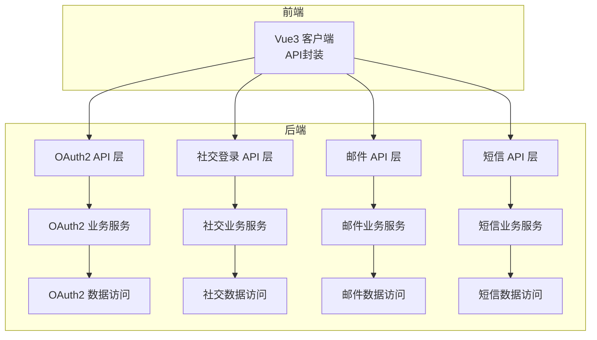
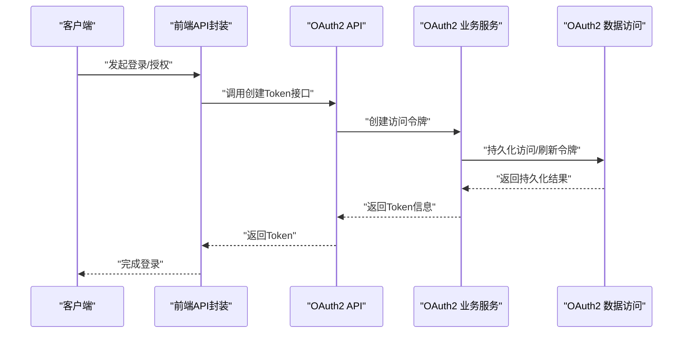
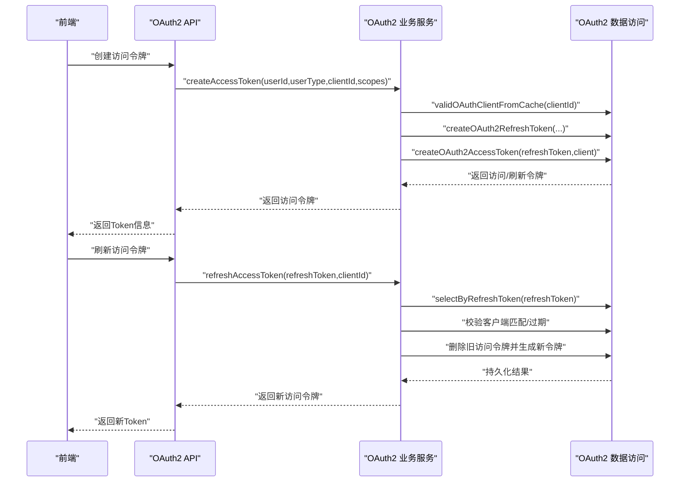
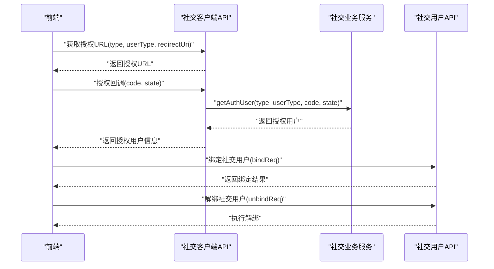
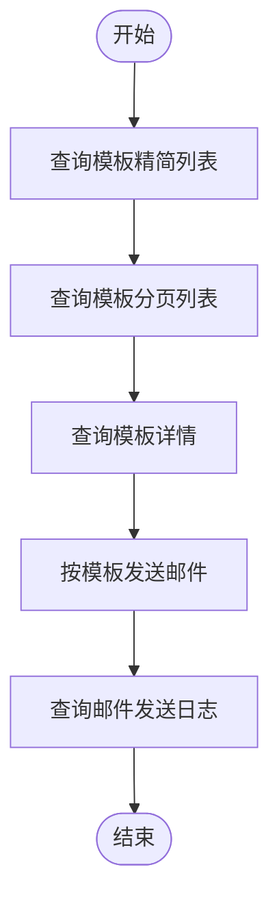
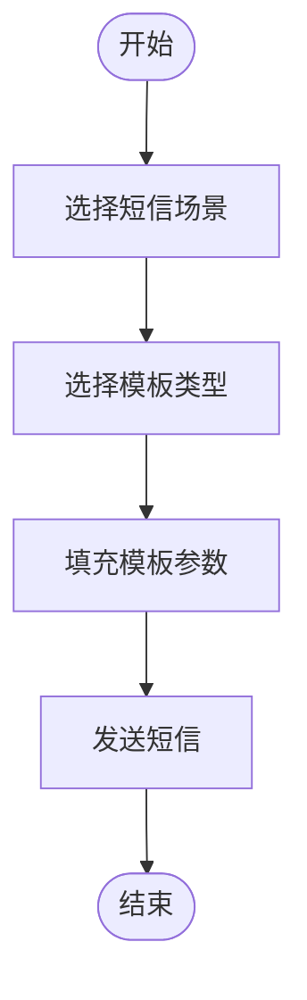
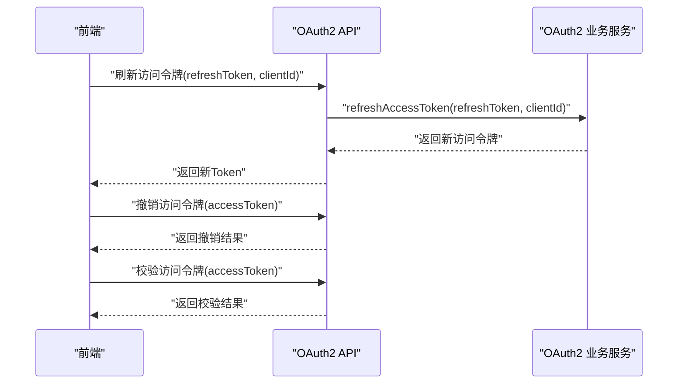
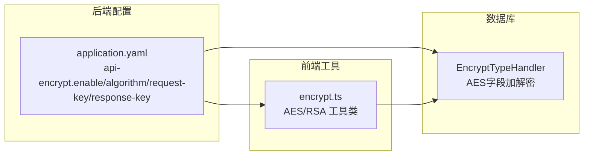
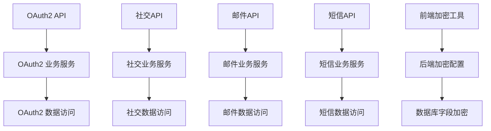

# 安全认证API

<cite>
**本文引用的文件**
- [OAuth2TokenCommonApi.java](file://yudao-framework/yudao-common/src/main/java/cn/iocoder/yudao/framework/common/biz/system/oauth2/OAuth2TokenCommonApi.java)
- [OAuth2TokenServiceImpl.java](file://yudao-module-system/src/main/java/cn/iocoder/yudao/module/system/service/oauth2/OAuth2TokenServiceImpl.java)
- [OAuth2GrantServiceImpl.java](file://yudao-module-system/src/main/java/cn/iocoder/yudao/module/system/service/oauth2/OAuth2GrantServiceImpl.java)
- [OAuth2TokenApiImpl.java](file://yudao-module-system/src/main/java/cn/iocoder/yudao/module/system/api/oauth2/OAuth2TokenApiImpl.java)
- [OAuth2ClientApiImpl.java](file://yudao-module-system/src/main/java/cn/iocoder/yudao/module/system/api/oauth2/OAuth2ClientApiImpl.java)
- [SocialClientApiImpl.java](file://yudao-module-system/src/main/java/cn/iocoder/yudao/module/system/api/social/SocialClientApiImpl.java)
- [SocialUserApiImpl.java](file://yudao-module-system/src/main/java/cn/iocoder/yudao/module/system/api/social/SocialUserApiImpl.java)
- [SocialTypeEnum.java](file://yudao-module-system/src/main/java/cn/iocoder/yudao/module/system/enums/social/SocialTypeEnum.java)
- [SmsSceneEnum.java](file://yudao-module-system/src/main/java/cn/iocoder/yudao/module/system/enums/sms/SmsSceneEnum.java)
- [SmsTemplateTypeEnum.java](file://yudao-module-system/src/main/java/cn/iocoder/yudao/module/system/enums/sms/SmsTemplateTypeEnum.java)
- [client.ts](file://yudao-ui/yudao-ui-admin-vue3/src/api/system/oauth2/client.ts)
- [index.ts](file://yudao-ui/yudao-ui-admin-vue3/src/api/system/mail/template/index.ts)
- [application.yaml](file://yudao-server/src/main/resources/application.yaml)
- [encrypt.ts](file://yudao-ui/yudao-ui-admin-vue3/src/utils/encrypt.ts)
- [EncryptTypeHandler.java](file://yudao-framework/yudao-spring-boot-starter-mybatis/src/main/java/cn/iocoder/yudao/framework/mybatis/core/type/EncryptTypeHandler.java)
- [OAuth2TokenServiceImplTest.java](file://yudao-module-system/src/test/java/cn/iocoder/yudao/module/system/service/oauth2/OAuth2TokenServiceImplTest.java)
- [AdminAuthServiceImplTest.java](file://yudao-module-system/src/test/java/cn/iocoder/yudao/module/system/service/auth/AdminAuthServiceImplTest.java)
- [LoginForm.vue](file://yudao-ui/yudao-ui-admin-vue3/src/views/Login/components/LoginForm.vue)
</cite>

## 目录
1. [简介](#简介)
2. [项目结构](#项目结构)
3. [核心组件](#核心组件)
4. [架构总览](#架构总览)
5. [详细组件分析](#详细组件分析)
6. [依赖分析](#依赖分析)
7. [性能考虑](#性能考虑)
8. [故障排查指南](#故障排查指南)
9. [结论](#结论)
10. [附录](#附录)

## 简介
本文件面向安全认证模块的API接口文档，覆盖以下能力：
- OAuth2认证API：授权码模式、密码模式、客户端凭证模式等的接口规范与流程说明
- 社交登录API：微信、QQ、钉钉等第三方平台的授权登录、用户绑定与解绑接口
- 邮件发送API：模板邮件、批量邮件、邮件记录查询接口规范
- 短信发送API：验证码发送、通知短信、模板短信等接口说明
- Token管理API：Token刷新、撤销、验证等安全相关接口
- 验证码API：图形验证码、短信验证码的生成与验证接口
- 安全策略配置：防刷机制、加密传输等技术细节
- 提供完整认证流程示例与错误处理方案

## 项目结构
安全认证相关能力主要分布在如下模块与目录：
- 后端服务模块：yudao-module-system（系统模块），包含OAuth2、社交登录、邮件、短信、验证码等子域
- 通用框架：yudao-framework（公共组件、安全、加解密、MyBatis扩展等）
- 前端接口封装：yudao-ui/yudao-ui-admin-vue3（API层TS封装）

图示来源
- [OAuth2TokenApiImpl.java:1-30](file://yudao-module-system/src/main/java/cn/iocoder/yudao/module/system/api/oauth2/OAuth2TokenApiImpl.java#L1-L30)
- [SocialClientApiImpl.java:1-67](file://yudao-module-system/src/main/java/cn/iocoder/yudao/module/system/api/social/SocialClientApiImpl.java#L1-L67)
- [index.ts:1-68](file://yudao-ui/yudao-ui-admin-vue3/src/api/system/mail/template/index.ts#L1-L68)

章节来源
- [OAuth2TokenApiImpl.java:1-30](file://yudao-module-system/src/main/java/cn/iocoder/yudao/module/system/api/oauth2/OAuth2TokenApiImpl.java#L1-L30)
- [SocialClientApiImpl.java:1-67](file://yudao-module-system/src/main/java/cn/iocoder/yudao/module/system/api/social/SocialClientApiImpl.java#L1-L67)
- [index.ts:1-68](file://yudao-ui/yudao-ui-admin-vue3/src/api/system/mail/template/index.ts#L1-L68)

## 核心组件
- OAuth2 Token API接口：对外暴露创建、校验、移除、刷新Token的能力
- OAuth2 授权服务：隐式模式等授权流程
- 社交登录API：授权URL生成、微信JS-SDK签名、小程序手机号解密、订阅消息模板等
- 社交用户API：绑定、解绑、按用户或授权码查询社交用户
- 邮件模板与发送：模板管理、批量发送、日志查询
- 短信模板与发送：模板类型、场景、发送与回调
- 安全与加密：API加解密、数据库字段加密

章节来源
- [OAuth2TokenCommonApi.java:1-49](file://yudao-framework/yudao-common/src/main/java/cn/iocoder/yudao/framework/common/biz/system/oauth2/OAuth2TokenCommonApi.java#L1-L49)
- [OAuth2TokenServiceImpl.java:24-69](file://yudao-module-system/src/main/java/cn/iocoder/yudao/module/system/service/oauth2/OAuth2TokenServiceImpl.java#L24-L69)
- [OAuth2GrantServiceImpl.java:1-38](file://yudao-module-system/src/main/java/cn/iocoder/yudao/module/system/service/oauth2/OAuth2GrantServiceImpl.java#L1-L38)
- [SocialClientApiImpl.java:1-67](file://yudao-module-system/src/main/java/cn/iocoder/yudao/module/system/api/social/SocialClientApiImpl.java#L1-L67)
- [SocialUserApiImpl.java:1-45](file://yudao-module-system/src/main/java/cn/iocoder/yudao/module/system/api/social/SocialUserApiImpl.java#L1-L45)
- [SmsSceneEnum.java:1-53](file://yudao-module-system/src/main/java/cn/iocoder/yudao/module/system/enums/sms/SmsSceneEnum.java#L1-L53)
- [SmsTemplateTypeEnum.java:1-25](file://yudao-module-system/src/main/java/cn/iocoder/yudao/module/system/enums/sms/SmsTemplateTypeEnum.java#L1-L25)

## 架构总览
安全认证API采用分层架构：
- 表现层：前端通过TS封装调用后端REST接口
- API层：提供OAuth2、社交、邮件、短信等对外接口
- 业务层：实现具体认证、社交、邮件、短信逻辑
- 数据访问层：持久化Token、社交用户、邮件模板、短信模板等

图示来源
- [OAuth2TokenApiImpl.java:25-30](file://yudao-module-system/src/main/java/cn/iocoder/yudao/module/system/api/oauth2/OAuth2TokenApiImpl.java#L25-L30)
- [OAuth2TokenServiceImpl.java:61-69](file://yudao-module-system/src/main/java/cn/iocoder/yudao/module/system/service/oauth2/OAuth2TokenServiceImpl.java#L61-L69)

## 详细组件分析

### OAuth2认证API
- 接口职责
  - 创建访问令牌：支持传入用户ID、用户类型、客户端ID、授权范围
  - 校验访问令牌：返回令牌有效性与相关信息
  - 移除访问令牌：撤销指定令牌
  - 刷新访问令牌：使用刷新令牌换取新访问令牌
- 关键流程
  - 创建流程：校验客户端、创建刷新令牌、生成访问令牌
  - 刷新流程：校验刷新令牌合法性、匹配客户端、删除旧访问令牌并生成新令牌
- 错误处理
  - 无效刷新令牌、客户端不匹配、刷新令牌过期等场景抛出明确错误码

图示来源
- [OAuth2TokenCommonApi.java:16-47](file://yudao-framework/yudao-common/src/main/java/cn/iocoder/yudao/framework/common/biz/system/oauth2/OAuth2TokenCommonApi.java#L16-L47)
- [OAuth2TokenServiceImpl.java:61-91](file://yudao-module-system/src/main/java/cn/iocoder/yudao/module/system/service/oauth2/OAuth2TokenServiceImpl.java#L61-L91)

章节来源
- [OAuth2TokenCommonApi.java:1-49](file://yudao-framework/yudao-common/src/main/java/cn/iocoder/yudao/framework/common/biz/system/oauth2/OAuth2TokenCommonApi.java#L1-L49)
- [OAuth2TokenServiceImpl.java:24-69](file://yudao-module-system/src/main/java/cn/iocoder/yudao/module/system/service/oauth2/OAuth2TokenServiceImpl.java#L24-L69)
- [OAuth2TokenServiceImpl.java:71-91](file://yudao-module-system/src/main/java/cn/iocoder/yudao/module/system/service/oauth2/OAuth2TokenServiceImpl.java#L71-L91)
- [OAuth2TokenServiceImplTest.java:100-192](file://yudao-module-system/src/test/java/cn/iocoder/yudao/module/system/service/oauth2/OAuth2TokenServiceImplTest.java#L100-L192)

### 社交登录API
- 平台类型：支持Gitee、钉钉、企业微信、微信公众平台（H5/PC扫码）、微信小程序、支付宝小程序等
- 授权流程
  - 生成授权URL：根据平台类型与重定向URI生成授权链接
  - 用户授权回调：通过授权码与state换取授权用户信息
  - 绑定/解绑：将社交用户与内部用户进行绑定或解绑
- 微信生态能力
  - JS-SDK签名：为微信公众号JS-SDK初始化提供签名
  - 小程序手机号解密：通过授权码解密手机号信息
  - 订阅消息模板：获取可使用的订阅消息模板列表

图示来源
- [SocialClientApiImpl.java:39-48](file://yudao-module-system/src/main/java/cn/iocoder/yudao/module/system/api/social/SocialClientApiImpl.java#L39-L48)
- [SocialClientApiImpl.java:52-61](file://yudao-module-system/src/main/java/cn/iocoder/yudao/module/system/api/social/SocialClientApiImpl.java#L52-L61)
- [SocialUserApiImpl.java:24-33](file://yudao-module-system/src/main/java/cn/iocoder/yudao/module/system/api/social/SocialUserApiImpl.java#L24-L33)

章节来源
- [SocialTypeEnum.java:17-82](file://yudao-module-system/src/main/java/cn/iocoder/yudao/module/system/enums/social/SocialTypeEnum.java#L17-L82)
- [SocialClientApiImpl.java:1-67](file://yudao-module-system/src/main/java/cn/iocoder/yudao/module/system/api/social/SocialClientApiImpl.java#L1-L67)
- [SocialUserApiImpl.java:1-45](file://yudao-module-system/src/main/java/cn/iocoder/yudao/module/system/api/social/SocialUserApiImpl.java#L1-L45)
- [LoginForm.vue:290-324](file://yudao-ui/yudao-ui-admin-vue3/src/views/Login/components/LoginForm.vue#L290-L324)

### 邮件发送API
- 模板管理
  - 查询模板精简列表、分页列表、详情、新增、修改、删除、批量删除
- 发送接口
  - 按模板编码与参数发送邮件，支持收件人、抄送、密送
- 日志查询
  - 分页查询邮件发送日志，包含发送状态、异常信息等

图示来源
- [index.ts:28-67](file://yudao-ui/yudao-ui-admin-vue3/src/api/system/mail/template/index.ts#L28-L67)

章节来源
- [index.ts:1-68](file://yudao-ui/yudao-ui-admin-vue3/src/api/system/mail/template/index.ts#L1-L68)

### 短信发送API
- 模板类型：验证码、通知、营销
- 发送场景：会员登录、修改手机、修改密码、忘记密码；后台用户登录、注册、重置密码
- 发送流程：根据场景选择模板编码，填充参数后发送

图示来源
- [SmsSceneEnum.java:18-26](file://yudao-module-system/src/main/java/cn/iocoder/yudao/module/system/enums/sms/SmsSceneEnum.java#L18-L26)
- [SmsTemplateTypeEnum.java:14-18](file://yudao-module-system/src/main/java/cn/iocoder/yudao/module/system/enums/sms/SmsTemplateTypeEnum.java#L14-L18)

章节来源
- [SmsSceneEnum.java:1-53](file://yudao-module-system/src/main/java/cn/iocoder/yudao/module/system/enums/sms/SmsSceneEnum.java#L1-L53)
- [SmsTemplateTypeEnum.java:1-25](file://yudao-module-system/src/main/java/cn/iocoder/yudao/module/system/enums/sms/SmsTemplateTypeEnum.java#L1-L25)

### Token管理API
- 刷新：使用刷新令牌换取新的访问令牌
- 撤销：移除指定访问令牌
- 校验：检查访问令牌有效性

图示来源
- [OAuth2TokenCommonApi.java:24-47](file://yudao-framework/yudao-common/src/main/java/cn/iocoder/yudao/framework/common/biz/system/oauth2/OAuth2TokenCommonApi.java#L24-L47)
- [OAuth2TokenServiceImpl.java:71-91](file://yudao-module-system/src/main/java/cn/iocoder/yudao/module/system/service/oauth2/OAuth2TokenServiceImpl.java#L71-L91)

章节来源
- [OAuth2TokenCommonApi.java:1-49](file://yudao-framework/yudao-common/src/main/java/cn/iocoder/yudao/framework/common/biz/system/oauth2/OAuth2TokenCommonApi.java#L1-L49)
- [OAuth2TokenServiceImpl.java:24-69](file://yudao-module-system/src/main/java/cn/iocoder/yudao/module/system/service/oauth2/OAuth2TokenServiceImpl.java#L24-L69)

### 验证码API
- 图形验证码：基于 aj-captcha 实现滑块验证码，缓存服务与图片字词验证码服务由系统SPI注入
- 短信验证码：结合短信场景与模板类型，按场景发送验证码

章节来源
- [application.yaml:275-281](file://yudao-server/src/main/resources/application.yaml#L275-L281)
- [SmsSceneEnum.java:18-26](file://yudao-module-system/src/main/java/cn/iocoder/yudao/module/system/enums/sms/SmsSceneEnum.java#L18-L26)

### 安全策略与加密传输
- API加解密
  - 后端配置：启用API加密、选择算法（AES/RSA）、配置请求/响应密钥
  - 前端工具：提供AES/RSA加解密工具类，支持加密头
- 数据库字段加密
  - MyBatis TypeHandler：基于AES对字段进行透明加解密，密钥通过配置项设置
- XSS防护与白名单
  - 全局配置支持XSS开关与排除URL

图示来源
- [application.yaml:275-281](file://yudao-server/src/main/resources/application.yaml#L275-L281)
- [encrypt.ts:47-149](file://yudao-ui/yudao-ui-admin-vue3/src/utils/encrypt.ts#L47-L149)
- [EncryptTypeHandler.java:15-75](file://yudao-framework/yudao-spring-boot-starter-mybatis/src/main/java/cn/iocoder/yudao/framework/mybatis/core/type/EncryptTypeHandler.java#L15-L75)

章节来源
- [application.yaml:260-284](file://yudao-server/src/main/resources/application.yaml#L260-L284)
- [encrypt.ts:47-149](file://yudao-ui/yudao-ui-admin-vue3/src/utils/encrypt.ts#L47-L149)
- [EncryptTypeHandler.java:1-75](file://yudao-framework/yudao-spring-boot-starter-mybatis/src/main/java/cn/iocoder/yudao/framework/mybatis/core/type/EncryptTypeHandler.java#L1-L75)

## 依赖分析
- OAuth2
  - API层依赖业务服务，业务服务依赖数据访问与客户端校验
- 社交登录
  - API层依赖社交业务服务，业务服务依赖第三方SDK与用户服务
- 邮件/短信
  - API层依赖业务服务，业务服务依赖模板与通道配置
- 安全与加密
  - 前端加密工具与后端配置联动，数据库字段加密通过TypeHandler实现

图示来源
- [OAuth2TokenApiImpl.java:19-30](file://yudao-module-system/src/main/java/cn/iocoder/yudao/module/system/api/oauth2/OAuth2TokenApiImpl.java#L19-L30)
- [SocialClientApiImpl.java:32-37](file://yudao-module-system/src/main/java/cn/iocoder/yudao/module/system/api/social/SocialClientApiImpl.java#L32-L37)
- [index.ts:65-67](file://yudao-ui/yudao-ui-admin-vue3/src/api/system/mail/template/index.ts#L65-L67)

章节来源
- [OAuth2TokenApiImpl.java:1-30](file://yudao-module-system/src/main/java/cn/iocoder/yudao/module/system/api/oauth2/OAuth2TokenApiImpl.java#L1-L30)
- [SocialClientApiImpl.java:1-67](file://yudao-module-system/src/main/java/cn/iocoder/yudao/module/system/api/social/SocialClientApiImpl.java#L1-L67)
- [index.ts:1-68](file://yudao-ui/yudao-ui-admin-vue3/src/api/system/mail/template/index.ts#L1-L68)

## 性能考虑
- Token缓存：访问令牌在Redis中缓存，减少数据库压力
- 客户端校验：客户端信息从缓存校验，降低重复查询开销
- 批量操作：邮件模板支持批量删除，短信模板支持批量查询
- 加解密优化：前后端加解密采用高效算法，建议合理配置密钥长度与轮数

## 故障排查指南
- OAuth2刷新令牌失败
  - 常见原因：刷新令牌不存在、客户端ID不匹配、刷新令牌过期
  - 处理建议：核对刷新令牌与客户端ID、确认令牌有效期
- 社交登录授权失败
  - 常见原因：授权码/状态参数错误、平台回调配置不一致
  - 处理建议：检查授权回调URL与state参数、确认平台配置
- 邮件发送异常
  - 常见原因：模板参数缺失、SMTP配置错误、收件人格式不正确
  - 处理建议：核对模板参数、检查邮件账号配置、验证收件人格式
- 短信发送异常
  - 常见原因：模板未启用、场景参数不匹配、通道配置错误
  - 处理建议：确认模板状态与场景编码、检查短信通道配置

章节来源
- [OAuth2TokenServiceImplTest.java:100-147](file://yudao-module-system/src/test/java/cn/iocoder/yudao/module/system/service/oauth2/OAuth2TokenServiceImplTest.java#L100-L147)
- [AdminAuthServiceImplTest.java:237-252](file://yudao-module-system/src/test/java/cn/iocoder/yudao/module/system/service/auth/AdminAuthServiceImplTest.java#L237-L252)

## 结论
本安全认证API覆盖了OAuth2认证、社交登录、邮件与短信发送、Token管理以及验证码与加密传输等关键能力。通过清晰的分层架构与完善的错误处理机制，能够满足多平台、多场景的安全认证需求。建议在生产环境中结合配置与监控完善安全策略，并持续优化性能与可用性。

## 附录
- 前端OAuth2客户端管理API封装
  - 列表、详情、新增、修改、删除、批量删除
- 社交登录前端集成要点
  - 生成授权URL时需对type与redirect进行编码，确保回调正确解析

章节来源
- [client.ts:24-52](file://yudao-ui/yudao-ui-admin-vue3/src/api/system/oauth2/client.ts#L24-L52)
- [LoginForm.vue:314-323](file://yudao-ui/yudao-ui-admin-vue3/src/views/Login/components/LoginForm.vue#L314-L323)