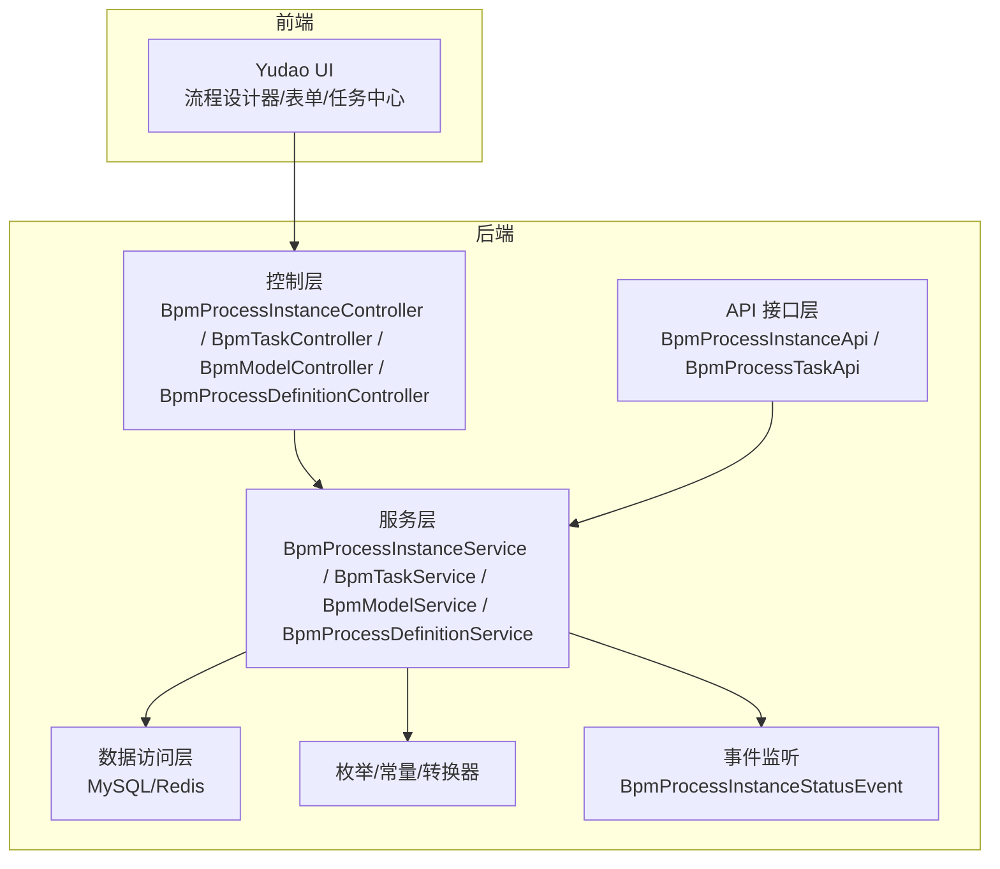
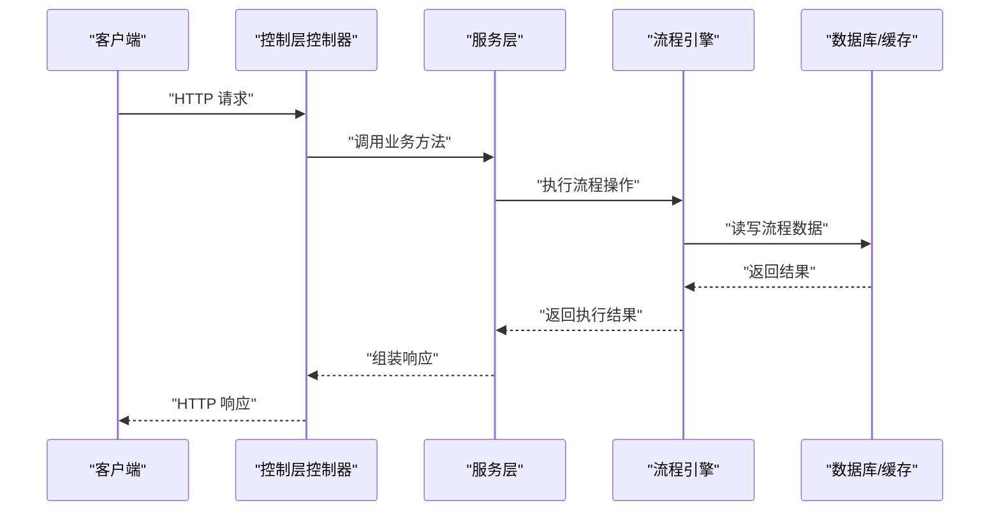
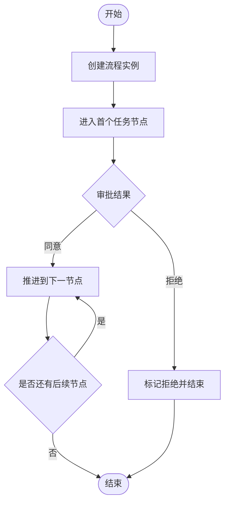
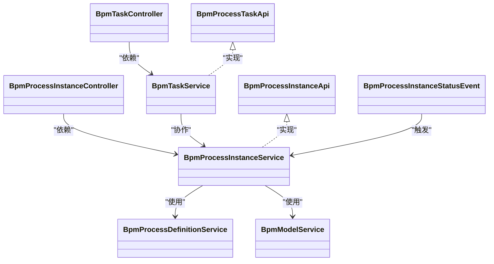

# 工作流API

<cite>
**本文引用的文件**
- [yudao-module-bpm/src/main/java/cn/iocoder/yudao/module/bpm/api/task/BpmProcessInstanceApi.java](file://yudao-module-bpm/src/main/java/cn/iocoder/yudao/module/bpm/api/task/BpmProcessInstanceApi.java)
- [yudao-module-bpm/src/main/java/cn/iocoder/yudao/module/bpm/api/task/BpmProcessTaskApi.java](file://yudao-module-bpm/src/main/java/cn/iocoder/yudao/module/bpm/api/task/BpmProcessTaskApi.java)
- [yudao-module-bpm/src/main/java/cn/iocoder/yudao/module/bpm/api/task/BpmProcessTaskApiImpl.java](file://yudao-module-bpm/src/main/java/cn/iocoder/yudao/module/bpm/api/task/BpmProcessTaskApiImpl.java)
- [yudao-module-bpm/src/main/java/cn/iocoder/yudao/module/bpm/service/task/BpmProcessInstanceService.java](file://yudao-module-bpm/src/main/java/cn/iocoder/yudao/module/bpm/service/task/BpmProcessInstanceService.java)
- [yudao-module-bpm/src/main/java/cn/iocoder/yudao/module/bpm/service/task/BpmTaskService.java](file://yudao-module-bpm/src/main/java/cn/iocoder/yudao/module/bpm/service/task/BpmTaskService.java)
- [yudao-module-bpm/src/main/java/cn/iocoder/yudao/module/bpm/controller/admin/task/BpmProcessInstanceController.java](file://yudao-module-bpm/src/main/java/cn/iocoder/yudao/module/bpm/controller/admin/task/BpmProcessInstanceController.java)
- [yudao-module-bpm/src/main/java/cn/iocoder/yudao/module/bpm/controller/admin/task/BpmTaskController.java](file://yudao-module-bpm/src/main/java/cn/iocoder/yudao/module/bpm/controller/admin/task/BpmTaskController.java)
- [yudao-module-bpm/src/main/java/cn/iocoder/yudao/module/bpm/controller/admin/definition/BpmProcessDefinitionController.java](file://yudao-module-bpm/src/main/java/cn/iocoder/yudao/module/bpm/controller/admin/definition/BpmProcessDefinitionController.java)
- [yudao-module-bpm/src/main/java/cn/iocoder/yudao/module/bpm/controller/admin/definition/BpmModelController.java](file://yudao-module-bpm/src/main/java/cn/iocoder/yudao/module/bpm/controller/admin/definition/BpmModelController.java)
- [yudao-module-bpm/src/main/java/cn/iocoder/yudao/module/bpm/service/definition/BpmProcessDefinitionService.java](file://yudao-module-bpm/src/main/java/cn/iocoder/yudao/module/bpm/service/definition/BpmProcessDefinitionService.java)
- [yudao-module-bpm/src/main/java/cn/iocoder/yudao/module/bpm/service/definition/BpmModelService.java](file://yudao-module-bpm/src/main/java/cn/iocoder/yudao/module/bpm/service/definition/BpmModelService.java)
- [yudao-module-bpm/src/main/java/cn/iocoder/yudao/module/bpm/controller/admin/task/vo/instance/BpmProcessInstanceCreateReqVO.java](file://yudao-module-bpm/src/main/java/cn/iocoder/yudao/module/bpm/controller/admin/task/vo/instance/BpmProcessInstanceCreateReqVO.java)
- [yudao-module-bpm/src/main/java/cn/iocoder/yudao/module/bpm/controller/admin/task/vo/task/BpmTaskApproveReqVO.java](file://yudao-module-bpm/src/main/java/cn/iocoder/yudao/module/bpm/controller/admin/task/vo/task/BpmTaskApproveReqVO.java)
- [yudao-module-bpm/src/main/java/cn/iocoder/yudao/module/bpm/controller/admin/task/vo/task/BpmTaskDelegateReqVO.java](file://yudao-module-bpm/src/main/java/cn/iocoder/yudao/module/bpm/controller/admin/task/vo/task/BpmTaskDelegateReqVO.java)
- [yudao-module-bpm/src/main/java/cn/iocoder/yudao/module/bpm/controller/admin/task/vo/task/BpmTaskTransferReqVO.java](file://yudao-module-bpm/src/main/java/cn/iocoder/yudao/module/bpm/controller/admin/task/vo/task/BpmTaskTransferReqVO.java)
- [yudao-module-bpm/src/main/java/cn/iocoder/yudao/module/bpm/controller/admin/task/vo/task/BpmTaskSignCreateReqVO.java](file://yudao-module-bpm/src/main/java/cn/iocoder/yudao/module/bpm/controller/admin/task/vo/task/BpmTaskSignCreateReqVO.java)
- [yudao-module-bpm/src/main/java/cn/iocoder/yudao/module/bpm/controller/admin/task/vo/task/BpmTaskSignDeleteReqVO.java](file://yudao-module-bpm/src/main/java/cn/iocoder/yudao/module/bpm/controller/admin/task/vo/task/BpmTaskSignDeleteReqVO.java)
- [yudao-module-bpm/src/main/java/cn/iocoder/yudao/module/bpm/controller/admin/task/vo/task/BpmTaskReturnReqVO.java](file://yudao-module-bpm/src/main/java/cn/iocoder/yudao/module/bpm/controller/admin/task/vo/task/BpmTaskReturnReqVO.java)
- [yudao-module-bpm/src/main/java/cn/iocoder/yudao/module/bpm/controller/admin/task/vo/task/BpmTaskCopyReqVO.java](file://yudao-module-bpm/src/main/java/cn/iocoder/yudao/module/bpm/controller/admin/task/vo/task/BpmTaskCopyReqVO.java)
- [yudao-module-bpm/src/main/java/cn/iocoder/yudao/module/bpm/controller/admin/definition/vo/model/BpmModelSaveReqVO.java](file://yudao-module-bpm/src/main/java/cn/iocoder/yudao/module/bpm/controller/admin/definition/vo/model/BpmModelSaveReqVO.java)
- [yudao-module-bpm/src/main/java/cn/iocoder/yudao/module/bpm/controller/admin/definition/vo/model/BpmModelUpdateStateReqVO.java](file://yudao-module-bpm/src/main/java/cn/iocoder/yudao/module/bpm/controller/admin/definition/vo/model/BpmModelUpdateStateReqVO.java)
- [yudao-module-bpm/src/main/java/cn/iocoder/yudao/module/bpm/controller/admin/definition/vo/process/BpmProcessDefinitionPageReqVO.java](file://yudao-module-bpm/src/main/java/cn/iocoder/yudao/module/bpm/controller/admin/definition/vo/process/BpmProcessDefinitionPageReqVO.java)
- [yudao-module-bpm/src/main/java/cn/iocoder/yudao/module/bpm/controller/admin/definition/vo/process/BpmProcessDefinitionRespVO.java](file://yudao-module-bpm/src/main/java/cn/iocoder/yudao/module/bpm/controller/admin/definition/vo/process/BpmProcessDefinitionRespVO.java)
- [yudao-module-bpm/src/main/java/cn/iocoder/yudao/module/bpm/controller/admin/task/vo/instance/BpmProcessInstancePageReqVO.java](file://yudao-module-bpm/src/main/java/cn/iocoder/yudao/module/bpm/controller/admin/task/vo/instance/BpmProcessInstancePageReqVO.java)
- [yudao-module-bpm/src/main/java/cn/iocoder/yudao/module/bpm/controller/admin/task/vo/instance/BpmProcessInstanceRespVO.java](file://yudao-module-bpm/src/main/java/cn/iocoder/yudao/module/bpm/controller/admin/task/vo/instance/BpmProcessInstanceRespVO.java)
- [yudao-module-bpm/src/main/java/cn/iocoder/yudao/module/bpm/controller/admin/task/vo/instance/BpmProcessInstanceCancelReqVO.java](file://yudao-module-bpm/src/main/java/cn/iocoder/yudao/module/bpm/controller/admin/task/vo/instance/BpmProcessInstanceCancelReqVO.java)
- [yudao-module-bpm/src/main/java/cn/iocoder/yudao/module/bpm/controller/admin/task/vo/activity/BpmActivityRespVO.java](file://yudao-module-bpm/src/main/java/cn/iocoder/yudao/module/bpm/controller/admin/task/vo/activity/BpmActivityRespVO.java)
- [yudao-module-bpm/src/main/java/cn/iocoder/yudao/module/bpm/controller/admin/task/vo/cc/BpmProcessInstanceCopyRespVO.java](file://yudao-module-bpm/src/main/java/cn/iocoder/yudao/module/bpm/controller/admin/task/vo/cc/BpmProcessInstanceCopyRespVO.java)
- [yudao-module-bpm/src/main/java/cn/iocoder/yudao/module/bpm/controller/admin/definition/vo/form/BpmFormSaveReqVO.java](file://yudao-module-bpm/src/main/java/cn/iocoder/yudao/module/bpm/controller/admin/definition/vo/form/BpmFormSaveReqVO.java)
- [yudao-module-bpm/src/main/java/cn/iocoder/yudao/module/bpm/controller/admin/definition/vo/form/BpmFormRespVO.java](file://yudao-module-bpm/src/main/java/cn/iocoder/yudao/module/bpm/controller/admin/definition/vo/form/BpmFormRespVO.java)
- [yudao-module-bpm/src/main/java/cn/iocoder/yudao/module/bpm/controller/admin/definition/vo/category/BpmCategorySaveReqVO.java](file://yudao-module-bpm/src/main/java/cn/iocoder/yudao/module/bpm/controller/admin/definition/vo/category/BpmCategorySaveReqVO.java)
- [yudao-module-bpm/src/main/java/cn/iocoder/yudao/module/bpm/controller/admin/definition/vo/category/BpmCategoryRespVO.java](file://yudao-module-bpm/src/main/java/cn/iocoder/yudao/module/bpm/controller/admin/definition/vo/category/BpmCategoryRespVO.java)
- [yudao-module-bpm/src/main/java/cn/iocoder/yudao/module/bpm/controller/admin/definition/vo/listener/BpmProcessListenerSaveReqVO.java](file://yudao-module-bpm/src/main/java/cn/iocoder/yudao/module/bpm/controller/admin/definition/vo/listener/BpmProcessListenerSaveReqVO.java)
- [yudao-module-bpm/src/main/java/cn/iocoder/yudao/module/bpm/controller/admin/definition/vo/listener/BpmProcessListenerRespVO.java](file://yudao-module-bpm/src/main/java/cn/iocoder/yudao/module/bpm/controller/admin/definition/vo/listener/BpmProcessListenerRespVO.java)
- [yudao-module-bpm/src/main/java/cn/iocoder/yudao/module/bpm/controller/admin/definition/vo/expression/BpmProcessExpressionSaveReqVO.java](file://yudao-module-bpm/src/main/java/cn/iocoder/yudao/module/bpm/controller/admin/definition/vo/expression/BpmProcessExpressionSaveReqVO.java)
- [yudao-module-bpm/src/main/java/cn/iocoder/yudao/module/bpm/controller/admin/definition/vo/expression/BpmProcessExpressionRespVO.java](file://yudao-module-bpm/src/main/java/cn/iocoder/yudao/module/bpm/controller/admin/definition/vo/expression/BpmProcessExpressionRespVO.java)
- [yudao-module-bpm/src/main/java/cn/iocoder/yudao/module/bpm/controller/admin/definition/vo/group/BpmUserGroupSaveReqVO.java](file://yudao-module-bpm/src/main/java/cn/iocoder/yudao/module/bpm/controller/admin/definition/vo/group/BpmUserGroupSaveReqVO.java)
- [yudao-module-bpm/src/main/java/cn/iocoder/yudao/module/bpm/controller/admin/definition/vo/group/BpmUserGroupRespVO.java](file://yudao-module-bpm/src/main/java/cn/iocoder/yudao/module/bpm/controller/admin/definition/vo/group/BpmUserGroupRespVO.java)
- [yudao-module-bpm/src/main/java/cn/iocoder/yudao/module/bpm/controller/admin/oa/BpmOALeaveController.java](file://yudao-module-bpm/src/main/java/cn/iocoder/yudao/module/bpm/controller/admin/oa/BpmOALeaveController.java)
- [yudao-module-bpm/src/main/java/cn/iocoder/yudao/module/bpm/controller/admin/oa/vo/BpmOALeaveCreateReqVO.java](file://yudao-module-bpm/src/main/java/cn/iocoder/yudao/module/bpm/controller/admin/oa/vo/BpmOALeaveCreateReqVO.java)
- [yudao-module-bpm/src/main/java/cn/iocoder/yudao/module/bpm/api/event/BpmProcessInstanceStatusEvent.java](file://yudao-module-bpm/src/main/java/cn/iocoder/yudao/module/bpm/api/event/BpmProcessInstanceStatusEvent.java)
- [yudao-module-bpm/src/main/java/cn/iocoder/yudao/module/bpm/api/event/BpmProcessInstanceStatusEventListener.java](file://yudao-module-bpm/src/main/java/cn/iocoder/yudao/module/bpm/api/event/BpmProcessInstanceStatusEventListener.java)
</cite>

## 目录
1. [简介](#简介)
2. [项目结构](#项目结构)
3. [核心组件](#核心组件)
4. [架构总览](#架构总览)
5. [详细组件分析](#详细组件分析)
6. [依赖关系分析](#依赖关系分析)
7. [性能考虑](#性能考虑)
8. [故障排查指南](#故障排查指南)
9. [结论](#结论)
10. [附录](#附录)

## 简介
本文件面向工作流模块的API接口文档，覆盖流程实例API、流程任务API、流程定义API、流程模型API与流程监控API，并提供状态流转示例与最佳实践，以及流程引擎的集成方式与配置要点。文档以实际源码为依据，确保接口定义与实现一致。

## 项目结构
工作流模块位于 yudao-module-bpm，采用分层架构：API接口层、服务层、控制层、数据访问层与枚举/转换/事件等支撑模块。前端通过 yudao-ui 提供可视化设计器与业务表单，后端通过REST接口暴露能力。

图示来源
- [yudao-module-bpm/src/main/java/cn/iocoder/yudao/module/bpm/api/task/BpmProcessInstanceApi.java:1-24](file://yudao-module-bpm/src/main/java/cn/iocoder/yudao/module/bpm/api/task/BpmProcessInstanceApi.java#L1-L24)
- [yudao-module-bpm/src/main/java/cn/iocoder/yudao/module/bpm/service/task/BpmProcessInstanceService.java:1-174](file://yudao-module-bpm/src/main/java/cn/iocoder/yudao/module/bpm/service/task/BpmProcessInstanceService.java#L1-L174)
- [yudao-module-bpm/src/main/java/cn/iocoder/yudao/module/bpm/controller/admin/task/BpmProcessInstanceController.java](file://yudao-module-bpm/src/main/java/cn/iocoder/yudao/module/bpm/controller/admin/task/BpmProcessInstanceController.java)
- [yudao-module-bpm/src/main/java/cn/iocoder/yudao/module/bpm/controller/admin/definition/BpmModelController.java](file://yudao-module-bpm/src/main/java/cn/iocoder/yudao/module/bpm/controller/admin/definition/BpmModelController.java)
- [yudao-module-bpm/src/main/java/cn/iocoder/yudao/module/bpm/api/event/BpmProcessInstanceStatusEvent.java](file://yudao-module-bpm/src/main/java/cn/iocoder/yudao/module/bpm/api/event/BpmProcessInstanceStatusEvent.java)

章节来源
- [yudao-module-bpm/src/main/java/cn/iocoder/yudao/module/bpm/api/task/BpmProcessInstanceApi.java:1-24](file://yudao-module-bpm/src/main/java/cn/iocoder/yudao/module/bpm/api/task/BpmProcessInstanceApi.java#L1-L24)
- [yudao-module-bpm/src/main/java/cn/iocoder/yudao/module/bpm/service/task/BpmProcessInstanceService.java:1-174](file://yudao-module-bpm/src/main/java/cn/iocoder/yudao/module/bpm/service/task/BpmProcessInstanceService.java#L1-L174)

## 核心组件
- API接口层：对外暴露流程实例与任务的最小调用契约，便于内部或跨模块复用。
- 服务层：封装业务逻辑，协调引擎与持久化，处理流程状态、变量、任务操作等。
- 控制层：REST接口，定义HTTP方法、路径、参数与返回体，统一鉴权与校验。
- 数据访问层：持久化流程定义、实例、任务、变量与附件等。
- 事件层：流程状态变更事件，用于通知与扩展。

章节来源
- [yudao-module-bpm/src/main/java/cn/iocoder/yudao/module/bpm/api/task/BpmProcessInstanceApi.java:1-24](file://yudao-module-bpm/src/main/java/cn/iocoder/yudao/module/bpm/api/task/BpmProcessInstanceApi.java#L1-L24)
- [yudao-module-bpm/src/main/java/cn/iocoder/yudao/module/bpm/api/task/BpmProcessTaskApi.java](file://yudao-module-bpm/src/main/java/cn/iocoder/yudao/module/bpm/api/task/BpmProcessTaskApi.java)
- [yudao-module-bpm/src/main/java/cn/iocoder/yudao/module/bpm/api/task/BpmProcessTaskApiImpl.java:1-25](file://yudao-module-bpm/src/main/java/cn/iocoder/yudao/module/bpm/api/task/BpmProcessTaskApiImpl.java#L1-L25)
- [yudao-module-bpm/src/main/java/cn/iocoder/yudao/module/bpm/service/task/BpmProcessInstanceService.java:1-174](file://yudao-module-bpm/src/main/java/cn/iocoder/yudao/module/bpm/service/task/BpmProcessInstanceService.java#L1-L174)
- [yudao-module-bpm/src/main/java/cn/iocoder/yudao/module/bpm/service/task/BpmTaskService.java](file://yudao-module-bpm/src/main/java/cn/iocoder/yudao/module/bpm/service/task/BpmTaskService.java)

## 架构总览
下图展示从HTTP请求到服务层再到引擎与存储的整体交互：

图示来源
- [yudao-module-bpm/src/main/java/cn/iocoder/yudao/module/bpm/controller/admin/task/BpmProcessInstanceController.java](file://yudao-module-bpm/src/main/java/cn/iocoder/yudao/module/bpm/controller/admin/task/BpmProcessInstanceController.java)
- [yudao-module-bpm/src/main/java/cn/iocoder/yudao/module/bpm/service/task/BpmProcessInstanceService.java:1-174](file://yudao-module-bpm/src/main/java/cn/iocoder/yudao/module/bpm/service/task/BpmProcessInstanceService.java#L1-L174)

## 详细组件分析

### 流程实例API
- 接口职责
  - 启动流程：提供内部创建流程实例的能力，支持传入用户ID与创建参数。
  - 查询流程：按ID或批量ID查询运行中或历史流程实例。
  - 取消流程：支持发起人与管理员两种维度的取消操作。
  - 状态变更：更新流程变量、拒绝流程、触发定时/边界事件等。
- 关键接口与参数
  - 创建流程实例
    - 方法：POST /bpm/process-instance/create
    - 请求体：BpmProcessInstanceCreateReqVO
    - 返回：流程实例ID
  - 查询流程实例
    - 方法：GET /bpm/process-instance/page
    - 查询参数：BpmProcessInstancePageReqVO
    - 返回：分页结果，元素类型 BpmProcessInstanceRespVO
  - 发起人取消流程
    - 方法：POST /bpm/process-instance/cancel
    - 请求体：BpmProcessInstanceCancelReqVO
  - 管理员取消流程
    - 方法：POST /bpm/process-instance/admin-cancel
    - 请求体：BpmProcessInstanceCancelReqVO
  - 更新流程变量
    - 方法：PUT /bpm/process-instance/variables
    - 请求体：id + variables
  - 删除流程变量
    - 方法：DELETE /bpm/process-instance/variables
    - 请求体：id + variableNames
  - 触发任务（外部事件）
    - 方法：POST /bpm/process-task/trigger
    - 请求体：processInstanceId + taskDefineKey
- 响应格式
  - 统一返回：CommonResult<T>，成功时data为具体对象或布尔值；失败时包含错误码与消息。
  - 分页：PageResult<T>，包含列表与总数。
- 最佳实践
  - 在创建流程前校验用户对流程定义的发起权限。
  - 批量查询时限制数量，避免超大集合导致性能问题。
  - 变更流程变量需幂等，避免重复提交造成状态不一致。

章节来源
- [yudao-module-bpm/src/main/java/cn/iocoder/yudao/module/bpm/api/task/BpmProcessInstanceApi.java:1-24](file://yudao-module-bpm/src/main/java/cn/iocoder/yudao/module/bpm/api/task/BpmProcessInstanceApi.java#L1-L24)
- [yudao-module-bpm/src/main/java/cn/iocoder/yudao/module/bpm/service/task/BpmProcessInstanceService.java:1-174](file://yudao-module-bpm/src/main/java/cn/iocoder/yudao/module/bpm/service/task/BpmProcessInstanceService.java#L1-L174)
- [yudao-module-bpm/src/main/java/cn/iocoder/yudao/module/bpm/controller/admin/task/BpmProcessInstanceController.java](file://yudao-module-bpm/src/main/java/cn/iocoder/yudao/module/bpm/controller/admin/task/BpmProcessInstanceController.java)
- [yudao-module-bpm/src/main/java/cn/iocoder/yudao/module/bpm/controller/admin/task/vo/instance/BpmProcessInstanceCreateReqVO.java](file://yudao-module-bpm/src/main/java/cn/iocoder/yudao/module/bpm/controller/admin/task/vo/instance/BpmProcessInstanceCreateReqVO.java)
- [yudao-module-bpm/src/main/java/cn/iocoder/yudao/module/bpm/controller/admin/task/vo/instance/BpmProcessInstancePageReqVO.java](file://yudao-module-bpm/src/main/java/cn/iocoder/yudao/module/bpm/controller/admin/task/vo/instance/BpmProcessInstancePageReqVO.java)
- [yudao-module-bpm/src/main/java/cn/iocoder/yudao/module/bpm/controller/admin/task/vo/instance/BpmProcessInstanceRespVO.java](file://yudao-module-bpm/src/main/java/cn/iocoder/yudao/module/bpm/controller/admin/task/vo/instance/BpmProcessInstanceRespVO.java)
- [yudao-module-bpm/src/main/java/cn/iocoder/yudao/module/bpm/controller/admin/task/vo/instance/BpmProcessInstanceCancelReqVO.java](file://yudao-module-bpm/src/main/java/cn/iocoder/yudao/module/bpm/controller/admin/task/vo/instance/BpmProcessInstanceCancelReqVO.java)

### 流程任务API
- 接口职责
  - 任务审批：同意/拒绝/退回。
  - 任务委托：将任务委托给他人。
  - 任务转办：改变任务归属人。
  - 加签/会签：为任务添加/移除多人协作节点。
  - 抄送：向他人抄送任务。
  - 查询：分页查询任务、活动节点、抄送信息等。
- 关键接口与参数
  - 审批任务
    - 方法：POST /bpm/task/approve
    - 请求体：BpmTaskApproveReqVO
  - 拒绝任务
    - 方法：POST /bpm/task/reject
    - 请求体：BpmTaskApproveReqVO
  - 退回任务
    - 方法：POST /bpm/task/return
    - 请求体：BpmTaskReturnReqVO
  - 委托任务
    - 方法：POST /bpm/task/delegate
    - 请求体：BpmTaskDelegateReqVO
  - 转办任务
    - 方法：POST /bpm/task/transfer
    - 请求体：BpmTaskTransferReqVO
  - 加签任务
    - 方法：POST /bpm/task/sign/create
    - 请求体：BpmTaskSignCreateReqVO
  - 撤销加签
    - 方法：POST /bpm/task/sign/delete
    - 请求体：BpmTaskSignDeleteReqVO
  - 抄送任务
    - 方法：POST /bpm/task/copy
    - 请求体：BpmTaskCopyReqVO
  - 查询任务
    - 方法：GET /bpm/task/page
    - 查询参数：BpmTaskPageReqVO
    - 返回：分页结果，元素类型 BpmTaskRespVO
  - 查询活动节点
    - 方法：GET /bpm/task/activity
    - 查询参数：processInstanceId
    - 返回：BpmActivityRespVO 列表
  - 查询抄送
    - 方法：GET /bpm/task/cc
    - 查询参数：processInstanceId
    - 返回：BpmProcessInstanceCopyRespVO 列表
- 响应格式
  - 成功：CommonResult.success(Boolean.TRUE/FALSE/具体的VO)
  - 失败：CommonResult.error(错误码, 错误信息)

章节来源
- [yudao-module-bpm/src/main/java/cn/iocoder/yudao/module/bpm/controller/admin/task/BpmTaskController.java](file://yudao-module-bpm/src/main/java/cn/iocoder/yudao/module/bpm/controller/admin/task/BpmTaskController.java)
- [yudao-module-bpm/src/main/java/cn/iocoder/yudao/module/bpm/controller/admin/task/vo/task/BpmTaskApproveReqVO.java](file://yudao-module-bpm/src/main/java/cn/iocoder/yudao/module/bpm/controller/admin/task/vo/task/BpmTaskApproveReqVO.java)
- [yudao-module-bpm/src/main/java/cn/iocoder/yudao/module/bpm/controller/admin/task/vo/task/BpmTaskDelegateReqVO.java](file://yudao-module-bpm/src/main/java/cn/iocoder/yudao/module/bpm/controller/admin/task/vo/task/BpmTaskDelegateReqVO.java)
- [yudao-module-bpm/src/main/java/cn/iocoder/yudao/module/bpm/controller/admin/task/vo/task/BpmTaskTransferReqVO.java](file://yudao-module-bpm/src/main/java/cn/iocoder/yudao/module/bpm/controller/admin/task/vo/task/BpmTaskTransferReqVO.java)
- [yudao-module-bpm/src/main/java/cn/iocoder/yudao/module/bpm/controller/admin/task/vo/task/BpmTaskSignCreateReqVO.java](file://yudao-module-bpm/src/main/java/cn/iocoder/yudao/module/bpm/controller/admin/task/vo/task/BpmTaskSignCreateReqVO.java)
- [yudao-module-bpm/src/main/java/cn/iocoder/yudao/module/bpm/controller/admin/task/vo/task/BpmTaskSignDeleteReqVO.java](file://yudao-module-bpm/src/main/java/cn/iocoder/yudao/module/bpm/controller/admin/task/vo/task/BpmTaskSignDeleteReqVO.java)
- [yudao-module-bpm/src/main/java/cn/iocoder/yudao/module/bpm/controller/admin/task/vo/task/BpmTaskReturnReqVO.java](file://yudao-module-bpm/src/main/java/cn/iocoder/yudao/module/bpm/controller/admin/task/vo/task/BpmTaskReturnReqVO.java)
- [yudao-module-bpm/src/main/java/cn/iocoder/yudao/module/bpm/controller/admin/task/vo/task/BpmTaskCopyReqVO.java](file://yudao-module-bpm/src/main/java/cn/iocoder/yudao/module/bpm/controller/admin/task/vo/task/BpmTaskCopyReqVO.java)
- [yudao-module-bpm/src/main/java/cn/iocoder/yudao/module/bpm/controller/admin/task/vo/instance/BpmProcessInstanceCopyRespVO.java](file://yudao-module-bpm/src/main/java/cn/iocoder/yudao/module/bpm/controller/admin/task/vo/instance/BpmProcessInstanceCopyRespVO.java)
- [yudao-module-bpm/src/main/java/cn/iocoder/yudao/module/bpm/controller/admin/task/vo/activity/BpmActivityRespVO.java](file://yudao-module-bpm/src/main/java/cn/iocoder/yudao/module/bpm/controller/admin/task/vo/activity/BpmActivityRespVO.java)

### 流程定义API
- 接口职责
  - 部署流程：上传BPMN文件并部署。
  - 查询流程定义：分页查询部署的流程定义。
  - 删除流程定义：删除指定部署ID。
  - 挂起/激活：对流程定义进行暂停/恢复。
- 关键接口与参数
  - 部署流程
    - 方法：POST /bpm/process-definition/deploy
    - 请求体：multipart/form-data，包含文件与业务参数
  - 查询流程定义
    - 方法：GET /bpm/process-definition/page
    - 查询参数：BpmProcessDefinitionPageReqVO
    - 返回：BpmProcessDefinitionRespVO 列表
  - 删除流程定义
    - 方法：DELETE /bpm/process-definition/remove
    - 查询参数：deploymentId
  - 挂起/激活
    - 方法：POST /bpm/process-definition/suspend-or-active
    - 请求体：deploymentId + status(挂起/激活)
- 响应格式
  - CommonResult<Boolean> 或分页结果

章节来源
- [yudao-module-bpm/src/main/java/cn/iocoder/yudao/module/bpm/controller/admin/definition/BpmProcessDefinitionController.java](file://yudao-module-bpm/src/main/java/cn/iocoder/yudao/module/bpm/controller/admin/definition/BpmProcessDefinitionController.java)
- [yudao-module-bpm/src/main/java/cn/iocoder/yudao/module/bpm/controller/admin/definition/vo/process/BpmProcessDefinitionPageReqVO.java](file://yudao-module-bpm/src/main/java/cn/iocoder/yudao/module/bpm/controller/admin/definition/vo/process/BpmProcessDefinitionPageReqVO.java)
- [yudao-module-bpm/src/main/java/cn/iocoder/yudao/module/bpm/controller/admin/definition/vo/process/BpmProcessDefinitionRespVO.java](file://yudao-module-bpm/src/main/java/cn/iocoder/yudao/module/bpm/controller/admin/definition/vo/process/BpmProcessDefinitionRespVO.java)
- [yudao-module-bpm/src/main/java/cn/iocoder/yudao/module/bpm/service/definition/BpmProcessDefinitionService.java:138-181](file://yudao-module-bpm/src/main/java/cn/iocoder/yudao/module/bpm/service/definition/BpmProcessDefinitionService.java#L138-L181)

### 流程模型API
- 接口职责
  - 创建/编辑模型：保存模型元信息与BPMN结构。
  - 发布模型：将模型发布为可部署的流程定义。
  - 导出模型：下载模型的JSON或BPMN文件。
  - 更新状态：启用/禁用模型。
- 关键接口与参数
  - 保存模型
    - 方法：POST /bpm/model/save
    - 请求体：BpmModelSaveReqVO
  - 更新模型状态
    - 方法：POST /bpm/model/update-state
    - 请求体：BpmModelUpdateStateReqVO
  - 发布模型
    - 方法：POST /bpm/model/publish
    - 请求体：modelId
  - 导出模型
    - 方法：GET /bpm/model/export
    - 查询参数：modelId
- 响应格式
  - CommonResult<Boolean> 或文件流

章节来源
- [yudao-module-bpm/src/main/java/cn/iocoder/yudao/module/bpm/controller/admin/definition/BpmModelController.java](file://yudao-module-bpm/src/main/java/cn/iocoder/yudao/module/bpm/controller/admin/definition/BpmModelController.java)
- [yudao-module-bpm/src/main/java/cn/iocoder/yudao/module/bpm/controller/admin/definition/vo/model/BpmModelSaveReqVO.java](file://yudao-module-bpm/src/main/java/cn/iocoder/yudao/module/bpm/controller/admin/definition/vo/model/BpmModelSaveReqVO.java)
- [yudao-module-bpm/src/main/java/cn/iocoder/yudao/module/bpm/controller/admin/definition/vo/model/BpmModelUpdateStateReqVO.java](file://yudao-module-bpm/src/main/java/cn/iocoder/yudao/module/bpm/controller/admin/definition/vo/model/BpmModelUpdateStateReqVO.java)
- [yudao-module-bpm/src/main/java/cn/iocoder/yudao/module/bpm/service/definition/BpmModelService.java](file://yudao-module-bpm/src/main/java/cn/iocoder/yudao/module/bpm/service/definition/BpmModelService.java)

### 流程监控API
- 接口职责
  - 流程跟踪：查看流程实例的BPMN模型视图与当前活动节点。
  - 节点信息：查询活动节点详情与历史节点。
  - 流程统计：按条件统计流程实例数量、耗时等指标。
- 关键接口与参数
  - 流程BPMN视图
    - 方法：GET /bpm/process-instance/bpmn-model-view
    - 查询参数：processInstanceId
  - 活动节点
    - 方法：GET /bpm/task/activity
    - 查询参数：processInstanceId
  - 抄送列表
    - 方法：GET /bpm/task/cc
    - 查询参数：processInstanceId
  - 流程统计
    - 方法：GET /bpm/process-instance/statistics
    - 查询参数：时间范围/分类/状态等
- 响应格式
  - CommonResult<T>，T为具体监控数据对象

章节来源
- [yudao-module-bpm/src/main/java/cn/iocoder/yudao/module/bpm/controller/admin/task/vo/instance/BpmProcessInstanceBpmnModelViewRespVO.java](file://yudao-module-bpm/src/main/java/cn/iocoder/yudao/module/bpm/controller/admin/task/vo/instance/BpmProcessInstanceBpmnModelViewRespVO.java)
- [yudao-module-bpm/src/main/java/cn/iocoder/yudao/module/bpm/controller/admin/task/vo/activity/BpmActivityRespVO.java](file://yudao-module-bpm/src/main/java/cn/iocoder/yudao/module/bpm/controller/admin/task/vo/activity/BpmActivityRespVO.java)
- [yudao-module-bpm/src/main/java/cn/iocoder/yudao/module/bpm/controller/admin/task/vo/instance/BpmProcessInstanceCopyRespVO.java](file://yudao-module-bpm/src/main/java/cn/iocoder/yudao/module/bpm/controller/admin/task/vo/instance/BpmProcessInstanceCopyRespVO.java)

### 流程状态流转示例与最佳实践
- 示例：请假流程（发起 → 审核 → 结束）
  1) 发起人提交申请，调用“创建流程实例”接口，传入流程定义key与业务参数。
  2) 系统根据模型自动进入第一个用户任务节点，待审批人登录系统处理。
  3) 审批人执行“审批/拒绝/退回”，系统推进到下一个节点或结束。
  4) 发起人可在“流程跟踪”中查看当前活动节点与历史节点。
- 最佳实践
  - 明确流程定义key与版本策略，避免多版本冲突。
  - 使用“流程变量”承载业务上下文，避免硬编码。
  - 对关键节点设置候选人/候选组，结合“委托/转办”提升灵活性。
  - 对长流程设置时限与提醒，防止停滞。
  - 使用“加签/会签”满足多人确认场景，注意清理加签节点。

图示来源
- [yudao-module-bpm/src/main/java/cn/iocoder/yudao/module/bpm/service/task/BpmProcessInstanceService.java:128-174](file://yudao-module-bpm/src/main/java/cn/iocoder/yudao/module/bpm/service/task/BpmProcessInstanceService.java#L128-L174)
- [yudao-module-bpm/src/main/java/cn/iocoder/yudao/module/bpm/controller/admin/task/BpmTaskController.java](file://yudao-module-bpm/src/main/java/cn/iocoder/yudao/module/bpm/controller/admin/task/BpmTaskController.java)

## 依赖关系分析
- 控制器依赖服务层接口，服务层依赖引擎与DAO，事件监听器订阅状态事件。
- DTO/VO在控制层与服务层之间传递，保持接口稳定与数据解耦。
- API接口层为内部复用提供契约，避免直接依赖控制器。

图示来源
- [yudao-module-bpm/src/main/java/cn/iocoder/yudao/module/bpm/controller/admin/task/BpmProcessInstanceController.java](file://yudao-module-bpm/src/main/java/cn/iocoder/yudao/module/bpm/controller/admin/task/BpmProcessInstanceController.java)
- [yudao-module-bpm/src/main/java/cn/iocoder/yudao/module/bpm/controller/admin/task/BpmTaskController.java](file://yudao-module-bpm/src/main/java/cn/iocoder/yudao/module/bpm/controller/admin/task/BpmTaskController.java)
- [yudao-module-bpm/src/main/java/cn/iocoder/yudao/module/bpm/service/task/BpmProcessInstanceService.java:1-174](file://yudao-module-bpm/src/main/java/cn/iocoder/yudao/module/bpm/service/task/BpmProcessInstanceService.java#L1-L174)
- [yudao-module-bpm/src/main/java/cn/iocoder/yudao/module/bpm/service/task/BpmTaskService.java](file://yudao-module-bpm/src/main/java/cn/iocoder/yudao/module/bpm/service/task/BpmTaskService.java)
- [yudao-module-bpm/src/main/java/cn/iocoder/yudao/module/bpm/service/definition/BpmProcessDefinitionService.java:138-181](file://yudao-module-bpm/src/main/java/cn/iocoder/yudao/module/bpm/service/definition/BpmProcessDefinitionService.java#L138-L181)
- [yudao-module-bpm/src/main/java/cn/iocoder/yudao/module/bpm/service/definition/BpmModelService.java](file://yudao-module-bpm/src/main/java/cn/iocoder/yudao/module/bpm/service/definition/BpmModelService.java)
- [yudao-module-bpm/src/main/java/cn/iocoder/yudao/module/bpm/api/task/BpmProcessInstanceApi.java:1-24](file://yudao-module-bpm/src/main/java/cn/iocoder/yudao/module/bpm/api/task/BpmProcessInstanceApi.java#L1-L24)
- [yudao-module-bpm/src/main/java/cn/iocoder/yudao/module/bpm/api/task/BpmProcessTaskApi.java](file://yudao-module-bpm/src/main/java/cn/iocoder/yudao/module/bpm/api/task/BpmProcessTaskApi.java)
- [yudao-module-bpm/src/main/java/cn/iocoder/yudao/module/bpm/api/event/BpmProcessInstanceStatusEvent.java](file://yudao-module-bpm/src/main/java/cn/iocoder/yudao/module/bpm/api/event/BpmProcessInstanceStatusEvent.java)

## 性能考虑
- 分页查询：默认分页大小建议限制在合理范围，避免一次性返回大量数据。
- 批量操作：批量查询实例/任务时，控制ids数量，避免超大IN查询。
- 缓存策略：对常用流程定义与模型元信息进行缓存，降低数据库压力。
- 异步处理：复杂统计与报表建议异步执行，避免阻塞主线程。
- 日志与监控：对关键流程节点增加日志埋点，便于定位性能瓶颈。

## 故障排查指南
- 常见错误
  - 权限不足：检查用户是否具备流程发起/审批/抄送等角色。
  - 参数非法：核对请求体字段类型与必填项，参考对应VO定义。
  - 流程未部署：确认流程定义已成功部署且处于激活状态。
  - 任务不存在：确认任务ID正确，或查询当前活动节点。
- 排查步骤
  - 查看接口返回的错误码与消息，定位具体异常。
  - 通过“流程跟踪/活动节点”接口确认当前节点与历史轨迹。
  - 检查流程变量是否缺失或类型不匹配。
  - 核对候选人/候选组配置，确认任务归属。
- 事件监听
  - 订阅流程状态事件，记录流程生命周期关键节点，辅助排障。

章节来源
- [yudao-module-bpm/src/main/java/cn/iocoder/yudao/module/bpm/api/event/BpmProcessInstanceStatusEventListener.java](file://yudao-module-bpm/src/main/java/cn/iocoder/yudao/module/bpm/api/event/BpmProcessInstanceStatusEventListener.java)

## 结论
本工作流API体系以清晰的分层架构与标准化的DTO/VO设计，覆盖了从模型设计、流程部署、实例运行到任务处理与监控统计的全流程能力。通过统一的事件机制与最佳实践指导，可有效保障系统的稳定性与可维护性。

## 附录
- OA 请假流程示例
  - 接口：POST /bpm/oa/leave/create
  - 请求体：BpmOALeaveCreateReqVO
  - 场景：员工提交请假，按组织层级逐级审批，最终归档。

章节来源
- [yudao-module-bpm/src/main/java/cn/iocoder/yudao/module/bpm/controller/admin/oa/BpmOALeaveController.java](file://yudao-module-bpm/src/main/java/cn/iocoder/yudao/module/bpm/controller/admin/oa/BpmOALeaveController.java)
- [yudao-module-bpm/src/main/java/cn/iocoder/yudao/module/bpm/controller/admin/oa/vo/BpmOALeaveCreateReqVO.java](file://yudao-module-bpm/src/main/java/cn/iocoder/yudao/module/bpm/controller/admin/oa/vo/BpmOALeaveCreateReqVO.java)