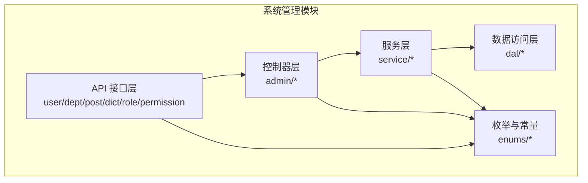
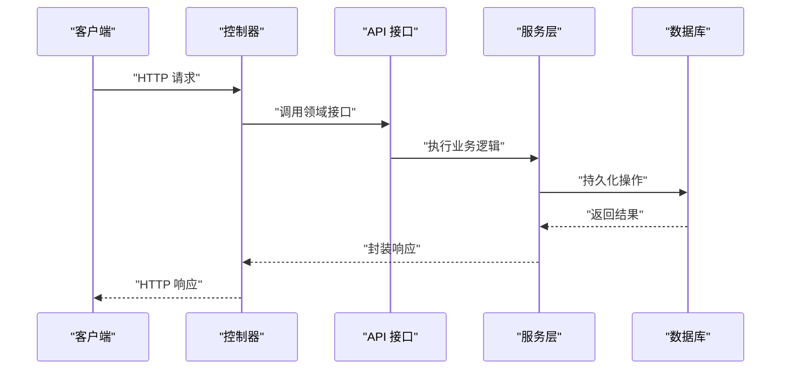
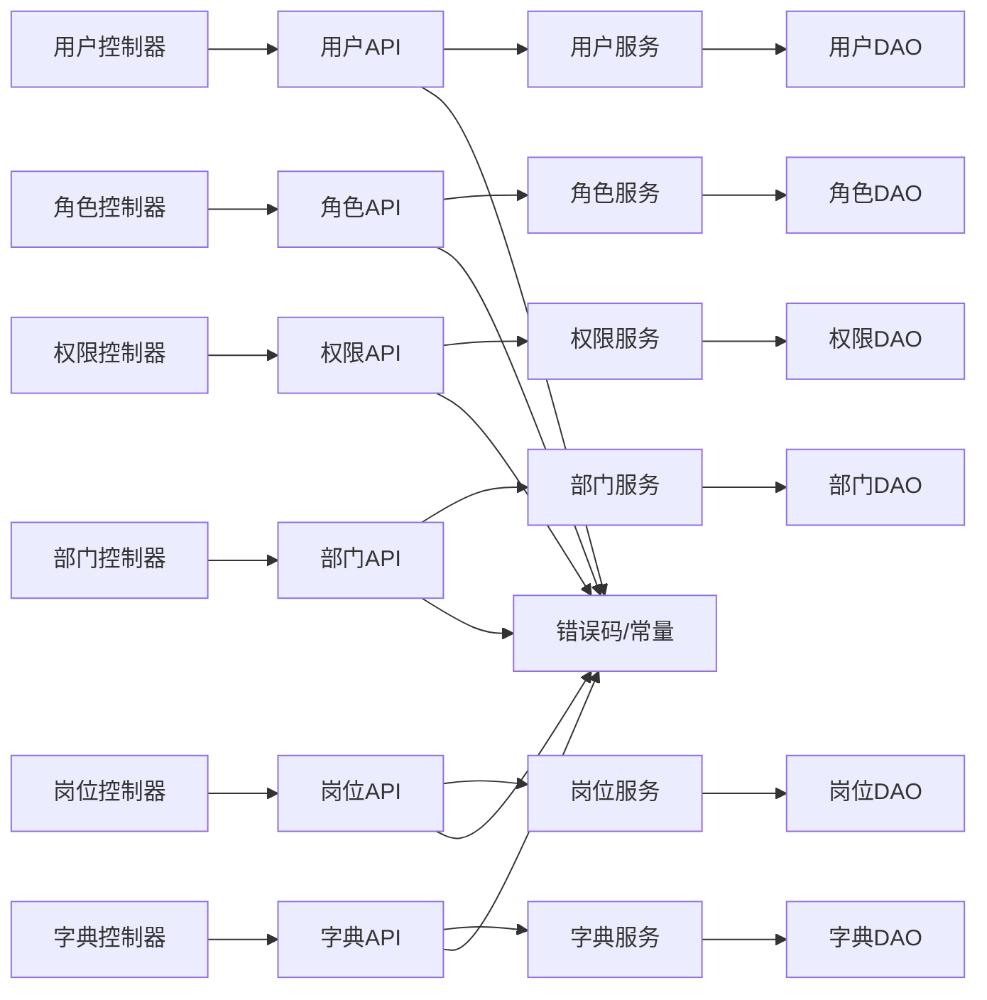

# 系统管理API

<cite>
**本文引用的文件**
- [AdminUserApi.java](file://yudao-module-system/src/main/java/cn/iocoder/yudao/module/system/api/user/AdminUserApi.java)
- [DeptApi.java](file://yudao-module-system/src/main/java/cn/iocoder/yudao/module/system/api/dept/DeptApi.java)
- [PostApi.java](file://yudao-module-system/src/main/java/cn/iocoder/yudao/module/system/api/dept/PostApi.java)
- [DictDataApi.java](file://yudao-module-system/src/main/java/cn/iocoder/yudao/module/system/api/dict/DictDataApi.java)
- [RoleApi.java](file://yudao-module-system/src/main/java/cn/iocoder/yudao/module/system/api/permission/RoleApi.java)
- [PermissionApi.java](file://yudao-module-system/src/main/java/cn/iocoder/yudao/module/system/api/permission/PermissionApi.java)
- [ErrorCodeConstants.java](file://yudao-module-system/src/main/java/cn/iocoder/yudao/module/system/enums/ErrorCodeConstants.java)
- [DictTypeConstants.java](file://yudao-module-system/src/main/java/cn/iocoder/yudao/module/system/enums/DictTypeConstants.java)
- [YudaoServerApplication.java](file://yudao-server/src/main/java/cn/iocoder/yudao/server/YudaoServerApplication.java)
- [application.yaml](file://yudao-server/src/main/resources/application.yaml)
</cite>

## 目录
1. [简介](#简介)
2. [项目结构](#项目结构)
3. [核心组件](#核心组件)
4. [架构总览](#架构总览)
5. [详细组件分析](#详细组件分析)
6. [依赖分析](#依赖分析)
7. [性能考虑](#性能考虑)
8. [故障排查指南](#故障排查指南)
9. [结论](#结论)
10. [附录](#附录)

## 简介
本文件为“系统管理模块”的API接口文档，覆盖以下能力域：
- 用户管理：用户查询、创建、更新、删除
- 角色权限：角色管理、权限分配、数据权限
- 部门管理：部门树形结构查询、部门信息维护
- 岗位管理：岗位信息管理、岗位与用户的关联关系
- 数据字典：字典数据的增删改查与字典类型管理
- 认证授权与权限控制策略：统一鉴权入口、权限注解与数据范围控制

文档以“接口定义 + 请求示例 + 响应示例 + 错误码”为主线，帮助前后端协作与集成。

## 项目结构
系统管理模块位于 yudao-module-system，采用分层架构：
- api 层：对外暴露的领域接口（如用户、部门、岗位、字典、角色、权限）
- controller 层：HTTP 控制器，负责路由、参数校验、调用 service
- service 层：业务逻辑编排
- dal 层：数据访问对象（MyBatis）
- enums：错误码与常量
- framework：安全、日志、短信、验证码等通用能力

图表来源
- [AdminUserApi.java:1-200](file://yudao-module-system/src/main/java/cn/iocoder/yudao/module/system/api/user/AdminUserApi.java#L1-L200)
- [DeptApi.java:1-200](file://yudao-module-system/src/main/java/cn/iocoder/yudao/module/system/api/dept/DeptApi.java#L1-L200)
- [PostApi.java:1-200](file://yudao-module-system/src/main/java/cn/iocoder/yudao/module/system/api/dept/PostApi.java#L1-L200)
- [DictDataApi.java:1-200](file://yudao-module-system/src/main/java/cn/iocoder/yudao/module/system/api/dict/DictDataApi.java#L1-L200)
- [RoleApi.java:1-200](file://yudao-module-system/src/main/java/cn/iocoder/yudao/module/system/api/permission/RoleApi.java#L1-L200)
- [PermissionApi.java:1-200](file://yudao-module-system/src/main/java/cn/iocoder/yudao/module/system/api/permission/PermissionApi.java#L1-L200)

章节来源
- [YudaoServerApplication.java:1-200](file://yudao-server/src/main/java/cn/iocoder/yudao/server/YudaoServerApplication.java#L1-L200)
- [application.yaml:1-200](file://yudao-server/src/main/resources/application.yaml#L1-L200)

## 核心组件
- 用户管理：AdminUserApi 提供用户维度的增删改查、状态变更、密码重置等能力
- 部门管理：DeptApi 提供部门树查询、部门信息维护
- 岗位管理：PostApi 提供岗位信息维护及与用户的关联关系
- 字典管理：DictDataApi 提供字典数据与类型的增删改查
- 权限管理：RoleApi 负责角色管理；PermissionApi 负责权限分配与数据权限

章节来源
- [AdminUserApi.java:1-200](file://yudao-module-system/src/main/java/cn/iocoder/yudao/module/system/api/user/AdminUserApi.java#L1-L200)
- [DeptApi.java:1-200](file://yudao-module-system/src/main/java/cn/iocoder/yudao/module/system/api/dept/DeptApi.java#L1-L200)
- [PostApi.java:1-200](file://yudao-module-system/src/main/java/cn/iocoder/yudao/module/system/api/dept/PostApi.java#L1-L200)
- [DictDataApi.java:1-200](file://yudao-module-system/src/main/java/cn/iocoder/yudao/module/system/api/dict/DictDataApi.java#L1-L200)
- [RoleApi.java:1-200](file://yudao-module-system/src/main/java/cn/iocoder/yudao/module/system/api/permission/RoleApi.java#L1-L200)
- [PermissionApi.java:1-200](file://yudao-module-system/src/main/java/cn/iocoder/yudao/module/system/api/permission/PermissionApi.java#L1-L200)

## 架构总览
系统通过统一的控制器层接收请求，调用对应 API 接口，再由服务层完成业务处理，最终持久化到数据库。权限控制与数据范围通过框架层的安全与数据权限注解实现。

图表来源
- [AdminUserApi.java:1-200](file://yudao-module-system/src/main/java/cn/iocoder/yudao/module/system/api/user/AdminUserApi.java#L1-L200)
- [DeptApi.java:1-200](file://yudao-module-system/src/main/java/cn/iocoder/yudao/module/system/api/dept/DeptApi.java#L1-L200)
- [PostApi.java:1-200](file://yudao-module-system/src/main/java/cn/iocoder/yudao/module/system/api/dept/PostApi.java#L1-L200)
- [DictDataApi.java:1-200](file://yudao-module-system/src/main/java/cn/iocoder/yudao/module/system/api/dict/DictDataApi.java#L1-L200)
- [RoleApi.java:1-200](file://yudao-module-system/src/main/java/cn/iocoder/yudao/module/system/api/permission/RoleApi.java#L1-L200)
- [PermissionApi.java:1-200](file://yudao-module-system/src/main/java/cn/iocoder/yudao/module/system/api/permission/PermissionApi.java#L1-L200)

## 详细组件分析

### 用户管理API
- 接口目标：提供用户全生命周期管理能力
- 关键接口（示例）
  - 用户列表查询
    - 方法：GET
    - 路径：/system/user/list
    - 请求参数：分页、姓名、手机号、状态、部门ID、创建时间区间
    - 响应：分页列表，包含用户基本信息、所属部门、岗位、角色、状态、创建时间
  - 用户详情
    - 方法：GET
    - 路径：/system/user/get/{id}
    - 响应：用户详情，包含个人信息、部门名称、岗位列表、角色列表
  - 创建用户
    - 方法：POST
    - 路径：/system/user/create
    - 请求体：用户名、昵称、邮箱、手机号、性别、部门ID、岗位ID列表、角色ID列表、备注
    - 响应：用户ID
  - 更新用户
    - 方法：PUT
    - 路径：/system/user/update
    - 请求体：用户ID + 变更字段（同上）
    - 响应：布尔成功
  - 删除用户
    - 方法：DELETE
    - 路径：/system/user/delete/{id}
    - 响应：布尔成功
  - 重置用户密码
    - 方法：PUT
    - 路径：/system/user/resetPwd
    - 请求体：用户ID、新密码
    - 响应：布尔成功
  - 修改用户状态
    - 方法：PUT
    - 路径：/system/user/changeStatus
    - 请求体：用户ID、状态
    - 响应：布尔成功

- 认证与权限
  - 所有用户管理接口均受统一鉴权保护，需携带有效令牌
  - 使用基于角色的访问控制（RBAC），管理员可操作

- 错误码
  - 通用错误码参考：[ErrorCodeConstants.java:1-200](file://yudao-module-system/src/main/java/cn/iocoder/yudao/module/system/enums/ErrorCodeConstants.java#L1-L200)
  - 示例：用户不存在、手机号重复、密码不合法、无权限等

章节来源
- [AdminUserApi.java:1-200](file://yudao-module-system/src/main/java/cn/iocoder/yudao/module/system/api/user/AdminUserApi.java#L1-L200)
- [ErrorCodeConstants.java:1-200](file://yudao-module-system/src/main/java/cn/iocoder/yudao/module/system/enums/ErrorCodeConstants.java#L1-L200)

### 角色权限API
- 接口目标：角色管理与权限分配、数据权限设置
- 关键接口（示例）
  - 角色列表
    - 方法：GET
    - 路径：/system/role/list
    - 请求参数：角色名、角色编码、状态、创建时间区间
    - 响应：分页列表
  - 角色详情
    - 方法：GET
    - 路径：/system/role/get/{id}
    - 响应：角色信息与菜单权限
  - 新增角色
    - 方法：POST
    - 路径：/system/role/create
    - 请求体：角色名、角色编码、排序、数据范围、状态、备注
    - 响应：角色ID
  - 更新角色
    - 方法：PUT
    - 路径：/system/role/update
    - 请求体：角色ID + 变更字段
    - 响应：布尔成功
  - 删除角色
    - 方法：DELETE
    - 路径：/system/role/delete/{id}
    - 响应：布尔成功
  - 分配菜单权限
    - 方法：POST
    - 路径：/system/role/authMenu
    - 请求体：角色ID、菜单ID列表
    - 响应：布尔成功
  - 分配数据权限
    - 方法：POST
    - 路径：/system/role/authDataScope
    - 请求体：角色ID、数据范围、部门ID列表
    - 响应：布尔成功

- 权限控制策略
  - 角色与菜单权限通过 RBAC 维护
  - 数据权限支持全部、本部门、本部门及子部门、自定义部门集
  - 框架层提供数据权限注解，自动注入当前用户的数据范围

章节来源
- [RoleApi.java:1-200](file://yudao-module-system/src/main/java/cn/iocoder/yudao/module/system/api/permission/RoleApi.java#L1-L200)
- [PermissionApi.java:1-200](file://yudao-module-system/src/main/java/cn/iocoder/yudao/module/system/api/permission/PermissionApi.java#L1-L200)

### 部门管理API
- 接口目标：部门树形结构查询、部门信息维护
- 关键接口（示例）
  - 部门树查询
    - 方法：GET
    - 路径：/system/dept/tree
    - 响应：树形结构（含部门ID、名称、排序、状态、子节点）
  - 部门列表
    - 方法：GET
    - 路径：/system/dept/list
    - 请求参数：名称、状态
    - 响应：平铺列表
  - 获取单个部门
    - 方法：GET
    - 路径：/system/dept/get/{id}
    - 响应：部门详情
  - 新增部门
    - 方法：POST
    - 路径：/system/dept/create
    - 请求体：父部门ID、部门名称、排序、负责人、电话、邮箱、状态
    - 响应：部门ID
  - 更新部门
    - 方法：PUT
    - 路径：/system/dept/update
    - 请求体：部门ID + 变更字段
    - 响应：布尔成功
  - 删除部门
    - 方法：DELETE
    - 路径：/system/dept/delete/{id}
    - 响应：布尔成功

- 数据一致性
  - 支持父子级联动删除与迁移
  - 树形结构按排序字段升序排列

章节来源
- [DeptApi.java:1-200](file://yudao-module-system/src/main/java/cn/iocoder/yudao/module/system/api/dept/DeptApi.java#L1-L200)

### 岗位管理API
- 接口目标：岗位信息管理、岗位与用户的关联关系
- 关键接口（示例）
  - 岗位列表
    - 方法：GET
    - 路径：/system/post/list
    - 请求参数：岗位编码、岗位名称、状态
    - 响应：分页列表
  - 岗位详情
    - 方法：GET
    - 路径：/system/post/get/{id}
    - 响应：岗位详情
  - 新增岗位
    - 方法：POST
    - 路径：/system/post/create
    - 请求体：岗位编码、岗位名称、排序、状态、备注
    - 响应：岗位ID
  - 更新岗位
    - 方法：PUT
    - 路径：/system/post/update
    - 请求体：岗位ID + 变更字段
    - 响应：布尔成功
  - 删除岗位
    - 方法：DELETE
    - 路径：/system/post/delete/{id}
    - 响应：布尔成功
  - 用户绑定岗位
    - 方法：POST
    - 路径：/system/post/setUserPost
    - 请求体：用户ID、岗位ID列表
    - 响应：布尔成功

- 关联关系
  - 用户可绑定多个岗位，用于扩展职责与权限边界

章节来源
- [PostApi.java:1-200](file://yudao-module-system/src/main/java/cn/iocoder/yudao/module/system/api/dept/PostApi.java#L1-L200)

### 数据字典API
- 接口目标：字典数据的增删改查与字典类型的管理
- 关键接口（示例）
  - 字典类型列表
    - 方法：GET
    - 路径：/system/dict/type/list
    - 请求参数：字典名称、字典类型、状态
    - 响应：分页列表
  - 字典类型详情
    - 方法：GET
    - 路径：/system/dict/type/get/{id}
    - 响应：字典类型
  - 新增字典类型
    - 方法：POST
    - 路径：/system/dict/type/create
    - 请求体：字典名称、字典类型、状态、备注
    - 响应：类型ID
  - 更新字典类型
    - 方法：PUT
    - 路径：/system/dict/type/update
    - 请求体：类型ID + 变更字段
    - 响应：布尔成功
  - 删除字典类型
    - 方法：DELETE
    - 路径：/system/dict/type/delete/{id}
    - 响应：布尔成功
  - 字典数据列表
    - 方法：GET
    - 路径：/system/dict/data/list
    - 请求参数：字典标签、字典类型、状态
    - 响应：分页列表
  - 字典数据详情
    - 方法：GET
    - 路径：/system/dict/data/get/{id}
    - 响应：字典数据
  - 新增字典数据
    - 方法：POST
    - 路径：/system/dict/data/create
    - 请求体：字典标签、字典值、字典类型、样式类型、是否默认、排序、状态、备注
    - 响应：数据ID
  - 更新字典数据
    - 方法：PUT
    - 路径：/system/dict/data/update
    - 请求体：数据ID + 变更字段
    - 响应：布尔成功
  - 删除字典数据
    - 方法：DELETE
    - 路径：/system/dict/data/delete/{id}
    - 响应：布尔成功
  - 通过类型获取字典数据
    - 方法：GET
    - 路径：/system/dict/data/type/{type}
    - 响应：该类型的字典项集合

- 常量与类型
  - 字典类型常量参考：[DictTypeConstants.java:1-200](file://yudao-module-system/src/main/java/cn/iocoder/yudao/module/system/enums/DictTypeConstants.java#L1-L200)

章节来源
- [DictDataApi.java:1-200](file://yudao-module-system/src/main/java/cn/iocoder/yudao/module/system/api/dict/DictDataApi.java#L1-L200)
- [DictTypeConstants.java:1-200](file://yudao-module-system/src/main/java/cn/iocoder/yudao/module/system/enums/DictTypeConstants.java#L1-L200)

### 认证授权机制与权限控制策略
- 统一认证入口
  - 通过控制器层进行登录、刷新令牌、退出等操作
  - 令牌有效期与刷新策略在框架层配置
- 权限控制
  - 基于角色的访问控制（RBAC）
  - 数据权限：支持全部、本部门、本部门及子部门、自定义部门集
  - 框架层提供注解与拦截器，自动注入当前用户与数据范围
- 错误码体系
  - 统一错误码常量：[ErrorCodeConstants.java:1-200](file://yudao-module-system/src/main/java/cn/iocoder/yudao/module/system/enums/ErrorCodeConstants.java#L1-L200)
  - 包含用户、角色、权限、字典、部门、岗位等领域的错误码

章节来源
- [ErrorCodeConstants.java:1-200](file://yudao-module-system/src/main/java/cn/iocoder/yudao/module/system/enums/ErrorCodeConstants.java#L1-L200)

## 依赖分析
系统管理模块依赖关系如下：
- 控制器依赖 API 接口
- API 接口依赖服务层
- 服务层依赖数据访问层与枚举常量
- 权限与数据权限由框架层提供支撑

图表来源
- [AdminUserApi.java:1-200](file://yudao-module-system/src/main/java/cn/iocoder/yudao/module/system/api/user/AdminUserApi.java#L1-L200)
- [RoleApi.java:1-200](file://yudao-module-system/src/main/java/cn/iocoder/yudao/module/system/api/permission/RoleApi.java#L1-L200)
- [PermissionApi.java:1-200](file://yudao-module-system/src/main/java/cn/iocoder/yudao/module/system/api/permission/PermissionApi.java#L1-L200)
- [DeptApi.java:1-200](file://yudao-module-system/src/main/java/cn/iocoder/yudao/module/system/api/dept/DeptApi.java#L1-L200)
- [PostApi.java:1-200](file://yudao-module-system/src/main/java/cn/iocoder/yudao/module/system/api/dept/PostApi.java#L1-L200)
- [DictDataApi.java:1-200](file://yudao-module-system/src/main/java/cn/iocoder/yudao/module/system/api/dict/DictDataApi.java#L1-L200)

## 性能考虑
- 列表查询建议使用分页与条件过滤，避免一次性加载大量数据
- 树形结构查询建议缓存热点部门树，降低数据库压力
- 字典数据频繁读取可结合本地缓存或Redis缓存，减少数据库访问
- 权限与数据权限判断尽量在服务层聚合，避免多次数据库往返

## 故障排查指南
- 常见错误码
  - 用户相关：用户不存在、手机号重复、密码不合法、状态异常
  - 角色相关：角色不存在、数据范围非法、菜单权限缺失
  - 权限相关：无权限访问、数据越权
  - 字典相关：字典类型不存在、字典数据重复
  - 部门相关：存在子部门不可删除、部门层级过深
  - 岗位相关：岗位已被用户绑定、岗位不存在
- 排查步骤
  - 确认请求参数与请求头（Content-Type、Authorization）
  - 检查当前用户的角色与数据范围
  - 查看服务层日志与数据库事务状态
  - 对照错误码常量定位具体问题

章节来源
- [ErrorCodeConstants.java:1-200](file://yudao-module-system/src/main/java/cn/iocoder/yudao/module/system/enums/ErrorCodeConstants.java#L1-L200)

## 结论
系统管理模块提供了完善的用户、角色权限、部门、岗位与数据字典的API能力，并通过统一的认证授权与数据权限控制保障系统的安全性与一致性。建议在生产环境中结合缓存与分页策略提升性能，并严格遵循RBAC与数据范围策略进行权限治理。

## 附录
- 接口请求与响应示例（示意）
  - 用户创建
    - 请求URL：POST /system/user/create
    - 请求头：Authorization: Bearer <token>, Content-Type: application/json
    - 请求体：包含用户名、昵称、邮箱、手机号、性别、部门ID、岗位ID列表、角色ID列表、备注
    - 响应：{ "code": 0, "msg": "成功", "data": { "id": 100 } }
  - 角色分配菜单权限
    - 请求URL：POST /system/role/authMenu
    - 请求体：{ "roleId": 10, "menuIds": [101, 102, 103] }
    - 响应：{ "code": 0, "msg": "成功", "data": true }
  - 部门树查询
    - 请求URL：GET /system/dept/tree
    - 响应：{ "code": 0, "msg": "成功", "data": [ { "id": 1, "name": "总公司", "children": [...] } ] }
  - 岗位新增
    - 请求URL：POST /system/post/create
    - 响应：{ "code": 0, "msg": "成功", "data": { "id": 200 } }
  - 字典类型新增
    - 请求URL：POST /system/dict/type/create
    - 响应：{ "code": 0, "msg": "成功", "data": { "id": 300 } }