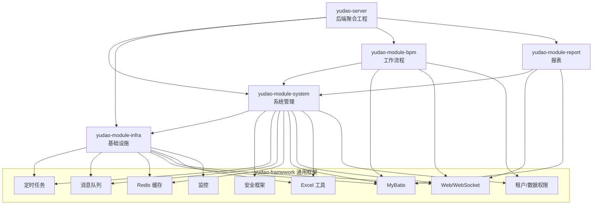
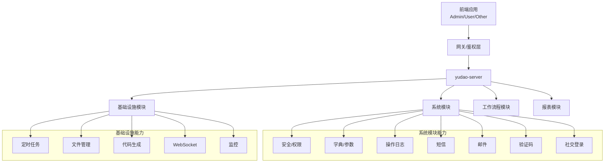
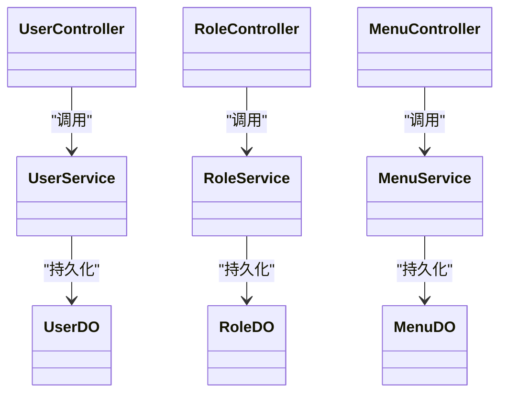
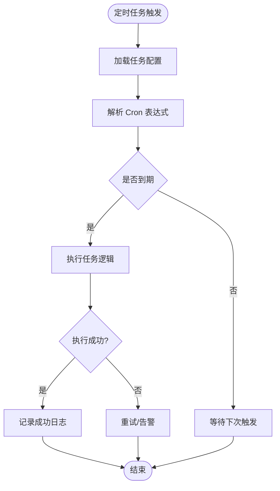
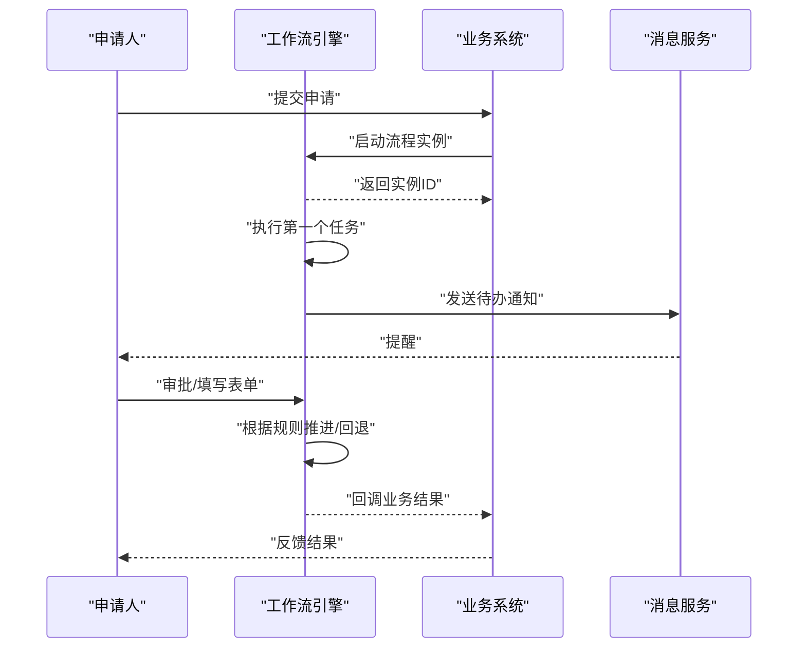
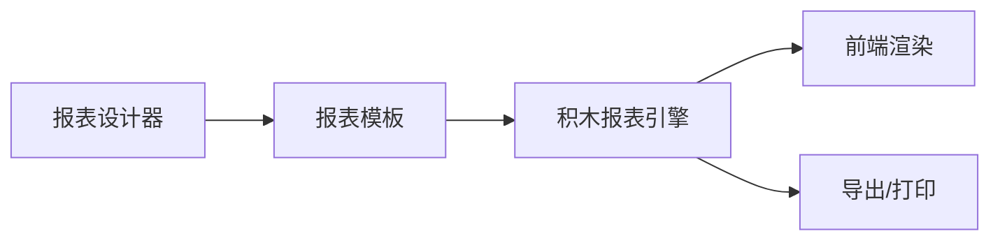
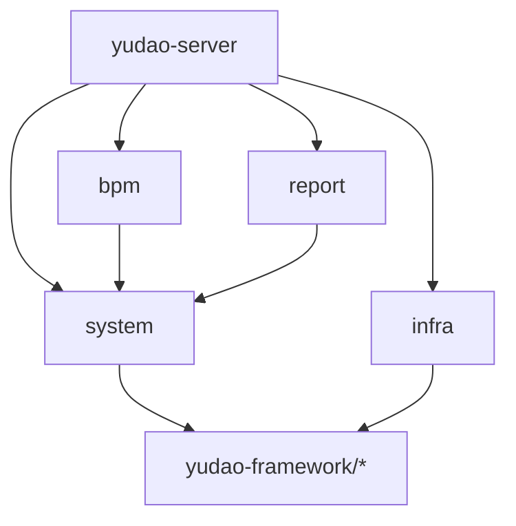

# 业务模块开发

<cite>
**本文引用的文件**
- [yudao-module-system/pom.xml](file://yudao-module-system/pom.xml)
- [yudao-module-infra/pom.xml](file://yudao-module-infra/pom.xml)
- [yudao-module-bpm/pom.xml](file://yudao-module-bpm/pom.xml)
- [yudao-module-report/pom.xml](file://yudao-module-report/pom.xml)
- [yudao-server/pom.xml](file://yudao-server/pom.xml)
- [YudaoServerApplication.java](file://yudao-server/src/main/java/cn/iocoder/yudao/server/YudaoServerApplication.java)
- [application.yaml](file://yudao-server/src/main/resources/application.yaml)
- [application-dev.yaml](file://yudao-server/src/main/resources/application-dev.yaml)
- [application-local.yaml](file://yudao-server/src/main/resources/application-local.yaml)
- [README.md](file://README.md)
</cite>

## 目录
1. [引言](#引言)
2. [项目结构](#项目结构)
3. [核心组件](#核心组件)
4. [架构总览](#架构总览)
5. [详细组件分析](#详细组件分析)
6. [依赖关系分析](#依赖关系分析)
7. [性能考虑](#性能考虑)
8. [故障排查指南](#故障排查指南)
9. [结论](#结论)
10. [附录](#附录)

## 引言
本指南面向希望在芋道 ruoyi-vue-pro 基础设施之上进行业务模块开发的工程师，系统讲解系统管理、基础设施、工作流程、报表等模块的设计原则、开发模式与实现要点。文档同时覆盖模块边界划分、接口设计规范、模块间通信机制、核心业务功能实现、第三方集成、测试策略以及扩展开发方法，帮助读者快速、高质量地交付可维护的业务模块。

## 项目结构
ruoyi-vue-pro 采用多模块分层架构：
- yudao-server：后端聚合工程，作为运行容器，按需引入各业务模块依赖
- yudao-module-system：系统管理模块，提供用户、角色、菜单、权限、数据字典、操作日志、短信、邮件等通用能力
- yudao-module-infra：基础设施模块，提供定时任务、文件管理、代码生成、WebSocket、监控等基础能力
- yudao-module-bpm：工作流程模块，基于 Flowable 提供流程定义、表单、任务、消息通知等能力
- yudao-module-report：报表模块，基于积木报表提供可视化报表、图形设计、大屏设计等能力
- yudao-framework：通用框架与工具集，为各模块提供安全、数据权限、租户、定时任务、消息队列、Excel、Redis、Web、WebSocket、监控等能力

**图表来源**
- [yudao-server/pom.xml:23-53](file://yudao-server/pom.xml#L23-L53)
- [yudao-module-system/pom.xml:20-122](file://yudao-module-system/pom.xml#L20-L122)
- [yudao-module-infra/pom.xml:21-118](file://yudao-module-infra/pom.xml#L21-L118)
- [yudao-module-bpm/pom.xml:23-78](file://yudao-module-bpm/pom.xml#L23-L78)
- [yudao-module-report/pom.xml:20-71](file://yudao-module-report/pom.xml#L20-L71)

**章节来源**
- [yudao-server/pom.xml:16-53](file://yudao-server/pom.xml#L16-L53)
- [yudao-module-system/pom.xml:14-18](file://yudao-module-system/pom.xml#L14-L18)
- [yudao-module-infra/pom.xml:14-19](file://yudao-module-infra/pom.xml#L14-L19)
- [yudao-module-bpm/pom.xml:14-21](file://yudao-module-bpm/pom.xml#L14-L21)
- [yudao-module-report/pom.xml:14-18](file://yudao-module-report/pom.xml#L14-L18)

## 核心组件
- 系统管理模块（yudao-module-system）
  - 职责：通用业务能力，支撑上层核心业务；包含用户、部门、权限、数据字典、操作日志、短信、邮件、社交登录、验证码等
  - 关键依赖：安全框架、定时任务、消息队列、Redis、MyBatis、Excel、租户/数据权限、邮件、JustAuth、微信公众号/小程序、验证码
- 基础设施模块（yudao-module-infra）
  - 职责：运维与管理、研发工具；包含定时任务、文件管理、代码生成、WebSocket、监控、Spring Boot Admin
  - 关键依赖：定时任务、消息队列、Redis、MyBatis、Excel、WebSocket、监控、FTP/SFTP/AWS S3、Tika 文件类型识别
- 工作流程模块（yudao-module-bpm）
  - 职责：流程定义、表单配置、任务与消息通知；基于 Flowable
  - 关键依赖：系统模块（复用用户/权限）、数据权限、租户、Web、MyBatis、Excel、Flowable
- 报表模块（yudao-module-report）
  - 职责：数据可视化报表、图形设计、大屏设计；基于积木报表
  - 关键依赖：系统模块（复用用户/权限）、Web、MyBatis、Excel、积木报表

**章节来源**
- [yudao-module-system/pom.xml:20-122](file://yudao-module-system/pom.xml#L20-L122)
- [yudao-module-infra/pom.xml:21-118](file://yudao-module-infra/pom.xml#L21-L118)
- [yudao-module-bpm/pom.xml:23-78](file://yudao-module-bpm/pom.xml#L23-L78)
- [yudao-module-report/pom.xml:20-71](file://yudao-module-report/pom.xml#L20-L71)

## 架构总览
后端以 yudao-server 为运行容器，按需装配业务模块。系统模块作为“通用业务中枢”，被其他模块复用；基础设施模块提供横切能力；工作流程与报表模块在各自领域内独立演进，通过系统模块共享通用能力。

**图表来源**
- [yudao-server/pom.xml:23-53](file://yudao-server/pom.xml#L23-L53)
- [yudao-module-system/pom.xml:20-122](file://yudao-module-system/pom.xml#L20-L122)
- [yudao-module-infra/pom.xml:21-118](file://yudao-module-infra/pom.xml#L21-L118)

## 详细组件分析

### 系统管理模块（用户、角色、菜单、权限）
- 设计原则
  - 模块边界：围绕“用户身份与授权”构建，职责清晰，避免与业务实体耦合
  - 接口设计：统一返回包装、分页查询、树形结构（菜单/部门）、权限表达式
  - 模块通信：通过 API 层暴露，供其他模块调用（如 BPM 使用系统用户信息）
- 关键实现要点
  - 用户管理：增删改查、状态控制、密码加密、登录日志、操作日志
  - 角色权限：角色绑定用户/菜单/接口权限，支持数据范围（部门级/自定义）
  - 菜单管理：树形菜单、路由映射、图标/排序/可见性
  - 字典与参数：统一维护、缓存、前端直连
  - 安全与审计：登录保护、操作日志、IP 地址解析、链路追踪
- 第三方集成
  - 社交登录：JustAuth 集成微信公众号/小程序等
  - 验证码：图形验证码，登录防护
  - 邮件：SMTP 发送、模板渲染
  - 短信：通道对接、签名、模板、发送记录
- 开发模式
  - 控制器-服务-持久层分层，DTO/VO/DO 映射，AOP 切面处理公共逻辑
  - 数据权限与租户隔离，确保多租户场景下的数据安全
  - 定时任务与消息队列解耦异步处理（如导出、日志清理）

**图表来源**
- [yudao-module-system/pom.xml:20-122](file://yudao-module-system/pom.xml#L20-L122)

**章节来源**
- [yudao-module-system/pom.xml:20-122](file://yudao-module-system/pom.xml#L20-L122)

### 基础设施模块（定时任务、文件管理、代码生成、WebSocket、监控）
- 设计原则
  - 横切能力：不直接参与业务，但为业务提供稳定支撑
  - 可插拔：通过配置启用/禁用能力（如报表模块默认注释）
  - 可观测：内置监控与日志，便于问题定位
- 关键实现要点
  - 定时任务：Quartz 集成、Cron 表达式、失败重试、并发控制
  - 文件管理：本地/FTP/SFTP/AWS S3 多存储适配、类型识别、上传下载
  - 代码生成：Velocity 模板引擎、MyBatis Plus Generator 解析表结构
  - WebSocket：实时推送、房间/频道、消息持久化
  - 监控：Actuator、SkyWalking、Spring Boot Admin
- 开发模式
  - 配置驱动：不同环境差异化配置
  - 组件化封装：对外暴露简洁 API，内部按协议实现

**图表来源**
- [yudao-module-infra/pom.xml:56-60](file://yudao-module-infra/pom.xml#L56-L60)

**章节来源**
- [yudao-module-infra/pom.xml:21-118](file://yudao-module-infra/pom.xml#L21-L118)

### 工作流程模块（流程定义、表单、任务、消息）
- 设计原则
  - 低代码：流程设计器与表单配置解耦，支持快速上线
  - 可追溯：流程实例、任务节点、审批意见完整记录
  - 可扩展：事件监听、自定义任务、消息通知
- 关键实现要点
  - 流程定义：BPMN 2.0、部署/挂起、版本管理
  - 表单配置：动态表单、字段校验、数据回填
  - 任务中心：我的申请、我的待办、我的已办、转办/委派
  - 消息通知：站内信/邮件/短信，支持条件触发
- 开发模式
  - 事件驱动：监听流程事件，触发业务动作
  - 任务监听器：自动推进/拦截、数据校验、外部系统集成

**图表来源**
- [yudao-module-bpm/pom.xml:69-77](file://yudao-module-bpm/pom.xml#L69-L77)

**章节来源**
- [yudao-module-bpm/pom.xml:23-78](file://yudao-module-bpm/pom.xml#L23-L78)

### 报表模块（积木报表）
- 设计原则
  - 可视化：拖拽式报表设计，降低技术门槛
  - 多形态：打印、报表、图形、大屏一体化
  - 安全：与系统模块共享用户体系，权限控制
- 关键实现要点
  - 报表设计：字段映射、计算公式、条件格式
  - 图形设计：柱状图/折线图/饼图等
  - 大屏设计：布局、联动、刷新策略
- 开发模式
  - 模板化输出：前后端分离，后端提供数据接口
  - 权限隔离：按租户/部门维度控制访问

**图表来源**
- [yudao-module-report/pom.xml:56-64](file://yudao-module-report/pom.xml#L56-L64)

**章节来源**
- [yudao-module-report/pom.xml:20-71](file://yudao-module-report/pom.xml#L20-L71)

## 依赖关系分析
- yudao-server 作为容器，按需引入模块依赖，避免不必要的编译与运行时开销
- yudao-module-system 为核心中枢，被 yudao-module-bpm 与 yudao-module-report 复用
- yudao-module-infra 为横切能力提供者，被多个模块共享
- yudao-framework 提供通用能力，模块通过依赖注入使用

**图表来源**
- [yudao-server/pom.xml:23-53](file://yudao-server/pom.xml#L23-L53)
- [yudao-module-system/pom.xml:20-122](file://yudao-module-system/pom.xml#L20-L122)
- [yudao-module-infra/pom.xml:21-118](file://yudao-module-infra/pom.xml#L21-L118)
- [yudao-module-bpm/pom.xml:23-78](file://yudao-module-bpm/pom.xml#L23-L78)
- [yudao-module-report/pom.xml:20-71](file://yudao-module-report/pom.xml#L20-L71)

**章节来源**
- [yudao-server/pom.xml:23-53](file://yudao-server/pom.xml#L23-L53)

## 性能考虑
- 模块拆分与按需装配：减少启动体积与内存占用
- 缓存策略：Redis 缓存热点数据（字典、配置、权限）
- 并发控制：定时任务并发度限制、幂等设计
- 监控可观测：埋点、链路追踪、指标采集
- 存储优化：对象存储直传、CDN 加速、压缩传输

## 故障排查指南
- 启动失败
  - 检查 yudao-server 中模块依赖是否正确引入
  - 校验 application.yaml 环境配置与数据库/Redis/消息队列连通性
- 权限问题
  - 确认用户角色与菜单/接口权限绑定
  - 核对数据权限规则与租户隔离配置
- 工作流异常
  - 查看流程实例与任务节点状态
  - 检查任务监听器与消息通知配置
- 报表渲染慢
  - 分页与过滤优化、缓存统计结果
  - 减少复杂计算与跨表联查
- 文件上传失败
  - 校验存储配置（本地/FTP/SFTP/AWS S3）
  - 检查文件类型识别与大小限制

**章节来源**
- [application.yaml](file://yudao-server/src/main/resources/application.yaml)
- [application-dev.yaml](file://yudao-server/src/main/resources/application-dev.yaml)
- [application-local.yaml](file://yudao-server/src/main/resources/application-local.yaml)

## 结论
通过明确的模块边界、统一的框架能力与清晰的依赖关系，ruoyi-vue-pro 为业务模块开发提供了高内聚、低耦合的基础设施。遵循本文的设计原则与开发模式，可在系统管理、基础设施、工作流程、报表等领域高效交付高质量业务能力，并平滑扩展至更多业务域。

## 附录

### 模块化开发设计原则
- 边界划分
  - 以“能力域”而非“功能域”划分：如“认证授权”属于系统管理，“文件/定时/监控”属于基础设施
  - 避免循环依赖：上游模块依赖下游模块，禁止反向依赖
- 接口设计规范
  - 统一响应包装、分页约定、错误码规范
  - DTO/VO/DO 分层，避免跨模块直接传递 DO
- 模块间通信机制
  - 内部调用：API 层直连
  - 异步通信：消息队列/事件总线
  - 外部集成：HTTP/SDK/协议适配

### 核心业务功能实现指南（路径指引）
- 用户管理
  - 控制器与服务层：参考系统模块中的用户相关包
  - 持久层：MyBatis-Plus Mapper/Entity
  - 安全：Spring Security 配置与 JWT
  - 测试：单元测试与集成测试
- 角色权限
  - 角色/菜单/接口权限绑定
  - 数据权限规则与租户隔离
- 菜单管理
  - 树形结构与路由映射
- 定时任务
  - Quartz 配置与任务实现
- 文件管理
  - 多存储适配与类型识别
- 工作流程
  - 流程定义、表单配置、任务推进、事件监听
- 报表
  - 积木报表模板与数据接口

### 第三方集成开发方法（路径指引）
- 支付接口：接入 SDK，封装统一支付服务，支持回调与对账
- 短信服务：通道对接、签名与模板管理、发送记录
- 邮件服务：SMTP 配置、模板渲染、批量发送
- 存储服务：S3/MinIO/OSS，直传与签名 URL

### 测试策略（路径指引）
- 单元测试：service 层逻辑验证，Mock 外部依赖
- 集成测试：数据库/Redis/消息队列初始化，端到端验证
- 端到端测试：接口自动化、UI 自动化（可选）

### 扩展开发指南
- 新增模块步骤
  - 在 yudao-server 中引入新模块依赖
  - 在 yudao-module-system 中沉淀通用能力，供新模块复用
  - 遵循统一的目录结构与命名规范
- 接口与数据模型
  - 统一 DTO/VO/DO 映射
  - 错误码与异常处理规范化
- 部署与运维
  - 环境配置与健康检查
  - 监控与告警策略

**章节来源**
- [README.md](file://README.md)
- [YudaoServerApplication.java](file://yudao-server/src/main/java/cn/iocoder/yudao/server/YudaoServerApplication.java)