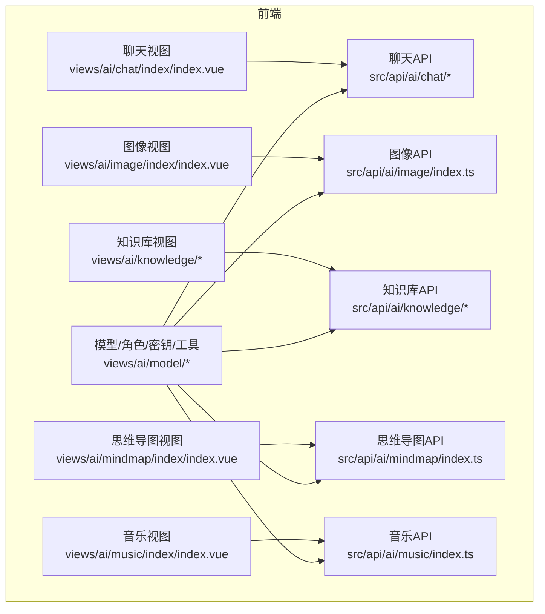
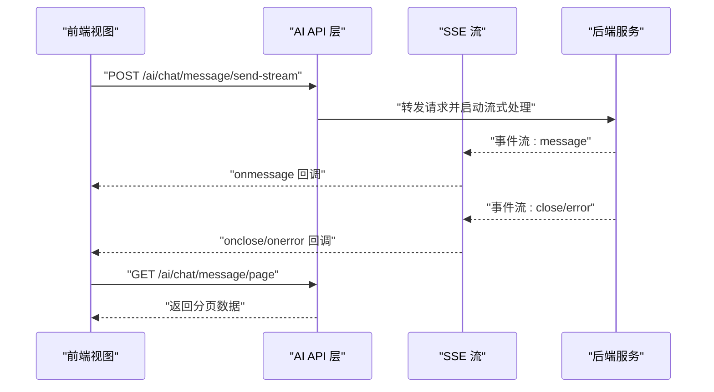
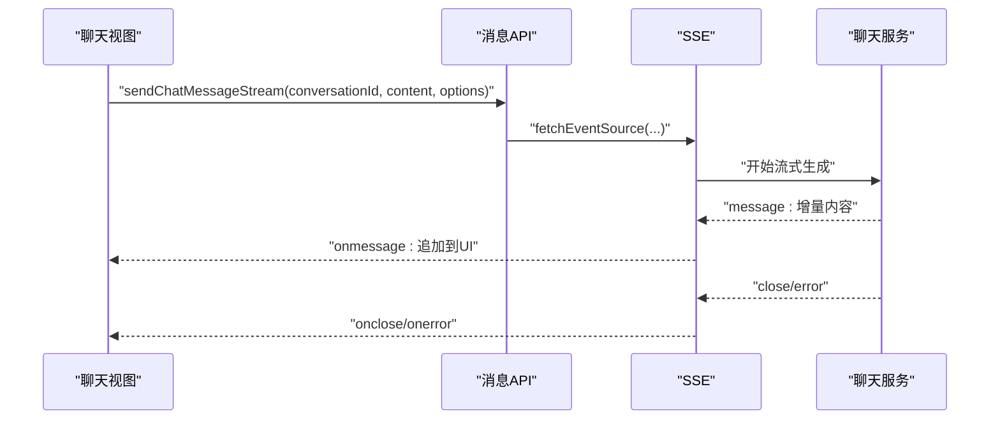
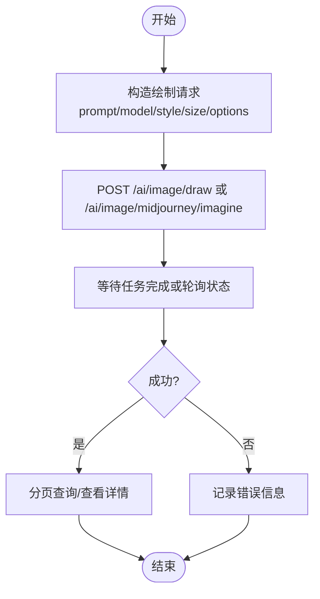
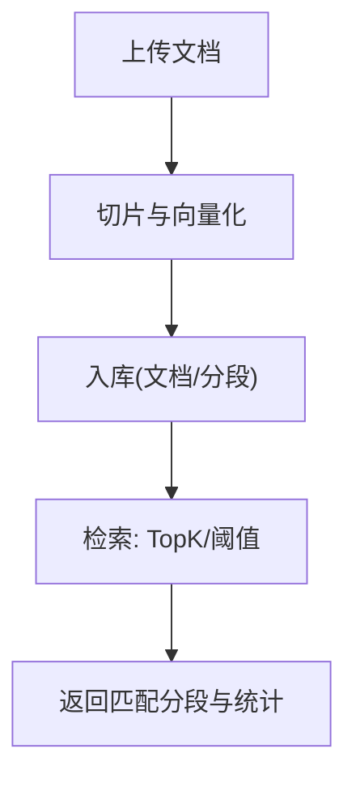
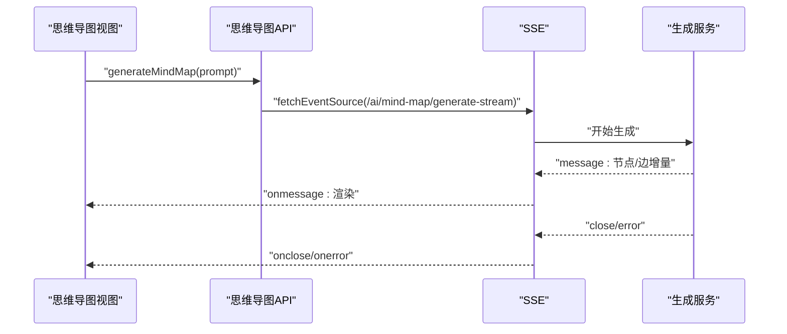
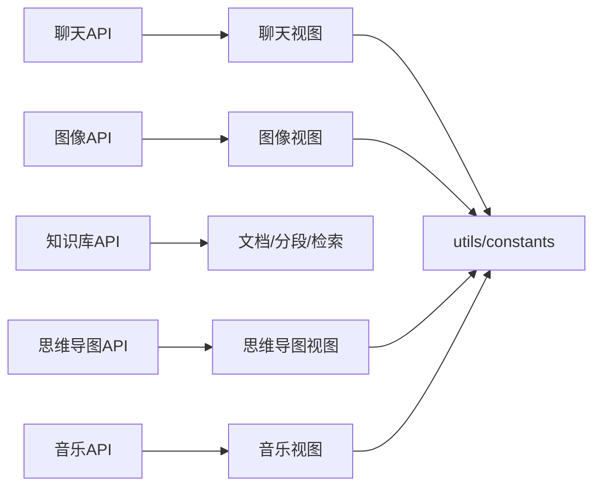

# AI集成模块

<cite>
**本文引用的文件**
- [chat/conversation/index.ts](file://yudao-ui/yudao-ui-admin-vue3/src/api/ai/chat/conversation/index.ts)
- [chat/message/index.ts](file://yudao-ui/yudao-ui-admin-vue3/src/api/ai/chat/message/index.ts)
- [image/index.ts](file://yudao-ui/yudao-ui-admin-vue3/src/api/ai/image/index.ts)
- [knowledge/document/index.ts](file://yudao-ui/yudao-ui-admin-vue3/src/api/ai/knowledge/document/index.ts)
- [knowledge/knowledge/index.ts](file://yudao-ui/yudao-ui-admin-vue3/src/api/ai/knowledge/knowledge/index.ts)
- [knowledge/segment/index.ts](file://yudao-ui/yudao-ui-admin-vue3/src/api/ai/knowledge/segment/index.ts)
- [mindmap/index.ts](file://yudao-ui/yudao-ui-admin-vue3/src/api/ai/mindmap/index.ts)
- [music/index.ts](file://yudao-ui/yudao-ui-admin-vue3/src/api/ai/music/index.ts)
- [views/ai/chat/index/index.vue](file://yudao-ui/yudao-ui-admin-vue3/src/views/ai/chat/index/index.vue)
- [views/ai/image/index/index.vue](file://yudao-ui/yudao-ui-admin-vue3/src/views/ai/image/index/index.vue)
- [views/ai/knowledge/document/index.vue](file://yudao-ui/yudao-ui-admin-vue3/src/views/ai/knowledge/document/index.vue)
- [views/ai/knowledge/knowledge/retrieval/index.vue](file://yudao-ui/yudao-ui-admin-vue3/src/views/ai/knowledge/knowledge/retrieval/index.vue)
- [views/ai/mindmap/index/index.vue](file://yudao-ui/yudao-ui-admin-vue3/src/views/ai/mindmap/index/index.vue)
- [views/ai/music/index/index.vue](file://yudao-ui/yudao-ui-admin-vue3/src/views/ai/music/index/index.vue)
- [views/ai/model/apiKey/index.vue](file://yudao-ui/yudao-ui-admin-vue3/src/views/ai/model/apiKey/index.vue)
- [views/ai/model/chatRole/index.vue](file://yudao-ui/yudao-ui-admin-vue3/src/views/ai/model/chatRole/index.vue)
- [views/ai/model/model/index.vue](file://yudao-ui/yudao-ui-admin-vue3/src/views/ai/model/model/index.vue)
- [views/ai/model/tool/index.vue](file://yudao-ui/yudao-ui-admin-vue3/src/views/ai/model/tool/index.vue)
- [views/ai/utils/constants.ts](file://yudao-ui/yudao-ui-admin-vue3/src/views/ai/utils/constants.ts)
- [views/ai/utils/utils.ts](file://yudao-ui/yudao-ui-admin-vue3/src/views/ai/utils/utils.ts)
</cite>

## 目录
1. [简介](#简介)
2. [项目结构](#项目结构)
3. [核心组件](#核心组件)
4. [架构总览](#架构总览)
5. [详细组件分析](#详细组件分析)
6. [依赖关系分析](#依赖关系分析)
7. [性能考虑](#性能考虑)
8. [故障排查指南](#故障排查指南)
9. [结论](#结论)
10. [附录](#附录)

## 简介
本指南面向后端与前端开发者，系统化讲解AI集成模块的设计与实现，覆盖以下能力：
- AI聊天机器人：对话管理、上下文保持、多轮对话与流式输出
- AI图像生成：提示词处理、多平台绘制、MJ动作按钮与结果管理
- AI知识库：文档上传、切片与向量化、检索策略与结果管理
- AI思维导图：主题提取、节点生成、样式定制与流式渲染
- AI音乐生成：风格选择、歌词/音频合成与播放控制
- 前端API接口：统一的REST与SSE调用规范
- 权限与配额：角色、模型、工具与内容安全治理

## 项目结构
AI功能主要由前端API层与视图层构成，后端通过HTTP接口暴露AI能力；同时提供模型、角色、密钥与工具等管理界面。

图表来源
- [views/ai/chat/index/index.vue](file://yudao-ui/yudao-ui-admin-vue3/src/views/ai/chat/index/index.vue)
- [views/ai/image/index/index.vue](file://yudao-ui/yudao-ui-admin-vue3/src/views/ai/image/index/index.vue)
- [views/ai/knowledge/document/index.vue](file://yudao-ui/yudao-ui-admin-vue3/src/views/ai/knowledge/document/index.vue)
- [views/ai/mindmap/index/index.vue](file://yudao-ui/yudao-ui-admin-vue3/src/views/ai/mindmap/index/index.vue)
- [views/ai/music/index/index.vue](file://yudao-ui/yudao-ui-admin-vue3/src/views/ai/music/index/index.vue)
- [views/ai/model/apiKey/index.vue](file://yudao-ui/yudao-ui-admin-vue3/src/views/ai/model/apiKey/index.vue)
- [views/ai/model/chatRole/index.vue](file://yudao-ui/yudao-ui-admin-vue3/src/views/ai/model/chatRole/index.vue)
- [views/ai/model/model/index.vue](file://yudao-ui/yudao-ui-admin-vue3/src/views/ai/model/model/index.vue)
- [views/ai/model/tool/index.vue](file://yudao-ui/yudao-ui-admin-vue3/src/views/ai/model/tool/index.vue)
- [chat/conversation/index.ts](file://yudao-ui/yudao-ui-admin-vue3/src/api/ai/chat/conversation/index.ts)
- [chat/message/index.ts](file://yudao-ui/yudao-ui-admin-vue3/src/api/ai/chat/message/index.ts)
- [image/index.ts](file://yudao-ui/yudao-ui-admin-vue3/src/api/ai/image/index.ts)
- [knowledge/document/index.ts](file://yudao-ui/yudao-ui-admin-vue3/src/api/ai/knowledge/document/index.ts)
- [knowledge/knowledge/index.ts](file://yudao-ui/yudao-ui-admin-vue3/src/api/ai/knowledge/knowledge/index.ts)
- [knowledge/segment/index.ts](file://yudao-ui/yudao-ui-admin-vue3/src/api/ai/knowledge/segment/index.ts)
- [mindmap/index.ts](file://yudao-ui/yudao-ui-admin-vue3/src/api/ai/mindmap/index.ts)
- [music/index.ts](file://yudao-ui/yudao-ui-admin-vue3/src/api/ai/music/index.ts)

章节来源
- [views/ai/chat/index/index.vue](file://yudao-ui/yudao-ui-admin-vue3/src/views/ai/chat/index/index.vue)
- [views/ai/image/index/index.vue](file://yudao-ui/yudao-ui-admin-vue3/src/views/ai/image/index/index.vue)
- [views/ai/knowledge/document/index.vue](file://yudao-ui/yudao-ui-admin-vue3/src/views/ai/knowledge/document/index.vue)
- [views/ai/knowledge/knowledge/retrieval/index.vue](file://yudao-ui/yudao-ui-admin-vue3/src/views/ai/knowledge/knowledge/retrieval/index.vue)
- [views/ai/mindmap/index/index.vue](file://yudao-ui/yudao-ui-admin-vue3/src/views/ai/mindmap/index/index.vue)
- [views/ai/music/index/index.vue](file://yudao-ui/yudao-ui-admin-vue3/src/views/ai/music/index/index.vue)
- [views/ai/utils/constants.ts](file://yudao-ui/yudao-ui-admin-vue3/src/views/ai/utils/constants.ts)
- [views/ai/utils/utils.ts](file://yudao-ui/yudao-ui-admin-vue3/src/views/ai/utils/utils.ts)

## 核心组件
- 聊天对话与消息API：提供会话创建/更新/删除、消息列表、流式发送与分页查询
- 图像生成API：支持通用绘制与Midjourney专属Imagine/Action流程
- 知识库API：文档、分段、向量检索与处理状态管理
- 思维导图API：主题驱动的流式生成与分页管理
- 音乐API：音乐生成结果的分页、更新与删除
- 模型/角色/密钥/工具管理：支撑AI能力的配置与治理

章节来源
- [chat/conversation/index.ts](file://yudao-ui/yudao-ui-admin-vue3/src/api/ai/chat/conversation/index.ts)
- [chat/message/index.ts](file://yudao-ui/yudao-ui-admin-vue3/src/api/ai/chat/message/index.ts)
- [image/index.ts](file://yudao-ui/yudao-ui-admin-vue3/src/api/ai/image/index.ts)
- [knowledge/document/index.ts](file://yudao-ui/yudao-ui-admin-vue3/src/api/ai/knowledge/document/index.ts)
- [knowledge/knowledge/index.ts](file://yudao-ui/yudao-ui-admin-vue3/src/api/ai/knowledge/knowledge/index.ts)
- [knowledge/segment/index.ts](file://yudao-ui/yudao-ui-admin-vue3/src/api/ai/knowledge/segment/index.ts)
- [mindmap/index.ts](file://yudao-ui/yudao-ui-admin-vue3/src/api/ai/mindmap/index.ts)
- [music/index.ts](file://yudao-ui/yudao-ui-admin-vue3/src/api/ai/music/index.ts)

## 架构总览
前端通过Axios与自定义SSE客户端发起请求，后端以REST接口提供AI能力；部分流式场景采用SSE推送增量数据。

图表来源
- [chat/message/index.ts](file://yudao-ui/yudao-ui-admin-vue3/src/api/ai/chat/message/index.ts)

## 详细组件分析

### 聊天机器人
- 对话管理
  - 支持“我的”对话的创建、更新、删除、清空（保留未置顶）
  - 支持分页查询与管理员删除
- 消息管理
  - 支持按会话查询消息列表
  - 支持流式发送消息（SSE），可选开启上下文与网络搜索
  - 支持删除单条消息与按会话批量删除
- 上下文与多轮对话
  - 通过对话VO中的温度、最大Token、上下文数量等参数控制
  - 流式回调中逐步拼接响应，支持推理内容与知识片段标注

图表来源
- [chat/message/index.ts](file://yudao-ui/yudao-ui-admin-vue3/src/api/ai/chat/message/index.ts)

章节来源
- [chat/conversation/index.ts](file://yudao-ui/yudao-ui-admin-vue3/src/api/ai/chat/conversation/index.ts)
- [chat/message/index.ts](file://yudao-ui/yudao-ui-admin-vue3/src/api/ai/chat/message/index.ts)

### AI图像生成
- 数据模型
  - 图像记录包含平台、模型、提示词、尺寸、状态、公开状态、任务ID、按钮集合等
  - Midjourney专属请求体包含Base64数组、版本等
- 接口能力
  - “我的”分页与详情查询
  - 通用绘制与MJ专属Imagine/Action
  - 管理端分页、更新公开状态与删除

图表来源
- [image/index.ts](file://yudao-ui/yudao-ui-admin-vue3/src/api/ai/image/index.ts)

章节来源
- [image/index.ts](file://yudao-ui/yudao-ui-admin-vue3/src/api/ai/image/index.ts)

### AI知识库
- 文档管理
  - 支持单个/批量新增、修改、启停、删除
  - 提供分页与详情查询
- 分段与向量化
  - 支持切片内容预览、分段分页、状态变更
  - 支持对文档集合进行处理状态查询
- 检索
  - 提供分段搜索接口，结合TopK与相似度阈值进行召回

图表来源
- [knowledge/document/index.ts](file://yudao-ui/yudao-ui-admin-vue3/src/api/ai/knowledge/document/index.ts)
- [knowledge/segment/index.ts](file://yudao-ui/yudao-ui-admin-vue3/src/api/ai/knowledge/segment/index.ts)
- [knowledge/knowledge/index.ts](file://yudao-ui/yudao-ui-admin-vue3/src/api/ai/knowledge/knowledge/index.ts)

章节来源
- [knowledge/document/index.ts](file://yudao-ui/yudao-ui-admin-vue3/src/api/ai/knowledge/document/index.ts)
- [knowledge/segment/index.ts](file://yudao-ui/yudao-ui-admin-vue3/src/api/ai/knowledge/segment/index.ts)
- [knowledge/knowledge/index.ts](file://yudao-ui/yudao-ui-admin-vue3/src/api/ai/knowledge/knowledge/index.ts)

### AI思维导图
- 主题驱动生成
  - 通过提示词触发流式生成，支持中断
  - 支持分页查询与删除
- 结果管理
  - 记录生成内容、平台、模型与错误信息

图表来源
- [mindmap/index.ts](file://yudao-ui/yudao-ui-admin-vue3/src/api/ai/mindmap/index.ts)

章节来源
- [mindmap/index.ts](file://yudao-ui/yudao-ui-admin-vue3/src/api/ai/mindmap/index.ts)

### AI音乐生成
- 数据模型
  - 包含标题、歌词、封面、音频/视频URL、风格标签、时长、状态等
- 接口能力
  - 分页查询、更新公开状态、删除

章节来源
- [music/index.ts](file://yudao-ui/yudao-ui-admin-vue3/src/api/ai/music/index.ts)

### 模型/角色/密钥/工具管理
- 模型管理：维护可用模型及其参数
- 角色管理：角色设定、头像与系统消息
- 密钥管理：接入第三方AI平台的API Key
- 工具管理：扩展AI能力的工具集

章节来源
- [views/ai/model/model/index.vue](file://yudao-ui/yudao-ui-admin-vue3/src/views/ai/model/model/index.vue)
- [views/ai/model/chatRole/index.vue](file://yudao-ui/yudao-ui-admin-vue3/src/views/ai/model/chatRole/index.vue)
- [views/ai/model/apiKey/index.vue](file://yudao-ui/yudao-ui-admin-vue3/src/views/ai/model/apiKey/index.vue)
- [views/ai/model/tool/index.vue](file://yudao-ui/yudao-ui-admin-vue3/src/views/ai/model/tool/index.vue)

## 依赖关系分析
- 前端API层对后端接口的依赖清晰，聊天与思维导图使用SSE，其他模块使用REST
- 视图层通过常量与工具方法组织交互逻辑，降低耦合
- 知识库模块内部文档/分段/检索形成闭环

图表来源
- [views/ai/utils/constants.ts](file://yudao-ui/yudao-ui-admin-vue3/src/views/ai/utils/constants.ts)
- [views/ai/utils/utils.ts](file://yudao-ui/yudao-ui-admin-vue3/src/views/ai/utils/utils.ts)
- [chat/message/index.ts](file://yudao-ui/yudao-ui-admin-vue3/src/api/ai/chat/message/index.ts)
- [mindmap/index.ts](file://yudao-ui/yudao-ui-admin-vue3/src/api/ai/mindmap/index.ts)
- [image/index.ts](file://yudao-ui/yudao-ui-admin-vue3/src/api/ai/image/index.ts)
- [music/index.ts](file://yudao-ui/yudao-ui-admin-vue3/src/api/ai/music/index.ts)
- [knowledge/document/index.ts](file://yudao-ui/yudao-ui-admin-vue3/src/api/ai/knowledge/document/index.ts)
- [knowledge/segment/index.ts](file://yudao-ui/yudao-ui-admin-vue3/src/api/ai/knowledge/segment/index.ts)

## 性能考虑
- 流式传输
  - 聊天与思维导图采用SSE，避免一次性大响应导致阻塞
  - 建议在前端侧节流渲染与滚动优化
- 分页与缓存
  - 所有列表均提供分页接口，建议结合本地缓存与懒加载
- 资源大小
  - 图像/音频/视频建议在后端做压缩与CDN加速
- 检索效率
  - 知识库检索结合TopK与阈值，减少无关召回

## 故障排查指南
- SSE连接失败
  - 检查鉴权头与后端SSE路由是否正确
  - 关注onerror与onclose回调，必要时重试或降级为轮询
- 流式中断
  - 使用AbortController中断请求，确保资源释放
- 知识库检索无结果
  - 调整TopK与相似度阈值，确认文档已切片与向量化
- 图像生成异常
  - 校验提示词与尺寸，查看错误信息字段定位问题

章节来源
- [chat/message/index.ts](file://yudao-ui/yudao-ui-admin-vue3/src/api/ai/chat/message/index.ts)
- [mindmap/index.ts](file://yudao-ui/yudao-ui-admin-vue3/src/api/ai/mindmap/index.ts)
- [image/index.ts](file://yudao-ui/yudao-ui-admin-vue3/src/api/ai/image/index.ts)
- [knowledge/segment/index.ts](file://yudao-ui/yudao-ui-admin-vue3/src/api/ai/knowledge/segment/index.ts)

## 结论
该AI集成模块以清晰的API与视图分层实现了从对话、图像、知识库到思维导图与音乐的完整链路。前端通过SSE与REST相结合的方式，兼顾实时性与稳定性；后端通过模型/角色/密钥/工具的管理实现能力治理与安全控制。建议在生产环境中完善配额与审计日志，强化内容合规与成本控制。

## 附录

### 前端API接口清单（按模块）

- 聊天对话
  - GET /ai/chat/conversation/get-my
  - POST /ai/chat/conversation/create-my
  - PUT /ai/chat/conversation/update-my
  - DELETE /ai/chat/conversation/delete-my
  - DELETE /ai/chat/conversation/delete-by-unpinned
  - GET /ai/chat/conversation/my-list
  - GET /ai/chat/conversation/page
  - DELETE /ai/chat/conversation/delete-by-admin

- 聊天消息
  - GET /ai/chat/message/list-by-conversation-id
  - POST /ai/chat/message/send-stream（SSE）
  - DELETE /ai/chat/message/delete
  - DELETE /ai/chat/message/delete-by-conversation-id
  - GET /ai/chat/message/page
  - DELETE /ai/chat/message/delete-by-admin

- 图像生成
  - GET /ai/image/my-page
  - GET /ai/image/get-my
  - GET /ai/image/my-list-by-ids
  - POST /ai/image/draw
  - DELETE /ai/image/delete-my
  - POST /ai/image/midjourney/imagine
  - POST /ai/image/midjourney/action
  - GET /ai/image/page
  - PUT /ai/image/update
  - DELETE /ai/image/delete

- 知识库-文档
  - GET /ai/knowledge/document/page
  - GET /ai/knowledge/document/get
  - POST /ai/knowledge/document/create
  - POST /ai/knowledge/document/create-list
  - PUT /ai/knowledge/document/update
  - PUT /ai/knowledge/document/update-status
  - DELETE /ai/knowledge/document/delete

- 知识库-知识库
  - GET /ai/knowledge/page
  - GET /ai/knowledge/get
  - POST /ai/knowledge/create
  - PUT /ai/knowledge/update
  - DELETE /ai/knowledge/delete
  - GET /ai/knowledge/simple-list

- 知识库-分段
  - GET /ai/knowledge/segment/page
  - GET /ai/knowledge/segment/get
  - POST /ai/knowledge/segment/create
  - PUT /ai/knowledge/segment/update
  - PUT /ai/knowledge/segment/update-status
  - GET /ai/knowledge/segment/split
  - GET /ai/knowledge/segment/get-process-list
  - GET /ai/knowledge/segment/search

- 思维导图
  - POST /ai/mind-map/generate-stream（SSE）
  - GET /ai/mind-map/page
  - DELETE /ai/mind-map/delete

- 音乐
  - GET /ai/music/page
  - PUT /ai/music/update
  - DELETE /ai/music/delete

章节来源
- [chat/conversation/index.ts](file://yudao-ui/yudao-ui-admin-vue3/src/api/ai/chat/conversation/index.ts)
- [chat/message/index.ts](file://yudao-ui/yudao-ui-admin-vue3/src/api/ai/chat/message/index.ts)
- [image/index.ts](file://yudao-ui/yudao-ui-admin-vue3/src/api/ai/image/index.ts)
- [knowledge/document/index.ts](file://yudao-ui/yudao-ui-admin-vue3/src/api/ai/knowledge/document/index.ts)
- [knowledge/knowledge/index.ts](file://yudao-ui/yudao-ui-admin-vue3/src/api/ai/knowledge/knowledge/index.ts)
- [knowledge/segment/index.ts](file://yudao-ui/yudao-ui-admin-vue3/src/api/ai/knowledge/segment/index.ts)
- [mindmap/index.ts](file://yudao-ui/yudao-ui-admin-vue3/src/api/ai/mindmap/index.ts)
- [music/index.ts](file://yudao-ui/yudao-ui-admin-vue3/src/api/ai/music/index.ts)

### 开发示例要点
- 集成主流AI服务
  - 在“模型/角色/密钥/工具”页面配置平台密钥与模型参数
  - 聊天与思维导图使用SSE，注意鉴权头与信号控制
- 处理AI响应数据
  - 聊天：逐条message拼接到消息列表
  - 图像：根据状态轮询或监听任务完成事件
  - 知识库：先切片再检索，结合TopK与阈值筛选
  - 思维导图：流式渲染节点与连接线
  - 音乐：下载音频/视频URL并控制播放

章节来源
- [views/ai/model/apiKey/index.vue](file://yudao-ui/yudao-ui-admin-vue3/src/views/ai/model/apiKey/index.vue)
- [views/ai/model/chatRole/index.vue](file://yudao-ui/yudao-ui-admin-vue3/src/views/ai/model/chatRole/index.vue)
- [views/ai/model/model/index.vue](file://yudao-ui/yudao-ui-admin-vue3/src/views/ai/model/model/index.vue)
- [views/ai/model/tool/index.vue](file://yudao-ui/yudao-ui-admin-vue3/src/views/ai/model/tool/index.vue)
- [chat/message/index.ts](file://yudao-ui/yudao-ui-admin-vue3/src/api/ai/chat/message/index.ts)
- [mindmap/index.ts](file://yudao-ui/yudao-ui-admin-vue3/src/api/ai/mindmap/index.ts)
- [image/index.ts](file://yudao-ui/yudao-ui-admin-vue3/src/api/ai/image/index.ts)
- [knowledge/segment/index.ts](file://yudao-ui/yudao-ui-admin-vue3/src/api/ai/knowledge/segment/index.ts)
- [music/index.ts](file://yudao-ui/yudao-ui-admin-vue3/src/api/ai/music/index.ts)

### 权限控制与使用限制
- 角色与模型
  - 通过角色管理设置系统消息与头像；通过模型管理配置温度、上下文与Token上限
- 密钥与工具
  - 密钥用于对接第三方平台；工具用于扩展AI能力
- 配额与审计
  - 建议在后端引入配额/用量统计与审计日志，结合前端弹窗提示与后端拦截
- 内容审核
  - 对提示词与生成内容进行关键词过滤与合规检查，失败时记录错误信息

章节来源
- [views/ai/model/chatRole/index.vue](file://yudao-ui/yudao-ui-admin-vue3/src/views/ai/model/chatRole/index.vue)
- [views/ai/model/model/index.vue](file://yudao-ui/yudao-ui-admin-vue3/src/views/ai/model/model/index.vue)
- [views/ai/model/apiKey/index.vue](file://yudao-ui/yudao-ui-admin-vue3/src/views/ai/model/apiKey/index.vue)
- [views/ai/model/tool/index.vue](file://yudao-ui/yudao-ui-admin-vue3/src/views/ai/model/tool/index.vue)