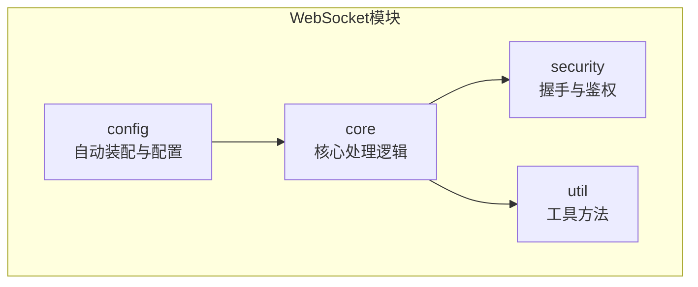
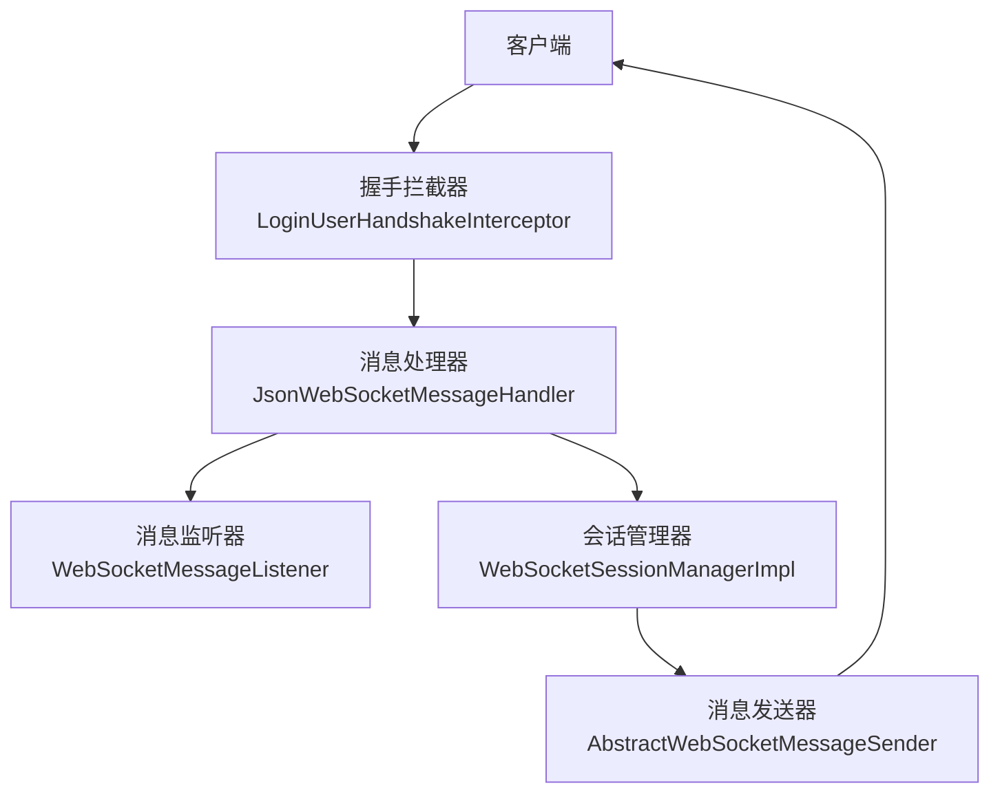
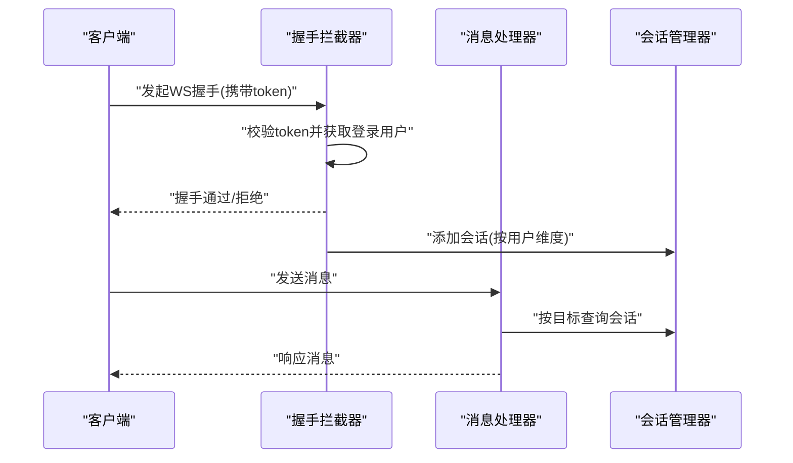
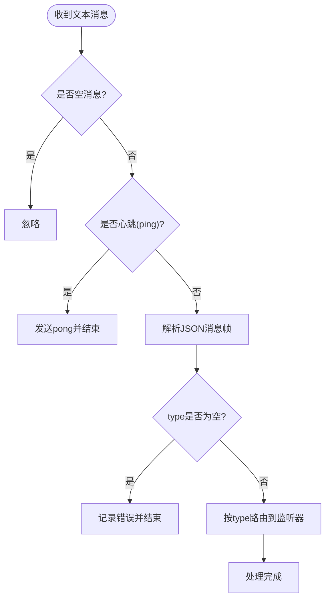
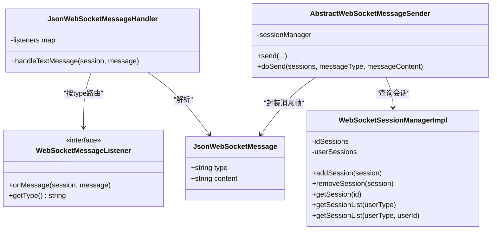
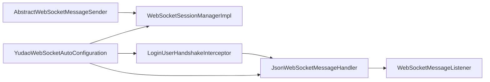

# WebSocket通信系统

<cite>
**本文档引用的文件**
- [YudaoWebSocketAutoConfiguration.java](file://yudao-framework/yudao-spring-boot-starter-websocket/src/main/java/cn/iocoder/yudao/framework/websocket/config/YudaoWebSocketAutoConfiguration.java)
- [WebSocketProperties.java](file://yudao-framework/yudao-spring-boot-starter-websocket/src/main/java/cn/iocoder/yudao/framework/websocket/config/WebSocketProperties.java)
- [JsonWebSocketMessageHandler.java](file://yudao-framework/yudao-spring-boot-starter-websocket/src/main/java/cn/iocoder/yudao/framework/websocket/core/handler/JsonWebSocketMessageHandler.java)
- [WebSocketSessionManagerImpl.java](file://yudao-framework/yudao-spring-boot-starter-websocket/src/main/java/cn/iocoder/yudao/framework/websocket/core/session/WebSocketSessionManagerImpl.java)
- [JsonWebSocketMessage.java](file://yudao-framework/yudao-spring-boot-starter-websocket/src/main/java/cn/iocoder/yudao/framework/websocket/core/message/JsonWebSocketMessage.java)
- [LoginUserHandshakeInterceptor.java](file://yudao-framework/yudao-spring-boot-starter-websocket/src/main/java/cn/iocoder/yudao/framework/websocket/core/security/LoginUserHandshakeInterceptor.java)
- [WebSocketMessageListener.java](file://yudao-framework/yudao-spring-boot-starter-websocket/src/main/java/cn/iocoder/yudao/framework/websocket/core/listener/WebSocketMessageListener.java)
- [AbstractWebSocketMessageSender.java](file://yudao-framework/yudao-spring-boot-starter-websocket/src/main/java/cn/iocoder/yudao/framework/websocket/core/sender/AbstractWebSocketMessageSender.java)
</cite>

## 目录
1. [简介](#简介)
2. [项目结构](#项目结构)
3. [核心组件](#核心组件)
4. [架构总览](#架构总览)
5. [详细组件分析](#详细组件分析)
6. [依赖关系分析](#依赖关系分析)
7. [性能考虑](#性能考虑)
8. [故障排查指南](#故障排查指南)
9. [结论](#结论)
10. [附录](#附录)

## 简介
本文件面向即时通讯模块的WebSocket通信系统，基于RuoYi Vue Pro项目中的yudao-spring-boot-starter-websocket子模块，提供从连接建立与管理、消息路由与分发、序列化与反序列化、安全与权限控制，到API接口说明与性能优化的完整技术文档。读者可据此理解并扩展高性能、可扩展的实时通信能力。

## 项目结构
WebSocket模块位于yudao-framework/yudao-spring-boot-starter-websocket中，采用按功能域分层组织：
- config：自动装配与配置属性（启用开关、连接路径、消息发送器类型）
- core：核心处理逻辑（消息处理器、会话管理、消息监听器、消息发送器抽象等）
- security：握手拦截与鉴权集成
- util：框架工具方法

图表来源
- [YudaoWebSocketAutoConfiguration.java:1-183](file://yudao-framework/yudao-spring-boot-starter-websocket/src/main/java/cn/iocoder/yudao/framework/websocket/config/YudaoWebSocketAutoConfiguration.java#L1-L183)
- [WebSocketProperties.java:1-35](file://yudao-framework/yudao-spring-boot-starter-websocket/src/main/java/cn/iocoder/yudao/framework/websocket/config/WebSocketProperties.java#L1-L35)

章节来源
- [YudaoWebSocketAutoConfiguration.java:1-183](file://yudao-framework/yudao-spring-boot-starter-websocket/src/main/java/cn/iocoder/yudao/framework/websocket/config/YudaoWebSocketAutoConfiguration.java#L1-L183)
- [WebSocketProperties.java:1-35](file://yudao-framework/yudao-spring-boot-starter-websocket/src/main/java/cn/iocoder/yudao/framework/websocket/config/WebSocketProperties.java#L1-L35)

## 核心组件
- 自动装配与注册：负责注册WebSocket处理器、握手拦截器、会话管理器及多种消息发送器实现（本地/Redis/RocketMQ/Kafka/RabbitMQ），并暴露配置属性。
- 消息处理器：基于JSON消息帧进行解析与分发，支持心跳检测（ping/pong）。
- 会话管理：维护按会话ID与用户维度的并发安全会话集合，支持按用户类型/用户ID查询。
- 消息监听器：定义消息类型与处理接口，实现具体业务消息处理。
- 消息发送器：抽象统一的发送接口，内部根据目标选择单会话或批量会话发送。
- 握手拦截器：在握手阶段完成登录态注入，确保后续会话具备用户上下文。

章节来源
- [YudaoWebSocketAutoConfiguration.java:47-183](file://yudao-framework/yudao-spring-boot-starter-websocket/src/main/java/cn/iocoder/yudao/framework/websocket/config/YudaoWebSocketAutoConfiguration.java#L47-L183)
- [JsonWebSocketMessageHandler.java:31-84](file://yudao-framework/yudao-spring-boot-starter-websocket/src/main/java/cn/iocoder/yudao/framework/websocket/core/handler/JsonWebSocketMessageHandler.java#L31-L84)
- [WebSocketSessionManagerImpl.java:22-126](file://yudao-framework/yudao-spring-boot-starter-websocket/src/main/java/cn/iocoder/yudao/framework/websocket/core/session/WebSocketSessionManagerImpl.java#L22-L126)
- [WebSocketMessageListener.java:13-32](file://yudao-framework/yudao-spring-boot-starter-websocket/src/main/java/cn/iocoder/yudao/framework/websocket/core/listener/WebSocketMessageListener.java#L13-L32)
- [AbstractWebSocketMessageSender.java:25-107](file://yudao-framework/yudao-spring-boot-starter-websocket/src/main/java/cn/iocoder/yudao/framework/websocket/core/sender/AbstractWebSocketMessageSender.java#L25-L107)
- [LoginUserHandshakeInterceptor.java:24-44](file://yudao-framework/yudao-spring-boot-starter-websocket/src/main/java/cn/iocoder/yudao/framework/websocket/core/security/LoginUserHandshakeInterceptor.java#L24-L44)

## 架构总览
WebSocket系统由“连接接入层”、“消息处理层”、“会话管理层”、“消息发送层”和“安全鉴权层”构成，整体流程为：客户端发起握手→鉴权拦截器注入用户→处理器解析消息→按type路由到监听器→发送器按目标选择会话→最终推送至客户端。

图表来源
- [LoginUserHandshakeInterceptor.java:24-44](file://yudao-framework/yudao-spring-boot-starter-websocket/src/main/java/cn/iocoder/yudao/framework/websocket/core/security/LoginUserHandshakeInterceptor.java#L24-L44)
- [JsonWebSocketMessageHandler.java:31-84](file://yudao-framework/yudao-spring-boot-starter-websocket/src/main/java/cn/iocoder/yudao/framework/websocket/core/handler/JsonWebSocketMessageHandler.java#L31-L84)
- [WebSocketSessionManagerImpl.java:22-126](file://yudao-framework/yudao-spring-boot-starter-websocket/src/main/java/cn/iocoder/yudao/framework/websocket/core/session/WebSocketSessionManagerImpl.java#L22-L126)
- [AbstractWebSocketMessageSender.java:25-107](file://yudao-framework/yudao-spring-boot-starter-websocket/src/main/java/cn/iocoder/yudao/framework/websocket/core/sender/AbstractWebSocketMessageSender.java#L25-L107)

## 详细组件分析

### 连接建立与管理机制
- 连接路径与启用控制：通过配置属性控制WebSocket连接路径与启用开关，默认路径为/ws，可通过yudao.websocket.enable与yudao.websocket.path调整。
- 握手拦截：在握手阶段从安全框架获取登录用户，注入到WebSocketSession属性中，便于后续鉴权与会话管理。
- 会话存储：按会话ID与用户维度（用户类型+用户ID）维护并发安全的会话集合，支持查询与清理。

图表来源
- [YudaoWebSocketAutoConfiguration.java:49-78](file://yudao-framework/yudao-spring-boot-starter-websocket/src/main/java/cn/iocoder/yudao/framework/websocket/config/YudaoWebSocketAutoConfiguration.java#L49-L78)
- [LoginUserHandshakeInterceptor.java:26-41](file://yudao-framework/yudao-spring-boot-starter-websocket/src/main/java/cn/iocoder/yudao/framework/websocket/core/security/LoginUserHandshakeInterceptor.java#L26-L41)
- [WebSocketSessionManagerImpl.java:40-84](file://yudao-framework/yudao-spring-boot-starter-websocket/src/main/java/cn/iocoder/yudao/framework/websocket/core/session/WebSocketSessionManagerImpl.java#L40-L84)

章节来源
- [YudaoWebSocketAutoConfiguration.java:49-78](file://yudao-framework/yudao-spring-boot-starter-websocket/src/main/java/cn/iocoder/yudao/framework/websocket/config/YudaoWebSocketAutoConfiguration.java#L49-L78)
- [WebSocketProperties.java:20-32](file://yudao-framework/yudao-spring-boot-starter-websocket/src/main/java/cn/iocoder/yudao/framework/websocket/config/WebSocketProperties.java#L20-L32)
- [LoginUserHandshakeInterceptor.java:26-41](file://yudao-framework/yudao-spring-boot-starter-websocket/src/main/java/cn/iocoder/yudao/framework/websocket/core/security/LoginUserHandshakeInterceptor.java#L26-L41)
- [WebSocketSessionManagerImpl.java:40-84](file://yudao-framework/yudao-spring-boot-starter-websocket/src/main/java/cn/iocoder/yudao/framework/websocket/core/session/WebSocketSessionManagerImpl.java#L40-L84)

### 心跳检测与断线重连策略
- 心跳检测：处理器识别长度为4且内容为"ping"的心跳消息，直接回显"pong"，避免空闲连接被中间设备断开。
- 断线处理：会话移除时从按用户维度的列表中清理，确保不会向已关闭会话发送消息。
- 建议策略：客户端应周期性发送心跳；服务端在会话关闭回调中清理资源；对于多实例部署，建议使用Redis/RocketMQ等消息发送器实现跨节点一致性。

图表来源
- [JsonWebSocketMessageHandler.java:44-81](file://yudao-framework/yudao-spring-boot-starter-websocket/src/main/java/cn/iocoder/yudao/framework/websocket/core/handler/JsonWebSocketMessageHandler.java#L44-L81)

章节来源
- [JsonWebSocketMessageHandler.java:44-81](file://yudao-framework/yudao-spring-boot-starter-websocket/src/main/java/cn/iocoder/yudao/framework/websocket/core/handler/JsonWebSocketMessageHandler.java#L44-L81)
- [WebSocketSessionManagerImpl.java:66-84](file://yudao-framework/yudao-spring-boot-starter-websocket/src/main/java/cn/iocoder/yudao/framework/websocket/core/session/WebSocketSessionManagerImpl.java#L66-L84)

### 消息路由与分发系统
- 消息格式：采用统一的JSON消息帧，包含type与content字段，其中type用于路由，content为业务对象的JSON字符串。
- 路由机制：处理器构建type到监听器的映射，按type查找对应监听器并反序列化content为具体类型对象后调用onMessage。
- 广播与定向：发送器支持按sessionId、userType、userType+userId三种粒度选择目标会话集合，实现定向推送与广播。

图表来源
- [JsonWebSocketMessage.java:14-30](file://yudao-framework/yudao-spring-boot-starter-websocket/src/main/java/cn/iocoder/yudao/framework/websocket/core/message/JsonWebSocketMessage.java#L14-L30)
- [WebSocketMessageListener.java:13-32](file://yudao-framework/yudao-spring-boot-starter-websocket/src/main/java/cn/iocoder/yudao/framework/websocket/core/listener/WebSocketMessageListener.java#L13-L32)
- [JsonWebSocketMessageHandler.java:31-84](file://yudao-framework/yudao-spring-boot-starter-websocket/src/main/java/cn/iocoder/yudao/framework/websocket/core/handler/JsonWebSocketMessageHandler.java#L31-L84)
- [AbstractWebSocketMessageSender.java:25-107](file://yudao-framework/yudao-spring-boot-starter-websocket/src/main/java/cn/iocoder/yudao/framework/websocket/core/sender/AbstractWebSocketMessageSender.java#L25-L107)
- [WebSocketSessionManagerImpl.java:22-126](file://yudao-framework/yudao-spring-boot-starter-websocket/src/main/java/cn/iocoder/yudao/framework/websocket/core/session/WebSocketSessionManagerImpl.java#L22-L126)

章节来源
- [JsonWebSocketMessage.java:14-30](file://yudao-framework/yudao-spring-boot-starter-websocket/src/main/java/cn/iocoder/yudao/framework/websocket/core/message/JsonWebSocketMessage.java#L14-L30)
- [JsonWebSocketMessageHandler.java:38-81](file://yudao-framework/yudao-spring-boot-starter-websocket/src/main/java/cn/iocoder/yudao/framework/websocket/core/handler/JsonWebSocketMessageHandler.java#L38-L81)
- [AbstractWebSocketMessageSender.java:53-104](file://yudao-framework/yudao-spring-boot-starter-websocket/src/main/java/cn/iocoder/yudao/framework/websocket/core/sender/AbstractWebSocketMessageSender.java#L53-L104)
- [WebSocketSessionManagerImpl.java:40-123](file://yudao-framework/yudao-spring-boot-starter-websocket/src/main/java/cn/iocoder/yudao/framework/websocket/core/session/WebSocketSessionManagerImpl.java#L40-L123)

### 序列化与反序列化处理
- 消息序列化：发送前将消息类型与内容封装为JsonWebSocketMessage，再序列化为JSON字符串。
- 消息反序列化：处理器解析JSON为JsonWebSocketMessage，随后根据监听器泛型参数类型反序列化content为具体对象。
- 协议版本管理：当前实现未内置版本字段，如需兼容升级，可在消息帧中引入version字段并在处理器侧做分支处理。

章节来源
- [AbstractWebSocketMessageSender.java:83-104](file://yudao-framework/yudao-spring-boot-starter-websocket/src/main/java/cn/iocoder/yudao/framework/websocket/core/sender/AbstractWebSocketMessageSender.java#L83-L104)
- [JsonWebSocketMessageHandler.java:56-77](file://yudao-framework/yudao-spring-boot-starter-websocket/src/main/java/cn/iocoder/yudao/framework/websocket/core/handler/JsonWebSocketMessageHandler.java#L56-L77)

### 安全机制与权限验证
- 连接鉴权：握手拦截器在握手前从安全框架获取登录用户，若无有效用户则拒绝握手，确保只有已认证用户能建立连接。
- 消息访问控制：处理器在处理消息时可结合登录用户上下文执行业务级权限判断（例如仅允许本人接收消息）。
- 跨域支持：自动装配中允许所有来源模式，便于前端开发调试，生产环境建议收紧。

章节来源
- [LoginUserHandshakeInterceptor.java:26-35](file://yudao-framework/yudao-spring-boot-starter-websocket/src/main/java/cn/iocoder/yudao/framework/websocket/core/security/LoginUserHandshakeInterceptor.java#L26-L35)
- [YudaoWebSocketAutoConfiguration.java:52-58](file://yudao-framework/yudao-spring-boot-starter-websocket/src/main/java/cn/iocoder/yudao/framework/websocket/config/YudaoWebSocketAutoConfiguration.java#L52-L58)

### API接口文档
以下为WebSocket通信的关键接口说明（以方法签名形式描述，具体实现见相应类）：

- 连接建立
  - 注册处理器与拦截器：在自动装配中完成，无需手动调用
  - 连接路径：yudao.websocket.path（默认"/ws"）
  - 跨域设置：允许所有来源模式
  - 参考路径：[YudaoWebSocketAutoConfiguration.java:49-78](file://yudao-framework/yudao-spring-boot-starter-websocket/src/main/java/cn/iocoder/yudao/framework/websocket/config/YudaoWebSocketAutoConfiguration.java#L49-L78)

- 消息发送
  - 按sessionId发送：send(sessionId, messageType, messageContent)
  - 按用户类型发送：send(userType, messageType, messageContent)
  - 按用户类型+用户ID发送：send(userType, userId, messageType, messageContent)
  - 参考路径：[AbstractWebSocketMessageSender.java:29-74](file://yudao-framework/yudao-spring-boot-starter-websocket/src/main/java/cn/iocoder/yudao/framework/websocket/core/sender/AbstractWebSocketMessageSender.java#L29-L74)

- 连接关闭
  - 会话移除：removeSession(session)，从按用户维度的列表中清理
  - 参考路径：[WebSocketSessionManagerImpl.java:66-84](file://yudao-framework/yudao-spring-boot-starter-websocket/src/main/java/cn/iocoder/yudao/framework/websocket/core/session/WebSocketSessionManagerImpl.java#L66-L84)

- 心跳处理
  - 收到"ping"立即回"pong"
  - 参考路径：[JsonWebSocketMessageHandler.java:50-54](file://yudao-framework/yudao-spring-boot-starter-websocket/src/main/java/cn/iocoder/yudao/framework/websocket/core/handler/JsonWebSocketMessageHandler.java#L50-L54)

## 依赖关系分析
- 组件耦合
  - 消息处理器依赖监听器集合，通过type进行解耦路由
  - 发送器依赖会话管理器进行目标选择
  - 握手拦截器依赖安全框架获取登录用户
- 外部依赖
  - Spring WebSocket、Spring Security、Hutool、JsonUtils等
- 循环依赖
  - 当前设计无循环依赖，各层职责清晰

图表来源
- [YudaoWebSocketAutoConfiguration.java:49-183](file://yudao-framework/yudao-spring-boot-starter-websocket/src/main/java/cn/iocoder/yudao/framework/websocket/config/YudaoWebSocketAutoConfiguration.java#L49-L183)
- [JsonWebSocketMessageHandler.java:31-84](file://yudao-framework/yudao-spring-boot-starter-websocket/src/main/java/cn/iocoder/yudao/framework/websocket/core/handler/JsonWebSocketMessageHandler.java#L31-L84)
- [WebSocketSessionManagerImpl.java:22-126](file://yudao-framework/yudao-spring-boot-starter-websocket/src/main/java/cn/iocoder/yudao/framework/websocket/core/session/WebSocketSessionManagerImpl.java#L22-L126)
- [LoginUserHandshakeInterceptor.java:24-44](file://yudao-framework/yudao-spring-boot-starter-websocket/src/main/java/cn/iocoder/yudao/framework/websocket/core/security/LoginUserHandshakeInterceptor.java#L24-L44)

章节来源
- [YudaoWebSocketAutoConfiguration.java:49-183](file://yudao-framework/yudao-spring-boot-starter-websocket/src/main/java/cn/iocoder/yudao/framework/websocket/config/YudaoWebSocketAutoConfiguration.java#L49-L183)

## 性能考虑
- 并发容器
  - 使用ConcurrentHashMap与CopyOnWriteArrayList保证高并发下的读写性能
- 批量发送
  - 发送器对多个会话逐一发送，建议在业务侧合并小消息，减少网络往返
- 跨节点一致性
  - 在多实例部署场景下，优先选择Redis/RocketMQ/Kafka/RabbitMQ等消息发送器，避免本地会话丢失
- 心跳与保活
  - 客户端定期发送心跳，服务端快速响应，降低中间设备误判断开的概率
- 日志与监控
  - 发送失败与会话不存在的日志级别建议调整为warn/error，便于问题定位

## 故障排查指南
- 握手失败
  - 检查token参数是否正确传递，确认拦截器是否返回true
  - 参考路径：[LoginUserHandshakeInterceptor.java:26-35](file://yudao-framework/yudao-spring-boot-starter-websocket/src/main/java/cn/iocoder/yudao/framework/websocket/core/security/LoginUserHandshakeInterceptor.java#L26-L35)
- 消息解析失败
  - 确认消息帧包含type与合法JSON content
  - 参考路径：[JsonWebSocketMessageHandler.java:56-77](file://yudao-framework/yudao-spring-boot-starter-websocket/src/main/java/cn/iocoder/yudao/framework/websocket/core/handler/JsonWebSocketMessageHandler.java#L56-L77)
- 未匹配到会话
  - 检查目标sessionId/userType/userId是否存在，或会话是否已关闭
  - 参考路径：[AbstractWebSocketMessageSender.java:66-71](file://yudao-framework/yudao-spring-boot-starter-websocket/src/main/java/cn/iocoder/yudao/framework/websocket/core/sender/AbstractWebSocketMessageSender.java#L66-L71)
- 跨域问题
  - 确认自动装配中已设置允许所有来源模式
  - 参考路径：[YudaoWebSocketAutoConfiguration.java:52-58](file://yudao-framework/yudao-spring-boot-starter-websocket/src/main/java/cn/iocoder/yudao/framework/websocket/config/YudaoWebSocketAutoConfiguration.java#L52-L58)

章节来源
- [LoginUserHandshakeInterceptor.java:26-35](file://yudao-framework/yudao-spring-boot-starter-websocket/src/main/java/cn/iocoder/yudao/framework/websocket/core/security/LoginUserHandshakeInterceptor.java#L26-L35)
- [JsonWebSocketMessageHandler.java:56-77](file://yudao-framework/yudao-spring-boot-starter-websocket/src/main/java/cn/iocoder/yudao/framework/websocket/core/handler/JsonWebSocketMessageHandler.java#L56-L77)
- [AbstractWebSocketMessageSender.java:66-71](file://yudao-framework/yudao-spring-boot-starter-websocket/src/main/java/cn/iocoder/yudao/framework/websocket/core/sender/AbstractWebSocketMessageSender.java#L66-L71)
- [YudaoWebSocketAutoConfiguration.java:52-58](file://yudao-framework/yudao-spring-boot-starter-websocket/src/main/java/cn/iocoder/yudao/framework/websocket/config/YudaoWebSocketAutoConfiguration.java#L52-L58)

## 结论
该WebSocket通信系统通过自动装配、握手拦截、消息路由与会话管理实现了稳定可靠的实时通信能力。配合多种消息发送器可满足单机与分布式场景的需求。建议在生产环境中启用更严格的跨域策略、完善消息版本管理与错误日志分级，并结合监控体系持续优化性能与可用性。

## 附录
- 配置项参考
  - yudao.websocket.enable：是否启用WebSocket（默认true）
  - yudao.websocket.path：WebSocket连接路径（默认"/ws"）
  - yudao.websocket.sender-type：消息发送器类型（local/redis/rocketmq/kafka/rabbitmq）
  - 参考路径：[WebSocketProperties.java:20-32](file://yudao-framework/yudao-spring-boot-starter-websocket/src/main/java/cn/iocoder/yudao/framework/websocket/config/WebSocketProperties.java#L20-L32)