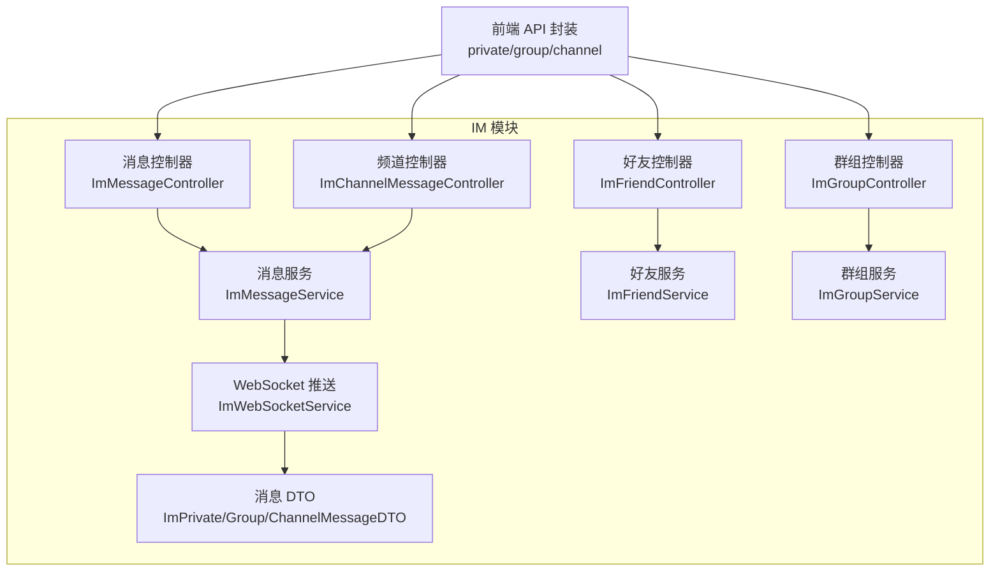
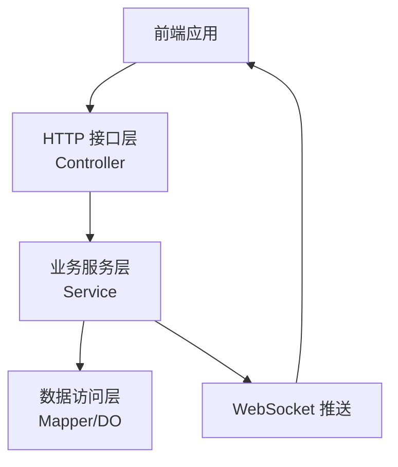
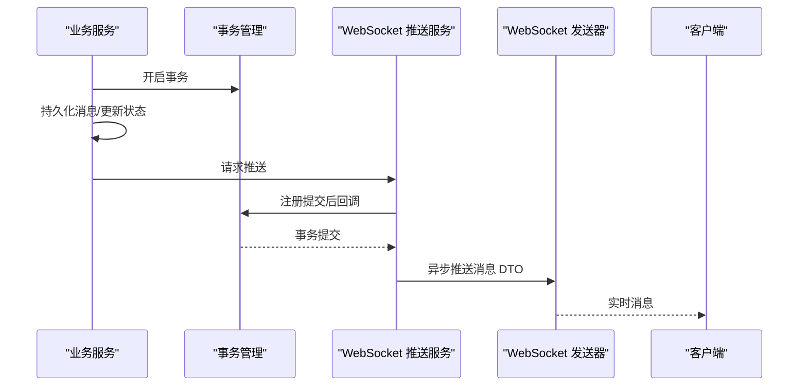
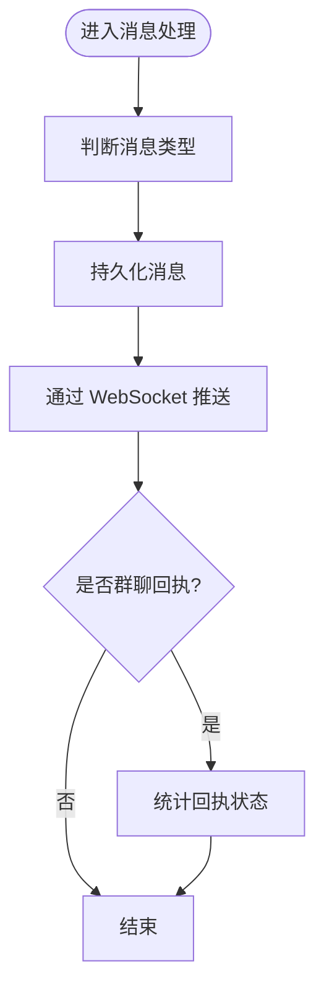
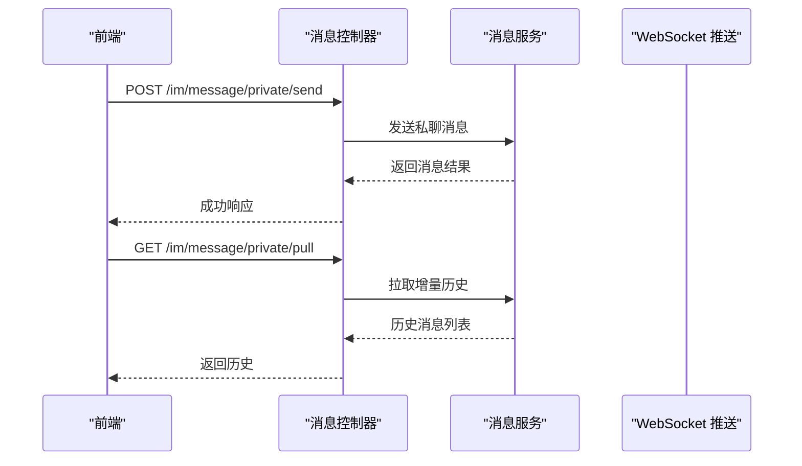
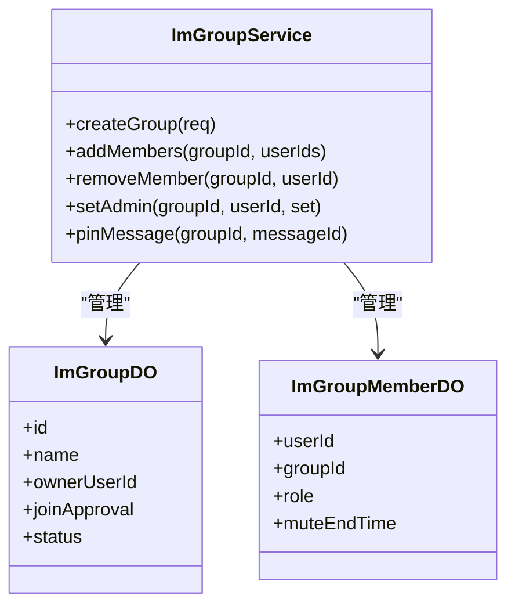
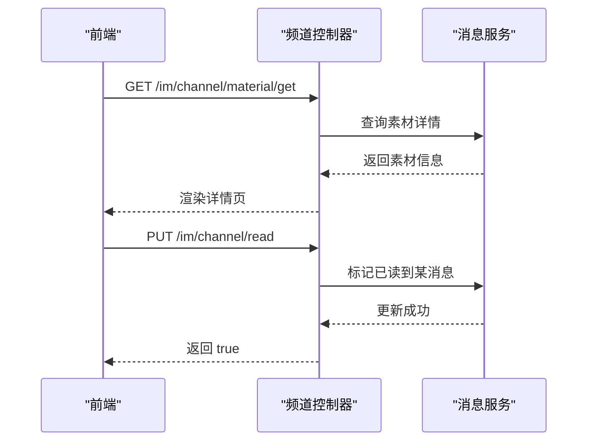
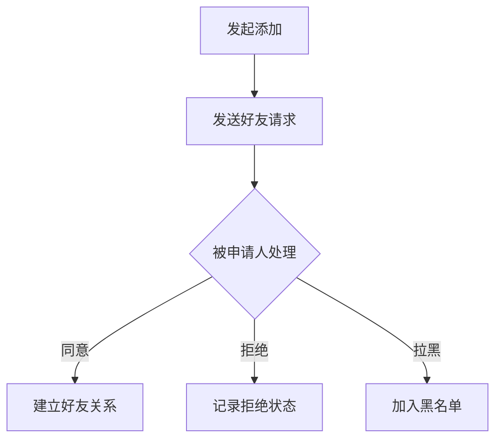
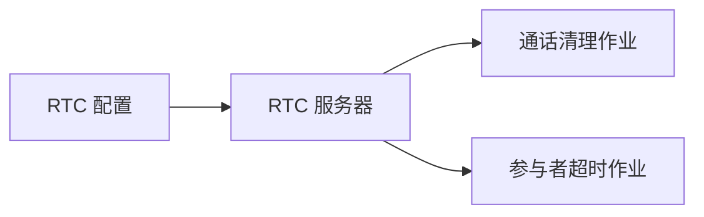
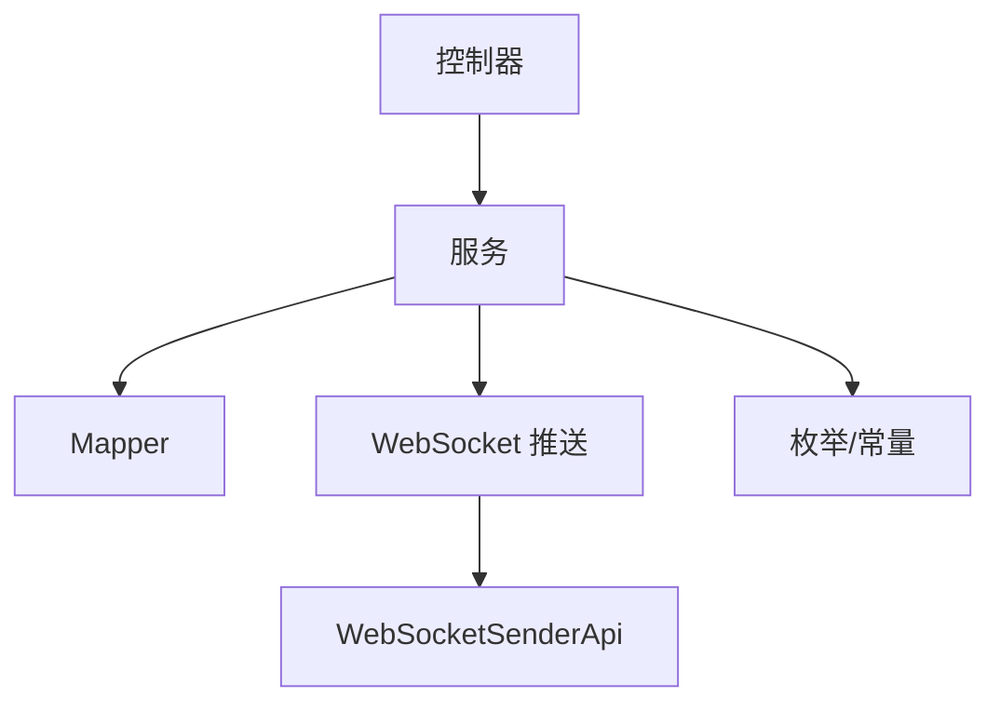

# 即时通讯模块

<cite>
**本文引用的文件**
- [yudao-module-im/src/main/java/cn/iocoder/yudao/module/im/package-info.java](file://yudao-module-im/src/main/java/cn/iocoder/yudao/module/im/package-info.java)
- [yudao-module-im/src/main/java/cn/iocoder/yudao/module/im/service/websocket/ImWebSocketService.java](file://yudao-module-im/src/main/java/cn/iocoder/yudao/module/im/service/websocket/ImWebSocketService.java)
- [yudao-module-im/src/main/java/cn/iocoder/yudao/module/im/service/websocket/ImWebSocketServiceImpl.java](file://yudao-module-im/src/main/java/cn/iocoder/yudao/module/im/service/websocket/ImWebSocketServiceImpl.java)
- [yudao-module-im/src/main/java/cn/iocoder/yudao/module/im/service/websocket/dto/ImPrivateMessageDTO.java](file://yudao-module-im/src/main/java/cn/iocoder/yudao/module/im/service/websocket/dto/ImPrivateMessageDTO.java)
- [yudao-module-im/src/main/java/cn/iocoder/yudao/module/im/service/websocket/dto/ImGroupMessageDTO.java](file://yudao-module-im/src/main/java/cn/iocoder/yudao/module/im/service/websocket/dto/ImGroupMessageDTO.java)
- [yudao-module-im/src/main/java/cn/iocoder/yudao/module/im/service/websocket/dto/ImChannelMessageDTO.java](file://yudao-module-im/src/main/java/cn/iocoder/yudao/module/im/service/websocket/dto/ImChannelMessageDTO.java)
- [yudao-module-im/src/main/java/cn/iocoder/yudao/module/im/controller/admin/message/ImChannelMessageController.java](file://yudao-module-im/src/main/java/cn/iocoder/yudao/module/im/controller/admin/message/ImChannelMessageController.java)
- [yudao-module-im/src/main/java/cn/iocoder/yudao/module/im/enums/message/ImMessageTypeEnum.java](file://yudao-module-im/src/main/java/cn/iocoder/yudao/module/im/enums/message/ImMessageTypeEnum.java)
- [yudao-module-im/src/main/java/cn/iocoder/yudao/module/im/enums/message/ImMessageStatusEnum.java](file://yudao-module-im/src/main/java/cn/iocoder/yudao/module/im/enums/message/ImMessageStatusEnum.java)
- [yudao-module-im/src/main/java/cn/iocoder/yudao/module/im/enums/message/ImGroupMessageReceiptStatusEnum.java](file://yudao-module-im/src/main/java/cn/iocoder/yudao/module/im/enums/message/ImGroupMessageReceiptStatusEnum.java)
- [yudao-module-im/src/main/java/cn/iocoder/yudao/module/im/enums/ImConversationTypeEnum.java](file://yudao-module-im/src/main/java/cn/iocoder/yudao/module/im/enums/ImConversationTypeEnum.java)
- [yudao-module-im/src/main/java/cn/iocoder/yudao/module/im/enums/ErrorCodeConstants.java](file://yudao-module-im/src/main/java/cn/iocoder/yudao/module/im/enums/ErrorCodeConstants.java)
- [yudao-module-im/src/main/java/cn/iocoder/yudao/module/im/framework/config/ImProperties.java](file://yudao-module-im/src/main/java/cn/iocoder/yudao/module/im/framework/config/ImProperties.java)
- [yudao-module-im/src/main/java/cn/iocoder/yudao/module/im/util/ImMessageUtils.java](file://yudao-module-im/src/main/java/cn/iocoder/yudao/module/im/util/ImMessageUtils.java)
- [yudao-module-im/src/main/java/cn/iocoder/yudao/module/im/dal/dataobject/message/ImMessageDO.java](file://yudao-module-im/src/main/java/cn/iocoder/yudao/module/im/dal/dataobject/message/ImMessageDO.java)
- [yudao-module-im/src/main/java/cn/iocoder/yudao/module/im/dal/mysql/message/ImMessageMapper.java](file://yudao-module-im/src/main/java/cn/iocoder/yudao/module/im/dal/mysql/message/ImMessageMapper.java)
- [yudao-module-im/src/main/java/cn/iocoder/yudao/module/im/service/message/ImMessageService.java](file://yudao-module-im/src/main/java/cn/iocoder/yudao/module/im/service/message/ImMessageService.java)
- [yudao-module-im/src/main/java/cn/iocoder/yudao/module/im/service/message/ImMessageServiceImpl.java](file://yudao-module-im/src/main/java/cn/iocoder/yudao/module/im/service/message/ImMessageServiceImpl.java)
- [yudao-module-im/src/main/java/cn/iocoder/yudao/module/im/controller/admin/message/ImMessageController.java](file://yudao-module-im/src/main/java/cn/iocoder/yudao/module/im/controller/admin/message/ImMessageController.java)
- [yudao-module-im/src/main/java/cn/iocoder/yudao/module/im/controller/admin/friend/ImFriendController.java](file://yudao-module-im/src/main/java/cn/iocoder/yudao/module/im/controller/admin/friend/ImFriendController.java)
- [yudao-module-im/src/main/java/cn/iocoder/yudao/module/im/controller/admin/friend/ImFriendRequestController.java](file://yudao-module-im/src/main/java/cn/iocoder/yudao/module/im/controller/admin/friend/ImFriendRequestController.java)
- [yudao-module-im/src/main/java/cn/iocoder/yudao/module/im/controller/admin/group/ImGroupController.java](file://yudao-module-im/src/main/java/cn/iocoder/yudao/module/im/controller/admin/group/ImGroupController.java)
- [yudao-module-im/src/main/java/cn/iocoder/yudao/module/im/controller/admin/group/ImGroupMemberController.java](file://yudao-module-im/src/main/java/cn/iocoder/yudao/module/im/controller/admin/group/ImGroupMemberController.java)
- [yudao-module-im/src/main/java/cn/iocoder/yudao/module/im/controller/admin/group/ImGroupRequestController.java](file://yudao-module-im/src/main/java/cn/iocoder/yudao/module/im/controller/admin/group/ImGroupRequestController.java)
- [yudao-module-im/src/main/java/cn/iocoder/yudao/module/im/service/friend/ImFriendService.java](file://yudao-module-im/src/main/java/cn/iocoder/yudao/module/im/service/friend/ImFriendService.java)
- [yudao-module-im/src/main/java/cn/iocoder/yudao/module/im/service/friend/ImFriendServiceImpl.java](file://yudao-module-im/src/main/java/cn/iocoder/yudao/module/im/service/friend/ImFriendServiceImpl.java)
- [yudao-module-im/src/main/java/cn/iocoder/yudao/module/im/service/group/ImGroupService.java](file://yudao-module-im/src/main/java/cn/iocoder/yudao/module/im/service/group/ImGroupService.java)
- [yudao-module-im/src/main/java/cn/iocoder/yudao/module/im/service/group/ImGroupServiceImpl.java](file://yudao-module-im/src/main/java/cn/iocoder/yudao/module/im/service/group/ImGroupServiceImpl.java)
- [yudao-module-im/src/main/java/cn/iocoder/yudao/module/im/dal/dataobject/friend/ImFriendDO.java](file://yudao-module-im/src/main/java/cn/iocoder/yudao/module/im/dal/dataobject/friend/ImFriendDO.java)
- [yudao-module-im/src/main/java/cn/iocoder/yudao/module/im/dal/dataobject/group/ImGroupDO.java](file://yudao-module-im/src/main/java/cn/iocoder/yudao/module/im/dal/dataobject/group/ImGroupDO.java)
- [yudao-module-im/src/main/java/cn/iocoder/yudao/module/im/dal/dataobject/group/ImGroupMemberDO.java](file://yudao-module-im/src/main/java/cn/iocoder/yudao/module/im/dal/dataobject/group/ImGroupMemberDO.java)
- [yudao-module-im/src/main/java/cn/iocoder/yudao/module/im/dal/mysql/friend/ImFriendMapper.java](file://yudao-module-im/src/main/java/cn/iocoder/yudao/module/im/dal/mysql/friend/ImFriendMapper.java)
- [yudao-module-im/src/main/java/cn/iocoder/yudao/module/im/dal/mysql/group/ImGroupMapper.java](file://yudao-module-im/src/main/java/cn/iocoder/yudao/module/im/dal/mysql/group/ImGroupMapper.java)
- [yudao-module-im/src/main/java/cn/iocoder/yudao/module/im/dal/mysql/group/ImGroupMemberMapper.java](file://yudao-module-im/src/main/java/cn/iocoder/yudao/module/im/dal/mysql/group/ImGroupMemberMapper.java)
- [yudao-module-im/src/main/java/cn/iocoder/yudao/module/im/enums/friend/ImFriendStateEnum.java](file://yudao-module-im/src/main/java/cn/iocoder/yudao/module/im/enums/friend/ImFriendStateEnum.java)
- [yudao-module-im/src/main/java/cn/iocoder/yudao/module/im/enums/friend/ImFriendAddSourceEnum.java](file://yudao-module-im/src/main/java/cn/iocoder/yudao/module/im/enums/friend/ImFriendAddSourceEnum.java)
- [yudao-module-im/src/main/java/cn/iocoder/yudao/module/im/enums/group/ImGroupMemberRoleEnum.java](file://yudao-module-im/src/main/java/cn/iocoder/yudao/module/im/enums/group/ImGroupMemberRoleEnum.java)
- [yudao-module-im/src/main/java/cn/iocoder/yudao/module/im/enums/group/ImGroupAddSourceEnum.java](file://yudao-module-im/src/main/java/cn/iocoder/yudao/module/im/enums/group/ImGroupAddSourceEnum.java)
- [yudao-module-im/src/main/java/cn/iocoder/yudao/module/im/job/rtc/ImRtcCallCleanupJob.java](file://yudao-module-im/src/main/java/cn/iocoder/yudao/module/im/job/rtc/ImRtcCallCleanupJob.java)
- [yudao-module-im/src/main/java/cn/iocoder/yudao/module/im/job/rtc/ImRtcParticipantTimeoutJob.java](file://yudao-module-im/src/main/java/cn/iocoder/yudao/module/im/job/rtc/ImRtcParticipantTimeoutJob.java)
- [yudao-module-im/src/main/java/cn/iocoder/yudao/module/im/framework/rtc/core/ImRtcServer.java](file://yudao-module-im/src/main/java/cn/iocoder/yudao/module/im/framework/rtc/core/ImRtcServer.java)
- [yudao-module-im/src/main/java/cn/iocoder/yudao/module/im/framework/rtc/config/ImRtcProperties.java](file://yudao-module-im/src/main/java/cn/iocoder/yudao/module/im/framework/rtc/config/ImRtcProperties.java)
- [yudao-ui/yudao-ui-admin-vue3/src/api/im/message/private/index.ts](file://yudao-ui/yudao-ui-admin-vue3/src/api/im/message/private/index.ts)
- [yudao-ui/yudao-ui-admin-vue3/src/api/im/group/index.ts](file://yudao-ui/yudao-ui-admin-vue3/src/api/im/group/index.ts)
- [yudao-ui/yudao-ui-admin-vue3/src/api/im/channel/material/index.ts](file://yudao-ui/yudao-ui-admin-vue3/src/api/im/channel/material/index.ts)
- [yudao-ui/yudao-ui-admin-vue3/src/views/im/home/pages/conversation/components/conversation/ConversationGroupSide.vue](file://yudao-ui/yudao-ui-admin-vue3/src/views/im/home/pages/conversation/components/conversation/ConversationGroupSide.vue)
</cite>

## 目录
1. [简介](#简介)
2. [项目结构](#项目结构)
3. [核心组件](#核心组件)
4. [架构总览](#架构总览)
5. [详细组件分析](#详细组件分析)
6. [依赖关系分析](#依赖关系分析)
7. [性能考虑](#性能考虑)
8. [故障排查指南](#故障排查指南)
9. [结论](#结论)
10. [附录](#附录)

## 简介
本指南面向即时通讯模块的开发者与实施人员，系统性讲解基于 WebSocket 的实时通信实现、消息流转与回执、私聊/群聊/频道消息处理、好友与群组体系、音视频通话（WebRTC）集成、完整 API 接口定义与使用示例，以及与第三方 IM 服务的对接思路。文档以仓库现有代码为依据，结合前端 API 定义与界面交互，帮助读者快速落地与扩展。

## 项目结构
IM 模块位于 yudao-module-im，采用按领域分层的组织方式：
- 控制器层：admin 与 app 命名空间下的各领域控制器（消息、好友、群组、频道、音视频）
- 服务层：消息、好友、群组、频道、音视频等业务服务
- 数据访问层：MyBatis Mapper 与 DO 对象
- 枚举与常量：消息类型、状态、错误码、会话类型等
- WebSocket 推送：统一的推送服务，支持事务内延迟推送
- WebRTC：配置、服务器与作业清理
- 前端 API：Vue3 前端对 IM 接口的封装

图表来源
- [yudao-module-im/src/main/java/cn/iocoder/yudao/module/im/controller/admin/message/ImMessageController.java](file://yudao-module-im/src/main/java/cn/iocoder/yudao/module/im/controller/admin/message/ImMessageController.java)
- [yudao-module-im/src/main/java/cn/iocoder/yudao/module/im/service/message/ImMessageService.java](file://yudao-module-im/src/main/java/cn/iocoder/yudao/module/im/service/message/ImMessageService.java)
- [yudao-module-im/src/main/java/cn/iocoder/yudao/module/im/service/websocket/ImWebSocketService.java](file://yudao-module-im/src/main/java/cn/iocoder/yudao/module/im/service/websocket/ImWebSocketService.java)
- [yudao-module-im/src/main/java/cn/iocoder/yudao/module/im/service/websocket/dto/ImPrivateMessageDTO.java](file://yudao-module-im/src/main/java/cn/iocoder/yudao/module/im/service/websocket/dto/ImPrivateMessageDTO.java)
- [yudao-module-im/src/main/java/cn/iocoder/yudao/module/im/service/websocket/dto/ImGroupMessageDTO.java](file://yudao-module-im/src/main/java/cn/iocoder/yudao/module/im/service/websocket/dto/ImGroupMessageDTO.java)
- [yudao-module-im/src/main/java/cn/iocoder/yudao/module/im/service/websocket/dto/ImChannelMessageDTO.java](file://yudao-module-im/src/main/java/cn/iocoder/yudao/module/im/service/websocket/dto/ImChannelMessageDTO.java)

章节来源
- [yudao-module-im/src/main/java/cn/iocoder/yudao/module/im/package-info.java:1-8](file://yudao-module-im/src/main/java/cn/iocoder/yudao/module/im/package-info.java#L1-L8)

## 核心组件
- WebSocket 推送服务：在事务提交后异步推送，保证客户端看到一致的数据视图
- 消息服务：负责消息的持久化、拉取、回执统计与已读标记
- 好友服务：好友添加、请求处理、状态管理
- 群组服务：群组创建、成员管理、权限控制、请求处理
- 频道消息：频道消息的发送、已读标记与素材管理
- WebRTC：通话配置、服务器与定时清理作业
- 前端 API：私聊、群组、频道素材等接口封装

章节来源
- [yudao-module-im/src/main/java/cn/iocoder/yudao/module/im/service/websocket/ImWebSocketServiceImpl.java:1-36](file://yudao-module-im/src/main/java/cn/iocoder/yudao/module/im/service/websocket/ImWebSocketServiceImpl.java#L1-L36)
- [yudao-module-im/src/main/java/cn/iocoder/yudao/module/im/service/message/ImMessageService.java](file://yudao-module-im/src/main/java/cn/iocoder/yudao/module/im/service/message/ImMessageService.java)
- [yudao-module-im/src/main/java/cn/iocoder/yudao/module/im/service/friend/ImFriendService.java](file://yudao-module-im/src/main/java/cn/iocoder/yudao/module/im/service/friend/ImFriendService.java)
- [yudao-module-im/src/main/java/cn/iocoder/yudao/module/im/service/group/ImGroupService.java](file://yudao-module-im/src/main/java/cn/iocoder/yudao/module/im/service/group/ImGroupService.java)
- [yudao-module-im/src/main/java/cn/iocoder/yudao/module/im/framework/rtc/core/ImRtcServer.java](file://yudao-module-im/src/main/java/cn/iocoder/yudao/module/im/framework/rtc/core/ImRtcServer.java)

## 架构总览
IM 模块通过控制器接收前端请求，调用对应服务进行业务处理，服务层完成数据持久化与跨模块协作，并通过 WebSocket 推送服务向客户端实时下发消息。消息类型与状态通过枚举统一管理，错误码集中定义，便于前后端一致性。

图表来源
- [yudao-module-im/src/main/java/cn/iocoder/yudao/module/im/controller/admin/message/ImMessageController.java](file://yudao-module-im/src/main/java/cn/iocoder/yudao/module/im/controller/admin/message/ImMessageController.java)
- [yudao-module-im/src/main/java/cn/iocoder/yudao/module/im/service/message/ImMessageServiceImpl.java](file://yudao-module-im/src/main/java/cn/iocoder/yudao/module/im/service/message/ImMessageServiceImpl.java)
- [yudao-module-im/src/main/java/cn/iocoder/yudao/module/im/service/websocket/ImWebSocketServiceImpl.java](file://yudao-module-im/src/main/java/cn/iocoder/yudao/module/im/service/websocket/ImWebSocketServiceImpl.java)

## 详细组件分析

### WebSocket 实时推送与事务延迟
- 事务内延迟：在 Spring 事务中，推送通过 TransactionSynchronization 在提交后异步执行，避免客户端在事务未提交时看到不一致数据
- 推送入口：ImWebSocketService 接口与 ImWebSocketServiceImpl 实现，分别定义契约与具体行为
- 消息 DTO：针对私聊、群聊、频道三类消息分别提供 DTO，确保推送内容结构化

图表来源
- [yudao-module-im/src/main/java/cn/iocoder/yudao/module/im/service/websocket/ImWebSocketServiceImpl.java:1-36](file://yudao-module-im/src/main/java/cn/iocoder/yudao/module/im/service/websocket/ImWebSocketServiceImpl.java#L1-L36)
- [yudao-module-im/src/main/java/cn/iocoder/yudao/module/im/service/websocket/dto/ImPrivateMessageDTO.java](file://yudao-module-im/src/main/java/cn/iocoder/yudao/module/im/service/websocket/dto/ImPrivateMessageDTO.java)
- [yudao-module-im/src/main/java/cn/iocoder/yudao/module/im/service/websocket/dto/ImGroupMessageDTO.java](file://yudao-module-im/src/main/java/cn/iocoder/yudao/module/im/service/websocket/dto/ImGroupMessageDTO.java)
- [yudao-module-im/src/main/java/cn/iocoder/yudao/module/im/service/websocket/dto/ImChannelMessageDTO.java](file://yudao-module-im/src/main/java/cn/iocoder/yudao/module/im/service/websocket/dto/ImChannelMessageDTO.java)

章节来源
- [yudao-module-im/src/main/java/cn/iocoder/yudao/module/im/service/websocket/ImWebSocketService.java](file://yudao-module-im/src/main/java/cn/iocoder/yudao/module/im/service/websocket/ImWebSocketService.java)
- [yudao-module-im/src/main/java/cn/iocoder/yudao/module/im/service/websocket/ImWebSocketServiceImpl.java:1-36](file://yudao-module-im/src/main/java/cn/iocoder/yudao/module/im/service/websocket/ImWebSocketServiceImpl.java#L1-L36)

### 消息处理与回执
- 消息类型：通过枚举定义文本、图片、文件等消息类型
- 消息状态：发送中、已发送、失败等状态管理
- 群聊回执：群消息回执状态枚举，支持“未读/已读”统计
- 会话类型：区分私聊、群聊、频道
- 历史拉取：支持增量拉取与上限限制
- 已读标记：频道消息支持“已读到某消息”的标记接口

图表来源
- [yudao-module-im/src/main/java/cn/iocoder/yudao/module/im/enums/message/ImMessageTypeEnum.java](file://yudao-module-im/src/main/java/cn/iocoder/yudao/module/im/enums/message/ImMessageTypeEnum.java)
- [yudao-module-im/src/main/java/cn/iocoder/yudao/module/im/enums/message/ImMessageStatusEnum.java](file://yudao-module-im/src/main/java/cn/iocoder/yudao/module/im/enums/message/ImMessageStatusEnum.java)
- [yudao-module-im/src/main/java/cn/iocoder/yudao/module/im/enums/message/ImGroupMessageReceiptStatusEnum.java](file://yudao-module-im/src/main/java/cn/iocoder/yudao/module/im/enums/message/ImGroupMessageReceiptStatusEnum.java)
- [yudao-module-im/src/main/java/cn/iocoder/yudao/module/im/enums/ImConversationTypeEnum.java](file://yudao-module-im/src/main/java/cn/iocoder/yudao/module/im/enums/ImConversationTypeEnum.java)

章节来源
- [yudao-module-im/src/main/java/cn/iocoder/yudao/module/im/controller/admin/message/ImChannelMessageController.java:65-75](file://yudao-module-im/src/main/java/cn/iocoder/yudao/module/im/controller/admin/message/ImChannelMessageController.java#L65-L75)
- [yudao-ui/yudao-ui-admin-vue3/src/api/im/message/private/index.ts:1-41](file://yudao-ui/yudao-ui-admin-vue3/src/api/im/message/private/index.ts#L1-L41)

### 私聊消息
- 接口职责：发送私聊消息、拉取增量历史
- 数据模型：消息实体对象与 Mapper
- 前端封装：定义响应与请求 VO，提供发送与拉取方法

图表来源
- [yudao-ui/yudao-ui-admin-vue3/src/api/im/message/private/index.ts:1-41](file://yudao-ui/yudao-ui-admin-vue3/src/api/im/message/private/index.ts#L1-L41)
- [yudao-module-im/src/main/java/cn/iocoder/yudao/module/im/controller/admin/message/ImMessageController.java](file://yudao-module-im/src/main/java/cn/iocoder/yudao/module/im/controller/admin/message/ImMessageController.java)

章节来源
- [yudao-ui/yudao-ui-admin-vue3/src/api/im/message/private/index.ts:1-41](file://yudao-ui/yudao-ui-admin-vue3/src/api/im/message/private/index.ts#L1-L41)
- [yudao-module-im/src/main/java/cn/iocoder/yudao/module/im/dal/dataobject/message/ImMessageDO.java](file://yudao-module-im/src/main/java/cn/iocoder/yudao/module/im/dal/dataobject/message/ImMessageDO.java)
- [yudao-module-im/src/main/java/cn/iocoder/yudao/module/im/dal/mysql/message/ImMessageMapper.java](file://yudao-module-im/src/main/java/cn/iocoder/yudao/module/im/dal/mysql/message/ImMessageMapper.java)

### 群聊消息与群组管理
- 群组创建：支持设置名称、初始成员与入群审批策略
- 成员管理：角色（如管理员）、禁言、踢出、移除管理员等
- 权限控制：不同角色具备不同操作权限
- 群消息：支持置顶消息、回执统计、已读标记
- 前端交互：群内昵称设置、查找聊天内容等

图表来源
- [yudao-module-im/src/main/java/cn/iocoder/yudao/module/im/dal/dataobject/group/ImGroupDO.java](file://yudao-module-im/src/main/java/cn/iocoder/yudao/module/im/dal/dataobject/group/ImGroupDO.java)
- [yudao-module-im/src/main/java/cn/iocoder/yudao/module/im/dal/dataobject/group/ImGroupMemberDO.java](file://yudao-module-im/src/main/java/cn/iocoder/yudao/module/im/dal/dataobject/group/ImGroupMemberDO.java)
- [yudao-module-im/src/main/java/cn/iocoder/yudao/module/im/service/group/ImGroupServiceImpl.java](file://yudao-module-im/src/main/java/cn/iocoder/yudao/module/im/service/group/ImGroupServiceImpl.java)

章节来源
- [yudao-ui/yudao-ui-admin-vue3/src/api/im/group/index.ts:1-41](file://yudao-ui/yudao-ui-admin-vue3/src/api/im/group/index.ts#L1-L41)
- [yudao-module-im/src/main/java/cn/iocoder/yudao/module/im/controller/admin/group/ImGroupController.java](file://yudao-module-im/src/main/java/cn/iocoder/yudao/module/im/controller/admin/group/ImGroupController.java)
- [yudao-module-im/src/main/java/cn/iocoder/yudao/module/im/controller/admin/group/ImGroupMemberController.java](file://yudao-module-im/src/main/java/cn/iocoder/yudao/module/im/controller/admin/group/ImGroupMemberController.java)
- [yudao-ui/yudao-ui-admin-vue3/src/views/im/home/pages/conversation/components/conversation/ConversationGroupSide.vue:206-242](file://yudao-ui/yudao-ui-admin-vue3/src/views/im/home/pages/conversation/components/conversation/ConversationGroupSide.vue#L206-L242)

### 频道消息与素材
- 频道消息：支持标记已读到某消息，便于大频道场景的阅读进度管理
- 频道素材：素材类型、封面、标题、摘要、内容与跳转链接等字段
- 前端：提供获取素材详情接口，用于卡片点击后的详情页渲染

图表来源
- [yudao-ui/yudao-ui-admin-vue3/src/api/im/channel/material/index.ts:1-18](file://yudao-ui/yudao-ui-admin-vue3/src/api/im/channel/material/index.ts#L1-L18)
- [yudao-module-im/src/main/java/cn/iocoder/yudao/module/im/controller/admin/message/ImChannelMessageController.java:65-75](file://yudao-module-im/src/main/java/cn/iocoder/yudao/module/im/controller/admin/message/ImChannelMessageController.java#L65-L75)

章节来源
- [yudao-ui/yudao-ui-admin-vue3/src/api/im/channel/material/index.ts:1-18](file://yudao-ui/yudao-ui-admin-vue3/src/api/im/channel/material/index.ts#L1-L18)
- [yudao-module-im/src/main/java/cn/iocoder/yudao/module/im/controller/admin/message/ImChannelMessageController.java:65-75](file://yudao-module-im/src/main/java/cn/iocoder/yudao/module/im/controller/admin/message/ImChannelMessageController.java#L65-L75)

### 好友系统
- 添加来源：扫码、搜索、推荐等方式
- 状态枚举：待处理、已同意、已拒绝、已拉黑等
- 请求处理：同意/拒绝/拉黑等操作
- 前端：好友列表、请求列表、备注设置等

图表来源
- [yudao-module-im/src/main/java/cn/iocoder/yudao/module/im/enums/friend/ImFriendAddSourceEnum.java](file://yudao-module-im/src/main/java/cn/iocoder/yudao/module/im/enums/friend/ImFriendAddSourceEnum.java)
- [yudao-module-im/src/main/java/cn/iocoder/yudao/module/im/enums/friend/ImFriendStateEnum.java](file://yudao-module-im/src/main/java/cn/iocoder/yudao/module/im/enums/friend/ImFriendStateEnum.java)

章节来源
- [yudao-module-im/src/main/java/cn/iocoder/yudao/module/im/controller/admin/friend/ImFriendController.java](file://yudao-module-im/src/main/java/cn/iocoder/yudao/module/im/controller/admin/friend/ImFriendController.java)
- [yudao-module-im/src/main/java/cn/iocoder/yudao/module/im/controller/admin/friend/ImFriendRequestController.java](file://yudao-module-im/src/main/java/cn/iocoder/yudao/module/im/controller/admin/friend/ImFriendRequestController.java)
- [yudao-module-im/src/main/java/cn/iocoder/yudao/module/im/dal/dataobject/friend/ImFriendDO.java](file://yudao-module-im/src/main/java/cn/iocoder/yudao/module/im/dal/dataobject/friend/ImFriendDO.java)

### WebRTC 音视频通话
- 配置与服务器：提供 RTC 配置项与服务器核心组件
- 作业清理：通话清理与参与者超时作业，保障资源回收
- 前端集成：建议在前端页面初始化 PeerConnection 并处理信令

图表来源
- [yudao-module-im/src/main/java/cn/iocoder/yudao/module/im/framework/rtc/config/ImRtcProperties.java](file://yudao-module-im/src/main/java/cn/iocoder/yudao/module/im/framework/rtc/config/ImRtcProperties.java)
- [yudao-module-im/src/main/java/cn/iocoder/yudao/module/im/framework/rtc/core/ImRtcServer.java](file://yudao-module-im/src/main/java/cn/iocoder/yudao/module/im/framework/rtc/core/ImRtcServer.java)
- [yudao-module-im/src/main/java/cn/iocoder/yudao/module/im/job/rtc/ImRtcCallCleanupJob.java](file://yudao-module-im/src/main/java/cn/iocoder/yudao/module/im/job/rtc/ImRtcCallCleanupJob.java)
- [yudao-module-im/src/main/java/cn/iocoder/yudao/module/im/job/rtc/ImRtcParticipantTimeoutJob.java](file://yudao-module-im/src/main/java/cn/iocoder/yudao/module/im/job/rtc/ImRtcParticipantTimeoutJob.java)

章节来源
- [yudao-module-im/src/main/java/cn/iocoder/yudao/module/im/framework/rtc/config/ImRtcProperties.java](file://yudao-module-im/src/main/java/cn/iocoder/yudao/module/im/framework/rtc/config/ImRtcProperties.java)
- [yudao-module-im/src/main/java/cn/iocoder/yudao/module/im/framework/rtc/core/ImRtcServer.java](file://yudao-module-im/src/main/java/cn/iocoder/yudao/module/im/framework/rtc/core/ImRtcServer.java)
- [yudao-module-im/src/main/java/cn/iocoder/yudao/module/im/job/rtc/ImRtcCallCleanupJob.java](file://yudao-module-im/src/main/java/cn/iocoder/yudao/module/im/job/rtc/ImRtcCallCleanupJob.java)
- [yudao-module-im/src/main/java/cn/iocoder/yudao/module/im/job/rtc/ImRtcParticipantTimeoutJob.java](file://yudao-module-im/src/main/java/cn/iocoder/yudao/module/im/job/rtc/ImRtcParticipantTimeoutJob.java)

## 依赖关系分析
- 控制器依赖服务：各领域控制器通过依赖注入使用对应服务
- 服务依赖数据访问：服务层通过 Mapper 访问数据库
- WebSocket 推送依赖外部发送器：推送服务通过 WebSocketSenderApi 发送消息
- 枚举与常量：统一管理消息类型、状态、错误码与会话类型

图表来源
- [yudao-module-im/src/main/java/cn/iocoder/yudao/module/im/service/websocket/ImWebSocketServiceImpl.java:1-36](file://yudao-module-im/src/main/java/cn/iocoder/yudao/module/im/service/websocket/ImWebSocketServiceImpl.java#L1-L36)
- [yudao-module-im/src/main/java/cn/iocoder/yudao/module/im/enums/ErrorCodeConstants.java](file://yudao-module-im/src/main/java/cn/iocoder/yudao/module/im/enums/ErrorCodeConstants.java)

章节来源
- [yudao-module-im/src/main/java/cn/iocoder/yudao/module/im/enums/ErrorCodeConstants.java](file://yudao-module-im/src/main/java/cn/iocoder/yudao/module/im/enums/ErrorCodeConstants.java)

## 性能考虑
- 事务延迟推送：减少客户端在事务未提交时的脏读风险，提升一致性
- 增量拉取：私聊历史拉取支持分页与上限，降低一次性数据量
- 群聊回执统计：按成员维度统计回执，避免全量扫描
- 频道已读标记：通过“已读到某消息”减少重复推送
- WebRTC 作业清理：定期清理无效通话与超时参与者，释放资源

## 故障排查指南
- WebSocket 推送失败：检查事务提交回调是否注册、发送器可用性
- 消息未送达：确认消息状态枚举与持久化逻辑、推送 DTO 结构
- 群组权限异常：核对成员角色与权限控制逻辑
- 频道已读标记无效：确认接口参数与服务实现
- WebRTC 通话异常：检查配置项、服务器状态与作业调度

章节来源
- [yudao-module-im/src/main/java/cn/iocoder/yudao/module/im/service/websocket/ImWebSocketServiceImpl.java:1-36](file://yudao-module-im/src/main/java/cn/iocoder/yudao/module/im/service/websocket/ImWebSocketServiceImpl.java#L1-L36)
- [yudao-module-im/src/main/java/cn/iocoder/yudao/module/im/enums/message/ImMessageStatusEnum.java](file://yudao-module-im/src/main/java/cn/iocoder/yudao/module/im/enums/message/ImMessageStatusEnum.java)

## 结论
本指南基于现有代码梳理了 IM 模块的实时通信、消息处理、好友与群组、频道与 WebRTC 的实现要点，并提供了 API 使用示例与故障排查建议。建议在实际开发中遵循统一的枚举与常量规范，完善单元测试与监控埋点，持续优化推送与拉取性能。

## 附录

### API 接口清单与说明

- 私聊消息
  - 发送私聊消息
    - 方法：POST
    - 路径：/im/message/private/send
    - 请求体：见前端定义
    - 响应体：消息结果
  - 拉取私聊增量历史
    - 方法：GET
    - 路径：/im/message/private/pull
    - 查询参数：minId、size
    - 响应体：消息数组

- 群组管理
  - 创建群组
    - 方法：POST
    - 路径：/im/group/create
    - 请求体：名称、初始成员、入群审批策略
    - 响应体：群组信息
  - 更新群组
    - 方法：PUT
    - 路径：/im/group/update
    - 请求体：群组 ID、名称、头像、公告、审批策略
    - 响应体：更新结果
  - 群成员管理
    - 设置管理员、移除管理员、踢出成员、禁言/解除禁言
    - 方法：POST/DELETE/PUT
    - 路径：/im/group/member/*
    - 请求体：群组 ID、成员 ID
    - 响应体：操作结果
  - 群消息置顶/取消置顶
    - 方法：POST/DELETE
    - 路径：/im/group/message/pin
    - 请求体：群组 ID、消息 ID
    - 响应体：操作结果

- 频道消息与素材
  - 标记频道消息已读
    - 方法：PUT
    - 路径：/im/channel/read
    - 查询参数：频道 ID、消息 ID
    - 响应体：true/false
  - 获取频道素材详情
    - 方法：GET
    - 路径：/im/channel/material/get
    - 查询参数：素材 ID
    - 响应体：素材详情

- 好友管理
  - 好友请求处理
    - 方法：POST/DELETE
    - 路径：/im/friend/request/*
    - 请求体：请求 ID、处理结果
    - 响应体：处理结果
  - 好友列表与状态
    - 方法：GET
    - 路径：/im/friend/list
    - 查询参数：状态
    - 响应体：好友列表

- WebRTC 通话
  - 通话清理与参与者超时作业：周期性清理无效通话与超时参与者
  - 建议：前端页面初始化信令通道与媒体流，后端提供配置项与服务器组件

章节来源
- [yudao-ui/yudao-ui-admin-vue3/src/api/im/message/private/index.ts:1-41](file://yudao-ui/yudao-ui-admin-vue3/src/api/im/message/private/index.ts#L1-L41)
- [yudao-ui/yudao-ui-admin-vue3/src/api/im/group/index.ts:1-41](file://yudao-ui/yudao-ui-admin-vue3/src/api/im/group/index.ts#L1-L41)
- [yudao-ui/yudao-ui-admin-vue3/src/api/im/channel/material/index.ts:1-18](file://yudao-ui/yudao-ui-admin-vue3/src/api/im/channel/material/index.ts#L1-L18)
- [yudao-module-im/src/main/java/cn/iocoder/yudao/module/im/controller/admin/message/ImChannelMessageController.java:65-75](file://yudao-module-im/src/main/java/cn/iocoder/yudao/module/im/controller/admin/message/ImChannelMessageController.java#L65-L75)
- [yudao-module-im/src/main/java/cn/iocoder/yudao/module/im/controller/admin/friend/ImFriendRequestController.java](file://yudao-module-im/src/main/java/cn/iocoder/yudao/module/im/controller/admin/friend/ImFriendRequestController.java)
- [yudao-module-im/src/main/java/cn/iocoder/yudao/module/im/controller/admin/group/ImGroupController.java](file://yudao-module-im/src/main/java/cn/iocoder/yudao/module/im/controller/admin/group/ImGroupController.java)
- [yudao-module-im/src/main/java/cn/iocoder/yudao/module/im/job/rtc/ImRtcCallCleanupJob.java](file://yudao-module-im/src/main/java/cn/iocoder/yudao/module/im/job/rtc/ImRtcCallCleanupJob.java)
- [yudao-module-im/src/main/java/cn/iocoder/yudao/module/im/job/rtc/ImRtcParticipantTimeoutJob.java](file://yudao-module-im/src/main/java/cn/iocoder/yudao/module/im/job/rtc/ImRtcParticipantTimeoutJob.java)

### 实际开发示例指引
- 实时消息推送
  - 在业务服务中完成消息持久化后，调用 WebSocket 推送服务，传入对应 DTO
  - 确保在事务提交后触发推送，避免脏读
- 处理消息回执
  - 群聊消息发送后，维护回执统计表或缓存，按成员维度更新状态
  - 提供回执查询接口，前端轮询或监听 WebSocket 更新
- 历史记录管理
  - 私聊历史采用增量拉取，限制每次拉取数量，避免一次性加载过多
  - 频道消息支持“已读到某消息”的标记，减少重复推送

章节来源
- [yudao-module-im/src/main/java/cn/iocoder/yudao/module/im/service/websocket/ImWebSocketServiceImpl.java:1-36](file://yudao-module-im/src/main/java/cn/iocoder/yudao/module/im/service/websocket/ImWebSocketServiceImpl.java#L1-L36)
- [yudao-module-im/src/main/java/cn/iocoder/yudao/module/im/util/ImMessageUtils.java](file://yudao-module-im/src/main/java/cn/iocoder/yudao/module/im/util/ImMessageUtils.java)

### 与第三方 IM 服务的集成方法
- 消息路由
  - 本地与第三方之间建立双向路由：本地消息到达第三方时，第三方消息回流至本地
  - 通过消息 ID 去重与状态同步，避免重复与丢失
- 状态同步
  - 维护双方的状态映射（发送中、已发送、失败、已读、回执等）
  - 定时任务或事件驱动同步双方状态
- 数据备份
  - 关键消息与关系数据定期备份，支持回滚与恢复
  - 建立审计日志，记录所有跨服务操作

[本节为通用实践建议，无需特定文件引用]