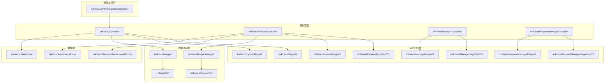
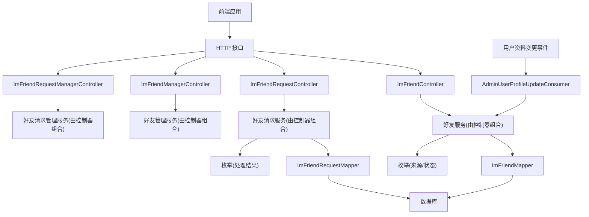
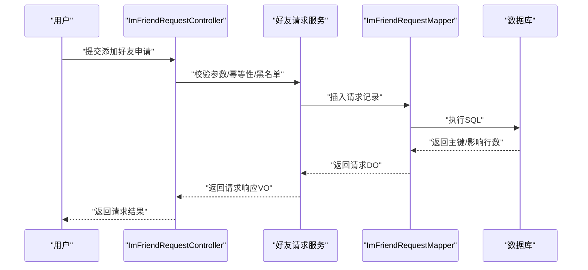
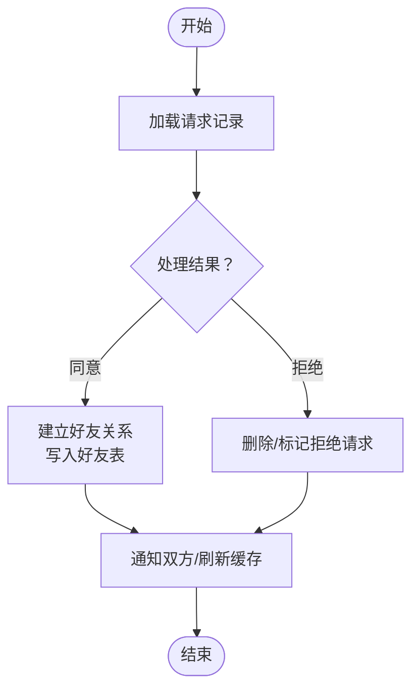
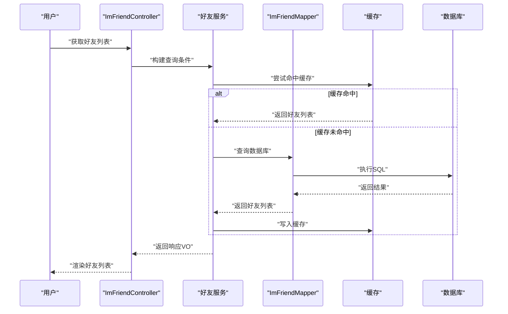
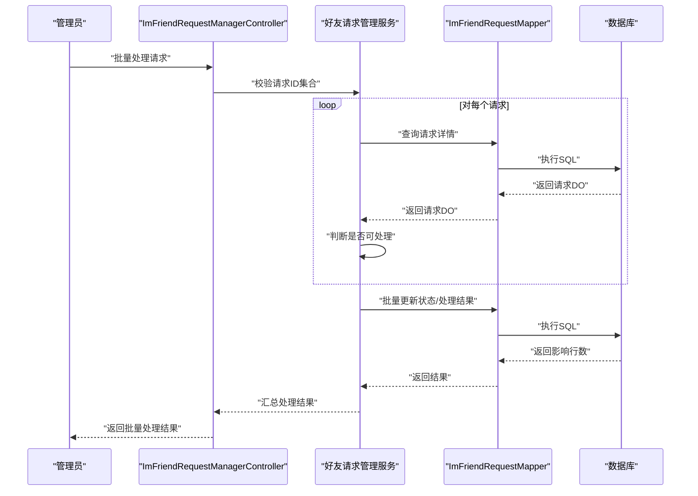
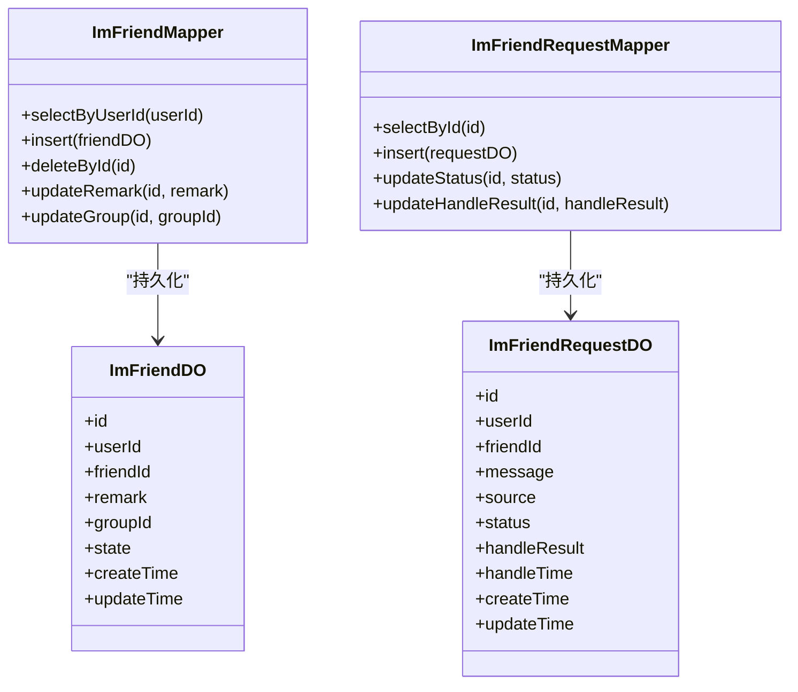
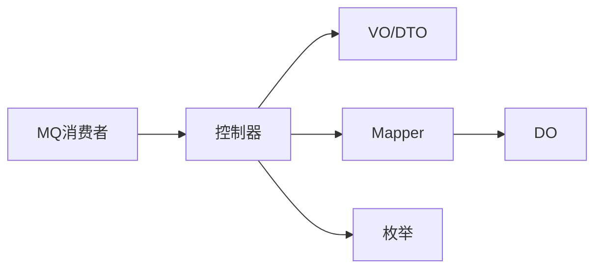

# 好友系统

<cite>
**本文引用的文件**
- [ImFriendController.java](file://yudao-module-im/src/main/java/cn/iocoder/yudao/module/im/controller/admin/friend/ImFriendController.java)
- [ImFriendRequestController.java](file://yudao-module-im/src/main/java/cn/iocoder/yudao/module/im/controller/admin/friend/ImFriendRequestController.java)
- [ImFriendManagerController.java](file://yudao-module-im/src/main/java/cn/iocoder/yudao/module/im/controller/admin/manager/friend/ImFriendManagerController.java)
- [ImFriendRequestManagerController.java](file://yudao-module-im/src/main/java/cn/iocoder/yudao/module/im/controller/admin/manager/friend/ImFriendRequestManagerController.java)
- [ImFriendDO.java](file://yudao-module-im/src/main/java/cn/iocoder/yudao/module/im/dal/dataobject/friend/ImFriendDO.java)
- [ImFriendRequestDO.java](file://yudao-module-im/src/main/java/cn/iocoder/yudao/module/im/dal/dataobject/friend/ImFriendRequestDO.java)
- [ImFriendMapper.java](file://yudao-module-im/src/main/java/cn/iocoder/yudao/module/im/dal/mysql/friend/ImFriendMapper.java)
- [ImFriendRequestMapper.java](file://yudao-module-im/src/main/java/cn/iocoder/yudao/module/im/dal/mysql/friend/ImFriendRequestMapper.java)
- [ImFriendAddSourceEnum.java](file://yudao-module-im/src/main/java/cn/iocoder/yudao/module/im/enums/friend/ImFriendAddSourceEnum.java)
- [ImFriendRequestHandleResultEnum.java](file://yudao-module-im/src/main/java/cn/iocoder/yudao/module/im/enums/friend/ImFriendRequestHandleResultEnum.java)
- [ImFriendStateEnum.java](file://yudao-module-im/src/main/java/cn/iocoder/yudao/module/im/enums/friend/ImFriendStateEnum.java)
- [AdminUserProfileUpdateConsumer.java](file://yudao-module-im/src/main/java/cn/iocoder/yudao/module/im/mq/consumer/friend/AdminUserProfileUpdateConsumer.java)
- [ImFriendRespVO.java](file://yudao-module-im/src/main/java/cn/iocoder/yudao/module/im/controller/admin/friend/vo/ImFriendRespVO.java)
- [ImFriendUpdateReqVO.java](file://yudao-module-im/src/main/java/cn/iocoder/yudao/module/im/controller/admin/friend/vo/ImFriendUpdateReqVO.java)
- [ImFriendRequestApplyReqVO.java](file://yudao-module-im/src/main/java/cn/iocoder/yudao/module/im/controller/admin/friend/vo/request/ImFriendRequestApplyReqVO.java)
- [ImFriendRequestRespVO.java](file://yudao-module-im/src/main/java/cn/iocoder/yudao/module/im/controller/admin/friend/vo/request/ImFriendRequestRespVO.java)
- [ImFriendManagerPageReqVO.java](file://yudao-module-im/src/main/java/cn/iocoder/yudao/module/im/controller/admin/manager/friend/vo/ImFriendManagerPageReqVO.java)
- [ImFriendManagerRespVO.java](file://yudao-module-im/src/main/java/cn/iocoder/yudao/module/im/controller/admin/manager/friend/vo/ImFriendManagerRespVO.java)
- [ImFriendRequestManagerPageReqVO.java](file://yudao-module-im/src/main/java/cn/iocoder/yudao/module/im/controller/admin/manager/friend/vo/ImFriendRequestManagerPageReqVO.java)
- [ImFriendRequestManagerRespVO.java](file://yudao-module-im/src/main/java/cn/iocoder/yudao/module/im/controller/admin/manager/friend/vo/ImFriendRequestManagerRespVO.java)
</cite>

## 目录
1. [简介](#简介)
2. [项目结构](#项目结构)
3. [核心组件](#核心组件)
4. [架构总览](#架构总览)
5. [详细组件分析](#详细组件分析)
6. [依赖分析](#依赖分析)
7. [性能考虑](#性能考虑)
8. [故障排查指南](#故障排查指南)
9. [结论](#结论)
10. [附录](#附录)

## 简介
本指南围绕即时通讯模块中的“好友系统”进行完整开发说明，覆盖好友添加的全流程：从好友请求的发送、接受与拒绝，到请求状态管理、好友列表与分组、在线状态与缓存策略，再到API接口定义与批量处理、关系验证机制等。文档以仓库中IM模块的实际代码为依据，提供可落地的实现建议与最佳实践。

## 项目结构
IM模块采用按功能域划分的分层结构，其中好友系统相关的核心文件集中在以下位置：
- 控制器层：提供管理员与用户侧的增删改查、请求处理等接口
- VO/DTO层：封装请求与响应参数
- 数据访问层：MyBatis Mapper与DO对象
- 枚举层：状态、来源、处理结果等枚举
- MQ消费者：用于用户资料变更后的状态同步

图表来源
- [ImFriendController.java:1-200](file://yudao-module-im/src/main/java/cn/iocoder/yudao/module/im/controller/admin/friend/ImFriendController.java#L1-L200)
- [ImFriendRequestController.java:1-200](file://yudao-module-im/src/main/java/cn/iocoder/yudao/module/im/controller/admin/friend/ImFriendRequestController.java#L1-L200)
- [ImFriendManagerController.java:1-200](file://yudao-module-im/src/main/java/cn/iocoder/yudao/module/im/controller/admin/manager/friend/ImFriendManagerController.java#L1-L200)
- [ImFriendRequestManagerController.java:1-200](file://yudao-module-im/src/main/java/cn/iocoder/yudao/module/im/controller/admin/manager/friend/ImFriendRequestManagerController.java#L1-L200)
- [ImFriendMapper.java:1-200](file://yudao-module-im/src/main/java/cn/iocoder/yudao/module/im/dal/mysql/friend/ImFriendMapper.java#L1-L200)
- [ImFriendRequestMapper.java:1-200](file://yudao-module-im/src/main/java/cn/iocoder/yudao/module/im/dal/mysql/friend/ImFriendRequestMapper.java#L1-L200)
- [ImFriendDO.java:1-200](file://yudao-module-im/src/main/java/cn/iocoder/yudao/module/im/dal/dataobject/friend/ImFriendDO.java#L1-L200)
- [ImFriendRequestDO.java:1-200](file://yudao-module-im/src/main/java/cn/iocoder/yudao/module/im/dal/dataobject/friend/ImFriendRequestDO.java#L1-L200)
- [ImFriendAddSourceEnum.java:1-200](file://yudao-module-im/src/main/java/cn/iocoder/yudao/module/im/enums/friend/ImFriendAddSourceEnum.java#L1-L200)
- [ImFriendRequestHandleResultEnum.java:1-200](file://yudao-module-im/src/main/java/cn/iocoder/yudao/module/im/enums/friend/ImFriendRequestHandleResultEnum.java#L1-L200)
- [ImFriendStateEnum.java:1-200](file://yudao-module-im/src/main/java/cn/iocoder/yudao/module/im/enums/friend/ImFriendStateEnum.java#L1-L200)
- [AdminUserProfileUpdateConsumer.java:1-200](file://yudao-module-im/src/main/java/cn/iocoder/yudao/module/im/mq/consumer/friend/AdminUserProfileUpdateConsumer.java#L1-L200)

章节来源
- [ImFriendController.java:1-200](file://yudao-module-im/src/main/java/cn/iocoder/yudao/module/im/controller/admin/friend/ImFriendController.java#L1-L200)
- [ImFriendRequestController.java:1-200](file://yudao-module-im/src/main/java/cn/iocoder/yudao/module/im/controller/admin/friend/ImFriendRequestController.java#L1-L200)
- [ImFriendMapper.java:1-200](file://yudao-module-im/src/main/java/cn/iocoder/yudao/module/im/dal/mysql/friend/ImFriendMapper.java#L1-L200)
- [ImFriendDO.java:1-200](file://yudao-module-im/src/main/java/cn/iocoder/yudao/module/im/dal/dataobject/friend/ImFriendDO.java#L1-L200)

## 核心组件
- 控制器组件
  - 好友管理控制器：负责好友的增删改查、备注设置、分组调整等
  - 好友请求控制器：负责好友请求的发送、查询、处理（同意/拒绝）
  - 管理端分页查询控制器：提供后台管理用的分页与筛选能力
- 数据模型与映射
  - 好友DO：存储好友关系记录
  - 好友请求DO：存储好友请求记录及状态
  - Mapper：提供数据库访问方法
- 枚举体系
  - 添加来源枚举：标识好友关系建立的来源（如搜索添加、群内添加等）
  - 请求处理结果枚举：标识请求处理的结果（通过/拒绝）
  - 好友状态枚举：标识好友关系状态（正常、拉黑、删除等）
- 消息与事件
  - 用户资料变更消费者：监听用户资料变化，触发相关状态同步或缓存刷新

章节来源
- [ImFriendController.java:1-200](file://yudao-module-im/src/main/java/cn/iocoder/yudao/module/im/controller/admin/friend/ImFriendController.java#L1-L200)
- [ImFriendRequestController.java:1-200](file://yudao-module-im/src/main/java/cn/iocoder/yudao/module/im/controller/admin/friend/ImFriendRequestController.java#L1-L200)
- [ImFriendDO.java:1-200](file://yudao-module-im/src/main/java/cn/iocoder/yudao/module/im/dal/dataobject/friend/ImFriendDO.java#L1-L200)
- [ImFriendRequestDO.java:1-200](file://yudao-module-im/src/main/java/cn/iocoder/yudao/module/im/dal/dataobject/friend/ImFriendRequestDO.java#L1-L200)
- [ImFriendMapper.java:1-200](file://yudao-module-im/src/main/java/cn/iocoder/yudao/module/im/dal/mysql/friend/ImFriendMapper.java#L1-L200)
- [ImFriendRequestMapper.java:1-200](file://yudao-module-im/src/main/java/cn/iocoder/yudao/module/im/dal/mysql/friend/ImFriendRequestMapper.java#L1-L200)
- [ImFriendAddSourceEnum.java:1-200](file://yudao-module-im/src/main/java/cn/iocoder/yudao/module/im/enums/friend/ImFriendAddSourceEnum.java#L1-L200)
- [ImFriendRequestHandleResultEnum.java:1-200](file://yudao-module-im/src/main/java/cn/iocoder/yudao/module/im/enums/friend/ImFriendRequestHandleResultEnum.java#L1-L200)
- [ImFriendStateEnum.java:1-200](file://yudao-module-im/src/main/java/cn/iocoder/yudao/module/im/enums/friend/ImFriendStateEnum.java#L1-L200)
- [AdminUserProfileUpdateConsumer.java:1-200](file://yudao-module-im/src/main/java/cn/iocoder/yudao/module/im/mq/consumer/friend/AdminUserProfileUpdateConsumer.java#L1-L200)

## 架构总览
好友系统遵循典型的分层架构：前端通过HTTP接口调用后端控制器，控制器协调服务层完成业务逻辑，随后通过Mapper持久化至数据库；同时通过MQ消费者对用户资料变更进行异步处理，保证状态一致性。

图表来源
- [ImFriendController.java:1-200](file://yudao-module-im/src/main/java/cn/iocoder/yudao/module/im/controller/admin/friend/ImFriendController.java#L1-L200)
- [ImFriendRequestController.java:1-200](file://yudao-module-im/src/main/java/cn/iocoder/yudao/module/im/controller/admin/friend/ImFriendRequestController.java#L1-L200)
- [ImFriendManagerController.java:1-200](file://yudao-module-im/src/main/java/cn/iocoder/yudao/module/im/controller/admin/manager/friend/ImFriendManagerController.java#L1-L200)
- [ImFriendRequestManagerController.java:1-200](file://yudao-module-im/src/main/java/cn/iocoder/yudao/module/im/controller/admin/manager/friend/ImFriendRequestManagerController.java#L1-L200)
- [ImFriendMapper.java:1-200](file://yudao-module-im/src/main/java/cn/iocoder/yudao/module/im/dal/mysql/friend/ImFriendMapper.java#L1-L200)
- [ImFriendRequestMapper.java:1-200](file://yudao-module-im/src/main/java/cn/iocoder/yudao/module/im/dal/mysql/friend/ImFriendRequestMapper.java#L1-L200)
- [ImFriendAddSourceEnum.java:1-200](file://yudao-module-im/src/main/java/cn/iocoder/yudao/module/im/enums/friend/ImFriendAddSourceEnum.java#L1-L200)
- [ImFriendRequestHandleResultEnum.java:1-200](file://yudao-module-im/src/main/java/cn/iocoder/yudao/module/im/enums/friend/ImFriendRequestHandleResultEnum.java#L1-L200)
- [ImFriendStateEnum.java:1-200](file://yudao-module-im/src/main/java/cn/iocoder/yudao/module/im/enums/friend/ImFriendStateEnum.java#L1-L200)
- [AdminUserProfileUpdateConsumer.java:1-200](file://yudao-module-im/src/main/java/cn/iocoder/yudao/module/im/mq/consumer/friend/AdminUserProfileUpdateConsumer.java#L1-L200)

## 详细组件分析

### 好友请求发送流程
- 触发点：用户在前端发起“添加好友”请求
- 控制器接收参数并校验
- 生成好友请求记录，写入数据库
- 返回请求结果给前端

图表来源
- [ImFriendRequestController.java:1-200](file://yudao-module-im/src/main/java/cn/iocoder/yudao/module/im/controller/admin/friend/ImFriendRequestController.java#L1-L200)
- [ImFriendRequestApplyReqVO.java:1-200](file://yudao-module-im/src/main/java/cn/iocoder/yudao/module/im/controller/admin/friend/vo/request/ImFriendRequestApplyReqVO.java#L1-L200)
- [ImFriendRequestRespVO.java:1-200](file://yudao-module-im/src/main/java/cn/iocoder/yudao/module/im/controller/admin/friend/vo/request/ImFriendRequestRespVO.java#L1-L200)
- [ImFriendRequestMapper.java:1-200](file://yudao-module-im/src/main/java/cn/iocoder/yudao/module/im/dal/mysql/friend/ImFriendRequestMapper.java#L1-L200)
- [ImFriendRequestDO.java:1-200](file://yudao-module-im/src/main/java/cn/iocoder/yudao/module/im/dal/dataobject/friend/ImFriendRequestDO.java#L1-L200)

章节来源
- [ImFriendRequestController.java:1-200](file://yudao-module-im/src/main/java/cn/iocoder/yudao/module/im/controller/admin/friend/ImFriendRequestController.java#L1-L200)
- [ImFriendRequestApplyReqVO.java:1-200](file://yudao-module-im/src/main/java/cn/iocoder/yudao/module/im/controller/admin/friend/vo/request/ImFriendRequestApplyReqVO.java#L1-L200)
- [ImFriendRequestRespVO.java:1-200](file://yudao-module-im/src/main/java/cn/iocoder/yudao/module/im/controller/admin/friend/vo/request/ImFriendRequestRespVO.java#L1-L200)
- [ImFriendRequestMapper.java:1-200](file://yudao-module-im/src/main/java/cn/iocoder/yudao/module/im/dal/mysql/friend/ImFriendRequestMapper.java#L1-L200)
- [ImFriendRequestDO.java:1-200](file://yudao-module-im/src/main/java/cn/iocoder/yudao/module/im/dal/dataobject/friend/ImFriendRequestDO.java#L1-L200)

### 好友请求处理（同意/拒绝）
- 管理员或目标用户收到请求后进行处理
- 更新请求状态与处理结果
- 同步建立好友关系或清理无效请求

图表来源
- [ImFriendRequestController.java:1-200](file://yudao-module-im/src/main/java/cn/iocoder/yudao/module/im/controller/admin/friend/ImFriendRequestController.java#L1-L200)
- [ImFriendRequestHandleResultEnum.java:1-200](file://yudao-module-im/src/main/java/cn/iocoder/yudao/module/im/enums/friend/ImFriendRequestHandleResultEnum.java#L1-L200)
- [ImFriendMapper.java:1-200](file://yudao-module-im/src/main/java/cn/iocoder/yudao/module/im/dal/mysql/friend/ImFriendMapper.java#L1-L200)
- [ImFriendRequestMapper.java:1-200](file://yudao-module-im/src/main/java/cn/iocoder/yudao/module/im/dal/mysql/friend/ImFriendRequestMapper.java#L1-L200)

章节来源
- [ImFriendRequestController.java:1-200](file://yudao-module-im/src/main/java/cn/iocoder/yudao/module/im/controller/admin/friend/ImFriendRequestController.java#L1-L200)
- [ImFriendRequestHandleResultEnum.java:1-200](file://yudao-module-im/src/main/java/cn/iocoder/yudao/module/im/enums/friend/ImFriendRequestHandleResultEnum.java#L1-L200)
- [ImFriendMapper.java:1-200](file://yudao-module-im/src/main/java/cn/iocoder/yudao/module/im/dal/mysql/friend/ImFriendMapper.java#L1-L200)
- [ImFriendRequestMapper.java:1-200](file://yudao-module-im/src/main/java/cn/iocoder/yudao/module/im/dal/mysql/friend/ImFriendRequestMapper.java#L1-L200)

### 好友列表管理与展示
- 列表分页与筛选：支持按昵称、分组、状态等条件查询
- 在线状态显示：结合用户在线状态与缓存策略
- 好友信息缓存：降低数据库压力，提升查询性能

图表来源
- [ImFriendController.java:1-200](file://yudao-module-im/src/main/java/cn/iocoder/yudao/module/im/controller/admin/friend/ImFriendController.java#L1-L200)
- [ImFriendRespVO.java:1-200](file://yudao-module-im/src/main/java/cn/iocoder/yudao/module/im/controller/admin/friend/vo/ImFriendRespVO.java#L1-L200)
- [ImFriendMapper.java:1-200](file://yudao-module-im/src/main/java/cn/iocoder/yudao/module/im/dal/mysql/friend/ImFriendMapper.java#L1-L200)
- [ImFriendDO.java:1-200](file://yudao-module-im/src/main/java/cn/iocoder/yudao/module/im/dal/dataobject/friend/ImFriendDO.java#L1-L200)

章节来源
- [ImFriendController.java:1-200](file://yudao-module-im/src/main/java/cn/iocoder/yudao/module/im/controller/admin/friend/ImFriendController.java#L1-L200)
- [ImFriendRespVO.java:1-200](file://yudao-module-im/src/main/java/cn/iocoder/yudao/module/im/controller/admin/friend/vo/ImFriendRespVO.java#L1-L200)
- [ImFriendMapper.java:1-200](file://yudao-module-im/src/main/java/cn/iocoder/yudao/module/im/dal/mysql/friend/ImFriendMapper.java#L1-L200)
- [ImFriendDO.java:1-200](file://yudao-module-im/src/main/java/cn/iocoder/yudao/module/im/dal/dataobject/friend/ImFriendDO.java#L1-L200)

### 管理端分页与批量处理
- 分页查询：支持好友与请求的分页浏览
- 批量处理：支持批量同意/拒绝好友请求
- 关系验证：在批量操作前进行关系有效性校验

图表来源
- [ImFriendRequestManagerController.java:1-200](file://yudao-module-im/src/main/java/cn/iocoder/yudao/module/im/controller/admin/manager/friend/ImFriendRequestManagerController.java#L1-L200)
- [ImFriendRequestManagerPageReqVO.java:1-200](file://yudao-module-im/src/main/java/cn/iocoder/yudao/module/im/controller/admin/manager/friend/vo/ImFriendRequestManagerPageReqVO.java#L1-L200)
- [ImFriendRequestManagerRespVO.java:1-200](file://yudao-module-im/src/main/java/cn/iocoder/yudao/module/im/controller/admin/manager/friend/vo/ImFriendRequestManagerRespVO.java#L1-L200)
- [ImFriendRequestMapper.java:1-200](file://yudao-module-im/src/main/java/cn/iocoder/yudao/module/im/dal/mysql/friend/ImFriendRequestMapper.java#L1-L200)

章节来源
- [ImFriendRequestManagerController.java:1-200](file://yudao-module-im/src/main/java/cn/iocoder/yudao/module/im/controller/admin/manager/friend/ImFriendRequestManagerController.java#L1-L200)
- [ImFriendRequestManagerPageReqVO.java:1-200](file://yudao-module-im/src/main/java/cn/iocoder/yudao/module/im/controller/admin/manager/friend/vo/ImFriendRequestManagerPageReqVO.java#L1-L200)
- [ImFriendRequestManagerRespVO.java:1-200](file://yudao-module-im/src/main/java/cn/iocoder/yudao/module/im/controller/admin/manager/friend/vo/ImFriendRequestManagerRespVO.java#L1-L200)
- [ImFriendRequestMapper.java:1-200](file://yudao-module-im/src/main/java/cn/iocoder/yudao/module/im/dal/mysql/friend/ImFriendRequestMapper.java#L1-L200)

### 类与数据模型关系

图表来源
- [ImFriendDO.java:1-200](file://yudao-module-im/src/main/java/cn/iocoder/yudao/module/im/dal/dataobject/friend/ImFriendDO.java#L1-L200)
- [ImFriendRequestDO.java:1-200](file://yudao-module-im/src/main/java/cn/iocoder/yudao/module/im/dal/dataobject/friend/ImFriendRequestDO.java#L1-L200)
- [ImFriendMapper.java:1-200](file://yudao-module-im/src/main/java/cn/iocoder/yudao/module/im/dal/mysql/friend/ImFriendMapper.java#L1-L200)
- [ImFriendRequestMapper.java:1-200](file://yudao-module-im/src/main/java/cn/iocoder/yudao/module/im/dal/mysql/friend/ImFriendRequestMapper.java#L1-L200)

章节来源
- [ImFriendDO.java:1-200](file://yudao-module-im/src/main/java/cn/iocoder/yudao/module/im/dal/dataobject/friend/ImFriendDO.java#L1-L200)
- [ImFriendRequestDO.java:1-200](file://yudao-module-im/src/main/java/cn/iocoder/yudao/module/im/dal/dataobject/friend/ImFriendRequestDO.java#L1-L200)
- [ImFriendMapper.java:1-200](file://yudao-module-im/src/main/java/cn/iocoder/yudao/module/im/dal/mysql/friend/ImFriendMapper.java#L1-L200)
- [ImFriendRequestMapper.java:1-200](file://yudao-module-im/src/main/java/cn/iocoder/yudao/module/im/dal/mysql/friend/ImFriendRequestMapper.java#L1-L200)

## 依赖分析
- 组件耦合
  - 控制器仅依赖Mapper与VO，职责清晰
  - Mapper依赖DO，保持数据模型稳定
  - 枚举作为契约，避免魔法值
- 外部依赖
  - MQ消费者依赖用户资料变更事件，确保状态一致性
- 循环依赖
  - 当前结构无循环依赖迹象

图表来源
- [ImFriendController.java:1-200](file://yudao-module-im/src/main/java/cn/iocoder/yudao/module/im/controller/admin/friend/ImFriendController.java#L1-L200)
- [ImFriendMapper.java:1-200](file://yudao-module-im/src/main/java/cn/iocoder/yudao/module/im/dal/mysql/friend/ImFriendMapper.java#L1-L200)
- [ImFriendDO.java:1-200](file://yudao-module-im/src/main/java/cn/iocoder/yudao/module/im/dal/dataobject/friend/ImFriendDO.java#L1-L200)
- [ImFriendAddSourceEnum.java:1-200](file://yudao-module-im/src/main/java/cn/iocoder/yudao/module/im/enums/friend/ImFriendAddSourceEnum.java#L1-L200)
- [ImFriendRequestHandleResultEnum.java:1-200](file://yudao-module-im/src/main/java/cn/iocoder/yudao/module/im/enums/friend/ImFriendRequestHandleResultEnum.java#L1-L200)
- [AdminUserProfileUpdateConsumer.java:1-200](file://yudao-module-im/src/main/java/cn/iocoder/yudao/module/im/mq/consumer/friend/AdminUserProfileUpdateConsumer.java#L1-L200)

章节来源
- [ImFriendController.java:1-200](file://yudao-module-im/src/main/java/cn/iocoder/yudao/module/im/controller/admin/friend/ImFriendController.java#L1-L200)
- [ImFriendMapper.java:1-200](file://yudao-module-im/src/main/java/cn/iocoder/yudao/module/im/dal/mysql/friend/ImFriendMapper.java#L1-L200)
- [ImFriendDO.java:1-200](file://yudao-module-im/src/main/java/cn/iocoder/yudao/module/im/dal/dataobject/friend/ImFriendDO.java#L1-L200)
- [ImFriendAddSourceEnum.java:1-200](file://yudao-module-im/src/main/java/cn/iocoder/yudao/module/im/enums/friend/ImFriendAddSourceEnum.java#L1-L200)
- [ImFriendRequestHandleResultEnum.java:1-200](file://yudao-module-im/src/main/java/cn/iocoder/yudao/module/im/enums/friend/ImFriendRequestHandleResultEnum.java#L1-L200)
- [AdminUserProfileUpdateConsumer.java:1-200](file://yudao-module-im/src/main/java/cn/iocoder/yudao/module/im/mq/consumer/friend/AdminUserProfileUpdateConsumer.java#L1-L200)

## 性能考虑
- 查询优化
  - 使用分页与索引：对常用查询字段建立索引，减少全表扫描
  - 缓存策略：对高频查询结果进行缓存，降低数据库压力
- 写入优化
  - 批量插入/更新：在批量处理场景下合并SQL执行
  - 幂等性设计：避免重复添加/处理导致的数据冗余
- 实时性
  - MQ事件驱动：用户资料变更后异步刷新缓存，保证最终一致

## 故障排查指南
- 常见问题
  - 重复添加：检查幂等键与唯一约束，避免重复请求
  - 状态不一致：确认MQ消费者是否正确消费事件并刷新缓存
  - 权限不足：核对管理员权限与请求处理范围
- 排查步骤
  - 查看请求日志与异常栈
  - 核对数据库状态与缓存命中情况
  - 验证枚举值与状态机转换是否符合预期

章节来源
- [AdminUserProfileUpdateConsumer.java:1-200](file://yudao-module-im/src/main/java/cn/iocoder/yudao/module/im/mq/consumer/friend/AdminUserProfileUpdateConsumer.java#L1-L200)

## 结论
本指南基于IM模块现有实现，系统梳理了好友系统的请求发送、处理、列表管理与缓存策略，并提供了面向生产的API设计与批量处理建议。通过明确的枚举契约、清晰的分层结构与事件驱动的缓存同步，可有效支撑高并发下的好友关系管理。

## 附录

### API 接口清单（概要）
- 添加好友
  - 方法：POST
  - 路径：/im/friend/request/apply
  - 请求体：ImFriendRequestApplyReqVO
  - 响应体：ImFriendRequestRespVO
- 删除好友
  - 方法：DELETE
  - 路径：/im/friend
  - 请求参数：好友ID
  - 响应体：布尔结果
- 设置备注
  - 方法：PUT
  - 路径：/im/friend/remark
  - 请求体：ImFriendUpdateReqVO
  - 响应体：布尔结果
- 修改分组
  - 方法：PUT
  - 路径：/im/friend/group
  - 请求体：ImFriendUpdateReqVO
  - 响应体：布尔结果
- 同意/拒绝好友请求
  - 方法：PUT
  - 路径：/im/friend/request/handle
  - 请求体：ImFriendRequestRespVO
  - 响应体：布尔结果
- 分页查询好友
  - 方法：GET
  - 路径：/im/friend/page
  - 查询参数：ImFriendManagerPageReqVO
  - 响应体：ImFriendManagerRespVO
- 分页查询好友请求
  - 方法：GET
  - 路径：/im/friend/request/page
  - 查询参数：ImFriendRequestManagerPageReqVO
  - 响应体：ImFriendRequestManagerRespVO

章节来源
- [ImFriendRequestController.java:1-200](file://yudao-module-im/src/main/java/cn/iocoder/yudao/module/im/controller/admin/friend/ImFriendRequestController.java#L1-L200)
- [ImFriendController.java:1-200](file://yudao-module-im/src/main/java/cn/iocoder/yudao/module/im/controller/admin/friend/ImFriendController.java#L1-L200)
- [ImFriendManagerController.java:1-200](file://yudao-module-im/src/main/java/cn/iocoder/yudao/module/im/controller/admin/manager/friend/ImFriendManagerController.java#L1-L200)
- [ImFriendRequestManagerController.java:1-200](file://yudao-module-im/src/main/java/cn/iocoder/yudao/module/im/controller/admin/manager/friend/ImFriendRequestManagerController.java#L1-L200)
- [ImFriendRequestApplyReqVO.java:1-200](file://yudao-module-im/src/main/java/cn/iocoder/yudao/module/im/controller/admin/friend/vo/request/ImFriendRequestApplyReqVO.java#L1-L200)
- [ImFriendRequestRespVO.java:1-200](file://yudao-module-im/src/main/java/cn/iocoder/yudao/module/im/controller/admin/friend/vo/request/ImFriendRequestRespVO.java#L1-L200)
- [ImFriendRespVO.java:1-200](file://yudao-module-im/src/main/java/cn/iocoder/yudao/module/im/controller/admin/friend/vo/ImFriendRespVO.java#L1-L200)
- [ImFriendUpdateReqVO.java:1-200](file://yudao-module-im/src/main/java/cn/iocoder/yudao/module/im/controller/admin/friend/vo/ImFriendUpdateReqVO.java#L1-L200)
- [ImFriendManagerPageReqVO.java:1-200](file://yudao-module-im/src/main/java/cn/iocoder/yudao/module/im/controller/admin/manager/friend/vo/ImFriendManagerPageReqVO.java#L1-L200)
- [ImFriendManagerRespVO.java:1-200](file://yudao-module-im/src/main/java/cn/iocoder/yudao/module/im/controller/admin/manager/friend/vo/ImFriendManagerRespVO.java#L1-L200)
- [ImFriendRequestManagerPageReqVO.java:1-200](file://yudao-module-im/src/main/java/cn/iocoder/yudao/module/im/controller/admin/manager/friend/vo/ImFriendRequestManagerPageReqVO.java#L1-L200)
- [ImFriendRequestManagerRespVO.java:1-200](file://yudao-module-im/src/main/java/cn/iocoder/yudao/module/im/controller/admin/manager/friend/vo/ImFriendRequestManagerRespVO.java#L1-L200)