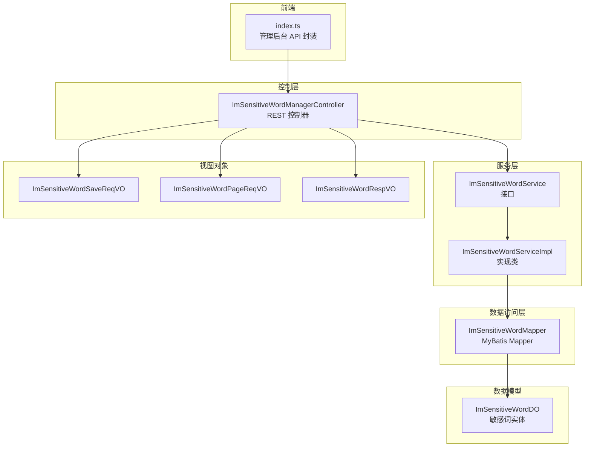
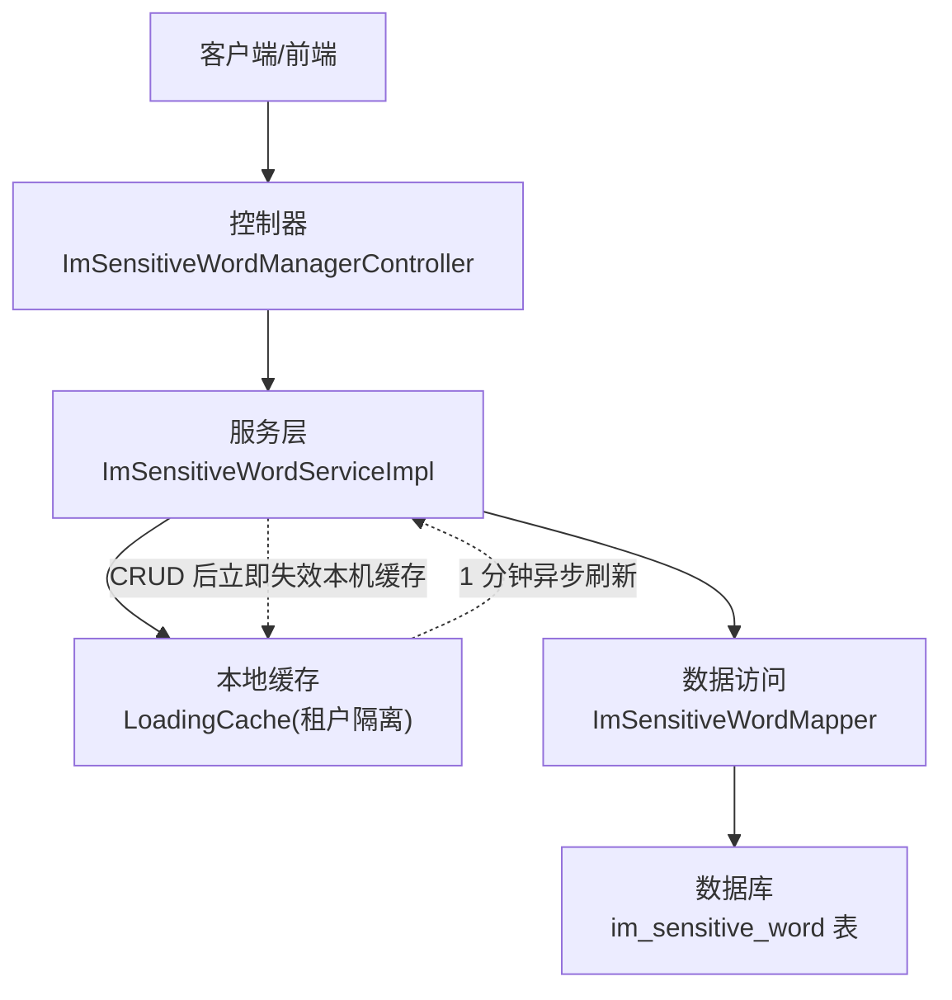
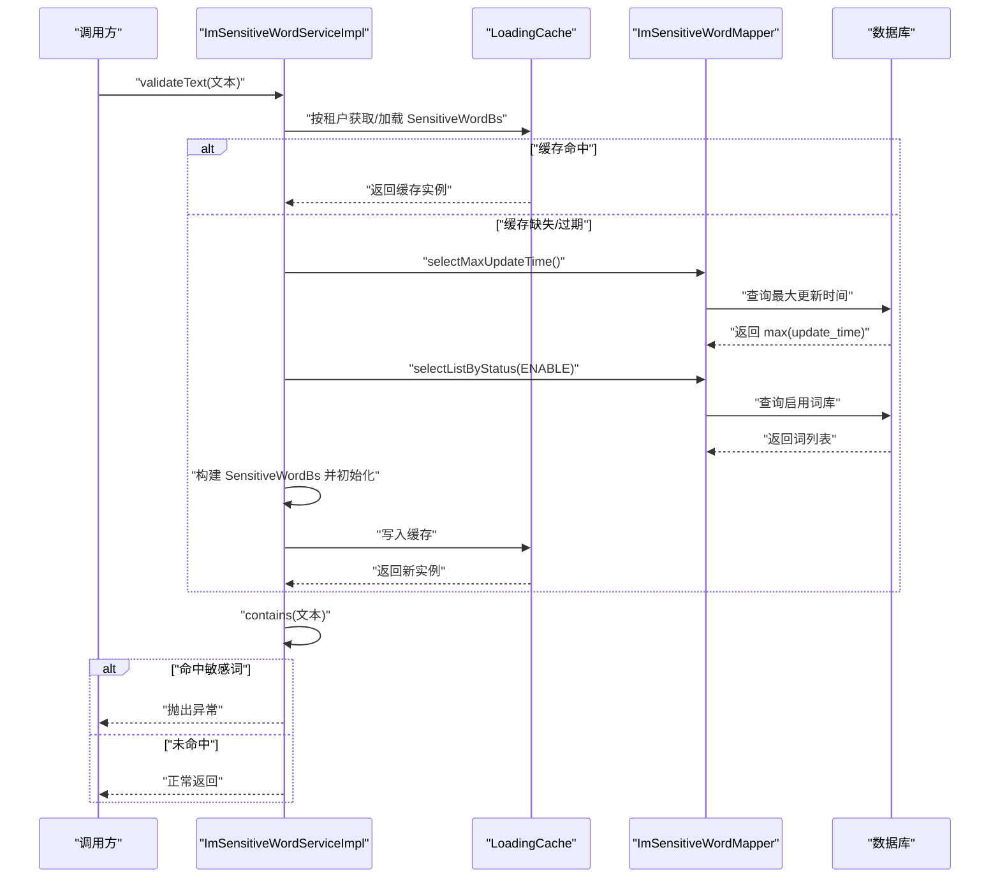
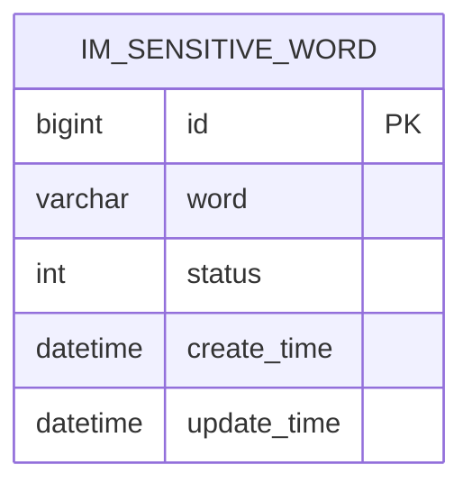
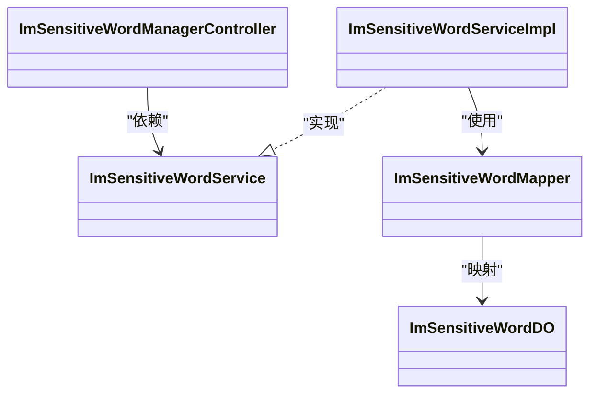

# 敏感词系统

<cite>
**本文引用的文件**
- [ImSensitiveWordService.java](file://yudao-module-im/src/main/java/cn/iocoder/yudao/module/im/service/sensitiveword/ImSensitiveWordService.java)
- [ImSensitiveWordServiceImpl.java](file://yudao-module-im/src/main/java/cn/iocoder/yudao/module/im/service/sensitiveword/ImSensitiveWordServiceImpl.java)
- [ImSensitiveWordManagerController.java](file://yudao-module-im/src/main/java/cn/iocoder/yudao/module/im/controller/admin/manager/sensitiveword/ImSensitiveWordManagerController.java)
- [ImSensitiveWordMapper.java](file://yudao-module-im/src/main/java/cn/iocoder/yudao/module/im/dal/mysql/sensitiveword/ImSensitiveWordMapper.java)
- [ImSensitiveWordDO.java](file://yudao-module-im/src/main/java/cn/iocoder/yudao/module/im/dal/dataobject/sensitiveword/ImSensitiveWordDO.java)
- [ImSensitiveWordSaveReqVO.java](file://yudao-module-im/src/main/java/cn/iocoder/yudao/module/im/controller/admin/manager/sensitiveword/vo/ImSensitiveWordSaveReqVO.java)
- [ImSensitiveWordPageReqVO.java](file://yudao-module-im/src/main/java/cn/iocoder/yudao/module/im/controller/admin/manager/sensitiveword/vo/ImSensitiveWordPageReqVO.java)
- [ImSensitiveWordRespVO.java](file://yudao-module-im/src/main/java/cn/iocoder/yudao/module/im/controller/admin/manager/sensitiveword/vo/ImSensitiveWordRespVO.java)
- [index.ts](file://yudao-ui/yudao-ui-admin-vue3/src/api/im/manager/sensitiveword/index.ts)
</cite>

## 目录
1. [简介](#简介)
2. [项目结构](#项目结构)
3. [核心组件](#核心组件)
4. [架构总览](#架构总览)
5. [详细组件分析](#详细组件分析)
6. [依赖关系分析](#依赖关系分析)
7. [性能考量](#性能考量)
8. [故障排查指南](#故障排查指南)
9. [结论](#结论)
10. [附录](#附录)

## 简介
本文件面向即时通讯模块的“敏感词系统”，系统性梳理敏感词的管理与维护机制、过滤实现原理、替换与拦截策略、管理 API 的完整接口定义、消息内容实时检测与标记、动态更新处理流程，以及统计与分析能力。系统基于 Trie 树 + 多语言/宽窄字符/大小写/繁简体等规范化处理，结合本地缓存与定时刷新，确保高并发下的低延迟与一致性。

## 项目结构
围绕敏感词系统的关键文件组织如下：
- 控制层：管理后台控制器，负责接收请求、鉴权与响应封装
- 服务层：敏感词服务接口与实现，负责业务逻辑、缓存与过滤
- 数据访问层：Mapper 接口，负责词库的分页、查询与最大更新时间
- 数据对象：敏感词实体类，映射数据库表字段
- 视图对象：新增/修改、分页、响应 VO，用于前后端交互
- 前端 API：管理后台敏感词管理页面的 HTTP 请求封装

图表来源
- [ImSensitiveWordManagerController.java:32-106](file://yudao-module-im/src/main/java/cn/iocoder/yudao/module/im/controller/admin/manager/sensitiveword/ImSensitiveWordManagerController.java#L32-L106)
- [ImSensitiveWordService.java:11-57](file://yudao-module-im/src/main/java/cn/iocoder/yudao/module/im/service/sensitiveword/ImSensitiveWordService.java#L11-L57)
- [ImSensitiveWordServiceImpl.java:46-229](file://yudao-module-im/src/main/java/cn/iocoder/yudao/module/im/service/sensitiveword/ImSensitiveWordServiceImpl.java#L46-L229)
- [ImSensitiveWordMapper.java:15-44](file://yudao-module-im/src/main/java/cn/iocoder/yudao/module/im/dal/mysql/sensitiveword/ImSensitiveWordMapper.java#L15-L44)
- [ImSensitiveWordDO.java:10-41](file://yudao-module-im/src/main/java/cn/iocoder/yudao/module/im/dal/dataobject/sensitiveword/ImSensitiveWordDO.java#L10-L41)
- [ImSensitiveWordSaveReqVO.java:11-28](file://yudao-module-im/src/main/java/cn/iocoder/yudao/module/im/controller/admin/manager/sensitiveword/vo/ImSensitiveWordSaveReqVO.java#L11-L28)
- [ImSensitiveWordPageReqVO.java:15-31](file://yudao-module-im/src/main/java/cn/iocoder/yudao/module/im/controller/admin/manager/sensitiveword/vo/ImSensitiveWordPageReqVO.java#L15-L31)
- [ImSensitiveWordRespVO.java:8-29](file://yudao-module-im/src/main/java/cn/iocoder/yudao/module/im/controller/admin/manager/sensitiveword/vo/ImSensitiveWordRespVO.java#L8-L29)
- [index.ts:1-43](file://yudao-ui/yudao-ui-admin-vue3/src/api/im/manager/sensitiveword/index.ts#L1-L43)

章节来源
- [ImSensitiveWordManagerController.java:32-106](file://yudao-module-im/src/main/java/cn/iocoder/yudao/module/im/controller/admin/manager/sensitiveword/ImSensitiveWordManagerController.java#L32-L106)
- [ImSensitiveWordService.java:11-57](file://yudao-module-im/src/main/java/cn/iocoder/yudao/module/im/service/sensitiveword/ImSensitiveWordService.java#L11-L57)
- [ImSensitiveWordServiceImpl.java:46-229](file://yudao-module-im/src/main/java/cn/iocoder/yudao/module/im/service/sensitiveword/ImSensitiveWordServiceImpl.java#L46-L229)
- [ImSensitiveWordMapper.java:15-44](file://yudao-module-im/src/main/java/cn/iocoder/yudao/module/im/dal/mysql/sensitiveword/ImSensitiveWordMapper.java#L15-L44)
- [ImSensitiveWordDO.java:10-41](file://yudao-module-im/src/main/java/cn/iocoder/yudao/module/im/dal/dataobject/sensitiveword/ImSensitiveWordDO.java#L10-L41)
- [ImSensitiveWordSaveReqVO.java:11-28](file://yudao-module-im/src/main/java/cn/iocoder/yudao/module/im/controller/admin/manager/sensitiveword/vo/ImSensitiveWordSaveReqVO.java#L11-L28)
- [ImSensitiveWordPageReqVO.java:15-31](file://yudao-module-im/src/main/java/cn/iocoder/yudao/module/im/controller/admin/manager/sensitiveword/vo/ImSensitiveWordPageReqVO.java#L15-L31)
- [ImSensitiveWordRespVO.java:8-29](file://yudao-module-im/src/main/java/cn/iocoder/yudao/module/im/controller/admin/manager/sensitiveword/vo/ImSensitiveWordRespVO.java#L8-L29)
- [index.ts:1-43](file://yudao-ui/yudao-ui-admin-vue3/src/api/im/manager/sensitiveword/index.ts#L1-L43)

## 核心组件
- 敏感词服务接口与实现
  - 提供文本校验、分页查询、详情获取、新增、修改、删除、批量删除等能力
  - 过滤采用 houbb 敏感词库（Trie 树 + 多语言/宽窄字符/大小写/繁简体/数字风格规范化）
  - 本地缓存 + 异步定时刷新，支持租户隔离
- 控制器
  - 提供 REST 接口，完成权限校验与参数封装
- Mapper 与实体
  - 支持按状态筛选、分页查询、最大更新时间查询
- 视图对象
  - 统一前后端交互的数据结构
- 前端 API
  - 管理后台页面调用的 HTTP 方法封装

章节来源
- [ImSensitiveWordService.java:11-57](file://yudao-module-im/src/main/java/cn/iocoder/yudao/module/im/service/sensitiveword/ImSensitiveWordService.java#L11-L57)
- [ImSensitiveWordServiceImpl.java:46-229](file://yudao-module-im/src/main/java/cn/iocoder/yudao/module/im/service/sensitiveword/ImSensitiveWordServiceImpl.java#L46-L229)
- [ImSensitiveWordManagerController.java:32-106](file://yudao-module-im/src/main/java/cn/iocoder/yudao/module/im/controller/admin/manager/sensitiveword/ImSensitiveWordManagerController.java#L32-L106)
- [ImSensitiveWordMapper.java:15-44](file://yudao-module-im/src/main/java/cn/iocoder/yudao/module/im/dal/mysql/sensitiveword/ImSensitiveWordMapper.java#L15-L44)
- [ImSensitiveWordDO.java:10-41](file://yudao-module-im/src/main/java/cn/iocoder/yudao/module/im/dal/dataobject/sensitiveword/ImSensitiveWordDO.java#L10-L41)
- [ImSensitiveWordSaveReqVO.java:11-28](file://yudao-module-im/src/main/java/cn/iocoder/yudao/module/im/controller/admin/manager/sensitiveword/vo/ImSensitiveWordSaveReqVO.java#L11-L28)
- [ImSensitiveWordPageReqVO.java:15-31](file://yudao-module-im/src/main/java/cn/iocoder/yudao/module/im/controller/admin/manager/sensitiveword/vo/ImSensitiveWordPageReqVO.java#L15-L31)
- [ImSensitiveWordRespVO.java:8-29](file://yudao-module-im/src/main/java/cn/iocoder/yudao/module/im/controller/admin/manager/sensitiveword/vo/ImSensitiveWordRespVO.java#L8-L29)
- [index.ts:1-43](file://yudao-ui/yudao-ui-admin-vue3/src/api/im/manager/sensitiveword/index.ts#L1-L43)

## 架构总览
系统采用“控制器-服务-数据访问-实体”的分层架构，结合本地缓存与定时刷新，实现高可用与高性能的敏感词过滤。

图表来源
- [ImSensitiveWordManagerController.java:32-106](file://yudao-module-im/src/main/java/cn/iocoder/yudao/module/im/controller/admin/manager/sensitiveword/ImSensitiveWordManagerController.java#L32-L106)
- [ImSensitiveWordServiceImpl.java:78-120](file://yudao-module-im/src/main/java/cn/iocoder/yudao/module/im/service/sensitiveword/ImSensitiveWordServiceImpl.java#L78-L120)
- [ImSensitiveWordMapper.java:15-44](file://yudao-module-im/src/main/java/cn/iocoder/yudao/module/im/dal/mysql/sensitiveword/ImSensitiveWordMapper.java#L15-L44)

## 详细组件分析

### 过滤实现与缓存策略
- 过滤引擎
  - 使用 houbb 敏感词库构建 SensitiveWordBs，启用忽略大小写、宽窄字符、数字风格、繁简体、单词检查等特性
  - 词库来源于数据库中状态为启用的敏感词集合
- 缓存与刷新
  - 以租户为维度的 LoadingCache，每分钟异步刷新
  - 刷新前先查询最大更新时间，未变化则复用旧实例，避免不必要的 Trie 重建
  - CRUD 操作后强制失效本机缓存，多实例通过定时刷新在最长时间内收敛
- 文本校验
  - 校验入口：validateText，若命中敏感词抛出异常

图表来源
- [ImSensitiveWordServiceImpl.java:78-145](file://yudao-module-im/src/main/java/cn/iocoder/yudao/module/im/service/sensitiveword/ImSensitiveWordServiceImpl.java#L78-L145)
- [ImSensitiveWordMapper.java:23-42](file://yudao-module-im/src/main/java/cn/iocoder/yudao/module/im/dal/mysql/sensitiveword/ImSensitiveWordMapper.java#L23-L42)

章节来源
- [ImSensitiveWordServiceImpl.java:46-145](file://yudao-module-im/src/main/java/cn/iocoder/yudao/module/im/service/sensitiveword/ImSensitiveWordServiceImpl.java#L46-L145)
- [ImSensitiveWordMapper.java:23-42](file://yudao-module-im/src/main/java/cn/iocoder/yudao/module/im/dal/mysql/sensitiveword/ImSensitiveWordMapper.java#L23-L42)

### 敏感词管理 API（管理后台）
- 新增敏感词
  - 方法：POST
  - 路径：/im/manager/sensitive-word/create
  - 权限：im:manager:sensitive-word:create
  - 请求体：ImSensitiveWordSaveReqVO（word、status）
  - 响应：Long（新增 id）
- 修改敏感词
  - 方法：PUT
  - 路径：/im/manager/sensitive-word/update
  - 权限：im:manager:sensitive-word:update
  - 请求体：ImSensitiveWordSaveReqVO（含 id）
  - 响应：Boolean（true）
- 删除敏感词
  - 方法：DELETE
  - 路径：/im/manager/sensitive-word/delete
  - 权限：im:manager:sensitive-word:delete
  - 查询参数：id
  - 响应：Boolean（true）
- 批量删除敏感词
  - 方法：DELETE
  - 路径：/im/manager/sensitive-word/delete-list
  - 权限：im:manager:sensitive-word:delete
  - 查询参数：ids（最多 100 个）
  - 响应：Boolean（true）
- 获取敏感词分页
  - 方法：GET
  - 路径：/im/manager/sensitive-word/page
  - 权限：im:manager:sensitive-word:query
  - 查询参数：word、status、createTime[]
  - 响应：PageResult<ImSensitiveWordRespVO>
- 获取敏感词详情
  - 方法：GET
  - 路径：/im/manager/sensitive-word/get
  - 权限：im:manager:sensitive-word:query
  - 查询参数：id
  - 响应：ImSensitiveWordRespVO

章节来源
- [ImSensitiveWordManagerController.java:43-104](file://yudao-module-im/src/main/java/cn/iocoder/yudao/module/im/controller/admin/manager/sensitiveword/ImSensitiveWordManagerController.java#L43-L104)
- [ImSensitiveWordSaveReqVO.java:11-28](file://yudao-module-im/src/main/java/cn/iocoder/yudao/module/im/controller/admin/manager/sensitiveword/vo/ImSensitiveWordSaveReqVO.java#L11-L28)
- [ImSensitiveWordPageReqVO.java:15-31](file://yudao-module-im/src/main/java/cn/iocoder/yudao/module/im/controller/admin/manager/sensitiveword/vo/ImSensitiveWordPageReqVO.java#L15-L31)
- [ImSensitiveWordRespVO.java:8-29](file://yudao-module-im/src/main/java/cn/iocoder/yudao/module/im/controller/admin/manager/sensitiveword/vo/ImSensitiveWordRespVO.java#L8-L29)
- [index.ts:12-43](file://yudao-ui/yudao-ui-admin-vue3/src/api/im/manager/sensitiveword/index.ts#L12-L43)

### 数据模型与持久化
- 实体类 ImSensitiveWordDO
  - 字段：id、word、status
  - 状态枚举：CommonStatusEnum（启用/禁用）
- Mapper 接口
  - 按状态查询启用词库
  - 按词精确查询
  - 分页查询（支持 word 模糊、status 精确、createTime 时间区间）
  - 查询最大更新时间（用于缓存刷新判断）

图表来源
- [ImSensitiveWordDO.java:10-41](file://yudao-module-im/src/main/java/cn/iocoder/yudao/module/im/dal/dataobject/sensitiveword/ImSensitiveWordDO.java#L10-L41)
- [ImSensitiveWordMapper.java:23-42](file://yudao-module-im/src/main/java/cn/iocoder/yudao/module/im/dal/mysql/sensitiveword/ImSensitiveWordMapper.java#L23-L42)

章节来源
- [ImSensitiveWordDO.java:10-41](file://yudao-module-im/src/main/java/cn/iocoder/yudao/module/im/dal/dataobject/sensitiveword/ImSensitiveWordDO.java#L10-L41)
- [ImSensitiveWordMapper.java:15-44](file://yudao-module-im/src/main/java/cn/iocoder/yudao/module/im/dal/mysql/sensitiveword/ImSensitiveWordMapper.java#L15-L44)

### 敏感词替换与拦截策略
- 替换策略
  - 当前实现为直接拦截并抛出异常，不进行星号替换或关键词标注
- 拦截策略
  - validateText 在消息发送/保存前调用，命中即阻断
  - 建议在消息处理链路（如消息入库、推送前）统一调用该方法
- 扩展建议
  - 若需替换：可在调用方将命中敏感词替换为星号或占位符
  - 若需标注：可返回命中词列表，前端高亮显示

章节来源
- [ImSensitiveWordServiceImpl.java:136-145](file://yudao-module-im/src/main/java/cn/iocoder/yudao/module/im/service/sensitiveword/ImSensitiveWordServiceImpl.java#L136-L145)

### 动态更新与缓存失效
- CRUD 后立即失效本机缓存
  - 新增、修改、删除均会触发失效，保证本机缓存尽快与数据库一致
- 多实例收敛
  - 其他实例通过每分钟异步刷新，最长 1 分钟内收敛
- 租户隔离
  - 缓存键按租户 ID 分离，跨租户互不影响

章节来源
- [ImSensitiveWordServiceImpl.java:127-134](file://yudao-module-im/src/main/java/cn/iocoder/yudao/module/im/service/sensitiveword/ImSensitiveWordServiceImpl.java#L127-L134)
- [ImSensitiveWordServiceImpl.java:160-207](file://yudao-module-im/src/main/java/cn/iocoder/yudao/module/im/service/sensitiveword/ImSensitiveWordServiceImpl.java#L160-L207)

### 统计与分析能力
- 现状
  - 未提供敏感词使用频率与违规统计分析接口
- 建议扩展
  - 引入消息审计表，记录消息内容、命中词、命中时间、用户、群组等
  - 提供敏感词命中统计报表接口（按时间、群组、用户、词频等维度）
  - 提供违规趋势分析与热点词排行

章节来源
- [ImSensitiveWordServiceImpl.java:104-120](file://yudao-module-im/src/main/java/cn/iocoder/yudao/module/im/service/sensitiveword/ImSensitiveWordServiceImpl.java#L104-L120)

## 依赖关系分析
- 组件耦合
  - 控制器依赖服务接口，便于单元测试与替换实现
  - 服务实现依赖 Mapper 与 houbb 敏感词库，职责清晰
- 外部依赖
  - houbb 敏感词库：提供高性能的敏感词检测能力
  - Guava Cache：提供本地缓存与异步刷新
  - MyBatis：提供数据访问能力
- 可能的循环依赖
  - 未发现循环依赖，分层清晰

图表来源
- [ImSensitiveWordManagerController.java:32-106](file://yudao-module-im/src/main/java/cn/iocoder/yudao/module/im/controller/admin/manager/sensitiveword/ImSensitiveWordManagerController.java#L32-L106)
- [ImSensitiveWordService.java:11-57](file://yudao-module-im/src/main/java/cn/iocoder/yudao/module/im/service/sensitiveword/ImSensitiveWordService.java#L11-L57)
- [ImSensitiveWordServiceImpl.java:46-229](file://yudao-module-im/src/main/java/cn/iocoder/yudao/module/im/service/sensitiveword/ImSensitiveWordServiceImpl.java#L46-L229)
- [ImSensitiveWordMapper.java:15-44](file://yudao-module-im/src/main/java/cn/iocoder/yudao/module/im/dal/mysql/sensitiveword/ImSensitiveWordMapper.java#L15-L44)
- [ImSensitiveWordDO.java:10-41](file://yudao-module-im/src/main/java/cn/iocoder/yudao/module/im/dal/dataobject/sensitiveword/ImSensitiveWordDO.java#L10-L41)

## 性能考量
- 缓存命中率
  - 词库按租户缓存，命中后直接使用 SensitiveWordBs，避免重复构建
- 刷新策略
  - 每分钟异步刷新，先比较最大更新时间，未变化则复用旧实例
- 并发与一致性
  - CRUD 后立即失效本机缓存，多实例通过定时刷新收敛
- 过滤复杂度
  - 基于 Trie 树的敏感词检测，时间复杂度近似 O(n)，其中 n 为文本长度
- 建议优化
  - 对高频词库可考虑预热缓存
  - 对超长文本可限制检测范围或分段检测

[本节为通用性能讨论，无需列出具体文件来源]

## 故障排查指南
- 常见问题
  - 新增/修改/删除后，过滤仍未生效：确认是否处于多实例环境，等待最长 1 分钟的定时刷新收敛
  - 租户间词库互相影响：确认缓存键是否按租户隔离
  - 文本未命中但预期命中：检查词库状态是否为启用，以及是否启用了大小写/宽窄字符/繁简体等忽略选项
- 关键定位点
  - validateText 是否被调用
  - 缓存是否被正确失效
  - 最大更新时间查询是否返回最新值

章节来源
- [ImSensitiveWordServiceImpl.java:127-145](file://yudao-module-im/src/main/java/cn/iocoder/yudao/module/im/service/sensitiveword/ImSensitiveWordServiceImpl.java#L127-L145)
- [ImSensitiveWordMapper.java:41-42](file://yudao-module-im/src/main/java/cn/iocoder/yudao/module/im/dal/mysql/sensitiveword/ImSensitiveWordMapper.java#L41-L42)

## 结论
本敏感词系统以 Trie 树为核心，结合本地缓存与定时刷新，实现了高并发下的低延迟与强一致性的敏感词过滤。管理后台提供了完善的增删改查与分页能力，且具备良好的扩展性。建议后续补充敏感词统计分析与替换/标注能力，以满足更丰富的合规需求。

[本节为总结性内容，无需列出具体文件来源]

## 附录

### API 定义一览（管理后台）
- 新增敏感词
  - 方法：POST
  - 路径：/im/manager/sensitive-word/create
  - 请求体：ImSensitiveWordSaveReqVO
  - 权限：im:manager:sensitive-word:create
- 修改敏感词
  - 方法：PUT
  - 路径：/im/manager/sensitive-word/update
  - 请求体：ImSensitiveWordSaveReqVO
  - 权限：im:manager:sensitive-word:update
- 删除敏感词
  - 方法：DELETE
  - 路径：/im/manager/sensitive-word/delete
  - 查询参数：id
  - 权限：im:manager:sensitive-word:delete
- 批量删除敏感词
  - 方法：DELETE
  - 路径：/im/manager/sensitive-word/delete-list
  - 查询参数：ids（最多 100 个）
  - 权限：im:manager:sensitive-word:delete
- 获取敏感词分页
  - 方法：GET
  - 路径：/im/manager/sensitive-word/page
  - 查询参数：word、status、createTime[]
  - 权限：im:manager:sensitive-word:query
- 获取敏感词详情
  - 方法：GET
  - 路径：/im/manager/sensitive-word/get
  - 查询参数：id
  - 权限：im:manager:sensitive-word:query

章节来源
- [ImSensitiveWordManagerController.java:43-104](file://yudao-module-im/src/main/java/cn/iocoder/yudao/module/im/controller/admin/manager/sensitiveword/ImSensitiveWordManagerController.java#L43-L104)
- [ImSensitiveWordSaveReqVO.java:11-28](file://yudao-module-im/src/main/java/cn/iocoder/yudao/module/im/controller/admin/manager/sensitiveword/vo/ImSensitiveWordSaveReqVO.java#L11-L28)
- [ImSensitiveWordPageReqVO.java:15-31](file://yudao-module-im/src/main/java/cn/iocoder/yudao/module/im/controller/admin/manager/sensitiveword/vo/ImSensitiveWordPageReqVO.java#L15-L31)
- [ImSensitiveWordRespVO.java:8-29](file://yudao-module-im/src/main/java/cn/iocoder/yudao/module/im/controller/admin/manager/sensitiveword/vo/ImSensitiveWordRespVO.java#L8-L29)
- [index.ts:12-43](file://yudao-ui/yudao-ui-admin-vue3/src/api/im/manager/sensitiveword/index.ts#L12-L43)