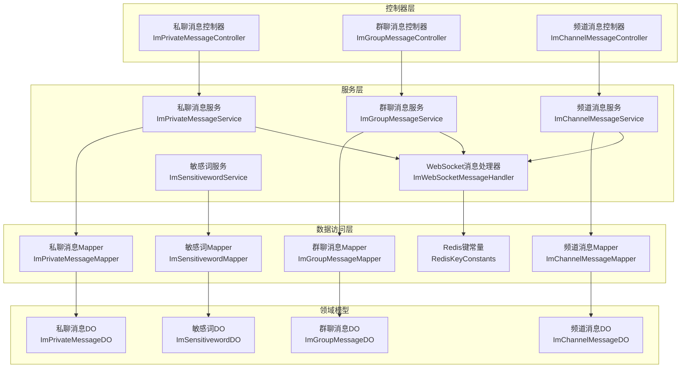
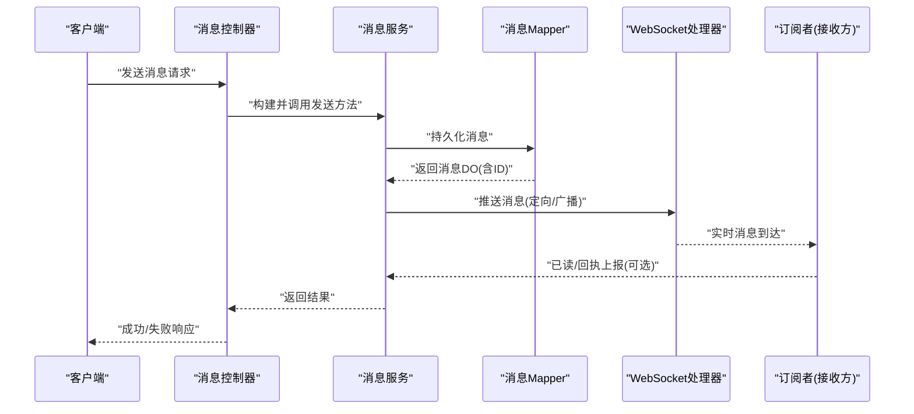
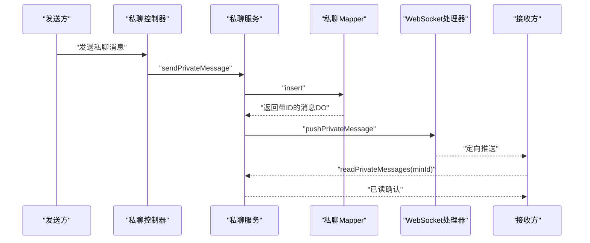
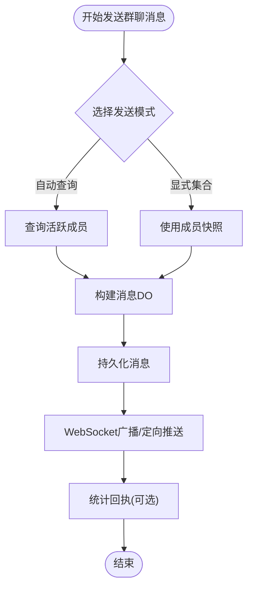
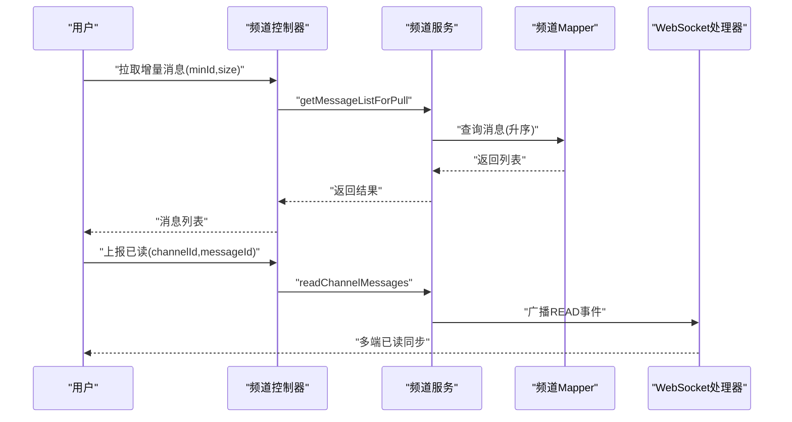
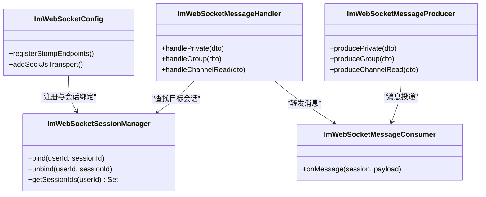
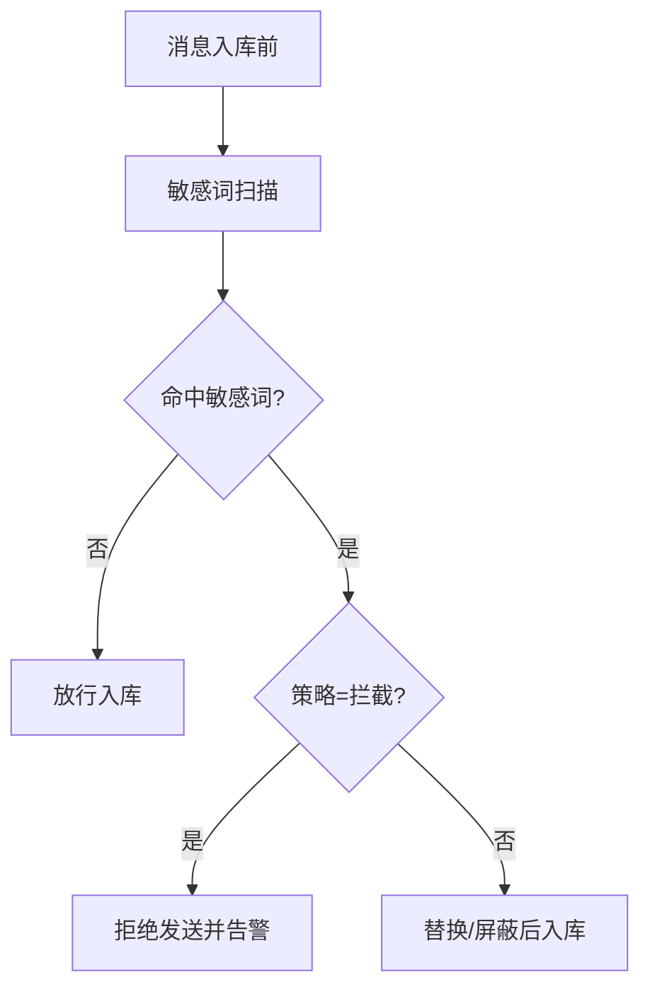
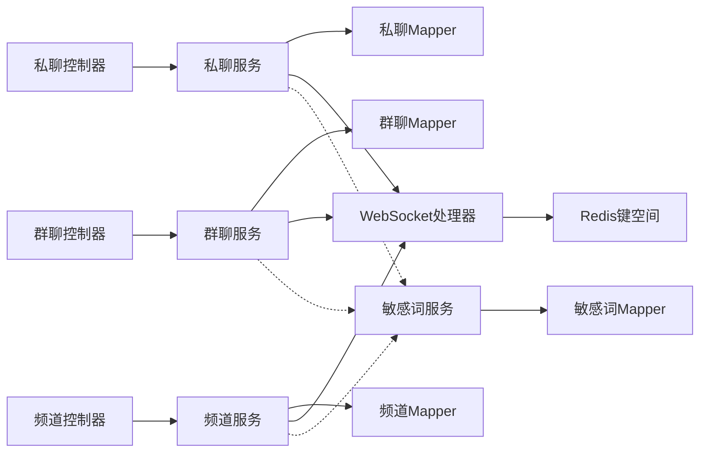

# 消息系统

<cite>
**本文引用的文件**
- [ImPrivateMessageService.java](file://yudao-module-im/src/main/java/cn/iocoder/yudao/module/im/service/message/ImPrivateMessageService.java)
- [ImGroupMessageService.java](file://yudao-module-im/src/main/java/cn/iocoder/yudao/module/im/service/message/ImGroupMessageService.java)
- [ImChannelMessageService.java](file://yudao-module-im/src/main/java/cn/iocoder/yudao/module/im/service/message/ImChannelMessageService.java)
- [ImPrivateMessageDTO.java](file://yudao-module-im/src/main/java/cn/iocoder/yudao/module/im/service/websocket/dto/ImPrivateMessageDTO.java)
- [ImMessageTypeEnum.java](file://yudao-module-im/src/main/java/cn/iocoder/yudao/module/im/enums/message/ImMessageTypeEnum.java)
- [ImMessageStatusEnum.java](file://yudao-module-im/src/main/java/cn/iocoder/yudao/module/im/enums/message/ImMessageStatusEnum.java)
- [ImGroupMessageReceiptStatusEnum.java](file://yudao-module-im/src/main/java/cn/iocoder/yudao/module/im/enums/message/ImGroupMessageReceiptStatusEnum.java)
- [ImGroupMessageController.java](file://yudao-module-im/src/main/java/cn/iocoder/yudao/module/im/controller/admin/message/ImGroupMessageController.java)
- [ImChannelMessageController.java](file://yudao-module-im/src/main/java/cn/iocoder/yudao/module/im/controller/admin/message/ImChannelMessageController.java)
- [ImPrivateMessageController.java](file://yudao-module-im/src/main/java/cn/iocoder/yudao/module/im/controller/admin/message/ImPrivateMessageController.java)
- [ImGroupMessageDO.java](file://yudao-module-im/src/main/java/cn/iocoder/yudao/module/im/dal/dataobject/message/ImGroupMessageDO.java)
- [ImChannelMessageDO.java](file://yudao-module-im/src/main/java/cn/iocoder/yudao/module/im/dal/dataobject/message/ImChannelMessageDO.java)
- [ImPrivateMessageDO.java](file://yudao-module-im/src/main/java/cn/iocoder/yudao/module/im/dal/dataobject/message/ImPrivateMessageDO.java)
- [ImGroupMessageMapper.java](file://yudao-module-im/src/main/java/cn/iocoder/yudao/module/im/dal/mysql/message/ImGroupMessageMapper.java)
- [ImChannelMessageMapper.java](file://yudao-module-im/src/main/java/cn/iocoder/yudao/module/im/dal/mysql/message/ImChannelMessageMapper.java)
- [ImPrivateMessageMapper.java](file://yudao-module-im/src/main/java/cn/iocoder/yudao/module/im/dal/mysql/message/ImPrivateMessageMapper.java)
- [RedisKeyConstants.java](file://yudao-module-im/src/main/java/cn/iocoder/yudao/module/im/dal/redis/RedisKeyConstants.java)
- [ImSensitivewordService.java](file://yudao-module-im/src/main/java/cn/iocoder/yudao/module/im/service/sensitiveword/ImSensitivewordService.java)
- [ImSensitivewordMapper.java](file://yudao-module-im/src/main/java/cn/iocoder/yudao/module/im/dal/mysql/sensitiveword/ImSensitivewordMapper.java)
- [ImSensitivewordDO.java](file://yudao-module-im/src/main/java/cn/iocoder/yudao/module/im/dal/dataobject/sensitiveword/ImSensitivewordDO.java)
- [ImWebSocketMessageHandler.java](file://yudao-module-im/src/main/java/cn/iocoder/yudao/module/im/service/websocket/ImWebSocketMessageHandler.java)
- [ImWebSocketConfig.java](file://yudao-module-im/src/main/java/cn/iocoder/yudao/module/im/framework/websocket/config/ImWebSocketConfig.java)
- [ImWebSocketSessionManager.java](file://yudao-module-im/src/main/java/cn/iocoder/yudao/module/im/service/websocket/ImWebSocketSessionManager.java)
- [ImWebSocketMessageProducer.java](file://yudao-module-im/src/main/java/cn/iocoder/yudao/module/im/service/websocket/ImWebSocketMessageProducer.java)
- [ImWebSocketMessageConsumer.java](file://yudao-module-im/src/main/java/cn/iocoder/yudao/module/im/service/websocket/ImWebSocketMessageConsumer.java)
- [ImMessageUtils.java](file://yudao-module-im/src/main/java/cn/iocoder/yudao/module/im/util/ImMessageUtils.java)
- [ImProperties.java](file://yudao-module-im/src/main/java/cn/iocoder/yudao/module/im/framework/config/ImProperties.java)
- [ImFriendController.java](file://yudao-module-im/src/main/java/cn/iocoder/yudao/module/im/controller/admin/friend/ImFriendController.java)
- [ImGroupController.java](file://yudao-module-im/src/main/java/cn/iocoder/yudao/module/im/controller/admin/group/ImGroupController.java)
- [ImChannelController.java](file://yudao-module-im/src/main/java/cn/iocoder/yudao/module/im/controller/admin/channel/ImChannelController.java)
</cite>

## 目录
1. [引言](#引言)
2. [项目结构](#项目结构)
3. [核心组件](#核心组件)
4. [架构总览](#架构总览)
5. [详细组件分析](#详细组件分析)
6. [依赖关系分析](#依赖关系分析)
7. [性能考虑](#性能考虑)
8. [故障排查指南](#故障排查指南)
9. [结论](#结论)
10. [附录](#附录)

## 引言
本文件面向即时通讯模块的消息系统，围绕私聊消息、群聊消息与频道消息的完整实现进行深入解析，涵盖消息存储设计、消息类型与状态管理、消息回执机制、WebSocket 实时推送、消息历史查询与分页、消息发送 API 文档、敏感词过滤与内容安全检查等主题。文档以代码级分析为基础，辅以多种图示帮助读者理解系统架构与关键流程。

## 项目结构
IM 模块采用按功能域划分的层次化组织方式，核心目录如下：
- controller：对外暴露 REST API，按业务域细分（好友、群组、消息、频道等）
- service：业务服务层，包含消息发送、历史查询、回执管理、敏感词过滤、WebSocket 推送等
- dal：数据访问层，包含 DO、Mapper、Redis 常量
- enums：枚举定义（消息类型、状态、回执等）
- framework：配置与 Web 框架集成（WebSocket、定时任务等）
- util：工具类（消息工具、常量等）

图表来源
- [ImPrivateMessageController.java](file://yudao-module-im/src/main/java/cn/iocoder/yudao/module/im/controller/admin/message/ImPrivateMessageController.java)
- [ImGroupMessageController.java](file://yudao-module-im/src/main/java/cn/iocoder/yudao/module/im/controller/admin/message/ImGroupMessageController.java)
- [ImChannelMessageController.java](file://yudao-module-im/src/main/java/cn/iocoder/yudao/module/im/controller/admin/message/ImChannelMessageController.java)
- [ImPrivateMessageService.java](file://yudao-module-im/src/main/java/cn/iocoder/yudao/module/im/service/message/ImPrivateMessageService.java)
- [ImGroupMessageService.java](file://yudao-module-im/src/main/java/cn/iocoder/yudao/module/im/service/message/ImGroupMessageService.java)
- [ImChannelMessageService.java](file://yudao-module-im/src/main/java/cn/iocoder/yudao/module/im/service/message/ImChannelMessageService.java)
- [ImWebSocketMessageHandler.java](file://yudao-module-im/src/main/java/cn/iocoder/yudao/module/im/service/websocket/ImWebSocketMessageHandler.java)
- [ImPrivateMessageMapper.java](file://yudao-module-im/src/main/java/cn/iocoder/yudao/module/im/dal/mysql/message/ImPrivateMessageMapper.java)
- [ImGroupMessageMapper.java](file://yudao-module-im/src/main/java/cn/iocoder/yudao/module/im/dal/mysql/message/ImGroupMessageMapper.java)
- [ImChannelMessageMapper.java](file://yudao-module-im/src/main/java/cn/iocoder/yudao/module/im/dal/mysql/message/ImChannelMessageMapper.java)
- [ImSensitivewordService.java](file://yudao-module-im/src/main/java/cn/iocoder/yudao/module/im/service/sensitiveword/ImSensitivewordService.java)
- [ImSensitivewordMapper.java](file://yudao-module-im/src/main/java/cn/iocoder/yudao/module/im/dal/mysql/sensitiveword/ImSensitivewordMapper.java)
- [RedisKeyConstants.java](file://yudao-module-im/src/main/java/cn/iocoder/yudao/module/im/dal/redis/RedisKeyConstants.java)

章节来源
- [ImPrivateMessageService.java:1-120](file://yudao-module-im/src/main/java/cn/iocoder/yudao/module/im/service/message/ImPrivateMessageService.java#L1-L120)
- [ImGroupMessageService.java:1-120](file://yudao-module-im/src/main/java/cn/iocoder/yudao/module/im/service/message/ImGroupMessageService.java#L1-L120)
- [ImChannelMessageService.java:1-80](file://yudao-module-im/src/main/java/cn/iocoder/yudao/module/im/service/message/ImChannelMessageService.java#L1-L80)

## 核心组件
- 消息类型与状态
  - 消息类型：通过枚举统一管理，覆盖私聊、群聊、频道及各类系统通知
  - 消息状态：记录消息生命周期状态（如草稿、已发送、已删除等）
  - 群聊回执状态：记录成员对消息的已读/未读回执
- 消息服务
  - 私聊消息：发送、撤回、增量拉取、已读标记
  - 群聊消息：发送（含成员快照优化）、撤回、回执统计
  - 频道消息：离线增量拉取、已读上报
- WebSocket 推送
  - 连接管理、消息路由、断线重连、多端同步
- 敏感词过滤
  - 内容安全检查与拦截策略

章节来源
- [ImMessageTypeEnum.java](file://yudao-module-im/src/main/java/cn/iocoder/yudao/module/im/enums/message/ImMessageTypeEnum.java)
- [ImMessageStatusEnum.java](file://yudao-module-im/src/main/java/cn/iocoder/yudao/module/im/enums/message/ImMessageStatusEnum.java)
- [ImGroupMessageReceiptStatusEnum.java](file://yudao-module-im/src/main/java/cn/iocoder/yudao/module/im/enums/message/ImGroupMessageReceiptStatusEnum.java)
- [ImPrivateMessageService.java:31-69](file://yudao-module-im/src/main/java/cn/iocoder/yudao/module/im/service/message/ImPrivateMessageService.java#L31-L69)
- [ImGroupMessageService.java:33-61](file://yudao-module-im/src/main/java/cn/iocoder/yudao/module/im/service/message/ImGroupMessageService.java#L33-L61)
- [ImChannelMessageService.java:22-39](file://yudao-module-im/src/main/java/cn/iocoder/yudao/module/im/service/message/ImChannelMessageService.java#L22-L39)

## 架构总览
消息系统由“控制器—服务—数据访问—传输层”四层构成，结合 Redis 缓存与 WebSocket 实现实时推送。消息发送后先持久化，再通过 WebSocket 广播或定向推送至接收方。

图表来源
- [ImPrivateMessageController.java](file://yudao-module-im/src/main/java/cn/iocoder/yudao/module/im/controller/admin/message/ImPrivateMessageController.java)
- [ImGroupMessageController.java](file://yudao-module-im/src/main/java/cn/iocoder/yudao/module/im/controller/admin/message/ImGroupMessageController.java)
- [ImChannelMessageController.java](file://yudao-module-im/src/main/java/cn/iocoder/yudao/module/im/controller/admin/message/ImChannelMessageController.java)
- [ImPrivateMessageService.java](file://yudao-module-im/src/main/java/cn/iocoder/yudao/module/im/service/message/ImPrivateMessageService.java)
- [ImGroupMessageService.java](file://yudao-module-im/src/main/java/cn/iocoder/yudao/module/im/service/message/ImGroupMessageService.java)
- [ImChannelMessageService.java](file://yudao-module-im/src/main/java/cn/iocoder/yudao/module/im/service/message/ImChannelMessageService.java)
- [ImWebSocketMessageHandler.java](file://yudao-module-im/src/main/java/cn/iocoder/yudao/module/im/service/websocket/ImWebSocketMessageHandler.java)

## 详细组件分析

### 私聊消息
- 发送流程
  - 控制器接收请求，构造发送 DTO
  - 服务层执行发送逻辑，持久化消息
  - WebSocket 处理器定向推送至接收方
- 增量拉取与已读
  - 支持基于游标 minId 的增量拉取
  - 提供已读标记接口，原子性更新未读到已读
- 撤回机制
  - 仅消息发送方可撤回，满足业务合规要求

图表来源
- [ImPrivateMessageController.java](file://yudao-module-im/src/main/java/cn/iocoder/yudao/module/im/controller/admin/message/ImPrivateMessageController.java)
- [ImPrivateMessageService.java:31-69](file://yudao-module-im/src/main/java/cn/iocoder/yudao/module/im/service/message/ImPrivateMessageService.java#L31-L69)
- [ImPrivateMessageMapper.java](file://yudao-module-im/src/main/java/cn/iocoder/yudao/module/im/dal/mysql/message/ImPrivateMessageMapper.java)
- [ImWebSocketMessageHandler.java](file://yudao-module-im/src/main/java/cn/iocoder/yudao/module/im/service/websocket/ImWebSocketMessageHandler.java)

章节来源
- [ImPrivateMessageService.java:31-69](file://yudao-module-im/src/main/java/cn/iocoder/yudao/module/im/service/message/ImPrivateMessageService.java#L31-L69)
- [ImPrivateMessageDO.java](file://yudao-module-im/src/main/java/cn/iocoder/yudao/module/im/dal/dataobject/message/ImPrivateMessageDO.java)
- [ImPrivateMessageMapper.java](file://yudao-module-im/src/main/java/cn/iocoder/yudao/module/im/dal/mysql/message/ImPrivateMessageMapper.java)

### 群聊消息
- 发送策略
  - 支持两种发送模式：自动查询在线成员、显式传入成员集合（优化批量场景）
  - 统一走群消息表，支持广播与定向推送
- 回执与统计
  - 记录成员回执状态，便于统计未读人数
- 撤回与权限
  - 仅发送方可撤回，管理员可能具备特殊权限

图表来源
- [ImGroupMessageService.java:33-61](file://yudao-module-im/src/main/java/cn/iocoder/yudao/module/im/service/message/ImGroupMessageService.java#L33-L61)
- [ImGroupMessageDO.java](file://yudao-module-im/src/main/java/cn/iocoder/yudao/module/im/dal/dataobject/message/ImGroupMessageDO.java)
- [ImGroupMessageMapper.java](file://yudao-module-im/src/main/java/cn/iocoder/yudao/module/im/dal/mysql/message/ImGroupMessageMapper.java)
- [ImGroupMessageReceiptStatusEnum.java](file://yudao-module-im/src/main/java/cn/iocoder/yudao/module/im/enums/message/ImGroupMessageReceiptStatusEnum.java)

章节来源
- [ImGroupMessageService.java:33-61](file://yudao-module-im/src/main/java/cn/iocoder/yudao/module/im/service/message/ImGroupMessageService.java#L33-L61)
- [ImGroupMessageController.java:1-120](file://yudao-module-im/src/main/java/cn/iocoder/yudao/module/im/controller/admin/message/ImGroupMessageController.java#L1-L120)

### 频道消息
- 离线增量拉取
  - 基于 minId 的增量拉取，按 ID 升序返回
- 已读上报
  - 上报已读位置，同步向自身多端广播 READ 事件
- 存储与查询
  - 频道消息独立表，支持分页与排序

图表来源
- [ImChannelMessageService.java:22-39](file://yudao-module-im/src/main/java/cn/iocoder/yudao/module/im/service/message/ImChannelMessageService.java#L22-L39)
- [ImChannelMessageDO.java](file://yudao-module-im/src/main/java/cn/iocoder/yudao/module/im/dal/dataobject/message/ImChannelMessageDO.java)
- [ImChannelMessageMapper.java](file://yudao-module-im/src/main/java/cn/iocoder/yudao/module/im/dal/mysql/message/ImChannelMessageMapper.java)
- [ImWebSocketMessageHandler.java](file://yudao-module-im/src/main/java/cn/iocoder/yudao/module/im/service/websocket/ImWebSocketMessageHandler.java)

章节来源
- [ImChannelMessageService.java:22-39](file://yudao-module-im/src/main/java/cn/iocoder/yudao/module/im/service/message/ImChannelMessageService.java#L22-L39)
- [ImChannelMessageController.java:1-120](file://yudao-module-im/src/main/java/cn/iocoder/yudao/module/im/controller/admin/message/ImChannelMessageController.java#L1-L120)

### WebSocket 消息推送
- 连接管理
  - 基于配置的 WebSocket 路径与握手策略
  - Session 管理器维护用户与连接映射
- 消息路由
  - 私聊定向推送、群聊广播/定向、频道 READ 事件
- 断线重连与持久化
  - 增量拉取与最小游标维护，保障离线消息补齐
  - Redis 键空间用于会话与游标管理

图表来源
- [ImWebSocketConfig.java](file://yudao-module-im/src/main/java/cn/iocoder/yudao/module/im/framework/websocket/config/ImWebSocketConfig.java)
- [ImWebSocketSessionManager.java](file://yudao-module-im/src/main/java/cn/iocoder/yudao/module/im/service/websocket/ImWebSocketSessionManager.java)
- [ImWebSocketMessageHandler.java](file://yudao-module-im/src/main/java/cn/iocoder/yudao/module/im/service/websocket/ImWebSocketMessageHandler.java)
- [ImWebSocketMessageProducer.java](file://yudao-module-im/src/main/java/cn/iocoder/yudao/module/im/service/websocket/ImWebSocketMessageProducer.java)
- [ImWebSocketMessageConsumer.java](file://yudao-module-im/src/main/java/cn/iocoder/yudao/module/im/service/websocket/ImWebSocketMessageConsumer.java)
- [RedisKeyConstants.java](file://yudao-module-im/src/main/java/cn/iocoder/yudao/module/im/dal/redis/RedisKeyConstants.java)

章节来源
- [ImWebSocketMessageHandler.java](file://yudao-module-im/src/main/java/cn/iocoder/yudao/module/im/service/websocket/ImWebSocketMessageHandler.java)
- [ImWebSocketSessionManager.java](file://yudao-module-im/src/main/java/cn/iocoder/yudao/module/im/service/websocket/ImWebSocketSessionManager.java)
- [RedisKeyConstants.java](file://yudao-module-im/src/main/java/cn/iocoder/yudao/module/im/dal/redis/RedisKeyConstants.java)

### 敏感词过滤与内容安全
- 敏感词存储与匹配
  - 敏感词表存储关键词，服务层提供匹配与替换能力
- 发送前检查
  - 在消息入库前进行敏感词扫描，必要时阻断或告警
- 配置与扩展
  - 可配置敏感词等级与处理策略（屏蔽、替换、拦截）

图表来源
- [ImSensitivewordService.java](file://yudao-module-im/src/main/java/cn/iocoder/yudao/module/im/service/sensitiveword/ImSensitivewordService.java)
- [ImSensitivewordMapper.java](file://yudao-module-im/src/main/java/cn/iocoder/yudao/module/im/dal/mysql/sensitiveword/ImSensitivewordMapper.java)
- [ImSensitivewordDO.java](file://yudao-module-im/src/main/java/cn/iocoder/yudao/module/im/dal/dataobject/sensitiveword/ImSensitivewordDO.java)

章节来源
- [ImSensitivewordService.java](file://yudao-module-im/src/main/java/cn/iocoder/yudao/module/im/service/sensitiveword/ImSensitivewordService.java)
- [ImSensitivewordMapper.java](file://yudao-module-im/src/main/java/cn/iocoder/yudao/module/im/dal/mysql/sensitiveword/ImSensitivewordMapper.java)

## 依赖关系分析
- 控制器依赖对应服务接口，服务依赖 Mapper 与 WebSocket 处理器
- WebSocket 依赖 Session 管理与 Redis 键空间
- 敏感词服务独立于消息主链路，提供前置校验

图表来源
- [ImPrivateMessageController.java](file://yudao-module-im/src/main/java/cn/iocoder/yudao/module/im/controller/admin/message/ImPrivateMessageController.java)
- [ImGroupMessageController.java](file://yudao-module-im/src/main/java/cn/iocoder/yudao/module/im/controller/admin/message/ImGroupMessageController.java)
- [ImChannelMessageController.java](file://yudao-module-im/src/main/java/cn/iocoder/yudao/module/im/controller/admin/message/ImChannelMessageController.java)
- [ImPrivateMessageService.java](file://yudao-module-im/src/main/java/cn/iocoder/yudao/module/im/service/message/ImPrivateMessageService.java)
- [ImGroupMessageService.java](file://yudao-module-im/src/main/java/cn/iocoder/yudao/module/im/service/message/ImGroupMessageService.java)
- [ImChannelMessageService.java](file://yudao-module-im/src/main/java/cn/iocoder/yudao/module/im/service/message/ImChannelMessageService.java)
- [ImWebSocketMessageHandler.java](file://yudao-module-im/src/main/java/cn/iocoder/yudao/module/im/service/websocket/ImWebSocketMessageHandler.java)
- [RedisKeyConstants.java](file://yudao-module-im/src/main/java/cn/iocoder/yudao/module/im/dal/redis/RedisKeyConstants.java)
- [ImSensitivewordService.java](file://yudao-module-im/src/main/java/cn/iocoder/yudao/module/im/service/sensitiveword/ImSensitivewordService.java)

章节来源
- [ImPrivateMessageService.java:1-120](file://yudao-module-im/src/main/java/cn/iocoder/yudao/module/im/service/message/ImPrivateMessageService.java#L1-L120)
- [ImGroupMessageService.java:1-120](file://yudao-module-im/src/main/java/cn/iocoder/yudao/module/im/service/message/ImGroupMessageService.java#L1-L120)
- [ImChannelMessageService.java:1-80](file://yudao-module-im/src/main/java/cn/iocoder/yudao/module/im/service/message/ImChannelMessageService.java#L1-L80)

## 性能考虑
- 批量发送优化
  - 群聊发送支持显式成员集合，避免重复查询活跃成员
- 增量拉取
  - 私聊与频道均支持基于游标 minId 的增量拉取，降低网络与数据库压力
- Redis 缓存
  - 使用 Redis 键空间存储会话与游标，提升高并发下的读写效率
- 分页与排序
  - 查询接口按 ID 升序返回，利于分页与时间线展示

## 故障排查指南
- WebSocket 推送失败
  - 检查会话是否绑定、目标用户是否存在有效会话
  - 查看消息生产与消费链路日志
- 消息未送达
  - 确认消息已持久化且 DTO 字段正确
  - 核对消息类型与路由规则
- 敏感词误判
  - 调整敏感词库或策略配置，重新扫描并入库
- 回执异常
  - 核对回执状态枚举与更新逻辑，确保幂等性

章节来源
- [ImWebSocketSessionManager.java](file://yudao-module-im/src/main/java/cn/iocoder/yudao/module/im/service/websocket/ImWebSocketSessionManager.java)
- [ImWebSocketMessageHandler.java](file://yudao-module-im/src/main/java/cn/iocoder/yudao/module/im/service/websocket/ImWebSocketMessageHandler.java)
- [ImSensitivewordService.java](file://yudao-module-im/src/main/java/cn/iocoder/yudao/module/im/service/sensitiveword/ImSensitivewordService.java)

## 结论
本消息系统以清晰的分层设计与完善的枚举体系为基础，结合 Redis 与 WebSocket 实现了高效、可靠的实时消息能力。通过增量拉取、回执与敏感词过滤等机制，兼顾了性能与安全性。建议在生产环境中持续完善监控与告警，确保消息链路的稳定性与可观测性。

## 附录

### 消息发送 API 文档（示例）
- 私聊消息发送
  - 请求参数：senderId、receiverId、content、type、sendTime
  - 响应格式：消息ID与状态
  - 错误处理：鉴权失败、内容违规、目标用户不存在
- 群聊消息发送
  - 请求参数：senderId、groupId、content、type、targetUserIds(可选)
  - 响应格式：消息ID与回执统计
  - 错误处理：权限不足、成员不在、目标集合无效
- 频道消息发送
  - 请求参数：senderId、channelId、content、type
  - 响应格式：消息ID与状态
  - 错误处理：频道不可见、权限不足

章节来源
- [ImPrivateMessageController.java](file://yudao-module-im/src/main/java/cn/iocoder/yudao/module/im/controller/admin/message/ImPrivateMessageController.java)
- [ImGroupMessageController.java](file://yudao-module-im/src/main/java/cn/iocoder/yudao/module/im/controller/admin/message/ImGroupMessageController.java)
- [ImChannelMessageController.java](file://yudao-module-im/src/main/java/cn/iocoder/yudao/module/im/controller/admin/message/ImChannelMessageController.java)

### 消息类型与状态枚举
- 消息类型：覆盖私聊、群聊、频道与系统通知
- 消息状态：草稿、已发送、已删除
- 群聊回执状态：未读、已读

章节来源
- [ImMessageTypeEnum.java](file://yudao-module-im/src/main/java/cn/iocoder/yudao/module/im/enums/message/ImMessageTypeEnum.java)
- [ImMessageStatusEnum.java](file://yudao-module-im/src/main/java/cn/iocoder/yudao/module/im/enums/message/ImMessageStatusEnum.java)
- [ImGroupMessageReceiptStatusEnum.java](file://yudao-module-im/src/main/java/cn/iocoder/yudao/module/im/enums/message/ImGroupMessageReceiptStatusEnum.java)

### 消息历史与分页
- 私聊历史：基于 minId 增量拉取，支持指定大小
- 频道历史：基于 minId 增量拉取，按 ID 升序
- 群聊历史：支持分页查询与时间线展示

章节来源
- [ImPrivateMessageService.java:57-57](file://yudao-module-im/src/main/java/cn/iocoder/yudao/module/im/service/message/ImPrivateMessageService.java#L57-L57)
- [ImChannelMessageService.java:30-30](file://yudao-module-im/src/main/java/cn/iocoder/yudao/module/im/service/message/ImChannelMessageService.java#L30-L30)

### WebSocket 消息推送要点
- 私聊：定向推送至 receiverId
- 群聊：广播至 groupId 或定向至 targetUserIds
- 频道：广播 READ 事件至 channel 内所有订阅者

章节来源
- [ImWebSocketMessageHandler.java](file://yudao-module-im/src/main/java/cn/iocoder/yudao/module/im/service/websocket/ImWebSocketMessageHandler.java)
- [ImPrivateMessageDTO.java:126-149](file://yudao-module-im/src/main/java/cn/iocoder/yudao/module/im/service/websocket/dto/ImPrivateMessageDTO.java#L126-L149)