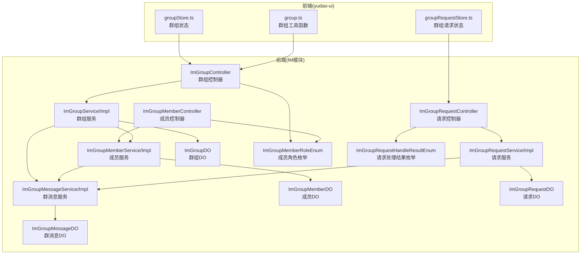
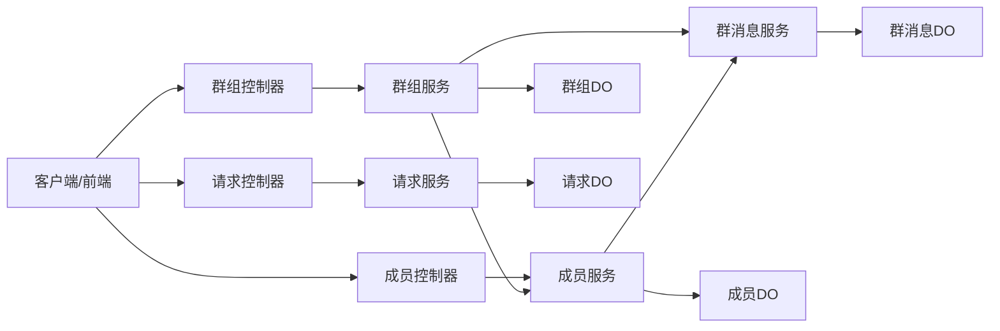
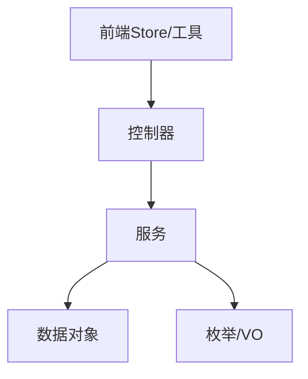
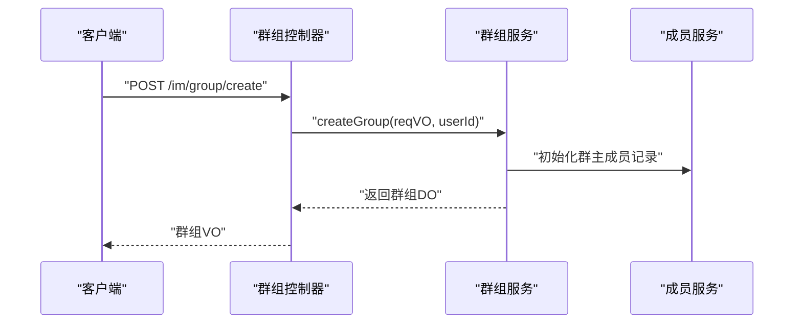
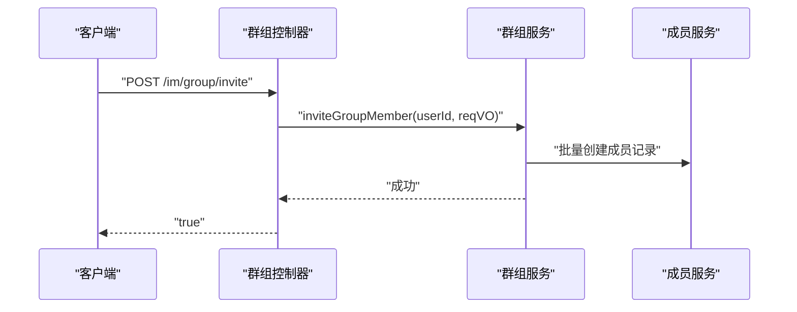
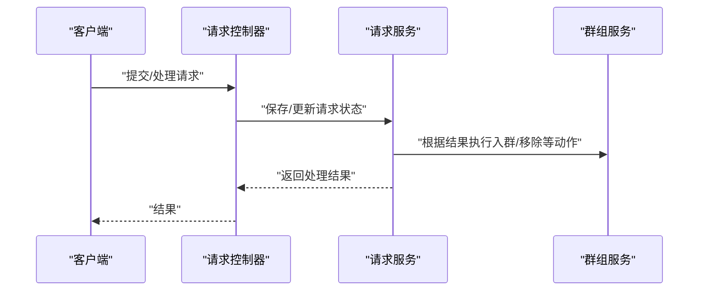
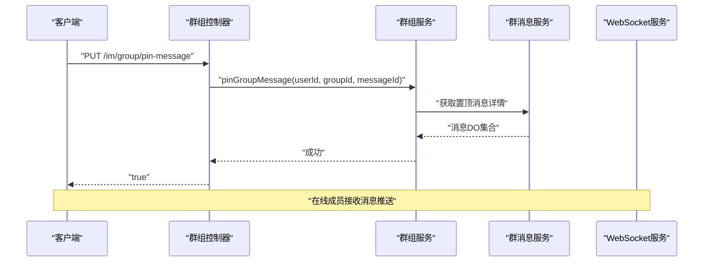
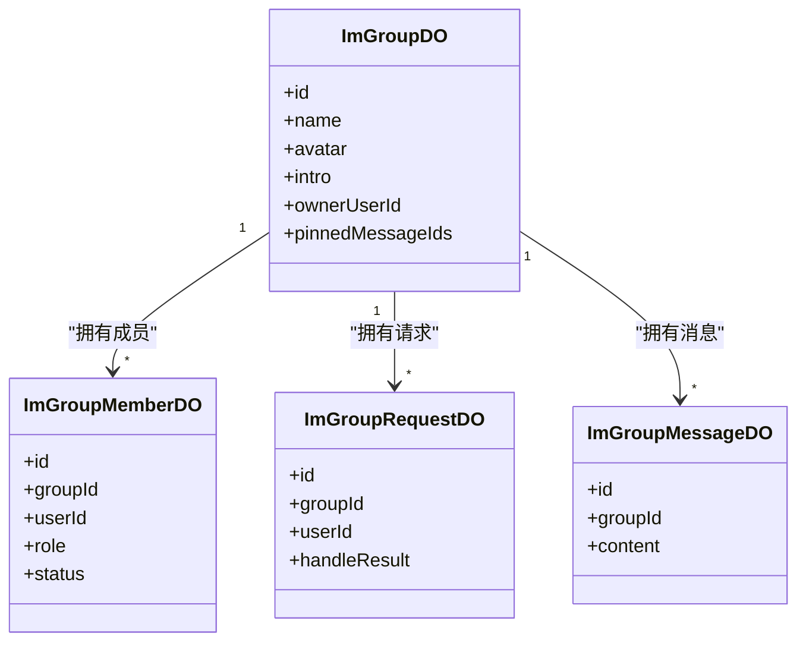

# 群组系统

<cite>
**本文引用的文件**
- [ImGroupController.java](file://yudao-module-im/src/main/java/cn/iocoder/yudao/module/im/controller/admin/group/ImGroupController.java)
- [ImGroupMemberController.java](file://yudao-module-im/src/main/java/cn/iocoder/yudao/module/im/controller/admin/group/ImGroupMemberController.java)
- [ImGroupRequestController.java](file://yudao-module-im/src/main/java/cn/iocoder/yudao/module/im/controller/admin/group/ImGroupRequestController.java)
- [ImGroupService.java](file://yudao-module-im/src/main/java/cn/iocoder/yudao/module/im/service/group/ImGroupService.java)
- [ImGroupServiceImpl.java](file://yudao-module-im/src/main/java/cn/iocoder/yudao/module/im/service/group/ImGroupServiceImpl.java)
- [ImGroupMemberService.java](file://yudao-module-im/src/main/java/cn/iocoder/yudao/module/im/service/group/ImGroupMemberService.java)
- [ImGroupMemberServiceImpl.java](file://yudao-module-im/src/main/java/cn/iocoder/yudao/module/im/service/group/ImGroupMemberServiceImpl.java)
- [ImGroupRequestService.java](file://yudao-module-im/src/main/java/cn/iocoder/yudao/module/im/service/group/ImGroupRequestService.java)
- [ImGroupRequestServiceImpl.java](file://yudao-module-im/src/main/java/cn/iocoder/yudao/module/im/service/group/ImGroupRequestServiceImpl.java)
- [ImGroupMessageService.java](file://yudao-module-im/src/main/java/cn/iocoder/yudao/module/im/service/message/ImGroupMessageService.java)
- [ImGroupMessageServiceImpl.java](file://yudao-module-im/src/main/java/cn/iocoder/yudao/module/im/service/message/ImGroupMessageServiceImpl.java)
- [ImGroupDO.java](file://yudao-module-im/src/main/java/cn/iocoder/yudao/module/im/dal/dataobject/group/ImGroupDO.java)
- [ImGroupMemberDO.java](file://yudao-module-im/src/main/java/cn/iocoder/yudao/module/im/dal/dataobject/group/ImGroupMemberDO.java)
- [ImGroupRequestDO.java](file://yudao-module-im/src/main/java/cn/iocoder/yudao/module/im/dal/dataobject/group/ImGroupRequestDO.java)
- [ImGroupMessageDO.java](file://yudao-module-im/src/main/java/cn/iocoder/yudao/module/im/dal/dataobject/message/ImGroupMessageDO.java)
- [ImGroupMemberRoleEnum.java](file://yudao-module-im/src/main/java/cn/iocoder/yudao/module/im/enums/group/ImGroupMemberRoleEnum.java)
- [ImGroupRequestHandleResultEnum.java](file://yudao-module-im/src/main/java/cn/iocoder/yudao/module/im/enums/group/ImGroupRequestHandleResultEnum.java)
- [ImGroupAddSourceEnum.java](file://yudao-module-im/src/main/java/cn/iocoder/yudao/module/im/enums/group/ImGroupAddSourceEnum.java)
- [ImGroupAdminAddReqVO.java](file://yudao-module-im/src/main/java/cn/iocoder/yudao/module/im/controller/admin/group/vo/ImGroupAdminAddReqVO.java)
- [ImGroupAdminRemoveReqVO.java](file://yudao-module-im/src/main/java/cn/iocoder/yudao/module/im/controller/admin/group/vo/ImGroupAdminRemoveReqVO.java)
- [ImGroupTransferOwnerReqVO.java](file://yudao-module-im/src/main/java/cn/iocoder/yudao/module/im/controller/admin/group/vo/ImGroupTransferOwnerReqVO.java)
- [ImGroupCreateReqVO.java](file://yudao-module-im/src/main/java/cn/iocoder/yudao/module/im/controller/admin/group/vo/ImGroupCreateReqVO.java)
- [ImGroupUpdateReqVO.java](file://yudao-module-im/src/main/java/cn/iocoder/yudao/module/im/controller/admin/group/vo/ImGroupUpdateReqVO.java)
- [ImGroupMemberInviteReqVO.java](file://yudao-module-im/src/main/java/cn/iocoder/yudao/module/im/controller/admin/group/vo/member/ImGroupMemberInviteReqVO.java)
- [ImGroupMemberRemoveReqVO.java](file://yudao-module-im/src/main/java/cn/iocoder/yudao/module/im/controller/admin/group/vo/member/ImGroupMemberRemoveReqVO.java)
- [ImGroupMessagePinReqVO.java](file://yudao-module-im/src/main/java/cn/iocoder/yudao/module/im/controller/admin/group/vo/ImGroupMessagePinReqVO.java)
- [ImGroupMuteAllReqVO.java](file://yudao-module-im/src/main/java/cn/iocoder/yudao/module/im/controller/admin/group/vo/ImGroupMuteAllReqVO.java)
- [ImGroupMuteMemberReqVO.java](file://yudao-module-im/src/main/java/cn/iocoder/yudao/module/im/controller/admin/group/vo/ImGroupMuteMemberReqVO.java)
- [ImGroupCancelMuteMemberReqVO.java](file://yudao-module-im/src/main/java/cn/iocoder/yudao/module/im/controller/admin/group/vo/ImGroupCancelMuteMemberReqVO.java)
- [ImGroupMessageRespVO.java](file://yudao-module-im/src/main/java/cn/iocoder/yudao/module/im/controller/admin/message/vo/group/ImGroupMessageRespVO.java)
- [ImWebSocketServiceImpl.java](file://yudao-module-im/src/main/java/cn/iocoder/yudao/module/im/service/websocket/ImWebSocketServiceImpl.java)
- [groupStore.ts](file://yudao-ui/yudao-ui-admin-vue3/src/views/im/home/store/groupStore.ts)
- [groupRequestStore.ts](file://yudao-ui/yudao-ui-admin-vue3/src/views/im/home/store/groupRequestStore.ts)
- [group.ts](file://yudao-ui/yudao-ui-admin-vue3/src/views/im/utils/group.ts)
</cite>

## 目录
1. [引言](#引言)
2. [项目结构](#项目结构)
3. [核心组件](#核心组件)
4. [架构总览](#架构总览)
5. [详细组件分析](#详细组件分析)
6. [依赖分析](#依赖分析)
7. [性能考虑](#性能考虑)
8. [故障排查指南](#故障排查指南)
9. [结论](#结论)
10. [附录](#附录)

## 引言
本文件面向即时通讯模块中的“群组系统”，系统性梳理群组的创建与管理、成员管理、请求处理、消息分发与权限控制、统计与活跃度监控等能力。文档以代码为依据，结合架构图与流程图，帮助开发者快速理解并扩展群组能力。

## 项目结构
群组系统位于后端 IM 模块中，采用“控制器-服务-数据对象-枚举-VO”的分层设计；前端在 yudao-ui 中通过 store 与工具函数协同完成群组状态与交互逻辑。

图表来源
- [ImGroupController.java:31-206](file://yudao-module-im/src/main/java/cn/iocoder/yudao/module/im/controller/admin/group/ImGroupController.java#L31-L206)
- [ImGroupMemberController.java:1-25](file://yudao-module-im/src/main/java/cn/iocoder/yudao/module/im/controller/admin/group/ImGroupMemberController.java#L1-L25)
- [ImGroupRequestController.java](file://yudao-module-im/src/main/java/cn/iocoder/yudao/module/im/controller/admin/group/ImGroupRequestController.java)
- [ImGroupService.java](file://yudao-module-im/src/main/java/cn/iocoder/yudao/module/im/service/group/ImGroupService.java)
- [ImGroupServiceImpl.java](file://yudao-module-im/src/main/java/cn/iocoder/yudao/module/im/service/group/ImGroupServiceImpl.java)
- [ImGroupMemberService.java](file://yudao-module-im/src/main/java/cn/iocoder/yudao/module/im/service/group/ImGroupMemberService.java)
- [ImGroupMemberServiceImpl.java](file://yudao-module-im/src/main/java/cn/iocoder/yudao/module/im/service/group/ImGroupMemberServiceImpl.java)
- [ImGroupRequestService.java](file://yudao-module-im/src/main/java/cn/iocoder/yudao/module/im/service/group/ImGroupRequestService.java)
- [ImGroupRequestServiceImpl.java](file://yudao-module-im/src/main/java/cn/iocoder/yudao/module/im/service/group/ImGroupRequestServiceImpl.java)
- [ImGroupMessageService.java](file://yudao-module-im/src/main/java/cn/iocoder/yudao/module/im/service/message/ImGroupMessageService.java)
- [ImGroupMessageServiceImpl.java](file://yudao-module-im/src/main/java/cn/iocoder/yudao/module/im/service/message/ImGroupMessageServiceImpl.java)
- [ImGroupDO.java](file://yudao-module-im/src/main/java/cn/iocoder/yudao/module/im/dal/dataobject/group/ImGroupDO.java)
- [ImGroupMemberDO.java](file://yudao-module-im/src/main/java/cn/iocoder/yudao/module/im/dal/dataobject/group/ImGroupMemberDO.java)
- [ImGroupRequestDO.java](file://yudao-module-im/src/main/java/cn/iocoder/yudao/module/im/dal/dataobject/group/ImGroupRequestDO.java)
- [ImGroupMessageDO.java](file://yudao-module-im/src/main/java/cn/iocoder/yudao/module/im/dal/dataobject/message/ImGroupMessageDO.java)
- [ImGroupMemberRoleEnum.java](file://yudao-module-im/src/main/java/cn/iocoder/yudao/module/im/enums/group/ImGroupMemberRoleEnum.java)
- [ImGroupRequestHandleResultEnum.java](file://yudao-module-im/src/main/java/cn/iocoder/yudao/module/im/enums/group/ImGroupRequestHandleResultEnum.java)
- [groupStore.ts](file://yudao-ui/yudao-ui-admin-vue3/src/views/im/home/store/groupStore.ts)
- [groupRequestStore.ts](file://yudao-ui/yudao-ui-admin-vue3/src/views/im/home/store/groupRequestStore.ts)
- [group.ts](file://yudao-ui/yudao-ui-admin-vue3/src/views/im/utils/group.ts)

章节来源
- [ImGroupController.java:31-206](file://yudao-module-im/src/main/java/cn/iocoder/yudao/module/im/controller/admin/group/ImGroupController.java#L31-L206)
- [ImGroupMemberController.java:1-25](file://yudao-module-im/src/main/java/cn/iocoder/yudao/module/im/controller/admin/group/ImGroupMemberController.java#L1-L25)
- [ImGroupRequestController.java](file://yudao-module-im/src/main/java/cn/iocoder/yudao/module/im/controller/admin/group/ImGroupRequestController.java)
- [groupStore.ts](file://yudao-ui/yudao-ui-admin-vue3/src/views/im/home/store/groupStore.ts)
- [groupRequestStore.ts](file://yudao-ui/yudao-ui-admin-vue3/src/views/im/home/store/groupRequestStore.ts)
- [group.ts](file://yudao-ui/yudao-ui-admin-vue3/src/views/im/utils/group.ts)

## 核心组件
- 控制器层：提供 REST 接口，封装鉴权上下文与参数校验，调用服务层执行业务。
- 服务层：实现群组生命周期、成员管理、请求处理、消息置顶与禁言等核心逻辑。
- 数据访问层：定义群组、成员、请求、消息等数据对象，承载持久化与查询。
- 枚举与 VO：统一角色、状态、请求处理结果等语义，规范接口输入输出。
- 前端 Store/工具：维护群组状态、请求状态与工具函数，驱动 UI 行为。

章节来源
- [ImGroupController.java:31-206](file://yudao-module-im/src/main/java/cn/iocoder/yudao/module/im/controller/admin/group/ImGroupController.java#L31-L206)
- [ImGroupMemberController.java:1-25](file://yudao-module-im/src/main/java/cn/iocoder/yudao/module/im/controller/admin/group/ImGroupMemberController.java#L1-L25)
- [ImGroupService.java](file://yudao-module-im/src/main/java/cn/iocoder/yudao/module/im/service/group/ImGroupService.java)
- [ImGroupServiceImpl.java](file://yudao-module-im/src/main/java/cn/iocoder/yudao/module/im/service/group/ImGroupServiceImpl.java)
- [ImGroupMemberService.java](file://yudao-module-im/src/main/java/cn/iocoder/yudao/module/im/service/group/ImGroupMemberService.java)
- [ImGroupMemberServiceImpl.java](file://yudao-module-im/src/main/java/cn/iocoder/yudao/module/im/service/group/ImGroupMemberServiceImpl.java)
- [ImGroupRequestService.java](file://yudao-module-im/src/main/java/cn/iocoder/yudao/module/im/service/group/ImGroupRequestService.java)
- [ImGroupRequestServiceImpl.java](file://yudao-module-im/src/main/java/cn/iocoder/yudao/module/im/service/group/ImGroupRequestServiceImpl.java)
- [ImGroupMessageService.java](file://yudao-module-im/src/main/java/cn/iocoder/yudao/module/im/service/message/ImGroupMessageService.java)
- [ImGroupMessageServiceImpl.java](file://yudao-module-im/src/main/java/cn/iocoder/yudao/module/im/service/message/ImGroupMessageServiceImpl.java)
- [ImGroupDO.java](file://yudao-module-im/src/main/java/cn/iocoder/yudao/module/im/dal/dataobject/group/ImGroupDO.java)
- [ImGroupMemberDO.java](file://yudao-module-im/src/main/java/cn/iocoder/yudao/module/im/dal/dataobject/group/ImGroupMemberDO.java)
- [ImGroupRequestDO.java](file://yudao-module-im/src/main/java/cn/iocoder/yudao/module/im/dal/dataobject/group/ImGroupRequestDO.java)
- [ImGroupMessageDO.java](file://yudao-module-im/src/main/java/cn/iocoder/yudao/module/im/dal/dataobject/message/ImGroupMessageDO.java)
- [ImGroupMemberRoleEnum.java](file://yudao-module-im/src/main/java/cn/iocoder/yudao/module/im/enums/group/ImGroupMemberRoleEnum.java)
- [ImGroupRequestHandleResultEnum.java](file://yudao-module-im/src/main/java/cn/iocoder/yudao/module/im/enums/group/ImGroupRequestHandleResultEnum.java)

## 架构总览
群组系统遵循“控制器-服务-数据对象”三层架构，围绕群组生命周期与成员关系进行扩展，同时通过消息服务支撑消息置顶、禁言等功能。

图表来源
- [ImGroupController.java:31-206](file://yudao-module-im/src/main/java/cn/iocoder/yudao/module/im/controller/admin/group/ImGroupController.java#L31-L206)
- [ImGroupMemberController.java:1-25](file://yudao-module-im/src/main/java/cn/iocoder/yudao/module/im/controller/admin/group/ImGroupMemberController.java#L1-L25)
- [ImGroupRequestController.java](file://yudao-module-im/src/main/java/cn/iocoder/yudao/module/im/controller/admin/group/ImGroupRequestController.java)
- [ImGroupService.java](file://yudao-module-im/src/main/java/cn/iocoder/yudao/module/im/service/group/ImGroupService.java)
- [ImGroupServiceImpl.java](file://yudao-module-im/src/main/java/cn/iocoder/yudao/module/im/service/group/ImGroupServiceImpl.java)
- [ImGroupMemberService.java](file://yudao-module-im/src/main/java/cn/iocoder/yudao/module/im/service/group/ImGroupMemberService.java)
- [ImGroupMemberServiceImpl.java](file://yudao-module-im/src/main/java/cn/iocoder/yudao/module/im/service/group/ImGroupMemberServiceImpl.java)
- [ImGroupRequestService.java](file://yudao-module-im/src/main/java/cn/iocoder/yudao/module/im/service/group/ImGroupRequestService.java)
- [ImGroupRequestServiceImpl.java](file://yudao-module-im/src/main/java/cn/iocoder/yudao/module/im/service/group/ImGroupRequestServiceImpl.java)
- [ImGroupMessageService.java](file://yudao-module-im/src/main/java/cn/iocoder/yudao/module/im/service/message/ImGroupMessageService.java)
- [ImGroupMessageServiceImpl.java](file://yudao-module-im/src/main/java/cn/iocoder/yudao/module/im/service/message/ImGroupMessageServiceImpl.java)
- [ImGroupDO.java](file://yudao-module-im/src/main/java/cn/iocoder/yudao/module/im/dal/dataobject/group/ImGroupDO.java)
- [ImGroupMemberDO.java](file://yudao-module-im/src/main/java/cn/iocoder/yudao/module/im/dal/dataobject/group/ImGroupMemberDO.java)
- [ImGroupRequestDO.java](file://yudao-module-im/src/main/java/cn/iocoder/yudao/module/im/dal/dataobject/group/ImGroupRequestDO.java)
- [ImGroupMessageDO.java](file://yudao-module-im/src/main/java/cn/iocoder/yudao/module/im/dal/dataobject/message/ImGroupMessageDO.java)

## 详细组件分析

### 群组控制器与接口总览
- 创建群组：POST /im/group/create
- 更新群组：PUT /im/group/update
- 解散群组：DELETE /im/group/dissolve?id={id}
- 获取群组：GET /im/group/get?id={id}
- 获取我的群组列表：GET /im/group/list
- 邀请成员：POST /im/group/invite
- 退出群组：DELETE /im/group/quit?groupId={id}
- 移除成员：DELETE /im/group/kicking
- 添加管理员：PUT /im/group/add-admin
- 撤销管理员：PUT /im/group/remove-admin
- 转让群主：PUT /im/group/transfer-owner
- 置顶消息：PUT /im/group/pin-message
- 取消置顶：PUT /im/group/unpin-message
- 全员禁言：PUT /im/group/mute-all
- 成员禁言：PUT /im/group/mute-member
- 取消成员禁言：PUT /im/group/cancel-mute-member

章节来源
- [ImGroupController.java:46-169](file://yudao-module-im/src/main/java/cn/iocoder/yudao/module/im/controller/admin/group/ImGroupController.java#L46-L169)

### 群组基本信息设置与头像上传
- 基本信息设置：通过更新接口支持修改群名称、公告、是否公开等字段（具体字段以 VO 为准）。
- 头像上传：建议通过独立的媒体/文件接口上传头像，返回资源标识后在更新群组时写入头像字段。

章节来源
- [ImGroupUpdateReqVO.java](file://yudao-module-im/src/main/java/cn/iocoder/yudao/module/im/controller/admin/group/vo/ImGroupUpdateReqVO.java)
- [ImGroupController.java:54-59](file://yudao-module-im/src/main/java/cn/iocoder/yudao/module/im/controller/admin/group/ImGroupController.java#L54-L59)

### 群组描述编辑
- 描述编辑通过更新接口实现，写入群描述字段，便于前端展示与检索。

章节来源
- [ImGroupUpdateReqVO.java](file://yudao-module-im/src/main/java/cn/iocoder/yudao/module/im/controller/admin/group/vo/ImGroupUpdateReqVO.java)
- [ImGroupController.java:54-59](file://yudao-module-im/src/main/java/cn/iocoder/yudao/module/im/controller/admin/group/ImGroupController.java#L54-L59)

### 成员邀请、踢出成员、设置管理员与权限控制
- 邀请成员：POST /im/group/invite，需具备管理员及以上权限。
- 踢出成员：DELETE /im/group/kicking，需满足权限与成员身份判定。
- 设置管理员：PUT /im/group/add-admin，支持将成员提升为管理员。
- 撤销管理员：PUT /im/group/remove-admin，支持降权。
- 权限控制：管理员可进行成员管理与消息管理；群主拥有最高权限；普通成员仅能退出群组。

章节来源
- [ImGroupController.java:89-130](file://yudao-module-im/src/main/java/cn/iocoder/yudao/module/im/controller/admin/group/ImGroupController.java#L89-L130)
- [ImGroupMemberRoleEnum.java](file://yudao-module-im/src/main/java/cn/iocoder/yudao/module/im/enums/group/ImGroupMemberRoleEnum.java)

### 群组请求处理：入群申请、审核与黑名单
- 入群申请：由请求控制器处理，记录申请并等待管理员审核。
- 审核流程：管理员可同意或拒绝申请，结果通过枚举统一表达。
- 黑名单管理：可在成员管理中对违规用户进行限制或移除。

章节来源
- [ImGroupRequestController.java](file://yudao-module-im/src/main/java/cn/iocoder/yudao/module/im/controller/admin/group/ImGroupRequestController.java)
- [ImGroupRequestHandleResultEnum.java](file://yudao-module-im/src/main/java/cn/iocoder/yudao/module/im/enums/group/ImGroupRequestHandleResultEnum.java)

### 群组消息分发与置顶
- 置顶消息：仅管理员可置顶，置顶消息按顺序回填至响应体，非成员不可见。
- 禁言策略：支持全员禁言与成员禁言，管理员可取消禁言。
- 消息分发：通过 WebSocket 服务向在线成员推送消息。

章节来源
- [ImGroupController.java:134-169](file://yudao-module-im/src/main/java/cn/iocoder/yudao/module/im/controller/admin/group/ImGroupController.java#L134-L169)
- [ImGroupMessageService.java](file://yudao-module-im/src/main/java/cn/iocoder/yudao/module/im/service/message/ImGroupMessageService.java)
- [ImGroupMessageServiceImpl.java](file://yudao-module-im/src/main/java/cn/iocoder/yudao/module/im/service/message/ImGroupMessageServiceImpl.java)
- [ImWebSocketServiceImpl.java](file://yudao-module-im/src/main/java/cn/iocoder/yudao/module/im/service/websocket/ImWebSocketServiceImpl.java)

### 群组统计与活跃度监控
- 统计维度：成员数量、消息发送量、置顶消息数、禁言次数等。
- 活跃度：基于近期消息发送频率与成员在线时长评估群组活跃度。
- 建议：通过定时任务统计与缓存聚合，前端按需拉取。

章节来源
- [ImGroupServiceImpl.java](file://yudao-module-im/src/main/java/cn/iocoder/yudao/module/im/service/group/ImGroupServiceImpl.java)
- [ImGroupMessageServiceImpl.java](file://yudao-module-im/src/main/java/cn/iocoder/yudao/module/im/service/message/ImGroupMessageServiceImpl.java)

## 依赖分析
- 控制器依赖服务：控制器仅负责编排与参数校验，业务逻辑下沉到服务层。
- 服务间耦合：群组服务依赖成员服务与消息服务，形成清晰的领域边界。
- 数据对象：DO 属性与枚举、VO 字段保持一致，避免歧义。
- 前端依赖：store 与工具函数依赖控制器接口与后端返回结构。

图表来源
- [ImGroupController.java:31-206](file://yudao-module-im/src/main/java/cn/iocoder/yudao/module/im/controller/admin/group/ImGroupController.java#L31-L206)
- [ImGroupService.java](file://yudao-module-im/src/main/java/cn/iocoder/yudao/module/im/service/group/ImGroupService.java)
- [ImGroupServiceImpl.java](file://yudao-module-im/src/main/java/cn/iocoder/yudao/module/im/service/group/ImGroupServiceImpl.java)
- [ImGroupDO.java](file://yudao-module-im/src/main/java/cn/iocoder/yudao/module/im/dal/dataobject/group/ImGroupDO.java)
- [ImGroupMemberDO.java](file://yudao-module-im/src/main/java/cn/iocoder/yudao/module/im/dal/dataobject/group/ImGroupMemberDO.java)
- [ImGroupRequestDO.java](file://yudao-module-im/src/main/java/cn/iocoder/yudao/module/im/dal/dataobject/group/ImGroupRequestDO.java)
- [ImGroupMessageDO.java](file://yudao-module-im/src/main/java/cn/iocoder/yudao/module/im/dal/dataobject/message/ImGroupMessageDO.java)
- [ImGroupMemberRoleEnum.java](file://yudao-module-im/src/main/java/cn/iocoder/yudao/module/im/enums/group/ImGroupMemberRoleEnum.java)
- [ImGroupRequestHandleResultEnum.java](file://yudao-module-im/src/main/java/cn/iocoder/yudao/module/im/enums/group/ImGroupRequestHandleResultEnum.java)
- [groupStore.ts](file://yudao-ui/yudao-ui-admin-vue3/src/views/im/home/store/groupStore.ts)
- [groupRequestStore.ts](file://yudao-ui/yudao-ui-admin-vue3/src/views/im/home/store/groupRequestStore.ts)
- [group.ts](file://yudao-ui/yudao-ui-admin-vue3/src/views/im/utils/group.ts)

## 性能考虑
- 批量查询与回填：群组列表在转换时仅对当前用户有效的群回填置顶消息，避免非成员越权访问与多余查询。
- 缓存与聚合：建议对成员列表、消息聚合统计进行缓存，降低数据库压力。
- 分页与限流：对外接口增加分页与限流，防止高并发下的抖动。
- 消息推送：WebSocket 广播应按群组拆分，避免广播风暴。

章节来源
- [ImGroupController.java:179-204](file://yudao-module-im/src/main/java/cn/iocoder/yudao/module/im/controller/admin/group/ImGroupController.java#L179-L204)

## 故障排查指南
- 权限不足：检查当前登录用户的角色与群组成员状态，确保具备相应操作权限。
- 成员状态异常：确认成员是否已退出或被禁言，避免重复操作。
- 请求未生效：核对请求参数与 VO 字段映射，确保字段正确传递。
- 消息未送达：检查 WebSocket 连接与在线成员列表，确认消息分发链路。

章节来源
- [ImGroupController.java:89-130](file://yudao-module-im/src/main/java/cn/iocoder/yudao/module/im/controller/admin/group/ImGroupController.java#L89-L130)
- [ImGroupMemberRoleEnum.java](file://yudao-module-im/src/main/java/cn/iocoder/yudao/module/im/enums/group/ImGroupMemberRoleEnum.java)

## 结论
群组系统以清晰的分层与职责划分实现了从创建、管理到成员治理与消息分发的完整闭环。通过枚举与 VO 统一语义，结合前端 Store/工具，形成前后端协作的高效模式。后续可在统计与活跃度监控、消息推送优化与权限细化方面持续演进。

## 附录

### 群组管理 API 完整接口清单
- 创建群组：POST /im/group/create
- 更新群组：PUT /im/group/update
- 解散群组：DELETE /im/group/dissolve?id={id}
- 获取群组：GET /im/group/get?id={id}
- 获取我的群组列表：GET /im/group/list
- 邀请成员：POST /im/group/invite
- 退出群组：DELETE /im/group/quit?groupId={id}
- 移除成员：DELETE /im/group/kicking
- 添加管理员：PUT /im/group/add-admin
- 撤销管理员：PUT /im/group/remove-admin
- 转让群主：PUT /im/group/transfer-owner
- 置顶消息：PUT /im/group/pin-message
- 取消置顶：PUT /im/group/unpin-message
- 全员禁言：PUT /im/group/mute-all
- 成员禁言：PUT /im/group/mute-member
- 取消成员禁言：PUT /im/group/cancel-mute-member

章节来源
- [ImGroupController.java:46-169](file://yudao-module-im/src/main/java/cn/iocoder/yudao/module/im/controller/admin/group/ImGroupController.java#L46-L169)

### 关键流程时序图：创建群组

图表来源
- [ImGroupController.java:46-52](file://yudao-module-im/src/main/java/cn/iocoder/yudao/module/im/controller/admin/group/ImGroupController.java#L46-L52)
- [ImGroupService.java](file://yudao-module-im/src/main/java/cn/iocoder/yudao/module/im/service/group/ImGroupService.java)
- [ImGroupServiceImpl.java](file://yudao-module-im/src/main/java/cn/iocoder/yudao/module/im/service/group/ImGroupServiceImpl.java)
- [ImGroupMemberService.java](file://yudao-module-im/src/main/java/cn/iocoder/yudao/module/im/service/group/ImGroupMemberService.java)
- [ImGroupMemberServiceImpl.java](file://yudao-module-im/src/main/java/cn/iocoder/yudao/module/im/service/group/ImGroupMemberServiceImpl.java)

### 关键流程时序图：成员邀请

图表来源
- [ImGroupController.java:89-94](file://yudao-module-im/src/main/java/cn/iocoder/yudao/module/im/controller/admin/group/ImGroupController.java#L89-L94)
- [ImGroupService.java](file://yudao-module-im/src/main/java/cn/iocoder/yudao/module/im/service/group/ImGroupService.java)
- [ImGroupServiceImpl.java](file://yudao-module-im/src/main/java/cn/iocoder/yudao/module/im/service/group/ImGroupServiceImpl.java)
- [ImGroupMemberService.java](file://yudao-module-im/src/main/java/cn/iocoder/yudao/module/im/service/group/ImGroupMemberService.java)
- [ImGroupMemberServiceImpl.java](file://yudao-module-im/src/main/java/cn/iocoder/yudao/module/im/service/group/ImGroupMemberServiceImpl.java)

### 关键流程时序图：请求处理（审核）

图表来源
- [ImGroupRequestController.java](file://yudao-module-im/src/main/java/cn/iocoder/yudao/module/im/controller/admin/group/ImGroupRequestController.java)
- [ImGroupRequestService.java](file://yudao-module-im/src/main/java/cn/iocoder/yudao/module/im/service/group/ImGroupRequestService.java)
- [ImGroupRequestServiceImpl.java](file://yudao-module-im/src/main/java/cn/iocoder/yudao/module/im/service/group/ImGroupRequestServiceImpl.java)
- [ImGroupService.java](file://yudao-module-im/src/main/java/cn/iocoder/yudao/module/im/service/group/ImGroupService.java)
- [ImGroupServiceImpl.java](file://yudao-module-im/src/main/java/cn/iocoder/yudao/module/im/service/group/ImGroupServiceImpl.java)

### 关键流程时序图：消息置顶与回填

图表来源
- [ImGroupController.java:134-139](file://yudao-module-im/src/main/java/cn/iocoder/yudao/module/im/controller/admin/group/ImGroupController.java#L134-L139)
- [ImGroupServiceImpl.java](file://yudao-module-im/src/main/java/cn/iocoder/yudao/module/im/service/group/ImGroupServiceImpl.java)
- [ImGroupMessageService.java](file://yudao-module-im/src/main/java/cn/iocoder/yudao/module/im/service/message/ImGroupMessageService.java)
- [ImGroupMessageServiceImpl.java](file://yudao-module-im/src/main/java/cn/iocoder/yudao/module/im/service/message/ImGroupMessageServiceImpl.java)
- [ImWebSocketServiceImpl.java](file://yudao-module-im/src/main/java/cn/iocoder/yudao/module/im/service/websocket/ImWebSocketServiceImpl.java)

### 类关系图：群组与成员、请求、消息

图表来源
- [ImGroupDO.java](file://yudao-module-im/src/main/java/cn/iocoder/yudao/module/im/dal/dataobject/group/ImGroupDO.java)
- [ImGroupMemberDO.java](file://yudao-module-im/src/main/java/cn/iocoder/yudao/module/im/dal/dataobject/group/ImGroupMemberDO.java)
- [ImGroupRequestDO.java](file://yudao-module-im/src/main/java/cn/iocoder/yudao/module/im/dal/dataobject/group/ImGroupRequestDO.java)
- [ImGroupMessageDO.java](file://yudao-module-im/src/main/java/cn/iocoder/yudao/module/im/dal/dataobject/message/ImGroupMessageDO.java)