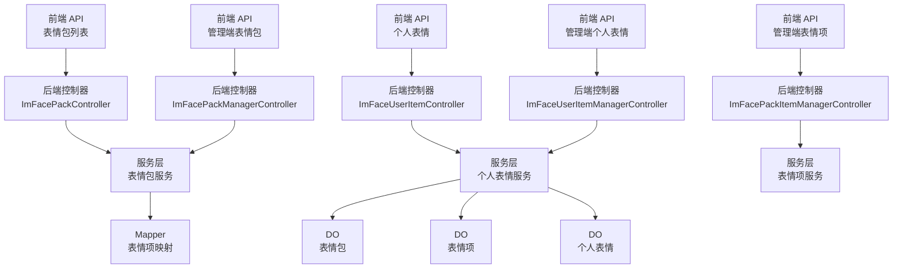
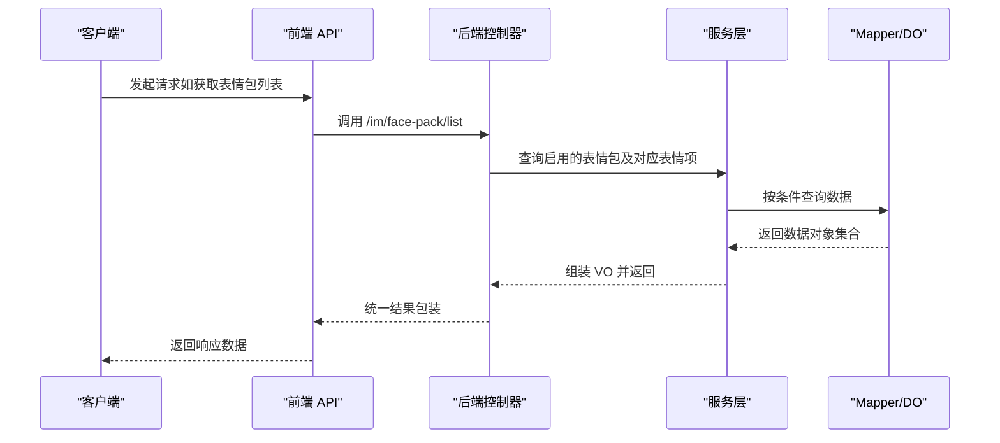
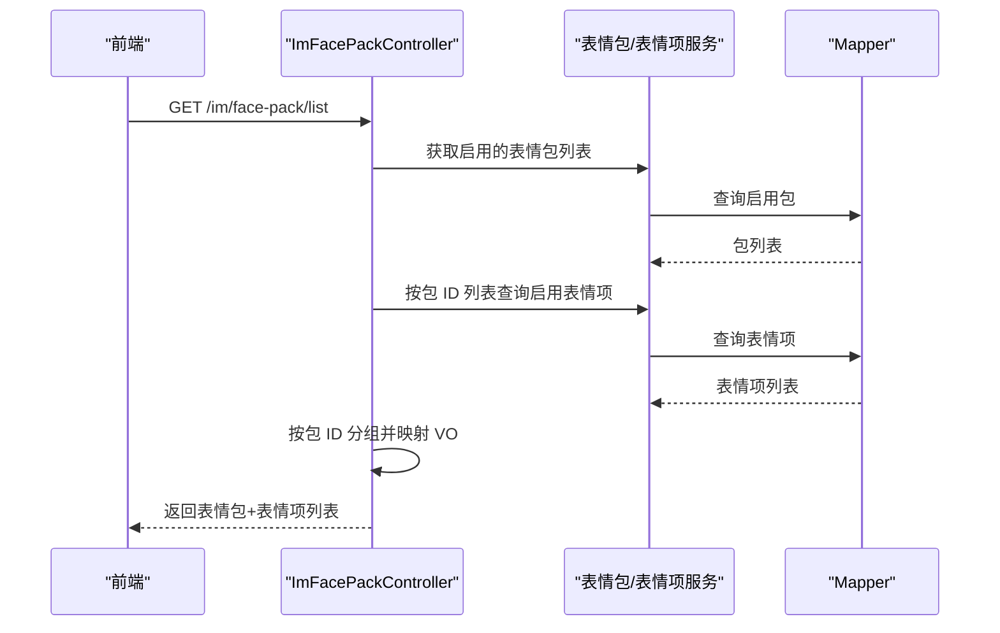
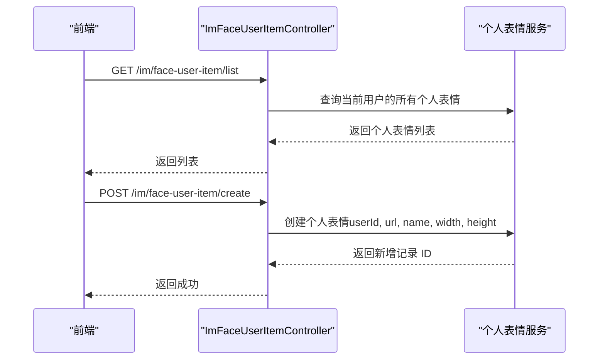
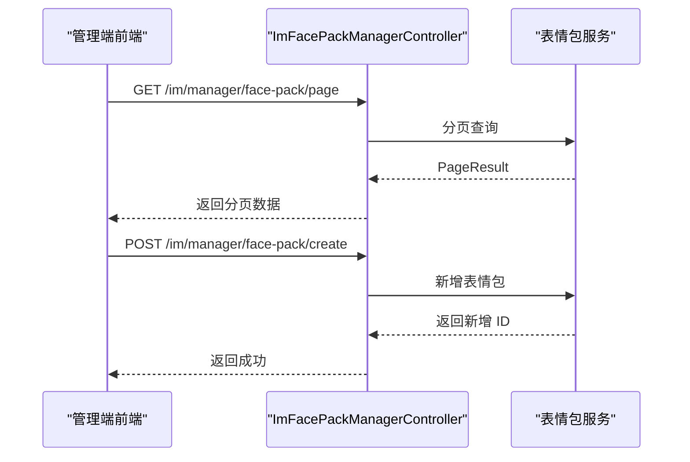
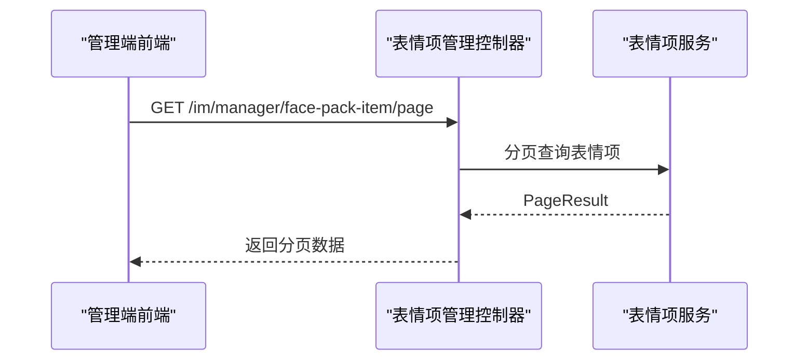
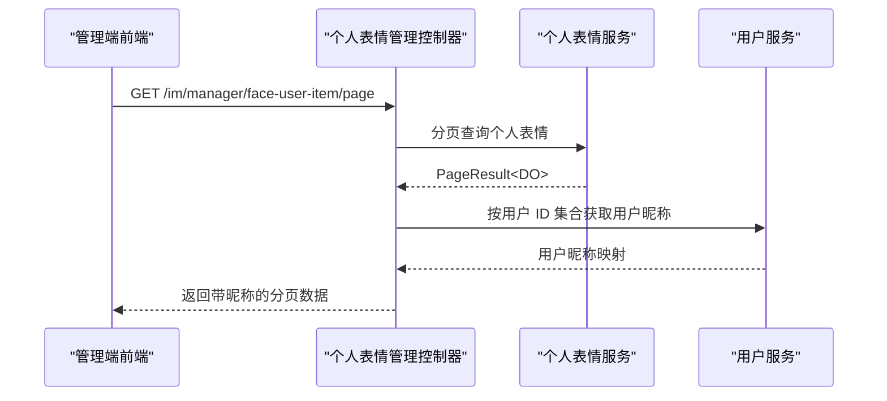
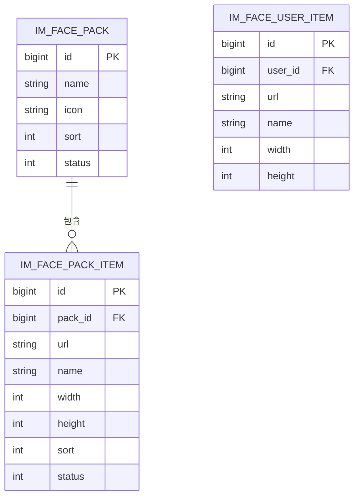
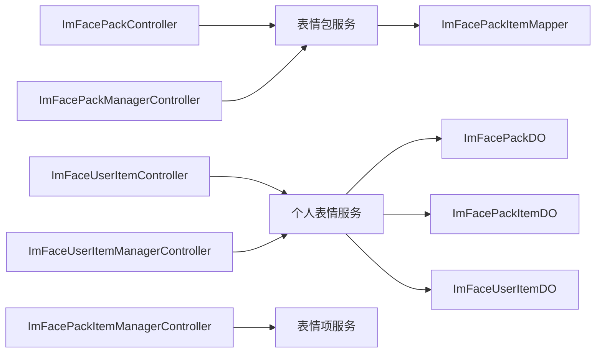

# 表情系统

<cite>
**本文引用的文件**
- [yudao-ui/yudao-ui-admin-vue3/src/api/im/face/pack/index.ts](file://yudao-ui/yudao-ui-admin-vue3/src/api/im/face/pack/index.ts)
- [yudao-ui/yudao-ui-admin-vue3/src/api/im/face/useritem/index.ts](file://yudao-ui/yudao-ui-admin-vue3/src/api/im/face/useritem/index.ts)
- [yudao-ui/yudao-ui-admin-vue3/src/api/im/channel/material/index.ts](file://yudao-ui/yudao-ui-admin-vue3/src/api/im/channel/material/index.ts)
- [yudao-ui/yudao-ui-admin-vue3/src/api/im/manager/face/pack/index.ts](file://yudao-ui/yudao-ui-admin-vue3/src/api/im/manager/face/pack/index.ts)
- [yudao-ui/yudao-ui-admin-vue3/src/api/im/manager/face/item/index.ts](file://yudao-ui/yudao-ui-admin-vue3/src/api/im/manager/face/item/index.ts)
- [yudao-ui/yudao-ui-admin-vue3/src/api/im/manager/face/userItem/index.ts](file://yudao-ui/yudao-ui-admin-vue3/src/api/im/manager/face/userItem/index.ts)
- [yudao-module-im/src/main/java/cn/iocoder/yudao/module/im/controller/admin/face/ImFacePackController.java](file://yudao-module-im/src/main/java/cn/iocoder/yudao/module/im/controller/admin/face/ImFacePackController.java)
- [yudao-module-im/src/main/java/cn/iocoder/yudao/module/im/controller/admin/face/ImFaceUserItemController.java](file://yudao-module-im/src/main/java/cn/iocoder/yudao/module/im/controller/admin/face/ImFaceUserItemController.java)
- [yudao-module-im/src/main/java/cn/iocoder/yudao/module/im/controller/admin/manager/face/ImFacePackManagerController.java](file://yudao-module-im/src/main/java/cn/iocoder/yudao/module/im/controller/admin/manager/face/ImFacePackManagerController.java)
- [yudao-module-im/src/main/java/cn/iocoder/yudao/module/im/controller/admin/manager/face/ImFaceUserItemManagerController.java](file://yudao-module-im/src/main/java/cn/iocoder/yudao/module/im/controller/admin/manager/face/ImFaceUserItemManagerController.java)
- [yudao-module-im/src/main/java/cn/iocoder/yudao/module/im/dal/dataobject/face/ImFacePackDO.java](file://yudao-module-im/src/main/java/cn/iocoder/yudao/module/im/dal/dataobject/face/ImFacePackDO.java)
- [yudao-module-im/src/main/java/cn/iocoder/yudao/module/im/dal/dataobject/face/ImFacePackItemDO.java](file://yudao-module-im/src/main/java/cn/iocoder/yudao/module/im/dal/dataobject/face/ImFacePackItemDO.java)
- [yudao-module-im/src/main/java/cn/iocoder/yudao/module/im/dal/dataobject/face/ImFaceUserItemDO.java](file://yudao-module-im/src/main/java/cn/iocoder/yudao/module/im/dal/dataobject/face/ImFaceUserItemDO.java)
- [yudao-module-im/src/main/java/cn/iocoder/yudao/module/im/dal/mysql/face/ImFacePackItemMapper.java](file://yudao-module-im/src/main/java/cn/iocoder/yudao/module/im/dal/mysql/face/ImFacePackItemMapper.java)
</cite>

## 目录
1. [简介](#简介)
2. [项目结构](#项目结构)
3. [核心组件](#核心组件)
4. [架构总览](#架构总览)
5. [详细组件分析](#详细组件分析)
6. [依赖关系分析](#依赖关系分析)
7. [性能与缓存策略](#性能与缓存策略)
8. [安全与合规](#安全与合规)
9. [故障排查](#故障排查)
10. [结论](#结论)
11. [附录：API 接口清单](#附录api-接口清单)

## 简介
本指南围绕即时通讯模块的表情系统，系统化阐述表情包的管理与分发机制、用户个性化表情能力、表情项目的管理操作、管理端 API 的设计与使用方法，并给出动态加载与缓存策略建议、跨平台兼容性处理思路以及内容安全与合规过滤实践。读者可据此完成表情系统的完整开发与运维。

## 项目结构
表情系统由前端 API 层与后端服务层协同构成：
- 前端 API 层：提供表情包列表、个人表情 CRUD、管理端分页查询等接口封装
- 后端控制层：暴露业务接口，负责权限校验、参数校验、调用服务层与返回统一结果
- 数据访问层：持久化表情包、表情项、个人表情等数据对象

图表来源
- [yudao-ui/yudao-ui-admin-vue3/src/api/im/face/pack/index.ts:1-24](file://yudao-ui/yudao-ui-admin-vue3/src/api/im/face/pack/index.ts#L1-L24)
- [yudao-ui/yudao-ui-admin-vue3/src/api/im/face/useritem/index.ts:1-34](file://yudao-ui/yudao-ui-admin-vue3/src/api/im/face/useritem/index.ts#L1-L34)
- [yudao-ui/yudao-ui-admin-vue3/src/api/im/manager/face/pack/index.ts:1-43](file://yudao-ui/yudao-ui-admin-vue3/src/api/im/manager/face/pack/index.ts#L1-L43)
- [yudao-ui/yudao-ui-admin-vue3/src/api/im/manager/face/item/index.ts:1-46](file://yudao-ui/yudao-ui-admin-vue3/src/api/im/manager/face/item/index.ts#L1-L46)
- [yudao-ui/yudao-ui-admin-vue3/src/api/im/manager/face/userItem/index.ts:1-22](file://yudao-ui/yudao-ui-admin-vue3/src/api/im/manager/face/userItem/index.ts#L1-L22)
- [yudao-module-im/src/main/java/cn/iocoder/yudao/module/im/controller/admin/face/ImFacePackController.java:1-60](file://yudao-module-im/src/main/java/cn/iocoder/yudao/module/im/controller/admin/face/ImFacePackController.java#L1-L60)
- [yudao-module-im/src/main/java/cn/iocoder/yudao/module/im/controller/admin/face/ImFaceUserItemController.java:1-53](file://yudao-module-im/src/main/java/cn/iocoder/yudao/module/im/controller/admin/face/ImFaceUserItemController.java#L1-L53)
- [yudao-module-im/src/main/java/cn/iocoder/yudao/module/im/controller/admin/manager/face/ImFacePackManagerController.java:1-86](file://yudao-module-im/src/main/java/cn/iocoder/yudao/module/im/controller/admin/manager/face/ImFacePackManagerController.java#L1-L86)
- [yudao-module-im/src/main/java/cn/iocoder/yudao/module/im/controller/admin/manager/face/ImFaceUserItemManagerController.java:1-68](file://yudao-module-im/src/main/java/cn/iocoder/yudao/module/im/controller/admin/manager/face/ImFaceUserItemManagerController.java#L1-L68)

章节来源
- [yudao-ui/yudao-ui-admin-vue3/src/api/im/face/pack/index.ts:1-24](file://yudao-ui/yudao-ui-admin-vue3/src/api/im/face/pack/index.ts#L1-L24)
- [yudao-ui/yudao-ui-admin-vue3/src/api/im/face/useritem/index.ts:1-34](file://yudao-ui/yudao-ui-admin-vue3/src/api/im/face/useritem/index.ts#L1-L34)
- [yudao-ui/yudao-ui-admin-vue3/src/api/im/manager/face/pack/index.ts:1-43](file://yudao-ui/yudao-ui-admin-vue3/src/api/im/manager/face/pack/index.ts#L1-L43)
- [yudao-ui/yudao-ui-admin-vue3/src/api/im/manager/face/item/index.ts:1-46](file://yudao-ui/yudao-ui-admin-vue3/src/api/im/manager/face/item/index.ts#L1-L46)
- [yudao-ui/yudao-ui-admin-vue3/src/api/im/manager/face/userItem/index.ts:1-22](file://yudao-ui/yudao-ui-admin-vue3/src/api/im/manager/face/userItem/index.ts#L1-L22)
- [yudao-module-im/src/main/java/cn/iocoder/yudao/module/im/controller/admin/face/ImFacePackController.java:1-60](file://yudao-module-im/src/main/java/cn/iocoder/yudao/module/im/controller/admin/face/ImFacePackController.java#L1-L60)
- [yudao-module-im/src/main/java/cn/iocoder/yudao/module/im/controller/admin/face/ImFaceUserItemController.java:1-53](file://yudao-module-im/src/main/java/cn/iocoder/yudao/module/im/controller/admin/face/ImFaceUserItemController.java#L1-L53)
- [yudao-module-im/src/main/java/cn/iocoder/yudao/module/im/controller/admin/manager/face/ImFacePackManagerController.java:1-86](file://yudao-module-im/src/main/java/cn/iocoder/yudao/module/im/controller/admin/manager/face/ImFacePackManagerController.java#L1-L86)
- [yudao-module-im/src/main/java/cn/iocoder/yudao/module/im/controller/admin/manager/face/ImFaceUserItemManagerController.java:1-68](file://yudao-module-im/src/main/java/cn/iocoder/yudao/module/im/controller/admin/manager/face/ImFaceUserItemManagerController.java#L1-L68)

## 核心组件
- 表情包（系统级）：包含基础信息与一组启用的表情项，供用户在聊天中选择使用
- 个人表情：用户上传或收藏的自定义表情，独立于系统表情包
- 管理端功能：对表情包、表情项、个人表情进行分页查询、新增、修改、删除、批量删除等

章节来源
- [yudao-ui/yudao-ui-admin-vue3/src/api/im/face/pack/index.ts:3-18](file://yudao-ui/yudao-ui-admin-vue3/src/api/im/face/pack/index.ts#L3-L18)
- [yudao-ui/yudao-ui-admin-vue3/src/api/im/face/useritem/index.ts:3-18](file://yudao-ui/yudao-ui-admin-vue3/src/api/im/face/useritem/index.ts#L3-L18)
- [yudao-ui/yudao-ui-admin-vue3/src/api/im/manager/face/pack/index.ts:3-10](file://yudao-ui/yudao-ui-admin-vue3/src/api/im/manager/face/pack/index.ts#L3-L10)
- [yudao-ui/yudao-ui-admin-vue3/src/api/im/manager/face/item/index.ts:3-13](file://yudao-ui/yudao-ui-admin-vue3/src/api/im/manager/face/item/index.ts#L3-L13)
- [yudao-ui/yudao-ui-admin-vue3/src/api/im/manager/face/userItem/index.ts:3-12](file://yudao-ui/yudao-ui-admin-vue3/src/api/im/manager/face/userItem/index.ts#L3-L12)

## 架构总览
表情系统采用“前端 API 封装 + 后端控制器 + 服务层 + 数据访问层”的分层架构。前端通过 axios 请求后端 REST 接口，后端控制器进行鉴权与参数校验，随后调用服务层执行业务逻辑，最终通过 DO/Mapper 访问数据库。

图表来源
- [yudao-module-im/src/main/java/cn/iocoder/yudao/module/im/controller/admin/face/ImFacePackController.java:37-57](file://yudao-module-im/src/main/java/cn/iocoder/yudao/module/im/controller/admin/face/ImFacePackController.java#L37-L57)
- [yudao-ui/yudao-ui-admin-vue3/src/api/im/face/pack/index.ts:21-23](file://yudao-ui/yudao-ui-admin-vue3/src/api/im/face/pack/index.ts#L21-L23)

## 详细组件分析

### 表情包（系统级）管理
- 功能要点
  - 拉取所有启用的表情包及其启用的表情项
  - 支持按包分组聚合表情项，便于前端渲染
- 前端接口
  - 列表拉取：GET /im/face-pack/list
- 后端流程
  - 查询启用的表情包
  - 查询对应包下的启用表情项并按包 ID 分组
  - 使用 BeanUtils 映射为用户视图对象并注入 items

图表来源
- [yudao-module-im/src/main/java/cn/iocoder/yudao/module/im/controller/admin/face/ImFacePackController.java:37-57](file://yudao-module-im/src/main/java/cn/iocoder/yudao/module/im/controller/admin/face/ImFacePackController.java#L37-L57)
- [yudao-ui/yudao-ui-admin-vue3/src/api/im/face/pack/index.ts:21-23](file://yudao-ui/yudao-ui-admin-vue3/src/api/im/face/pack/index.ts#L21-L23)

章节来源
- [yudao-module-im/src/main/java/cn/iocoder/yudao/module/im/controller/admin/face/ImFacePackController.java:37-57](file://yudao-module-im/src/main/java/cn/iocoder/yudao/module/im/controller/admin/face/ImFacePackController.java#L37-L57)
- [yudao-ui/yudao-ui-admin-vue3/src/api/im/face/pack/index.ts:21-23](file://yudao-ui/yudao-ui-admin-vue3/src/api/im/face/pack/index.ts#L21-L23)

### 个人表情（用户级）管理
- 功能要点
  - 获取当前登录用户的个人表情列表
  - 新增个人表情（需传入图片 URL、尺寸等）
  - 删除个人表情
- 前端接口
  - 列表：GET /im/face-user-item/list
  - 新增：POST /im/face-user-item/create
  - 删除：DELETE /im/face-user-item/delete?id=...

图表来源
- [yudao-module-im/src/main/java/cn/iocoder/yudao/module/im/controller/admin/face/ImFaceUserItemController.java:31-50](file://yudao-module-im/src/main/java/cn/iocoder/yudao/module/im/controller/admin/face/ImFaceUserItemController.java#L31-L50)
- [yudao-ui/yudao-ui-admin-vue3/src/api/im/face/useritem/index.ts:21-33](file://yudao-ui/yudao-ui-admin-vue3/src/api/im/face/useritem/index.ts#L21-L33)

章节来源
- [yudao-module-im/src/main/java/cn/iocoder/yudao/module/im/controller/admin/face/ImFaceUserItemController.java:31-50](file://yudao-module-im/src/main/java/cn/iocoder/yudao/module/im/controller/admin/face/ImFaceUserItemController.java#L31-L50)
- [yudao-ui/yudao-ui-admin-vue3/src/api/im/face/useritem/index.ts:21-33](file://yudao-ui/yudao-ui-admin-vue3/src/api/im/face/useritem/index.ts#L21-L33)

### 管理端：表情包管理
- 功能要点
  - 分页查询、详情查询、新增、修改、删除、批量删除
- 前端接口
  - 分页：GET /im/manager/face-pack/page
  - 详情：GET /im/manager/face-pack/get?id=...
  - 新增：POST /im/manager/face-pack/create
  - 修改：PUT /im/manager/face-pack/update
  - 删除：DELETE /im/manager/face-pack/delete?id=...
  - 批量删除：DELETE /im/manager/face-pack/delete-list?ids=a,b,c

图表来源
- [yudao-module-im/src/main/java/cn/iocoder/yudao/module/im/controller/admin/manager/face/ImFacePackManagerController.java:34-74](file://yudao-module-im/src/main/java/cn/iocoder/yudao/module/im/controller/admin/manager/face/ImFacePackManagerController.java#L34-L74)
- [yudao-ui/yudao-ui-admin-vue3/src/api/im/manager/face/pack/index.ts:13-15](file://yudao-ui/yudao-ui-admin-vue3/src/api/im/manager/face/pack/index.ts#L13-L15)

章节来源
- [yudao-module-im/src/main/java/cn/iocoder/yudao/module/im/controller/admin/manager/face/ImFacePackManagerController.java:34-83](file://yudao-module-im/src/main/java/cn/iocoder/yudao/module/im/controller/admin/manager/face/ImFacePackManagerController.java#L34-L83)
- [yudao-ui/yudao-ui-admin-vue3/src/api/im/manager/face/pack/index.ts:13-15](file://yudao-ui/yudao-ui-admin-vue3/src/api/im/manager/face/pack/index.ts#L13-L15)

### 管理端：表情项管理
- 功能要点
  - 分页查询表情项、详情查询、新增、修改、删除、批量删除
- 前端接口
  - 分页：GET /im/manager/face-pack-item/page
  - 详情：GET /im/manager/face-pack-item/get?id=...
  - 新增：POST /im/manager/face-pack-item/create
  - 修改：PUT /im/manager/face-pack-item/update
  - 删除：DELETE /im/manager/face-pack-item/delete?id=...
  - 批量删除：DELETE /im/manager/face-pack-item/delete-list?ids=a,b,c

图表来源
- [yudao-ui/yudao-ui-admin-vue3/src/api/im/manager/face/item/index.ts:16-18](file://yudao-ui/yudao-ui-admin-vue3/src/api/im/manager/face/item/index.ts#L16-L18)
- [yudao-module-im/src/main/java/cn/iocoder/yudao/module/im/controller/admin/manager/face/ImFacePackItemManagerController.java:1-86](file://yudao-module-im/src/main/java/cn/iocoder/yudao/module/im/controller/admin/manager/face/ImFacePackItemManagerController.java#L1-L86)

章节来源
- [yudao-ui/yudao-ui-admin-vue3/src/api/im/manager/face/item/index.ts:16-46](file://yudao-ui/yudao-ui-admin-vue3/src/api/im/manager/face/item/index.ts#L16-L46)

### 管理端：个人表情管理
- 功能要点
  - 分页查询个人表情，回填用户昵称
  - 删除个人表情
- 前端接口
  - 分页：GET /im/manager/face-user-item/page
  - 删除：DELETE /im/manager/face-user-item/delete?id=...

图表来源
- [yudao-module-im/src/main/java/cn/iocoder/yudao/module/im/controller/admin/manager/face/ImFaceUserItemManagerController.java:38-56](file://yudao-module-im/src/main/java/cn/iocoder/yudao/module/im/controller/admin/manager/face/ImFaceUserItemManagerController.java#L38-L56)
- [yudao-ui/yudao-ui-admin-vue3/src/api/im/manager/face/userItem/index.ts:15-17](file://yudao-ui/yudao-ui-admin-vue3/src/api/im/manager/face/userItem/index.ts#L15-L17)

章节来源
- [yudao-module-im/src/main/java/cn/iocoder/yudao/module/im/controller/admin/manager/face/ImFaceUserItemManagerController.java:38-65](file://yudao-module-im/src/main/java/cn/iocoder/yudao/module/im/controller/admin/manager/face/ImFaceUserItemManagerController.java#L38-L65)
- [yudao-ui/yudao-ui-admin-vue3/src/api/im/manager/face/userItem/index.ts:15-22](file://yudao-ui/yudao-ui-admin-vue3/src/api/im/manager/face/userItem/index.ts#L15-L22)

### 数据模型与关系

图表来源
- [yudao-module-im/src/main/java/cn/iocoder/yudao/module/im/dal/dataobject/face/ImFacePackDO.java](file://yudao-module-im/src/main/java/cn/iocoder/yudao/module/im/dal/dataobject/face/ImFacePackDO.java)
- [yudao-module-im/src/main/java/cn/iocoder/yudao/module/im/dal/dataobject/face/ImFacePackItemDO.java](file://yudao-module-im/src/main/java/cn/iocoder/yudao/module/im/dal/dataobject/face/ImFacePackItemDO.java)
- [yudao-module-im/src/main/java/cn/iocoder/yudao/module/im/dal/dataobject/face/ImFaceUserItemDO.java](file://yudao-module-im/src/main/java/cn/iocoder/yudao/module/im/dal/dataobject/face/ImFaceUserItemDO.java)

章节来源
- [yudao-module-im/src/main/java/cn/iocoder/yudao/module/im/dal/dataobject/face/ImFacePackDO.java](file://yudao-module-im/src/main/java/cn/iocoder/yudao/module/im/dal/dataobject/face/ImFacePackDO.java)
- [yudao-module-im/src/main/java/cn/iocoder/yudao/module/im/dal/dataobject/face/ImFacePackItemDO.java](file://yudao-module-im/src/main/java/cn/iocoder/yudao/module/im/dal/dataobject/face/ImFacePackItemDO.java)
- [yudao-module-im/src/main/java/cn/iocoder/yudao/module/im/dal/dataobject/face/ImFaceUserItemDO.java](file://yudao-module-im/src/main/java/cn/iocoder/yudao/module/im/dal/dataobject/face/ImFaceUserItemDO.java)

## 依赖关系分析
- 控制器依赖服务层，服务层依赖 Mapper/DO
- 管理端控制器通常带有权限注解，保证操作安全
- 前端 API 仅负责请求封装与类型定义，不参与业务逻辑

图表来源
- [yudao-module-im/src/main/java/cn/iocoder/yudao/module/im/controller/admin/face/ImFacePackController.java:32-35](file://yudao-module-im/src/main/java/cn/iocoder/yudao/module/im/controller/admin/face/ImFacePackController.java#L32-L35)
- [yudao-module-im/src/main/java/cn/iocoder/yudao/module/im/controller/admin/face/ImFaceUserItemController.java:28-29](file://yudao-module-im/src/main/java/cn/iocoder/yudao/module/im/controller/admin/face/ImFaceUserItemController.java#L28-L29)
- [yudao-module-im/src/main/java/cn/iocoder/yudao/module/im/controller/admin/manager/face/ImFacePackManagerController.java:31-32](file://yudao-module-im/src/main/java/cn/iocoder/yudao/module/im/controller/admin/manager/face/ImFacePackManagerController.java#L31-L32)
- [yudao-module-im/src/main/java/cn/iocoder/yudao/module/im/controller/admin/manager/face/ImFaceUserItemManagerController.java:33-36](file://yudao-module-im/src/main/java/cn/iocoder/yudao/module/im/controller/admin/manager/face/ImFaceUserItemManagerController.java#L33-L36)
- [yudao-module-im/src/main/java/cn/iocoder/yudao/module/im/dal/mysql/face/ImFacePackItemMapper.java](file://yudao-module-im/src/main/java/cn/iocoder/yudao/module/im/dal/mysql/face/ImFacePackItemMapper.java)

章节来源
- [yudao-module-im/src/main/java/cn/iocoder/yudao/module/im/dal/mysql/face/ImFacePackItemMapper.java](file://yudao-module-im/src/main/java/cn/iocoder/yudao/module/im/dal/mysql/face/ImFacePackItemMapper.java)

## 性能与缓存策略
- 动态加载与懒加载
  - 在聊天面板按需加载表情包列表，避免一次性拉取全部资源
  - 对已加载的表情包进行内存缓存，减少重复请求
- 图片尺寸与压缩
  - 后端存储时记录宽高，前端按需缩放显示
  - 建议对图片进行压缩与格式优化（如 WebP），降低带宽占用
- 分页与批量操作
  - 管理端分页查询避免一次性传输大量数据
  - 批量删除接口支持一次删除多个 ID，减少请求次数
- CDN 与静态资源
  - 表情图片建议部署至 CDN，提升全球访问速度
  - 为不同分辨率设备提供多规格图片，按设备像素比自动切换
- 缓存一致性
  - 更新表情包或表情项后，清理相关缓存键，确保前端及时刷新
  - 对热门表情包设置更短的缓存过期时间，平衡新鲜度与性能

## 安全与合规
- 内容安全
  - 上传前进行文件类型与大小校验，拒绝非图片或超大文件
  - 对图片进行敏感内容识别（如涉政、色情、暴恐等），拦截违规资源
- 访问控制
  - 管理端接口均配置权限注解，仅授权角色可操作
  - 个人表情仅允许本人查看与删除，防止越权
- 合规过滤
  - 建立违禁词库与关键词匹配，对表情名称进行过滤
  - 提供人工复核通道，对误判或争议内容进行二次审核
- 日志审计
  - 记录表情包与表情项的创建、修改、删除日志，便于追溯

## 故障排查
- 常见问题
  - 表情包列表为空：确认系统状态是否启用、是否存在启用的表情项
  - 个人表情无法删除：检查当前登录用户与目标记录是否匹配
  - 管理端分页无数据：检查查询条件与权限是否正确
- 排查步骤
  - 查看后端日志与异常栈，定位具体服务层调用失败点
  - 核对数据库中 DO 状态字段与排序字段，确保符合预期
  - 前端检查请求参数与响应数据结构是否一致

## 结论
表情系统通过清晰的前后端分层与完善的管理端能力，实现了表情包与个人表情的全生命周期管理。结合合理的缓存与性能策略、严格的安全与合规机制，可在保证用户体验的同时满足企业级应用的要求。

## 附录：API 接口清单
- 用户端
  - GET /im/face-pack/list：获取启用的表情包列表（含表情项）
  - GET /im/face-user-item/list：获取我的个人表情列表
  - POST /im/face-user-item/create：添加个人表情
  - DELETE /im/face-user-item/delete：删除个人表情
- 管理端
  - GET /im/manager/face-pack/page：表情包分页
  - GET /im/manager/face-pack/get：表情包详情
  - POST /im/manager/face-pack/create：新增表情包
  - PUT /im/manager/face-pack/update：修改表情包
  - DELETE /im/manager/face-pack/delete：删除表情包
  - DELETE /im/manager/face-pack/delete-list：批量删除表情包
  - GET /im/manager/face-pack-item/page：表情项分页
  - GET /im/manager/face-pack-item/get：表情项详情
  - POST /im/manager/face-pack-item/create：新增表情项
  - PUT /im/manager/face-pack-item/update：修改表情项
  - DELETE /im/manager/face-pack-item/delete：删除表情项
  - DELETE /im/manager/face-pack-item/delete-list：批量删除表情项
  - GET /im/manager/face-user-item/page：个人表情分页
  - DELETE /im/manager/face-user-item/delete：删除个人表情

章节来源
- [yudao-ui/yudao-ui-admin-vue3/src/api/im/face/pack/index.ts:21-23](file://yudao-ui/yudao-ui-admin-vue3/src/api/im/face/pack/index.ts#L21-L23)
- [yudao-ui/yudao-ui-admin-vue3/src/api/im/face/useritem/index.ts:21-33](file://yudao-ui/yudao-ui-admin-vue3/src/api/im/face/useritem/index.ts#L21-L33)
- [yudao-ui/yudao-ui-admin-vue3/src/api/im/manager/face/pack/index.ts:13-43](file://yudao-ui/yudao-ui-admin-vue3/src/api/im/manager/face/pack/index.ts#L13-L43)
- [yudao-ui/yudao-ui-admin-vue3/src/api/im/manager/face/item/index.ts:16-46](file://yudao-ui/yudao-ui-admin-vue3/src/api/im/manager/face/item/index.ts#L16-L46)
- [yudao-ui/yudao-ui-admin-vue3/src/api/im/manager/face/userItem/index.ts:15-22](file://yudao-ui/yudao-ui-admin-vue3/src/api/im/manager/face/userItem/index.ts#L15-L22)