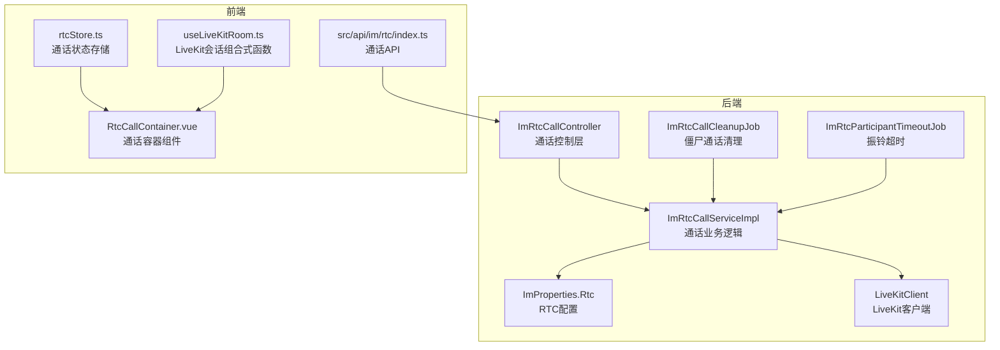
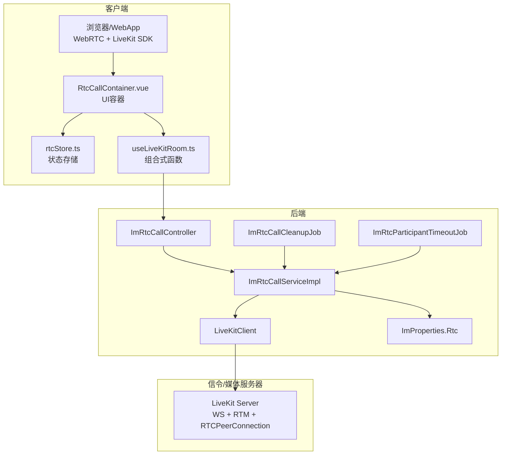
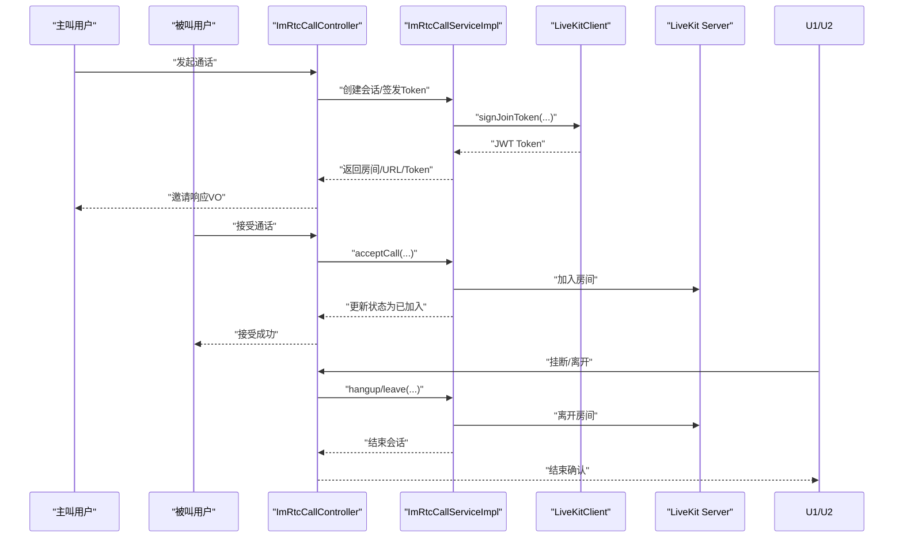
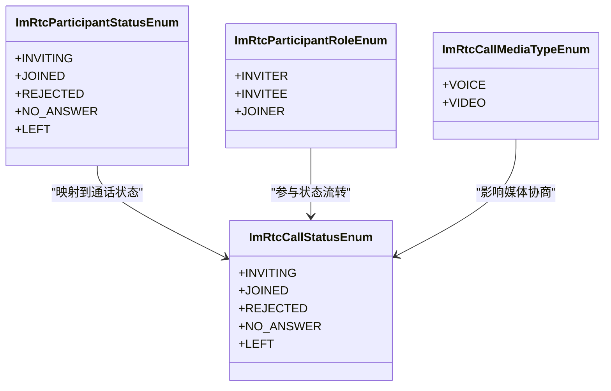
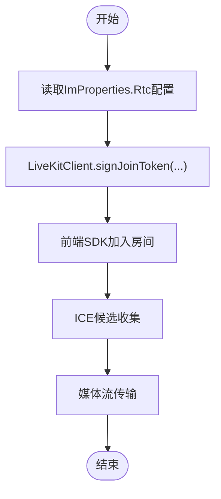
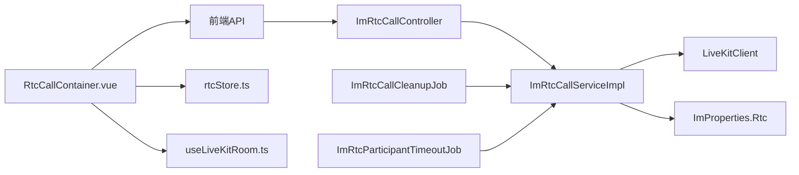

# 音视频通话系统

<cite>
**本文引用的文件**
- [ImRtcCallController.java](file://yudao-module-im/src/main/java/cn/iocoder/yudao/module/im/controller/admin/rtc/ImRtcCallController.java)
- [ImRtcCallServiceImpl.java](file://yudao-module-im/src/main/java/cn/iocoder/yudao/module/im/service/rtc/ImRtcCallServiceImpl.java)
- [ImRtcCallCleanupJob.java](file://yudao-module-im/src/main/java/cn/iocoder/yudao/module/im/job/rtc/ImRtcCallCleanupJob.java)
- [ImRtcParticipantTimeoutJob.java](file://yudao-module-im/src/main/java/cn/iocoder/yudao/module/im/job/rtc/ImRtcParticipantTimeoutJob.java)
- [LiveKitClient.java](file://yudao-module-im/src/main/java/cn/iocoder/yudao/module/im/framework/rtc/core/LiveKitClient.java)
- [ImProperties.java](file://yudao-module-im/src/main/java/cn/iocoder/yudao/module/im/framework/config/ImProperties.java)
- [ImRtcCallMediaTypeEnum.java](file://yudao-module-im/src/main/java/cn/iocoder/yudao/module/im/enums/rtc/ImRtcCallMediaTypeEnum.java)
- [ImRtcCallEndReasonEnum.java](file://yudao-module-im/src/main/java/cn/iocoder/yudao/module/im/enums/rtc/ImRtcCallEndReasonEnum.java)
- [ImRtcParticipantStatusEnum.java](file://yudao-module-im/src/main/java/cn/iocoder/yudao/module/im/enums/rtc/ImRtcParticipantStatusEnum.java)
- [ImRtcParticipantRoleEnum.java](file://yudao-module-im/src/main/java/cn/iocoder/yudao/module/im/enums/rtc/ImRtcParticipantRoleEnum.java)
- [ImMessageTypeEnum.java](file://yudao-module-im/src/main/java/cn/iocoder/yudao/module/im/enums/message/ImMessageTypeEnum.java)
- [ErrorCodeConstants.java](file://yudao-module-im/src/main/java/cn/iocoder/yudao/module/im/enums/ErrorCodeConstants.java)
- [index.ts（前端API）](file://yudao-ui/yudao-ui-admin-vue3/src/api/im/rtc/index.ts)
- [RtcCallContainer.vue](file://yudao-ui/yudao-ui-admin-vue3/src/views/im/home/components/rtc/RtcCallContainer.vue)
- [useLiveKitRoom.ts](file://yudao-ui/yudao-ui-admin-vue3/src/views/im/composables/useLiveKitRoom.ts)
- [rtcStore.ts](file://yudao-ui/yudao-ui-admin-vue3/src/views/im/store/rtcStore.ts)
</cite>

## 目录
1. [简介](#简介)
2. [项目结构](#项目结构)
3. [核心组件](#核心组件)
4. [架构总览](#架构总览)
5. [详细组件分析](#详细组件分析)
6. [依赖关系分析](#依赖关系分析)
7. [性能考虑](#性能考虑)
8. [故障排查指南](#故障排查指南)
9. [结论](#结论)
10. [附录](#附录)

## 简介
本文件面向即时通讯模块中的音视频通话系统，围绕WebRTC技术在本项目中的集成与配置展开，涵盖信令服务器（LiveKit）的对接、ICE候选收集与媒体协商流程、通话会话生命周期管理（发起、接听、挂断、超时）、通话状态实时同步与参与者角色管理、通话质量监控、API接口说明、P2P连接建立与媒体流传输实践、网络异常与重连机制、通话统计与质量分析等内容。文档以“后端服务 + 前端UI + 配置参数”的视角，帮助开发者快速理解并扩展系统能力。

## 项目结构
音视频通话系统主要分布在以下位置：
- 后端模块（Spring Boot）：yudao-module-im 下的控制器、服务、作业、枚举、配置与WebHook对接
- 前端模块（Vue3）：yudao-ui-admin-vue3 下的IM视图、API封装、组合式函数与状态管理

图表来源
- [ImRtcCallController.java:112-137](file://yudao-module-im/src/main/java/cn/iocoder/yudao/module/im/controller/admin/rtc/ImRtcCallController.java#L112-L137)
- [ImRtcCallServiceImpl.java:388-953](file://yudao-module-im/src/main/java/cn/iocoder/yudao/module/im/service/rtc/ImRtcCallServiceImpl.java#L388-L953)
- [ImRtcCallCleanupJob.java:1-41](file://yudao-module-im/src/main/java/cn/iocoder/yudao/module/im/job/rtc/ImRtcCallCleanupJob.java#L1-L41)
- [ImRtcParticipantTimeoutJob.java:1-41](file://yudao-module-im/src/main/java/cn/iocoder/yudao/module/im/job/rtc/ImRtcParticipantTimeoutJob.java#L1-L41)
- [LiveKitClient.java:45-75](file://yudao-module-im/src/main/java/cn/iocoder/yudao/module/im/framework/rtc/core/LiveKitClient.java#L45-L75)
- [ImProperties.java:149-195](file://yudao-module-im/src/main/java/cn/iocoder/yudao/module/im/framework/config/ImProperties.java#L149-L195)
- [index.ts（前端API）](file://yudao-ui/yudao-ui-admin-vue3/src/api/im/rtc/index.ts)
- [rtcStore.ts](file://yudao-ui/yudao-ui-admin-vue3/src/views/im/store/rtcStore.ts)
- [useLiveKitRoom.ts](file://yudao-ui/yudao-ui-admin-vue3/src/views/im/composables/useLiveKitRoom.ts)
- [RtcCallContainer.vue](file://yudao-ui/yudao-ui-admin-vue3/src/views/im/home/components/rtc/RtcCallContainer.vue)

章节来源
- [ImRtcCallController.java:112-137](file://yudao-module-im/src/main/java/cn/iocoder/yudao/module/im/controller/admin/rtc/ImRtcCallController.java#L112-L137)
- [ImRtcCallServiceImpl.java:388-953](file://yudao-module-im/src/main/java/cn/iocoder/yudao/module/im/service/rtc/ImRtcCallServiceImpl.java#L388-L953)
- [ImRtcCallCleanupJob.java:1-41](file://yudao-module-im/src/main/java/cn/iocoder/yudao/module/im/job/rtc/ImRtcCallCleanupJob.java#L1-L41)
- [ImRtcParticipantTimeoutJob.java:1-41](file://yudao-module-im/src/main/java/cn/iocoder/yudao/module/im/job/rtc/ImRtcParticipantTimeoutJob.java#L1-L41)
- [LiveKitClient.java:45-75](file://yudao-module-im/src/main/java/cn/iocoder/yudao/module/im/framework/rtc/core/LiveKitClient.java#L45-L75)
- [ImProperties.java:149-195](file://yudao-module-im/src/main/java/cn/iocoder/yudao/module/im/framework/config/ImProperties.java#L149-L195)
- [index.ts（前端API）](file://yudao-ui/yudao-ui-admin-vue3/src/api/im/rtc/index.ts)
- [rtcStore.ts](file://yudao-ui/yudao-ui-admin-vue3/src/views/im/store/rtcStore.ts)
- [useLiveKitRoom.ts](file://yudao-ui/yudao-ui-admin-vue3/src/views/im/composables/useLiveKitRoom.ts)
- [RtcCallContainer.vue](file://yudao-ui/yudao-ui-admin-vue3/src/views/im/home/components/rtc/RtcCallContainer.vue)

## 核心组件
- 后端控制层：负责接收前端请求，拼装响应VO，协调服务层完成通话生命周期管理
- 业务服务层：实现通话创建、参与者管理、状态变更、超时与清理、LiveKit交互等
- 作业调度：定时清理僵尸通话、处理振铃超时
- 配置中心：集中管理LiveKit地址、密钥、Token有效期、群组最大参与人数、超时阈值等
- 前端API与UI：封装通话相关HTTP接口，提供通话容器、状态存储与LiveKit会话组合式函数

章节来源
- [ImRtcCallController.java:112-137](file://yudao-module-im/src/main/java/cn/iocoder/yudao/module/im/controller/admin/rtc/ImRtcCallController.java#L112-L137)
- [ImRtcCallServiceImpl.java:388-953](file://yudao-module-im/src/main/java/cn/iocoder/yudao/module/im/service/rtc/ImRtcCallServiceImpl.java#L388-L953)
- [ImRtcCallCleanupJob.java:1-41](file://yudao-module-im/src/main/java/cn/iocoder/yudao/module/im/job/rtc/ImRtcCallCleanupJob.java#L1-L41)
- [ImRtcParticipantTimeoutJob.java:1-41](file://yudao-module-im/src/main/java/cn/iocoder/yudao/module/im/job/rtc/ImRtcParticipantTimeoutJob.java#L1-L41)
- [ImProperties.java:149-195](file://yudao-module-im/src/main/java/cn/iocoder/yudao/module/im/framework/config/ImProperties.java#L149-L195)
- [index.ts（前端API）](file://yudao-ui/yudao-ui-admin-vue3/src/api/im/rtc/index.ts)
- [rtcStore.ts](file://yudao-ui/yudao-ui-admin-vue3/src/views/im/store/rtcStore.ts)
- [useLiveKitRoom.ts](file://yudao-ui/yudao-ui-admin-vue3/src/views/im/composables/useLiveKitRoom.ts)
- [RtcCallContainer.vue](file://yudao-ui/yudao-ui-admin-vue3/src/views/im/home/components/rtc/RtcCallContainer.vue)

## 架构总览
系统采用“后端服务 + LiveKit信令/媒体服务器 + 前端WebRTC客户端”的三层架构。后端负责业务编排、状态持久化与超时清理；LiveKit负责信令转发与媒体转发；前端负责UI交互与WebRTC媒体流处理。

图表来源
- [ImRtcCallController.java:112-137](file://yudao-module-im/src/main/java/cn/iocoder/yudao/module/im/controller/admin/rtc/ImRtcCallController.java#L112-L137)
- [ImRtcCallServiceImpl.java:388-953](file://yudao-module-im/src/main/java/cn/iocoder/yudao/module/im/service/rtc/ImRtcCallServiceImpl.java#L388-L953)
- [LiveKitClient.java:45-75](file://yudao-module-im/src/main/java/cn/iocoder/yudao/module/im/framework/rtc/core/LiveKitClient.java#L45-L75)
- [ImProperties.java:149-195](file://yudao-module-im/src/main/java/cn/iocoder/yudao/module/im/framework/config/ImProperties.java#L149-L195)
- [ImRtcCallCleanupJob.java:1-41](file://yudao-module-im/src/main/java/cn/iocoder/yudao/module/im/job/rtc/ImRtcCallCleanupJob.java#L1-L41)
- [ImRtcParticipantTimeoutJob.java:1-41](file://yudao-module-im/src/main/java/cn/iocoder/yudao/module/im/job/rtc/ImRtcParticipantTimeoutJob.java#L1-L41)
- [RtcCallContainer.vue](file://yudao-ui/yudao-ui-admin-vue3/src/views/im/home/components/rtc/RtcCallContainer.vue)
- [rtcStore.ts](file://yudao-ui/yudao-ui-admin-vue3/src/views/im/store/rtcStore.ts)
- [useLiveKitRoom.ts](file://yudao-ui/yudao-ui-admin-vue3/src/views/im/composables/useLiveKitRoom.ts)

## 详细组件分析

### 通话会话生命周期管理
- 发起通话：后端校验会话状态与参与者，生成房间号与Token，向前端返回房间、URL与Token；前端使用LiveKit SDK加入房间
- 接听处理：被叫用户收到邀请后，前端调用后端接口接受通话，后端更新参与者状态为已加入
- 挂断清理：任意一方挂断或离开，后端更新状态并触发房间关闭判定；群聊在无人在房且无人响铃时关闭
- 超时处理：振铃超时Job将INVITING转为未应答；僵尸通话清理Job兜底LiveKit Webhook缺失或客户端异常场景

图表来源
- [ImRtcCallController.java:112-137](file://yudao-module-im/src/main/java/cn/iocoder/yudao/module/im/controller/admin/rtc/ImRtcCallController.java#L112-L137)
- [ImRtcCallServiceImpl.java:388-953](file://yudao-module-im/src/main/java/cn/iocoder/yudao/module/im/service/rtc/ImRtcCallServiceImpl.java#L388-L953)
- [LiveKitClient.java:45-75](file://yudao-module-im/src/main/java/cn/iocoder/yudao/module/im/framework/rtc/core/LiveKitClient.java#L45-L75)

章节来源
- [ImRtcCallServiceImpl.java:388-953](file://yudao-module-im/src/main/java/cn/iocoder/yudao/module/im/service/rtc/ImRtcCallServiceImpl.java#L388-L953)
- [ImRtcCallCleanupJob.java:1-41](file://yudao-module-im/src/main/java/cn/iocoder/yudao/module/im/job/rtc/ImRtcCallCleanupJob.java#L1-L41)
- [ImRtcParticipantTimeoutJob.java:1-41](file://yudao-module-im/src/main/java/cn/iocoder/yudao/module/im/job/rtc/ImRtcParticipantTimeoutJob.java#L1-L41)

### 通话状态与参与者角色
- 通话状态：INVITING（邀请中）、JOINED（已加入）、REJECTED（已拒绝）、NO_ANSWER（未应答）、LEFT（已离开）
- 参与者角色：INVITER（发起人）、INVITEE（被邀请者）、JOINER（群内主动加入者）
- 媒体类型：VOICE（仅音频）、VIDEO（音频+视频）

图表来源
- [ImRtcParticipantStatusEnum.java:1-63](file://yudao-module-im/src/main/java/cn/iocoder/yudao/module/im/enums/rtc/ImRtcParticipantStatusEnum.java#L1-L63)
- [ImRtcParticipantRoleEnum.java:1-38](file://yudao-module-im/src/main/java/cn/iocoder/yudao/module/im/enums/rtc/ImRtcParticipantRoleEnum.java#L1-L38)
- [ImRtcCallMediaTypeEnum.java:1-46](file://yudao-module-im/src/main/java/cn/iocoder/yudao/module/im/enums/rtc/ImRtcCallMediaTypeEnum.java#L1-L46)

章节来源
- [ImRtcParticipantStatusEnum.java:1-63](file://yudao-module-im/src/main/java/cn/iocoder/yudao/module/im/enums/rtc/ImRtcParticipantStatusEnum.java#L1-L63)
- [ImRtcParticipantRoleEnum.java:1-38](file://yudao-module-im/src/main/java/cn/iocoder/yudao/module/im/enums/rtc/ImRtcParticipantRoleEnum.java#L1-L38)
- [ImRtcCallMediaTypeEnum.java:1-46](file://yudao-module-im/src/main/java/cn/iocoder/yudao/module/im/enums/rtc/ImRtcCallMediaTypeEnum.java#L1-L46)

### 通话结束原因与错误码
- 结束原因：HANGUP（通话结束）、REJECT（已拒绝）、CANCEL（已取消）、NO_ANSWER（无人接听）、BUSY（对方正忙）、ERROR（通话异常）
- 错误码：包含通话未启用、会话不存在、对端忙碌、自忙、非参与者、不能呼叫自己、私聊必须指定对方、群聊必须指定群、发起繁忙、群组通话进行中、邀请人数超限、群聊必须选择被邀请人等

章节来源
- [ImRtcCallEndReasonEnum.java:1-41](file://yudao-module-im/src/main/java/cn/iocoder/yudao/module/im/enums/rtc/ImRtcCallEndReasonEnum.java#L1-L41)
- [ErrorCodeConstants.java:94-108](file://yudao-module-im/src/main/java/cn/iocoder/yudao/module/im/enums/ErrorCodeConstants.java#L94-L108)

### 信令与媒体协商（基于LiveKit）
- 信令服务器：通过ImProperties.Rtc配置LiveKit WS地址、API Key/Secret、Token有效期等
- Token签发：后端使用LiveKitClient按用户身份与房间签发短期Token
- 媒体协商：前端使用LiveKit SDK建立RTCPeerConnection，ICE候选收集与媒体流传输由LiveKit中继

图表来源
- [ImProperties.java:149-195](file://yudao-module-im/src/main/java/cn/iocoder/yudao/module/im/framework/config/ImProperties.java#L149-L195)
- [LiveKitClient.java:45-75](file://yudao-module-im/src/main/java/cn/iocoder/yudao/module/im/framework/rtc/core/LiveKitClient.java#L45-L75)

章节来源
- [ImProperties.java:149-195](file://yudao-module-im/src/main/java/cn/iocoder/yudao/module/im/framework/config/ImProperties.java#L149-L195)
- [LiveKitClient.java:45-75](file://yudao-module-im/src/main/java/cn/iocoder/yudao/module/im/framework/rtc/core/LiveKitClient.java#L45-L75)

### 前端通话管理与UI
- 前端API封装：提供发起、接受、挂断、刷新Token等接口
- 通话容器组件：承载UI状态与交互
- 组合式函数：封装LiveKit会话初始化、订阅状态变化
- 状态存储：集中管理当前通话房间、状态、媒体开关等

章节来源
- [index.ts（前端API）](file://yudao-ui/yudao-ui-admin-vue3/src/api/im/rtc/index.ts)
- [RtcCallContainer.vue](file://yudao-ui/yudao-ui-admin-vue3/src/views/im/home/components/rtc/RtcCallContainer.vue)
- [useLiveKitRoom.ts](file://yudao-ui/yudao-ui-admin-vue3/src/views/im/composables/useLiveKitRoom.ts)
- [rtcStore.ts](file://yudao-ui/yudao-ui-admin-vue3/src/views/im/store/rtcStore.ts)

## 依赖关系分析
- 控制器依赖服务层；服务层依赖LiveKitClient与配置；作业依赖服务层进行周期性清理与超时处理
- 前端通过API与控制器交互，通过组合式函数与LiveKit SDK交互，通过状态存储驱动UI

图表来源
- [ImRtcCallController.java:112-137](file://yudao-module-im/src/main/java/cn/iocoder/yudao/module/im/controller/admin/rtc/ImRtcCallController.java#L112-L137)
- [ImRtcCallServiceImpl.java:388-953](file://yudao-module-im/src/main/java/cn/iocoder/yudao/module/im/service/rtc/ImRtcCallServiceImpl.java#L388-L953)
- [LiveKitClient.java:45-75](file://yudao-module-im/src/main/java/cn/iocoder/yudao/module/im/framework/rtc/core/LiveKitClient.java#L45-L75)
- [ImProperties.java:149-195](file://yudao-module-im/src/main/java/cn/iocoder/yudao/module/im/framework/config/ImProperties.java#L149-L195)
- [ImRtcCallCleanupJob.java:1-41](file://yudao-module-im/src/main/java/cn/iocoder/yudao/module/im/job/rtc/ImRtcCallCleanupJob.java#L1-L41)
- [ImRtcParticipantTimeoutJob.java:1-41](file://yudao-module-im/src/main/java/cn/iocoder/yudao/module/im/job/rtc/ImRtcParticipantTimeoutJob.java#L1-L41)
- [index.ts（前端API）](file://yudao-ui/yudao-ui-admin-vue3/src/api/im/rtc/index.ts)
- [RtcCallContainer.vue](file://yudao-ui/yudao-ui-admin-vue3/src/views/im/home/components/rtc/RtcCallContainer.vue)
- [rtcStore.ts](file://yudao-ui/yudao-ui-admin-vue3/src/views/im/store/rtcStore.ts)
- [useLiveKitRoom.ts](file://yudao-ui/yudao-ui-admin-vue3/src/views/im/composables/useLiveKitRoom.ts)

章节来源
- [ImRtcCallController.java:112-137](file://yudao-module-im/src/main/java/cn/iocoder/yudao/module/im/controller/admin/rtc/ImRtcCallController.java#L112-L137)
- [ImRtcCallServiceImpl.java:388-953](file://yudao-module-im/src/main/java/cn/iocoder/yudao/module/im/service/rtc/ImRtcCallServiceImpl.java#L388-L953)
- [LiveKitClient.java:45-75](file://yudao-module-im/src/main/java/cn/iocoder/yudao/module/im/framework/rtc/core/LiveKitClient.java#L45-L75)
- [ImProperties.java:149-195](file://yudao-module-im/src/main/java/cn/iocoder/yudao/module/im/framework/config/ImProperties.java#L149-L195)
- [ImRtcCallCleanupJob.java:1-41](file://yudao-module-im/src/main/java/cn/iocoder/yudao/module/im/job/rtc/ImRtcCallCleanupJob.java#L1-L41)
- [ImRtcParticipantTimeoutJob.java:1-41](file://yudao-module-im/src/main/java/cn/iocoder/yudao/module/im/job/rtc/ImRtcParticipantTimeoutJob.java#L1-L41)
- [index.ts（前端API）](file://yudao-ui/yudao-ui-admin-vue3/src/api/im/rtc/index.ts)
- [RtcCallContainer.vue](file://yudao-ui/yudao-ui-admin-vue3/src/views/im/home/components/rtc/RtcCallContainer.vue)
- [rtcStore.ts](file://yudao-ui/yudao-ui-admin-vue3/src/views/im/store/rtcStore.ts)
- [useLiveKitRoom.ts](file://yudao-ui/yudao-ui-admin-vue3/src/views/im/composables/useLiveKitRoom.ts)

## 性能考虑
- Token有效期：通过配置项控制，建议结合业务场景权衡安全性与频繁刷新带来的开销
- 群组最大参与人数：限制房间并发，避免LiveKit压力过大
- 超时阈值：振铃超时与僵尸通话清理阈值需平衡用户体验与资源占用
- 网络抖动防护：LiveKit Server API调用设置超时上限，避免阻塞业务线程

章节来源
- [ImProperties.java:149-195](file://yudao-module-im/src/main/java/cn/iocoder/yudao/module/im/framework/config/ImProperties.java#L149-L195)
- [LiveKitClient.java:45-75](file://yudao-module-im/src/main/java/cn/iocoder/yudao/module/im/framework/rtc/core/LiveKitClient.java#L45-L75)

## 故障排查指南
- 通话未启用：检查配置项是否启用RTC功能
- 会话不存在：确认房间号正确且会话未结束
- 对方正忙：私聊场景下对方已在其他通话中
- 非参与者：调用接口时需确保用户在该通话中
- 无法加入房间：核对Token是否过期、LiveKit地址与密钥配置是否正确
- 僵尸通话：检查清理作业是否正常执行
- 振铃超时：确认超时阈值配置与作业调度

章节来源
- [ErrorCodeConstants.java:94-108](file://yudao-module-im/src/main/java/cn/iocoder/yudao/module/im/enums/ErrorCodeConstants.java#L94-L108)
- [ImRtcCallCleanupJob.java:1-41](file://yudao-module-im/src/main/java/cn/iocoder/yudao/module/im/job/rtc/ImRtcCallCleanupJob.java#L1-L41)
- [ImRtcParticipantTimeoutJob.java:1-41](file://yudao-module-im/src/main/java/cn/iocoder/yudao/module/im/job/rtc/ImRtcParticipantTimeoutJob.java#L1-L41)

## 结论
本系统通过后端服务编排、LiveKit信令/媒体中继与前端WebRTC SDK的协同，实现了完整的音视频通话能力。通过明确的状态机、完善的超时与清理机制、清晰的API与UI交互，系统具备良好的可维护性与扩展性。后续可在媒体质量监控、网络异常重连策略、统计分析等方面进一步增强。

## 附录

### 通话管理API（后端接口定义）
- 发起通话
  - 方法与路径：POST /admin-api/im/rtc/call/create
  - 请求体字段：conversationType（会话类型）、mediaType（媒体类型）、groupId（群组ID，群聊必填）、inviteeIds（被邀请人列表，私聊必填）
  - 返回字段：room（房间号）、livekitUrl（LiveKit地址）、token（短期Token）、status（会话状态）、inviteeIds（邀请中用户列表）、joinedUserIds（已加入用户列表）
- 接受通话
  - 方法与路径：POST /admin-api/im/rtc/call/accept
  - 请求体字段：userId（用户ID）、room（房间号）
  - 返回字段：与发起通话一致，但状态更新为已加入
- 挂断/离开
  - 方法与路径：POST /admin-api/im/rtc/call/hangup 或 /admin-api/im/rtc/call/leave
  - 请求体字段：userId（用户ID）、room（房间号）
  - 返回字段：结束原因与状态
- 刷新Token
  - 方法与路径：GET /admin-api/im/rtc/call/refresh-token
  - 查询参数：userId（用户ID）、room（房间号）
  - 返回字段：新的token（若会话未结束）

章节来源
- [ImRtcCallController.java:112-137](file://yudao-module-im/src/main/java/cn/iocoder/yudao/module/im/controller/admin/rtc/ImRtcCallController.java#L112-L137)
- [ImMessageTypeEnum.java:92-114](file://yudao-module-im/src/main/java/cn/iocoder/yudao/module/im/enums/message/ImMessageTypeEnum.java#L92-L114)

### 通话统计与质量分析
- 通话时长统计：会话结束时间与开始时间差可用于计算通话时长
- 网络质量评估：可通过LiveKit提供的指标与前端采集的媒体统计（如丢包率、延迟、帧率）进行综合评估
- 建议：在前端组合式函数中增加媒体统计上报，在后端作业中定期汇总并输出报表

章节来源
- [ImRtcCallServiceImpl.java:933-953](file://yudao-module-im/src/main/java/cn/iocoder/yudao/module/im/service/rtc/ImRtcCallServiceImpl.java#L933-L953)