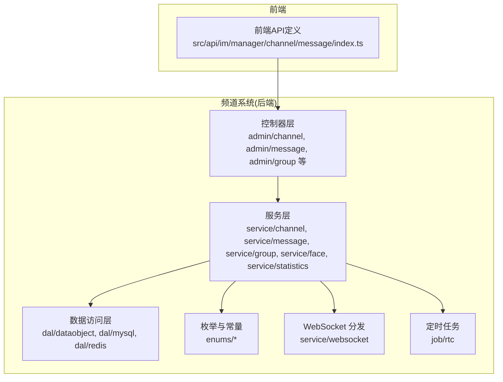
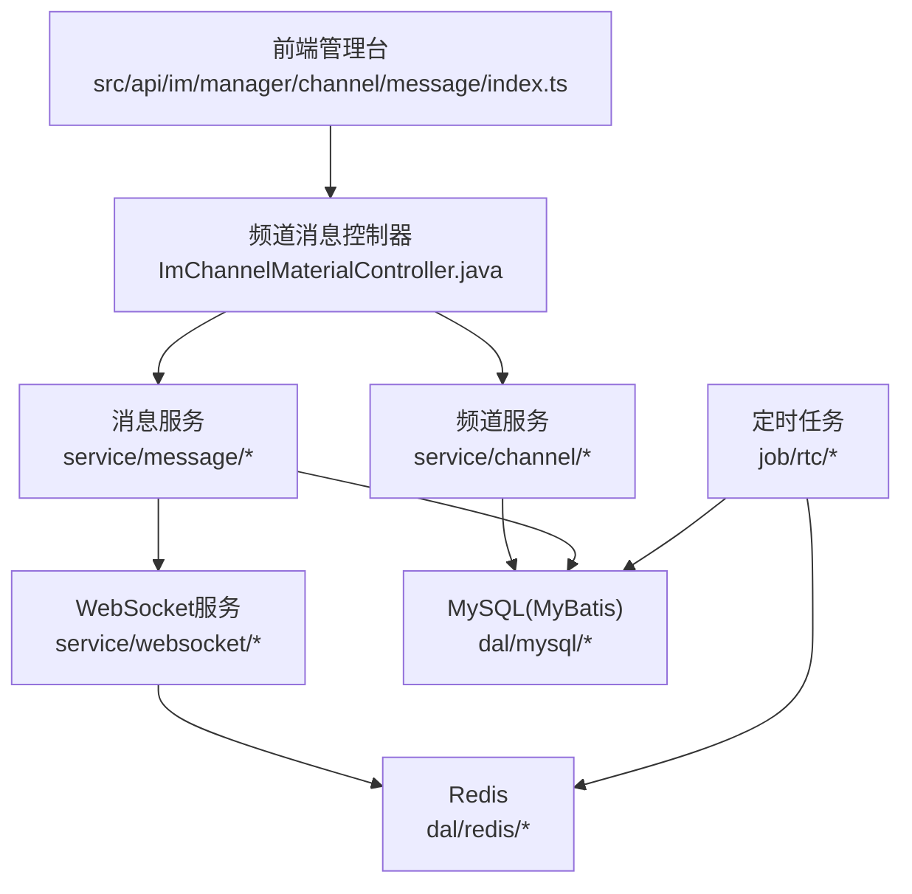
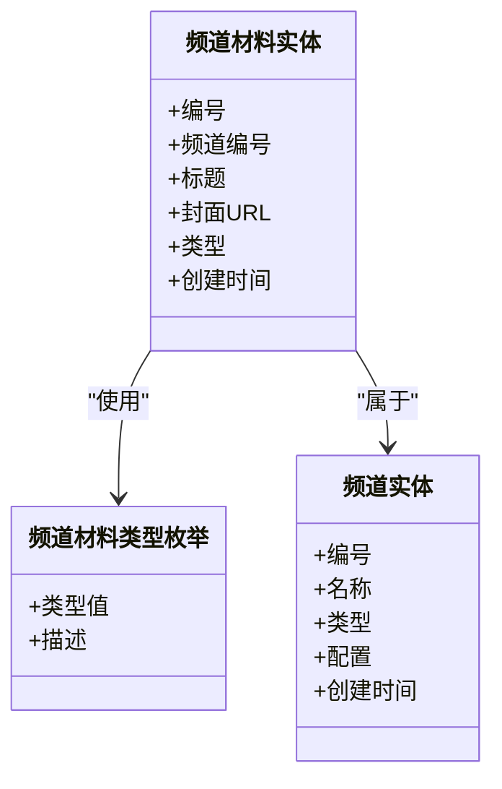
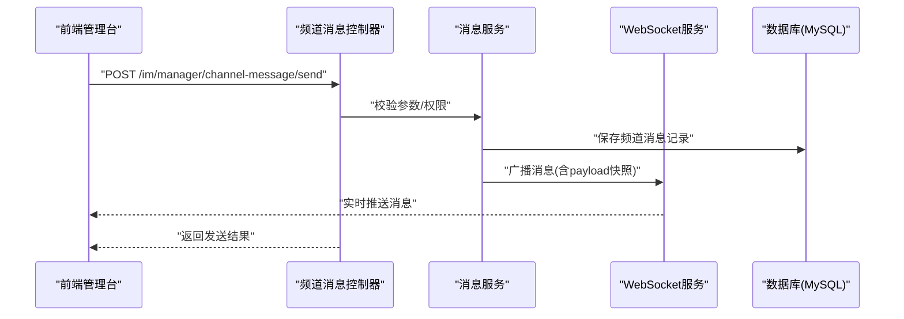
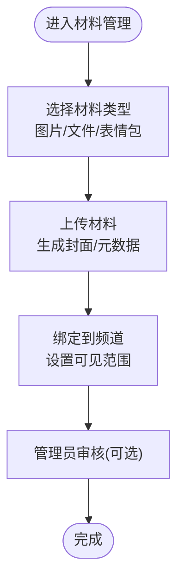
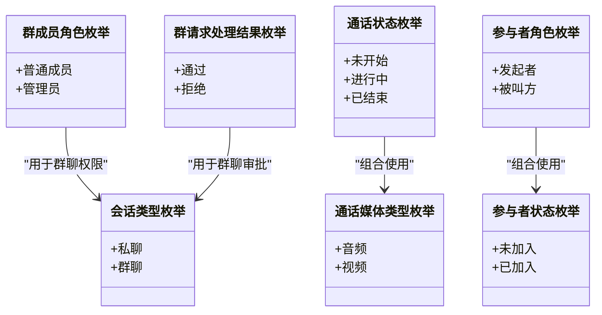
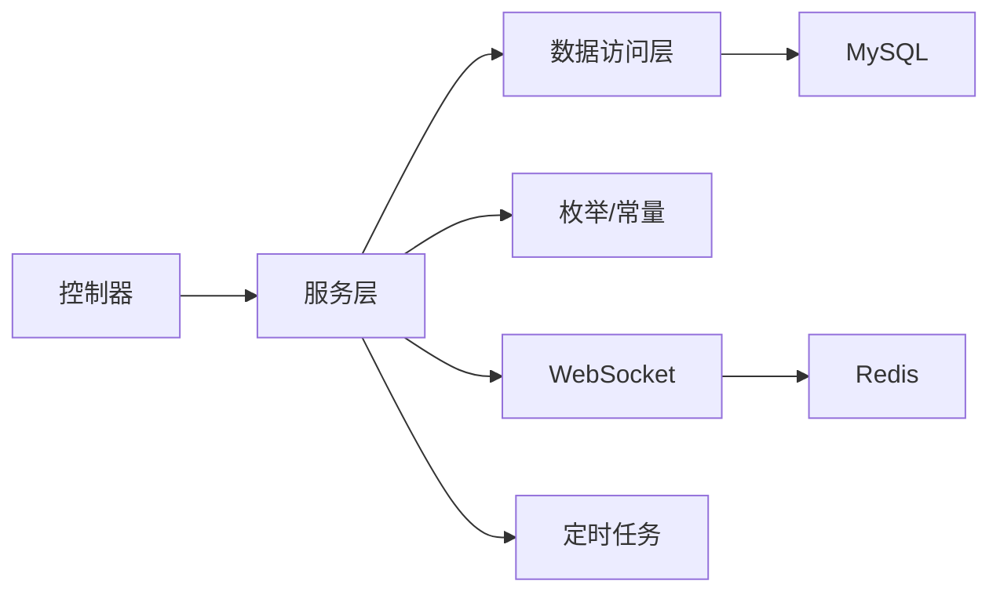

# 频道系统

<cite>
**本文引用的文件**
- [ImChannelMaterialController.java](file://yudao-module-im/src/main/java/cn/iocoder/yudao/module/im/controller/admin/channel/ImChannelMaterialController.java)
- [ImChannelMaterialTypeEnum.java](file://yudao-module-im/src/main/java/cn/iocoder/yudao/module/im/enums/channel/ImChannelMaterialTypeEnum.java)
- [ImChannelMessageDO.java](file://yudao-module-im/src/main/java/cn/iocoder/yudao/module/im/dal/dataobject/message/ImChannelMessageDO.java)
- [ImChannelDO.java](file://yudao-module-im/src/main/java/cn/iocoder/yudao/module/im/dal/dataobject/channel/ImChannelDO.java)
- [ImChannelMaterialDO.java](file://yudao-module-im/src/main/java/cn/iocoder/yudao/module/im/dal/dataobject/channel/ImChannelMaterialDO.java)
- [ImMessageTypeEnum.java](file://yudao-module-im/src/main/java/cn/iocoder/yudao/module/im/enums/message/ImMessageTypeEnum.java)
- [ImMessageStatusEnum.java](file://yudao-module-im/src/main/java/cn/iocoder/yudao/module/im/enums/message/ImMessageStatusEnum.java)
- [index.ts](file://yudao-ui/yudao-ui-admin-vue3/src/api/im/manager/channel/message/index.ts)
- [ImManagerChannelMessageSendReqVO 类型定义](file://yudao-ui/yudao-ui-admin-vue3/src/api/im/manager/channel/message/index.ts)
- [ImManagerChannelMessageVO 类型定义](file://yudao-ui/yudao-ui-admin-vue3/src/api/im/manager/channel/message/index.ts)
- [sendManagerChannelMessage 方法](file://yudao-ui/yudao-ui-admin-vue3/src/api/im/manager/channel/message/index.ts)
- [deleteManagerChannelMessage 方法](file://yudao-ui/yudao-ui-admin-vue3/src/api/im/manager/channel/message/index.ts)
- [getManagerChannelMessagePage 方法](file://yudao-ui/yudao-ui-admin-vue3/src/api/im/manager/channel/message/index.ts)
- [ImGroupMessageReceiptStatusEnum.java](file://yudao-module-im/src/main/java/cn/iocoder/yudao/module/im/enums/message/ImGroupMessageReceiptStatusEnum.java)
- [ImMessageUtils.java](file://yudao-module-im/src/main/java/cn/iocoder/yudao/module/im/util/ImMessageUtils.java)
- [ImCommonConstants.java](file://yudao-module-im/src/main/java/cn/iocoder/yudao/module/im/enums/ImCommonConstants.java)
- [ImConversationTypeEnum.java](file://yudao-module-im/src/main/java/cn/iocoder/yudao/module/im/enums/ImConversationTypeEnum.java)
- [ImGroupMemberRoleEnum.java](file://yudao-module-im/src/main/java/cn/iocoder/yudao/module/im/enums/group/ImGroupMemberRoleEnum.java)
- [ImGroupRequestHandleResultEnum.java](file://yudao-module-im/src/main/java/cn/iocoder/yudao/module/im/enums/group/ImGroupRequestHandleResultEnum.java)
- [ImRtcCallStatusEnum.java](file://yudao-module-im/src/main/java/cn/iocoder/yudao/module/im/enums/rtc/ImRtcCallStatusEnum.java)
- [ImRtcCallMediaTypeEnum.java](file://yudao-module-im/src/main/java/cn/iocoder/yudao/module/im/enums/rtc/ImRtcCallMediaTypeEnum.java)
- [ImRtcCallEndReasonEnum.java](file://yudao-module-im/src/main/java/cn/iocoder/yudao/module/im/enums/rtc/ImRtcCallEndReasonEnum.java)
- [ImRtcParticipantRoleEnum.java](file://yudao-module-im/src/main/java/cn/iocoder/yudao/module/im/enums/rtc/ImRtcParticipantRoleEnum.java)
- [ImRtcParticipantStatusEnum.java](file://yudao-module-im/src/main/java/cn/iocoder/yudao/module/im/enums/rtc/ImRtcParticipantStatusEnum.java)
- [ImSensitiveWordDO.java](file://yudao-module-im/src/main/java/cn/iocoder/yudao/module/im/dal/dataobject/sensitiveword/ImSensitiveWordDO.java)
- [ImRtcCallCleanupJob.java](file://yudao-module-im/src/main/java/cn/iocoder/yudao/module/im/job/rtc/ImRtcCallCleanupJob.java)
- [ImRtcParticipantTimeoutJob.java](file://yudao-module-im/src/main/java/cn/iocoder/yudao/module/im/job/rtc/ImRtcParticipantTimeoutJob.java)
- [ImProperties.java](file://yudao-module-im/src/main/java/cn/iocoder/yudao/module/im/framework/config/ImProperties.java)
- [RedisKeyConstants.java](file://yudao-module-im/src/main/java/cn/iocoder/yudao/module/im/dal/redis/RedisKeyConstants.java)
- [statistics](file://yudao-module-im/src/main/java/cn/iocoder/yudao/module/im/service/statistics/)
- [message](file://yudao-module-im/src/main/java/cn/iocoder/yudao/module/im/service/message/)
- [channel](file://yudao-module-im/src/main/java/cn/iocoder/yudao/module/im/service/channel/)
- [group](file://yudao-module-im/src/main/java/cn/iocoder/yudao/module/im/service/group/)
- [face](file://yudao-module-im/src/main/java/cn/iocoder/yudao/module/im/service/face/)
- [websocket](file://yudao-module-im/src/main/java/cn/iocoder/yudao/module/im/service/websocket/)
- [sensitiveword](file://yudao-module-im/src/main/java/cn/iocoder/yudao/module/im/service/sensitiveword/)
</cite>

## 目录
1. [引言](#引言)
2. [项目结构](#项目结构)
3. [核心组件](#核心组件)
4. [架构总览](#架构总览)
5. [详细组件分析](#详细组件分析)
6. [依赖关系分析](#依赖关系分析)
7. [性能考虑](#性能考虑)
8. [故障排查指南](#故障排查指南)
9. [结论](#结论)
10. [附录](#附录)

## 引言
本指南面向即时通讯模块中的“频道系统”，目标是帮助开发者从零开始构建并维护一个完整的频道体系，涵盖频道分类与类型管理、频道消息的发送/接收/存储策略、频道材料（表情包、图片、文件等）的管理与检索、频道管理API的接口规范、权限控制与消息分发机制、安全检查（敏感词过滤）、以及频道统计数据的采集与分析。文档以仓库现有代码为依据，结合前端API定义，给出可落地的实现建议与最佳实践。

## 项目结构
频道系统位于 yudao-module-im 模块中，采用按领域分层的组织方式：
- 控制器层：对外暴露管理端与应用端接口，如频道材料控制器、消息控制器等
- 服务层：封装业务逻辑，如频道、消息、群组、表情包、统计等子域服务
- 数据访问层：MyBatis 映射与实体对象，如频道、频道消息、频道材料等
- 枚举与常量：统一管理消息类型、状态、频道材料类型等
- Websocket：消息分发与在线状态管理
- Job：定时清理通话会话等后台任务
- 前端API：定义频道消息管理相关的HTTP接口契约

图示来源
- [ImChannelMaterialController.java:1-50](file://yudao-module-im/src/main/java/cn/iocoder/yudao/module/im/controller/admin/channel/ImChannelMaterialController.java#L1-L50)
- [ImChannelMessageDO.java:1-120](file://yudao-module-im/src/main/java/cn/iocoder/yudao/module/im/dal/dataobject/message/ImChannelMessageDO.java#L1-L120)
- [ImChannelDO.java:1-120](file://yudao-module-im/src/main/java/cn/iocoder/yudao/module/im/dal/dataobject/channel/ImChannelDO.java#L1-L120)
- [ImChannelMaterialDO.java:1-120](file://yudao-module-im/src/main/java/cn/iocoder/yudao/module/im/dal/dataobject/channel/ImChannelMaterialDO.java#L1-L120)
- [ImMessageTypeEnum.java:1-120](file://yudao-module-im/src/main/java/cn/iocoder/yudao/module/im/enums/message/ImMessageTypeEnum.java#L1-L120)
- [ImMessageStatusEnum.java:1-120](file://yudao-module-im/src/main/java/cn/iocoder/yudao/module/im/enums/message/ImMessageStatusEnum.java#L1-L120)
- [index.ts:1-34](file://yudao-ui/yudao-ui-admin-vue3/src/api/im/manager/channel/message/index.ts#L1-L34)

章节来源
- [ImChannelMaterialController.java:1-50](file://yudao-module-im/src/main/java/cn/iocoder/yudao/module/im/controller/admin/channel/ImChannelMaterialController.java#L1-L50)
- [ImChannelMessageDO.java:1-120](file://yudao-module-im/src/main/java/cn/iocoder/yudao/module/im/dal/dataobject/message/ImChannelMessageDO.java#L1-L120)
- [ImChannelDO.java:1-120](file://yudao-module-im/src/main/java/cn/iocoder/yudao/module/im/dal/dataobject/channel/ImChannelDO.java#L1-L120)
- [ImChannelMaterialDO.java:1-120](file://yudao-module-im/src/main/java/cn/iocoder/yudao/module/im/dal/dataobject/channel/ImChannelMaterialDO.java#L1-L120)
- [ImMessageTypeEnum.java:1-120](file://yudao-module-im/src/main/java/cn/iocoder/yudao/module/im/enums/message/ImMessageTypeEnum.java#L1-L120)
- [ImMessageStatusEnum.java:1-120](file://yudao-module-im/src/main/java/cn/iocoder/yudao/module/im/enums/message/ImMessageStatusEnum.java#L1-L120)
- [index.ts:1-34](file://yudao-ui/yudao-ui-admin-vue3/src/api/im/manager/channel/message/index.ts#L1-L34)

## 核心组件
- 频道材料类型枚举：用于标识频道材料的类型（例如图片、文件、表情包等），便于分类与检索
- 频道消息模型：记录频道消息的字段，包括频道编号、关联素材编号、消息类型、内容快照、接收人列表、发送时间等
- 频道与材料实体：描述频道与频道材料的数据结构，支撑材料上传、分类与绑定
- 消息类型与状态枚举：统一消息类型与状态，便于前后端约定与扩展
- 前端频道消息管理API：定义了发送、删除、分页查询等接口契约

章节来源
- [ImChannelMaterialTypeEnum.java:1-120](file://yudao-module-im/src/main/java/cn/iocoder/yudao/module/im/enums/channel/ImChannelMaterialTypeEnum.java#L1-L120)
- [ImChannelMessageDO.java:37-74](file://yudao-module-im/src/main/java/cn/iocoder/yudao/module/im/dal/dataobject/message/ImChannelMessageDO.java#L37-L74)
- [ImChannelDO.java:1-120](file://yudao-module-im/src/main/java/cn/iocoder/yudao/module/im/dal/dataobject/channel/ImChannelDO.java#L1-L120)
- [ImChannelMaterialDO.java:1-120](file://yudao-module-im/src/main/java/cn/iocoder/yudao/module/im/dal/dataobject/channel/ImChannelMaterialDO.java#L1-L120)
- [ImMessageTypeEnum.java:1-120](file://yudao-module-im/src/main/java/cn/iocoder/yudao/module/im/enums/message/ImMessageTypeEnum.java#L1-L120)
- [ImMessageStatusEnum.java:1-120](file://yudao-module-im/src/main/java/cn/iocoder/yudao/module/im/enums/message/ImMessageStatusEnum.java#L1-L120)
- [index.ts:1-34](file://yudao-ui/yudao-ui-admin-vue3/src/api/im/manager/channel/message/index.ts#L1-L34)

## 架构总览
频道系统采用“控制器-服务-数据访问-枚举”的分层架构，消息通过WebSocket进行实时分发，定时任务负责清理无效会话，Redis用于缓存与键空间管理，MySQL承载持久化数据。

图示来源
- [ImChannelMaterialController.java:1-50](file://yudao-module-im/src/main/java/cn/iocoder/yudao/module/im/controller/admin/channel/ImChannelMaterialController.java#L1-L50)
- [index.ts:1-34](file://yudao-ui/yudao-ui-admin-vue3/src/api/im/manager/channel/message/index.ts#L1-L34)
- [ImRtcCallCleanupJob.java:1-120](file://yudao-module-im/src/main/java/cn/iocoder/yudao/module/im/job/rtc/ImRtcCallCleanupJob.java#L1-L120)
- [ImRtcParticipantTimeoutJob.java:1-120](file://yudao-module-im/src/main/java/cn/iocoder/yudao/module/im/job/rtc/ImRtcParticipantTimeoutJob.java#L1-L120)
- [RedisKeyConstants.java:1-120](file://yudao-module-im/src/main/java/cn/iocoder/yudao/module/im/dal/redis/RedisKeyConstants.java#L1-L120)

## 详细组件分析

### 频道材料类型与分类
- 材料类型枚举：用于区分频道材料的种类，便于前端展示与后端处理
- 频道材料实体：包含材料标题、封面、类型、关联频道等字段，支持按频道聚合与检索
- 频道实体：包含频道名称、类型、配置等，支撑频道维度的材料管理

图示来源
- [ImChannelMaterialTypeEnum.java:1-120](file://yudao-module-im/src/main/java/cn/iocoder/yudao/module/im/enums/channel/ImChannelMaterialTypeEnum.java#L1-L120)
- [ImChannelMaterialDO.java:1-120](file://yudao-module-im/src/main/java/cn/iocoder/yudao/module/im/dal/dataobject/channel/ImChannelMaterialDO.java#L1-L120)
- [ImChannelDO.java:1-120](file://yudao-module-im/src/main/java/cn/iocoder/yudao/module/im/dal/dataobject/channel/ImChannelDO.java#L1-L120)

章节来源
- [ImChannelMaterialTypeEnum.java:1-120](file://yudao-module-im/src/main/java/cn/iocoder/yudao/module/im/enums/channel/ImChannelMaterialTypeEnum.java#L1-L120)
- [ImChannelMaterialDO.java:1-120](file://yudao-module-im/src/main/java/cn/iocoder/yudao/module/im/dal/dataobject/channel/ImChannelMaterialDO.java#L1-L120)
- [ImChannelDO.java:1-120](file://yudao-module-im/src/main/java/cn/iocoder/yudao/module/im/dal/dataobject/channel/ImChannelDO.java#L1-L120)

### 频道消息处理机制
- 消息模型：包含频道编号、关联素材编号、消息类型、内容快照、接收人列表、发送时间等
- 消息类型与状态：统一消息类型与状态枚举，便于扩展与一致性
- 发送流程：前端调用发送接口，后端落库并触发WebSocket分发
- 接收与存储：消息入库后，可通过分页接口查询；接收人列表为空时表示全员推送
- 已读回执：群聊消息支持已读回执状态枚举，便于统计与展示

图示来源
- [index.ts:21-24](file://yudao-ui/yudao-ui-admin-vue3/src/api/im/manager/channel/message/index.ts#L21-L24)
- [ImChannelMessageDO.java:37-74](file://yudao-module-im/src/main/java/cn/iocoder/yudao/module/im/dal/dataobject/message/ImChannelMessageDO.java#L37-L74)
- [ImMessageTypeEnum.java:1-120](file://yudao-module-im/src/main/java/cn/iocoder/yudao/module/im/enums/message/ImMessageTypeEnum.java#L1-L120)
- [ImMessageStatusEnum.java:1-120](file://yudao-module-im/src/main/java/cn/iocoder/yudao/module/im/enums/message/ImMessageStatusEnum.java#L1-L120)
- [ImGroupMessageReceiptStatusEnum.java:1-120](file://yudao-module-im/src/main/java/cn/iocoder/yudao/module/im/enums/message/ImGroupMessageReceiptStatusEnum.java#L1-L120)

章节来源
- [index.ts:1-34](file://yudao-ui/yudao-ui-admin-vue3/src/api/im/manager/channel/message/index.ts#L1-L34)
- [ImChannelMessageDO.java:37-74](file://yudao-module-im/src/main/java/cn/iocoder/yudao/module/im/dal/dataobject/message/ImChannelMessageDO.java#L37-L74)
- [ImMessageTypeEnum.java:1-120](file://yudao-module-im/src/main/java/cn/iocoder/yudao/module/im/enums/message/ImMessageTypeEnum.java#L1-L120)
- [ImMessageStatusEnum.java:1-120](file://yudao-module-im/src/main/java/cn/iocoder/yudao/module/im/enums/message/ImMessageStatusEnum.java#L1-L120)
- [ImGroupMessageReceiptStatusEnum.java:1-120](file://yudao-module-im/src/main/java/cn/iocoder/yudao/module/im/enums/message/ImGroupMessageReceiptStatusEnum.java#L1-L120)

### 频道材料管理（表情包、图片、文件）
- 表情包管理：表情包与用户表情项的管理，支持表情包的创建、表情项的增删改查
- 图片与文件：作为频道材料的一种，具备标题、封面、类型等属性，支持按频道检索
- 权限与可见性：结合用户角色与频道成员身份，控制材料的可见范围

图示来源
- [ImChannelMaterialTypeEnum.java:1-120](file://yudao-module-im/src/main/java/cn/iocoder/yudao/module/im/enums/channel/ImChannelMaterialTypeEnum.java#L1-L120)
- [ImFacePackController.java:1-120](file://yudao-module-im/src/main/java/cn/iocoder/yudao/module/im/controller/admin/face/ImFacePackController.java#L1-L120)
- [ImFaceUserItemController.java:1-120](file://yudao-module-im/src/main/java/cn/iocoder/yudao/module/im/controller/admin/face/ImFaceUserItemController.java#L1-L120)

章节来源
- [ImChannelMaterialTypeEnum.java:1-120](file://yudao-module-im/src/main/java/cn/iocoder/yudao/module/im/enums/channel/ImChannelMaterialTypeEnum.java#L1-L120)
- [ImFacePackController.java:1-120](file://yudao-module-im/src/main/java/cn/iocoder/yudao/module/im/controller/admin/face/ImFacePackController.java#L1-L120)
- [ImFaceUserItemController.java:1-120](file://yudao-module-im/src/main/java/cn/iocoder/yudao/module/im/controller/admin/face/ImFaceUserItemController.java#L1-L120)

### 频道管理API接口文档
以下为频道消息管理相关接口的定义与说明（基于前端API定义）：

- 发送频道消息
  - 方法：POST
  - 路径：/im/manager/channel-message/send
  - 请求体：ImManagerChannelMessageSendReqVO
    - materialId: 材料编号
    - receiverUserIds?: 接收人ID列表（为空表示全员）
  - 返回：发送结果

- 删除频道消息
  - 方法：DELETE
  - 路径：/im/manager/channel-message/delete
  - 查询参数：id
  - 返回：删除结果

- 获取频道消息分页
  - 方法：GET
  - 路径：/im/manager/channel-message/page
  - 查询参数：分页参数
  - 返回：分页结果（包含 ImManagerChannelMessageVO 列表）

- 数据模型
  - ImManagerChannelMessageVO
    - id: 消息编号
    - channelId: 频道编号
    - channelName?: 频道名称
    - materialId: 材料编号
    - materialTitle?: 材料标题
    - materialCoverUrl?: 材料封面URL
    - type: 消息类型
    - content?: 内容快照
    - receiverUserIds?: 接收人ID列表
    - sendTime?: 发送时间

章节来源
- [index.ts:1-34](file://yudao-ui/yudao-ui-admin-vue3/src/api/im/manager/channel/message/index.ts#L1-L34)
- [ImManagerChannelMessageSendReqVO 类型定义:16-19](file://yudao-ui/yudao-ui-admin-vue3/src/api/im/manager/channel/message/index.ts#L16-L19)
- [ImManagerChannelMessageVO 类型定义:3-14](file://yudao-ui/yudao-ui-admin-vue3/src/api/im/manager/channel/message/index.ts#L3-L14)

### 权限控制与消息分发
- 会话类型：区分私聊与群聊，群聊支持成员角色（如管理员、普通成员）
- 成员角色与请求处理：群成员角色枚举与请求处理结果枚举，用于权限判定与流程控制
- 消息分发：通过WebSocket服务向在线用户广播消息，结合Redis键空间管理在线状态
- 通话场景：音视频通话的状态、媒体类型、参与者角色与状态，支持定时清理与超时处理

图示来源
- [ImConversationTypeEnum.java:1-120](file://yudao-module-im/src/main/java/cn/iocoder/yudao/module/im/enums/ImConversationTypeEnum.java#L1-L120)
- [ImGroupMemberRoleEnum.java:1-120](file://yudao-module-im/src/main/java/cn/iocoder/yudao/module/im/enums/group/ImGroupMemberRoleEnum.java#L1-L120)
- [ImGroupRequestHandleResultEnum.java:1-120](file://yudao-module-im/src/main/java/cn/iocoder/yudao/module/im/enums/group/ImGroupRequestHandleResultEnum.java#L1-L120)
- [ImRtcCallStatusEnum.java:1-120](file://yudao-module-im/src/main/java/cn/iocoder/yudao/module/im/enums/rtc/ImRtcCallStatusEnum.java#L1-L120)
- [ImRtcCallMediaTypeEnum.java:1-120](file://yudao-module-im/src/main/java/cn/iocoder/yudao/module/im/enums/rtc/ImRtcCallMediaTypeEnum.java#L1-L120)
- [ImRtcParticipantRoleEnum.java:1-120](file://yudao-module-im/src/main/java/cn/iocoder/yudao/module/im/enums/rtc/ImRtcParticipantRoleEnum.java#L1-L120)
- [ImRtcParticipantStatusEnum.java:1-120](file://yudao-module-im/src/main/java/cn/iocoder/yudao/module/im/enums/rtc/ImRtcParticipantStatusEnum.java#L1-L120)

章节来源
- [ImConversationTypeEnum.java:1-120](file://yudao-module-im/src/main/java/cn/iocoder/yudao/module/im/enums/ImConversationTypeEnum.java#L1-L120)
- [ImGroupMemberRoleEnum.java:1-120](file://yudao-module-im/src/main/java/cn/iocoder/yudao/module/im/enums/group/ImGroupMemberRoleEnum.java#L1-L120)
- [ImGroupRequestHandleResultEnum.java:1-120](file://yudao-module-im/src/main/java/cn/iocoder/yudao/module/im/enums/group/ImGroupRequestHandleResultEnum.java#L1-L120)
- [ImRtcCallStatusEnum.java:1-120](file://yudao-module-im/src/main/java/cn/iocoder/yudao/module/im/enums/rtc/ImRtcCallStatusEnum.java#L1-L120)
- [ImRtcCallMediaTypeEnum.java:1-120](file://yudao-module-im/src/main/java/cn/iocoder/yudao/module/im/enums/rtc/ImRtcCallMediaTypeEnum.java#L1-L120)
- [ImRtcParticipantRoleEnum.java:1-120](file://yudao-module-im/src/main/java/cn/iocoder/yudao/module/im/enums/rtc/ImRtcParticipantRoleEnum.java#L1-L120)
- [ImRtcParticipantStatusEnum.java:1-120](file://yudao-module-im/src/main/java/cn/iocoder/yudao/module/im/enums/rtc/ImRtcParticipantStatusEnum.java#L1-L120)

### 安全检查与敏感词过滤
- 敏感词实体：用于维护敏感词库，支持批量导入与更新
- 过滤策略：在消息发送前对内容进行敏感词检测与替换，必要时阻断或提示

章节来源
- [ImSensitiveWordDO.java:1-120](file://yudao-module-im/src/main/java/cn/iocoder/yudao/module/im/dal/dataobject/sensitiveword/ImSensitiveWordDO.java#L1-L120)
- [ImMessageUtils.java:1-120](file://yudao-module-im/src/main/java/cn/iocoder/yudao/module/im/util/ImMessageUtils.java#L1-L120)

### 统计数据采集与分析
- 统计服务：提供频道活跃度与内容热度的统计能力
- 指标建议：
  - 频道消息发送量/人数趋势
  - 材料使用频次（图片/文件/表情包）
  - 群成员互动率与留存
  - 通话时长与参与人数

章节来源
- [statistics](file://yudao-module-im/src/main/java/cn/iocoder/yudao/module/im/service/statistics/)

## 依赖关系分析
- 控制器依赖服务层，服务层依赖数据访问层与枚举常量
- WebSocket服务依赖Redis键空间进行在线状态管理
- 定时任务依赖数据库与Redis进行清理与超时处理
- 前端API契约驱动后端接口设计与实现

图示来源
- [ImChannelMaterialController.java:1-50](file://yudao-module-im/src/main/java/cn/iocoder/yudao/module/im/controller/admin/channel/ImChannelMaterialController.java#L1-L50)
- [ImRtcCallCleanupJob.java:1-120](file://yudao-module-im/src/main/java/cn/iocoder/yudao/module/im/job/rtc/ImRtcCallCleanupJob.java#L1-L120)
- [ImRtcParticipantTimeoutJob.java:1-120](file://yudao-module-im/src/main/java/cn/iocoder/yudao/module/im/job/rtc/ImRtcParticipantTimeoutJob.java#L1-L120)
- [RedisKeyConstants.java:1-120](file://yudao-module-im/src/main/java/cn/iocoder/yudao/module/im/dal/redis/RedisKeyConstants.java#L1-L120)

章节来源
- [ImChannelMaterialController.java:1-50](file://yudao-module-im/src/main/java/cn/iocoder/yudao/module/im/controller/admin/channel/ImChannelMaterialController.java#L1-L50)
- [ImRtcCallCleanupJob.java:1-120](file://yudao-module-im/src/main/java/cn/iocoder/yudao/module/im/job/rtc/ImRtcCallCleanupJob.java#L1-L120)
- [ImRtcParticipantTimeoutJob.java:1-120](file://yudao-module-im/src/main/java/cn/iocoder/yudao/module/im/job/rtc/ImRtcParticipantTimeoutJob.java#L1-L120)
- [RedisKeyConstants.java:1-120](file://yudao-module-im/src/main/java/cn/iocoder/yudao/module/im/dal/redis/RedisKeyConstants.java#L1-L120)

## 性能考虑
- 消息分发：WebSocket 广播应避免重复推送与风暴效应，建议按频道分房间与去重
- 存储优化：消息表按频道与时间分区，索引覆盖频道编号、发送时间、接收人列表
- 缓存策略：Redis 缓存在线用户集合与最近N条消息快照，降低数据库压力
- 定时任务：通话清理与超时任务应幂等执行，避免重复清理

## 故障排查指南
- 消息未送达：检查WebSocket服务是否在线、Redis键空间是否存在、消息是否成功入库
- 权限异常：核对会话类型与成员角色，确认群请求处理流程是否正确
- 材料无法显示：检查材料类型与封面URL，确认频道绑定关系
- 定时任务异常：查看清理与超时任务日志，确认数据库与Redis连通性

章节来源
- [ImRtcCallCleanupJob.java:1-120](file://yudao-module-im/src/main/java/cn/iocoder/yudao/module/im/job/rtc/ImRtcCallCleanupJob.java#L1-L120)
- [ImRtcParticipantTimeoutJob.java:1-120](file://yudao-module-im/src/main/java/cn/iocoder/yudao/module/im/job/rtc/ImRtcParticipantTimeoutJob.java#L1-L120)
- [RedisKeyConstants.java:1-120](file://yudao-module-im/src/main/java/cn/iocoder/yudao/module/im/dal/redis/RedisKeyConstants.java#L1-L120)

## 结论
频道系统通过清晰的分层架构与统一的枚举/常量体系，实现了材料分类、消息发送与存储、权限控制与分发、安全检查与统计分析的闭环。建议在实际开发中遵循以下原则：
- 以枚举与常量统一约定，避免魔法数与歧义
- 以服务层封装复杂业务，保持控制器简洁
- 以WebSocket+Redis保障实时性与可扩展性
- 以定时任务与监控保障稳定性与可观测性

## 附录
- 配置项：IM 相关配置可通过 ImProperties 进行集中管理
- 常量：通用常量与键空间常量集中于 ImCommonConstants 与 RedisKeyConstants

章节来源
- [ImProperties.java:1-120](file://yudao-module-im/src/main/java/cn/iocoder/yudao/module/im/framework/config/ImProperties.java#L1-L120)
- [ImCommonConstants.java:1-120](file://yudao-module-im/src/main/java/cn/iocoder/yudao/module/im/enums/ImCommonConstants.java#L1-L120)
- [RedisKeyConstants.java:1-120](file://yudao-module-im/src/main/java/cn/iocoder/yudao/module/im/dal/redis/RedisKeyConstants.java#L1-L120)