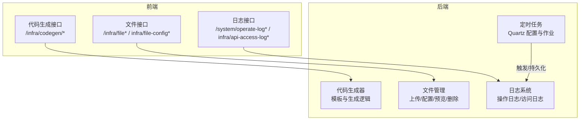
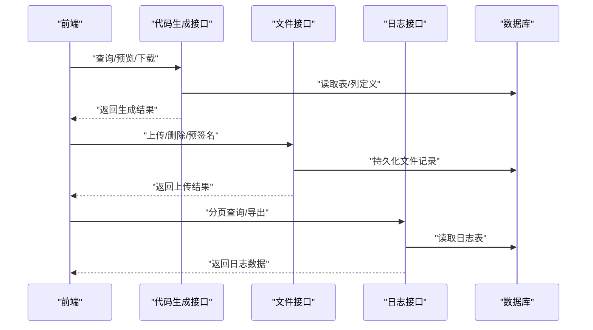
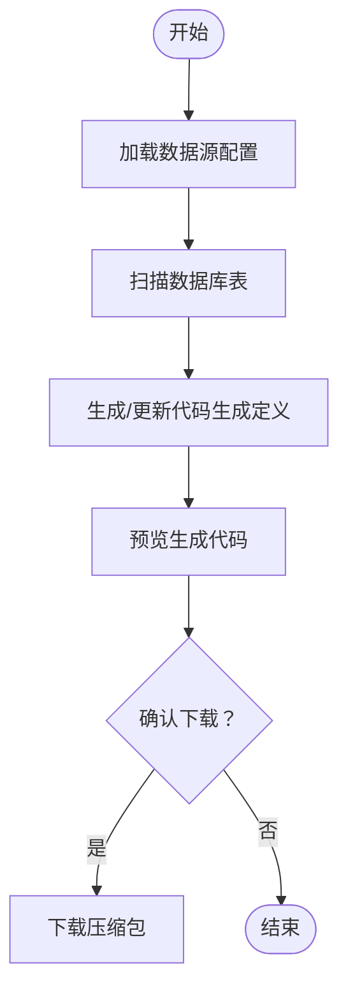
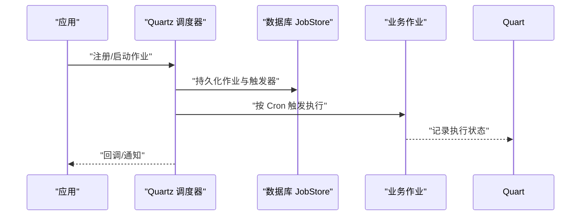
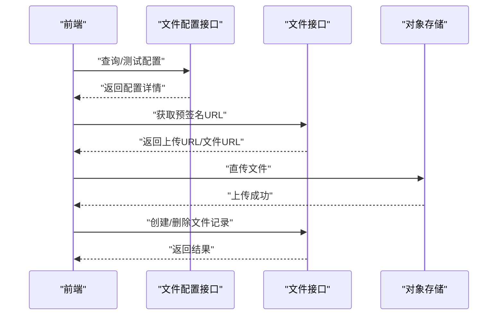
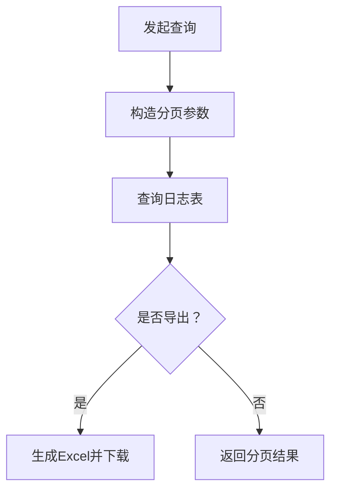
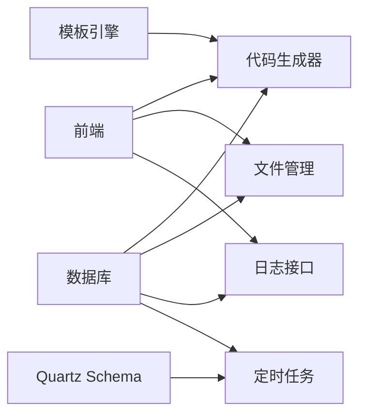

# 基础设施模块

<cite>
**本文引用的文件**
- [yudao-module-infra/src/main/resources/codegen/vue3_vben5_antdv_next/schema/views/data.ts.vm](file://yudao-module-infra/src/main/resources/codegen/vue3_vben5_antdv_next/schema/views/data.ts.vm)
- [yudao-module-infra/src/main/resources/codegen/vue3_vben/api/api.ts.vm](file://yudao-module-infra/src/main/resources/codegen/vue3_vben/api/api.ts.vm)
- [yudao-ui/yudao-ui-admin-vue3/src/api/infra/codegen/index.ts](file://yudao-ui/yudao-ui-admin-vue3/src/api/infra/codegen/index.ts)
- [yudao-module-infra/src/test/resources/sql/create_tables.sql](file://yudao-module-infra/src/test/resources/sql/create_tables.sql)
- [sql/mysql/quartz.sql](file://sql/mysql/quartz.sql)
- [sql/postgresql/quartz.sql](file://sql/postgresql/quartz.sql)
- [sql/dm/quartz.sql](file://sql/dm/quartz.sql)
- [yudao-server/src/main/resources/application-local.yaml](file://yudao-server/src/main/resources/application-local.yaml)
- [yudao-module-im/src/main/java/cn/iocoder/yudao/module/im/job/rtc/ImRtcCallCleanupJob.java](file://yudao-module-im/src/main/java/cn/iocoder/yudao/module/im/job/rtc/ImRtcCallCleanupJob.java)
- [yudao-ui/yudao-ui-admin-vue3/src/api/infra/file/index.ts](file://yudao-ui/yudao-ui-admin-vue3/src/api/infra/file/index.ts)
- [yudao-ui/yudao-ui-admin-vue3/src/api/infra/fileConfig/index.ts](file://yudao-ui/yudao-ui-admin-vue3/src/api/infra/fileConfig/index.ts)
- [yudao-ui/yudao-ui-admin-vue3/src/utils/index.ts](file://yudao-ui/yudao-ui-admin-vue3/src/utils/index.ts)
- [yudao-ui/yudao-ui-admin-vue3/src/api/system/operatelog/index.ts](file://yudao-ui/yudao-ui-admin-vue3/src/api/system/operatelog/index.ts)
- [yudao-module-system/src/test/resources/sql/create_tables.sql](file://yudao-module-system/src/test/resources/sql/create_tables.sql)
- [yudao-ui/yudao-ui-admin-vue3/src/api/infra/apiAccessLog/index.ts](file://yudao-ui/yudao-ui-admin-vue3/src/api/infra/apiAccessLog/index.ts)
</cite>

## 目录
1. [引言](#引言)
2. [项目结构](#项目结构)
3. [核心组件](#核心组件)
4. [架构总览](#架构总览)
5. [详细组件分析](#详细组件分析)
6. [依赖分析](#依赖分析)
7. [性能考虑](#性能考虑)
8. [故障排查指南](#故障排查指南)
9. [结论](#结论)
10. [附录](#附录)

## 引言
本指南面向基础设施模块的开发者与维护者，系统性讲解以下能力与实践：
- 代码生成器：模板定制、批量生成、自定义模板开发
- 定时任务系统：配置与管理、任务调度、执行历史与故障处理
- 文件管理系统：上传、存储配置、预览与删除
- 操作日志系统：记录机制、查询统计与导出分析
- 运维监控：数据库监控、缓存管理、消息队列监控
- 完整API接口文档：覆盖代码生成、定时任务、文件管理、日志查询等
- 开发示例：扩展现有功能与集成新服务
- 第三方服务集成：存储、短信、邮件等

## 项目结构
基础设施模块位于 yudao-module-infra，前端在 yudao-ui/yudao-ui-admin-vue3 的 infra 命名空间下提供配套接口。定时任务基于 Quartz，文件系统支持多种存储后端，日志系统提供操作日志与 API 访问日志。

**图表来源**
- [yudao-module-infra/src/main/resources/codegen/vue3_vben/api/api.ts.vm](file://yudao-module-infra/src/main/resources/codegen/vue3_vben/api/api.ts.vm)
- [yudao-ui/yudao-ui-admin-vue3/src/api/infra/codegen/index.ts](file://yudao-ui/yudao-ui-admin-vue3/src/api/infra/codegen/index.ts)
- [yudao-ui/yudao-ui-admin-vue3/src/api/infra/file/index.ts](file://yudao-ui/yudao-ui-admin-vue3/src/api/infra/file/index.ts)
- [yudao-ui/yudao-ui-admin-vue3/src/api/infra/fileConfig/index.ts](file://yudao-ui/yudao-ui-admin-vue3/src/api/infra/fileConfig/index.ts)
- [yudao-ui/yudao-ui-admin-vue3/src/api/system/operatelog/index.ts](file://yudao-ui/yudao-ui-admin-vue3/src/api/system/operatelog/index.ts)
- [yudao-ui/yudao-ui-admin-vue3/src/api/infra/apiAccessLog/index.ts](file://yudao-ui/yudao-ui-admin-vue3/src/api/infra/apiAccessLog/index.ts)

**章节来源**
- [yudao-module-infra/src/main/resources/codegen/vue3_vben/api/api.ts.vm](file://yudao-module-infra/src/main/resources/codegen/vue3_vben/api/api.ts.vm)
- [yudao-ui/yudao-ui-admin-vue3/src/api/infra/codegen/index.ts](file://yudao-ui/yudao-ui-admin-vue3/src/api/infra/codegen/index.ts)
- [yudao-ui/yudao-ui-admin-vue3/src/api/infra/file/index.ts](file://yudao-ui/yudao-ui-admin-vue3/src/api/infra/file/index.ts)
- [yudao-ui/yudao-ui-admin-vue3/src/api/infra/fileConfig/index.ts](file://yudao-ui/yudao-ui-admin-vue3/src/api/infra/fileConfig/index.ts)
- [yudao-ui/yudao-ui-admin-vue3/src/api/system/operatelog/index.ts](file://yudao-ui/yudao-ui-admin-vue3/src/api/system/operatelog/index.ts)
- [yudao-ui/yudao-ui-admin-vue3/src/api/infra/apiAccessLog/index.ts](file://yudao-ui/yudao-ui-admin-vue3/src/api/infra/apiAccessLog/index.ts)

## 核心组件
- 代码生成器：基于 Velocity 模板，支持多场景（标准/内嵌/ERP），可预览、下载、批量生成。
- 定时任务：Quartz JDBC 存储，支持集群、Misfire、线程池配置。
- 文件管理：统一文件配置与上传接口，支持预签名直传与删除。
- 日志系统：操作日志与 API 访问日志，支持分页查询与 Excel 导出。

**章节来源**
- [yudao-module-infra/src/main/resources/codegen/vue3_vben5_antdv_next/schema/views/data.ts.vm](file://yudao-module-infra/src/main/resources/codegen/vue3_vben5_antdv_next/schema/views/data.ts.vm)
- [yudao-module-infra/src/main/resources/codegen/vue3_vben/api/api.ts.vm](file://yudao-module-infra/src/main/resources/codegen/vue3_vben/api/api.ts.vm)
- [yudao-server/src/main/resources/application-local.yaml](file://yudao-server/src/main/resources/application-local.yaml)
- [yudao-ui/yudao-ui-admin-vue3/src/api/infra/file/index.ts](file://yudao-ui/yudao-ui-admin-vue3/src/api/infra/file/index.ts)
- [yudao-ui/yudao-ui-admin-vue3/src/api/system/operatelog/index.ts](file://yudao-ui/yudao-ui-admin-vue3/src/api/system/operatelog/index.ts)
- [yudao-ui/yudao-ui-admin-vue3/src/api/infra/apiAccessLog/index.ts](file://yudao-ui/yudao-ui-admin-vue3/src/api/infra/apiAccessLog/index.ts)

## 架构总览
基础设施模块通过后端控制器暴露 REST 接口，前端以 Axios 封装请求，结合模板引擎与 Quartz 作业，形成“配置—生成—执行—记录”的闭环。

**图表来源**
- [yudao-ui/yudao-ui-admin-vue3/src/api/infra/codegen/index.ts](file://yudao-ui/yudao-ui-admin-vue3/src/api/infra/codegen/index.ts)
- [yudao-ui/yudao-ui-admin-vue3/src/api/infra/file/index.ts](file://yudao-ui/yudao-ui-admin-vue3/src/api/infra/file/index.ts)
- [yudao-ui/yudao-ui-admin-vue3/src/api/system/operatelog/index.ts](file://yudao-ui/yudao-ui-admin-vue3/src/api/system/operatelog/index.ts)
- [yudao-ui/yudao-ui-admin-vue3/src/api/infra/apiAccessLog/index.ts](file://yudao-ui/yudao-ui-admin-vue3/src/api/infra/apiAccessLog/index.ts)

## 详细组件分析

### 代码生成器
- 模板位置与场景
  - Vue3 Vben Antdv Next 模板：视图 schema 与 CRUD API 模板
  - 支持主子表、ER 模式、内嵌模式等场景
- 前端接口
  - 列表/分页、详情、更新、同步、预览、下载、批量删除等
- 后端表结构
  - 代码生成表定义、列定义、数据源配置等

**图表来源**
- [yudao-module-infra/src/main/resources/codegen/vue3_vben5_antdv_next/schema/views/data.ts.vm](file://yudao-module-infra/src/main/resources/codegen/vue3_vben5_antdv_next/schema/views/data.ts.vm)
- [yudao-module-infra/src/main/resources/codegen/vue3_vben/api/api.ts.vm](file://yudao-module-infra/src/main/resources/codegen/vue3_vben/api/api.ts.vm)
- [yudao-ui/yudao-ui-admin-vue3/src/api/infra/codegen/index.ts](file://yudao-ui/yudao-ui-admin-vue3/src/api/infra/codegen/index.ts)
- [yudao-module-infra/src/test/resources/sql/create_tables.sql](file://yudao-module-infra/src/test/resources/sql/create_tables.sql)

**章节来源**
- [yudao-module-infra/src/main/resources/codegen/vue3_vben5_antdv_next/schema/views/data.ts.vm](file://yudao-module-infra/src/main/resources/codegen/vue3_vben5_antdv_next/schema/views/data.ts.vm)
- [yudao-module-infra/src/main/resources/codegen/vue3_vben/api/api.ts.vm](file://yudao-module-infra/src/main/resources/codegen/vue3_vben/api/api.ts.vm)
- [yudao-ui/yudao-ui-admin-vue3/src/api/infra/codegen/index.ts](file://yudao-ui/yudao-ui-admin-vue3/src/api/infra/codegen/index.ts)
- [yudao-module-infra/src/test/resources/sql/create_tables.sql](file://yudao-module-infra/src/test/resources/sql/create_tables.sql)

### 定时任务系统
- 配置要点
  - 启动策略、调度器名称、存储类型（内存/数据库）、关闭等待、集群开关、线程池大小
- 作业与触发器
  - Quartz SQL 提供跨数据库的表结构与索引
- 示例作业
  - 清理僵尸通话等业务作业可解析调度参数作为阈值

**图表来源**
- [yudao-server/src/main/resources/application-local.yaml](file://yudao-server/src/main/resources/application-local.yaml)
- [sql/mysql/quartz.sql](file://sql/mysql/quartz.sql)
- [sql/postgresql/quartz.sql](file://sql/postgresql/quartz.sql)
- [sql/dm/quartz.sql](file://sql/dm/quartz.sql)
- [yudao-module-im/src/main/java/cn/iocoder/yudao/module/im/job/rtc/ImRtcCallCleanupJob.java](file://yudao-module-im/src/main/java/cn/iocoder/yudao/module/im/job/rtc/ImRtcCallCleanupJob.java)

**章节来源**
- [yudao-server/src/main/resources/application-local.yaml](file://yudao-server/src/main/resources/application-local.yaml)
- [sql/mysql/quartz.sql](file://sql/mysql/quartz.sql)
- [sql/postgresql/quartz.sql](file://sql/postgresql/quartz.sql)
- [sql/dm/quartz.sql](file://sql/dm/quartz.sql)
- [yudao-module-im/src/main/java/cn/iocoder/yudao/module/im/job/rtc/ImRtcCallCleanupJob.java](file://yudao-module-im/src/main/java/cn/iocoder/yudao/module/im/job/rtc/ImRtcCallCleanupJob.java)

### 文件管理系统
- 前端接口
  - 分页、删除、批量删除、预签名地址、创建、上传
- 存储配置
  - 支持多种客户端配置（如对象存储域名、桶、密钥等）
- 文件类型与 MIME 映射
  - 前端对常见扩展名进行 MIME 类型映射，便于预览与安全控制

**图表来源**
- [yudao-ui/yudao-ui-admin-vue3/src/api/infra/file/index.ts](file://yudao-ui/yudao-ui-admin-vue3/src/api/infra/file/index.ts)
- [yudao-ui/yudao-ui-admin-vue3/src/api/infra/fileConfig/index.ts](file://yudao-ui/yudao-ui-admin-vue3/src/api/infra/fileConfig/index.ts)
- [yudao-ui/yudao-ui-admin-vue3/src/utils/index.ts](file://yudao-ui/yudao-ui-admin-vue3/src/utils/index.ts)

**章节来源**
- [yudao-ui/yudao-ui-admin-vue3/src/api/infra/file/index.ts](file://yudao-ui/yudao-ui-admin-vue3/src/api/infra/file/index.ts)
- [yudao-ui/yudao-ui-admin-vue3/src/api/infra/fileConfig/index.ts](file://yudao-ui/yudao-ui-admin-vue3/src/api/infra/fileConfig/index.ts)
- [yudao-ui/yudao-ui-admin-vue3/src/utils/index.ts](file://yudao-ui/yudao-ui-admin-vue3/src/utils/index.ts)

### 操作日志系统
- 接口能力
  - 分页查询、Excel 导出
- 数据模型
  - 包含 traceId、用户类型、业务标识、请求方法/URL、耗时、结果码等

**图表来源**
- [yudao-ui/yudao-ui-admin-vue3/src/api/system/operatelog/index.ts](file://yudao-ui/yudao-ui-admin-vue3/src/api/system/operatelog/index.ts)
- [yudao-module-system/src/test/resources/sql/create_tables.sql](file://yudao-module-system/src/test/resources/sql/create_tables.sql)

**章节来源**
- [yudao-ui/yudao-ui-admin-vue3/src/api/system/operatelog/index.ts](file://yudao-ui/yudao-ui-admin-vue3/src/api/system/operatelog/index.ts)
- [yudao-module-system/src/test/resources/sql/create_tables.sql](file://yudao-module-system/src/test/resources/sql/create_tables.sql)

### API 接口文档

#### 代码生成接口
- 查询代码生成表列表
  - 方法：GET
  - 路径：/infra/codegen/table/list
  - 参数：dataSourceConfigId
- 分页查询代码生成表
  - 方法：GET
  - 路径：/infra/codegen/table/page
  - 参数：分页参数
- 查询详情
  - 方法：GET
  - 路径：/infra/codegen/detail
  - 参数：tableId
- 修改表定义
  - 方法：PUT
  - 路径：/infra/codegen/update
  - 请求体：CodegenUpdateReqVO
- 同步数据库表结构
  - 方法：PUT
  - 路径：/infra/codegen/sync-from-db
  - 参数：tableId
- 预览生成代码
  - 方法：GET
  - 路径：/infra/codegen/preview
  - 参数：tableId
- 下载生成代码
  - 方法：GET
  - 路径：/infra/codegen/download
  - 参数：tableId
- 基于数据库创建代码生成定义
  - 方法：POST
  - 路径：/infra/codegen/create-list
  - 请求体：待创建的表集合
- 删除代码生成定义
  - 方法：DELETE
  - 路径：/infra/codegen/delete
  - 参数：tableId
- 批量删除
  - 方法：DELETE
  - 路径：/infra/codegen/delete-list
  - 参数：tableIds(逗号分隔)

**章节来源**
- [yudao-ui/yudao-ui-admin-vue3/src/api/infra/codegen/index.ts](file://yudao-ui/yudao-ui-admin-vue3/src/api/infra/codegen/index.ts)

#### 文件管理接口
- 文件分页
  - 方法：GET
  - 路径：/infra/file/page
  - 参数：分页参数
- 删除文件
  - 方法：DELETE
  - 路径：/infra/file/delete
  - 参数：id
- 批量删除
  - 方法：DELETE
  - 路径：/infra/file/delete-list
  - 参数：ids(逗号分隔)
- 获取预签名地址
  - 方法：GET
  - 路径：/infra/file/presigned-url
  - 参数：name, directory
- 创建文件
  - 方法：POST
  - 路径：/infra/file/create
  - 请求体：文件信息
- 上传文件
  - 方法：UPLOAD
  - 路径：/infra/file/upload
  - 请求体：FormData
  - 回调：onUploadProgress

**章节来源**
- [yudao-ui/yudao-ui-admin-vue3/src/api/infra/file/index.ts](file://yudao-ui/yudao-ui-admin-vue3/src/api/infra/file/index.ts)

#### 文件配置接口
- 文件配置分页
  - 方法：GET
  - 路径：/infra/file-config/page
  - 参数：分页参数
- 查询详情
  - 方法：GET
  - 路径：/infra/file-config/get
  - 参数：id
- 设置为主配置
  - 方法：PUT
  - 路径：/infra/file-config/update-master
  - 参数：id
- 新增配置
  - 方法：POST
  - 路径：/infra/file-config/create
  - 请求体：FileConfigVO
- 修改配置
  - 方法：PUT
  - 路径：/infra/file-config/update
  - 请求体：FileConfigVO
- 删除配置
  - 方法：DELETE
  - 路径：/infra/file-config/delete
  - 参数：id
- 批量删除
  - 方法：DELETE
  - 路径：/infra/file-config/delete-list
  - 参数：ids(逗号分隔)
- 测试配置
  - 方法：GET
  - 路径：/infra/file-config/test
  - 参数：id

**章节来源**
- [yudao-ui/yudao-ui-admin-vue3/src/api/infra/fileConfig/index.ts](file://yudao-ui/yudao-ui-admin-vue3/src/api/infra/fileConfig/index.ts)

#### 操作日志接口
- 分页查询
  - 方法：GET
  - 路径：/system/operate-log/page
  - 参数：分页参数
- 导出 Excel
  - 方法：GET
  - 路径：/system/operate-log/export-excel
  - 参数：查询条件

**章节来源**
- [yudao-ui/yudao-ui-admin-vue3/src/api/system/operatelog/index.ts](file://yudao-ui/yudao-ui-admin-vue3/src/api/system/operatelog/index.ts)

#### API 访问日志接口
- 分页查询
  - 方法：GET
  - 路径：/infra/api-access-log/page
  - 参数：分页参数
- 导出 Excel
  - 方法：GET
  - 路径：/infra/api-access-log/export-excel
  - 参数：查询条件

**章节来源**
- [yudao-ui/yudao-ui-admin-vue3/src/api/infra/apiAccessLog/index.ts](file://yudao-ui/yudao-ui-admin-vue3/src/api/infra/apiAccessLog/index.ts)

## 依赖分析
- 代码生成器依赖
  - 模板引擎（Velocity）与后端表定义模型
  - 前端 Axios 封装请求
- 定时任务依赖
  - Quartz JDBC Schema 与 Spring Boot 自动装配
  - 数据库 JobStore
- 文件管理依赖
  - 文件配置模型与预签名 URL 生成
  - 前端 MIME 类型映射
- 日志系统依赖
  - 操作日志与 API 访问日志表结构
  - Excel 导出工具链

**图表来源**
- [yudao-module-infra/src/main/resources/codegen/vue3_vben/api/api.ts.vm](file://yudao-module-infra/src/main/resources/codegen/vue3_vben/api/api.ts.vm)
- [yudao-server/src/main/resources/application-local.yaml](file://yudao-server/src/main/resources/application-local.yaml)
- [yudao-ui/yudao-ui-admin-vue3/src/api/infra/file/index.ts](file://yudao-ui/yudao-ui-admin-vue3/src/api/infra/file/index.ts)
- [yudao-ui/yudao-ui-admin-vue3/src/api/system/operatelog/index.ts](file://yudao-ui/yudao-ui-admin-vue3/src/api/system/operatelog/index.ts)
- [yudao-ui/yudao-ui-admin-vue3/src/api/infra/apiAccessLog/index.ts](file://yudao-ui/yudao-ui-admin-vue3/src/api/infra/apiAccessLog/index.ts)

**章节来源**
- [yudao-module-infra/src/main/resources/codegen/vue3_vben/api/api.ts.vm](file://yudao-module-infra/src/main/resources/codegen/vue3_vben/api/api.ts.vm)
- [yudao-server/src/main/resources/application-local.yaml](file://yudao-server/src/main/resources/application-local.yaml)
- [yudao-ui/yudao-ui-admin-vue3/src/api/infra/file/index.ts](file://yudao-ui/yudao-ui-admin-vue3/src/api/infra/file/index.ts)
- [yudao-ui/yudao-ui-admin-vue3/src/api/system/operatelog/index.ts](file://yudao-ui/yudao-ui-admin-vue3/src/api/system/operatelog/index.ts)
- [yudao-ui/yudao-ui-admin-vue3/src/api/infra/apiAccessLog/index.ts](file://yudao-ui/yudao-ui-admin-vue3/src/api/infra/apiAccessLog/index.ts)

## 性能考虑
- 代码生成
  - 预览优先，避免频繁下载；批量生成时注意并发与磁盘 IO
- 定时任务
  - 合理设置线程池大小与 Misfire 阈值；启用集群模式提升可用性
- 文件管理
  - 使用预签名直传降低后端压力；限制文件大小与类型
- 日志
  - 分页查询与导出需配合索引；定期清理过期日志

## 故障排查指南
- 代码生成
  - 若预览为空，检查数据源配置与表定义是否同步
- 定时任务
  - Quartz 未触发：检查存储类型、集群配置与线程池大小
  - 作业异常：查看作业日志与数据库执行记录
- 文件管理
  - 预签名失败：核对存储配置与权限；确认域名与桶正确
  - 上传失败：检查前端 MIME 映射与后端白名单
- 日志
  - 查询无结果：确认时间范围与过滤条件；检查日志表是否存在

**章节来源**
- [yudao-server/src/main/resources/application-local.yaml](file://yudao-server/src/main/resources/application-local.yaml)
- [yudao-ui/yudao-ui-admin-vue3/src/utils/index.ts](file://yudao-ui/yudao-ui-admin-vue3/src/utils/index.ts)
- [yudao-module-system/src/test/resources/sql/create_tables.sql](file://yudao-module-system/src/test/resources/sql/create_tables.sql)

## 结论
基础设施模块提供了完善的代码生成、定时任务、文件管理与日志体系，配合灵活的模板与接口设计，能够快速支撑业务迭代与运维监控需求。建议在生产环境中启用 Quartz 集群与合理的线程池配置，完善文件存储的鉴权与域名绑定，并建立日志归档与导出流程。

## 附录
- 开发示例
  - 扩展代码生成模板：在模板目录新增 VM 文件，定义变量与输出逻辑，前端通过接口触发生成
  - 新增定时任务：编写作业类，配置 Cron 表达式与参数，确保数据库表结构已初始化
  - 集成新存储：在文件配置中新增客户端配置项，前端补充 MIME 映射，后端实现直传逻辑
- 第三方服务集成
  - 存储：对象存储（如 OSS/COS/S3）或本地存储，配置域名、桶、密钥与访问策略
  - 短信/邮件：参考系统模块中的短信与邮件接口，按需接入第三方 SDK 并封装统一服务