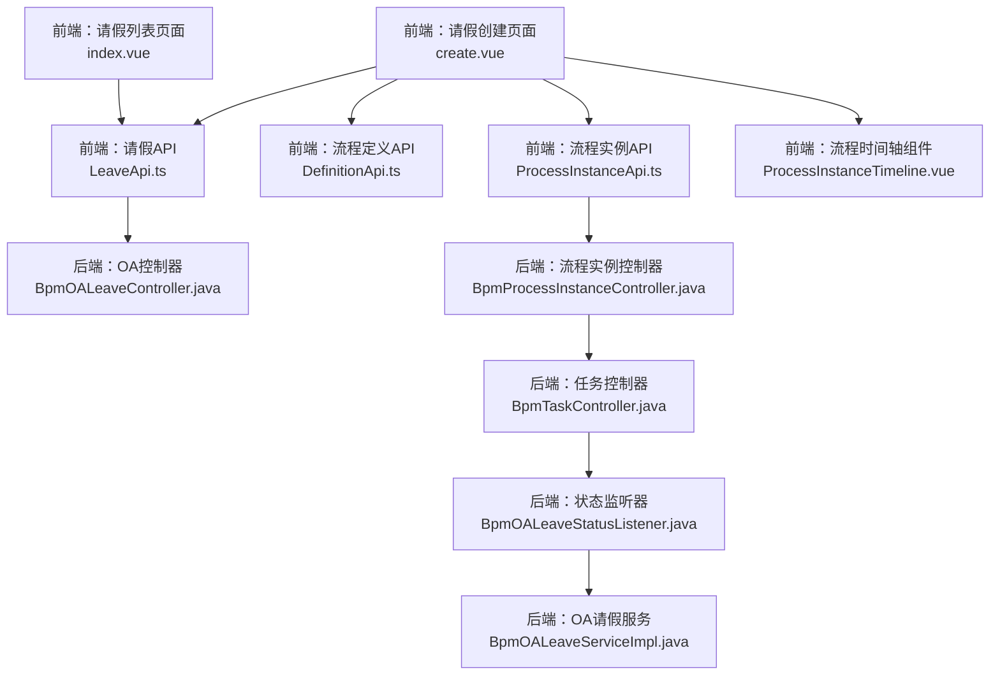
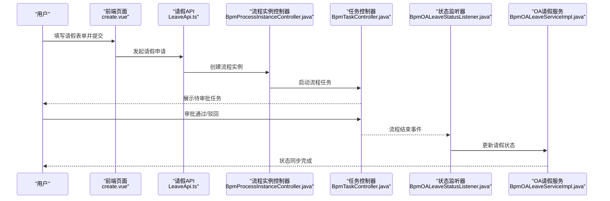
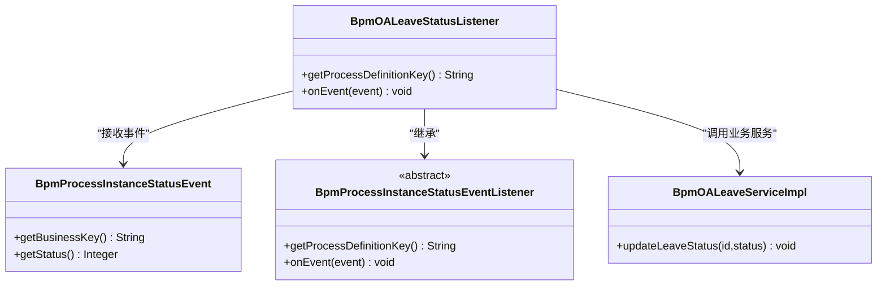
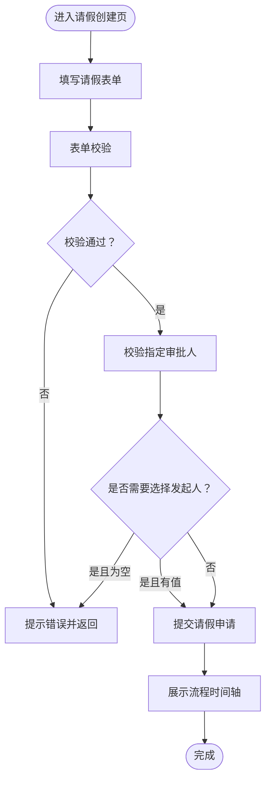
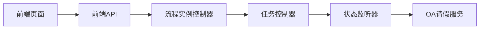

# OA审批流程

<cite>
**本文引用的文件**
- [BpmOALeaveStatusListener.java](file://yudao-module-bpm/src/main/java/cn/iocoder/yudao/module/bpm/service/oa/listener/BpmOALeaveStatusListener.java)
- [BpmOALeaveServiceImpl.java](file://yudao-module-bpm/src/main/java/cn/iocoder/yudao/module/bpm/service/oa/BpmOALeaveServiceImpl.java)
- [create.vue](file://yudao-ui/yudao-ui-admin-vue3/src/views/bpm/oa/leave/create.vue)
- [index.vue](file://yudao-ui/yudao-ui-admin-vue3/src/views/bpm/oa/leave/index.vue)
- [LeaveApi.ts](file://yudao-ui/yudao-ui-admin-vue3/src/api/bpm/leave/index.ts)
- [DefinitionApi.ts](file://yudao-ui/yudao-ui-admin-vue3/src/api/bpm/definition/index.ts)
- [ProcessInstanceApi.ts](file://yudao-ui/yudao-ui-admin-vue3/src/api/bpm/processInstance/index.ts)
- [ProcessInstanceTimeline.vue](file://yudao-ui/yudao-ui-admin-vue3/src/views/bpm/processInstance/detail/ProcessInstanceTimeline.vue)
- [SimpleProcessDesignerV2_consts.ts](file://yudao-ui/yudao-ui-admin-vue3/src/components/SimpleProcessDesignerV2/src/consts.ts)
- [BpmProcessInstanceStatusEvent.java](file://yudao-module-bpm/src/main/java/cn/iocoder/yudao/module/bpm/api/event/BpmProcessInstanceStatusEvent.java)
- [BpmProcessInstanceStatusEventListener.java](file://yudao-module-bpm/src/main/java/cn/iocoder/yudao/module/bpm/api/event/BpmProcessInstanceStatusEventListener.java)
- [BpmOALeaveController.java](file://yudao-module-bpm/src/main/java/cn/iocoder/yudao/module/bpm/controller/admin/task/BpmProcessInstanceController.java)
- [BpmTaskController.java](file://yudao-module-bpm/src/main/java/cn/iocoder/yudao/module/bpm/controller/admin/task/BpmTaskController.java)
- [BpmProcessInstanceCreateReqVO.java](file://yudao-module-bpm/src/main/java/cn/iocoder/yudao/module/bpm/controller/admin/task/vo/instance/BpmProcessInstanceCreateReqVO.java)
- [BpmTaskApproveReqVO.java](file://yudao-module-bpm/src/main/java/cn/iocoder/yudao/module/bpm/controller/admin/task/vo/task/BpmTaskApproveReqVO.java)
- [BpmTaskRejectReqVO.java](file://yudao-module-bpm/src/main/java/cn/iocoder/yudao/module/bpm/controller/admin/task/vo/task/BpmTaskRejectReqVO.java)
- [BpmProcessInstanceCancelReqVO.java](file://yudao-module-bpm/src/main/java/cn/iocoder/yudao/module/bpm/controller/admin/task/vo/instance/BpmProcessInstanceCancelReqVO.java)
- [BpmProcessInstancePageReqVO.java](file://yudao-module-bpm/src/main/java/cn/iocoder/yudao/module/bpm/controller/admin/task/vo/instance/BpmProcessInstancePageReqVO.java)
- [BpmProcessInstanceRespVO.java](file://yudao-module-bpm/src/main/java/cn/iocoder/yudao/module/bpm/controller/admin/task/vo/instance/BpmProcessInstanceRespVO.java)
- [BpmTaskRespVO.java](file://yudao-module-bpm/src/main/java/cn/iocoder/yudao/module/bpm/controller/admin/task/vo/task/BpmTaskRespVO.java)
- [BpmActivityRespVO.java](file://yudao-module-bpm/src/main/java/cn/iocoder/yudao/module/bpm/controller/admin/task/vo/activity/BpmActivityRespVO.java)
- [BpmProcessInstanceCopyPageReqVO.java](file://yudao-module-bpm/src/main/java/cn/iocoder/yudao/module/bpm/controller/admin/task/vo/cc/BpmProcessInstanceCopyPageReqVO.java)
- [BpmProcessInstanceCopyRespVO.java](file://yudao-module-bpm/src/main/java/cn/iocoder/yudao/module/bpm/controller/admin/task/vo/cc/BpmProcessInstanceCopyRespVO.java)
- [BpmProcessInstancePrintDataRespVO.java](file://yudao-module-bpm/src/main/java/cn/iocoder/yudao/module/bpm/controller/admin/task/vo/instance/BpmProcessInstancePrintDataRespVO.java)
- [BpmProcessInstanceBpmnModelViewRespVO.java](file://yudao-module-bpm/src/main/java/cn/iocoder/yudao/module/bpm/controller/admin/task/vo/instance/BpmProcessInstanceBpmnModelViewRespVO.java)
- [BpmProcessInstanceApprovalDetailReqVO.java](file://yudao-module-bpm/src/main/java/cn/iocoder/yudao/module/bpm/controller/admin/task/vo/instance/BpmProcessInstanceApprovalDetailReqVO.java)
- [BpmProcessInstanceApprovalDetailRespVO.java](file://yudao-module-bpm/src/main/java/cn/iocoder/yudao/module/bpm/controller/admin/task/vo/instance/BpmProcessInstanceApprovalDetailRespVO.java)
- [BpmProcessInstanceStatusEvent.java](file://yudao-module-bpm/src/main/java/cn/iocoder/yudao/module/bpm/api/event/BpmProcessInstanceStatusEvent.java)
- [BpmProcessInstanceStatusEventListener.java](file://yudao-module-bpm/src/main/java/cn/iocoder/yudao/module/bpm/api/event/BpmProcessInstanceStatusEventListener.java)
- [BpmOALeaveStatusListener.java](file://yudao-module-bpm/src/main/java/cn/iocoder/yudao/module/bpm/service/oa/listener/BpmOALeaveStatusListener.java)
- [BpmOALeaveServiceImpl.java](file://yudao-module-bpm/src/main/java/cn/iocoder/yudao/module/bpm/service/oa/BpmOALeaveServiceImpl.java)
- [BpmOALeaveController.java](file://yudao-module-bpm/src/main/java/cn/iocoder/yudao/module/bpm/controller/admin/task/BpmProcessInstanceController.java)
- [BpmTaskController.java](file://yudao-module-bpm/src/main/java/cn/iocoder/yudao/module/bpm/controller/admin/task/BpmTaskController.java)
- [BpmProcessInstanceCreateReqVO.java](file://yudao-module-bpm/src/main/java/cn/iocoder/yudao/module/bpm/controller/admin/task/vo/instance/BpmProcessInstanceCreateReqVO.java)
- [BpmTaskApproveReqVO.java](file://yudao-module-bpm/src/main/java/cn/iocoder/yudao/module/bpm/controller/admin/task/vo/task/BpmTaskApproveReqVO.java)
- [BpmTaskRejectReqVO.java](file://yudao-module-bpm/src/main/java/cn/iocoder/yudao/module/bpm/controller/admin/task/vo/task/BpmTaskRejectReqVO.java)
- [BpmProcessInstanceCancelReqVO.java](file://yudao-module-bpm/src/main/java/cn/iocoder/yudao/module/bpm/controller/admin/task/vo/instance/BpmProcessInstanceCancelReqVO.java)
- [BpmProcessInstancePageReqVO.java](file://yudao-module-bpm/src/main/java/cn/iocoder/yudao/module/bpm/controller/admin/task/vo/instance/BpmProcessInstancePageReqVO.java)
- [BpmProcessInstanceRespVO.java](file://yudao-module-bpm/src/main/java/cn/iocoder/yudao/module/bpm/controller/admin/task/vo/instance/BpmProcessInstanceRespVO.java)
- [BpmTaskRespVO.java](file://yudao-module-bpm/src/main/java/cn/iocoder/yudao/module/bpm/controller/admin/task/vo/task/BpmTaskRespVO.java)
- [BpmActivityRespVO.java](file://yudao-module-bpm/src/main/java/cn/iocoder/yudao/module/bpm/controller/admin/task/vo/activity/BpmActivityRespVO.java)
- [BpmProcessInstanceCopyPageReqVO.java](file://yudao-module-bpm/src/main/java/cn/iocoder/yudao/module/bpm/controller/admin/task/vo/cc/BpmProcessInstanceCopyPageReqVO.java)
- [BpmProcessInstanceCopyRespVO.java](file://yudao-module-bpm/src/main/java/cn/iocoder/yudao/module/bpm/controller/admin/task/vo/cc/BpmProcessInstanceCopyRespVO.java)
- [BpmProcessInstancePrintDataRespVO.java](file://yudao-module-bpm/src/main/java/cn/iocoder/yudao/module/bpm/controller/admin/task/vo/instance/BpmProcessInstancePrintDataRespVO.java)
- [BpmProcessInstanceBpmnModelViewRespVO.java](file://yudao-module-bpm/src/main/java/cn/iocoder/yudao/module/bpm/controller/admin/task/vo/instance/BpmProcessInstanceBpmnModelViewRespVO.java)
- [BpmProcessInstanceApprovalDetailReqVO.java](file://yudao-module-bpm/src/main/java/cn/iocoder/yudao/module/bpm/controller/admin/task/vo/instance/BpmProcessInstanceApprovalDetailReqVO.java)
- [BpmProcessInstanceApprovalDetailRespVO.java](file://yudao-module-bpm/src/main/java/cn/iocoder/yudao/module/bpm/controller/admin/task/vo/instance/BpmProcessInstanceApprovalDetailRespVO.java)
</cite>

## 目录
1. [简介](#简介)
2. [项目结构](#项目结构)
3. [核心组件](#核心组件)
4. [架构总览](#架构总览)
5. [详细组件分析](#详细组件分析)
6. [依赖关系分析](#依赖关系分析)
7. [性能与可扩展性](#性能与可扩展性)
8. [故障排查指南](#故障排查指南)
9. [结论](#结论)
10. [附录：API接口清单](#附录api接口清单)

## 简介
本指南围绕OA审批流程（以请假为例）提供从流程设计、表单配置、审批规则到系统集成与统计分析的完整开发指南。结合后端BPM模块与前端Vue管理界面，覆盖请假申请、审批流转、状态同步、流程可视化与API使用，帮助开发者快速落地各类OA审批场景。

## 项目结构
OA请假流程涉及前后端协同：
- 前端：Vue管理界面负责请假表单、流程可视化、审批操作入口
- 后端：BPM服务负责流程引擎交互、业务状态同步、审批任务处理
- 事件监听：流程实例状态变更事件驱动业务侧状态更新

图表来源
- [create.vue](file://yudao-ui/yudao-ui-admin-vue3/src/views/bpm/oa/leave/create.vue)
- [index.vue](file://yudao-ui/yudao-ui-admin-vue3/src/views/bpm/oa/leave/index.vue)
- [LeaveApi.ts](file://yudao-ui/yudao-ui-admin-vue3/src/api/bpm/leave/index.ts)
- [DefinitionApi.ts](file://yudao-ui/yudao-ui-admin-vue3/src/api/bpm/definition/index.ts)
- [ProcessInstanceApi.ts](file://yudao-ui/yudao-ui-admin-vue3/src/api/bpm/processInstance/index.ts)
- [ProcessInstanceTimeline.vue](file://yudao-ui/yudao-ui-admin-vue3/src/views/bpm/processInstance/detail/ProcessInstanceTimeline.vue)
- [BpmOALeaveController.java](file://yudao-module-bpm/src/main/java/cn/iocoder/yudao/module/bpm/controller/admin/task/BpmProcessInstanceController.java)
- [BpmTaskController.java](file://yudao-module-bpm/src/main/java/cn/iocoder/yudao/module/bpm/controller/admin/task/BpmTaskController.java)
- [BpmOALeaveStatusListener.java](file://yudao-module-bpm/src/main/java/cn/iocoder/yudao/module/bpm/service/oa/listener/BpmOALeaveStatusListener.java)
- [BpmOALeaveServiceImpl.java](file://yudao-module-bpm/src/main/java/cn/iocoder/yudao/module/bpm/service/oa/BpmOALeaveServiceImpl.java)

章节来源
- [create.vue:65-220](file://yudao-ui/yudao-ui-admin-vue3/src/views/bpm/oa/leave/create.vue#L65-L220)
- [index.vue:170-236](file://yudao-ui/yudao-ui-admin-vue3/src/views/bpm/oa/leave/index.vue#L170-L236)
- [LeaveApi.ts](file://yudao-ui/yudao-ui-admin-vue3/src/api/bpm/leave/index.ts)
- [DefinitionApi.ts](file://yudao-ui/yudao-ui-admin-vue3/src/api/bpm/definition/index.ts)
- [ProcessInstanceApi.ts](file://yudao-ui/yudao-ui-admin-vue3/src/api/bpm/processInstance/index.ts)
- [ProcessInstanceTimeline.vue](file://yudao-ui/yudao-ui-admin-vue3/src/views/bpm/processInstance/detail/ProcessInstanceTimeline.vue)
- [BpmOALeaveController.java](file://yudao-module-bpm/src/main/java/cn/iocoder/yudao/module/bpm/controller/admin/task/BpmProcessInstanceController.java)
- [BpmTaskController.java](file://yudao-module-bpm/src/main/java/cn/iocoder/yudao/module/bpm/controller/admin/task/BpmTaskController.java)
- [BpmOALeaveStatusListener.java:1-32](file://yudao-module-bpm/src/main/java/cn/iocoder/yudao/module/bpm/service/oa/listener/BpmOALeaveStatusListener.java#L1-L32)
- [BpmOALeaveServiceImpl.java](file://yudao-module-bpm/src/main/java/cn/iocoder/yudao/module/bpm/service/oa/BpmOALeaveServiceImpl.java)

## 核心组件
- 请假状态监听器：监听流程实例结束事件，回写业务状态
- OA请假服务：负责请假单状态更新与业务逻辑协调
- 前端请假页面：表单校验、流程可视化、发起审批
- 流程实例与任务控制器：提供流程启动、审批、撤销、查询能力

章节来源
- [BpmOALeaveStatusListener.java:1-32](file://yudao-module-bpm/src/main/java/cn/iocoder/yudao/module/bpm/service/oa/listener/BpmOALeaveStatusListener.java#L1-L32)
- [BpmOALeaveServiceImpl.java](file://yudao-module-bpm/src/main/java/cn/iocoder/yudao/module/bpm/service/oa/BpmOALeaveServiceImpl.java)
- [create.vue:65-220](file://yudao-ui/yudao-ui-admin-vue3/src/views/bpm/oa/leave/create.vue#L65-L220)
- [BpmProcessInstanceController.java](file://yudao-module-bpm/src/main/java/cn/iocoder/yudao/module/bpm/controller/admin/task/BpmProcessInstanceController.java)
- [BpmTaskController.java](file://yudao-module-bpm/src/main/java/cn/iocoder/yudao/module/bpm/controller/admin/task/BpmTaskController.java)

## 架构总览
OA请假流程采用“前端表单+流程引擎+事件监听+业务服务”的分层架构。前端提交请假申请，后端通过流程引擎启动流程；流程结束后，事件监听器回调业务服务更新请假状态。

图表来源
- [create.vue:107-141](file://yudao-ui/yudao-ui-admin-vue3/src/views/bpm/oa/leave/create.vue#L107-L141)
- [LeaveApi.ts](file://yudao-ui/yudao-ui-admin-vue3/src/api/bpm/leave/index.ts)
- [BpmProcessInstanceController.java](file://yudao-module-bpm/src/main/java/cn/iocoder/yudao/module/bpm/controller/admin/task/BpmProcessInstanceController.java)
- [BpmTaskController.java](file://yudao-module-bpm/src/main/java/cn/iocoder/yudao/module/bpm/controller/admin/task/BpmTaskController.java)
- [BpmOALeaveStatusListener.java:22-30](file://yudao-module-bpm/src/main/java/cn/iocoder/yudao/module/bpm/service/oa/listener/BpmOALeaveStatusListener.java#L22-L30)
- [BpmOALeaveServiceImpl.java](file://yudao-module-bpm/src/main/java/cn/iocoder/yudao/module/bpm/service/oa/BpmOALeaveServiceImpl.java)

## 详细组件分析

### 组件一：请假状态监听器（流程结束事件驱动）
- 功能：根据流程定义键匹配，接收流程实例结束事件，调用业务服务更新请假状态
- 关键点：processDefinitionKey与业务主键映射，事件回调中的状态同步

图表来源
- [BpmOALeaveStatusListener.java:17-31](file://yudao-module-bpm/src/main/java/cn/iocoder/yudao/module/bpm/service/oa/listener/BpmOALeaveStatusListener.java#L17-L31)
- [BpmProcessInstanceStatusEvent.java](file://yudao-module-bpm/src/main/java/cn/iocoder/yudao/module/bpm/api/event/BpmProcessInstanceStatusEvent.java)
- [BpmProcessInstanceStatusEventListener.java](file://yudao-module-bpm/src/main/java/cn/iocoder/yudao/module/bpm/api/event/BpmProcessInstanceStatusEventListener.java)
- [BpmOALeaveServiceImpl.java](file://yudao-module-bpm/src/main/java/cn/iocoder/yudao/module/bpm/service/oa/BpmOALeaveServiceImpl.java)

章节来源
- [BpmOALeaveStatusListener.java:1-32](file://yudao-module-bpm/src/main/java/cn/iocoder/yudao/module/bpm/service/oa/listener/BpmOALeaveStatusListener.java#L1-L32)

### 组件二：前端请假创建页面（表单与流程可视化）
- 表单字段：请假类型、开始/结束时间、原因
- 校验逻辑：表单校验、指定审批人必选校验
- 流程可视化：通过流程时间轴组件展示审批节点
- 发起流程：调用请假API创建并提交流程实例

图表来源
- [create.vue:107-141](file://yudao-ui/yudao-ui-admin-vue3/src/views/bpm/oa/leave/create.vue#L107-L141)
- [create.vue:181-184](file://yudao-ui/yudao-ui-admin-vue3/src/views/bpm/oa/leave/create.vue#L181-L184)
- [ProcessInstanceTimeline.vue](file://yudao-ui/yudao-ui-admin-vue3/src/views/bpm/processInstance/detail/ProcessInstanceTimeline.vue)

章节来源
- [create.vue:65-220](file://yudao-ui/yudao-ui-admin-vue3/src/views/bpm/oa/leave/create.vue#L65-L220)
- [ProcessInstanceTimeline.vue](file://yudao-ui/yudao-ui-admin-vue3/src/views/bpm/processInstance/detail/ProcessInstanceTimeline.vue)

### 组件三：流程实例与任务控制器（审批操作入口）
- 流程实例：创建、取消、分页查询、打印视图、BPMN模型查看、抄送管理
- 任务：审批、驳回、转办、委托、会签等
- 与前端API配合，支撑请假流程的完整生命周期

```mermaid
classDiagram
class BpmProcessInstanceController {
+create(req) Resp
+cancel(req) Resp
+page(req) PageResp
+printData(id) Resp
+bpmnModelView(id) Resp
+copyPage(req) PageResp
}
class BpmTaskController {
+approve(req) Resp
+reject(req) Resp
+transfer(req) Resp
+delegate(req) Resp
+sign(req) Resp
}
class BpmProcessInstanceCreateReqVO
class BpmTaskApproveReqVO
class BpmTaskRejectReqVO
class BpmProcessInstanceCancelReqVO
class BpmProcessInstancePageReqVO
class BpmProcessInstanceRespVO
class BpmTaskRespVO
class BpmActivityRespVO
class BpmProcessInstanceCopyPageReqVO
class BpmProcessInstanceCopyRespVO
class BpmProcessInstancePrintDataRespVO
class BpmProcessInstanceBpmnModelViewRespVO
class BpmProcessInstanceApprovalDetailReqVO
class BpmProcessInstanceApprovalDetailRespVO
BpmProcessInstanceController --> BpmProcessInstanceCreateReqVO
BpmProcessInstanceController --> BpmProcessInstanceCancelReqVO
BpmProcessInstanceController --> BpmProcessInstancePageReqVO
BpmProcessInstanceController --> BpmProcessInstanceRespVO
BpmProcessInstanceController --> BpmProcessInstancePrintDataRespVO
BpmProcessInstanceController --> BpmProcessInstanceBpmnModelViewRespVO
BpmProcessInstanceController --> BpmProcessInstanceCopyPageReqVO
BpmProcessInstanceController --> BpmProcessInstanceCopyRespVO
BpmProcessInstanceController --> BpmProcessInstanceApprovalDetailReqVO
BpmProcessInstanceController --> BpmProcessInstanceApprovalDetailRespVO
BpmTaskController --> BpmTaskApproveReqVO
BpmTaskController --> BpmTaskRejectReqVO
BpmTaskController --> BpmTaskRespVO
BpmTaskController --> BpmActivityRespVO
```

图表来源
- [BpmProcessInstanceController.java](file://yudao-module-bpm/src/main/java/cn/iocoder/yudao/module/bpm/controller/admin/task/BpmProcessInstanceController.java)
- [BpmTaskController.java](file://yudao-module-bpm/src/main/java/cn/iocoder/yudao/module/bpm/controller/admin/task/BpmTaskController.java)
- [BpmProcessInstanceCreateReqVO.java](file://yudao-module-bpm/src/main/java/cn/iocoder/yudao/module/bpm/controller/admin/task/vo/instance/BpmProcessInstanceCreateReqVO.java)
- [BpmTaskApproveReqVO.java](file://yudao-module-bpm/src/main/java/cn/iocoder/yudao/module/bpm/controller/admin/task/vo/task/BpmTaskApproveReqVO.java)
- [BpmTaskRejectReqVO.java](file://yudao-module-bpm/src/main/java/cn/iocoder/yudao/module/bpm/controller/admin/task/vo/task/BpmTaskRejectReqVO.java)
- [BpmProcessInstanceCancelReqVO.java](file://yudao-module-bpm/src/main/java/cn/iocoder/yudao/module/bpm/controller/admin/task/vo/instance/BpmProcessInstanceCancelReqVO.java)
- [BpmProcessInstancePageReqVO.java](file://yudao-module-bpm/src/main/java/cn/iocoder/yudao/module/bpm/controller/admin/task/vo/instance/BpmProcessInstancePageReqVO.java)
- [BpmProcessInstanceRespVO.java](file://yudao-module-bpm/src/main/java/cn/iocoder/yudao/module/bpm/controller/admin/task/vo/instance/BpmProcessInstanceRespVO.java)
- [BpmTaskRespVO.java](file://yudao-module-bpm/src/main/java/cn/iocoder/yudao/module/bpm/controller/admin/task/vo/task/BpmTaskRespVO.java)
- [BpmActivityRespVO.java](file://yudao-module-bpm/src/main/java/cn/iocoder/yudao/module/bpm/controller/admin/task/vo/activity/BpmActivityRespVO.java)
- [BpmProcessInstanceCopyPageReqVO.java](file://yudao-module-bpm/src/main/java/cn/iocoder/yudao/module/bpm/controller/admin/task/vo/cc/BpmProcessInstanceCopyPageReqVO.java)
- [BpmProcessInstanceCopyRespVO.java](file://yudao-module-bpm/src/main/java/cn/iocoder/yudao/module/bpm/controller/admin/task/vo/cc/BpmProcessInstanceCopyRespVO.java)
- [BpmProcessInstancePrintDataRespVO.java](file://yudao-module-bpm/src/main/java/cn/iocoder/yudao/module/bpm/controller/admin/task/vo/instance/BpmProcessInstancePrintDataRespVO.java)
- [BpmProcessInstanceBpmnModelViewRespVO.java](file://yudao-module-bpm/src/main/java/cn/iocoder/yudao/module/bpm/controller/admin/task/vo/instance/BpmProcessInstanceBpmnModelViewRespVO.java)
- [BpmProcessInstanceApprovalDetailReqVO.java](file://yudao-module-bpm/src/main/java/cn/iocoder/yudao/module/bpm/controller/admin/task/vo/instance/BpmProcessInstanceApprovalDetailReqVO.java)
- [BpmProcessInstanceApprovalDetailRespVO.java](file://yudao-module-bpm/src/main/java/cn/iocoder/yudao/module/bpm/controller/admin/task/vo/instance/BpmProcessInstanceApprovalDetailRespVO.java)

章节来源
- [BpmProcessInstanceController.java](file://yudao-module-bpm/src/main/java/cn/iocoder/yudao/module/bpm/controller/admin/task/BpmProcessInstanceController.java)
- [BpmTaskController.java](file://yudao-module-bpm/src/main/java/cn/iocoder/yudao/module/bpm/controller/admin/task/BpmTaskController.java)

### 组件四：请假类型与计算规则（概念设计）
- 请假类型：如年假、病假、事假、婚假等，建议在字典或枚举中定义
- 工作日计算：可基于日期区间与节假日配置计算应扣工作日
- 假期余额：结合员工假期额度与历史请假记录进行扣减控制
- 审批层级：按部门/职级/额度设置多级审批策略
- 特殊规则：如跨年请假、连续多日免审批上限等

说明：以上为通用设计建议，具体实现需结合业务字典与服务端校验逻辑扩展。

## 依赖关系分析
- 前端依赖后端API，后端依赖流程引擎与业务服务
- 监听器依赖事件抽象，确保流程结束即刻回写业务状态
- 控制器与VO之间存在强契约，保证请求/响应结构稳定

图表来源
- [create.vue:65-220](file://yudao-ui/yudao-ui-admin-vue3/src/views/bpm/oa/leave/create.vue#L65-L220)
- [LeaveApi.ts](file://yudao-ui/yudao-ui-admin-vue3/src/api/bpm/leave/index.ts)
- [BpmProcessInstanceController.java](file://yudao-module-bpm/src/main/java/cn/iocoder/yudao/module/bpm/controller/admin/task/BpmProcessInstanceController.java)
- [BpmTaskController.java](file://yudao-module-bpm/src/main/java/cn/iocoder/yudao/module/bpm/controller/admin/task/BpmTaskController.java)
- [BpmOALeaveStatusListener.java:17-31](file://yudao-module-bpm/src/main/java/cn/iocoder/yudao/module/bpm/service/oa/listener/BpmOALeaveStatusListener.java#L17-L31)
- [BpmOALeaveServiceImpl.java](file://yudao-module-bpm/src/main/java/cn/iocoder/yudao/module/bpm/service/oa/BpmOALeaveServiceImpl.java)

章节来源
- [BpmOALeaveStatusListener.java:1-32](file://yudao-module-bpm/src/main/java/cn/iocoder/yudao/module/bpm/service/oa/listener/BpmOALeaveStatusListener.java#L1-L32)
- [BpmOALeaveServiceImpl.java](file://yudao-module-bpm/src/main/java/cn/iocoder/yudao/module/bpm/service/oa/BpmOALeaveServiceImpl.java)

## 性能与可扩展性
- 性能要点：流程实例分页查询、任务批量处理、事件异步化（如适用）、缓存常用字典
- 可扩展性：通过监听器扩展新业务类型；通过流程变量与表达式实现灵活规则；通过API网关统一接入外部系统

## 故障排查指南
- 流程无法启动：检查流程定义是否存在、流程变量是否正确传入
- 审批无响应：确认任务控制器接口调用链路、审批参数是否符合VO约束
- 状态不同步：核对监听器是否注册、事件是否触发、业务服务更新逻辑
- 前端显示异常：检查API返回结构、组件props绑定、国际化与权限

## 结论
本指南提供了OA请假流程的端到端实现路径：从前端表单与流程可视化，到后端流程引擎与事件驱动的状态同步。通过标准化的控制器与VO契约、可插拔的监听器机制，能够快速适配多种OA审批场景，并为后续系统集成与统计分析奠定基础。

## 附录：API接口清单
以下为与请假流程直接相关的后端API（控制器与VO），便于前后端联调与扩展：

- 流程实例
  - 创建流程实例：POST /admin/bpm/process-instance/create
  - 取消流程实例：POST /admin/bpm/process-instance/cancel
  - 分页查询：GET /admin/bpm/process-instance/page
  - 打印数据：GET /admin/bpm/process-instance/print-data/{id}
  - BPMN模型查看：GET /admin/bpm/process-instance/bpmn-model-view/{id}
  - 抄送分页：GET /admin/bpm/process-instance/copy-page

- 任务
  - 审批通过：POST /admin/bpm/task/approve
  - 驳回：POST /admin/bpm/task/reject
  - 转办：POST /admin/bpm/task/transfer
  - 委托：POST /admin/bpm/task/delegate
  - 会签：POST /admin/bpm/task/sign

- 请假（示例）
  - 创建请假：POST /admin/bpm/oa-leave
  - 查询请假分页：GET /admin/bpm/oa-leave/page
  - 获取请假详情：GET /admin/bpm/oa-leave/{id}

章节来源
- [BpmProcessInstanceController.java](file://yudao-module-bpm/src/main/java/cn/iocoder/yudao/module/bpm/controller/admin/task/BpmProcessInstanceController.java)
- [BpmTaskController.java](file://yudao-module-bpm/src/main/java/cn/iocoder/yudao/module/bpm/controller/admin/task/BpmTaskController.java)
- [BpmProcessInstanceCreateReqVO.java](file://yudao-module-bpm/src/main/java/cn/iocoder/yudao/module/bpm/controller/admin/task/vo/instance/BpmProcessInstanceCreateReqVO.java)
- [BpmTaskApproveReqVO.java](file://yudao-module-bpm/src/main/java/cn/iocoder/yudao/module/bpm/controller/admin/task/vo/task/BpmTaskApproveReqVO.java)
- [BpmTaskRejectReqVO.java](file://yudao-module-bpm/src/main/java/cn/iocoder/yudao/module/bpm/controller/admin/task/vo/task/BpmTaskRejectReqVO.java)
- [BpmProcessInstanceCancelReqVO.java](file://yudao-module-bpm/src/main/java/cn/iocoder/yudao/module/bpm/controller/admin/task/vo/instance/BpmProcessInstanceCancelReqVO.java)
- [BpmProcessInstancePageReqVO.java](file://yudao-module-bpm/src/main/java/cn/iocoder/yudao/module/bpm/controller/admin/task/vo/instance/BpmProcessInstancePageReqVO.java)
- [BpmProcessInstanceRespVO.java](file://yudao-module-bpm/src/main/java/cn/iocoder/yudao/module/bpm/controller/admin/task/vo/instance/BpmProcessInstanceRespVO.java)
- [BpmTaskRespVO.java](file://yudao-module-bpm/src/main/java/cn/iocoder/yudao/module/bpm/controller/admin/task/vo/task/BpmTaskRespVO.java)
- [BpmActivityRespVO.java](file://yudao-module-bpm/src/main/java/cn/iocoder/yudao/module/bpm/controller/admin/task/vo/activity/BpmActivityRespVO.java)
- [BpmProcessInstanceCopyPageReqVO.java](file://yudao-module-bpm/src/main/java/cn/iocoder/yudao/module/bpm/controller/admin/task/vo/cc/BpmProcessInstanceCopyPageReqVO.java)
- [BpmProcessInstanceCopyRespVO.java](file://yudao-module-bpm/src/main/java/cn/iocoder/yudao/module/bpm/controller/admin/task/vo/cc/BpmProcessInstanceCopyRespVO.java)
- [BpmProcessInstancePrintDataRespVO.java](file://yudao-module-bpm/src/main/java/cn/iocoder/yudao/module/bpm/controller/admin/task/vo/instance/BpmProcessInstancePrintDataRespVO.java)
- [BpmProcessInstanceBpmnModelViewRespVO.java](file://yudao-module-bpm/src/main/java/cn/iocoder/yudao/module/bpm/controller/admin/task/vo/instance/BpmProcessInstanceBpmnModelViewRespVO.java)
- [BpmProcessInstanceApprovalDetailReqVO.java](file://yudao-module-bpm/src/main/java/cn/iocoder/yudao/module/bpm/controller/admin/task/vo/instance/BpmProcessInstanceApprovalDetailReqVO.java)
- [BpmProcessInstanceApprovalDetailRespVO.java](file://yudao-module-bpm/src/main/java/cn/iocoder/yudao/module/bpm/controller/admin/task/vo/instance/BpmProcessInstanceApprovalDetailRespVO.java)