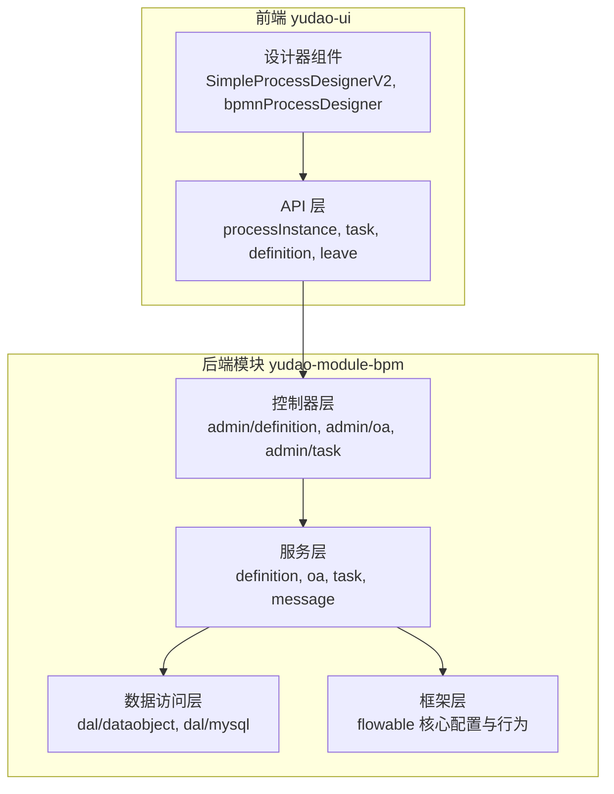
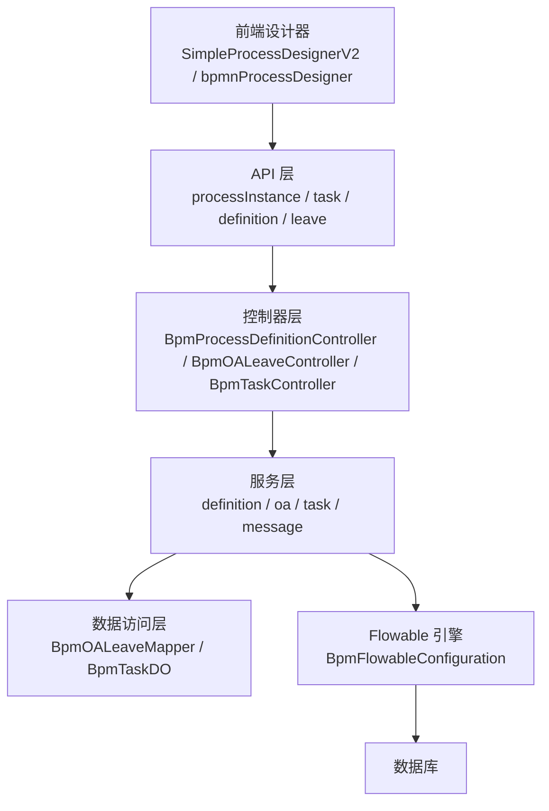
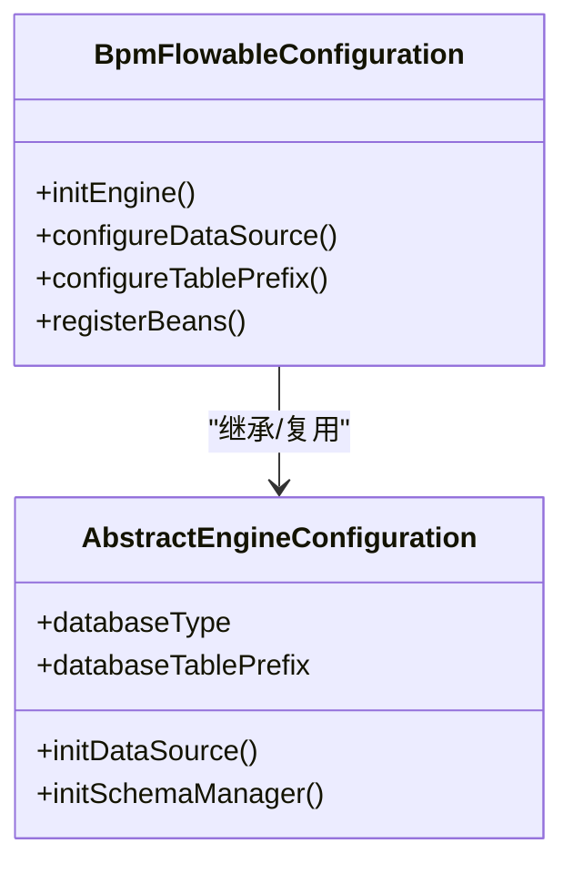
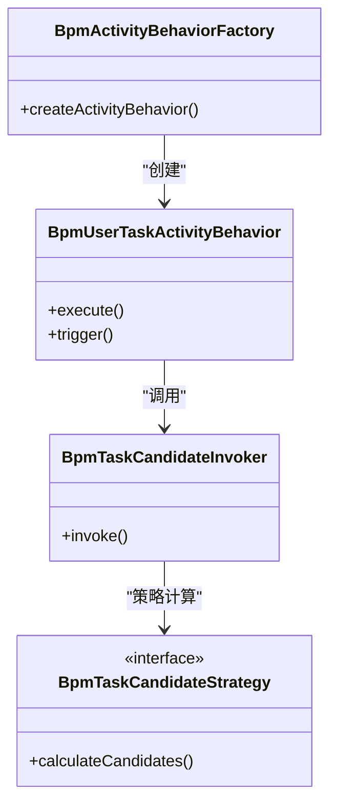
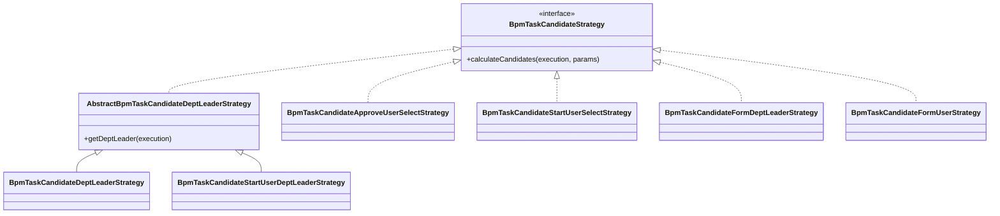
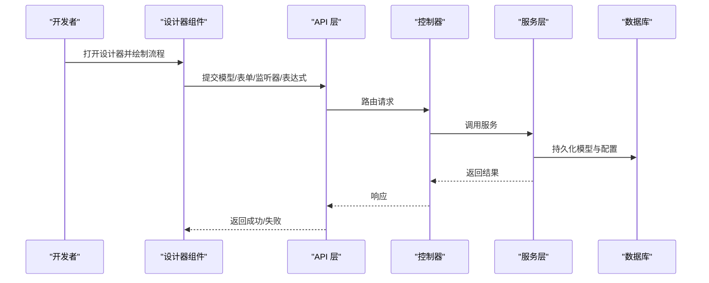
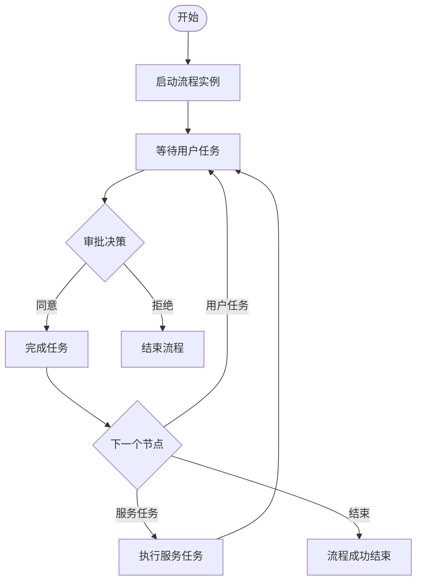
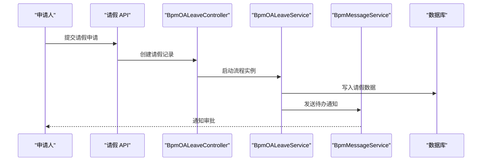
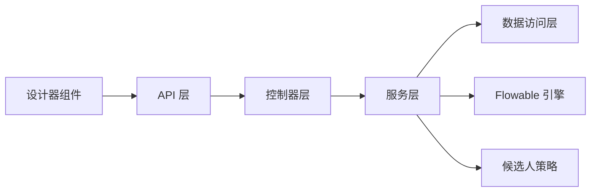

# 工作流程模块

<cite>
**本文引用的文件**
- [BpmFlowableConfiguration.java](file://yudao-module-bpm/src/main/java/cn/iocoder/yudao/module/bpm/framework/flowable/config/BpmFlowableConfiguration.java)
- [BpmActivityBehaviorFactory.java](file://yudao-module-bpm/src/main/java/cn/iocoder/yudao/module/bpm/framework/flowable/core/behavior/BpmActivityBehaviorFactory.java)
- [BpmUserTaskActivityBehavior.java](file://yudao-module-bpm/src/main/java/cn/iocoder/yudao/module/bpm/framework/flowable/core/behavior/BpmUserTaskActivityBehavior.java)
- [BpmTaskCandidateInvoker.java](file://yudao-module-bpm/src/main/java/cn/iocoder/yudao/module/bpm/framework/flowable/core/candidate/BpmTaskCandidateInvoker.java)
- [BpmTaskCandidateStrategy.java](file://yudao-module-bpm/src/main/java/cn/iocoder/yudao/module/bpm/framework/flowable/core/candidate/BpmTaskCandidateStrategy.java)
- [AbstractBpmTaskCandidateDeptLeaderStrategy.java](file://yudao-module-bpm/src/main/java/cn/iocoder/yudao/module/bpm/framework/flowable/core/candidate/strategy/dept/AbstractBpmTaskCandidateDeptLeaderStrategy.java)
- [BpmTaskCandidateDeptLeaderStrategy.java](file://yudao-module-bpm/src/main/java/cn/iocoder/yudao/module/bpm/framework/flowable/core/candidate/strategy/dept/BpmTaskCandidateDeptLeaderStrategy.java)
- [BpmTaskCandidateStartUserDeptLeaderStrategy.java](file://yudao-module-bpm/src/main/java/cn/iocoder/yudao/module/bpm/framework/flowable/core/candidate/strategy/dept/BpmTaskCandidateStartUserDeptLeaderStrategy.java)
- [BpmTaskCandidateApproveUserSelectStrategy.java](file://yudao-module-bpm/src/main/java/cn/iocoder/yudao/module/bpm/framework/flowable/core/candidate/strategy/dept/BpmTaskCandidateApproveUserSelectStrategy.java)
- [BpmTaskCandidateStartUserSelectStrategy.java](file://yudao-module-bpm/src/main/java/cn/iocoder/yudao/module/bpm/framework/flowable/core/candidate/strategy/dept/BpmTaskCandidateStartUserSelectStrategy.java)
- [BpmTaskCandidateFormDeptLeaderStrategy.java](file://yudao-module-bpm/src/main/java/cn/iocoder/yudao/module/bpm/framework/flowable/core/candidate/strategy/form/BpmTaskCandidateFormDeptLeaderStrategy.java)
- [BpmTaskCandidateFormUserStrategy.java](file://yudao-module-bpm/src/main/java/cn/iocoder/yudao/module/bpm/framework/flowable/core/candidate/strategy/form/BpmTaskCandidateFormUserStrategy.java)
- [BpmOALeaveController.java](file://yudao-module-bpm/src/main/java/cn/iocoder/yudao/module/bpm/controller/admin/oa/BpmOALeaveController.java)
- [BpmOALeaveService.java](file://yudao-module-bpm/src/main/java/cn/iocoder/yudao/module/bpm/service/oa/BpmOALeaveService.java)
- [BpmOALeaveServiceImpl.java](file://yudao-module-bpm/src/main/java/cn/iocoder/yudao/module/bpm/service/oa/BpmOALeaveServiceImpl.java)
- [BpmOALeaveDO.java](file://yudao-module-bpm/src/main/java/cn/iocoder/yudao/module/bpm/dal/dataobject/oa/BpmOALeaveDO.java)
- [BpmOALeaveMapper.java](file://yudao-module-bpm/src/main/java/cn/iocoder/yudao/module/bpm/dal/mysql/oa/BpmOALeaveMapper.java)
- [BpmOALeaveStatusListener.java](file://yudao-module-bpm/src/main/java/cn/iocoder/yudao/module/bpm/service/oa/listener/BpmOALeaveStatusListener.java)
- [BpmProcessDefinitionController.java](file://yudao-module-bpm/src/main/java/cn/iocoder/yudao/module/bpm/controller/admin/definition/BpmProcessDefinitionController.java)
- [BpmModelController.java](file://yudao-module-bpm/src/main/java/cn/iocoder/yudao/module/bpm/controller/admin/definition/BpmModelController.java)
- [BpmFormController.java](file://yudao-module-bpm/src/main/java/cn/iocoder/yudao/module/bpm/controller/admin/definition/BpmFormController.java)
- [BpmFormSaveReqVO.java](file://yudao-module-bpm/src/main/java/cn/iocoder/yudao/module/bpm/controller/admin/definition/vo/form/BpmFormSaveReqVO.java)
- [BpmFormRespVO.java](file://yudao-module-bpm/src/main/java/cn/iocoder/yudao/module/bpm/controller/admin/definition/vo/form/BpmFormRespVO.java)
- [BpmProcessExpressionController.java](file://yudao-module-bpm/src/main/java/cn/iocoder/yudao/module/bpm/controller/admin/definition/BpmProcessExpressionController.java)
- [BpmProcessListenerController.java](file://yudao-module-bpm/src/main/java/cn/iocoder/yudao/module/bpm/controller/admin/definition/BpmProcessListenerController.java)
- [BpmTaskController.java](file://yudao-module-bpm/src/main/java/cn/iocoder/yudao/module/bpm/controller/admin/task/BpmTaskController.java)
- [BpmTaskService.java](file://yudao-module-bpm/src/main/java/cn/iocoder/yudao/module/bpm/service/task/BpmTaskService.java)
- [BpmTaskServiceImpl.java](file://yudao-module-bpm/src/main/java/cn/iocoder/yudao/module/bpm/service/task/BpmTaskServiceImpl.java)
- [BpmTaskDO.java](file://yudao-module-bpm/src/main/java/cn/iocoder/yudao/module/bpm/dal/dataobject/task/BpmTaskDO.java)
- [BpmMessageService.java](file://yudao-module-bpm/src/main/java/cn/iocoder/yudao/module/bpm/service/message/BpmMessageService.java)
- [BpmMessageServiceImpl.java](file://yudao-module-bpm/src/main/java/cn/iocoder/yudao/module/bpm/service/message/BpmMessageServiceImpl.java)
- [SimpleProcessDesignerV2.vue](file://yudao-ui/yudao-ui-admin-vue3/src/components/SimpleProcessDesignerV2/index.vue)
- [bpmnProcessDesigner.vue](file://yudao-ui/yudao-ui-admin-vue3/src/components/bpmnProcessDesigner/index.vue)
- [processInstance.api.ts](file://yudao-ui/yudao-ui-admin-vue3/src/api/bpm/processInstance/)
- [task.api.ts](file://yudao-ui/yudao-ui-admin-vue3/src/api/bpm/task/)
- [definition.api.ts](file://yudao-ui/yudao-ui-admin-vue3/src/api/bpm/definition/)
- [leave.api.ts](file://yudao-ui/yudao-ui-admin-vue3/src/api/bpm/leave/)
- [AbstractEngineConfiguration.java](file://sql/dm/flowable-patch/src/main/java/org/flowable/common/engine/impl/AbstractEngineConfiguration.java)
</cite>

## 目录
1. [引言](#引言)
2. [项目结构](#项目结构)
3. [核心组件](#核心组件)
4. [架构总览](#架构总览)
5. [详细组件分析](#详细组件分析)
6. [依赖关系分析](#依赖关系分析)
7. [性能考虑](#性能考虑)
8. [故障排查指南](#故障排查指南)
9. [结论](#结论)
10. [附录](#附录)

## 引言
本开发指南面向希望在 RuoYi-Vue-Pro 中集成与扩展工作流能力的开发者，系统性讲解 Flowable 工作流引擎的集成与配置、流程定义与实例管理、任务处理机制、流程设计器使用、流程生命周期、OA 请假流程实现、监控与统计、API 接口规范以及与业务系统的集成方法。文档以代码为依据，结合可视化图表帮助读者快速上手并深入理解。

## 项目结构
工作流模块位于 yudao-module-bpm，采用分层架构：控制器层（controller）、服务层（service）、数据访问层（dal）、框架层（framework），并配套前端设计器组件与 API 调用。

**图表来源**
- [BpmFlowableConfiguration.java](file://yudao-module-bpm/src/main/java/cn/iocoder/yudao/module/bpm/framework/flowable/config/BpmFlowableConfiguration.java)
- [BpmProcessDefinitionController.java](file://yudao-module-bpm/src/main/java/cn/iocoder/yudao/module/bpm/controller/admin/definition/BpmProcessDefinitionController.java)
- [BpmOALeaveController.java](file://yudao-module-bpm/src/main/java/cn/iocoder/yudao/module/bpm/controller/admin/oa/BpmOALeaveController.java)
- [SimpleProcessDesignerV2.vue](file://yudao-ui/yudao-ui-admin-vue3/src/components/SimpleProcessDesignerV2/index.vue)
- [bpmnProcessDesigner.vue](file://yudao-ui/yudao-ui-admin-vue3/src/components/bpmnProcessDesigner/index.vue)

**章节来源**
- [BpmFlowableConfiguration.java](file://yudao-module-bpm/src/main/java/cn/iocoder/yudao/module/bpm/framework/flowable/config/BpmFlowableConfiguration.java)
- [BpmProcessDefinitionController.java](file://yudao-module-bpm/src/main/java/cn/iocoder/yudao/module/bpm/controller/admin/definition/BpmProcessDefinitionController.java)
- [BpmOALeaveController.java](file://yudao-module-bpm/src/main/java/cn/iocoder/yudao/module/bpm/controller/admin/oa/BpmOALeaveController.java)

## 核心组件
- Flowable 集成配置：通过自定义配置类加载 Flowable 引擎，设置表前缀、数据库方言、租户策略等，确保与多租户与表结构兼容。
- 流程行为工厂与用户任务行为：扩展 Activity 行为工厂，定制用户任务行为，支持复杂审批逻辑与候选人计算策略。
- 候选人策略体系：基于部门领导、发起人部门领导、表单字段、人工选择等多种策略，动态确定下一审批人。
- OA 请假流程：提供请假流程的定义、表单、状态监听与业务数据持久化。
- 控制器与服务：提供流程定义、模型、表单、表达式、监听器、任务、消息等管理接口与实现。
- 前端设计器：提供简单流程设计器与 BPMN 设计器组件，支撑流程图设计、节点配置、表单绑定与监听器设置。

**章节来源**
- [BpmFlowableConfiguration.java](file://yudao-module-bpm/src/main/java/cn/iocoder/yudao/module/bpm/framework/flowable/config/BpmFlowableConfiguration.java)
- [BpmActivityBehaviorFactory.java](file://yudao-module-bpm/src/main/java/cn/iocoder/yudao/module/bpm/framework/flowable/core/behavior/BpmActivityBehaviorFactory.java)
- [BpmUserTaskActivityBehavior.java](file://yudao-module-bpm/src/main/java/cn/iocoder/yudao/module/bpm/framework/flowable/core/behavior/BpmUserTaskActivityBehavior.java)
- [BpmTaskCandidateInvoker.java](file://yudao-module-bpm/src/main/java/cn/iocoder/yudao/module/bpm/framework/flowable/core/candidate/BpmTaskCandidateInvoker.java)
- [BpmTaskCandidateStrategy.java](file://yudao-module-bpm/src/main/java/cn/iocoder/yudao/module/bpm/framework/flowable/core/candidate/BpmTaskCandidateStrategy.java)

## 架构总览
下图展示了从前端设计器到后端控制器、服务与 Flowable 引擎的整体交互：

**图表来源**
- [SimpleProcessDesignerV2.vue](file://yudao-ui/yudao-ui-admin-vue3/src/components/SimpleProcessDesignerV2/index.vue)
- [bpmnProcessDesigner.vue](file://yudao-ui/yudao-ui-admin-vue3/src/components/bpmnProcessDesigner/index.vue)
- [processInstance.api.ts](file://yudao-ui/yudao-ui-admin-vue3/src/api/bpm/processInstance/)
- [task.api.ts](file://yudao-ui/yudao-ui-admin-vue3/src/api/bpm/task/)
- [definition.api.ts](file://yudao-ui/yudao-ui-admin-vue3/src/api/bpm/definition/)
- [leave.api.ts](file://yudao-ui/yudao-ui-admin-vue3/src/api/bpm/leave/)
- [BpmProcessDefinitionController.java](file://yudao-module-bpm/src/main/java/cn/iocoder/yudao/module/bpm/controller/admin/definition/BpmProcessDefinitionController.java)
- [BpmOALeaveController.java](file://yudao-module-bpm/src/main/java/cn/iocoder/yudao/module/bpm/controller/admin/oa/BpmOALeaveController.java)
- [BpmTaskController.java](file://yudao-module-bpm/src/main/java/cn/iocoder/yudao/module/bpm/controller/admin/task/BpmTaskController.java)
- [BpmFlowableConfiguration.java](file://yudao-module-bpm/src/main/java/cn/iocoder/yudao/module/bpm/framework/flowable/config/BpmFlowableConfiguration.java)

## 详细组件分析

### Flowable 集成与配置
- 自定义配置类负责初始化 Flowable 引擎，设置数据库连接、表前缀、方言、租户策略、Bean 注册等，确保与现有数据库与多租户架构兼容。
- 针对不同数据库类型（如 DM）提供补丁类，保证引擎在特定数据库上的正确运行。

**图表来源**
- [BpmFlowableConfiguration.java](file://yudao-module-bpm/src/main/java/cn/iocoder/yudao/module/bpm/framework/flowable/config/BpmFlowableConfiguration.java)
- [AbstractEngineConfiguration.java](file://sql/dm/flowable-patch/src/main/java/org/flowable/common/engine/impl/AbstractEngineConfiguration.java)

**章节来源**
- [BpmFlowableConfiguration.java](file://yudao-module-bpm/src/main/java/cn/iocoder/yudao/module/bpm/framework/flowable/config/BpmFlowableConfiguration.java)
- [AbstractEngineConfiguration.java](file://sql/dm/flowable-patch/src/main/java/org/flowable/common/engine/impl/AbstractEngineConfiguration.java)

### 流程行为与用户任务
- Activity 行为工厂用于扩展 Flowable 的默认行为，支持自定义用户任务行为、并行/串行多实例行为等。
- 用户任务行为可与候选人策略联动，实现自动/半自动的审批人分配。

**图表来源**
- [BpmActivityBehaviorFactory.java](file://yudao-module-bpm/src/main/java/cn/iocoder/yudao/module/bpm/framework/flowable/core/behavior/BpmActivityBehaviorFactory.java)
- [BpmUserTaskActivityBehavior.java](file://yudao-module-bpm/src/main/java/cn/iocoder/yudao/module/bpm/framework/flowable/core/behavior/BpmUserTaskActivityBehavior.java)
- [BpmTaskCandidateInvoker.java](file://yudao-module-bpm/src/main/java/cn/iocoder/yudao/module/bpm/framework/flowable/core/candidate/BpmTaskCandidateInvoker.java)
- [BpmTaskCandidateStrategy.java](file://yudao-module-bpm/src/main/java/cn/iocoder/yudao/module/bpm/framework/flowable/core/candidate/BpmTaskCandidateStrategy.java)

**章节来源**
- [BpmActivityBehaviorFactory.java](file://yudao-module-bpm/src/main/java/cn/iocoder/yudao/module/bpm/framework/flowable/core/behavior/BpmActivityBehaviorFactory.java)
- [BpmUserTaskActivityBehavior.java](file://yudao-module-bpm/src/main/java/cn/iocoder/yudao/module/bpm/framework/flowable/core/behavior/BpmUserTaskActivityBehavior.java)
- [BpmTaskCandidateInvoker.java](file://yudao-module-bpm/src/main/java/cn/iocoder/yudao/module/bpm/framework/flowable/core/candidate/BpmTaskCandidateInvoker.java)
- [BpmTaskCandidateStrategy.java](file://yudao-module-bpm/src/main/java/cn/iocoder/yudao/module/bpm/framework/flowable/core/candidate/BpmTaskCandidateStrategy.java)

### 候选人策略体系
- 部门领导策略：支持普通部门领导、发起人部门领导、多级领导等策略。
- 表单字段策略：根据表单字段值动态选择审批人或部门领导。
- 人工选择策略：允许用户在流程中手动选择审批人。
- 策略抽象与实现：通过抽象基类与具体策略类实现灵活组合。

**图表来源**
- [BpmTaskCandidateStrategy.java](file://yudao-module-bpm/src/main/java/cn/iocoder/yudao/module/bpm/framework/flowable/core/candidate/BpmTaskCandidateStrategy.java)
- [AbstractBpmTaskCandidateDeptLeaderStrategy.java](file://yudao-module-bpm/src/main/java/cn/iocoder/yudao/module/bpm/framework/flowable/core/candidate/strategy/dept/AbstractBpmTaskCandidateDeptLeaderStrategy.java)
- [BpmTaskCandidateDeptLeaderStrategy.java](file://yudao-module-bpm/src/main/java/cn/iocoder/yudao/module/bpm/framework/flowable/core/candidate/strategy/dept/BpmTaskCandidateDeptLeaderStrategy.java)
- [BpmTaskCandidateStartUserDeptLeaderStrategy.java](file://yudao-module-bpm/src/main/java/cn/iocoder/yudao/module/bpm/framework/flowable/core/candidate/strategy/dept/BpmTaskCandidateStartUserDeptLeaderStrategy.java)
- [BpmTaskCandidateApproveUserSelectStrategy.java](file://yudao-module-bpm/src/main/java/cn/iocoder/yudao/module/bpm/framework/flowable/core/candidate/strategy/dept/BpmTaskCandidateApproveUserSelectStrategy.java)
- [BpmTaskCandidateStartUserSelectStrategy.java](file://yudao-module-bpm/src/main/java/cn/iocoder/yudao/module/bpm/framework/flowable/core/candidate/strategy/dept/BpmTaskCandidateStartUserSelectStrategy.java)
- [BpmTaskCandidateFormDeptLeaderStrategy.java](file://yudao-module-bpm/src/main/java/cn/iocoder/yudao/module/bpm/framework/flowable/core/candidate/strategy/form/BpmTaskCandidateFormDeptLeaderStrategy.java)
- [BpmTaskCandidateFormUserStrategy.java](file://yudao-module-bpm/src/main/java/cn/iocoder/yudao/module/bpm/framework/flowable/core/candidate/strategy/form/BpmTaskCandidateFormUserStrategy.java)

**章节来源**
- [BpmTaskCandidateStrategy.java](file://yudao-module-bpm/src/main/java/cn/iocoder/yudao/module/bpm/framework/flowable/core/candidate/BpmTaskCandidateStrategy.java)
- [AbstractBpmTaskCandidateDeptLeaderStrategy.java](file://yudao-module-bpm/src/main/java/cn/iocoder/yudao/module/bpm/framework/flowable/core/candidate/strategy/dept/AbstractBpmTaskCandidateDeptLeaderStrategy.java)
- [BpmTaskCandidateDeptLeaderStrategy.java](file://yudao-module-bpm/src/main/java/cn/iocoder/yudao/module/bpm/framework/flowable/core/candidate/strategy/dept/BpmTaskCandidateDeptLeaderStrategy.java)
- [BpmTaskCandidateStartUserDeptLeaderStrategy.java](file://yudao-module-bpm/src/main/java/cn/iocoder/yudao/module/bpm/framework/flowable/core/candidate/strategy/dept/BpmTaskCandidateStartUserDeptLeaderStrategy.java)
- [BpmTaskCandidateApproveUserSelectStrategy.java](file://yudao-module-bpm/src/main/java/cn/iocoder/yudao/module/bpm/framework/flowable/core/candidate/strategy/dept/BpmTaskCandidateApproveUserSelectStrategy.java)
- [BpmTaskCandidateStartUserSelectStrategy.java](file://yudao-module-bpm/src/main/java/cn/iocoder/yudao/module/bpm/framework/flowable/core/candidate/strategy/dept/BpmTaskCandidateStartUserSelectStrategy.java)
- [BpmTaskCandidateFormDeptLeaderStrategy.java](file://yudao-module-bpm/src/main/java/cn/iocoder/yudao/module/bpm/framework/flowable/core/candidate/strategy/form/BpmTaskCandidateFormDeptLeaderStrategy.java)
- [BpmTaskCandidateFormUserStrategy.java](file://yudao-module-bpm/src/main/java/cn/iocoder/yudao/module/bpm/framework/flowable/core/candidate/strategy/form/BpmTaskCandidateFormUserStrategy.java)

### 流程设计器使用
- 简单流程设计器：提供基础流程图绘制、节点拖拽、连线、属性配置与保存。
- BPMN 设计器：支持标准 BPMN 图设计，节点配置、表单绑定、监听器设置、表达式配置。
- 设计器与 API：前端组件通过 API 层提交流程模型、表单、监听器与表达式配置，后端进行持久化与发布。

**图表来源**
- [SimpleProcessDesignerV2.vue](file://yudao-ui/yudao-ui-admin-vue3/src/components/SimpleProcessDesignerV2/index.vue)
- [bpmnProcessDesigner.vue](file://yudao-ui/yudao-ui-admin-vue3/src/components/bpmnProcessDesigner/index.vue)
- [definition.api.ts](file://yudao-ui/yudao-ui-admin-vue3/src/api/bpm/definition/)
- [BpmProcessDefinitionController.java](file://yudao-module-bpm/src/main/java/cn/iocoder/yudao/module/bpm/controller/admin/definition/BpmProcessDefinitionController.java)

**章节来源**
- [SimpleProcessDesignerV2.vue](file://yudao-ui/yudao-ui-admin-vue3/src/components/SimpleProcessDesignerV2/index.vue)
- [bpmnProcessDesigner.vue](file://yudao-ui/yudao-ui-admin-vue3/src/components/bpmnProcessDesigner/index.vue)
- [definition.api.ts](file://yudao-ui/yudao-ui-admin-vue3/src/api/bpm/definition/)

### 流程生命周期与任务处理
- 流程启动：通过流程定义 ID 或 Key 启动流程实例，传入业务参数与发起人。
- 任务审批：查询待办/已办任务，支持同意、拒绝、转办、委派等操作。
- 节点跳转：通过监听器、表达式或服务任务控制流程走向。
- 流程终止：支持撤销、终止流程实例。

**图表来源**
- [BpmTaskController.java](file://yudao-module-bpm/src/main/java/cn/iocoder/yudao/module/bpm/controller/admin/task/BpmTaskController.java)
- [BpmTaskService.java](file://yudao-module-bpm/src/main/java/cn/iocoder/yudao/module/bpm/service/task/BpmTaskService.java)
- [BpmTaskServiceImpl.java](file://yudao-module-bpm/src/main/java/cn/iocoder/yudao/module/bpm/service/task/BpmTaskServiceImpl.java)

**章节来源**
- [BpmTaskController.java](file://yudao-module-bpm/src/main/java/cn/iocoder/yudao/module/bpm/controller/admin/task/BpmTaskController.java)
- [BpmTaskService.java](file://yudao-module-bpm/src/main/java/cn/iocoder/yudao/module/bpm/service/task/BpmTaskService.java)
- [BpmTaskServiceImpl.java](file://yudao-module-bpm/src/main/java/cn/iocoder/yudao/module/bpm/service/task/BpmTaskServiceImpl.java)

### OA 请假流程实现
- 流程配置：定义请假流程模型，配置用户任务节点、候选人策略、监听器。
- 表单设计：通过表单控制器与 VO 定义表单字段，支持动态表单与校验。
- 审批规则：基于候选人策略与业务规则自动/半自动分配审批人。
- 统计分析：通过消息服务与统计数据接口进行流程统计与报表。

**图表来源**
- [BpmOALeaveController.java](file://yudao-module-bpm/src/main/java/cn/iocoder/yudao/module/bpm/controller/admin/oa/BpmOALeaveController.java)
- [BpmOALeaveService.java](file://yudao-module-bpm/src/main/java/cn/iocoder/yudao/module/bpm/service/oa/BpmOALeaveService.java)
- [BpmOALeaveServiceImpl.java](file://yudao-module-bpm/src/main/java/cn/iocoder/yudao/module/bpm/service/oa/BpmOALeaveServiceImpl.java)
- [BpmOALeaveDO.java](file://yudao-module-bpm/src/main/java/cn/iocoder/yudao/module/bpm/dal/dataobject/oa/BpmOALeaveDO.java)
- [BpmOALeaveMapper.java](file://yudao-module-bpm/src/main/java/cn/iocoder/yudao/module/bpm/dal/mysql/oa/BpmOALeaveMapper.java)
- [BpmOALeaveStatusListener.java](file://yudao-module-bpm/src/main/java/cn/iocoder/yudao/module/bpm/service/oa/listener/BpmOALeaveStatusListener.java)
- [BpmMessageService.java](file://yudao-module-bpm/src/main/java/cn/iocoder/yudao/module/bpm/service/message/BpmMessageService.java)
- [BpmMessageServiceImpl.java](file://yudao-module-bpm/src/main/java/cn/iocoder/yudao/module/bpm/service/message/BpmMessageServiceImpl.java)

**章节来源**
- [BpmOALeaveController.java](file://yudao-module-bpm/src/main/java/cn/iocoder/yudao/module/bpm/controller/admin/oa/BpmOALeaveController.java)
- [BpmOALeaveService.java](file://yudao-module-bpm/src/main/java/cn/iocoder/yudao/module/bpm/service/oa/BpmOALeaveService.java)
- [BpmOALeaveServiceImpl.java](file://yudao-module-bpm/src/main/java/cn/iocoder/yudao/module/bpm/service/oa/BpmOALeaveServiceImpl.java)
- [BpmOALeaveDO.java](file://yudao-module-bpm/src/main/java/cn/iocoder/yudao/module/bpm/dal/dataobject/oa/BpmOALeaveDO.java)
- [BpmOALeaveMapper.java](file://yudao-module-bpm/src/main/java/cn/iocoder/yudao/module/bpm/dal/mysql/oa/BpmOALeaveMapper.java)
- [BpmOALeaveStatusListener.java](file://yudao-module-bpm/src/main/java/cn/iocoder/yudao/module/bpm/service/oa/listener/BpmOALeaveStatusListener.java)
- [BpmMessageService.java](file://yudao-module-bpm/src/main/java/cn/iocoder/yudao/module/bpm/service/message/BpmMessageService.java)
- [BpmMessageServiceImpl.java](file://yudao-module-bpm/src/main/java/cn/iocoder/yudao/module/bpm/service/message/BpmMessageServiceImpl.java)

### 流程监控与统计
- 实例跟踪：通过流程实例查询接口查看运行状态、耗时、当前节点等。
- 性能分析：结合日志与指标监控流程执行性能，定位瓶颈。
- 异常处理：监听器与服务层统一捕获异常，记录错误日志并回滚或补偿。

**章节来源**
- [BpmProcessDefinitionController.java](file://yudao-module-bpm/src/main/java/cn/iocoder/yudao/module/bpm/controller/admin/definition/BpmProcessDefinitionController.java)
- [BpmTaskController.java](file://yudao-module-bpm/src/main/java/cn/iocoder/yudao/module/bpm/controller/admin/task/BpmTaskController.java)

### API 接口文档
以下为关键 API 的职责与调用流程（以路径代替具体代码）：

- 流程定义管理
  - POST /admin/bpm/process-definition/create：创建流程定义
  - GET /admin/bpm/process-definition/page：分页查询流程定义
  - GET /admin/bpm/process-definition/get：获取流程定义详情
  - DELETE /admin/bpm/process-definition/delete：删除流程定义
  - POST /admin/bpm/process-definition/deploy：部署流程定义
  - GET /admin/bpm/process-definition/list-form-fields：获取表单字段
  - POST /admin/bpm/process-definition/save-form：保存表单配置
  - GET /admin/bpm/process-definition/get-form：获取表单配置

- 流程启动
  - POST /admin/bpm/process-instance/start：启动流程实例
  - GET /admin/bpm/process-instance/page：分页查询流程实例
  - GET /admin/bpm/process-instance/detail：获取流程实例详情
  - POST /admin/bpm/process-instance/terminate：终止流程实例

- 任务审批
  - GET /admin/bpm/task/todo-page：待办任务分页
  - GET /admin/bpm/task/done-page：已办任务分页
  - POST /admin/bpm/task/approve：审批通过
  - POST /admin/bpm/task/reject：审批拒绝
  - POST /admin/bpm/task/transfer：转办
  - POST /admin/bpm/task/delegate：委派

- OA 请假
  - POST /admin/bpm/leave/create：创建请假申请
  - GET /admin/bpm/leave/page：请假申请分页
  - GET /admin/bpm/leave/detail：请假申请详情

- 表单与监听器
  - POST /admin/bpm/process-listener/save：保存流程监听器
  - GET /admin/bpm/process-listener/page：分页查询监听器
  - POST /admin/bpm/process-expression/save：保存流程表达式
  - GET /admin/bpm/process-expression/page：分页查询表达式

**章节来源**
- [BpmProcessDefinitionController.java](file://yudao-module-bpm/src/main/java/cn/iocoder/yudao/module/bpm/controller/admin/definition/BpmProcessDefinitionController.java)
- [BpmModelController.java](file://yudao-module-bpm/src/main/java/cn/iocoder/yudao/module/bpm/controller/admin/definition/BpmModelController.java)
- [BpmFormController.java](file://yudao-module-bpm/src/main/java/cn/iocoder/yudao/module/bpm/controller/admin/definition/BpmFormController.java)
- [BpmProcessExpressionController.java](file://yudao-module-bpm/src/main/java/cn/iocoder/yudao/module/bpm/controller/admin/definition/BpmProcessExpressionController.java)
- [BpmProcessListenerController.java](file://yudao-module-bpm/src/main/java/cn/iocoder/yudao/module/bpm/controller/admin/definition/BpmProcessListenerController.java)
- [BpmTaskController.java](file://yudao-module-bpm/src/main/java/cn/iocoder/yudao/module/bpm/controller/admin/task/BpmTaskController.java)
- [BpmOALeaveController.java](file://yudao-module-bpm/src/main/java/cn/iocoder/yudao/module/bpm/controller/admin/oa/BpmOALeaveController.java)

## 依赖关系分析
- 控制器依赖服务层；服务层依赖数据访问层与 Flowable 引擎；前端设计器通过 API 层与后端交互。
- 候选人策略通过 Invoker 与 Strategy 解耦，便于扩展新策略。
- 表单与监听器作为流程配置的一部分，通过控制器与服务层进行统一管理。

**图表来源**
- [BpmTaskCandidateInvoker.java](file://yudao-module-bpm/src/main/java/cn/iocoder/yudao/module/bpm/framework/flowable/core/candidate/BpmTaskCandidateInvoker.java)
- [BpmTaskCandidateStrategy.java](file://yudao-module-bpm/src/main/java/cn/iocoder/yudao/module/bpm/framework/flowable/core/candidate/BpmTaskCandidateStrategy.java)
- [BpmFlowableConfiguration.java](file://yudao-module-bpm/src/main/java/cn/iocoder/yudao/module/bpm/framework/flowable/config/BpmFlowableConfiguration.java)

**章节来源**
- [BpmTaskCandidateInvoker.java](file://yudao-module-bpm/src/main/java/cn/iocoder/yudao/module/bpm/framework/flowable/core/candidate/BpmTaskCandidateInvoker.java)
- [BpmTaskCandidateStrategy.java](file://yudao-module-bpm/src/main/java/cn/iocoder/yudao/module/bpm/framework/flowable/core/candidate/BpmTaskCandidateStrategy.java)
- [BpmFlowableConfiguration.java](file://yudao-module-bpm/src/main/java/cn/iocoder/yudao/module/bpm/framework/flowable/config/BpmFlowableConfiguration.java)

## 性能考虑
- 表前缀与多租户：通过配置表前缀与租户策略避免跨租户数据干扰，提升查询效率。
- 任务批量处理：在高并发场景下，合理分页与批量查询任务，减少数据库压力。
- 监听器与服务任务：避免在监听器中执行耗时操作，必要时异步化处理。
- 数据库连接池：合理配置连接池大小与超时时间，防止连接泄漏。

## 故障排查指南
- 流程无法启动：检查流程定义是否已部署、参数是否正确、候选人策略是否返回审批人。
- 任务无法审批：确认任务是否存在、是否被他人占用、权限是否足够。
- 候选人策略异常：检查策略实现是否正确、部门/用户信息是否完整。
- 监听器报错：查看监听器日志，确认监听器注册与执行顺序是否正确。
- 数据库问题：核对表前缀与方言配置，确保 Flowable 表存在且版本匹配。

**章节来源**
- [BpmOALeaveStatusListener.java](file://yudao-module-bpm/src/main/java/cn/iocoder/yudao/module/bpm/service/oa/listener/BpmOALeaveStatusListener.java)
- [BpmTaskServiceImpl.java](file://yudao-module-bpm/src/main/java/cn/iocoder/yudao/module/bpm/service/task/BpmTaskServiceImpl.java)

## 结论
本指南基于 RuoYi-Vue-Pro 的工作流模块，系统介绍了 Flowable 集成、流程设计、任务处理、OA 请假流程、监控统计与 API 使用。通过清晰的架构与可扩展的候选人策略，开发者可以快速构建复杂业务流程并实现与业务系统的深度集成。

## 附录
- 开发建议：优先使用表单与监听器进行业务解耦；在高并发场景下注意异步化与缓存；完善异常处理与日志记录。
- 扩展方向：新增候选人策略、自定义监听器、流程统计报表、移动端审批等。