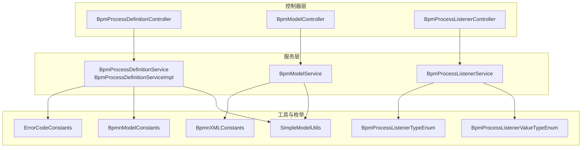
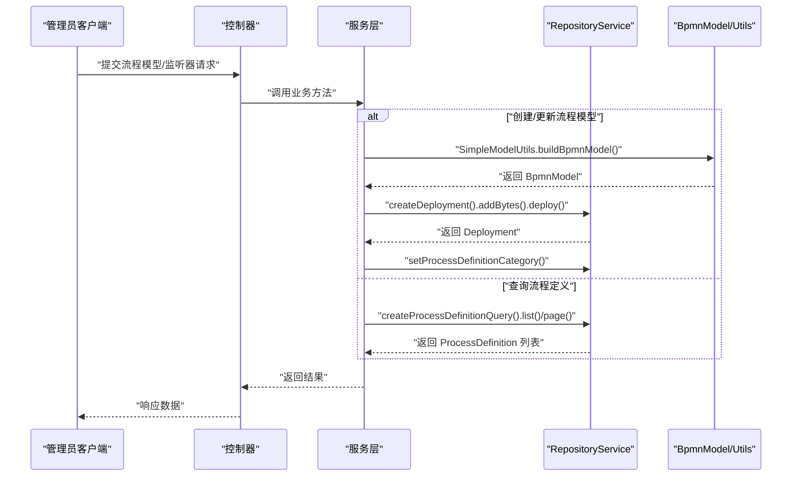
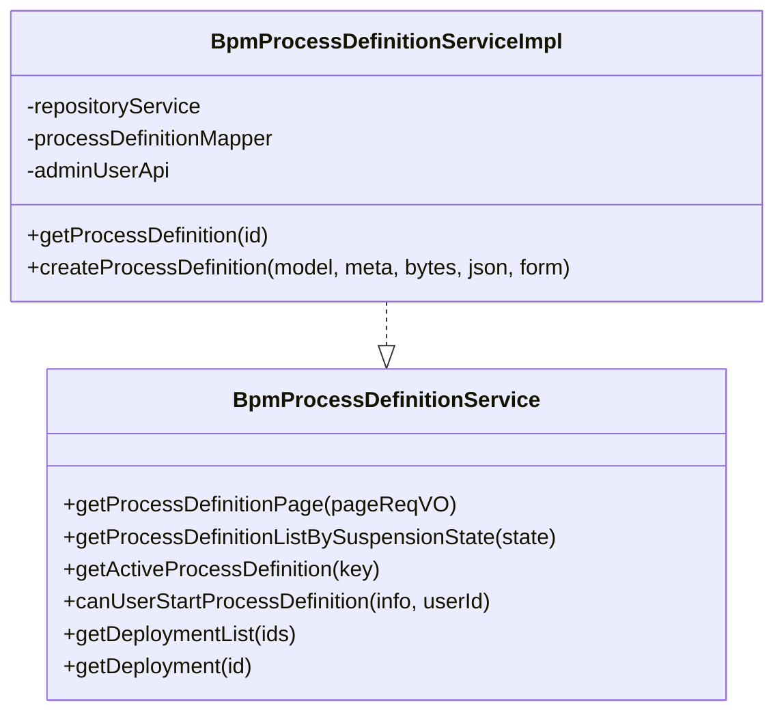
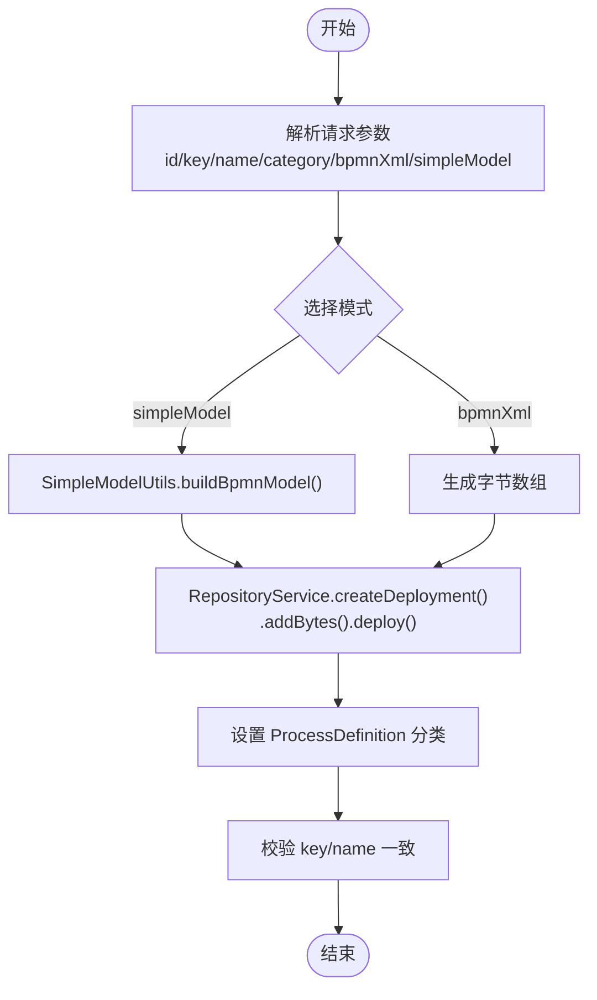
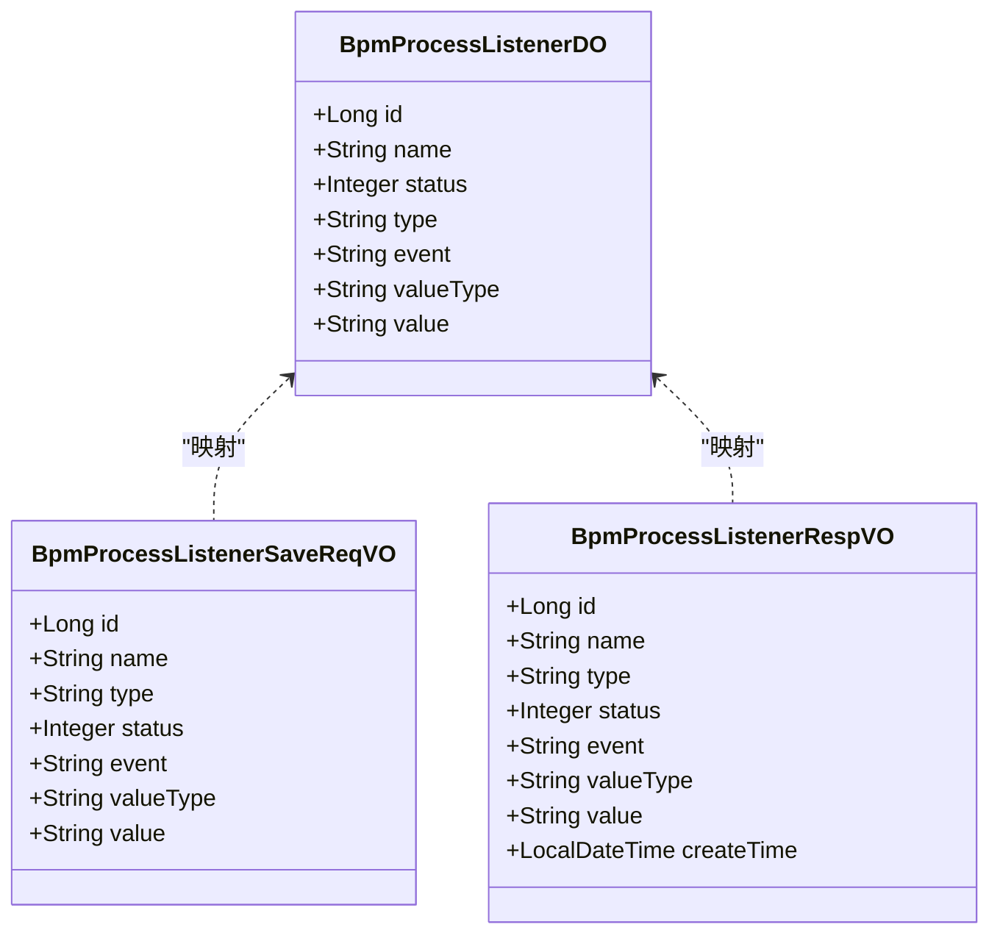
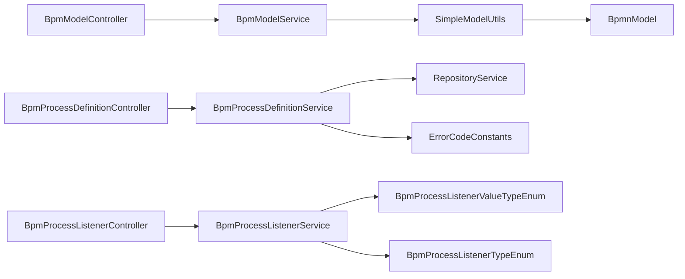

# 流程定义管理

<cite>
**本文引用的文件**
- [BpmProcessDefinitionServiceImpl.java](file://yudao-module-bpm/src/main/java/cn/iocoder/yudao/module/bpm/service/definition/BpmProcessDefinitionServiceImpl.java)
- [BpmProcessDefinitionService.java](file://yudao-module-bpm/src/main/java/cn/iocoder/yudao/module/bpm/service/definition/BpmProcessDefinitionService.java)
- [BpmProcessDefinitionController.java](file://yudao-module-bpm/src/main/java/cn/iocoder/yudao/module/bpm/controller/admin/definition/BpmProcessDefinitionController.java)
- [BpmModelController.java](file://yudao-module-bpm/src/main/java/cn/iocoder/yudao/module/bpm/controller/admin/definition/BpmModelController.java)
- [BpmModelService.java](file://yudao-module-bpm/src/main/java/cn/iocoder/yudao/module/bpm/service/definition/BpmModelService.java)
- [BpmProcessListenerController.java](file://yudao-module-bpm/src/main/java/cn/iocoder/yudao/module/bpm/controller/admin/definition/BpmProcessListenerController.java)
- [BpmProcessListenerService.java](file://yudao-module-bpm/src/main/java/cn/iocoder/yudao/module/bpm/service/definition/BpmProcessListenerService.java)
- [BpmProcessListenerDO.java](file://yudao-module-bpm/src/main/java/cn/iocoder/yudao/module/bpm/dal/dataobject/definition/BpmProcessListenerDO.java)
- [BpmProcessListenerSaveReqVO.java](file://yudao-module-bpm/src/main/java/cn/iocoder/yudao/module/bpm/controller/admin/definition/vo/listener/BpmProcessListenerSaveReqVO.java)
- [BpmProcessListenerRespVO.java](file://yudao-module-bpm/src/main/java/cn/iocoder/yudao/module/bpm/controller/admin/definition/vo/listener/BpmProcessListenerRespVO.java)
- [BpmModelSaveReqVO.java](file://yudao-module-bpm/src/main/java/cn/iocoder/yudao/module/bpm/controller/admin/definition/vo/model/BpmModelSaveReqVO.java)
- [BpmModeUpdateBpmnReqVO.java](file://yudao-module-bpm/src/main/java/cn/iocoder/yudao/module/bpm/controller/admin/definition/vo/model/BpmModeUpdateBpmnReqVO.java)
- [BpmFormFieldVO.java](file://yudao-module-bpm/src/main/java/cn/iocoder/yudao/module/bpm/controller/admin/definition/vo/form/BpmFormFieldVO.java)
- [SimpleModelUtils.java](file://yudao-module-bpm/src/main/java/cn/iocoder/yudao/module/bpm/framework/flowable/core/util/SimpleModelUtils.java)
- [BpmnModelConstants.java](file://yudao-module-bpm/src/main/java/cn/iocoder/yudao/module/bpm/framework/flowable/core/util/BpmnModelConstants.java)
- [BpmnXMLConstants.java](file://yudao-module-bpm/src/main/java/cn/iocoder/yudao/module/bpm/framework/flowable/core/util/BpmnXMLConstants.java)
- [ErrorCodeConstants.java](file://yudao-module-bpm/src/main/java/cn/iocoder/yudao/module/bpm/enums/ErrorCodeConstants.java)
- [BpmProcessListenerValueTypeEnum.java](file://yudao-module-bpm/src/main/java/cn/iocoder/yudao/module/bpm/enums/definition/BpmProcessListenerValueTypeEnum.java)
- [BpmProcessListenerTypeEnum.java](file://yudao-module-bpm/src/main/java/cn/iocoder/yudao/module/bpm/enums/definition/BpmProcessListenerTypeEnum.java)
- [BpmProcessDefinitionInfoDO.java](file://yudao-module-bpm/src/main/java/cn/iocoder/yudao/module/bpm/dal/dataobject/definition/BpmProcessDefinitionInfoDO.java)
- [BpmFormDO.java](file://yudao-module-bpm/src/main/java/cn/iocoder/yudao/module/bpm/dal/dataobject/definition/BpmFormDO.java)
- [BpmProcessDefinitionPageReqVO.java](file://yudao-module-bpm/src/main/java/cn/iocoder/yudao/module/bpm/controller/admin/definition/vo/process/BpmProcessDefinitionPageReqVO.java)
</cite>

## 目录
1. [引言](#引言)
2. [项目结构](#项目结构)
3. [核心组件](#核心组件)
4. [架构总览](#架构总览)
5. [详细组件分析](#详细组件分析)
6. [依赖关系分析](#依赖关系分析)
7. [性能考虑](#性能考虑)
8. [故障排查指南](#故障排查指南)
9. [结论](#结论)
10. [附录](#附录)

## 引言
本指南围绕 Flowable 流程定义的创建、部署与管理展开，结合后端服务层与前端组件，系统讲解 BPMN 模型设计、流程分类管理、流程表单绑定、流程监听器配置、版本控制与激活/停用/删除策略，并覆盖流程设计器的使用要点、BPMN 文件导入导出与 XML 解析、以及完整的 API 接口说明与实战示例。

## 项目结构
后端采用模块化组织，流程定义相关能力集中在 yudao-module-bpm 模块中，主要分为三层：
- 控制器层：对外暴露 REST API，如流程定义、流程模型、流程监听器等
- 服务层：封装业务逻辑，对接 Flowable RepositoryService、历史与运行时服务
- 工具与枚举：提供 BPMN 模型构建、常量与错误码等支撑

图表来源
- [BpmProcessDefinitionController.java](file://yudao-module-bpm/src/main/java/cn/iocoder/yudao/module/bpm/controller/admin/definition/BpmProcessDefinitionController.java)
- [BpmModelController.java](file://yudao-module-bpm/src/main/java/cn/iocoder/yudao/module/bpm/controller/admin/definition/BpmModelController.java)
- [BpmProcessListenerController.java](file://yudao-module-bpm/src/main/java/cn/iocoder/yudao/module/bpm/controller/admin/definition/BpmProcessListenerController.java)
- [BpmProcessDefinitionService.java](file://yudao-module-bpm/src/main/java/cn/iocoder/yudao/module/bpm/service/definition/BpmProcessDefinitionService.java)
- [BpmProcessDefinitionServiceImpl.java](file://yudao-module-bpm/src/main/java/cn/iocoder/yudao/module/bpm/service/definition/BpmProcessDefinitionServiceImpl.java)
- [BpmModelService.java](file://yudao-module-bpm/src/main/java/cn/iocoder/yudao/module/bpm/service/definition/BpmModelService.java)
- [SimpleModelUtils.java](file://yudao-module-bpm/src/main/java/cn/iocoder/yudao/module/bpm/framework/flowable/core/util/SimpleModelUtils.java)
- [BpmnModelConstants.java](file://yudao-module-bpm/src/main/java/cn/iocoder/yudao/module/bpm/framework/flowable/core/util/BpmnModelConstants.java)
- [BpmnXMLConstants.java](file://yudao-module-bpm/src/main/java/cn/iocoder/yudao/module/bpm/framework/flowable/core/util/BpmnXMLConstants.java)
- [BpmProcessListenerValueTypeEnum.java](file://yudao-module-bpm/src/main/java/cn/iocoder/yudao/module/bpm/enums/definition/BpmProcessListenerValueTypeEnum.java)
- [BpmProcessListenerTypeEnum.java](file://yudao-module-bpm/src/main/java/cn/iocoder/yudao/module/bpm/enums/definition/BpmProcessListenerTypeEnum.java)
- [ErrorCodeConstants.java](file://yudao-module-bpm/src/main/java/cn/iocoder/yudao/module/bpm/enums/ErrorCodeConstants.java)

章节来源
- [BpmProcessDefinitionController.java](file://yudao-module-bpm/src/main/java/cn/iocoder/yudao/module/bpm/controller/admin/definition/BpmProcessDefinitionController.java)
- [BpmModelController.java](file://yudao-module-bpm/src/main/java/cn/iocoder/yudao/module/bpm/controller/admin/definition/BpmModelController.java)
- [BpmProcessListenerController.java](file://yudao-module-bpm/src/main/java/cn/iocoder/yudao/module/bpm/controller/admin/definition/BpmProcessListenerController.java)

## 核心组件
- 流程定义服务：负责流程定义的查询、分页、激活/停用、部署、版本匹配校验等
- 流程模型服务：负责流程模型的创建、更新（含 BPMN XML）、简单模型转换为 BPMN
- 流程监听器服务：负责监听器的增删改查、状态管理与值类型配置
- 工具与常量：提供 BPMN 模型构建、命名空间与文件后缀常量
- 错误码：统一异常与错误提示

章节来源
- [BpmProcessDefinitionService.java](file://yudao-module-bpm/src/main/java/cn/iocoder/yudao/module/bpm/service/definition/BpmProcessDefinitionService.java)
- [BpmProcessDefinitionServiceImpl.java](file://yudao-module-bpm/src/main/java/cn/iocoder/yudao/module/bpm/service/definition/BpmProcessDefinitionServiceImpl.java)
- [BpmModelService.java](file://yudao-module-bpm/src/main/java/cn/iocoder/yudao/module/bpm/service/definition/BpmModelService.java)
- [SimpleModelUtils.java](file://yudao-module-bpm/src/main/java/cn/iocoder/yudao/module/bpm/framework/flowable/core/util/SimpleModelUtils.java)
- [BpmnModelConstants.java](file://yudao-module-bpm/src/main/java/cn/iocoder/yudao/module/bpm/framework/flowable/core/util/BpmnModelConstants.java)
- [BpmnXMLConstants.java](file://yudao-module-bpm/src/main/java/cn/iocoder/yudao/module/bpm/framework/flowable/core/util/BpmnXMLConstants.java)
- [ErrorCodeConstants.java](file://yudao-module-bpm/src/main/java/cn/iocoder/yudao/module/bpm/enums/ErrorCodeConstants.java)

## 架构总览
下图展示了从控制器到服务层再到 Flowable 引擎的调用链路，以及与 BPMN 模型构建、部署与查询的关系。

图表来源
- [BpmProcessDefinitionServiceImpl.java](file://yudao-module-bpm/src/main/java/cn/iocoder/yudao/module/bpm/service/definition/BpmProcessDefinitionServiceImpl.java)
- [SimpleModelUtils.java](file://yudao-module-bpm/src/main/java/cn/iocoder/yudao/module/bpm/framework/flowable/core/util/SimpleModelUtils.java)
- [BpmProcessDefinitionService.java](file://yudao-module-bpm/src/main/java/cn/iocoder/yudao/module/bpm/service/definition/BpmProcessDefinitionService.java)

## 详细组件分析

### 流程定义服务与控制器
- 查询与分页：支持按 SuspensionState 过滤、分页查询 ProcessDefinition
- 版本与激活：根据 key 获取激活的流程定义；支持对 Deployment 与 ProcessDefinition 的分类设置
- 部署与校验：创建 Deployment 并校验 key/name 一致性，确保查询与关联稳定
- 发起权限：基于用户与流程定义的可发起规则判断

图表来源
- [BpmProcessDefinitionService.java](file://yudao-module-bpm/src/main/java/cn/iocoder/yudao/module/bpm/service/definition/BpmProcessDefinitionService.java)
- [BpmProcessDefinitionServiceImpl.java](file://yudao-module-bpm/src/main/java/cn/iocoder/yudao/module/bpm/service/definition/BpmProcessDefinitionServiceImpl.java)

章节来源
- [BpmProcessDefinitionService.java](file://yudao-module-bpm/src/main/java/cn/iocoder/yudao/module/bpm/service/definition/BpmProcessDefinitionService.java)
- [BpmProcessDefinitionServiceImpl.java](file://yudao-module-bpm/src/main/java/cn/iocoder/yudao/module/bpm/service/definition/BpmProcessDefinitionServiceImpl.java)
- [BpmProcessDefinitionPageReqVO.java](file://yudao-module-bpm/src/main/java/cn/iocoder/yudao/module/bpm/controller/admin/definition/vo/process/BpmProcessDefinitionPageReqVO.java)

### 流程模型服务与设计器
- 模型创建：接收 BPMN XML 或“仿钉钉”简单模型，转换为 BpmnModel 并部署
- 模型更新：支持仅更新 BPMN XML
- 设计器要点：节点拖拽、连线配置、条件表达式、表单字段绑定

图表来源
- [BpmModelService.java](file://yudao-module-bpm/src/main/java/cn/iocoder/yudao/module/bpm/service/definition/BpmModelService.java)
- [BpmModelSaveReqVO.java](file://yudao-module-bpm/src/main/java/cn/iocoder/yudao/module/bpm/controller/admin/definition/vo/model/BpmModelSaveReqVO.java)
- [BpmModeUpdateBpmnReqVO.java](file://yudao-module-bpm/src/main/java/cn/iocoder/yudao/module/bpm/controller/admin/definition/vo/model/BpmModeUpdateBpmnReqVO.java)
- [SimpleModelUtils.java](file://yudao-module-bpm/src/main/java/cn/iocoder/yudao/module/bpm/framework/flowable/core/util/SimpleModelUtils.java)
- [BpmnModelConstants.java](file://yudao-module-bpm/src/main/java/cn/iocoder/yudao/module/bpm/framework/flowable/core/util/BpmnModelConstants.java)

章节来源
- [BpmModelService.java](file://yudao-module-bpm/src/main/java/cn/iocoder/yudao/module/bpm/service/definition/BpmModelService.java)
- [BpmModelSaveReqVO.java](file://yudao-module-bpm/src/main/java/cn/iocoder/yudao/module/bpm/controller/admin/definition/vo/model/BpmModelSaveReqVO.java)
- [BpmModeUpdateBpmnReqVO.java](file://yudao-module-bpm/src/main/java/cn/iocoder/yudao/module/bpm/controller/admin/definition/vo/model/BpmModeUpdateBpmnReqVO.java)
- [SimpleModelUtils.java](file://yudao-module-bpm/src/main/java/cn/iocoder/yudao/module/bpm/framework/flowable/core/util/SimpleModelUtils.java)

### 流程监听器服务
- 监听器类型与事件：支持 execution、task 两类监听器及对应事件
- 值类型：class、delegateExpression、expression
- 状态管理：启用/停用监听器
- 表单字段绑定：通过表单字段 VO 描述表单元素

图表来源
- [BpmProcessListenerDO.java](file://yudao-module-bpm/src/main/java/cn/iocoder/yudao/module/bpm/dal/dataobject/definition/BpmProcessListenerDO.java)
- [BpmProcessListenerSaveReqVO.java](file://yudao-module-bpm/src/main/java/cn/iocoder/yudao/module/bpm/controller/admin/definition/vo/listener/BpmProcessListenerSaveReqVO.java)
- [BpmProcessListenerRespVO.java](file://yudao-module-bpm/src/main/java/cn/iocoder/yudao/module/bpm/controller/admin/definition/vo/listener/BpmProcessListenerRespVO.java)

章节来源
- [BpmProcessListenerDO.java](file://yudao-module-bpm/src/main/java/cn/iocoder/yudao/module/bpm/dal/dataobject/definition/BpmProcessListenerDO.java)
- [BpmProcessListenerSaveReqVO.java](file://yudao-module-bpm/src/main/java/cn/iocoder/yudao/module/bpm/controller/admin/definition/vo/listener/BpmProcessListenerSaveReqVO.java)
- [BpmProcessListenerRespVO.java](file://yudao-module-bpm/src/main/java/cn/iocoder/yudao/module/bpm/controller/admin/definition/vo/listener/BpmProcessListenerRespVO.java)
- [BpmProcessListenerValueTypeEnum.java](file://yudao-module-bpm/src/main/java/cn/iocoder/yudao/module/bpm/enums/definition/BpmProcessListenerValueTypeEnum.java)
- [BpmProcessListenerTypeEnum.java](file://yudao-module-bpm/src/main/java/cn/iocoder/yudao/module/bpm/enums/definition/BpmProcessListenerTypeEnum.java)

### 表单字段绑定与表单数据对象
- 表单字段 VO：描述表单字段类型、标识、标题与子表单布局
- 表单数据对象：与流程定义关联，用于运行时表单渲染与数据持久化

章节来源
- [BpmFormFieldVO.java](file://yudao-module-bpm/src/main/java/cn/iocoder/yudao/module/bpm/controller/admin/definition/vo/form/BpmFormFieldVO.java)
- [BpmFormDO.java](file://yudao-module-bpm/src/main/java/cn/iocoder/yudao/module/bpm/dal/dataobject/definition/BpmFormDO.java)

## 依赖关系分析
- 控制器依赖服务接口，服务实现依赖 Flowable RepositoryService 与工具类
- 模型创建路径：SimpleModelUtils 将“简单模型”转换为 BpmnModel，再通过 RepositoryService 部署
- 监听器路径：监听器 DO 与 VO 映射，值类型与事件枚举约束监听器行为
- 错误码集中管理，便于统一异常处理与国际化提示

图表来源
- [BpmProcessDefinitionController.java](file://yudao-module-bpm/src/main/java/cn/iocoder/yudao/module/bpm/controller/admin/definition/BpmProcessDefinitionController.java)
- [BpmModelController.java](file://yudao-module-bpm/src/main/java/cn/iocoder/yudao/module/bpm/controller/admin/definition/BpmModelController.java)
- [BpmProcessListenerController.java](file://yudao-module-bpm/src/main/java/cn/iocoder/yudao/module/bpm/controller/admin/definition/BpmProcessListenerController.java)
- [BpmProcessDefinitionService.java](file://yudao-module-bpm/src/main/java/cn/iocoder/yudao/module/bpm/service/definition/BpmProcessDefinitionService.java)
- [BpmModelService.java](file://yudao-module-bpm/src/main/java/cn/iocoder/yudao/module/bpm/service/definition/BpmModelService.java)
- [SimpleModelUtils.java](file://yudao-module-bpm/src/main/java/cn/iocoder/yudao/module/bpm/framework/flowable/core/util/SimpleModelUtils.java)
- [BpmProcessListenerValueTypeEnum.java](file://yudao-module-bpm/src/main/java/cn/iocoder/yudao/module/bpm/enums/definition/BpmProcessListenerValueTypeEnum.java)
- [BpmProcessListenerTypeEnum.java](file://yudao-module-bpm/src/main/java/cn/iocoder/yudao/module/bpm/enums/definition/BpmProcessListenerTypeEnum.java)
- [ErrorCodeConstants.java](file://yudao-module-bpm/src/main/java/cn/iocoder/yudao/module/bpm/enums/ErrorCodeConstants.java)

## 性能考虑
- 批量查询：优先使用集合参数一次性查询，减少多次往返
- 分页查询：合理设置分页大小，避免一次性加载过多流程定义
- 部署优化：禁用 Schema 校验以提升部署速度，但需确保 BPMN 合法性
- 缓存策略：对常用流程定义与模型进行缓存，降低重复解析成本

## 故障排查指南
- 部署失败或 key/name 不匹配：检查模型 key 与 BPMN 中 process 的 id/name 是否一致
- 无法查询到流程定义：确认 Deployment 与 ProcessDefinition 的 key 保持一致
- 监听器未生效：核对监听器类型、事件与值类型配置，确保值可被 Spring 容器解析
- 表单字段缺失：确认表单字段 VO 结构与表单渲染组件一致

章节来源
- [BpmProcessDefinitionServiceImpl.java](file://yudao-module-bpm/src/main/java/cn/iocoder/yudao/module/bpm/service/definition/BpmProcessDefinitionServiceImpl.java)
- [ErrorCodeConstants.java](file://yudao-module-bpm/src/main/java/cn/iocoder/yudao/module/bpm/enums/ErrorCodeConstants.java)

## 结论
本指南从架构、组件、流程与 API 四个维度梳理了流程定义管理的关键能力，结合 BPMN 模型构建、监听器与表单绑定，提供了版本控制、激活/停用/删除的实践路径，并给出设计器使用与导入导出的要点。建议在生产环境中配合缓存与分页策略，确保高并发下的稳定性与性能。

## 附录

### API 接口清单（概览）
- 流程定义
  - 查询分页：GET /admin/bpm/process-definition/page
  - 查询列表：GET /admin/bpm/process-definition/list
  - 获取激活流程定义：GET /admin/bpm/process-definition/get-active
  - 激活/停用：POST /admin/bpm/process-definition/update-suspension-state
  - 删除：DELETE /admin/bpm/process-definition/delete/{id}
- 流程模型
  - 创建：POST /admin/bpm/model/create
  - 更新 BPMN：POST /admin/bpm/model/update-bpmn
  - 获取 BPMN：GET /admin/bpm/model/get-bpmn/{id}
- 流程监听器
  - 新增/修改：POST /admin/bpm/process-listener/save
  - 删除：DELETE /admin/bpm/process-listener/delete/{id}
  - 列表：GET /admin/bpm/process-listener/list

章节来源
- [BpmProcessDefinitionController.java](file://yudao-module-bpm/src/main/java/cn/iocoder/yudao/module/bpm/controller/admin/definition/BpmProcessDefinitionController.java)
- [BpmModelController.java](file://yudao-module-bpm/src/main/java/cn/iocoder/yudao/module/bpm/controller/admin/definition/BpmModelController.java)
- [BpmProcessListenerController.java](file://yudao-module-bpm/src/main/java/cn/iocoder/yudao/module/bpm/controller/admin/definition/BpmProcessListenerController.java)

### 实战示例指引
- 创建复杂业务流程模型
  - 使用“仿钉钉”简单模型节点，通过 SimpleModelUtils 转换为 BpmnModel
  - 在 BPMN 中配置网关、子流程、监听器与表单字段
  - 部署并校验 key/name 一致性
- 处理流程定义异常
  - 若出现 key 不匹配，修正模型 key 或 BPMN process id/name
  - 若监听器无效，检查 valueType 与 Spring Bean 注册情况
  - 若表单字段不显示，核对 BpmFormFieldVO 结构与渲染组件

章节来源
- [SimpleModelUtils.java](file://yudao-module-bpm/src/main/java/cn/iocoder/yudao/module/bpm/framework/flowable/core/util/SimpleModelUtils.java)
- [BpmProcessDefinitionServiceImpl.java](file://yudao-module-bpm/src/main/java/cn/iocoder/yudao/module/bpm/service/definition/BpmProcessDefinitionServiceImpl.java)
- [BpmFormFieldVO.java](file://yudao-module-bpm/src/main/java/cn/iocoder/yudao/module/bpm/controller/admin/definition/vo/form/BpmFormFieldVO.java)