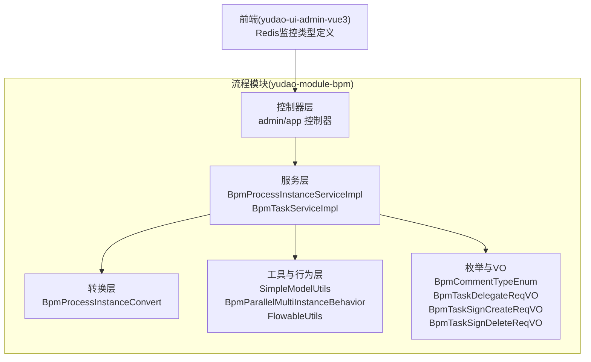
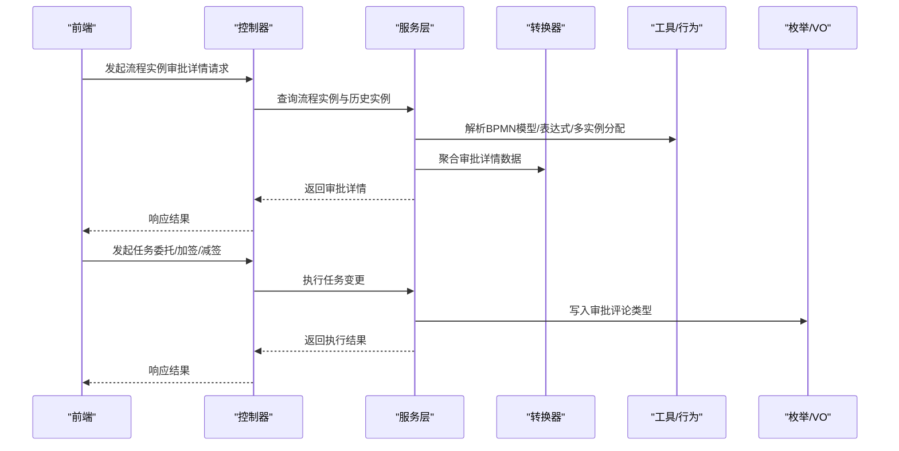
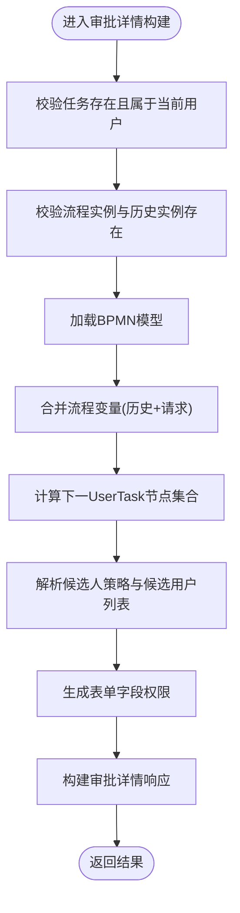
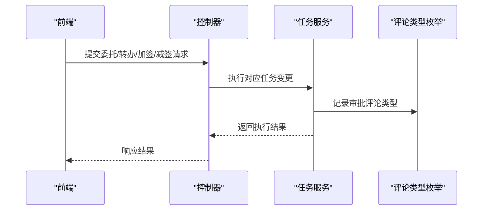
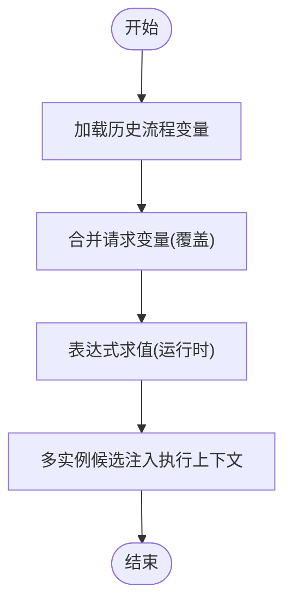
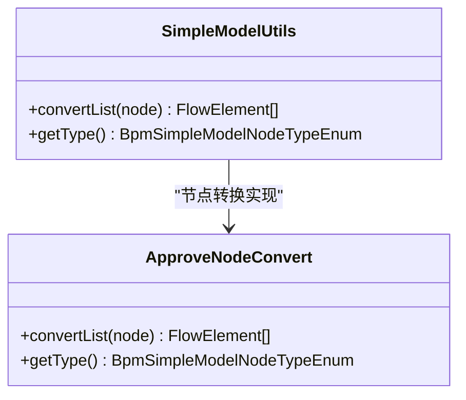
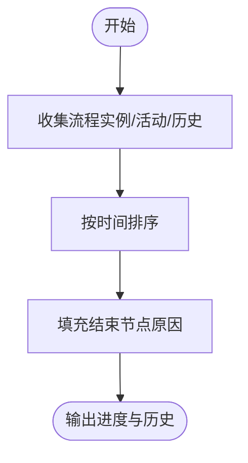
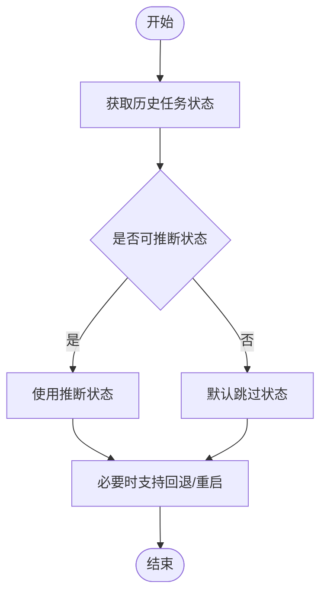
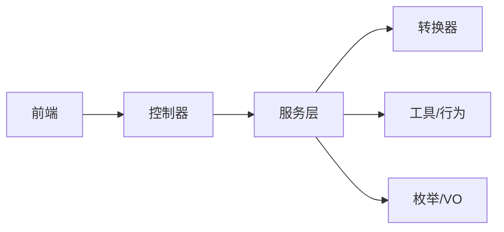

# 流程实例执行

<cite>
**本文引用的文件**
- [BpmProcessInstanceServiceImpl.java](file://yudao-module-bpm/src/main/java/cn/iocoder/yudao/module/bpm/service/task/BpmProcessInstanceServiceImpl.java)
- [BpmTaskServiceImpl.java](file://yudao-module-bpm/src/main/java/cn/iocoder/yudao/module/bpm/service/task/BpmTaskServiceImpl.java)
- [BpmProcessInstanceConvert.java](file://yudao-module-bpm/src/main/java/cn/iocoder/yudao/module/bpm/convert/task/BpmProcessInstanceConvert.java)
- [SimpleModelUtils.java](file://yudao-module-bpm/src/main/java/cn/iocoder/yudao/module/bpm/framework/flowable/core/util/SimpleModelUtils.java)
- [BpmParallelMultiInstanceBehavior.java](file://yudao-module-bpm/src/main/java/cn/iocoder/yudao/module/bpm/framework/flowable/core/behavior/BpmParallelMultiInstanceBehavior.java)
- [BpmCommentTypeEnum.java](file://yudao-module-bpm/src/main/java/cn/iocoder/yudao/module/bpm/enums/task/BpmCommentTypeEnum.java)
- [FlowableUtils.java](file://yudao-module-bpm/src/main/java/cn/iocoder/yudao/module/bpm/framework/flowable/core/util/FlowableUtils.java)
- [BpmTaskDelegateReqVO.java](file://yudao-module-bpm/src/main/java/cn/iocoder/yudao/module/bpm/controller/admin/task/vo/task/BpmTaskDelegateReqVO.java)
- [BpmTaskSignCreateReqVO.java](file://yudao-module-bpm/src/main/java/cn/iocoder/yudao/module/bpm/controller/admin/task/vo/task/BpmTaskSignCreateReqVO.java)
- [BpmTaskSignDeleteReqVO.java](file://yudao-module-bpm/src/main/java/cn/iocoder/yudao/module/bpm/controller/admin/task/vo/task/BpmTaskSignDeleteReqVO.java)
- [types.ts](file://yudao-ui/yudao-ui-admin-vue3/src/api/infra/redis/types.ts)
</cite>

## 目录
1. [引言](#引言)
2. [项目结构](#项目结构)
3. [核心组件](#核心组件)
4. [架构总览](#架构总览)
5. [详细组件分析](#详细组件分析)
6. [依赖关系分析](#依赖关系分析)
7. [性能考量](#性能考量)
8. [故障排查指南](#故障排查指南)
9. [结论](#结论)
10. [附录](#附录)

## 引言
本指南围绕“流程实例执行”的完整生命周期展开，覆盖流程实例的启动、执行、完成与状态管理；任务审批流程中的任务查询、委托、转办、加签等操作；流程变量的使用与传递机制；流程监控与跟踪（进度查询、历史记录、性能分析）；异常处理（中断、回退、重启）以及API接口说明与开发示例。目标是帮助开发者快速理解并实现复杂业务流程的自动化。

## 项目结构
后端采用模块化分层设计，流程相关能力集中在 yudao-module-bpm 模块，主要包含：
- 控制器层：对外暴露REST API，如流程实例、任务审批等
- 服务层：封装业务逻辑，如流程实例服务、任务服务
- 转换层：对象转换，如审批详情构建
- 工具与行为层：Flowable扩展与工具类，如表达式求值、多实例任务分配行为
- 枚举与VO：审批评论类型、任务委托/加签请求参数等

图示来源
- [BpmProcessInstanceServiceImpl.java:243-490](file://yudao-module-bpm/src/main/java/cn/iocoder/yudao/module/bpm/service/task/BpmProcessInstanceServiceImpl.java#L243-L490)
- [BpmTaskServiceImpl.java:1028-1036](file://yudao-module-bpm/src/main/java/cn/iocoder/yudao/module/bpm/service/task/BpmTaskServiceImpl.java#L1028-L1036)
- [BpmProcessInstanceConvert.java:245-261](file://yudao-module-bpm/src/main/java/cn/iocoder/yudao/module/bpm/convert/task/BpmProcessInstanceConvert.java#L245-L261)
- [SimpleModelUtils.java:382-404](file://yudao-module-bpm/src/main/java/cn/iocoder/yudao/module/bpm/framework/flowable/core/util/SimpleModelUtils.java#L382-L404)
- [BpmParallelMultiInstanceBehavior.java:19-44](file://yudao-module-bpm/src/main/java/cn/iocoder/yudao/module/bpm/framework/flowable/core/behavior/BpmParallelMultiInstanceBehavior.java#L19-L44)
- [FlowableUtils.java:380-397](file://yudao-module-bpm/src/main/java/cn/iocoder/yudao/module/bpm/framework/flowable/core/util/FlowableUtils.java#L380-L397)
- [BpmCommentTypeEnum.java:1-46](file://yudao-module-bpm/src/main/java/cn/iocoder/yudao/module/bpm/enums/task/BpmCommentTypeEnum.java#L1-L46)
- [BpmTaskDelegateReqVO.java:1-24](file://yudao-module-bpm/src/main/java/cn/iocoder/yudao/module/bpm/controller/admin/task/vo/task/BpmTaskDelegateReqVO.java#L1-L24)
- [BpmTaskSignCreateReqVO.java:1-29](file://yudao-module-bpm/src/main/java/cn/iocoder/yudao/module/bpm/controller/admin/task/vo/task/BpmTaskSignCreateReqVO.java#L1-L29)
- [BpmTaskSignDeleteReqVO.java:1-20](file://yudao-module-bpm/src/main/java/cn/iocoder/yudao/module/bpm/controller/admin/task/vo/task/BpmTaskSignDeleteReqVO.java#L1-L20)
- [types.ts:1-158](file://yudao-ui/yudao-ui-admin-vue3/src/api/infra/redis/types.ts#L1-L158)

章节来源
- [BpmProcessInstanceServiceImpl.java:243-490](file://yudao-module-bpm/src/main/java/cn/iocoder/yudao/module/bpm/service/task/BpmProcessInstanceServiceImpl.java#L243-L490)
- [BpmTaskServiceImpl.java:1028-1036](file://yudao-module-bpm/src/main/java/cn/iocoder/yudao/module/bpm/service/task/BpmTaskServiceImpl.java#L1028-L1036)
- [BpmProcessInstanceConvert.java:245-261](file://yudao-module-bpm/src/main/java/cn/iocoder/yudao/module/bpm/convert/task/BpmProcessInstanceConvert.java#L245-L261)
- [SimpleModelUtils.java:382-404](file://yudao-module-bpm/src/main/java/cn/iocoder/yudao/module/bpm/framework/flowable/core/util/SimpleModelUtils.java#L382-L404)
- [BpmParallelMultiInstanceBehavior.java:19-44](file://yudao-module-bpm/src/main/java/cn/iocoder/yudao/module/bpm/framework/flowable/core/behavior/BpmParallelMultiInstanceBehavior.java#L19-L44)
- [FlowableUtils.java:380-397](file://yudao-module-bpm/src/main/java/cn/iocoder/yudao/module/bpm/framework/flowable/core/util/FlowableUtils.java#L380-L397)
- [BpmCommentTypeEnum.java:1-46](file://yudao-module-bpm/src/main/java/cn/iocoder/yudao/module/bpm/enums/task/BpmCommentTypeEnum.java#L1-L46)
- [BpmTaskDelegateReqVO.java:1-24](file://yudao-module-bpm/src/main/java/cn/iocoder/yudao/module/bpm/controller/admin/task/vo/task/BpmTaskDelegateReqVO.java#L1-L24)
- [BpmTaskSignCreateReqVO.java:1-29](file://yudao-module-bpm/src/main/java/cn/iocoder/yudao/module/bpm/controller/admin/task/vo/task/BpmTaskSignCreateReqVO.java#L1-L29)
- [BpmTaskSignDeleteReqVO.java:1-20](file://yudao-module-bpm/src/main/java/cn/iocoder/yudao/module/bpm/controller/admin/task/vo/task/BpmTaskSignDeleteReqVO.java#L1-L20)
- [types.ts:1-158](file://yudao-ui/yudao-ui-admin-vue3/src/api/infra/redis/types.ts#L1-L158)

## 核心组件
- 流程实例服务：负责流程实例的审批详情构建、活动节点聚合、状态计算、结束节点状态推断等
- 任务服务：负责任务的委托、转办、加签/减签等操作
- 转换器：将流程模型、定义、实例、历史实例等聚合为审批详情响应对象
- 工具与行为：自定义并行多实例任务分配行为、表达式求值、简单模型节点转换等
- 枚举与VO：审批评论类型、任务委托/加签请求参数等

章节来源
- [BpmProcessInstanceServiceImpl.java:243-490](file://yudao-module-bpm/src/main/java/cn/iocoder/yudao/module/bpm/service/task/BpmProcessInstanceServiceImpl.java#L243-L490)
- [BpmTaskServiceImpl.java:1028-1036](file://yudao-module-bpm/src/main/java/cn/iocoder/yudao/module/bpm/service/task/BpmTaskServiceImpl.java#L1028-L1036)
- [BpmProcessInstanceConvert.java:245-261](file://yudao-module-bpm/src/main/java/cn/iocoder/yudao/module/bpm/convert/task/BpmProcessInstanceConvert.java#L245-L261)
- [SimpleModelUtils.java:382-404](file://yudao-module-bpm/src/main/java/cn/iocoder/yudao/module/bpm/framework/flowable/core/util/SimpleModelUtils.java#L382-L404)
- [BpmParallelMultiInstanceBehavior.java:19-44](file://yudao-module-bpm/src/main/java/cn/iocoder/yudao/module/bpm/framework/flowable/core/behavior/BpmParallelMultiInstanceBehavior.java#L19-L44)
- [FlowableUtils.java:380-397](file://yudao-module-bpm/src/main/java/cn/iocoder/yudao/module/bpm/framework/flowable/core/util/FlowableUtils.java#L380-L397)
- [BpmCommentTypeEnum.java:1-46](file://yudao-module-bpm/src/main/java/cn/iocoder/yudao/module/bpm/enums/task/BpmCommentTypeEnum.java#L1-L46)
- [BpmTaskDelegateReqVO.java:1-24](file://yudao-module-bpm/src/main/java/cn/iocoder/yudao/module/bpm/controller/admin/task/vo/task/BpmTaskDelegateReqVO.java#L1-L24)
- [BpmTaskSignCreateReqVO.java:1-29](file://yudao-module-bpm/src/main/java/cn/iocoder/yudao/module/bpm/controller/admin/task/vo/task/BpmTaskSignCreateReqVO.java#L1-L29)
- [BpmTaskSignDeleteReqVO.java:1-20](file://yudao-module-bpm/src/main/java/cn/iocoder/yudao/module/bpm/controller/admin/task/vo/task/BpmTaskSignDeleteReqVO.java#L1-L20)

## 架构总览
流程实例执行涉及“控制器—服务—转换—工具/行为—枚举/VO”的链路，前端通过API调用后端，后端结合Flowable引擎与自定义扩展完成流程推进与状态维护。

图示来源
- [BpmProcessInstanceServiceImpl.java:243-490](file://yudao-module-bpm/src/main/java/cn/iocoder/yudao/module/bpm/service/task/BpmProcessInstanceServiceImpl.java#L243-L490)
- [BpmProcessInstanceConvert.java:245-261](file://yudao-module-bpm/src/main/java/cn/iocoder/yudao/module/bpm/convert/task/BpmProcessInstanceConvert.java#L245-L261)
- [SimpleModelUtils.java:382-404](file://yudao-module-bpm/src/main/java/cn/iocoder/yudao/module/bpm/framework/flowable/core/util/SimpleModelUtils.java#L382-L404)
- [BpmParallelMultiInstanceBehavior.java:19-44](file://yudao-module-bpm/src/main/java/cn/iocoder/yudao/module/bpm/framework/flowable/core/behavior/BpmParallelMultiInstanceBehavior.java#L19-L44)
- [FlowableUtils.java:380-397](file://yudao-module-bpm/src/main/java/cn/iocoder/yudao/module/bpm/framework/flowable/core/util/FlowableUtils.java#L380-L397)
- [BpmCommentTypeEnum.java:1-46](file://yudao-module-bpm/src/main/java/cn/iocoder/yudao/module/bpm/enums/task/BpmCommentTypeEnum.java#L1-L46)
- [BpmTaskDelegateReqVO.java:1-24](file://yudao-module-bpm/src/main/java/cn/iocoder/yudao/module/bpm/controller/admin/task/vo/task/BpmTaskDelegateReqVO.java#L1-L24)
- [BpmTaskSignCreateReqVO.java:1-29](file://yudao-module-bpm/src/main/java/cn/iocoder/yudao/module/bpm/controller/admin/task/vo/task/BpmTaskSignCreateReqVO.java#L1-L29)
- [BpmTaskSignDeleteReqVO.java:1-20](file://yudao-module-bpm/src/main/java/cn/iocoder/yudao/module/bpm/controller/admin/task/vo/task/BpmTaskSignDeleteReqVO.java#L1-L20)

## 详细组件分析

### 流程实例审批详情构建
- 输入：登录用户ID、审批详情请求VO（含任务ID、流程变量）
- 校验：任务存在性与归属、流程实例与历史实例存在性、BPMN模型可用性
- 流程变量：合并历史变量与请求变量，以前端为准
- 下一审批节点：根据当前任务定义键与流程变量，计算下一UserTask节点集合
- 候选人策略：解析候选人策略与候选用户列表
- 表单字段权限：按活动ID与任务ID生成表单字段权限映射
- 输出：审批详情响应对象（包含流程实例、活动节点、待办任务、表单权限等）

图示来源
- [BpmProcessInstanceServiceImpl.java:243-490](file://yudao-module-bpm/src/main/java/cn/iocoder/yudao/module/bpm/service/task/BpmProcessInstanceServiceImpl.java#L243-L490)
- [BpmProcessInstanceConvert.java:245-261](file://yudao-module-bpm/src/main/java/cn/iocoder/yudao/module/bpm/convert/task/BpmProcessInstanceConvert.java#L245-L261)

章节来源
- [BpmProcessInstanceServiceImpl.java:243-490](file://yudao-module-bpm/src/main/java/cn/iocoder/yudao/module/bpm/service/task/BpmProcessInstanceServiceImpl.java#L243-L490)
- [BpmProcessInstanceConvert.java:245-261](file://yudao-module-bpm/src/main/java/cn/iocoder/yudao/module/bpm/convert/task/BpmProcessInstanceConvert.java#L245-L261)

### 任务审批流程：委托、转办、加签/减签
- 委托：设置任务所有人（owner）为原处理人；执行委派至被委派人；不单独设置状态
- 转办：将任务转派给指定用户
- 加签：在当前任务前/后增加一个或多个审批人
- 减签：移除某个加签任务
- 审批评论：统一使用评论类型枚举，支持“委派发起/完成”、“转派”、“加签/减签”等

图示来源
- [BpmTaskServiceImpl.java:1028-1036](file://yudao-module-bpm/src/main/java/cn/iocoder/yudao/module/bpm/service/task/BpmTaskServiceImpl.java#L1028-L1036)
- [BpmCommentTypeEnum.java:1-46](file://yudao-module-bpm/src/main/java/cn/iocoder/yudao/module/bpm/enums/task/BpmCommentTypeEnum.java#L1-L46)
- [BpmTaskDelegateReqVO.java:1-24](file://yudao-module-bpm/src/main/java/cn/iocoder/yudao/module/bpm/controller/admin/task/vo/task/BpmTaskDelegateReqVO.java#L1-L24)
- [BpmTaskSignCreateReqVO.java:1-29](file://yudao-module-bpm/src/main/java/cn/iocoder/yudao/module/bpm/controller/admin/task/vo/task/BpmTaskSignCreateReqVO.java#L1-L29)
- [BpmTaskSignDeleteReqVO.java:1-20](file://yudao-module-bpm/src/main/java/cn/iocoder/yudao/module/bpm/controller/admin/task/vo/task/BpmTaskSignDeleteReqVO.java#L1-L20)

章节来源
- [BpmTaskServiceImpl.java:1028-1036](file://yudao-module-bpm/src/main/java/cn/iocoder/yudao/module/bpm/service/task/BpmTaskServiceImpl.java#L1028-L1036)
- [BpmCommentTypeEnum.java:1-46](file://yudao-module-bpm/src/main/java/cn/iocoder/yudao/module/bpm/enums/task/BpmCommentTypeEnum.java#L1-L46)
- [BpmTaskDelegateReqVO.java:1-24](file://yudao-module-bpm/src/main/java/cn/iocoder/yudao/module/bpm/controller/admin/task/vo/task/BpmTaskDelegateReqVO.java#L1-L24)
- [BpmTaskSignCreateReqVO.java:1-29](file://yudao-module-bpm/src/main/java/cn/iocoder/yudao/module/bpm/controller/admin/task/vo/task/BpmTaskSignCreateReqVO.java#L1-L29)
- [BpmTaskSignDeleteReqVO.java:1-20](file://yudao-module-bpm/src/main/java/cn/iocoder/yudao/module/bpm/controller/admin/task/vo/task/BpmTaskSignDeleteReqVO.java#L1-L20)

### 流程变量使用与传递
- 变量来源：历史流程变量 + 请求传入变量
- 合并策略：请求变量覆盖历史变量
- 表达式求值：通过工具类在运行时解析表达式值
- 多实例任务：通过自定义行为将候选集注入执行上下文变量

图示来源
- [BpmProcessInstanceServiceImpl.java:267-276](file://yudao-module-bpm/src/main/java/cn/iocoder/yudao/module/bpm/service/task/BpmProcessInstanceServiceImpl.java#L267-L276)
- [FlowableUtils.java:380-397](file://yudao-module-bpm/src/main/java/cn/iocoder/yudao/module/bpm/framework/flowable/core/util/FlowableUtils.java#L380-L397)
- [BpmParallelMultiInstanceBehavior.java:19-44](file://yudao-module-bpm/src/main/java/cn/iocoder/yudao/module/bpm/framework/flowable/core/behavior/BpmParallelMultiInstanceBehavior.java#L19-L44)

章节来源
- [BpmProcessInstanceServiceImpl.java:267-276](file://yudao-module-bpm/src/main/java/cn/iocoder/yudao/module/bpm/service/task/BpmProcessInstanceServiceImpl.java#L267-L276)
- [FlowableUtils.java:380-397](file://yudao-module-bpm/src/main/java/cn/iocoder/yudao/module/bpm/framework/flowable/core/util/FlowableUtils.java#L380-L397)
- [BpmParallelMultiInstanceBehavior.java:19-44](file://yudao-module-bpm/src/main/java/cn/iocoder/yudao/module/bpm/framework/flowable/core/behavior/BpmParallelMultiInstanceBehavior.java#L19-L44)

### 简单模型与审批节点
- 简单模型节点转换：将ApproveNode转换为UserTask，并可选添加定时边界事件以处理超时
- 节点类型：ApproveNode、ChildProcess等
- 候选人策略：从BPMN节点解析候选人策略与用户列表

图示来源
- [SimpleModelUtils.java:382-404](file://yudao-module-bpm/src/main/java/cn/iocoder/yudao/module/bpm/framework/flowable/core/util/SimpleModelUtils.java#L382-L404)

章节来源
- [SimpleModelUtils.java:382-404](file://yudao-module-bpm/src/main/java/cn/iocoder/yudao/module/bpm/framework/flowable/core/util/SimpleModelUtils.java#L382-L404)

### 流程监控与跟踪
- 进度查询：通过审批详情聚合流程实例、活动节点与历史实例，按时间排序输出
- 历史记录：结束节点状态推断（如跳过）、原因记录
- 性能分析：结合Redis监控类型定义进行系统资源与命令统计分析（前端侧）

图示来源
- [BpmProcessInstanceServiceImpl.java:456-478](file://yudao-module-bpm/src/main/java/cn/iocoder/yudao/module/bpm/service/task/BpmProcessInstanceServiceImpl.java#L456-L478)
- [types.ts:1-158](file://yudao-ui/yudao-ui-admin-vue3/src/api/infra/redis/types.ts#L1-L158)

章节来源
- [BpmProcessInstanceServiceImpl.java:456-478](file://yudao-module-bpm/src/main/java/cn/iocoder/yudao/module/bpm/service/task/BpmProcessInstanceServiceImpl.java#L456-L478)
- [types.ts:1-158](file://yudao-ui/yudao-ui-admin-vue3/src/api/infra/redis/types.ts#L1-L158)

### 异常处理与状态管理
- 状态推断：结束节点若无法获取任务状态，默认为“跳过”
- 中断/回退/重启：通过Flowable引擎与业务规则实现，结合审批评论记录原因

图示来源
- [BpmProcessInstanceServiceImpl.java:483-490](file://yudao-module-bpm/src/main/java/cn/iocoder/yudao/module/bpm/service/task/BpmProcessInstanceServiceImpl.java#L483-L490)
- [BpmCommentTypeEnum.java:1-46](file://yudao-module-bpm/src/main/java/cn/iocoder/yudao/module/bpm/enums/task/BpmCommentTypeEnum.java#L1-L46)

章节来源
- [BpmProcessInstanceServiceImpl.java:483-490](file://yudao-module-bpm/src/main/java/cn/iocoder/yudao/module/bpm/service/task/BpmProcessInstanceServiceImpl.java#L483-L490)
- [BpmCommentTypeEnum.java:1-46](file://yudao-module-bpm/src/main/java/cn/iocoder/yudao/module/bpm/enums/task/BpmCommentTypeEnum.java#L1-L46)

## 依赖关系分析
- 服务层依赖转换器与工具类，确保审批详情构建的一致性与可扩展性
- 任务服务依赖评论类型枚举，保证审批动作的可追溯性
- 前端通过API与后端交互，Redis监控类型定义支撑系统性能观测

图示来源
- [BpmProcessInstanceServiceImpl.java:243-490](file://yudao-module-bpm/src/main/java/cn/iocoder/yudao/module/bpm/service/task/BpmProcessInstanceServiceImpl.java#L243-L490)
- [BpmProcessInstanceConvert.java:245-261](file://yudao-module-bpm/src/main/java/cn/iocoder/yudao/module/bpm/convert/task/BpmProcessInstanceConvert.java#L245-L261)
- [SimpleModelUtils.java:382-404](file://yudao-module-bpm/src/main/java/cn/iocoder/yudao/module/bpm/framework/flowable/core/util/SimpleModelUtils.java#L382-L404)
- [BpmParallelMultiInstanceBehavior.java:19-44](file://yudao-module-bpm/src/main/java/cn/iocoder/yudao/module/bpm/framework/flowable/core/behavior/BpmParallelMultiInstanceBehavior.java#L19-L44)
- [FlowableUtils.java:380-397](file://yudao-module-bpm/src/main/java/cn/iocoder/yudao/module/bpm/framework/flowable/core/util/FlowableUtils.java#L380-L397)
- [BpmCommentTypeEnum.java:1-46](file://yudao-module-bpm/src/main/java/cn/iocoder/yudao/module/bpm/enums/task/BpmCommentTypeEnum.java#L1-L46)
- [BpmTaskDelegateReqVO.java:1-24](file://yudao-module-bpm/src/main/java/cn/iocoder/yudao/module/bpm/controller/admin/task/vo/task/BpmTaskDelegateReqVO.java#L1-L24)
- [BpmTaskSignCreateReqVO.java:1-29](file://yudao-module-bpm/src/main/java/cn/iocoder/yudao/module/bpm/controller/admin/task/vo/task/BpmTaskSignCreateReqVO.java#L1-L29)
- [BpmTaskSignDeleteReqVO.java:1-20](file://yudao-module-bpm/src/main/java/cn/iocoder/yudao/module/bpm/controller/admin/task/vo/task/BpmTaskSignDeleteReqVO.java#L1-L20)
- [types.ts:1-158](file://yudao-ui/yudao-ui-admin-vue3/src/api/infra/redis/types.ts#L1-L158)

章节来源
- [BpmProcessInstanceServiceImpl.java:243-490](file://yudao-module-bpm/src/main/java/cn/iocoder/yudao/module/bpm/service/task/BpmProcessInstanceServiceImpl.java#L243-L490)
- [BpmProcessInstanceConvert.java:245-261](file://yudao-module-bpm/src/main/java/cn/iocoder/yudao/module/bpm/convert/task/BpmProcessInstanceConvert.java#L245-L261)
- [SimpleModelUtils.java:382-404](file://yudao-module-bpm/src/main/java/cn/iocoder/yudao/module/bpm/framework/flowable/core/util/SimpleModelUtils.java#L382-L404)
- [BpmParallelMultiInstanceBehavior.java:19-44](file://yudao-module-bpm/src/main/java/cn/iocoder/yudao/module/bpm/framework/flowable/core/behavior/BpmParallelMultiInstanceBehavior.java#L19-L44)
- [FlowableUtils.java:380-397](file://yudao-module-bpm/src/main/java/cn/iocoder/yudao/module/bpm/framework/flowable/core/util/FlowableUtils.java#L380-L397)
- [BpmCommentTypeEnum.java:1-46](file://yudao-module-bpm/src/main/java/cn/iocoder/yudao/module/bpm/enums/task/BpmCommentTypeEnum.java#L1-L46)
- [BpmTaskDelegateReqVO.java:1-24](file://yudao-module-bpm/src/main/java/cn/iocoder/yudao/module/bpm/controller/admin/task/vo/task/BpmTaskDelegateReqVO.java#L1-L24)
- [BpmTaskSignCreateReqVO.java:1-29](file://yudao-module-bpm/src/main/java/cn/iocoder/yudao/module/bpm/controller/admin/task/vo/task/BpmTaskSignCreateReqVO.java#L1-L29)
- [BpmTaskSignDeleteReqVO.java:1-20](file://yudao-module-bpm/src/main/java/cn/iocoder/yudao/module/bpm/controller/admin/task/vo/task/BpmTaskSignDeleteReqVO.java#L1-L20)
- [types.ts:1-158](file://yudao-ui/yudao-ui-admin-vue3/src/api/infra/redis/types.ts#L1-L158)

## 性能考量
- 表达式求值：在运行时解析表达式，建议控制表达式复杂度与计算成本
- 多实例任务：候选集注入执行上下文需避免过大集合导致内存压力
- 审批详情构建：聚合活动节点与历史实例时注意排序与过滤，避免重复扫描
- 监控与观测：结合Redis监控指标进行系统资源与命令统计分析，定位瓶颈

## 故障排查指南
- 任务不存在或非当前用户：检查任务校验逻辑与登录用户ID
- 流程实例/历史实例缺失：确认流程实例ID与历史实例是否存在
- BPMN模型为空：检查流程定义ID与模型加载
- 委托/转办失败：确认任务所有人(owner)状态与委派用户ID
- 加签/减签异常：核对加签类型与用户集合，确保原因必填
- 结束节点状态异常：检查历史任务状态推断逻辑与跳过状态默认值

章节来源
- [BpmProcessInstanceServiceImpl.java:243-490](file://yudao-module-bpm/src/main/java/cn/iocoder/yudao/module/bpm/service/task/BpmProcessInstanceServiceImpl.java#L243-L490)
- [BpmTaskServiceImpl.java:1028-1036](file://yudao-module-bpm/src/main/java/cn/iocoder/yudao/module/bpm/service/task/BpmTaskServiceImpl.java#L1028-L1036)
- [BpmCommentTypeEnum.java:1-46](file://yudao-module-bpm/src/main/java/cn/iocoder/yudao/module/bpm/enums/task/BpmCommentTypeEnum.java#L1-L46)

## 结论
本指南系统梳理了流程实例执行的关键环节与实现要点，涵盖审批详情构建、任务操作、变量传递、监控跟踪与异常处理。通过服务层、转换层、工具层与枚举/VO的协同，实现了可扩展、可观测、可追溯的流程自动化能力。

## 附录

### API接口清单（概览）
- 流程实例审批详情查询
  - 方法：GET/POST
  - 路径：/bpm/process-instance/get-approval-detail
  - 请求体：包含任务ID、流程变量等
  - 响应：审批详情（流程实例、活动节点、待办任务、表单权限等）
  - 参考路径：[BpmProcessInstanceServiceImpl.java:243-490](file://yudao-module-bpm/src/main/java/cn/iocoder/yudao/module/bpm/service/task/BpmProcessInstanceServiceImpl.java#L243-L490)

- 任务委托
  - 方法：POST
  - 路径：/bpm/task/delegate
  - 请求体：任务ID、被委派人ID、原因
  - 响应：执行结果
  - 参考路径：[BpmTaskDelegateReqVO.java:1-24](file://yudao-module-bpm/src/main/java/cn/iocoder/yudao/module/bpm/controller/admin/task/vo/task/BpmTaskDelegateReqVO.java#L1-L24)，[BpmTaskServiceImpl.java:1028-1036](file://yudao-module-bpm/src/main/java/cn/iocoder/yudao/module/bpm/service/task/BpmTaskServiceImpl.java#L1028-L1036)

- 任务转办
  - 方法：POST
  - 路径：/bpm/task/transfer
  - 请求体：任务ID、转派人ID、原因
  - 响应：执行结果
  - 参考路径：[BpmCommentTypeEnum.java:1-46](file://yudao-module-bpm/src/main/java/cn/iocoder/yudao/module/bpm/enums/task/BpmCommentTypeEnum.java#L1-L46)

- 任务加签
  - 方法：POST
  - 路径：/bpm/task/sign/create
  - 请求体：任务ID、加签用户集合、加签类型、原因
  - 响应：执行结果
  - 参考路径：[BpmTaskSignCreateReqVO.java:1-29](file://yudao-module-bpm/src/main/java/cn/iocoder/yudao/module/bpm/controller/admin/task/vo/task/BpmTaskSignCreateReqVO.java#L1-L29)

- 任务减签
  - 方法：POST
  - 路径：/bpm/task/sign/delete
  - 请求体：被减签任务ID、原因
  - 响应：执行结果
  - 参考路径：[BpmTaskSignDeleteReqVO.java:1-20](file://yudao-module-bpm/src/main/java/cn/iocoder/yudao/module/bpm/controller/admin/task/vo/task/BpmTaskSignDeleteReqVO.java#L1-L20)

- 流程变量查询/传递
  - 方法：GET/POST
  - 路径：/bpm/process-instance/get-process-variables 或审批详情接口
  - 请求体：流程实例ID、变量名
  - 响应：流程变量值
  - 参考路径：[BpmProcessInstanceServiceImpl.java:267-276](file://yudao-module-bpm/src/main/java/cn/iocoder/yudao/module/bpm/service/task/BpmProcessInstanceServiceImpl.java#L267-L276)，[FlowableUtils.java:380-397](file://yudao-module-bpm/src/main/java/cn/iocoder/yudao/module/bpm/framework/flowable/core/util/FlowableUtils.java#L380-L397)

- 流程监控与跟踪
  - 方法：GET
  - 路径：/bpm/process-instance/list-progress 或 /infra/redis/monitor
  - 请求体：查询条件（如流程实例ID、时间范围）
  - 响应：进度列表、Redis监控信息
  - 参考路径：[BpmProcessInstanceServiceImpl.java:456-478](file://yudao-module-bpm/src/main/java/cn/iocoder/yudao/module/bpm/service/task/BpmProcessInstanceServiceImpl.java#L456-L478)，[types.ts:1-158](file://yudao-ui/yudao-ui-admin-vue3/src/api/infra/redis/types.ts#L1-L158)

### 开发示例指引
- 复杂业务流程自动化
  - 使用简单模型节点转换与定时边界事件处理超时
  - 通过流程变量与表达式求值实现动态分支与候选人计算
  - 利用多实例行为实现并行审批与候选集注入
  - 参考路径：[SimpleModelUtils.java:382-404](file://yudao-module-bpm/src/main/java/cn/iocoder/yudao/module/bpm/framework/flowable/core/util/SimpleModelUtils.java#L382-L404)，[BpmParallelMultiInstanceBehavior.java:19-44](file://yudao-module-bpm/src/main/java/cn/iocoder/yudao/module/bpm/framework/flowable/core/behavior/BpmParallelMultiInstanceBehavior.java#L19-L44)，[FlowableUtils.java:380-397](file://yudao-module-bpm/src/main/java/cn/iocoder/yudao/module/bpm/framework/flowable/core/util/FlowableUtils.java#L380-L397)

- 审批详情构建与状态管理
  - 聚合活动节点与历史实例，按时间排序输出
  - 结束节点状态推断与原因记录
  - 参考路径：[BpmProcessInstanceServiceImpl.java:456-478](file://yudao-module-bpm/src/main/java/cn/iocoder/yudao/module/bpm/service/task/BpmProcessInstanceServiceImpl.java#L456-L478)

- 任务操作与评论记录
  - 委托/转办/加签/减签统一通过任务服务执行，并写入评论类型
  - 参考路径：[BpmTaskServiceImpl.java:1028-1036](file://yudao-module-bpm/src/main/java/cn/iocoder/yudao/module/bpm/service/task/BpmTaskServiceImpl.java#L1028-L1036)，[BpmCommentTypeEnum.java:1-46](file://yudao-module-bpm/src/main/java/cn/iocoder/yudao/module/bpm/enums/task/BpmCommentTypeEnum.java#L1-L46)