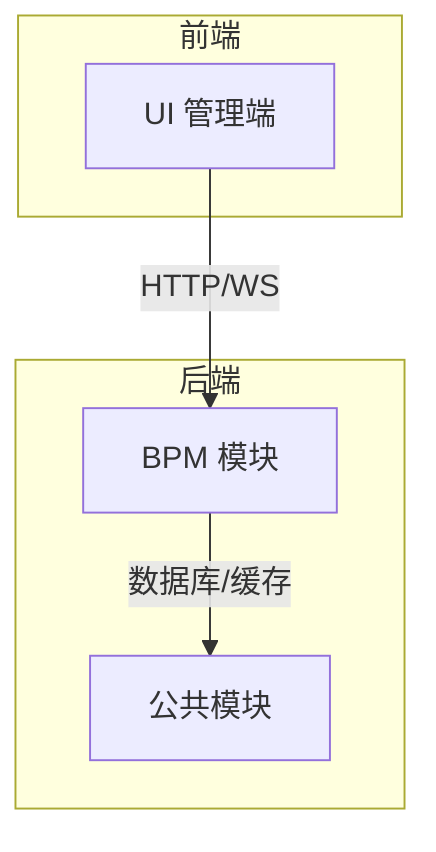
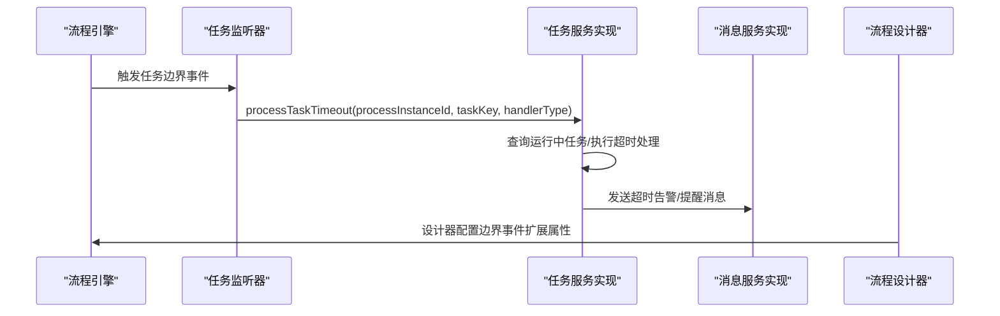
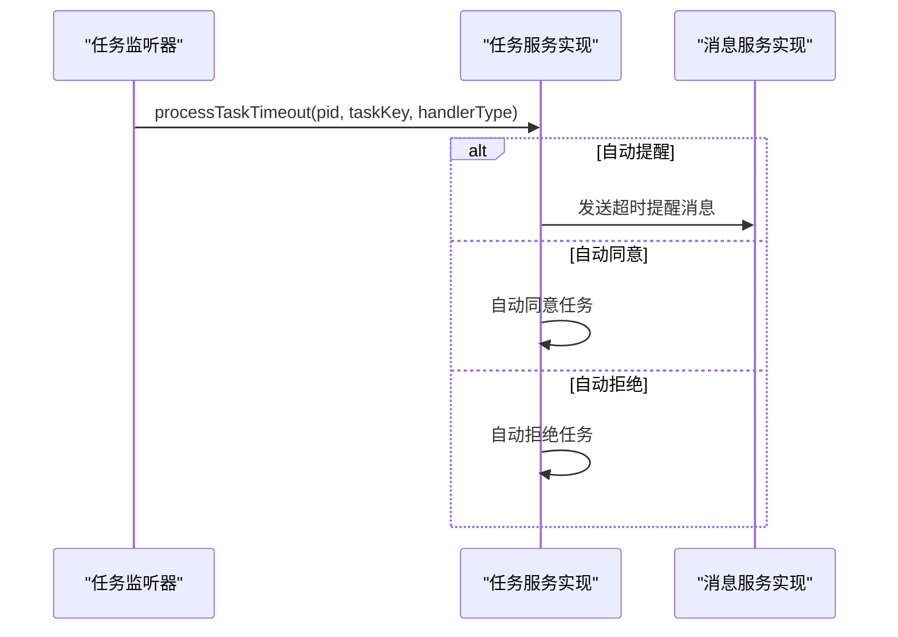
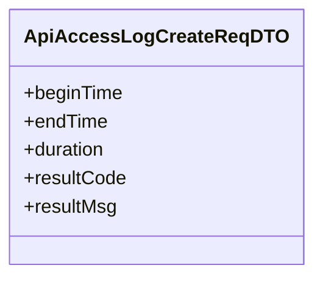
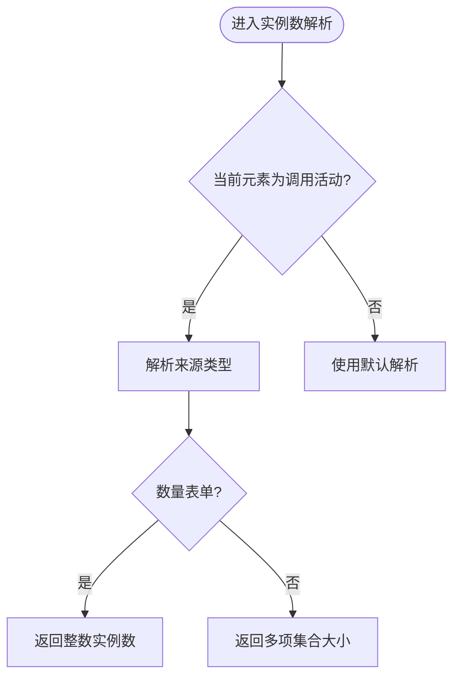
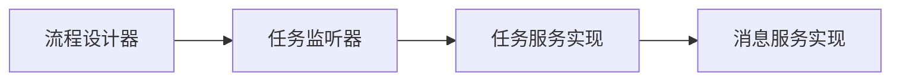

# 流程监控统计

<cite>
**本文引用的文件**
- [BpmTaskEventListener.java](file://yudao-module-bpm/src/main/java/cn/iocoder/yudao/module/bpm/framework/flowable/core/listener/BpmTaskEventListener.java)
- [BpmTaskServiceImpl.java](file://yudao-module-bpm/src/main/java/cn/iocoder/yudao/module/bpm/service/task/BpmTaskServiceImpl.java)
- [SimpleModelUtils.java](file://yudao-module-bpm/src/main/java/cn/iocoder/yudao/module/bpm/framework/flowable/core/util/SimpleModelUtils.java)
- [BoundaryEventTimer.vue](file://yudao-ui/yudao-ui-admin-vue3/src/components/bpmnProcessDesigner/package/penal/custom-config/components/BoundaryEventTimer.vue)
- [BpmMessageServiceImpl.java](file://yudao-module-bpm/src/main/java/cn/iocoder/yudao/module/bpm/service/message/BpmMessageServiceImpl.java)
- [ApiAccessLogCreateReqDTO.java](file://yudao-framework/yudao-common/src/main/java/cn/iocoder/yudao/framework/common/biz/infra/logger/dto/ApiAccessLogCreateReqDTO.java)
- [BpmSequentialMultiInstanceBehavior.java](file://yudao-module-bpm/src/main/java/cn/iocoder/yudao/module/bpm/framework/flowable/core/behavior/BpmSequentialMultiInstanceBehavior.java)
- [FlowableUtilsTest.java](file://yudao-module-bpm/src/test/java/cn/iocoder/yudao/module/bpm/framework/flowable/core/util/FlowableUtilsTest.java)
</cite>

## 目录
1. [引言](#引言)
2. [项目结构](#项目结构)
3. [核心组件](#核心组件)
4. [架构总览](#架构总览)
5. [详细组件分析](#详细组件分析)
6. [依赖关系分析](#依赖关系分析)
7. [性能考量](#性能考量)
8. [故障排查指南](#故障排查指南)
9. [结论](#结论)
10. [附录](#附录)

## 引言
本指南围绕“流程监控统计”主题，系统梳理并讲解如何在现有 BPM 代码库基础上，构建完善的流程运行状态实时监控体系，覆盖流程实例跟踪、任务超时监控与异常告警、流程性能分析、统计数据采集与分析、流程质量监控与可视化展示等能力。文档以代码为依据，提供可落地的开发步骤、关键流程图与时序图，帮助实现智能化的流程治理。

## 项目结构
本项目采用多模块分层架构，BPM 模块负责流程定义、执行、任务管理与消息通知；前端 UI 提供流程设计器与可视化展示；公共模块提供通用基础设施（如日志、监控、安全等）。与流程监控统计直接相关的模块与文件如下：

- 后端 BPM 模块
  - 任务监听与超时处理：BpmTaskEventListener、BpmTaskServiceImpl
  - 流程模型工具：SimpleModelUtils
  - 性能行为扩展：BpmSequentialMultiInstanceBehavior
  - 工具与测试：FlowableUtilsTest
- 前端 UI 模块
  - 流程设计器边界事件配置：BoundaryEventTimer.vue
- 公共模块
  - API 访问日志 DTO：ApiAccessLogCreateReqDTO

**章节来源**
- [BpmTaskEventListener.java:120-147](file://yudao-module-bpm/src/main/java/cn/iocoder/yudao/module/bpm/framework/flowable/core/listener/BpmTaskEventListener.java#L120-L147)
- [BpmTaskServiceImpl.java:1614-1649](file://yudao-module-bpm/src/main/java/cn/iocoder/yudao/module/bpm/service/task/BpmTaskServiceImpl.java#L1614-L1649)
- [SimpleModelUtils.java:401-428](file://yudao-module-bpm/src/main/java/cn/iocoder/yudao/module/bpm/framework/flowable/core/util/SimpleModelUtils.java#L401-L428)
- [BoundaryEventTimer.vue:157-192](file://yudao-ui/yudao-ui-admin-vue3/src/components/bpmnProcessDesigner/package/penal/custom-config/components/BoundaryEventTimer.vue#L157-L192)
- [ApiAccessLogCreateReqDTO.java:78-103](file://yudao-framework/yudao-common/src/main/java/cn/iocoder/yudao/framework/common/biz/infra/logger/dto/ApiAccessLogCreateReqDTO.java#L78-L103)

## 核心组件
- 任务超时监听与处理
  - 通过任务监听器识别边界事件类型，触发对应超时处理策略（提醒、自动同意、自动拒绝）
  - 在服务实现中对超时任务进行处理并发送消息通知
- 流程模型超时边界事件生成
  - 在流程模型中为审批节点添加超时边界事件，支持循环提醒与固定时长
- 前端流程设计器配置
  - 支持启用/禁用超时处理、设置超时时间与提醒次数、生成边界事件扩展属性
- API 访问日志与性能指标
  - 通过 API 访问日志 DTO 记录请求起止时间、耗时与结果，用于性能分析
- 多实例顺序行为扩展
  - 针对顺序多实例子流程/调用活动的实例数解析与执行逻辑进行增强

**章节来源**
- [BpmTaskEventListener.java:120-147](file://yudao-module-bpm/src/main/java/cn/iocoder/yudao/module/bpm/framework/flowable/core/listener/BpmTaskEventListener.java#L120-L147)
- [BpmTaskServiceImpl.java:1614-1649](file://yudao-module-bpm/src/main/java/cn/iocoder/yudao/module/bpm/service/task/BpmTaskServiceImpl.java#L1614-L1649)
- [SimpleModelUtils.java:401-428](file://yudao-module-bpm/src/main/java/cn/iocoder/yudao/module/bpm/framework/flowable/core/util/SimpleModelUtils.java#L401-L428)
- [BoundaryEventTimer.vue:157-192](file://yudao-ui/yudao-ui-admin-vue3/src/components/bpmnProcessDesigner/package/penal/custom-config/components/BoundaryEventTimer.vue#L157-L192)
- [ApiAccessLogCreateReqDTO.java:78-103](file://yudao-framework/yudao-common/src/main/java/cn/iocoder/yudao/framework/common/biz/infra/logger/dto/ApiAccessLogCreateReqDTO.java#L78-L103)
- [BpmSequentialMultiInstanceBehavior.java:69-95](file://yudao-module-bpm/src/main/java/cn/iocoder/yudao/module/bpm/framework/flowable/core/behavior/BpmSequentialMultiInstanceBehavior.java#L69-L95)

## 架构总览
下图展示了从流程引擎到任务处理、消息通知与前端配置的整体交互路径，体现流程监控的关键链路。

**图表来源**
- [BpmTaskEventListener.java:120-147](file://yudao-module-bpm/src/main/java/cn/iocoder/yudao/module/bpm/framework/flowable/core/listener/BpmTaskEventListener.java#L120-L147)
- [BpmTaskServiceImpl.java:1614-1649](file://yudao-module-bpm/src/main/java/cn/iocoder/yudao/module/bpm/service/task/BpmTaskServiceImpl.java#L1614-L1649)
- [BpmMessageServiceImpl.java](file://yudao-module-bpm/src/main/java/cn/iocoder/yudao/module/bpm/service/message/BpmMessageServiceImpl.java)
- [BoundaryEventTimer.vue:157-192](file://yudao-ui/yudao-ui-admin-vue3/src/components/bpmnProcessDesigner/package/penal/custom-config/components/BoundaryEventTimer.vue#L157-L192)

## 详细组件分析

### 组件A：任务超时监听与处理
- 监听器职责
  - 解析边界事件扩展属性，区分用户任务超时、延迟定时器超时、子流程超时
  - 调用任务服务执行超时处理或触发任务继续
- 服务实现职责
  - 校验流程实例与任务存在性
  - 根据超时处理类型执行提醒、自动同意或自动拒绝
  - 支持任务后置触发 HTTP 请求（用于外部系统联动）

**图表来源**
- [BpmTaskEventListener.java:120-147](file://yudao-module-bpm/src/main/java/cn/iocoder/yudao/module/bpm/framework/flowable/core/listener/BpmTaskEventListener.java#L120-L147)
- [BpmTaskServiceImpl.java:1614-1649](file://yudao-module-bpm/src/main/java/cn/iocoder/yudao/module/bpm/service/task/BpmTaskServiceImpl.java#L1614-L1649)

**章节来源**
- [BpmTaskEventListener.java:120-147](file://yudao-module-bpm/src/main/java/cn/iocoder/yudao/module/bpm/framework/flowable/core/listener/BpmTaskEventListener.java#L120-L147)
- [BpmTaskServiceImpl.java:1614-1649](file://yudao-module-bpm/src/main/java/cn/iocoder/yudao/module/bpm/service/task/BpmTaskServiceImpl.java#L1614-L1649)

### 组件B：流程模型超时边界事件生成
- 功能概述
  - 为审批节点动态添加超时边界事件，支持一次性超时与循环提醒
  - 生成边界事件扩展属性（边界事件类型、超时处理类型、时间表达式）
- 前端配置
  - 设计器支持开启超时处理、设置超时时间与最大提醒次数
  - 自动生成边界事件与扩展元素

```mermaid
flowchart TD
Start(["进入流程模型配置"]) --> Enable{"启用超时处理?"}
Enable --> |否| Clear["清空扩展属性"]
Enable --> |是| BuildBE["生成超时边界事件"]
BuildBE --> AddExt["添加扩展属性<br/>边界事件类型/超时处理类型"]
AddExt --> SetTime["设置时间表达式/循环周期"]
SetTime --> Done(["完成"])
Clear --> Done
```

**图表来源**
- [SimpleModelUtils.java:401-428](file://yudao-module-bpm/src/main/java/cn/iocoder/yudao/module/bpm/framework/flowable/core/util/SimpleModelUtils.java#L401-L428)
- [BoundaryEventTimer.vue:157-192](file://yudao-ui/yudao-ui-admin-vue3/src/components/bpmnProcessDesigner/package/penal/custom-config/components/BoundaryEventTimer.vue#L157-L192)

**章节来源**
- [SimpleModelUtils.java:401-428](file://yudao-module-bpm/src/main/java/cn/iocoder/yudao/module/bpm/framework/flowable/core/util/SimpleModelUtils.java#L401-L428)
- [BoundaryEventTimer.vue:157-192](file://yudao-ui/yudao-ui-admin-vue3/src/components/bpmnProcessDesigner/package/penal/custom-config/components/BoundaryEventTimer.vue#L157-L192)

### 组件C：API 访问日志与性能分析
- 日志字段
  - 请求起止时间、执行时长（毫秒）、结果码与提示信息
- 应用场景
  - 作为流程接口的性能基线，结合业务指标计算平均处理时间、吞吐量与失败率
  - 用于定位慢查询与异常接口，支撑流程性能分析

**图表来源**
- [ApiAccessLogCreateReqDTO.java:78-103](file://yudao-framework/yudao-common/src/main/java/cn/iocoder/yudao/framework/common/biz/infra/logger/dto/ApiAccessLogCreateReqDTO.java#L78-L103)

**章节来源**
- [ApiAccessLogCreateReqDTO.java:78-103](file://yudao-framework/yudao-common/src/main/java/cn/iocoder/yudao/framework/common/biz/infra/logger/dto/ApiAccessLogCreateReqDTO.java#L78-L103)

### 组件D：多实例顺序行为扩展
- 功能概述
  - 针对顺序多实例（子流程/调用活动）的实例数解析与执行逻辑进行增强
  - 支持基于表单变量的实例数来源（数量型/多项型），确保并发与顺序控制一致

**图表来源**
- [BpmSequentialMultiInstanceBehavior.java:69-95](file://yudao-module-bpm/src/main/java/cn/iocoder/yudao/module/bpm/framework/flowable/core/behavior/BpmSequentialMultiInstanceBehavior.java#L69-L95)

**章节来源**
- [BpmSequentialMultiInstanceBehavior.java:69-95](file://yudao-module-bpm/src/main/java/cn/iocoder/yudao/module/bpm/framework/flowable/core/behavior/BpmSequentialMultiInstanceBehavior.java#L69-L95)

### 组件E：流程摘要与测试验证
- 流程摘要
  - 基于流程模型中的摘要配置与表单字段，生成流程摘要键值对，便于统计与展示
- 测试用例
  - 验证正常表单、自定义表单、未启用摘要等场景下的摘要生成逻辑

**章节来源**
- [FlowableUtilsTest.java:25-120](file://yudao-module-bpm/src/test/java/cn/iocoder/yudao/module/bpm/framework/flowable/core/util/FlowableUtilsTest.java#L25-L120)

## 依赖关系分析
- 组件耦合
  - 任务监听器依赖任务服务实现进行超时处理
  - 任务服务实现依赖消息服务实现进行告警通知
  - 流程设计器通过扩展属性影响监听器的边界事件类型解析
- 外部依赖
  - 流程引擎（Flowable）提供监听器触发与边界事件机制
  - 前端设计器负责扩展属性的可视化配置与持久化

**图表来源**
- [BpmTaskEventListener.java:120-147](file://yudao-module-bpm/src/main/java/cn/iocoder/yudao/module/bpm/framework/flowable/core/listener/BpmTaskEventListener.java#L120-L147)
- [BpmTaskServiceImpl.java:1614-1649](file://yudao-module-bpm/src/main/java/cn/iocoder/yudao/module/bpm/service/task/BpmTaskServiceImpl.java#L1614-L1649)
- [BoundaryEventTimer.vue:157-192](file://yudao-ui/yudao-ui-admin-vue3/src/components/bpmnProcessDesigner/package/penal/custom-config/components/BoundaryEventTimer.vue#L157-L192)

**章节来源**
- [BpmTaskEventListener.java:120-147](file://yudao-module-bpm/src/main/java/cn/iocoder/yudao/module/bpm/framework/flowable/core/listener/BpmTaskEventListener.java#L120-L147)
- [BpmTaskServiceImpl.java:1614-1649](file://yudao-module-bpm/src/main/java/cn/iocoder/yudao/module/bpm/service/task/BpmTaskServiceImpl.java#L1614-L1649)
- [BoundaryEventTimer.vue:157-192](file://yudao-ui/yudao-ui-admin-vue3/src/components/bpmnProcessDesigner/package/penal/custom-config/components/BoundaryEventTimer.vue#L157-L192)

## 性能考量
- 监听器与服务实现
  - 超时处理应避免阻塞主线程，必要时异步执行或引入队列
  - 对重复任务与无效实例进行快速校验，减少无效分支
- 多实例顺序行为
  - 实例数解析与执行需关注大集合场景的内存与 CPU 开销
- API 性能基线
  - 使用 API 访问日志 DTO 记录的 duration 字段作为性能分析基础，结合业务指标计算 P95/P99 时延

**章节来源**
- [BpmTaskServiceImpl.java:1614-1649](file://yudao-module-bpm/src/main/java/cn/iocoder/yudao/module/bpm/service/task/BpmTaskServiceImpl.java#L1614-L1649)
- [BpmSequentialMultiInstanceBehavior.java:69-95](file://yudao-module-bpm/src/main/java/cn/iocoder/yudao/module/bpm/framework/flowable/core/behavior/BpmSequentialMultiInstanceBehavior.java#L69-L95)
- [ApiAccessLogCreateReqDTO.java:78-103](file://yudao-framework/yudao-common/src/main/java/cn/iocoder/yudao/framework/common/biz/infra/logger/dto/ApiAccessLogCreateReqDTO.java#L78-L103)

## 故障排查指南
- 任务超时未生效
  - 检查流程模型是否正确配置边界事件扩展属性（边界事件类型、超时处理类型）
  - 确认监听器是否被触发，以及任务服务实现是否正确解析处理类型
- 超时提醒未送达
  - 核对消息服务实现的发送逻辑与目标用户
  - 检查任务分配人是否有效
- 多实例顺序异常
  - 校验实例数来源类型与表单变量是否匹配
  - 关注大集合场景的性能问题

**章节来源**
- [BoundaryEventTimer.vue:157-192](file://yudao-ui/yudao-ui-admin-vue3/src/components/bpmnProcessDesigner/package/penal/custom-config/components/BoundaryEventTimer.vue#L157-L192)
- [BpmTaskEventListener.java:120-147](file://yudao-module-bpm/src/main/java/cn/iocoder/yudao/module/bpm/framework/flowable/core/listener/BpmTaskEventListener.java#L120-L147)
- [BpmTaskServiceImpl.java:1614-1649](file://yudao-module-bpm/src/main/java/cn/iocoder/yudao/module/bpm/service/task/BpmTaskServiceImpl.java#L1614-L1649)

## 结论
通过监听器、服务实现、模型工具与前端设计器的协同，项目已具备流程运行状态实时监控、任务超时处理与异常告警的基础能力。结合 API 访问日志与多实例行为扩展，可进一步完善流程性能分析与瓶颈识别。建议在此基础上补充统计报表、可视化看板与质量合规检查，形成闭环的流程治理体系。

## 附录
- 监控指标体系建议
  - 成功率：成功完成流程实例数 / 总流程实例数
  - 平均处理时间：流程实例总耗时 / 实例数
  - 任务超时率：超时任务数 / 运行中任务数
  - 审批时效：从发起到完成的平均时长
  - 人员绩效：人均处理量、平均耗时、退回率
- 可视化展示
  - 仪表盘：关键指标卡片、趋势图、热力图
  - 图表配置：按部门/岗位/流程类型聚合，支持筛选与钻取
  - 实时更新：WebSocket 或轮询刷新，结合前端组件库实现