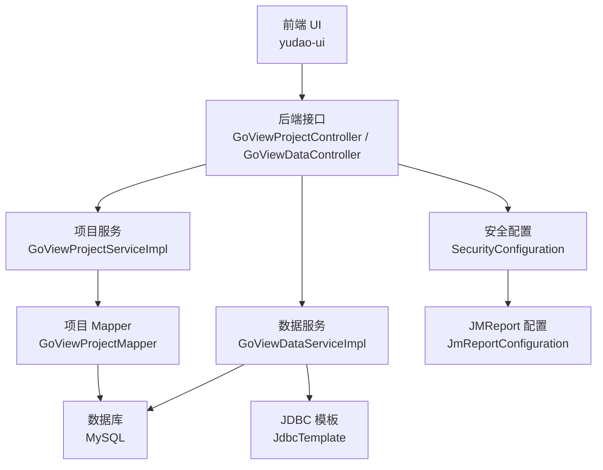
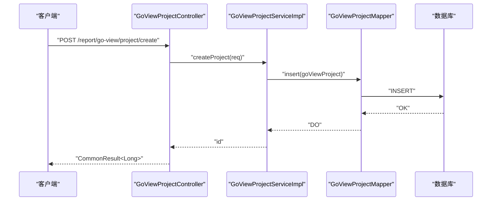
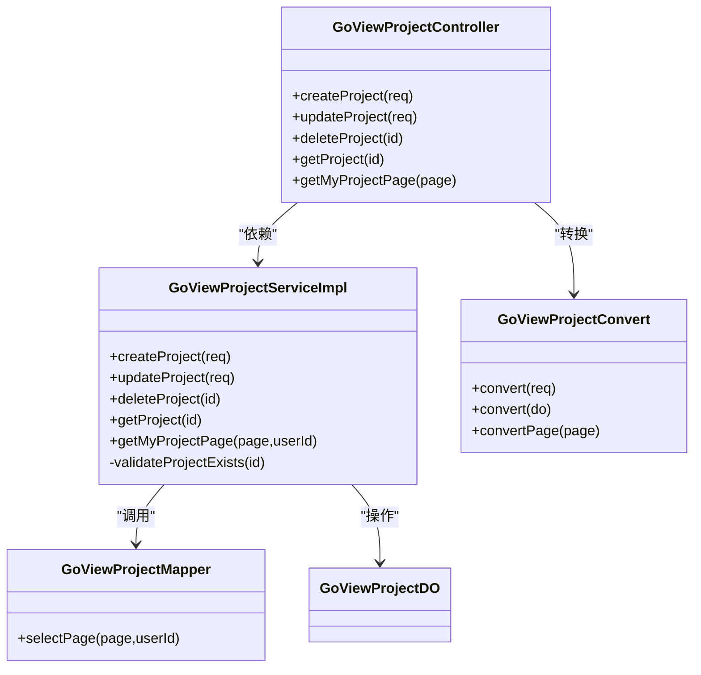
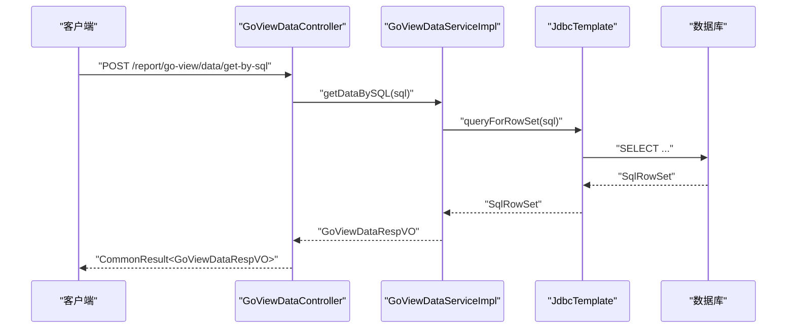
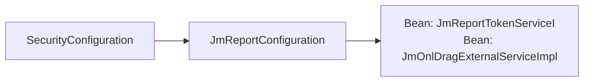
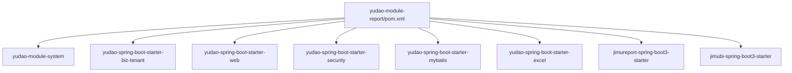
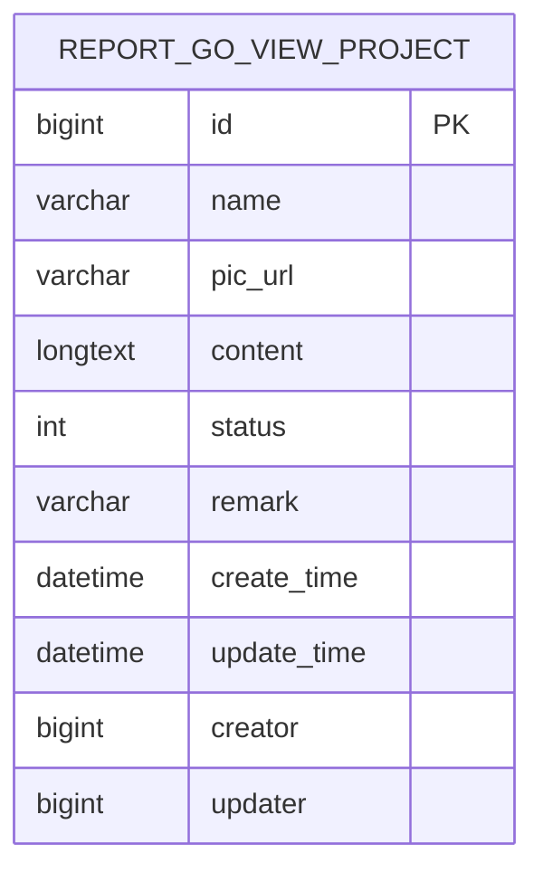

# 报表模块

<cite>
**本文引用的文件**
- [yudao-module-report/pom.xml](file://yudao-module-report/pom.xml)
- [GoViewProjectServiceImpl.java](file://yudao-module-report/src/main/java/cn/iocoder/yudao/module/report/service/goview/GoViewProjectServiceImpl.java)
- [GoViewDataServiceImpl.java](file://yudao-module-report/src/main/java/cn/iocoder/yudao/module/report/service/goview/GoViewDataServiceImpl.java)
- [GoViewProjectController.java](file://yudao-module-report/src/main/java/cn/iocoder/yudao/module/report/controller/admin/goview/GoViewProjectController.java)
- [GoViewDataController.java](file://yudao-module-report/src/main/java/cn/iocoder/yudao/module/report/controller/admin/goview/GoViewDataController.java)
- [GoViewProjectConvert.java](file://yudao-module-report/src/main/java/cn/iocoder/yudao/module/report/convert/goview/GoViewProjectConvert.java)
- [GoViewProjectDO.java](file://yudao-module-report/src/main/java/cn/iocoder/yudao/module/report/dal/dataobject/goview/GoViewProjectDO.java)
- [GoViewProjectMapper.java](file://yudao-module-report/src/main/java/cn/iocoder/yudao/module/report/dal/mysql/goview/GoViewProjectMapper.java)
- [JmReportConfiguration.java](file://yudao-module-report/src/main/java/cn/iocoder/yudao/module/report/framework/jmreport/config/JmReportConfiguration.java)
- [SecurityConfiguration.java](file://yudao-module-report/src/main/java/cn/iocoder/yudao/module/report/framework/security/config/SecurityConfiguration.java)
- [ErrorCodeConstants.java](file://yudao-module-report/src/main/java/cn/iocoder/yudao/module/report/enums/ErrorCodeConstants.java)
</cite>

## 目录
1. [简介](#简介)
2. [项目结构](#项目结构)
3. [核心组件](#核心组件)
4. [架构总览](#架构总览)
5. [详细组件分析](#详细组件分析)
6. [依赖关系分析](#依赖关系分析)
7. [性能与优化](#性能与优化)
8. [故障排查指南](#故障排查指南)
9. [结论](#结论)
10. [附录](#附录)

## 简介
本指南面向报表模块的开发者与实施人员，系统性讲解基于积木报表（JMReport）与 GoView 的集成与配置，覆盖项目管理、数据源配置、图表组件使用、权限控制与数据安全、API 接口定义、复杂报表与大数据场景实践以及性能优化策略。当前代码库已实现：
- 基于 JMReport 的报表引擎集成与安全适配
- 基于 GoView 的项目管理与数据查询能力
- 基于 MyBatis 的数据持久化与分页查询
- 基于 Spring Security 的访问控制与资源放行策略

## 项目结构
报表模块采用“模块化 + 分层”的组织方式，前端位于 yudao-ui，后端在 yudao-module-report 中，核心目录如下：
- controller/admin/goview：GoView 后端接口层
- service/goview：GoView 业务服务层
- convert/goview：对象转换层（MapStruct）
- dal/dataobject/goview：实体模型
- dal/mysql/goview：MyBatis Mapper
- framework/jmreport：JMReport 集成配置
- framework/security：安全放行配置
- enums：错误码常量

**图表来源**
- [GoViewProjectController.java:30-77](file://yudao-module-report/src/main/java/cn/iocoder/yudao/module/report/controller/admin/goview/GoViewProjectController.java#L30-L77)
- [GoViewDataController.java:25-63](file://yudao-module-report/src/main/java/cn/iocoder/yudao/module/report/controller/admin/goview/GoViewDataController.java#L25-L63)
- [GoViewProjectServiceImpl.java:24-74](file://yudao-module-report/src/main/java/cn/iocoder/yudao/module/report/service/goview/GoViewProjectServiceImpl.java#L24-L74)
- [GoViewDataServiceImpl.java:25-55](file://yudao-module-report/src/main/java/cn/iocoder/yudao/module/report/service/goview/GoViewDataServiceImpl.java#L25-L55)
- [GoViewProjectMapper.java:10-19](file://yudao-module-report/src/main/java/cn/iocoder/yudao/module/report/dal/mysql/goview/GoViewProjectMapper.java#L10-L19)
- [SecurityConfiguration.java:12-31](file://yudao-module-report/src/main/java/cn/iocoder/yudao/module/report/framework/security/config/SecurityConfiguration.java#L12-L31)
- [JmReportConfiguration.java:20-37](file://yudao-module-report/src/main/java/cn/iocoder/yudao/module/report/framework/jmreport/config/JmReportConfiguration.java#L20-L37)

**章节来源**
- [yudao-module-report/pom.xml:1-73](file://yudao-module-report/pom.xml#L1-L73)

## 核心组件
- GoView 项目管理
  - 控制器：提供创建、更新、删除、查询单个、分页查询接口
  - 服务：封装校验、插入、更新、删除、查询逻辑
  - 转换：MapStruct 将 VO 与 DO 转换
  - 持久化：MyBatis Mapper 实现分页查询
- GoView 数据查询
  - 控制器：SQL 查询与 HTTP 示例接口
  - 服务：JDBC 模板执行 SQL，解析元数据与行集
- JMReport 集成
  - 配置：扫描积木报表包、注入 Token 与拖拽扩展服务
- 安全放行
  - 配置：对 JMReport/Drag/Jimubi 路由放行
- 错误码
  - 统一错误码：GoView 项目不存在

**章节来源**
- [GoViewProjectController.java:30-77](file://yudao-module-report/src/main/java/cn/iocoder/yudao/module/report/controller/admin/goview/GoViewProjectController.java#L30-L77)
- [GoViewProjectServiceImpl.java:24-74](file://yudao-module-report/src/main/java/cn/iocoder/yudao/module/report/service/goview/GoViewProjectServiceImpl.java#L24-L74)
- [GoViewProjectConvert.java:11-24](file://yudao-module-report/src/main/java/cn/iocoder/yudao/module/report/convert/goview/GoViewProjectConvert.java#L11-L24)
- [GoViewProjectMapper.java:10-19](file://yudao-module-report/src/main/java/cn/iocoder/yudao/module/report/dal/mysql/goview/GoViewProjectMapper.java#L10-L19)
- [GoViewDataController.java:25-63](file://yudao-module-report/src/main/java/cn/iocoder/yudao/module/report/controller/admin/goview/GoViewDataController.java#L25-L63)
- [GoViewDataServiceImpl.java:25-55](file://yudao-module-report/src/main/java/cn/iocoder/yudao/module/report/service/goview/GoViewDataServiceImpl.java#L25-L55)
- [JmReportConfiguration.java:20-37](file://yudao-module-report/src/main/java/cn/iocoder/yudao/module/report/framework/jmreport/config/JmReportConfiguration.java#L20-L37)
- [SecurityConfiguration.java:12-31](file://yudao-module-report/src/main/java/cn/iocoder/yudao/module/report/framework/security/config/SecurityConfiguration.java#L12-L31)
- [ErrorCodeConstants.java:10-15](file://yudao-module-report/src/main/java/cn/iocoder/yudao/module/report/enums/ErrorCodeConstants.java#L10-L15)

## 架构总览
后端通过 Spring MVC 提供 REST 接口，服务层调用 MyBatis 或 JDBC 执行数据操作，安全层对特定路由进行放行以支持 JMReport 前端资源加载。

**图表来源**
- [GoViewProjectController.java:35-40](file://yudao-module-report/src/main/java/cn/iocoder/yudao/module/report/controller/admin/goview/GoViewProjectController.java#L35-L40)
- [GoViewProjectServiceImpl.java:32-39](file://yudao-module-report/src/main/java/cn/iocoder/yudao/module/report/service/goview/GoViewProjectServiceImpl.java#L32-L39)
- [GoViewProjectMapper.java:11-17](file://yudao-module-report/src/main/java/cn/iocoder/yudao/module/report/dal/mysql/goview/GoViewProjectMapper.java#L11-L17)

## 详细组件分析

### GoView 项目管理
- 控制器职责
  - 创建：鉴权、参数校验、调用服务
  - 更新/删除：鉴权、参数校验、调用服务
  - 查询：鉴权、分页查询、转换返回
- 服务职责
  - 校验存在性、插入/更新/删除、分页查询
- 持久化
  - 基于 BaseMapperX 的分页查询，按创建者过滤
- 转换
  - MapStruct 负责 VO/DO/PageResult 转换

**图表来源**
- [GoViewProjectController.java:30-77](file://yudao-module-report/src/main/java/cn/iocoder/yudao/module/report/controller/admin/goview/GoViewProjectController.java#L30-L77)
- [GoViewProjectServiceImpl.java:24-74](file://yudao-module-report/src/main/java/cn/iocoder/yudao/module/report/service/goview/GoViewProjectServiceImpl.java#L24-L74)
- [GoViewProjectMapper.java:10-19](file://yudao-module-report/src/main/java/cn/iocoder/yudao/module/report/dal/mysql/goview/GoViewProjectMapper.java#L10-L19)
- [GoViewProjectDO.java:16-57](file://yudao-module-report/src/main/java/cn/iocoder/yudao/module/report/dal/dataobject/goview/GoViewProjectDO.java#L16-L57)
- [GoViewProjectConvert.java:11-24](file://yudao-module-report/src/main/java/cn/iocoder/yudao/module/report/convert/goview/GoViewProjectConvert.java#L11-L24)

**章节来源**
- [GoViewProjectController.java:30-77](file://yudao-module-report/src/main/java/cn/iocoder/yudao/module/report/controller/admin/goview/GoViewProjectController.java#L30-L77)
- [GoViewProjectServiceImpl.java:24-74](file://yudao-module-report/src/main/java/cn/iocoder/yudao/module/report/service/goview/GoViewProjectServiceImpl.java#L24-L74)
- [GoViewProjectMapper.java:10-19](file://yudao-module-report/src/main/java/cn/iocoder/yudao/module/report/dal/mysql/goview/GoViewProjectMapper.java#L10-L19)
- [GoViewProjectDO.java:16-57](file://yudao-module-report/src/main/java/cn/iocoder/yudao/module/report/dal/dataobject/goview/GoViewProjectDO.java#L16-L57)
- [GoViewProjectConvert.java:11-24](file://yudao-module-report/src/main/java/cn/iocoder/yudao/module/report/convert/goview/GoViewProjectConvert.java#L11-L24)

### GoView 数据查询
- SQL 查询流程
  - 控制器接收 SQL 请求体
  - 服务使用 JdbcTemplate 执行查询
  - 解析元数据得到维度名，逐行读取构建明细数据
- HTTP 示例接口
  - 展示如何构造维度与明细数据，便于对接外部数据源

**图表来源**
- [GoViewDataController.java:34-39](file://yudao-module-report/src/main/java/cn/iocoder/yudao/module/report/controller/admin/goview/GoViewDataController.java#L34-L39)
- [GoViewDataServiceImpl.java:32-53](file://yudao-module-report/src/main/java/cn/iocoder/yudao/module/report/service/goview/GoViewDataServiceImpl.java#L32-L53)

**章节来源**
- [GoViewDataController.java:25-63](file://yudao-module-report/src/main/java/cn/iocoder/yudao/module/report/controller/admin/goview/GoViewDataController.java#L25-L63)
- [GoViewDataServiceImpl.java:16-55](file://yudao-module-report/src/main/java/cn/iocoder/yudao/module/report/service/goview/GoViewDataServiceImpl.java#L16-L55)

### JMReport 集成与安全
- JMReport 配置
  - 扫描积木报表包，注入 Token 服务与拖拽扩展服务 Bean
- 安全放行
  - 对 /jmreport/**、/drag/**、/jimubi/** 放行，便于前端加载静态资源与交互

**图表来源**
- [SecurityConfiguration.java:12-31](file://yudao-module-report/src/main/java/cn/iocoder/yudao/module/report/framework/security/config/SecurityConfiguration.java#L12-L31)
- [JmReportConfiguration.java:20-37](file://yudao-module-report/src/main/java/cn/iocoder/yudao/module/report/framework/jmreport/config/JmReportConfiguration.java#L20-L37)

**章节来源**
- [JmReportConfiguration.java:15-37](file://yudao-module-report/src/main/java/cn/iocoder/yudao/module/report/framework/jmreport/config/JmReportConfiguration.java#L15-L37)
- [SecurityConfiguration.java:9-31](file://yudao-module-report/src/main/java/cn/iocoder/yudao/module/report/framework/security/config/SecurityConfiguration.java#L9-L31)

## 依赖关系分析
- 模块依赖
  - 报表模块依赖系统模块、租户、Web、安全、MyBatis、Excel、测试等基础能力
  - 集成 JMReport Starter 与 Jimubi Starter
- 内部耦合
  - 控制器仅依赖服务接口，服务依赖 Mapper/DAO，降低耦合
  - 使用 MapStruct 进行 VO/DO 转换，提升一致性与可维护性

**图表来源**
- [yudao-module-report/pom.xml:20-70](file://yudao-module-report/pom.xml#L20-L70)

**章节来源**
- [yudao-module-report/pom.xml:1-73](file://yudao-module-report/pom.xml#L1-L73)

## 性能与优化
- 分页查询
  - 使用 PageParam 与 LambdaQueryWrapperX 实现分页，避免一次性加载全部数据
- JDBC 查询
  - 使用 queryForRowSet 获取 SqlRowSet，逐行遍历构建结果，适合中等规模数据
- 大数据量建议
  - 可引入 ClickHouse、Elasticsearch 等 OLAP/搜索引擎作为数据源
  - 对热点查询建立索引，优化 WHERE/HAVING/GROUP BY 子句
  - 使用缓存中间件（Redis）缓存高频报表结果，设置合理过期时间
- 渲染优化
  - 前端按需加载图表组件，延迟初始化
  - 合理拆分报表为多个子模块，减少单次渲染压力

[本节为通用指导，无需列出具体文件来源]

## 故障排查指南
- 项目不存在
  - 当根据 ID 查询不到项目时，抛出“GoView 项目不存在”错误码
- SQL 查询异常
  - 检查 SQL 语法与权限，确认数据源连通性
- 权限不足
  - 确认用户是否具备相应菜单权限（如 report:go-view-project:*）
- 资源放行问题
  - 若 JMReport 前端无法加载，请检查安全配置中的放行规则

**章节来源**
- [ErrorCodeConstants.java:10-15](file://yudao-module-report/src/main/java/cn/iocoder/yudao/module/report/enums/ErrorCodeConstants.java#L10-L15)
- [GoViewProjectServiceImpl.java:58-62](file://yudao-module-report/src/main/java/cn/iocoder/yudao/module/report/service/goview/GoViewProjectServiceImpl.java#L58-L62)
- [SecurityConfiguration.java:15-29](file://yudao-module-report/src/main/java/cn/iocoder/yudao/module/report/framework/security/config/SecurityConfiguration.java#L15-L29)

## 结论
报表模块以 JMReport 与 GoView 为核心，结合权限放行、统一错误码与分层架构，提供了从项目管理到数据查询的完整能力。建议在生产环境中配合缓存、索引与异步计算，进一步提升报表性能与稳定性。

[本节为总结性内容，无需列出具体文件来源]

## 附录

### API 接口清单（后端）
- GoView 项目管理
  - POST /report/go-view/project/create：创建项目
  - PUT /report/go-view/project/update：更新项目
  - DELETE /report/go-view/project/delete?id=...：删除项目
  - GET /report/go-view/project/get?id=...：获取项目详情
  - GET /report/go-view/project/my-page：分页获取我的项目
- GoView 数据查询
  - POST /report/go-view/data/get-by-sql：SQL 查询
  - GET /report/go-view/data/get-by-http：HTTP 示例查询

**章节来源**
- [GoViewProjectController.java:35-75](file://yudao-module-report/src/main/java/cn/iocoder/yudao/module/report/controller/admin/goview/GoViewProjectController.java#L35-L75)
- [GoViewDataController.java:34-61](file://yudao-module-report/src/main/java/cn/iocoder/yudao/module/report/controller/admin/goview/GoViewDataController.java#L34-L61)

### 数据模型（GoView 项目）

**图表来源**
- [GoViewProjectDO.java:16-57](file://yudao-module-report/src/main/java/cn/iocoder/yudao/module/report/dal/dataobject/goview/GoViewProjectDO.java#L16-L57)