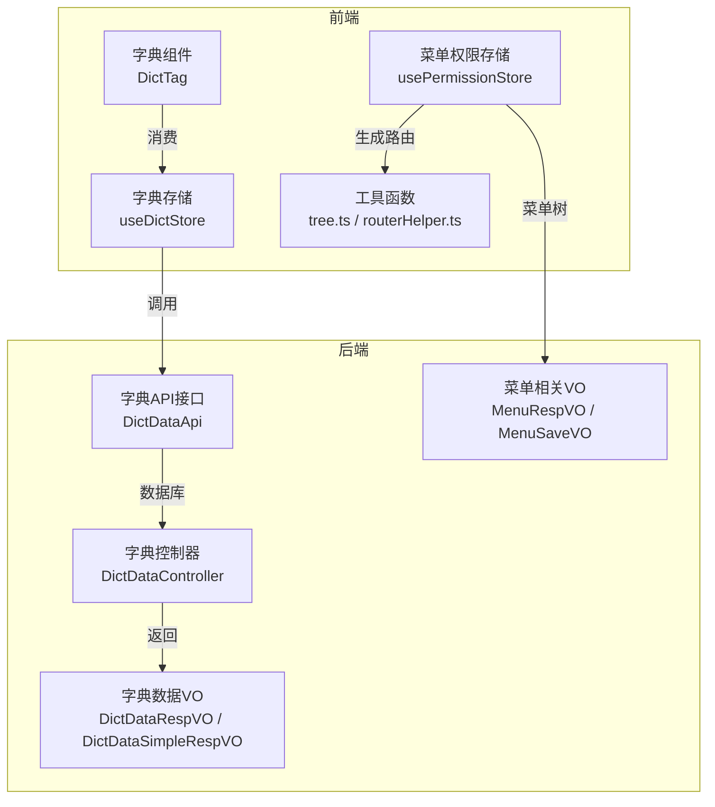
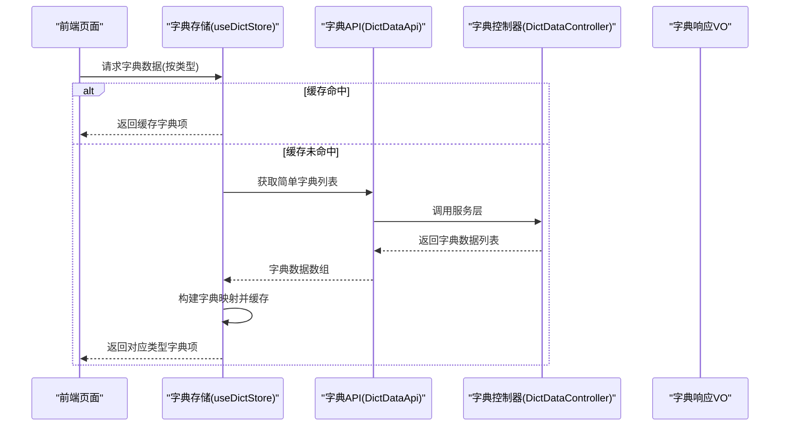
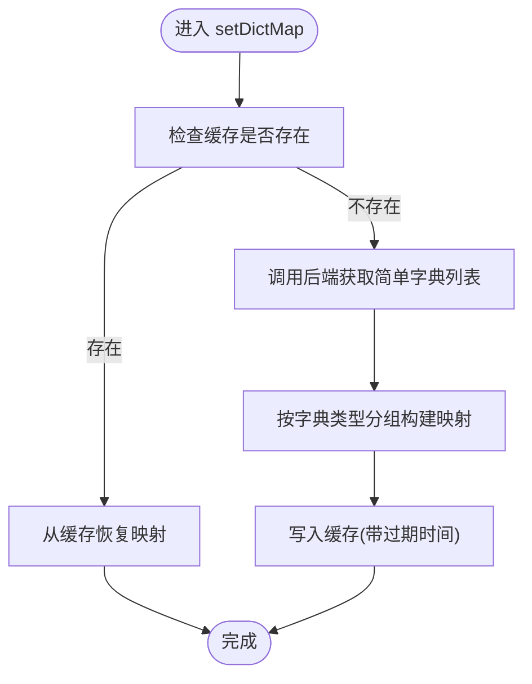
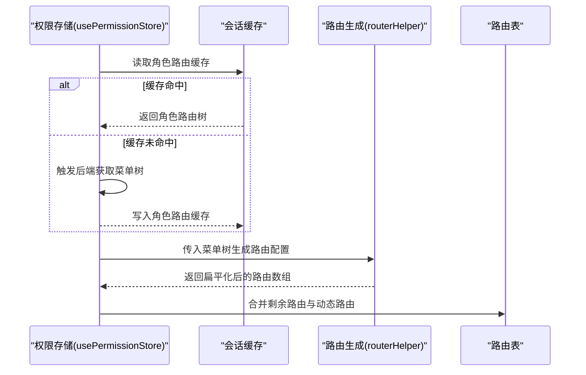
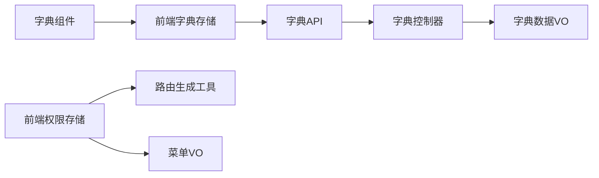

# 字典菜单管理

<cite>
**本文引用的文件**
- [yudao-ui/yudao-ui-admin-vue3/src/store/modules/dict.ts](file://yudao-ui/yudao-ui-admin-vue3/src/store/modules/dict.ts)
- [yudao-ui/yudao-ui-admin-vue3/src/api/system/dict/dict.data.ts](file://yudao-ui/yudao-ui-admin-vue3/src/api/system/dict/dict.data.ts)
- [yudao-ui/yudao-ui-admin-vue3/src/components/DictTag/index.ts](file://yudao-ui/yudao-ui-admin-vue3/src/components/DictTag/index.ts)
- [yudao-ui/yudao-ui-admin-vue3/src/utils/tree.ts](file://yudao-ui/yudao-ui-admin-vue3/src/utils/tree.ts)
- [yudao-ui/yudao-ui-admin-vue3/src/utils/routerHelper.ts](file://yudao-ui/yudao-ui-admin-vue3/src/utils/routerHelper.ts)
- [yudao-ui/yudao-ui-admin-vue3/src/store/modules/permission.ts](file://yudao-ui/yudao-ui-admin-vue3/src/store/modules/permission.ts)
- [yudao-module-system/src/main/java/cn/iocoder/yudao/module/system/api/dict/DictDataApi.java](file://yudao-module-system/src/main/java/cn/iocoder/yudao/module/system/api/dict/DictDataApi.java)
- [yudao-module-system/src/main/java/cn/iocoder/yudao/module/system/controller/admin/dict/DictDataController.java](file://yudao-module-system/src/main/java/cn/iocoder/yudao/module/system/controller/admin/dict/DictDataController.java)
- [yudao-module-system/src/main/java/cn/iocoder/yudao/module/system/controller/admin/dict/vo/data/DictDataRespVO.java](file://yudao-module-system/src/main/java/cn/iocoder/yudao/module/system/controller/admin/dict/vo/data/DictDataRespVO.java)
- [yudao-module-system/src/main/java/cn/iocoder/yudao/module/system/controller/admin/dict/vo/data/DictDataSimpleRespVO.java](file://yudao-module-system/src/main/java/cn/iocoder/yudao/module/system/controller/admin/dict/vo/data/DictDataSimpleRespVO.java)
- [yudao-module-system/src/main/java/cn/iocoder/yudao/module/system/controller/admin/dict/vo/data/DictDataPageReqVO.java](file://yudao-module-system/src/main/java/cn/iocoder/yudao/module/system/controller/admin/dict/vo/data/DictDataPageReqVO.java)
- [yudao-module-system/src/main/java/cn/iocoder/yudao/module/system/controller/admin/dict/vo/data/DictDataSaveReqVO.java](file://yudao-module-system/src/main/java/cn/iocoder/yudao/module/system/controller/admin/dict/vo/data/DictDataSaveReqVO.java)
- [yudao-module-system/src/main/java/cn/iocoder/yudao/module/system/controller/admin/dict/vo/type/DictTypePageReqVO.java](file://yudao-module-system/src/main/java/cn/iocoder/yudao/module/system/controller/admin/dict/vo/type/DictTypePageReqVO.java)
- [yudao-module-system/src/main/java/cn/iocoder/yudao/module/system/controller/admin/dict/vo/type/DictTypeRespVO.java](file://yudao-module-system/src/main/java/cn/iocoder/yudao/module/system/controller/admin/dict/vo/type/DictTypeRespVO.java)
- [yudao-module-system/src/main/java/cn/iocoder/yudao/module/system/controller/admin/dict/vo/type/DictTypeSaveReqVO.java](file://yudao-module-system/src/main/java/cn/iocoder/yudao/module/system/controller/admin/dict/vo/type/DictTypeSaveReqVO.java)
- [yudao-module-system/src/main/java/cn/iocoder/yudao/module/system/controller/admin/permission/vo/menu/MenuListReqVO.java](file://yudao-module-system/src/main/java/cn/iocoder/yudao/module/system/controller/admin/permission/vo/menu/MenuListReqVO.java)
- [yudao-module-system/src/main/java/cn/iocoder/yudao/module/system/controller/admin/permission/vo/menu/MenuRespVO.java](file://yudao-module-system/src/main/java/cn/iocoder/yudao/module/system/controller/admin/permission/vo/menu/MenuRespVO.java)
- [yudao-module-system/src/main/java/cn/iocoder/yudao/module/system/controller/admin/permission/vo/menu/MenuSaveVO.java](file://yudao-module-system/src/main/java/cn/iocoder/yudao/module/system/controller/admin/permission/vo/menu/MenuSaveVO.java)
- [yudao-module-system/src/main/java/cn/iocoder/yudao/module/system/controller/admin/permission/vo/menu/MenuSimpleRespVO.java](file://yudao-module-system/src/main/java/cn/iocoder/yudao/module/system/controller/admin/permission/vo/menu/MenuSimpleRespVO.java)
</cite>

## 目录
1. [简介](#简介)
2. [项目结构](#项目结构)
3. [核心组件](#核心组件)
4. [架构总览](#架构总览)
5. [详细组件分析](#详细组件分析)
6. [依赖关系分析](#依赖关系分析)
7. [性能考虑](#性能考虑)
8. [故障排查指南](#故障排查指南)
9. [结论](#结论)
10. [附录](#附录)

## 简介
本指南围绕“字典菜单管理”主题，系统性阐述后端字典类型与字典数据的管理机制、前端字典缓存与国际化支持、以及菜单系统的动态加载与权限控制。内容覆盖：
- 字典类型与字典数据的增删改查、缓存策略与国际化适配
- 菜单树形结构、权限过滤、前端路由生成与状态管理
- 字典在系统中的典型应用：下拉选择、标签展示、搜索过滤
- 完整的API接口定义与调用示例路径
- 实战示例：字典数据获取、菜单动态渲染、权限过滤与前端组件集成

## 项目结构
该仓库采用前后端分离架构，前端基于 Vue3 + TypeScript + Pinia，后端基于 Spring Boot。与字典菜单管理直接相关的模块分布如下：
- 前端（yudao-ui-admin-vue3）：字典缓存与组件、菜单权限与路由生成
- 后端（yudao-module-system）：字典类型与数据的API、控制器与VO模型

图表来源
- [yudao-ui/yudao-ui-admin-vue3/src/store/modules/dict.ts:1-110](file://yudao-ui/yudao-ui-admin-vue3/src/store/modules/dict.ts#L1-L110)
- [yudao-ui/yudao-ui-admin-vue3/src/store/modules/permission.ts:1-79](file://yudao-ui/yudao-ui-admin-vue3/src/store/modules/permission.ts#L1-L79)
- [yudao-ui/yudao-ui-admin-vue3/src/utils/routerHelper.ts:153-220](file://yudao-ui/yudao-ui-admin-vue3/src/utils/routerHelper.ts#L153-L220)
- [yudao-module-system/src/main/java/cn/iocoder/yudao/module/system/api/dict/DictDataApi.java](file://yudao-module-system/src/main/java/cn/iocoder/yudao/module/system/api/dict/DictDataApi.java)
- [yudao-module-system/src/main/java/cn/iocoder/yudao/module/system/controller/admin/dict/DictDataController.java](file://yudao-module-system/src/main/java/cn/iocoder/yudao/module/system/controller/admin/dict/DictDataController.java)
- [yudao-module-system/src/main/java/cn/iocoder/yudao/module/system/controller/admin/dict/vo/data/DictDataRespVO.java](file://yudao-module-system/src/main/java/cn/iocoder/yudao/module/system/controller/admin/dict/vo/data/DictDataRespVO.java)
- [yudao-module-system/src/main/java/cn/iocoder/yudao/module/system/controller/admin/dict/vo/data/DictDataSimpleRespVO.java](file://yudao-module-system/src/main/java/cn/iocoder/yudao/module/system/controller/admin/dict/vo/data/DictDataSimpleRespVO.java)
- [yudao-module-system/src/main/java/cn/iocoder/yudao/module/system/controller/admin/permission/vo/menu/MenuRespVO.java](file://yudao-module-system/src/main/java/cn/iocoder/yudao/module/system/controller/admin/permission/vo/menu/MenuRespVO.java)

章节来源
- [yudao-ui/yudao-ui-admin-vue3/src/store/modules/dict.ts:1-110](file://yudao-ui/yudao-ui-admin-vue3/src/store/modules/dict.ts#L1-L110)
- [yudao-ui/yudao-ui-admin-vue3/src/store/modules/permission.ts:1-79](file://yudao-ui/yudao-ui-admin-vue3/src/store/modules/permission.ts#L1-L79)
- [yudao-module-system/src/main/java/cn/iocoder/yudao/module/system/api/dict/DictDataApi.java](file://yudao-module-system/src/main/java/cn/iocoder/yudao/module/system/api/dict/DictDataApi.java)
- [yudao-module-system/src/main/java/cn/iocoder/yudao/module/system/controller/admin/dict/DictDataController.java](file://yudao-module-system/src/main/java/cn/iocoder/yudao/module/system/controller/admin/dict/DictDataController.java)

## 核心组件
- 字典存储（useDictStore）
  - 负责从后端批量获取字典数据，构建按字典类型的映射表，并以短时缓存保存，减少重复请求
  - 提供按类型获取字典项列表的方法，支持颜色类型与CSS类等扩展字段
- 菜单权限存储（usePermissionStore）
  - 负责根据角色拥有的菜单集合生成路由表，合并剩余路由，完成动态路由注入
  - 支持菜单根路径设置与菜单标签页路由管理
- 字典组件（DictTag）
  - 将字典值映射为带颜色或样式的标签，用于界面展示
- 工具函数（tree.ts / routerHelper.ts）
  - 树形结构处理：父子关系、平铺转树、折叠同名默认页等
  - 路由生成：根据菜单树生成可被Vue Router识别的路由配置

章节来源
- [yudao-ui/yudao-ui-admin-vue3/src/store/modules/dict.ts:24-106](file://yudao-ui/yudao-ui-admin-vue3/src/store/modules/dict.ts#L24-L106)
- [yudao-ui/yudao-ui-admin-vue3/src/store/modules/permission.ts:17-75](file://yudao-ui/yudao-ui-admin-vue3/src/store/modules/permission.ts#L17-L75)
- [yudao-ui/yudao-ui-admin-vue3/src/components/DictTag/index.ts](file://yudao-ui/yudao-ui-admin-vue3/src/components/DictTag/index.ts)
- [yudao-ui/yudao-ui-admin-vue3/src/utils/tree.ts](file://yudao-ui/yudao-ui-admin-vue3/src/utils/tree.ts)
- [yudao-ui/yudao-ui-admin-vue3/src/utils/routerHelper.ts:153-220](file://yudao-ui/yudao-ui-admin-vue3/src/utils/routerHelper.ts#L153-L220)

## 架构总览
从前端到后端的数据流与职责划分如下：

图表来源
- [yudao-ui/yudao-ui-admin-vue3/src/store/modules/dict.ts:42-72](file://yudao-ui/yudao-ui-admin-vue3/src/store/modules/dict.ts#L42-L72)
- [yudao-module-system/src/main/java/cn/iocoder/yudao/module/system/api/dict/DictDataApi.java](file://yudao-module-system/src/main/java/cn/iocoder/yudao/module/system/api/dict/DictDataApi.java)
- [yudao-module-system/src/main/java/cn/iocoder/yudao/module/system/controller/admin/dict/DictDataController.java](file://yudao-module-system/src/main/java/cn/iocoder/yudao/module/system/controller/admin/dict/DictDataController.java)
- [yudao-module-system/src/main/java/cn/iocoder/yudao/module/system/controller/admin/dict/vo/data/DictDataSimpleRespVO.java](file://yudao-module-system/src/main/java/cn/iocoder/yudao/module/system/controller/admin/dict/vo/data/DictDataSimpleRespVO.java)

## 详细组件分析

### 字典存储与缓存策略
- 数据结构
  - 字典映射：键为字典类型，值为包含value、label、colorType、cssClass等字段的数组
  - 缓存键：统一使用缓存常量中的字典缓存键，采用会话级存储
- 加载流程
  - 若缓存存在且有效，直接读取并赋值给内存映射
  - 若缓存不存在，则调用后端接口获取简单字典列表，构建映射后写入缓存（短期过期）
- 访问流程
  - 提供按类型获取字典项列表的方法；若尚未初始化，自动触发一次加载

图表来源
- [yudao-ui/yudao-ui-admin-vue3/src/store/modules/dict.ts:42-72](file://yudao-ui/yudao-ui-admin-vue3/src/store/modules/dict.ts#L42-L72)

章节来源
- [yudao-ui/yudao-ui-admin-vue3/src/store/modules/dict.ts:24-106](file://yudao-ui/yudao-ui-admin-vue3/src/store/modules/dict.ts#L24-L106)

### 菜单权限与动态路由
- 菜单来源
  - 登录后通过用户信息设置方法获取菜单列表，存入会话缓存
- 路由生成
  - 使用工具函数将菜单树转换为路由配置，处理外链、组件路径匹配、同名默认页折叠等
  - 将生成的动态路由与剩余路由合并，注入到全局路由表
- 权限过滤
  - 仅对拥有访问权限的菜单生成路由，未授权菜单不会出现在最终路由表中

图表来源
- [yudao-ui/yudao-ui-admin-vue3/src/store/modules/permission.ts:39-66](file://yudao-ui/yudao-ui-admin-vue3/src/store/modules/permission.ts#L39-L66)
- [yudao-ui/yudao-ui-admin-vue3/src/utils/routerHelper.ts:153-220](file://yudao-ui/yudao-ui-admin-vue3/src/utils/routerHelper.ts#L153-L220)

章节来源
- [yudao-ui/yudao-ui-admin-vue3/src/store/modules/permission.ts:17-75](file://yudao-ui/yudao-ui-admin-vue3/src/store/modules/permission.ts#L17-L75)
- [yudao-ui/yudao-ui-admin-vue3/src/utils/routerHelper.ts:153-220](file://yudao-ui/yudao-ui-admin-vue3/src/utils/routerHelper.ts#L153-L220)

### 字典组件与国际化支持
- 组件职责
  - 根据传入的字典类型与值，查找对应字典项的label与样式字段
  - 支持颜色类型与CSS类，便于在不同主题下呈现一致的视觉效果
- 国际化
  - label通常来自后端字典项的本地化字段；前端无需额外处理，直接展示即可

章节来源
- [yudao-ui/yudao-ui-admin-vue3/src/components/DictTag/index.ts](file://yudao-ui/yudao-ui-admin-vue3/src/components/DictTag/index.ts)
- [yudao-ui/yudao-ui-admin-vue3/src/store/modules/dict.ts:73-78](file://yudao-ui/yudao-ui-admin-vue3/src/store/modules/dict.ts#L73-L78)

### 树形结构与路由折叠规则
- 树形处理
  - 支持父子关系解析、平铺转树、同名默认页折叠等逻辑
- 路由生成规则
  - 顶级目录承载框架布局；非顶级目录仅作为占位，避免多级菜单嵌套Layout
  - 外链菜单生成外部容器路由；内链菜单根据组件路径匹配模块
  - 同名默认页仅在满足特定条件时折叠到父路由，避免影响多子菜单展示

章节来源
- [yudao-ui/yudao-ui-admin-vue3/src/utils/tree.ts](file://yudao-ui/yudao-ui-admin-vue3/src/utils/tree.ts)
- [yudao-ui/yudao-ui-admin-vue3/src/utils/routerHelper.ts:153-220](file://yudao-ui/yudao-ui-admin-vue3/src/utils/routerHelper.ts#L153-L220)

## 依赖关系分析
- 前端依赖
  - 字典存储依赖字典API与会话缓存
  - 权限存储依赖路由生成工具与会话缓存
  - 字典组件依赖字典存储
- 后端依赖
  - 字典API对接字典控制器，控制器返回VO对象
  - 菜单相关VO用于菜单列表、保存、简单响应等场景

图表来源
- [yudao-ui/yudao-ui-admin-vue3/src/store/modules/dict.ts:1-110](file://yudao-ui/yudao-ui-admin-vue3/src/store/modules/dict.ts#L1-L110)
- [yudao-ui/yudao-ui-admin-vue3/src/store/modules/permission.ts:1-79](file://yudao-ui/yudao-ui-admin-vue3/src/store/modules/permission.ts#L1-L79)
- [yudao-module-system/src/main/java/cn/iocoder/yudao/module/system/api/dict/DictDataApi.java](file://yudao-module-system/src/main/java/cn/iocoder/yudao/module/system/api/dict/DictDataApi.java)
- [yudao-module-system/src/main/java/cn/iocoder/yudao/module/system/controller/admin/dict/DictDataController.java](file://yudao-module-system/src/main/java/cn/iocoder/yudao/module/system/controller/admin/dict/DictDataController.java)
- [yudao-module-system/src/main/java/cn/iocoder/yudao/module/system/controller/admin/dict/vo/data/DictDataRespVO.java](file://yudao-module-system/src/main/java/cn/iocoder/yudao/module/system/controller/admin/dict/vo/data/DictDataRespVO.java)
- [yudao-module-system/src/main/java/cn/iocoder/yudao/module/system/controller/admin/permission/vo/menu/MenuRespVO.java](file://yudao-module-system/src/main/java/cn/iocoder/yudao/module/system/controller/admin/permission/vo/menu/MenuRespVO.java)

## 性能考虑
- 字典缓存
  - 采用会话级缓存，设置短期过期时间，降低后端压力并保证数据新鲜度
  - 首次访问自动拉取，后续直接命中缓存
- 路由生成
  - 菜单树转路由时进行同名默认页折叠，减少不必要的路由层级，提升渲染效率
- 组件渲染
  - 字典标签组件按需渲染，避免重复计算

## 故障排查指南
- 字典不显示或为空
  - 检查是否已成功调用后端获取简单字典列表
  - 确认缓存键是否正确，以及缓存是否过期
  - 核对字典类型是否与业务一致
- 菜单不显示或路由异常
  - 检查角色路由缓存是否正确写入
  - 确认菜单树结构与路由生成规则是否符合预期
  - 核对外链与组件路径配置
- 国际化显示异常
  - 确认后端返回的label字段是否包含本地化值

章节来源
- [yudao-ui/yudao-ui-admin-vue3/src/store/modules/dict.ts:42-72](file://yudao-ui/yudao-ui-admin-vue3/src/store/modules/dict.ts#L42-L72)
- [yudao-ui/yudao-ui-admin-vue3/src/store/modules/permission.ts:39-66](file://yudao-ui/yudao-ui-admin-vue3/src/store/modules/permission.ts#L39-L66)

## 结论
本指南提供了从后端字典管理到前端动态渲染与权限控制的完整方案。通过合理的缓存策略、清晰的树形结构与路由生成规则，以及可复用的字典组件，能够高效支撑各类业务场景下的下拉选择、标签展示与搜索过滤需求。

## 附录

### API 接口定义与调用示例

- 字典类型管理
  - 列表查询
    - 接口：GET /admin-api/system/dict-type/list
    - 请求参数：参考 [DictTypePageReqVO](file://yudao-module-system/src/main/java/cn/iocoder/yudao/module/system/controller/admin/dict/vo/type/DictTypePageReqVO.java)
    - 返回值：字典类型列表，参考 [DictTypeRespVO](file://yudao-module-system/src/main/java/cn/iocoder/yudao/module/system/controller/admin/dict/vo/type/DictTypeRespVO.java)
  - 新增/修改
    - 接口：POST /admin-api/system/dict-type/create | PUT /admin-api/system/dict-type/update
    - 请求体：参考 [DictTypeSaveReqVO](file://yudao-module-system/src/main/java/cn/iocoder/yudao/module/system/controller/admin/dict/vo/type/DictTypeSaveReqVO.java)
  - 删除
    - 接口：DELETE /admin-api/system/dict-type/delete?id=xxx

- 字典数据管理
  - 列表查询
    - 接口：GET /admin-api/system/dict-data/page
    - 请求参数：参考 [DictDataPageReqVO](file://yudao-module-system/src/main/java/cn/iocoder/yudao/module/system/controller/admin/dict/vo/data/DictDataPageReqVO.java)
    - 返回值：字典数据分页结果，参考 [DictDataRespVO](file://yudao-module-system/src/main/java/cn/iocoder/yudao/module/system/controller/admin/dict/vo/data/DictDataRespVO.java)
  - 简单列表（前端缓存用）
    - 接口：GET /admin-api/system/dict-data/list
    - 返回值：字典数据列表，参考 [DictDataSimpleRespVO](file://yudao-module-system/src/main/java/cn/iocoder/yudao/module/system/controller/admin/dict/vo/data/DictDataSimpleRespVO.java)
  - 新增/修改
    - 接口：POST /admin-api/system/dict-data/create | PUT /admin-api/system/dict-data/update
    - 请求体：参考 [DictDataSaveReqVO](file://yudao-module-system/src/main/java/cn/iocoder/yudao/module/system/controller/admin/dict/vo/data/DictDataSaveReqVO.java)
  - 删除
    - 接口：DELETE /admin-api/system/dict-data/delete?id=xxx

- 菜单管理
  - 列表获取
    - 接口：GET /admin-api/system/menu/list
    - 请求参数：参考 [MenuListReqVO](file://yudao-module-system/src/main/java/cn/iocoder/yudao/module/system/controller/admin/permission/vo/menu/MenuListReqVO.java)
    - 返回值：菜单列表，参考 [MenuRespVO](file://yudao-module-system/src/main/java/cn/iocoder/yudao/module/system/controller/admin/permission/vo/menu/MenuRespVO.java)
  - 菜单树形结构
    - 接口：GET /admin-api/system/menu/tree
    - 返回值：菜单树，参考 [MenuRespVO](file://yudao-module-system/src/main/java/cn/iocoder/yudao/module/system/controller/admin/permission/vo/menu/MenuRespVO.java)
  - 新增/修改/删除
    - 接口：POST /admin-api/system/menu/create | PUT /admin-api/system/menu/update | DELETE /admin-api/system/menu/delete?id=xxx
    - 请求体：参考 [MenuSaveVO](file://yudao-module-system/src/main/java/cn/iocoder/yudao/module/system/controller/admin/permission/vo/menu/MenuSaveVO.java)

- 前端调用示例（路径）
  - 获取简单字典列表：[yudao-ui/yudao-ui-admin-vue3/src/api/system/dict/dict.data.ts](file://yudao-ui/yudao-ui-admin-vue3/src/api/system/dict/dict.data.ts)
  - 字典存储加载与访问：[yudao-ui/yudao-ui-admin-vue3/src/store/modules/dict.ts:42-78](file://yudao-ui/yudao-ui-admin-vue3/src/store/modules/dict.ts#L42-L78)
  - 菜单权限与路由生成：[yudao-ui/yudao-ui-admin-vue3/src/store/modules/permission.ts:39-66](file://yudao-ui/yudao-ui-admin-vue3/src/store/modules/permission.ts#L39-L66), [yudao-ui/yudao-ui-admin-vue3/src/utils/routerHelper.ts:153-220](file://yudao-ui/yudao-ui-admin-vue3/src/utils/routerHelper.ts#L153-L220)

章节来源
- [yudao-module-system/src/main/java/cn/iocoder/yudao/module/system/controller/admin/dict/vo/type/DictTypePageReqVO.java](file://yudao-module-system/src/main/java/cn/iocoder/yudao/module/system/controller/admin/dict/vo/type/DictTypePageReqVO.java)
- [yudao-module-system/src/main/java/cn/iocoder/yudao/module/system/controller/admin/dict/vo/type/DictTypeRespVO.java](file://yudao-module-system/src/main/java/cn/iocoder/yudao/module/system/controller/admin/dict/vo/type/DictTypeRespVO.java)
- [yudao-module-system/src/main/java/cn/iocoder/yudao/module/system/controller/admin/dict/vo/type/DictTypeSaveReqVO.java](file://yudao-module-system/src/main/java/cn/iocoder/yudao/module/system/controller/admin/dict/vo/type/DictTypeSaveReqVO.java)
- [yudao-module-system/src/main/java/cn/iocoder/yudao/module/system/controller/admin/dict/vo/data/DictDataPageReqVO.java](file://yudao-module-system/src/main/java/cn/iocoder/yudao/module/system/controller/admin/dict/vo/data/DictDataPageReqVO.java)
- [yudao-module-system/src/main/java/cn/iocoder/yudao/module/system/controller/admin/dict/vo/data/DictDataRespVO.java](file://yudao-module-system/src/main/java/cn/iocoder/yudao/module/system/controller/admin/dict/vo/data/DictDataRespVO.java)
- [yudao-module-system/src/main/java/cn/iocoder/yudao/module/system/controller/admin/dict/vo/data/DictDataSimpleRespVO.java](file://yudao-module-system/src/main/java/cn/iocoder/yudao/module/system/controller/admin/dict/vo/data/DictDataSimpleRespVO.java)
- [yudao-module-system/src/main/java/cn/iocoder/yudao/module/system/controller/admin/dict/vo/data/DictDataSaveReqVO.java](file://yudao-module-system/src/main/java/cn/iocoder/yudao/module/system/controller/admin/dict/vo/data/DictDataSaveReqVO.java)
- [yudao-module-system/src/main/java/cn/iocoder/yudao/module/system/controller/admin/permission/vo/menu/MenuListReqVO.java](file://yudao-module-system/src/main/java/cn/iocoder/yudao/module/system/controller/admin/permission/vo/menu/MenuListReqVO.java)
- [yudao-module-system/src/main/java/cn/iocoder/yudao/module/system/controller/admin/permission/vo/menu/MenuRespVO.java](file://yudao-module-system/src/main/java/cn/iocoder/yudao/module/system/controller/admin/permission/vo/menu/MenuRespVO.java)
- [yudao-module-system/src/main/java/cn/iocoder/yudao/module/system/controller/admin/permission/vo/menu/MenuSaveVO.java](file://yudao-module-system/src/main/java/cn/iocoder/yudao/module/system/controller/admin/permission/vo/menu/MenuSaveVO.java)
- [yudao-module-system/src/main/java/cn/iocoder/yudao/module/system/controller/admin/permission/vo/menu/MenuSimpleRespVO.java](file://yudao-module-system/src/main/java/cn/iocoder/yudao/module/system/controller/admin/permission/vo/menu/MenuSimpleRespVO.java)
- [yudao-ui/yudao-ui-admin-vue3/src/api/system/dict/dict.data.ts](file://yudao-ui/yudao-ui-admin-vue3/src/api/system/dict/dict.data.ts)
- [yudao-ui/yudao-ui-admin-vue3/src/store/modules/dict.ts:42-78](file://yudao-ui/yudao-ui-admin-vue3/src/store/modules/dict.ts#L42-L78)
- [yudao-ui/yudao-ui-admin-vue3/src/store/modules/permission.ts:39-66](file://yudao-ui/yudao-ui-admin-vue3/src/store/modules/permission.ts#L39-L66)
- [yudao-ui/yudao-ui-admin-vue3/src/utils/routerHelper.ts:153-220](file://yudao-ui/yudao-ui-admin-vue3/src/utils/routerHelper.ts#L153-L220)