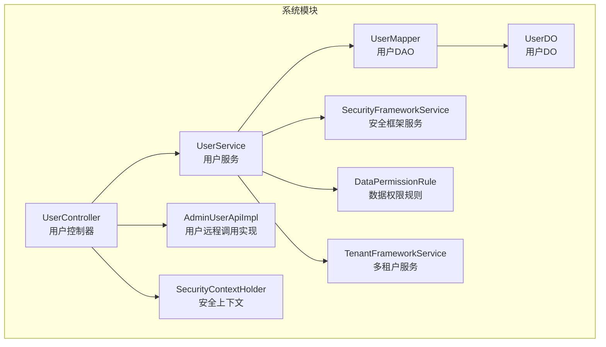
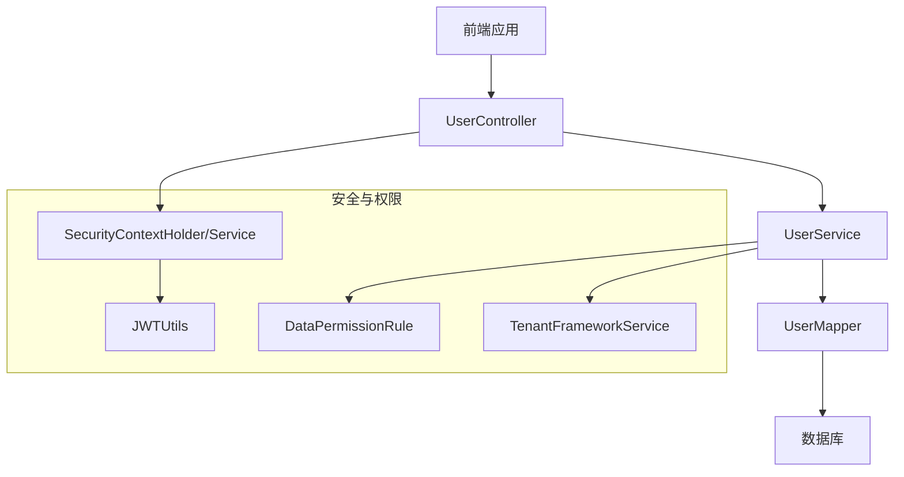
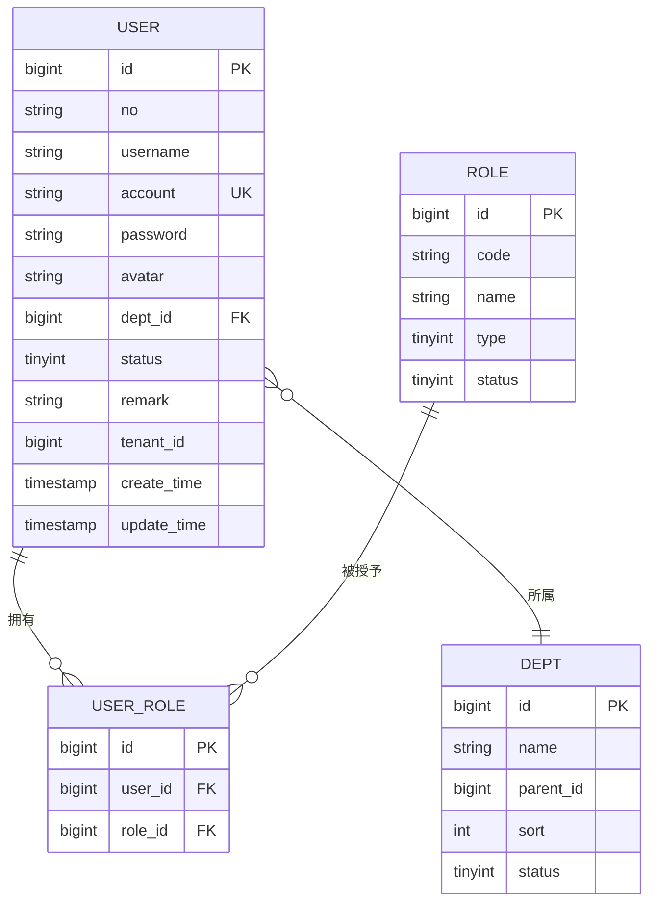
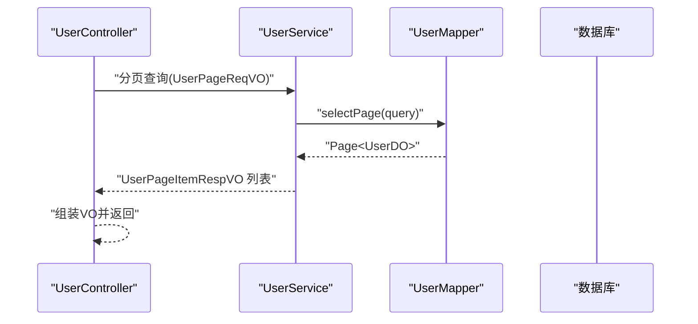
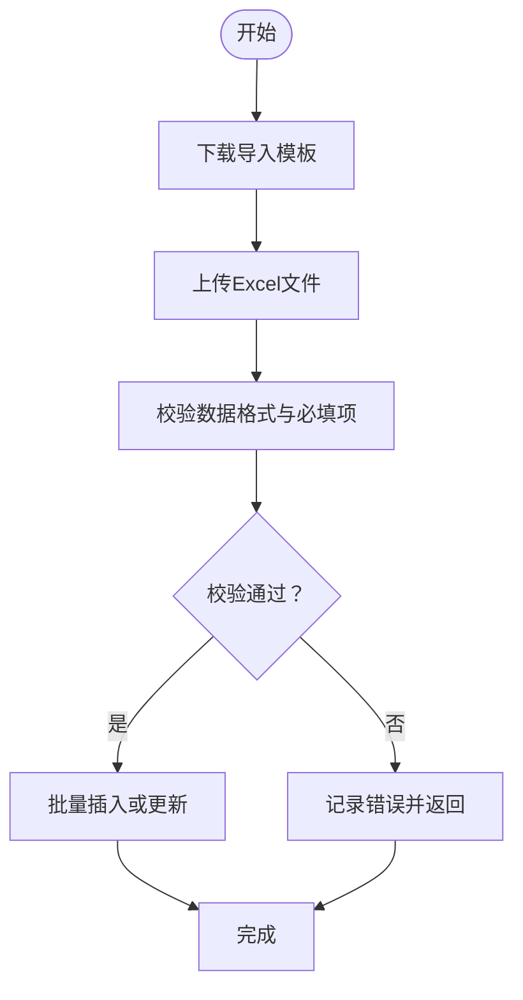
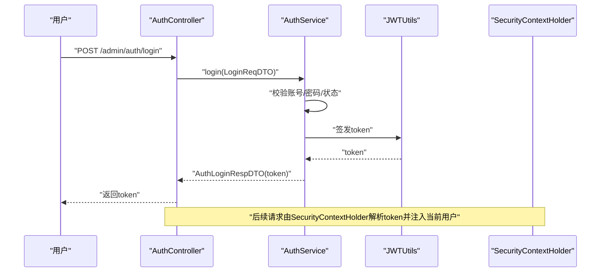
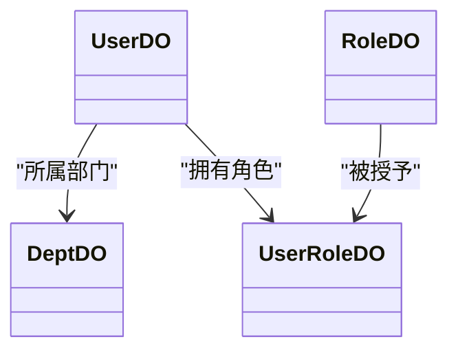
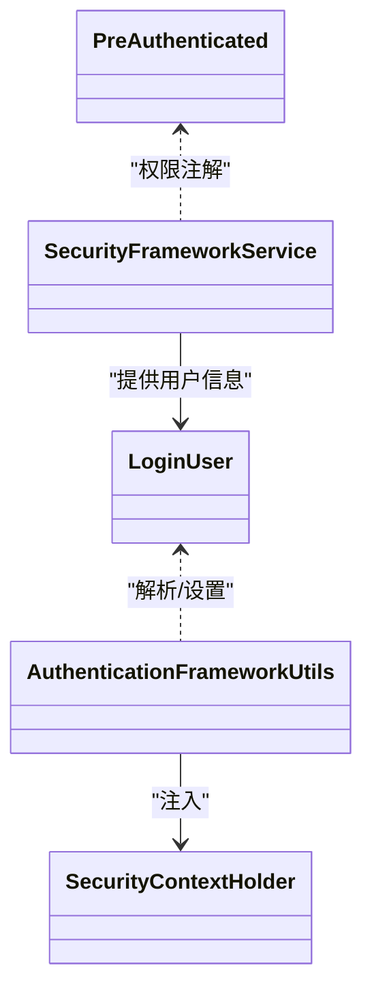
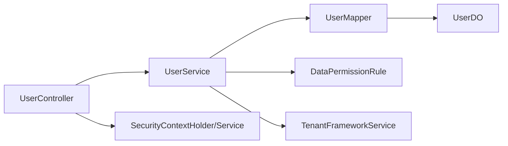

# 用户管理

<cite>
**本文引用的文件**
- [yudao-module-system/src/main/java/cn/iocoder/yudao/module/system/controller/admin/user/UserController.java](file://yudao-module-system/src/main/java/cn/iocoder/yudao/module/system/controller/admin/user/UserController.java)
- [yudao-module-system/src/main/java/cn/iocoder/yudao/module/system/api/user/AdminUserApi.java](file://yudao-module-system/src/main/java/cn/iocoder/yudao/module/system/api/user/AdminUserApi.java)
- [yudao-module-system/src/main/java/cn/iocoder/yudao/module/system/api/user/AdminUserApiImpl.java](file://yudao-module-system/src/main/java/cn/iocoder/yudao/module/system/api/user/AdminUserApiImpl.java)
- [yudao-module-system/src/main/java/cn/iocoder/yudao/module/system/api/user/dto/AdminUserRespDTO.java](file://yudao-module-system/src/main/java/cn/iocoder/yudao/module/system/api/user/dto/AdminUserRespDTO.java)
- [yudao-module-system/src/main/java/cn/iocoder/yudao/module/system/dal/dataobject/user/UserDO.java](file://yudao-module-system/src/main/java/cn/iocoder/yudao/module/system/dal/dataobject/user/UserDO.java)
- [yudao-module-system/src/main/java/cn/iocoder/yudao/module/system/dal/mysql/user/UserMapper.java](file://yudao-module-system/src/main/java/cn/iocoder/yudao/module/system/dal/mysql/user/UserMapper.java)
- [yudao-module-system/src/main/java/cn/iocoder/yudao/module/system/service/user/UserService.java](file://yudao-module-system/src/main/java/cn/iocoder/yudao/module/system/service/user/UserService.java)
- [yudao-module-system/src/main/java/cn/iocoder/yudao/module/system/service/user/UserServiceImpl.java](file://yudao-module-system/src/main/java/cn/iocoder/yudao/module/system/service/user/UserServiceImpl.java)
- [yudao-module-system/src/main/java/cn/iocoder/yudao/module/system/controller/admin/auth/AuthController.java](file://yudao-module-system/src/main/java/cn/iocoder/yudao/module/system/controller/admin/auth/AuthController.java)
- [yudao-module-system/src/main/java/cn/iocoder/yudao/module/system/api/auth/dto/AuthLoginReqDTO.java](file://yudao-module-system/src/main/java/cn/iocoder/yudao/module/system/api/auth/dto/AuthLoginReqDTO.java)
- [yudao-module-system/src/main/java/cn/iocoder/yudao/module/system/api/auth/dto/AuthLoginRespDTO.java](file://yudao-module-system/src/main/java/cn/iocoder/yudao/module/system/api/auth/dto/AuthLoginRespDTO.java)
- [yudao-module-system/src/main/java/cn/iocoder/yudao/module/system/controller/admin/permission/vo/permission/PermissionAssignUserRoleReqVO.java](file://yudao-module-system/src/main/java/cn/iocoder/yudao/module/system/controller/admin/permission/vo/permission/PermissionAssignUserRoleReqVO.java)
- [yudao-module-system/src/main/java/cn/iocoder/yudao/module/system/dal/dataobject/permission/UserRoleDO.java](file://yudao-module-system/src/main/java/cn/iocoder/yudao/module/system/dal/dataobject/permission/UserRoleDO.java)
- [yudao-module-system/src/main/java/cn/iocoder/yudao/module/system/dal/mysql/permission/UserRoleMapper.java](file://yudao-module-system/src/main/java/cn/iocoder/yudao/module/system/dal/mysql/permission/UserRoleMapper.java)
- [yudao-module-system/src/main/java/cn/iocoder/yudao/module/system/dal/dataobject/dept/DeptDO.java](file://yudao-module-system/src/main/java/cn/iocoder/yudao/module/system/dal/dataobject/dept/DeptDO.java)
- [yudao-module-system/src/main/java/cn/iocoder/yudao/module/system/dal/mysql/dept/DeptMapper.java](file://yudao-module-system/src/main/java/cn/iocoder/yudao/module/system/dal/mysql/dept/DeptMapper.java)
- [yudao-module-system/src/main/java/cn/iocoder/yudao/module/system/controller/admin/dept/DeptController.java](file://yudao-module-system/src/main/java/cn/iocoder/yudao/module/system/controller/admin/dept/DeptController.java)
- [yudao-module-system/src/main/java/cn/iocoder/yudao/module/system/controller/admin/dept/vo/dept/DeptSaveReqVO.java](file://yudao-module-system/src/main/java/cn/iocoder/yudao/module/system/controller/admin/dept/vo/dept/DeptSaveReqVO.java)
- [yudao-module-system/src/main/java/cn/iocoder/yudao/module/system/controller/admin/dept/vo/dept/DeptListReqVO.java](file://yudao-module-system/src/main/java/cn/iocoder/yudao/module/system/controller/admin/dept/vo/dept/DeptListReqVO.java)
- [yudao-module-system/src/main/java/cn/iocoder/yudao/module/system/controller/admin/dept/vo/dept/DeptRespVO.java](file://yudao-module-system/src/main/java/cn/iocoder/yudao/module/system/controller/admin/dept/vo/dept/DeptRespVO.java)
- [yudao-module-system/src/main/java/cn/iocoder/yudao/module/system/controller/admin/dept/vo/dept/DeptSimpleRespVO.java](file://yudao-module-system/src/main/java/cn/iocoder/yudao/module/system/controller/admin/dept/vo/dept/DeptSimpleRespVO.java)
- [yudao-module-system/src/main/java/cn/iocoder/yudao/module/system/service/dept/DeptService.java](file://yudao-module-system/src/main/java/cn/iocoder/yudao/module/system/service/dept/DeptService.java)
- [yudao-module-system/src/main/java/cn/iocoder/yudao/module/system/service/dept/DeptServiceImpl.java](file://yudao-module-system/src/main/java/cn/iocoder/yudao/module/system/service/dept/DeptServiceImpl.java)
- [yudao-module-system/src/main/java/cn/iocoder/yudao/module/system/framework/security/core/LoginUser.java](file://yudao-module-system/src/main/java/cn/iocoder/yudao/module/system/framework/security/core/LoginUser.java)
- [yudao-module-system/src/main/java/cn/iocoder/yudao/module/system/framework/security/core/AuthenticationFrameworkUtils.java](file://yudao-module-system/src/main/java/cn/iocoder/yudao/module/system/framework/security/core/AuthenticationFrameworkUtils.java)
- [yudao-module-system/src/main/java/cn/iocoder/yudao/module/system/framework/security/core/annotations/PreAuthenticated.java](file://yudao-module-system/src/main/java/cn/iocoder/yudao/module/system/framework/security/core/annotations/PreAuthenticated.java)
- [yudao-module-system/src/main/java/cn/iocoder/yudao/module/system/framework/security/core/util/JWTUtils.java](file://yudao-module-system/src/main/java/cn/iocoder/yudao/module/system/framework/security/core/util/JWTUtils.java)
- [yudao-module-system/src/main/java/cn/iocoder/yudao/module/system/framework/security/core/util/SecurityFrameworkUtils.java](file://yudao-module-system/src/main/java/cn/iocoder/yudao/module/system/framework/security/core/util/SecurityFrameworkUtils.java)
- [yudao-module-system/src/main/java/cn/iocoder/yudao/module/system/framework/security/core/context/SecurityContextHolder.java](file://yudao-module-system/src/main/java/cn/iocoder/yudao/module/system/framework/security/core/context/SecurityContextHolder.java)
- [yudao-module-system/src/main/java/cn/iocoder/yudao/module/system/framework/security/core/context/SecurityContext.java](file://yudao-module-system/src/main/java/cn/iocoder/yudao/module/system/framework/security/core/context/SecurityContext.java)
- [yudao-module-system/src/main/java/cn/iocoder/yudao/module/system/framework/security/core/SecurityFrameworkService.java](file://yudao-module-system/src/main/java/cn/iocoder/yudao/module/system/framework/security/core/SecurityFrameworkService.java)
- [yudao-module-system/src/main/java/cn/iocoder/yudao/module/system/framework/security/core/SecurityFrameworkServiceImpl.java](file://yudao-module-system/src/main/java/cn/iocoder/yudao/module/system/framework/security/core/SecurityFrameworkServiceImpl.java)
- [yudao-module-system/src/main/java/cn/iocoder/yudao/module/system/framework/security/core/convert/SecurityConvert.java](file://yudao-module-system/src/main/java/cn/iocoder/yudao/module/system/framework/security/core/convert/SecurityConvert.java)
- [yudao-module-system/src/main/java/cn/iocoder/yudao/module/system/framework/security/core/enums/UserTypeEnum.java](file://yudao-module-system/src/main/java/cn/iocoder/yudao/module/system/framework/security/core/enums/UserTypeEnum.java)
- [yudao-module-system/src/main/java/cn/iocoder/yudao/module/system/framework/security/core/enums/SecurityFrameworkConstants.java](file://yudao-module-system/src/main/java/cn/iocoder/yudao/module/system/framework/security/core/enums/SecurityFrameworkConstants.java)
- [yudao-module-system/src/main/java/cn/iocoder/yudao/module/system/framework/security/core/enums/DataScopeEnum.java](file://yudao-module-system/src/main/java/cn/iocoder/yudao/module/system/framework/security/core/enums/DataScopeEnum.java)
- [yudao-module-system/src/main/java/cn/iocoder/yudao/module/system/framework/datapermission/core/DataPermissionRule.java](file://yudao-module-system/src/main/java/cn/iocoder/yudao/module/system/framework/datapermission/core/DataPermissionRule.java)
- [yudao-module-system/src/main/java/cn/iocoder/yudao/module/system/framework/datapermission/core/DataPermissionRuleProvider.java](file://yudao-module-system/src/main/java/cn/iocoder/yudao/module/system/framework/datapermission/core/DataPermissionRuleProvider.java)
- [yudao-module-system/src/main/java/cn/iocoder/yudao/module/system/framework/tenant/core/TenantFrameworkService.java](file://yudao-module-system/src/main/java/cn/iocoder/yudao/module/system/framework/tenant/core/TenantFrameworkService.java)
- [yudao-module-system/src/main/java/cn/iocoder/yudao/module/system/framework/tenant/core/TenantFrameworkServiceImpl.java](file://yudao-module-system/src/main/java/cn/iocoder/yudao/module/system/framework/tenant/core/TenantFrameworkServiceImpl.java)
- [yudao-module-system/src/main/java/cn/iocoder/yudao/module/system/framework/tenant/core/enums/TenantHandlerEnum.java](file://yudao-module-system/src/main/java/cn/iocoder/yudao/module/system/framework/tenant/core/enums/TenantHandlerEnum.java)
- [yudao-module-system/src/main/java/cn/iocoder/yudao/module/system/framework/excel/core/ExcelExportUtil.java](file://yudao-module-system/src/main/java/cn/iocoder/yudao/module/system/framework/excel/core/ExcelExportUtil.java)
- [yudao-module-system/src/main/java/cn/iocoder/yudao/module/system/framework/excel/core/ExcelImportUtil.java](file://yudao-module-system/src/main/java/cn/iocoder/yudao/module/system/framework/excel/core/ExcelImportUtil.java)
- [yudao-module-system/src/main/java/cn/iocoder/yudao/module/system/controller/admin/user/vo/user/UserImportReqVO.java](file://yudao-module-system/src/main/java/cn/iocoder/yudao/module/system/controller/admin/user/vo/user/UserImportReqVO.java)
- [yudao-module-system/src/main/java/cn/iocoder/yudao/module/system/controller/admin/user/vo/user/UserExportReqVO.java](file://yudao-module-system/src/main/java/cn/iocoder/yudao/module/system/controller/admin/user/vo/user/UserExportReqVO.java)
- [yudao-module-system/src/main/java/cn/iocoder/yudao/module/system/controller/admin/user/vo/user/UserPageReqVO.java](file://yudao-module-system/src/main/java/cn/iocoder/yudao/module/system/controller/admin/user/vo/user/UserPageReqVO.java)
- [yudao-module-system/src/main/java/cn/iocoder/yudao/module/system/controller/admin/user/vo/user/UserSaveReqVO.java](file://yudao-module-system/src/main/java/cn/iocoder/yudao/module/system/controller/admin/user/vo/user/UserSaveReqVO.java)
- [yudao-module-system/src/main/java/cn/iocoder/yudao/module/system/controller/admin/user/vo/user/UserResetPasswordReqVO.java](file://yudao-module-system/src/main/java/cn/iocoder/yudao/module/system/controller/admin/user/vo/user/UserResetPasswordReqVO.java)
- [yudao-module-system/src/main/java/cn/iocoder/yudao/module/system/controller/admin/user/vo/user/UserUpdatePasswordReqVO.java](file://yudao-module-system/src/main/java/cn/iocoder/yudao/module/system/controller/admin/user/vo/user/UserUpdatePasswordReqVO.java)
- [yudao-module-system/src/main/java/cn/iocoder/yudao/module/system/controller/admin/user/vo/user/UserUpdateStatusReqVO.java](file://yudao-module-system/src/main/java/cn/iocoder/yudao/module/system/controller/admin/user/vo/user/UserUpdateStatusReqVO.java)
- [yudao-module-system/src/main/java/cn/iocoder/yudao/module/system/controller/admin/user/vo/user/UserUpdateAvatarReqVO.java](file://yudao-module-system/src/main/java/cn/iocoder/yudao/module/system/controller/admin/user/vo/user/UserUpdateAvatarReqVO.java)
- [yudao-module-system/src/main/java/cn/iocoder/yudao/module/system/controller/admin/user/vo/user/UserProfileRespVO.java](file://yudao-module-system/src/main/java/cn/iocoder/yudao/module/system/controller/admin/user/vo/user/UserProfileRespVO.java)
- [yudao-module-system/src/main/java/cn/iocoder/yudao/module/system/controller/admin/user/vo/user/UserProfileUpdateReqVO.java](file://yudao-module-system/src/main/java/cn/iocoder/yudao/module/system/controller/admin/user/vo/user/UserProfileUpdateReqVO.java)
- [yudao-module-system/src/main/java/cn/iocoder/yudao/module/system/controller/admin/user/vo/user/UserRespVO.java](file://yudao-module-system/src/main/java/cn/iocoder/yudao/module/system/controller/admin/user/vo/user/UserRespVO.java)
- [yudao-module-system/src/main/java/cn/iocoder/yudao/module/system/controller/admin/user/vo/user/UserSimpleRespVO.java](file://yudao-module-system/src/main/java/cn/iocoder/yudao/module/system/controller/admin/user/vo/user/UserSimpleRespVO.java)
- [yudao-module-system/src/main/java/cn/iocoder/yudao/module/system/controller/admin/user/vo/user/UserPageItemRespVO.java](file://yudao-module-system/src/main/java/cn/iocoder/yudao/module/system/controller/admin/user/vo/user/UserPageItemRespVO.java)
- [yudao-module-system/src/main/java/cn/iocoder/yudao/module/system/controller/admin/user/vo/user/UserUpdateStatusReqVO.java](file://yudao-module-system/src/main/java/cn/iocoder/yudao/module/system/controller/admin/user/vo/user/UserUpdateStatusReqVO.java)
- [yudao-module-system/src/main/java/cn/iocoder/yudao/module/system/controller/admin/user/vo/user/UserUpdatePasswordReqVO.java](file://yudao-module-system/src/main/java/cn/iocoder/yudao/module/system/controller/admin/user/vo/user/UserUpdatePasswordReqVO.java)
- [yudao-module-system/src/main/java/cn/iocoder/yudao/module/system/controller/admin/user/vo/user/UserUpdateAvatarReqVO.java](file://yudao-module-system/src/main/java/cn/iocoder/yudao/module/system/controller/admin/user/vo/user/UserUpdateAvatarReqVO.java)
- [yudao-module-system/src/main/java/cn/iocoder/yudao/module/system/controller/admin/user/vo/user/UserProfileUpdateReqVO.java](file://yudao-module-system/src/main/java/cn/iocoder/yudao/module/system/controller/admin/user/vo/user/UserProfileUpdateReqVO.java)
- [yudao-module-system/src/main/java/cn/iocoder/yudao/module/system/controller/admin/user/vo/user/UserImportReqVO.java](file://yudao-module-system/src/main/java/cn/iocoder/yudao/module/system/controller/admin/user/vo/user/UserImportReqVO.java)
- [yudao-module-system/src/main/java/cn/iocoder/yudao/module/system/controller/admin/user/vo/user/UserExportReqVO.java](file://yudao-module-system/src/main/java/cn/iocoder/yudao/module/system/controller/admin/user/vo/user/UserExportReqVO.java)
- [yudao-module-system/src/main/java/cn/iocoder/yudao/module/system/controller/admin/user/vo/user/UserPageReqVO.java](file://yudao-module-system/src/main/java/cn/iocoder/yudao/module/system/controller/admin/user/vo/user/UserPageReqVO.java)
- [yudao-module-system/src/main/java/cn/iocoder/yudao/module/system/controller/admin/user/vo/user/UserSaveReqVO.java](file://yudao-module-system/src/main/java/cn/iocoder/yudao/module/system/controller/admin/user/vo/user/UserSaveReqVO.java)
- [yudao-module-system/src/main/java/cn/iocoder/yudao/module/system/controller/admin/user/vo/user/UserResetPasswordReqVO.java](file://yudao-module-system/src/main/java/cn/iocoder/yudao/module/system/controller/admin/user/vo/user/UserResetPasswordReqVO.java)
- [yudao-module-system/src/main/java/cn/iocoder/yudao/module/system/controller/admin/user/vo/user/UserProfileRespVO.java](file://yudao-module-system/src/main/java/cn/iocoder/yudao/module/system/controller/admin/user/vo/user/UserProfileRespVO.java)
- [yudao-module-system/src/main/java/cn/iocoder/yudao/module/system/controller/admin/user/vo/user/UserRespVO.java](file://yudao-module-system/src/main/java/cn/iocoder/yudao/module/system/controller/admin/user/vo/user/UserRespVO.java)
- [yudao-module-system/src/main/java/cn/iocoder/yudao/module/system/controller/admin/user/vo/user/UserSimpleRespVO.java](file://yudao-module-system/src/main/java/cn/iocoder/yudao/module/system/controller/admin/user/vo/user/UserSimpleRespVO.java)
- [yudao-module-system/src/main/java/cn/iocoder/yudao/module/system/controller/admin/user/vo/user/UserPageItemRespVO.java](file://yudao-module-system/src/main/java/cn/iocoder/yudao/module/system/controller/admin/user/vo/user/UserPageItemRespVO.java)
</cite>

## 目录
1. [简介](#简介)
2. [项目结构](#项目结构)
3. [核心组件](#核心组件)
4. [架构总览](#架构总览)
5. [详细组件分析](#详细组件分析)
6. [依赖分析](#依赖分析)
7. [性能考虑](#性能考虑)
8. [故障排查指南](#故障排查指南)
9. [结论](#结论)
10. [附录](#附录)

## 简介
本指南围绕用户管理功能进行系统化开发说明，覆盖用户实体设计、CRUD操作、状态管理、密码安全策略、用户导入导出、注册与登录认证、个人信息管理、头像上传、密码修改、用户与部门/角色的关联关系、数据权限与多租户隔离、以及与Spring Security的集成（JWT、认证与会话管理）。同时提供完整的API接口文档与实现要点，帮助开发者快速落地。

## 项目结构
用户管理位于系统模块（system）中，采用分层架构：控制器层（controller）、服务层（service）、数据访问层（dal），配合安全框架（security）、数据权限（data permission）与多租户（tenant）框架协同工作。

图示来源
- [yudao-module-system/src/main/java/cn/iocoder/yudao/module/system/controller/admin/user/UserController.java](file://yudao-module-system/src/main/java/cn/iocoder/yudao/module/system/controller/admin/user/UserController.java)
- [yudao-module-system/src/main/java/cn/iocoder/yudao/module/system/service/user/UserService.java](file://yudao-module-system/src/main/java/cn/iocoder/yudao/module/system/service/user/UserService.java)
- [yudao-module-system/src/main/java/cn/iocoder/yudao/module/system/dal/mysql/user/UserMapper.java](file://yudao-module-system/src/main/java/cn/iocoder/yudao/module/system/dal/mysql/user/UserMapper.java)
- [yudao-module-system/src/main/java/cn/iocoder/yudao/module/system/dal/dataobject/user/UserDO.java](file://yudao-module-system/src/main/java/cn/iocoder/yudao/module/system/dal/dataobject/user/UserDO.java)
- [yudao-module-system/src/main/java/cn/iocoder/yudao/module/system/api/user/AdminUserApiImpl.java](file://yudao-module-system/src/main/java/cn/iocoder/yudao/module/system/api/user/AdminUserApiImpl.java)
- [yudao-module-system/src/main/java/cn/iocoder/yudao/module/system/framework/security/core/context/SecurityContextHolder.java](file://yudao-module-system/src/main/java/cn/iocoder/yudao/module/system/framework/security/core/context/SecurityContextHolder.java)
- [yudao-module-system/src/main/java/cn/iocoder/yudao/module/system/framework/security/core/SecurityFrameworkService.java](file://yudao-module-system/src/main/java/cn/iocoder/yudao/module/system/framework/security/core/SecurityFrameworkService.java)
- [yudao-module-system/src/main/java/cn/iocoder/yudao/module/system/framework/datapermission/core/DataPermissionRule.java](file://yudao-module-system/src/main/java/cn/iocoder/yudao/module/system/framework/datapermission/core/DataPermissionRule.java)
- [yudao-module-system/src/main/java/cn/iocoder/yudao/module/system/framework/tenant/core/TenantFrameworkService.java](file://yudao-module-system/src/main/java/cn/iocoder/yudao/module/system/framework/tenant/core/TenantFrameworkService.java)

章节来源
- [yudao-module-system/src/main/java/cn/iocoder/yudao/module/system/controller/admin/user/UserController.java](file://yudao-module-system/src/main/java/cn/iocoder/yudao/module/system/controller/admin/user/UserController.java)
- [yudao-module-system/src/main/java/cn/iocoder/yudao/module/system/service/user/UserService.java](file://yudao-module-system/src/main/java/cn/iocoder/yudao/module/system/service/user/UserService.java)
- [yudao-module-system/src/main/java/cn/iocoder/yudao/module/system/dal/mysql/user/UserMapper.java](file://yudao-module-system/src/main/java/cn/iocoder/yudao/module/system/dal/mysql/user/UserMapper.java)
- [yudao-module-system/src/main/java/cn/iocoder/yudao/module/system/dal/dataobject/user/UserDO.java](file://yudao-module-system/src/main/java/cn/iocoder/yudao/module/system/dal/dataobject/user/UserDO.java)

## 核心组件
- 用户控制器（UserController）：提供用户管理的HTTP接口，包括分页查询、详情获取、创建/更新、删除、状态变更、重置密码、头像上传、个人资料更新等。
- 用户服务（UserService）：封装业务逻辑，如密码加密、状态变更、导入导出、数据权限过滤、多租户隔离等。
- 用户DAO（UserMapper）：基于MyBatis的SQL映射，负责用户数据的增删改查。
- 用户DO（UserDO）：持久化对象，定义用户字段及约束。
- 安全框架（SecurityFrameworkService/SecurityContextHolder）：提供认证、授权、JWT、会话管理能力。
- 数据权限（DataPermissionRule）：按部门/岗位/自定义规则限制用户可见数据范围。
- 多租户（TenantFrameworkService）：按租户隔离数据与配置。
- 远程调用（AdminUserApiImpl）：对外暴露用户相关API供其他模块调用。

章节来源
- [yudao-module-system/src/main/java/cn/iocoder/yudao/module/system/controller/admin/user/UserController.java](file://yudao-module-system/src/main/java/cn/iocoder/yudao/module/system/controller/admin/user/UserController.java)
- [yudao-module-system/src/main/java/cn/iocoder/yudao/module/system/service/user/UserService.java](file://yudao-module-system/src/main/java/cn/iocoder/yudao/module/system/service/user/UserService.java)
- [yudao-module-system/src/main/java/cn/iocoder/yudao/module/system/dal/mysql/user/UserMapper.java](file://yudao-module-system/src/main/java/cn/iocoder/yudao/module/system/dal/mysql/user/UserMapper.java)
- [yudao-module-system/src/main/java/cn/iocoder/yudao/module/system/dal/dataobject/user/UserDO.java](file://yudao-module-system/src/main/java/cn/iocoder/yudao/module/system/dal/dataobject/user/UserDO.java)
- [yudao-module-system/src/main/java/cn/iocoder/yudao/module/system/framework/security/core/SecurityFrameworkService.java](file://yudao-module-system/src/main/java/cn/iocoder/yudao/module/system/framework/security/core/SecurityFrameworkService.java)
- [yudao-module-system/src/main/java/cn/iocoder/yudao/module/system/framework/datapermission/core/DataPermissionRule.java](file://yudao-module-system/src/main/java/cn/iocoder/yudao/module/system/framework/datapermission/core/DataPermissionRule.java)
- [yudao-module-system/src/main/java/cn/iocoder/yudao/module/system/framework/tenant/core/TenantFrameworkService.java](file://yudao-module-system/src/main/java/cn/iocoder/yudao/module/system/framework/tenant/core/TenantFrameworkService.java)
- [yudao-module-system/src/main/java/cn/iocoder/yudao/module/system/api/user/AdminUserApiImpl.java](file://yudao-module-system/src/main/java/cn/iocoder/yudao/module/system/api/user/AdminUserApiImpl.java)

## 架构总览
用户管理遵循“控制器-服务-数据访问”的分层设计，结合安全框架完成认证与授权；通过数据权限与多租户框架实现数据隔离与范围控制。

图示来源
- [yudao-module-system/src/main/java/cn/iocoder/yudao/module/system/controller/admin/user/UserController.java](file://yudao-module-system/src/main/java/cn/iocoder/yudao/module/system/controller/admin/user/UserController.java)
- [yudao-module-system/src/main/java/cn/iocoder/yudao/module/system/service/user/UserService.java](file://yudao-module-system/src/main/java/cn/iocoder/yudao/module/system/service/user/UserService.java)
- [yudao-module-system/src/main/java/cn/iocoder/yudao/module/system/framework/security/core/context/SecurityContextHolder.java](file://yudao-module-system/src/main/java/cn/iocoder/yudao/module/system/framework/security/core/context/SecurityContextHolder.java)
- [yudao-module-system/src/main/java/cn/iocoder/yudao/module/system/framework/security/core/util/JWTUtils.java](file://yudao-module-system/src/main/java/cn/iocoder/yudao/module/system/framework/security/core/util/JWTUtils.java)
- [yudao-module-system/src/main/java/cn/iocoder/yudao/module/system/framework/datapermission/core/DataPermissionRule.java](file://yudao-module-system/src/main/java/cn/iocoder/yudao/module/system/framework/datapermission/core/DataPermissionRule.java)
- [yudao-module-system/src/main/java/cn/iocoder/yudao/module/system/framework/tenant/core/TenantFrameworkService.java](file://yudao-module-system/src/main/java/cn/iocoder/yudao/module/system/framework/tenant/core/TenantFrameworkService.java)

## 详细组件分析

### 用户实体设计
- 字段设计：用户名、账号、密码、头像、部门标识、状态、备注、租户编号、创建时间/更新时间等。
- 约束与索引：唯一性约束（如账号）、索引优化（如租户、部门、状态）。
- 关联关系：用户属于部门；用户拥有多个角色；用户可绑定社交账号。

图示来源
- [yudao-module-system/src/main/java/cn/iocoder/yudao/module/system/dal/dataobject/user/UserDO.java](file://yudao-module-system/src/main/java/cn/iocoder/yudao/module/system/dal/dataobject/user/UserDO.java)
- [yudao-module-system/src/main/java/cn/iocoder/yudao/module/system/dal/dataobject/dept/DeptDO.java](file://yudao-module-system/src/main/java/cn/iocoder/yudao/module/system/dal/dataobject/dept/DeptDO.java)
- [yudao-module-system/src/main/java/cn/iocoder/yudao/module/system/dal/dataobject/permission/UserRoleDO.java](file://yudao-module-system/src/main/java/cn/iocoder/yudao/module/system/dal/dataobject/permission/UserRoleDO.java)

章节来源
- [yudao-module-system/src/main/java/cn/iocoder/yudao/module/system/dal/dataobject/user/UserDO.java](file://yudao-module-system/src/main/java/cn/iocoder/yudao/module/system/dal/dataobject/user/UserDO.java)
- [yudao-module-system/src/main/java/cn/iocoder/yudao/module/system/dal/dataobject/dept/DeptDO.java](file://yudao-module-system/src/main/java/cn/iocoder/yudao/module/system/dal/dataobject/dept/DeptDO.java)
- [yudao-module-system/src/main/java/cn/iocoder/yudao/module/system/dal/dataobject/permission/UserRoleDO.java](file://yudao-module-system/src/main/java/cn/iocoder/yudao/module/system/dal/dataobject/permission/UserRoleDO.java)

### 用户CRUD与状态管理
- 分页查询：支持关键字、状态、部门、时间范围筛选。
- 详情获取：根据用户ID加载用户及其角色、部门信息。
- 创建/更新：校验账号唯一性、部门有效性、角色存在性。
- 删除：软删除或物理删除（依据业务策略）。
- 状态变更：启用/停用，影响登录与数据权限。
- 密码重置：管理员重置指定用户密码。
- 头像上传：支持图片上传与URL保存。
- 个人资料更新：昵称、邮箱、手机等非敏感信息。

图示来源
- [yudao-module-system/src/main/java/cn/iocoder/yudao/module/system/controller/admin/user/UserController.java](file://yudao-module-system/src/main/java/cn/iocoder/yudao/module/system/controller/admin/user/UserController.java)
- [yudao-module-system/src/main/java/cn/iocoder/yudao/module/system/service/user/UserService.java](file://yudao-module-system/src/main/java/cn/iocoder/yudao/module/system/service/user/UserService.java)
- [yudao-module-system/src/main/java/cn/iocoder/yudao/module/system/dal/mysql/user/UserMapper.java](file://yudao-module-system/src/main/java/cn/iocoder/yudao/module/system/dal/mysql/user/UserMapper.java)

章节来源
- [yudao-module-system/src/main/java/cn/iocoder/yudao/module/system/controller/admin/user/vo/user/UserPageReqVO.java](file://yudao-module-system/src/main/java/cn/iocoder/yudao/module/system/controller/admin/user/vo/user/UserPageReqVO.java)
- [yudao-module-system/src/main/java/cn/iocoder/yudao/module/system/controller/admin/user/vo/user/UserSaveReqVO.java](file://yudao-module-system/src/main/java/cn/iocoder/yudao/module/system/controller/admin/user/vo/user/UserSaveReqVO.java)
- [yudao-module-system/src/main/java/cn/iocoder/yudao/module/system/controller/admin/user/vo/user/UserUpdateStatusReqVO.java](file://yudao-module-system/src/main/java/cn/iocoder/yudao/module/system/controller/admin/user/vo/user/UserUpdateStatusReqVO.java)
- [yudao-module-system/src/main/java/cn/iocoder/yudao/module/system/controller/admin/user/vo/user/UserResetPasswordReqVO.java](file://yudao-module-system/src/main/java/cn/iocoder/yudao/module/system/controller/admin/user/vo/user/UserResetPasswordReqVO.java)
- [yudao-module-system/src/main/java/cn/iocoder/yudao/module/system/controller/admin/user/vo/user/UserUpdateAvatarReqVO.java](file://yudao-module-system/src/main/java/cn/iocoder/yudao/module/system/controller/admin/user/vo/user/UserUpdateAvatarReqVO.java)
- [yudao-module-system/src/main/java/cn/iocoder/yudao/module/system/controller/admin/user/vo/user/UserProfileUpdateReqVO.java](file://yudao-module-system/src/main/java/cn/iocoder/yudao/module/system/controller/admin/user/vo/user/UserProfileUpdateReqVO.java)

### 密码安全策略
- 存储策略：密码必须加密存储，不保存明文。
- 修改策略：旧密码校验通过后方可修改；新密码需满足复杂度要求（长度、字符类型等）。
- 重置策略：管理员可重置用户密码为系统默认或随机密码。
- 登录策略：失败次数限制、锁定策略（可选）。

章节来源
- [yudao-module-system/src/main/java/cn/iocoder/yudao/module/system/controller/admin/user/vo/user/UserUpdatePasswordReqVO.java](file://yudao-module-system/src/main/java/cn/iocoder/yudao/module/system/controller/admin/user/vo/user/UserUpdatePasswordReqVO.java)
- [yudao-module-system/src/main/java/cn/iocoder/yudao/module/system/controller/admin/user/vo/user/UserResetPasswordReqVO.java](file://yudao-module-system/src/main/java/cn/iocoder/yudao/module/system/controller/admin/user/vo/user/UserResetPasswordReqVO.java)

### 用户导入导出
- 导入：支持Excel模板下载与批量导入，校验必填字段与格式，失败项单独记录。
- 导出：按筛选条件导出用户列表到Excel，包含常用字段与扩展信息。

图示来源
- [yudao-module-system/src/main/java/cn/iocoder/yudao/module/system/framework/excel/core/ExcelImportUtil.java](file://yudao-module-system/src/main/java/cn/iocoder/yudao/module/system/framework/excel/core/ExcelImportUtil.java)
- [yudao-module-system/src/main/java/cn/iocoder/yudao/module/system/framework/excel/core/ExcelExportUtil.java](file://yudao-module-system/src/main/java/cn/iocoder/yudao/module/system/framework/excel/core/ExcelExportUtil.java)
- [yudao-module-system/src/main/java/cn/iocoder/yudao/module/system/controller/admin/user/vo/user/UserImportReqVO.java](file://yudao-module-system/src/main/java/cn/iocoder/yudao/module/system/controller/admin/user/vo/user/UserImportReqVO.java)
- [yudao-module-system/src/main/java/cn/iocoder/yudao/module/system/controller/admin/user/vo/user/UserExportReqVO.java](file://yudao-module-system/src/main/java/cn/iocoder/yudao/module/system/controller/admin/user/vo/user/UserExportReqVO.java)

章节来源
- [yudao-module-system/src/main/java/cn/iocoder/yudao/module/system/framework/excel/core/ExcelImportUtil.java](file://yudao-module-system/src/main/java/cn/iocoder/yudao/module/system/framework/excel/core/ExcelImportUtil.java)
- [yudao-module-system/src/main/java/cn/iocoder/yudao/module/system/framework/excel/core/ExcelExportUtil.java](file://yudao-module-system/src/main/java/cn/iocoder/yudao/module/system/framework/excel/core/ExcelExportUtil.java)
- [yudao-module-system/src/main/java/cn/iocoder/yudao/module/system/controller/admin/user/vo/user/UserImportReqVO.java](file://yudao-module-system/src/main/java/cn/iocoder/yudao/module/system/controller/admin/user/vo/user/UserImportReqVO.java)
- [yudao-module-system/src/main/java/cn/iocoder/yudao/module/system/controller/admin/user/vo/user/UserExportReqVO.java](file://yudao-module-system/src/main/java/cn/iocoder/yudao/module/system/controller/admin/user/vo/user/UserExportReqVO.java)

### 注册、登录认证与会话管理
- 登录流程：接收账号/密码，校验账号状态与密码，签发JWT令牌，记录登录日志。
- 认证：通过SecurityContextHolder解析当前用户，支持注解式鉴权。
- 会话：基于JWT无状态会话，支持刷新与失效处理。
- 社交登录：可通过第三方平台绑定/解绑账号（扩展能力）。

图示来源
- [yudao-module-system/src/main/java/cn/iocoder/yudao/module/system/controller/admin/auth/AuthController.java](file://yudao-module-system/src/main/java/cn/iocoder/yudao/module/system/controller/admin/auth/AuthController.java)
- [yudao-module-system/src/main/java/cn/iocoder/yudao/module/system/framework/security/core/util/JWTUtils.java](file://yudao-module-system/src/main/java/cn/iocoder/yudao/module/system/framework/security/core/util/JWTUtils.java)
- [yudao-module-system/src/main/java/cn/iocoder/yudao/module/system/framework/security/core/context/SecurityContextHolder.java](file://yudao-module-system/src/main/java/cn/iocoder/yudao/module/system/framework/security/core/context/SecurityContextHolder.java)
- [yudao-module-system/src/main/java/cn/iocoder/yudao/module/system/api/auth/dto/AuthLoginReqDTO.java](file://yudao-module-system/src/main/java/cn/iocoder/yudao/module/system/api/auth/dto/AuthLoginReqDTO.java)
- [yudao-module-system/src/main/java/cn/iocoder/yudao/module/system/api/auth/dto/AuthLoginRespDTO.java](file://yudao-module-system/src/main/java/cn/iocoder/yudao/module/system/api/auth/dto/AuthLoginRespDTO.java)

章节来源
- [yudao-module-system/src/main/java/cn/iocoder/yudao/module/system/controller/admin/auth/AuthController.java](file://yudao-module-system/src/main/java/cn/iocoder/yudao/module/system/controller/admin/auth/AuthController.java)
- [yudao-module-system/src/main/java/cn/iocoder/yudao/module/system/framework/security/core/util/JWTUtils.java](file://yudao-module-system/src/main/java/cn/iocoder/yudao/module/system/framework/security/core/util/JWTUtils.java)
- [yudao-module-system/src/main/java/cn/iocoder/yudao/module/system/framework/security/core/context/SecurityContextHolder.java](file://yudao-module-system/src/main/java/cn/iocoder/yudao/module/system/framework/security/core/context/SecurityContextHolder.java)
- [yudao-module-system/src/main/java/cn/iocoder/yudao/module/system/api/auth/dto/AuthLoginReqDTO.java](file://yudao-module-system/src/main/java/cn/iocoder/yudao/module/system/api/auth/dto/AuthLoginReqDTO.java)
- [yudao-module-system/src/main/java/cn/iocoder/yudao/module/system/api/auth/dto/AuthLoginRespDTO.java](file://yudao-module-system/src/main/java/cn/iocoder/yudao/module/system/api/auth/dto/AuthLoginRespDTO.java)

### 个人信息管理与头像上传
- 个人信息更新：昵称、邮箱、手机号等字段更新。
- 头像上传：支持图片上传并返回访问URL，更新用户头像字段。

章节来源
- [yudao-module-system/src/main/java/cn/iocoder/yudao/module/system/controller/admin/user/vo/user/UserProfileUpdateReqVO.java](file://yudao-module-system/src/main/java/cn/iocoder/yudao/module/system/controller/admin/user/vo/user/UserProfileUpdateReqVO.java)
- [yudao-module-system/src/main/java/cn/iocoder/yudao/module/system/controller/admin/user/vo/user/UserUpdateAvatarReqVO.java](file://yudao-module-system/src/main/java/cn/iocoder/yudao/module/system/controller/admin/user/vo/user/UserUpdateAvatarReqVO.java)

### 用户与部门、角色的关联关系
- 用户与部门：一对多关系，用户属于某个部门。
- 用户与角色：多对多关系，通过中间表UserRoleDO维护。
- 角色与菜单/数据权限：角色授权菜单与数据范围（数据权限规则）。

图示来源
- [yudao-module-system/src/main/java/cn/iocoder/yudao/module/system/dal/dataobject/user/UserDO.java](file://yudao-module-system/src/main/java/cn/iocoder/yudao/module/system/dal/dataobject/user/UserDO.java)
- [yudao-module-system/src/main/java/cn/iocoder/yudao/module/system/dal/dataobject/dept/DeptDO.java](file://yudao-module-system/src/main/java/cn/iocoder/yudao/module/system/dal/dataobject/dept/DeptDO.java)
- [yudao-module-system/src/main/java/cn/iocoder/yudao/module/system/dal/dataobject/permission/UserRoleDO.java](file://yudao-module-system/src/main/java/cn/iocoder/yudao/module/system/dal/dataobject/permission/UserRoleDO.java)

章节来源
- [yudao-module-system/src/main/java/cn/iocoder/yudao/module/system/dal/dataobject/user/UserDO.java](file://yudao-module-system/src/main/java/cn/iocoder/yudao/module/system/dal/dataobject/user/UserDO.java)
- [yudao-module-system/src/main/java/cn/iocoder/yudao/module/system/dal/dataobject/dept/DeptDO.java](file://yudao-module-system/src/main/java/cn/iocoder/yudao/module/system/dal/dataobject/dept/DeptDO.java)
- [yudao-module-system/src/main/java/cn/iocoder/yudao/module/system/dal/dataobject/permission/UserRoleDO.java](file://yudao-module-system/src/main/java/cn/iocoder/yudao/module/system/dal/dataobject/permission/UserRoleDO.java)

### 数据权限控制
- 数据权限规则：按用户所在部门、岗位或自定义规则限制数据可见范围。
- 规则提供器：在查询前动态注入WHERE条件或限定参数。
- 常见场景：仅查看本人、本部门、下级部门数据。

章节来源
- [yudao-module-system/src/main/java/cn/iocoder/yudao/module/system/framework/datapermission/core/DataPermissionRule.java](file://yudao-module-system/src/main/java/cn/iocoder/yudao/module/system/framework/datapermission/core/DataPermissionRule.java)
- [yudao-module-system/src/main/java/cn/iocoder/yudao/module/system/framework/datapermission/core/DataPermissionRuleProvider.java](file://yudao-module-system/src/main/java/cn/iocoder/yudao/module/system/framework/datapermission/core/DataPermissionRuleProvider.java)

### 多租户隔离机制
- 租户维度：不同租户间数据完全隔离，查询/写入自动带租户过滤。
- 实现方式：在DAO层或ORM层面注入租户ID，或通过拦截器统一处理。
- 场景：SaaS产品中不同客户的数据独立。

章节来源
- [yudao-module-system/src/main/java/cn/iocoder/yudao/module/system/framework/tenant/core/TenantFrameworkService.java](file://yudao-module-system/src/main/java/cn/iocoder/yudao/module/system/framework/tenant/core/TenantFrameworkService.java)
- [yudao-module-system/src/main/java/cn/iocoder/yudao/module/system/framework/tenant/core/TenantFrameworkServiceImpl.java](file://yudao-module-system/src/main/java/cn/iocoder/yudao/module/system/framework/tenant/core/TenantFrameworkServiceImpl.java)
- [yudao-module-system/src/main/java/cn/iocoder/yudao/module/system/framework/tenant/core/enums/TenantHandlerEnum.java](file://yudao-module-system/src/main/java/cn/iocoder/yudao/module/system/framework/tenant/core/enums/TenantHandlerEnum.java)

### API接口文档
以下为用户管理相关接口的参数与返回说明（以路径+行号定位具体实现）：

- 获取用户分页列表
  - 方法与路径：GET /admin/system/user/page
  - 请求体：UserPageReqVO
  - 返回体：分页结果，包含用户基本信息与角色/部门名称
  - 参考实现：[UserController.java](file://yudao-module-system/src/main/java/cn/iocoder/yudao/module/system/controller/admin/user/UserController.java)

- 获取用户详情
  - 方法与路径：GET /admin/system/user/get/{id}
  - 路径参数：id（用户ID）
  - 返回体：用户详情（含角色、部门、岗位等）
  - 参考实现：[UserController.java](file://yudao-module-system/src/main/java/cn/iocoder/yudao/module/system/controller/admin/user/UserController.java)

- 创建用户
  - 方法与路径：POST /admin/system/user/create
  - 请求体：UserSaveReqVO
  - 返回体：新建用户ID
  - 参考实现：[UserController.java](file://yudao-module-system/src/main/java/cn/iocoder/yudao/module/system/controller/admin/user/UserController.java)

- 更新用户
  - 方法与路径：PUT /admin/system/user/update
  - 请求体：UserSaveReqVO
  - 返回体：布尔成功标志
  - 参考实现：[UserController.java](file://yudao-module-system/src/main/java/cn/iocoder/yudao/module/system/controller/admin/user/UserController.java)

- 删除用户
  - 方法与路径：DELETE /admin/system/user/delete/{id}
  - 路径参数：id（用户ID）
  - 返回体：布尔成功标志
  - 参考实现：[UserController.java](file://yudao-module-system/src/main/java/cn/iocoder/yudao/module/system/controller/admin/user/UserController.java)

- 更新用户状态
  - 方法与路径：PUT /admin/system/user/update-status
  - 请求体：UserUpdateStatusReqVO
  - 返回体：布尔成功标志
  - 参考实现：[UserController.java](file://yudao-module-system/src/main/java/cn/iocoder/yudao/module/system/controller/admin/user/UserController.java)

- 重置用户密码
  - 方法与路径：POST /admin/system/user/reset-password
  - 请求体：UserResetPasswordReqVO
  - 返回体：布尔成功标志
  - 参考实现：[UserController.java](file://yudao-module-system/src/main/java/cn/iocoder/yudao/module/system/controller/admin/user/UserController.java)

- 更新用户头像
  - 方法与路径：POST /admin/system/user/update-avatar
  - 请求体：UserUpdateAvatarReqVO
  - 返回体：布尔成功标志
  - 参考实现：[UserController.java](file://yudao-module-system/src/main/java/cn/iocoder/yudao/module/system/controller/admin/user/UserController.java)

- 更新个人资料
  - 方法与路径：POST /admin/system/user/profile/update
  - 请求体：UserProfileUpdateReqVO
  - 返回体：布尔成功标志
  - 参考实现：[UserController.java](file://yudao-module-system/src/main/java/cn/iocoder/yudao/module/system/controller/admin/user/UserController.java)

- 导入用户
  - 方法与路径：POST /admin/system/user/import
  - 请求体：UserImportReqVO（文件上传）
  - 返回体：导入结果（成功/失败统计）
  - 参考实现：[UserController.java](file://yudao-module-system/src/main/java/cn/iocoder/yudao/module/system/controller/admin/user/UserController.java)

- 导出用户
  - 方法与路径：POST /admin/system/user/export
  - 请求体：UserExportReqVO
  - 返回体：Excel文件流
  - 参考实现：[UserController.java](file://yudao-module-system/src/main/java/cn/iocoder/yudao/module/system/controller/admin/user/UserController.java)

章节来源
- [yudao-module-system/src/main/java/cn/iocoder/yudao/module/system/controller/admin/user/UserController.java](file://yudao-module-system/src/main/java/cn/iocoder/yudao/module/system/controller/admin/user/UserController.java)
- [yudao-module-system/src/main/java/cn/iocoder/yudao/module/system/controller/admin/user/vo/user/UserPageReqVO.java](file://yudao-module-system/src/main/java/cn/iocoder/yudao/module/system/controller/admin/user/vo/user/UserPageReqVO.java)
- [yudao-module-system/src/main/java/cn/iocoder/yudao/module/system/controller/admin/user/vo/user/UserSaveReqVO.java](file://yudao-module-system/src/main/java/cn/iocoder/yudao/module/system/controller/admin/user/vo/user/UserSaveReqVO.java)
- [yudao-module-system/src/main/java/cn/iocoder/yudao/module/system/controller/admin/user/vo/user/UserUpdateStatusReqVO.java](file://yudao-module-system/src/main/java/cn/iocoder/yudao/module/system/controller/admin/user/vo/user/UserUpdateStatusReqVO.java)
- [yudao-module-system/src/main/java/cn/iocoder/yudao/module/system/controller/admin/user/vo/user/UserResetPasswordReqVO.java](file://yudao-module-system/src/main/java/cn/iocoder/yudao/module/system/controller/admin/user/vo/user/UserResetPasswordReqVO.java)
- [yudao-module-system/src/main/java/cn/iocoder/yudao/module/system/controller/admin/user/vo/user/UserUpdateAvatarReqVO.java](file://yudao-module-system/src/main/java/cn/iocoder/yudao/module/system/controller/admin/user/vo/user/UserUpdateAvatarReqVO.java)
- [yudao-module-system/src/main/java/cn/iocoder/yudao/module/system/controller/admin/user/vo/user/UserProfileUpdateReqVO.java](file://yudao-module-system/src/main/java/cn/iocoder/yudao/module/system/controller/admin/user/vo/user/UserProfileUpdateReqVO.java)
- [yudao-module-system/src/main/java/cn/iocoder/yudao/module/system/controller/admin/user/vo/user/UserImportReqVO.java](file://yudao-module-system/src/main/java/cn/iocoder/yudao/module/system/controller/admin/user/vo/user/UserImportReqVO.java)
- [yudao-module-system/src/main/java/cn/iocoder/yudao/module/system/controller/admin/user/vo/user/UserExportReqVO.java](file://yudao-module-system/src/main/java/cn/iocoder/yudao/module/system/controller/admin/user/vo/user/UserExportReqVO.java)

### 与Spring Security的安全集成
- 登录验证：AuthController接收账号/密码，调用安全框架校验后签发JWT。
- 权限检查：通过注解（如@PreAuthenticated）与SecurityContextHolder获取当前用户，执行业务权限判断。
- 会话管理：基于JWT的无状态会话，支持跨域与移动端适配。
- 用户认证：LoginUser封装当前用户信息，便于全局使用。

图示来源
- [yudao-module-system/src/main/java/cn/iocoder/yudao/module/system/framework/security/core/LoginUser.java](file://yudao-module-system/src/main/java/cn/iocoder/yudao/module/system/framework/security/core/LoginUser.java)
- [yudao-module-system/src/main/java/cn/iocoder/yudao/module/system/framework/security/core/AuthenticationFrameworkUtils.java](file://yudao-module-system/src/main/java/cn/iocoder/yudao/module/system/framework/security/core/AuthenticationFrameworkUtils.java)
- [yudao-module-system/src/main/java/cn/iocoder/yudao/module/system/framework/security/core/context/SecurityContextHolder.java](file://yudao-module-system/src/main/java/cn/iocoder/yudao/module/system/framework/security/core/context/SecurityContextHolder.java)
- [yudao-module-system/src/main/java/cn/iocoder/yudao/module/system/framework/security/core/SecurityFrameworkService.java](file://yudao-module-system/src/main/java/cn/iocoder/yudao/module/system/framework/security/core/SecurityFrameworkService.java)
- [yudao-module-system/src/main/java/cn/iocoder/yudao/module/system/framework/security/core/annotations/PreAuthenticated.java](file://yudao-module-system/src/main/java/cn/iocoder/yudao/module/system/framework/security/core/annotations/PreAuthenticated.java)

章节来源
- [yudao-module-system/src/main/java/cn/iocoder/yudao/module/system/framework/security/core/LoginUser.java](file://yudao-module-system/src/main/java/cn/iocoder/yudao/module/system/framework/security/core/LoginUser.java)
- [yudao-module-system/src/main/java/cn/iocoder/yudao/module/system/framework/security/core/AuthenticationFrameworkUtils.java](file://yudao-module-system/src/main/java/cn/iocoder/yudao/module/system/framework/security/core/AuthenticationFrameworkUtils.java)
- [yudao-module-system/src/main/java/cn/iocoder/yudao/module/system/framework/security/core/context/SecurityContextHolder.java](file://yudao-module-system/src/main/java/cn/iocoder/yudao/module/system/framework/security/core/context/SecurityContextHolder.java)
- [yudao-module-system/src/main/java/cn/iocoder/yudao/module/system/framework/security/core/SecurityFrameworkService.java](file://yudao-module-system/src/main/java/cn/iocoder/yudao/module/system/framework/security/core/SecurityFrameworkService.java)
- [yudao-module-system/src/main/java/cn/iocoder/yudao/module/system/framework/security/core/annotations/PreAuthenticated.java](file://yudao-module-system/src/main/java/cn/iocoder/yudao/module/system/framework/security/core/annotations/PreAuthenticated.java)

## 依赖分析
- 控制器依赖服务：UserController依赖UserService完成业务处理。
- 服务依赖DAO：UserService依赖UserMapper进行数据持久化。
- 安全框架依赖：控制器与服务通过SecurityContextHolder/Service获取当前用户与权限。
- 数据权限与多租户：服务层在查询/写入前注入数据范围与租户过滤。

图示来源
- [yudao-module-system/src/main/java/cn/iocoder/yudao/module/system/controller/admin/user/UserController.java](file://yudao-module-system/src/main/java/cn/iocoder/yudao/module/system/controller/admin/user/UserController.java)
- [yudao-module-system/src/main/java/cn/iocoder/yudao/module/system/service/user/UserService.java](file://yudao-module-system/src/main/java/cn/iocoder/yudao/module/system/service/user/UserService.java)
- [yudao-module-system/src/main/java/cn/iocoder/yudao/module/system/dal/mysql/user/UserMapper.java](file://yudao-module-system/src/main/java/cn/iocoder/yudao/module/system/dal/mysql/user/UserMapper.java)
- [yudao-module-system/src/main/java/cn/iocoder/yudao/module/system/dal/dataobject/user/UserDO.java](file://yudao-module-system/src/main/java/cn/iocoder/yudao/module/system/dal/dataobject/user/UserDO.java)
- [yudao-module-system/src/main/java/cn/iocoder/yudao/module/system/framework/security/core/context/SecurityContextHolder.java](file://yudao-module-system/src/main/java/cn/iocoder/yudao/module/system/framework/security/core/context/SecurityContextHolder.java)
- [yudao-module-system/src/main/java/cn/iocoder/yudao/module/system/framework/datapermission/core/DataPermissionRule.java](file://yudao-module-system/src/main/java/cn/iocoder/yudao/module/system/framework/datapermission/core/DataPermissionRule.java)
- [yudao-module-system/src/main/java/cn/iocoder/yudao/module/system/framework/tenant/core/TenantFrameworkService.java](file://yudao-module-system/src/main/java/cn/iocoder/yudao/module/system/framework/tenant/core/TenantFrameworkService.java)

章节来源
- [yudao-module-system/src/main/java/cn/iocoder/yudao/module/system/controller/admin/user/UserController.java](file://yudao-module-system/src/main/java/cn/iocoder/yudao/module/system/controller/admin/user/UserController.java)
- [yudao-module-system/src/main/java/cn/iocoder/yudao/module/system/service/user/UserService.java](file://yudao-module-system/src/main/java/cn/iocoder/yudao/module/system/service/user/UserService.java)
- [yudao-module-system/src/main/java/cn/iocoder/yudao/module/system/dal/mysql/user/UserMapper.java](file://yudao-module-system/src/main/java/cn/iocoder/yudao/module/system/dal/mysql/user/UserMapper.java)
- [yudao-module-system/src/main/java/cn/iocoder/yudao/module/system/framework/security/core/context/SecurityContextHolder.java](file://yudao-module-system/src/main/java/cn/iocoder/yudao/module/system/framework/security/core/context/SecurityContextHolder.java)
- [yudao-module-system/src/main/java/cn/iocoder/yudao/module/system/framework/datapermission/core/DataPermissionRule.java](file://yudao-module-system/src/main/java/cn/iocoder/yudao/module/system/framework/datapermission/core/DataPermissionRule.java)
- [yudao-module-system/src/main/java/cn/iocoder/yudao/module/system/framework/tenant/core/TenantFrameworkService.java](file://yudao-module-system/src/main/java/cn/iocoder/yudao/module/system/framework/tenant/core/TenantFrameworkService.java)

## 性能考虑
- 查询优化：为常用查询字段建立索引（账号、部门、状态、租户），避免SELECT *，分页查询使用LIMIT/OFFSET。
- 缓存策略：热点用户信息可缓存，更新时失效；头像URL可CDN加速。
- 批量操作：导入/导出使用批处理与流式处理，避免内存溢出。
- 安全开销：JWT签发与校验应尽量异步化，减少阻塞。

## 故障排查指南
- 登录失败：检查账号是否存在、是否启用、密码是否正确；查看安全框架日志。
- 权限不足：确认用户角色与数据权限范围；核对数据权限规则是否生效。
- 多租户隔离异常：确认请求是否携带正确租户上下文；核对租户过滤逻辑。
- 导入失败：检查Excel模板版本与字段类型；查看失败明细日志。
- 头像上传失败：检查文件大小/类型限制与存储配置。

## 结论
用户管理模块通过清晰的分层设计与完善的安全、数据权限、多租户机制，提供了完整的用户生命周期管理能力。结合JWT认证与注解式权限控制，能够满足企业级系统的安全与合规需求。建议在生产环境中进一步完善审计日志、监控告警与灾备策略。

## 附录
- 代码示例路径参考（不含具体代码内容）：
  - 登录验证：[AuthController.java](file://yudao-module-system/src/main/java/cn/iocoder/yudao/module/system/controller/admin/auth/AuthController.java)
  - 权限检查：[SecurityContextHolder.java](file://yudao-module-system/src/main/java/cn/iocoder/yudao/module/system/framework/security/core/context/SecurityContextHolder.java)
  - 用户信息更新：[UserController.java](file://yudao-module-system/src/main/java/cn/iocoder/yudao/module/system/controller/admin/user/UserController.java)
  - 部门与角色关联：[UserRoleMapper.java](file://yudao-module-system/src/main/java/cn/iocoder/yudao/module/system/dal/mysql/permission/UserRoleMapper.java)
  - 数据权限规则：[DataPermissionRule.java](file://yudao-module-system/src/main/java/cn/iocoder/yudao/module/system/framework/datapermission/core/DataPermissionRule.java)
  - 多租户隔离：[TenantFrameworkService.java](file://yudao-module-system/src/main/java/cn/iocoder/yudao/module/system/framework/tenant/core/TenantFrameworkService.java)
  - 导入导出：[ExcelImportUtil.java](file://yudao-module-system/src/main/java/cn/iocoder/yudao/module/system/framework/excel/core/ExcelImportUtil.java)、[ExcelExportUtil.java](file://yudao-module-system/src/main/java/cn/iocoder/yudao/module/system/framework/excel/core/ExcelExportUtil.java)