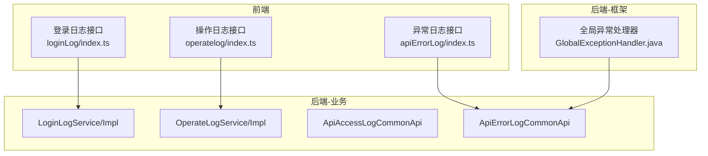
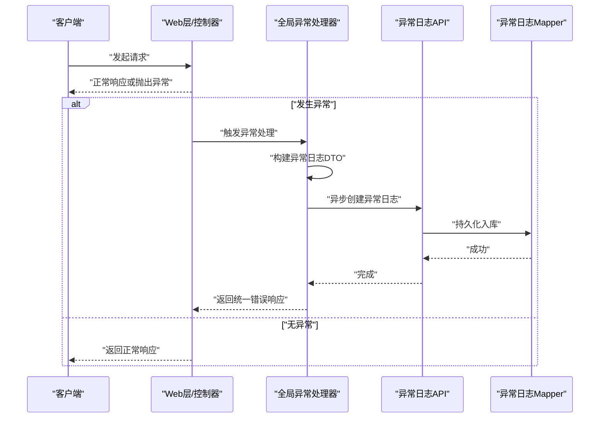
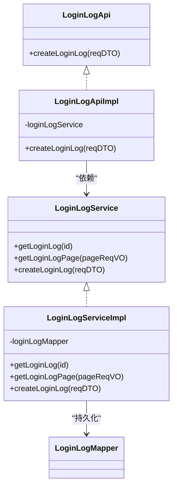
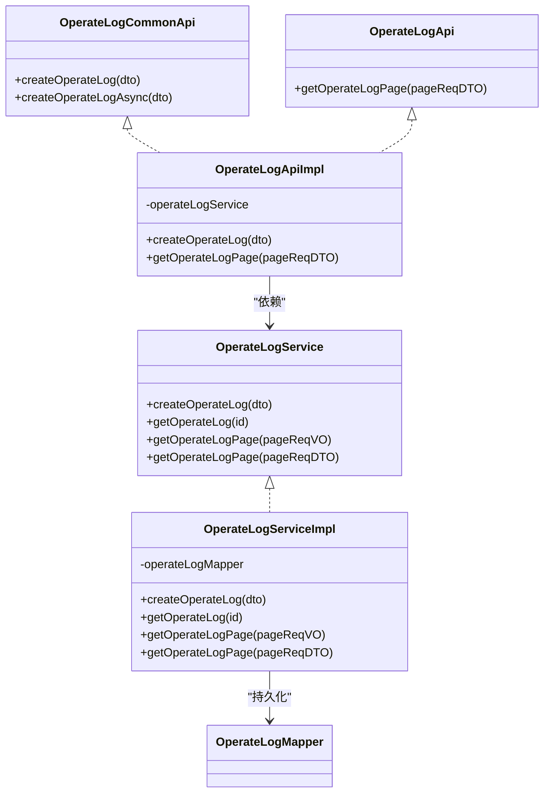
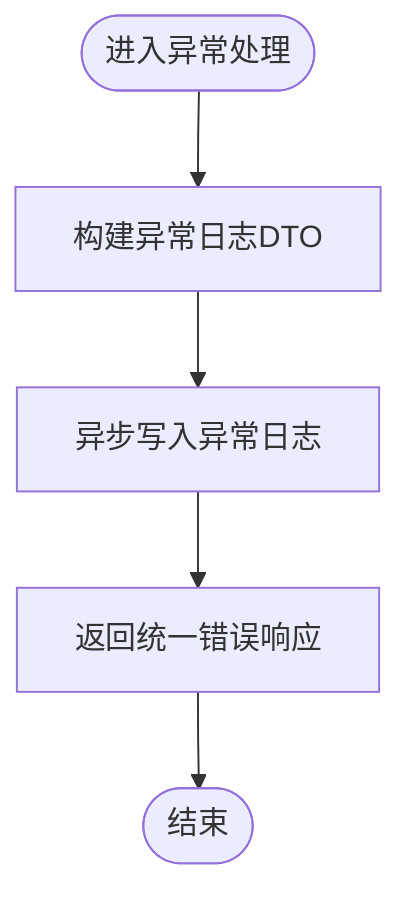
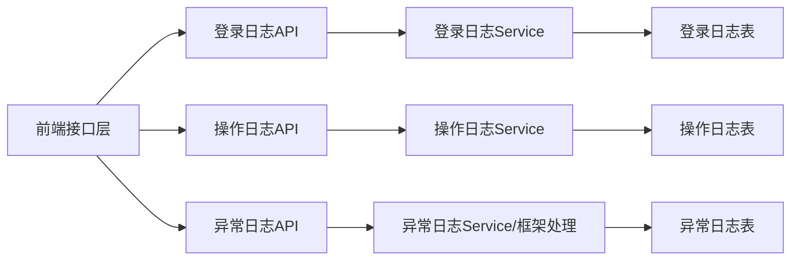

# 监控日志管理

<cite>
**本文引用的文件**
- [GlobalExceptionHandler.java](file://yudao-framework/yudao-spring-boot-starter-web/src/main/java/cn/iocoder/yudao/framework/web/core/handler/GlobalExceptionHandler.java)
- [ApiAccessLogCommonApi.java](file://yudao-framework/yudao-common/src/main/java/cn/iocoder/yudao/framework/common/biz/infra/logger/ApiAccessLogCommonApi.java)
- [ApiErrorLogCommonApi.java](file://yudao-framework/yudao-common/src/main/java/cn/iocoder/yudao/framework/common/biz/infra/logger/ApiErrorLogCommonApi.java)
- [OperateLogCommonApi.java](file://yudao-framework/yudao-common/src/main/java/cn/iocoder/yudao/framework/common/biz/system/logger/OperateLogCommonApi.java)
- [LoginLogApi.java](file://yudao-module-system/src/main/java/cn/iocoder/yudao/module/system/api/logger/LoginLogApi.java)
- [LoginLogApiImpl.java](file://yudao-module-system/src/main/java/cn/iocoder/yudao/module/system/api/logger/LoginLogApiImpl.java)
- [LoginLogService.java](file://yudao-module-system/src/main/java/cn/iocoder/yudao/module/system/service/logger/LoginLogService.java)
- [LoginLogServiceImpl.java](file://yudao-module-system/src/main/java/cn/iocoder/yudao/module/system/service/logger/LoginLogServiceImpl.java)
- [OperateLogApi.java](file://yudao-module-system/src/main/java/cn/iocoder/yudao/module/system/api/logger/OperateLogApi.java)
- [OperateLogApiImpl.java](file://yudao-module-system/src/main/java/cn/iocoder/yudao/module/system/api/logger/OperateLogApiImpl.java)
- [OperateLogService.java](file://yudao-module-system/src/main/java/cn/iocoder/yudao/module/system/service/logger/OperateLogService.java)
- [OperateLogServiceImpl.java](file://yudao-module-system/src/main/java/cn/iocoder/yudao/module/system/service/logger/OperateLogServiceImpl.java)
- [loginLog/index.ts](file://yudao-ui/yudao-ui-admin-vue3/src/api/system/loginLog/index.ts)
- [operatelog/index.ts](file://yudao-ui/yudao-ui-admin-vue3/src/api/system/operatelog/index.ts)
- [apiErrorLog/index.ts](file://yudao-ui/yudao-ui-admin-vue3/src/api/infra/apiErrorLog/index.ts)
- [logback-spring.xml](file://yudao-server/src/main/resources/logback-spring.xml)
- [application-local.yaml](file://yudao-server/src/main/resources/application-local.yaml)
- [create_tables.sql（infra）](file://yudao-module-infra/src/test/resources/sql/create_tables.sql)
- [create_tables.sql（system）](file://yudao-module-system/src/test/resources/sql/create_tables.sql)
- [TokenCleanJob.java](file://yudao-module-system/src/main/java/cn/iocoder/yudao/module/system/job/token/TokenCleanJob.java)
</cite>

## 目录
1. [简介](#简介)
2. [项目结构](#项目结构)
3. [核心组件](#核心组件)
4. [架构总览](#架构总览)
5. [详细组件分析](#详细组件分析)
6. [依赖关系分析](#依赖关系分析)
7. [性能考量](#性能考量)
8. [故障排查指南](#故障排查指南)
9. [结论](#结论)
10. [附录](#附录)

## 简介
本指南围绕系统运行监控与日志管理能力，系统性阐述登录日志、操作日志、异常日志的采集、存储、查询与分析机制。内容覆盖：
- 日志数据结构设计与字段定义
- 日志级别与分类
- 自动记录机制（请求/响应捕获、用户行为追踪、敏感操作审计）
- API 接口清单（登录日志查询、操作日志查询、异常日志查询与处理、日志导出）
- 存储策略、轮转与安全保护
- 实际代码示例路径与最佳实践

## 项目结构
日志相关能力由“后端框架层”“业务模块层”“前端接口层”协同实现：
- 框架层负责全局异常捕获与异常日志自动落库
- 业务模块提供登录日志、操作日志、API 访问日志的通用接口与服务
- 前端通过统一 API 进行分页查询与导出

图表来源
- [GlobalExceptionHandler.java:317-375](file://yudao-framework/yudao-spring-boot-starter-web/src/main/java/cn/iocoder/yudao/framework/web/core/handler/GlobalExceptionHandler.java#L317-L375)
- [LoginLogApi.java:1-21](file://yudao-module-system/src/main/java/cn/iocoder/yudao/module/system/api/logger/LoginLogApi.java#L1-L21)
- [OperateLogApi.java:1-23](file://yudao-module-system/src/main/java/cn/iocoder/yudao/module/system/api/logger/OperateLogApi.java#L1-L23)
- [ApiErrorLogCommonApi.java:1-32](file://yudao-framework/yudao-common/src/main/java/cn/iocoder/yudao/framework/common/biz/infra/logger/ApiErrorLogCommonApi.java#L1-L32)

章节来源
- [GlobalExceptionHandler.java:317-375](file://yudao-framework/yudao-spring-boot-starter-web/src/main/java/cn/iocoder/yudao/framework/web/core/handler/GlobalExceptionHandler.java#L317-L375)
- [loginLog/index.ts:1-25](file://yudao-ui/yudao-ui-admin-vue3/src/api/system/loginLog/index.ts#L1-L25)
- [operatelog/index.ts:1-30](file://yudao-ui/yudao-ui-admin-vue3/src/api/system/operatelog/index.ts#L1-L30)
- [apiErrorLog/index.ts:1-48](file://yudao-ui/yudao-ui-admin-vue3/src/api/infra/apiErrorLog/index.ts#L1-L48)

## 核心组件
- 异常日志自动记录：全局异常处理器在发生系统异常时，构建异常日志 DTO 并异步写入数据库
- 登录日志：提供创建、分页查询、导出 Excel 的能力
- 操作日志：提供创建、分页查询、导出 Excel 的能力
- API 访问日志：提供创建、分页查询、导出 Excel 的能力（框架/业务通用接口）

章节来源
- [GlobalExceptionHandler.java:342-375](file://yudao-framework/yudao-spring-boot-starter-web/src/main/java/cn/iocoder/yudao/framework/web/core/handler/GlobalExceptionHandler.java#L342-L375)
- [LoginLogApi.java:1-21](file://yudao-module-system/src/main/java/cn/iocoder/yudao/module/system/api/logger/LoginLogApi.java#L1-L21)
- [OperateLogApi.java:1-23](file://yudao-module-system/src/main/java/cn/iocoder/yudao/module/system/api/logger/OperateLogApi.java#L1-L23)
- [ApiAccessLogCommonApi.java:1-31](file://yudao-framework/yudao-common/src/main/java/cn/iocoder/yudao/framework/common/biz/infra/logger/ApiAccessLogCommonApi.java#L1-L31)

## 架构总览
下图展示了异常日志从捕获到入库的关键流程。

图表来源
- [GlobalExceptionHandler.java:317-375](file://yudao-framework/yudao-spring-boot-starter-web/src/main/java/cn/iocoder/yudao/framework/web/core/handler/GlobalExceptionHandler.java#L317-L375)

## 详细组件分析

### 登录日志
- 接口职责：创建登录日志、分页查询、导出 Excel
- 关键实现：API 接口、Service 实现、Mapper 持久化
- 前端对接：通过 loginLog/index.ts 提供分页与导出

图表来源
- [LoginLogApi.java:1-21](file://yudao-module-system/src/main/java/cn/iocoder/yudao/module/system/api/logger/LoginLogApi.java#L1-L21)
- [LoginLogApiImpl.java:1-27](file://yudao-module-system/src/main/java/cn/iocoder/yudao/module/system/api/logger/LoginLogApiImpl.java#L1-L27)
- [LoginLogService.java:1-38](file://yudao-module-system/src/main/java/cn/iocoder/yudao/module/system/service/logger/LoginLogService.java#L1-L38)
- [LoginLogServiceImpl.java:1-40](file://yudao-module-system/src/main/java/cn/iocoder/yudao/module/system/service/logger/LoginLogServiceImpl.java#L1-L40)

章节来源
- [LoginLogApi.java:1-21](file://yudao-module-system/src/main/java/cn/iocoder/yudao/module/system/api/logger/LoginLogApi.java#L1-L21)
- [LoginLogApiImpl.java:1-27](file://yudao-module-system/src/main/java/cn/iocoder/yudao/module/system/api/logger/LoginLogApiImpl.java#L1-L27)
- [LoginLogService.java:1-38](file://yudao-module-system/src/main/java/cn/iocoder/yudao/module/system/service/logger/LoginLogService.java#L1-L38)
- [LoginLogServiceImpl.java:1-40](file://yudao-module-system/src/main/java/cn/iocoder/yudao/module/system/service/logger/LoginLogServiceImpl.java#L1-L40)
- [loginLog/index.ts:1-25](file://yudao-ui/yudao-ui-admin-vue3/src/api/system/loginLog/index.ts#L1-L25)

### 操作日志
- 接口职责：创建操作日志、分页查询、导出 Excel
- 关键实现：API 接口、Service 实现、Mapper 持久化
- 前端对接：通过 operatelog/index.ts 提供分页与导出

图表来源
- [OperateLogCommonApi.java:1-31](file://yudao-framework/yudao-common/src/main/java/cn/iocoder/yudao/framework/common/biz/system/logger/OperateLogCommonApi.java#L1-L31)
- [OperateLogApi.java:1-23](file://yudao-module-system/src/main/java/cn/iocoder/yudao/module/system/api/logger/OperateLogApi.java#L1-L23)
- [OperateLogApiImpl.java:1-39](file://yudao-module-system/src/main/java/cn/iocoder/yudao/module/system/api/logger/OperateLogApiImpl.java#L1-L39)
- [OperateLogService.java:1-47](file://yudao-module-system/src/main/java/cn/iocoder/yudao/module/system/service/logger/OperateLogService.java#L1-L47)
- [OperateLogServiceImpl.java:1-49](file://yudao-module-system/src/main/java/cn/iocoder/yudao/module/system/service/logger/OperateLogServiceImpl.java#L1-L49)

章节来源
- [OperateLogCommonApi.java:1-31](file://yudao-framework/yudao-common/src/main/java/cn/iocoder/yudao/framework/common/biz/system/logger/OperateLogCommonApi.java#L1-L31)
- [OperateLogApi.java:1-23](file://yudao-module-system/src/main/java/cn/iocoder/yudao/module/system/api/logger/OperateLogApi.java#L1-L23)
- [OperateLogApiImpl.java:1-39](file://yudao-module-system/src/main/java/cn/iocoder/yudao/module/system/api/logger/OperateLogApiImpl.java#L1-L39)
- [OperateLogService.java:1-47](file://yudao-module-system/src/main/java/cn/iocoder/yudao/module/system/service/logger/OperateLogService.java#L1-L47)
- [OperateLogServiceImpl.java:1-49](file://yudao-module-system/src/main/java/cn/iocoder/yudao/module/system/service/logger/OperateLogServiceImpl.java#L1-L49)
- [operatelog/index.ts:1-30](file://yudao-ui/yudao-ui-admin-vue3/src/api/system/operatelog/index.ts#L1-L30)

### 异常日志（全局异常捕获）
- 自动记录：全局异常处理器在发生系统异常时，构建异常日志 DTO 并异步写入数据库
- 字段采集：异常名称、消息、根因、堆栈、类/方法/行号、请求 URL、用户信息、链路 ID 等
- 处理状态：支持更新处理状态（如“已处理/未处理”）

图表来源
- [GlobalExceptionHandler.java:342-375](file://yudao-framework/yudao-spring-boot-starter-web/src/main/java/cn/iocoder/yudao/framework/web/core/handler/GlobalExceptionHandler.java#L342-L375)

章节来源
- [GlobalExceptionHandler.java:317-375](file://yudao-framework/yudao-spring-boot-starter-web/src/main/java/cn/iocoder/yudao/framework/web/core/handler/GlobalExceptionHandler.java#L317-L375)
- [apiErrorLog/index.ts:1-48](file://yudao-ui/yudao-ui-admin-vue3/src/api/infra/apiErrorLog/index.ts#L1-L48)

### API 访问日志（通用接口）
- 通用接口：提供创建与异步创建 API 访问日志的能力
- 适用场景：对请求方法、URL、参数、响应体、耗时、结果码等进行统一记录

章节来源
- [ApiAccessLogCommonApi.java:1-31](file://yudao-framework/yudao-common/src/main/java/cn/iocoder/yudao/framework/common/biz/infra/logger/ApiAccessLogCommonApi.java#L1-L31)

## 依赖关系分析
- 组件耦合
  - 前端仅依赖后端提供的 API 接口，不直接依赖具体实现
  - 后端框架层与业务层通过通用接口解耦
- 外部依赖
  - 日志持久化依赖数据库表（见“附录-数据模型”）
  - 异步写入依赖 Spring 异步注解与线程池配置

图表来源
- [loginLog/index.ts:1-25](file://yudao-ui/yudao-ui-admin-vue3/src/api/system/loginLog/index.ts#L1-L25)
- [operatelog/index.ts:1-30](file://yudao-ui/yudao-ui-admin-vue3/src/api/system/operatelog/index.ts#L1-L30)
- [apiErrorLog/index.ts:1-48](file://yudao-ui/yudao-ui-admin-vue3/src/api/infra/apiErrorLog/index.ts#L1-L48)
- [LoginLogApi.java:1-21](file://yudao-module-system/src/main/java/cn/iocoder/yudao/module/system/api/logger/LoginLogApi.java#L1-L21)
- [OperateLogApi.java:1-23](file://yudao-module-system/src/main/java/cn/iocoder/yudao/module/system/api/logger/OperateLogApi.java#L1-L23)
- [ApiErrorLogCommonApi.java:1-32](file://yudao-framework/yudao-common/src/main/java/cn/iocoder/yudao/framework/common/biz/infra/logger/ApiErrorLogCommonApi.java#L1-L32)

## 性能考量
- 异步写日志：异常日志与操作日志均提供异步创建接口，降低请求延迟
- 日志轮转：服务端采用基于时间与大小的滚动策略，避免单文件过大
- 日志级别：通过配置文件对特定包设置日志级别，减少冗余输出

章节来源
- [OperateLogCommonApi.java:22-29](file://yudao-framework/yudao-common/src/main/java/cn/iocoder/yudao/framework/common/biz/system/logger/OperateLogCommonApi.java#L22-L29)
- [ApiErrorLogCommonApi.java:22-30](file://yudao-framework/yudao-common/src/main/java/cn/iocoder/yudao/framework/common/biz/infra/logger/ApiErrorLogCommonApi.java#L22-L30)
- [logback-spring.xml:17-29](file://yudao-server/src/main/resources/logback-spring.xml#L17-L29)
- [application-local.yaml:171-192](file://yudao-server/src/main/resources/application-local.yaml#L171-L192)

## 故障排查指南
- 异常日志未入库
  - 检查全局异常处理器是否被触发（确认异常是否被捕获）
  - 检查异常日志 API 是否可用、异步写入是否报错
- 日志查询为空
  - 核对分页参数、时间范围、关键字过滤条件
  - 确认数据库中是否存在对应记录
- 日志量过大
  - 调整日志级别与过滤规则
  - 检查日志轮转策略与保留天数
- 前端导出失败
  - 检查后端导出接口权限与参数
  - 确认浏览器下载拦截与网络问题

章节来源
- [GlobalExceptionHandler.java:342-375](file://yudao-framework/yudao-spring-boot-starter-web/src/main/java/cn/iocoder/yudao/framework/web/core/handler/GlobalExceptionHandler.java#L342-L375)
- [apiErrorLog/index.ts:30-48](file://yudao-ui/yudao-ui-admin-vue3/src/api/infra/apiErrorLog/index.ts#L30-L48)

## 结论
本项目通过“框架自动捕获 + 业务手动记录”的双通道，实现了登录、操作、异常三类日志的完整闭环。配合统一的 API 接口与前端导出能力，满足日常运维与审计需求。建议在生产环境合理配置日志级别与轮转策略，并结合定时任务清理过期数据，确保系统长期稳定运行。

## 附录

### 数据模型与字段定义
- 登录日志表（system_login_log）
  - 关键字段：用户类型、用户标识、用户名、登录结果、状态、IP、UA、创建时间等
  - 参考路径：[create_tables.sql（system）:200-221](file://yudao-module-system/src/test/resources/sql/create_tables.sql#L200-L221)

- 操作日志表（system_operate_log）
  - 关键字段：trace_id、用户类型/标识、类型、子类型、业务编号、动作描述、扩展信息、请求方法/URL、IP、UA、创建时间等
  - 参考路径：[create_tables.sql（system）:200-221](file://yudao-module-system/src/test/resources/sql/create_tables.sql#L200-L221)

- 异常日志表（infra_api_error_log）
  - 关键字段：trace_id、用户类型/标识、应用名、请求方法/URL/参数/IP/UA、异常类名/消息/根因/堆栈、异常位置、处理状态/人/时间、结果码、创建时间等
  - 参考路径：[create_tables.sql（infra）:117-147](file://yudao-module-infra/src/test/resources/sql/create_tables.sql#L117-L147)

- API 访问日志表（infra_api_access_log）
  - 关键字段：trace_id、用户类型/标识、应用名、请求方法/URL/参数/响应体、IP/UA、操作模块/名称/类型、开始/结束时间、耗时、结果码/消息、创建时间等
  - 参考路径：[create_tables.sql（infra）:88-115](file://yudao-module-infra/src/test/resources/sql/create_tables.sql#L88-L115)

章节来源
- [create_tables.sql（system）:200-221](file://yudao-module-system/src/test/resources/sql/create_tables.sql#L200-L221)
- [create_tables.sql（infra）:88-147](file://yudao-module-infra/src/test/resources/sql/create_tables.sql#L88-L147)

### 日志级别与分类
- 登录日志：按登录类型（账号/社交/手机/短信）、登出类型（主动/强制）区分
- 操作日志：按业务类型与子类型进行分类，便于检索与统计
- 异常日志：按异常类名与消息进行分类，支持按根因定位问题

章节来源
- [LoginLogTypeEnum.java:1-27](file://yudao-module-system/src/main/java/cn/iocoder/yudao/module/system/enums/logger/LoginLogTypeEnum.java#L1-L27)

### API 接口文档

- 登录日志
  - 分页查询
    - 方法：GET
    - 路径：/system/login-log/page
    - 参数：分页参数、时间范围、关键字过滤等
    - 返回：分页结果（包含登录日志列表）
    - 示例路径：[loginLog/index.ts:17-20](file://yudao-ui/yudao-ui-admin-vue3/src/api/system/loginLog/index.ts#L17-L20)
  - 导出 Excel
    - 方法：GET
    - 路径：/system/login-log/export-excel
    - 参数：查询条件
    - 返回：Excel 文件流
    - 示例路径：[loginLog/index.ts:22-25](file://yudao-ui/yudao-ui-admin-vue3/src/api/system/loginLog/index.ts#L22-L25)

- 操作日志
  - 分页查询
    - 方法：GET
    - 路径：/system/operate-log/page
    - 参数：分页参数、时间范围、关键字过滤等
    - 返回：分页结果（包含操作日志列表）
    - 示例路径：[operatelog/index.ts:23-26](file://yudao-ui/yudao-ui-admin-vue3/src/api/system/operatelog/index.ts#L23-L26)
  - 导出 Excel
    - 方法：GET
    - 路径：/system/operate-log/export-excel
    - 参数：查询条件
    - 返回：Excel 文件流
    - 示例路径：[operatelog/index.ts:27-30](file://yudao-ui/yudao-ui-admin-vue3/src/api/system/operatelog/index.ts#L27-L30)

- 异常日志
  - 分页查询
    - 方法：GET
    - 路径：/infra/api-error-log/page
    - 参数：分页参数、时间范围、关键字过滤等
    - 返回：分页结果（包含异常日志列表）
    - 示例路径：[apiErrorLog/index.ts:30-33](file://yudao-ui/yudao-ui-admin-vue3/src/api/infra/apiErrorLog/index.ts#L30-L33)
  - 更新处理状态
    - 方法：PUT
    - 路径：/infra/api-error-log/update-status
    - 参数：id、processStatus
    - 返回：通用结果对象
    - 示例路径：[apiErrorLog/index.ts:35-40](file://yudao-ui/yudao-ui-admin-vue3/src/api/infra/apiErrorLog/index.ts#L35-L40)
  - 导出 Excel
    - 方法：GET
    - 路径：/infra/api-error-log/export-excel
    - 参数：查询条件
    - 返回：Excel 文件流
    - 示例路径：[apiErrorLog/index.ts:42-48](file://yudao-ui/yudao-ui-admin-vue3/src/api/infra/apiErrorLog/index.ts#L42-L48)

章节来源
- [loginLog/index.ts:1-25](file://yudao-ui/yudao-ui-admin-vue3/src/api/system/loginLog/index.ts#L1-L25)
- [operatelog/index.ts:1-30](file://yudao-ui/yudao-ui-admin-vue3/src/api/system/operatelog/index.ts#L1-L30)
- [apiErrorLog/index.ts:1-48](file://yudao-ui/yudao-ui-admin-vue3/src/api/infra/apiErrorLog/index.ts#L1-L48)

### 日志自动记录与查询示例（代码路径）
- 异常日志自动记录
  - 触发点：全局异常处理器
  - 关键路径：[GlobalExceptionHandler.java:342-375](file://yudao-framework/yudao-spring-boot-starter-web/src/main/java/cn/iocoder/yudao/framework/web/core/handler/GlobalExceptionHandler.java#L342-L375)
- 操作日志异步创建
  - 接口：OperateLogCommonApi.createOperateLogAsync
  - 关键路径：[OperateLogCommonApi.java:22-29](file://yudao-framework/yudao-common/src/main/java/cn/iocoder/yudao/framework/common/biz/system/logger/OperateLogCommonApi.java#L22-L29)
- 登录日志创建
  - 接口：LoginLogApi.createLoginLog
  - 关键路径：[LoginLogApi.java:14-19](file://yudao-module-system/src/main/java/cn/iocoder/yudao/module/system/api/logger/LoginLogApi.java#L14-L19)

章节来源
- [GlobalExceptionHandler.java:342-375](file://yudao-framework/yudao-spring-boot-starter-web/src/main/java/cn/iocoder/yudao/framework/web/core/handler/GlobalExceptionHandler.java#L342-L375)
- [OperateLogCommonApi.java:22-29](file://yudao-framework/yudao-common/src/main/java/cn/iocoder/yudao/framework/common/biz/system/logger/OperateLogCommonApi.java#L22-L29)
- [LoginLogApi.java:14-19](file://yudao-module-system/src/main/java/cn/iocoder/yudao/module/system/api/logger/LoginLogApi.java#L14-L19)

### 日志存储策略与轮转
- 存储策略
  - 数据库表：登录日志、操作日志、异常日志分别存储于独立表
  - 建议：对高频查询字段建立索引（如用户标识、时间范围、类型）
- 日志轮转
  - 服务端采用基于“时间 + 大小”的滚动策略，默认保留 30 天、单文件最大 10MB
  - 异步写入提升吞吐
- 定时清理
  - 示例：定时清理过期令牌（可借鉴为日志清理策略）
  - 关键路径：[TokenCleanJob.java:32-40](file://yudao-module-system/src/main/java/cn/iocoder/yudao/module/system/job/token/TokenCleanJob.java#L32-L40)

章节来源
- [logback-spring.xml:17-29](file://yudao-server/src/main/resources/logback-spring.xml#L17-L29)
- [application-local.yaml:171-192](file://yudao-server/src/main/resources/application-local.yaml#L171-L192)
- [TokenCleanJob.java:32-40](file://yudao-module-system/src/main/java/cn/iocoder/yudao/module/system/job/token/TokenCleanJob.java#L32-L40)

### 日志安全保护
- 敏感字段脱敏：在记录请求参数与响应体时，对敏感字段进行脱敏处理
- 权限控制：异常日志处理状态更新需鉴权
- 最佳实践：避免在日志中记录明文密码、密钥等敏感信息

[本节为通用指导，无需列出具体文件来源]