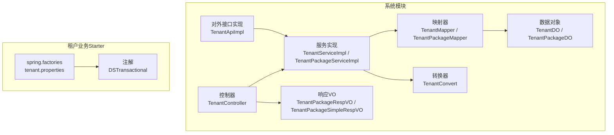
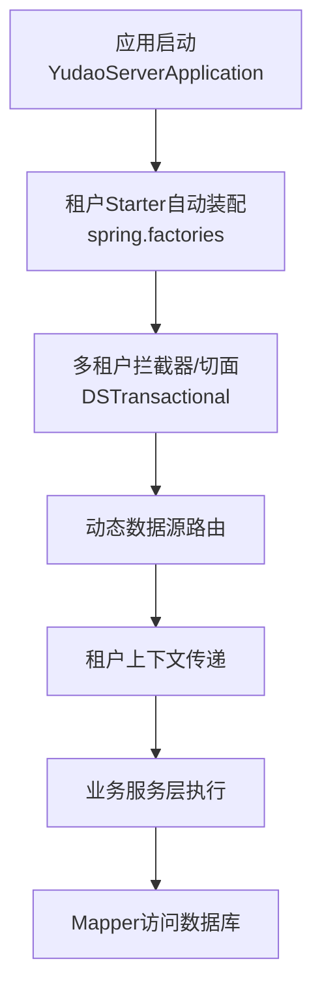
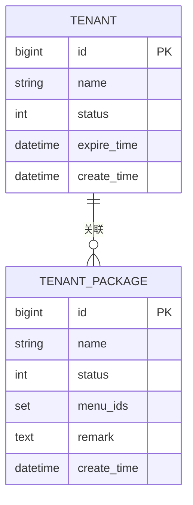
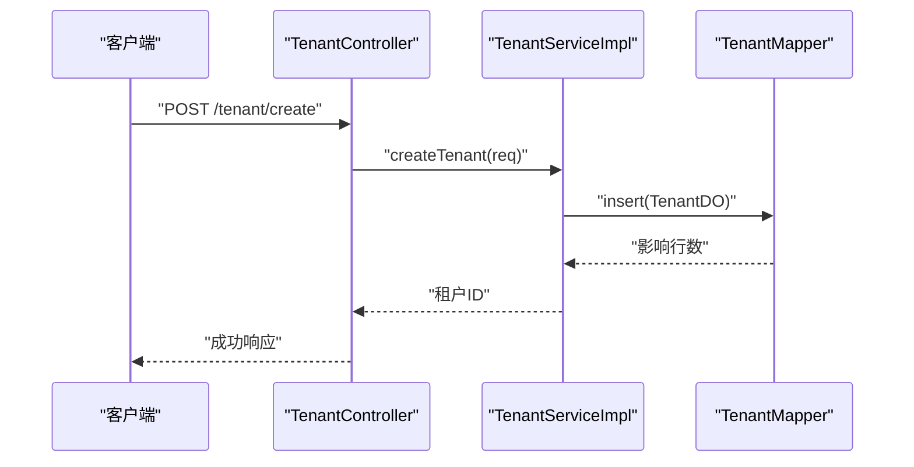
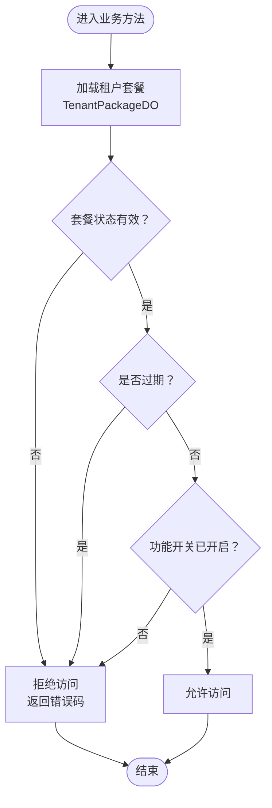
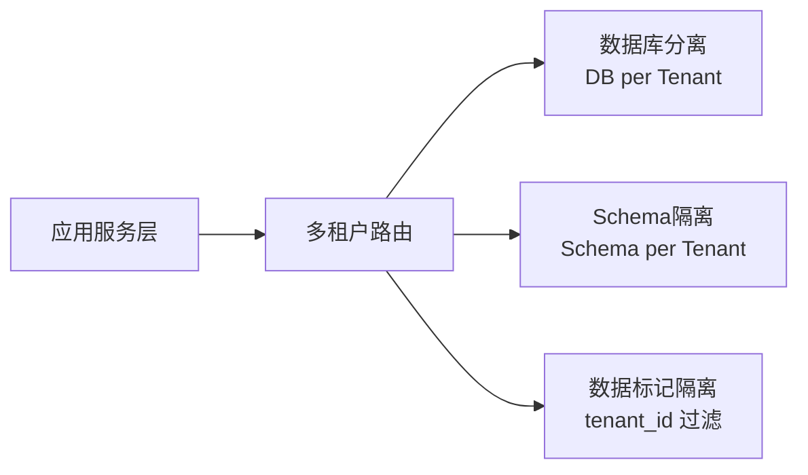
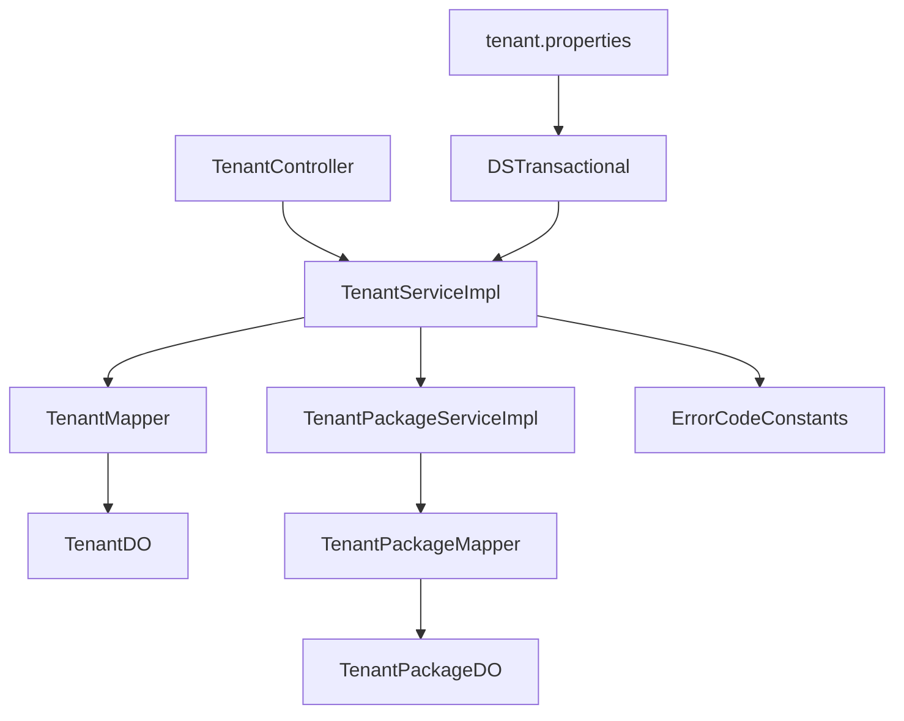

# 租户管理

<cite>
**本文引用的文件**
- [TenantController.java](file://yudao-module-system/src/main/java/cn/iocoder/yudao/module/system/controller/admin/tenant/TenantController.java)
- [TenantServiceImpl.java](file://yudao-module-system/src/main/java/cn/iocoder/yudao/module/system/service/tenant/TenantServiceImpl.java)
- [TenantPackageServiceImpl.java](file://yudao-module-system/src/main/java/cn/iocoder/yudao/module/system/service/tenant/TenantPackageServiceImpl.java)
- [TenantPackageService.java](file://yudao-module-system/src/main/java/cn/iocoder/yudao/module/system/service/tenant/TenantPackageService.java)
- [TenantDO.java](file://yudao-module-system/src/main/java/cn/iocoder/yudao/module/system/dal/dataobject/tenant/TenantDO.java)
- [TenantPackageDO.java](file://yudao-module-system/src/main/java/cn/iocoder/yudao/module/system/dal/dataobject/tenant/TenantPackageDO.java)
- [TenantMapper.java](file://yudao-module-system/src/main/java/cn/iocoder/yudao/module/system/dal/mysql/tenant/TenantMapper.java)
- [TenantPackageMapper.java](file://yudao-module-system/src/main/java/cn/iocoder/yudao/module/system/dal/mysql/tenant/TenantPackageMapper.java)
- [TenantConvert.java](file://yudao-module-system/src/main/java/cn/iocoder/yudao/module/system/convert/tenant/TenantConvert.java)
- [TenantPackageRespVO.java](file://yudao-module-system/src/main/java/cn/iocoder/yudao/module/system/controller/admin/tenant/vo/packages/TenantPackageRespVO.java)
- [TenantPackageSimpleRespVO.java](file://yudao-module-system/src/main/java/cn/iocoder/yudao/module/system/controller/admin/tenant/vo/packages/TenantPackageSimpleRespVO.java)
- [TenantApiImpl.java](file://yudao-module-system/src/main/java/cn/iocoder/yudao/module/system/api/tenant/TenantApiImpl.java)
- [ErrorCodeConstants.java](file://yudao-module-system/src/main/java/cn/iocoder/yudao/module/system/enums/ErrorCodeConstants.java)
- [CommonStatusEnum.java](file://yudao-framework/yudao-common/src/main/java/cn/iocoder/yudao/framework/common/enums/CommonStatusEnum.java)
- [DSTransactional.class](file://yudao-framework/yudao-spring-boot-starter-biz-tenant/src/main/java/org/springframework/messaging/handler/invocation/DSTransactional.class)
- [tenant.properties](file://yudao-framework/yudao-spring-boot-starter-biz-tenant/src/main/resources/META-INF/spring.factories)
- [YudaoServerApplication.java](file://yudao-server/src/main/java/cn/iocoder/yudao/server/YudaoServerApplication.java)
</cite>

## 目录
1. [简介](#简介)
2. [项目结构](#项目结构)
3. [核心组件](#核心组件)
4. [架构总览](#架构总览)
5. [详细组件分析](#详细组件分析)
6. [依赖关系分析](#依赖关系分析)
7. [性能考虑](#性能考虑)
8. [故障排查指南](#故障排查指南)
9. [结论](#结论)
10. [附录](#附录)

## 简介
本指南围绕多租户架构在系统中的设计与实现展开，重点覆盖以下方面：
- 租户生命周期管理：从租户注册到停用的完整流程
- 租户套餐配置：套餐定义、菜单授权、状态管理与分页查询
- 租户数据隔离：数据库分离、Schema隔离与数据标记隔离策略
- 权限控制机制：功能开关、使用限制、到期处理与续费管理
- API 接口文档：租户列表、详情、创建更新、套餐管理、状态控制等
- 实际代码示例路径：展示租户注册流程、套餐权限控制、数据隔离机制
- 租户切换、租户审计与租户统计分析的实现思路

## 项目结构
租户相关能力主要位于 system 模块中，采用“控制器-服务-持久层-数据对象-转换器-VO”的标准分层架构；同时通过独立的租户业务 Starter 提供多租户运行时支持。

图表来源
- [TenantController.java](file://yudao-module-system/src/main/java/cn/iocoder/yudao/module/system/controller/admin/tenant/TenantController.java)
- [TenantServiceImpl.java](file://yudao-module-system/src/main/java/cn/iocoder/yudao/module/system/service/tenant/TenantServiceImpl.java)
- [TenantPackageServiceImpl.java](file://yudao-module-system/src/main/java/cn/iocoder/yudao/module/system/service/tenant/TenantPackageServiceImpl.java)
- [TenantMapper.java](file://yudao-module-system/src/main/java/cn/iocoder/yudao/module/system/dal/mysql/tenant/TenantMapper.java)
- [TenantPackageMapper.java](file://yudao-module-system/src/main/java/cn/iocoder/yudao/module/system/dal/mysql/tenant/TenantPackageMapper.java)
- [TenantDO.java](file://yudao-module-system/src/main/java/cn/iocoder/yudao/module/system/dal/dataobject/tenant/TenantDO.java)
- [TenantPackageDO.java](file://yudao-module-system/src/main/java/cn/iocoder/yudao/module/system/dal/dataobject/tenant/TenantPackageDO.java)
- [TenantConvert.java](file://yudao-module-system/src/main/java/cn/iocoder/yudao/module/system/convert/tenant/TenantConvert.java)
- [TenantPackageRespVO.java](file://yudao-module-system/src/main/java/cn/iocoder/yudao/module/system/controller/admin/tenant/vo/packages/TenantPackageRespVO.java)
- [TenantPackageSimpleRespVO.java](file://yudao-module-system/src/main/java/cn/iocoder/yudao/module/system/controller/admin/tenant/vo/packages/TenantPackageSimpleRespVO.java)
- [TenantApiImpl.java](file://yudao-module-system/src/main/java/cn/iocoder/yudao/module/system/api/tenant/TenantApiImpl.java)
- [tenant.properties](file://yudao-framework/yudao-spring-boot-starter-biz-tenant/src/main/resources/META-INF/spring.factories)
- [DSTransactional.class](file://yudao-framework/yudao-spring-boot-starter-biz-tenant/src/main/java/org/springframework/messaging/handler/invocation/DSTransactional.class)

章节来源
- [TenantController.java](file://yudao-module-system/src/main/java/cn/iocoder/yudao/module/system/controller/admin/tenant/TenantController.java)
- [YudaoServerApplication.java](file://yudao-server/src/main/java/cn/iocoder/yudao/server/YudaoServerApplication.java)

## 核心组件
- 控制器层：提供 REST API，负责请求接收、参数校验与响应封装
- 服务层：实现业务逻辑，包括租户生命周期、套餐管理、权限校验与数据隔离策略
- 持久层：基于 MyBatis-Plus 的 Mapper，负责数据访问
- 数据对象：租户与套餐的数据模型
- 转换器与 VO：统一对外输出格式
- 对外接口实现：为其他模块提供只读或受限调用能力

章节来源
- [TenantServiceImpl.java](file://yudao-module-system/src/main/java/cn/iocoder/yudao/module/system/service/tenant/TenantServiceImpl.java)
- [TenantPackageServiceImpl.java](file://yudao-module-system/src/main/java/cn/iocoder/yudao/module/system/service/tenant/TenantPackageServiceImpl.java)
- [TenantDO.java](file://yudao-module-system/src/main/java/cn/iocoder/yudao/module/system/dal/dataobject/tenant/TenantDO.java)
- [TenantPackageDO.java](file://yudao-module-system/src/main/java/cn/iocoder/yudao/module/system/dal/dataobject/tenant/TenantPackageDO.java)
- [TenantConvert.java](file://yudao-module-system/src/main/java/cn/iocoder/yudao/module/system/convert/tenant/TenantConvert.java)
- [TenantPackageRespVO.java](file://yudao-module-system/src/main/java/cn/iocoder/yudao/module/system/controller/admin/tenant/vo/packages/TenantPackageRespVO.java)
- [TenantPackageSimpleRespVO.java](file://yudao-module-system/src/main/java/cn/iocoder/yudao/module/system/controller/admin/tenant/vo/packages/TenantPackageSimpleRespVO.java)
- [TenantApiImpl.java](file://yudao-module-system/src/main/java/cn/iocoder/yudao/module/system/api/tenant/TenantApiImpl.java)

## 架构总览
多租户运行时通过 Starter 自动装配，结合注解驱动的数据源路由与事务传播，实现租户维度的数据隔离与权限控制。

图表来源
- [YudaoServerApplication.java](file://yudao-server/src/main/java/cn/iocoder/yudao/server/YudaoServerApplication.java)
- [tenant.properties](file://yudao-framework/yudao-spring-boot-starter-biz-tenant/src/main/resources/META-INF/spring.factories)
- [DSTransactional.class](file://yudao-framework/yudao-spring-boot-starter-biz-tenant/src/main/java/org/springframework/messaging/handler/invocation/DSTransactional.class)

## 详细组件分析

### 租户控制器（TenantController）
- 职责：提供租户相关的 HTTP 接口，如列表查询、详情获取、创建/更新、状态变更、套餐绑定等
- 关键点：参数校验、分页结果封装、错误码映射、与服务层交互

章节来源
- [TenantController.java](file://yudao-module-system/src/main/java/cn/iocoder/yudao/module/system/controller/admin/tenant/TenantController.java)

### 租户服务实现（TenantServiceImpl）
- 职责：实现租户生命周期管理、套餐关联、状态控制、数据隔离策略
- 关键点：事务一致性、异常处理、与 Mapper 的协作

章节来源
- [TenantServiceImpl.java](file://yudao-module-system/src/main/java/cn/iocoder/yudao/module/system/service/tenant/TenantServiceImpl.java)

### 租户套餐服务（TenantPackageService / TenantPackageServiceImpl）
- 职责：套餐的增删改查、分页查询、菜单授权、状态管理
- 关键点：批量删除、菜单集合维护、与租户的关联关系

章节来源
- [TenantPackageService.java](file://yudao-module-system/src/main/java/cn/iocoder/yudao/module/system/service/tenant/TenantPackageService.java)
- [TenantPackageServiceImpl.java](file://yudao-module-system/src/main/java/cn/iocoder/yudao/module/system/service/tenant/TenantPackageServiceImpl.java)

### 数据模型与映射
- 租户数据对象（TenantDO）：包含租户基本信息、状态、创建时间等字段
- 套餐数据对象（TenantPackageDO）：包含套餐名称、状态、菜单集合、备注等
- 映射器（TenantMapper / TenantPackageMapper）：提供 CRUD 与分页查询能力

图表来源
- [TenantDO.java](file://yudao-module-system/src/main/java/cn/iocoder/yudao/module/system/dal/dataobject/tenant/TenantDO.java)
- [TenantPackageDO.java](file://yudao-module-system/src/main/java/cn/iocoder/yudao/module/system/dal/dataobject/tenant/TenantPackageDO.java)

### 转换器与VO
- 转换器（TenantConvert）：用于 DTO/DO/VO 之间的转换
- 响应VO：标准化输出字段，如套餐的 id、name、status、menuIds、createTime 等

章节来源
- [TenantConvert.java](file://yudao-module-system/src/main/java/cn/iocoder/yudao/module/system/convert/tenant/TenantConvert.java)
- [TenantPackageRespVO.java](file://yudao-module-system/src/main/java/cn/iocoder/yudao/module/system/controller/admin/tenant/vo/packages/TenantPackageRespVO.java)
- [TenantPackageSimpleRespVO.java](file://yudao-module-system/src/main/java/cn/iocoder/yudao/module/system/controller/admin/tenant/vo/packages/TenantPackageSimpleRespVO.java)

### 对外接口实现（TenantApiImpl）
- 职责：为其他模块提供只读或受限的租户信息查询能力，避免直接操作租户数据

章节来源
- [TenantApiImpl.java](file://yudao-module-system/src/main/java/cn/iocoder/yudao/module/system/api/tenant/TenantApiImpl.java)

### 租户注册流程（序列图）

图表来源
- [TenantController.java](file://yudao-module-system/src/main/java/cn/iocoder/yudao/module/system/controller/admin/tenant/TenantController.java)
- [TenantServiceImpl.java](file://yudao-module-system/src/main/java/cn/iocoder/yudao/module/system/service/tenant/TenantServiceImpl.java)
- [TenantMapper.java](file://yudao-module-system/src/main/java/cn/iocoder/yudao/module/system/dal/mysql/tenant/TenantMapper.java)

### 套餐权限控制（流程图）

图表来源
- [TenantPackageServiceImpl.java](file://yudao-module-system/src/main/java/cn/iocoder/yudao/module/system/service/tenant/TenantPackageServiceImpl.java)
- [ErrorCodeConstants.java](file://yudao-module-system/src/main/java/cn/iocoder/yudao/module/system/enums/ErrorCodeConstants.java)
- [CommonStatusEnum.java](file://yudao-framework/yudao-common/src/main/java/cn/iocoder/yudao/framework/common/enums/CommonStatusEnum.java)

### 数据隔离策略（概念图）
- 数据库分离：每个租户独立数据库实例，完全物理隔离
- Schema 隔离：同一数据库内按租户划分 Schema，通过路由区分
- 数据标记隔离：同一库同表下以 tenant_id 字段进行过滤，配合数据权限组件

（该图为概念性示意，不对应具体源码文件）

## 依赖关系分析
- 控制器依赖服务层接口，服务层依赖 Mapper 与数据对象
- 错误码常量集中定义，便于统一处理
- 租户 Stater 通过 spring.factories 自动装配，提供注解与运行时支持

图表来源
- [TenantController.java](file://yudao-module-system/src/main/java/cn/iocoder/yudao/module/system/controller/admin/tenant/TenantController.java)
- [TenantServiceImpl.java](file://yudao-module-system/src/main/java/cn/iocoder/yudao/module/system/service/tenant/TenantServiceImpl.java)
- [TenantMapper.java](file://yudao-module-system/src/main/java/cn/iocoder/yudao/module/system/dal/mysql/tenant/TenantMapper.java)
- [TenantPackageServiceImpl.java](file://yudao-module-system/src/main/java/cn/iocoder/yudao/module/system/service/tenant/TenantPackageServiceImpl.java)
- [TenantPackageMapper.java](file://yudao-module-system/src/main/java/cn/iocoder/yudao/module/system/dal/mysql/tenant/TenantPackageMapper.java)
- [ErrorCodeConstants.java](file://yudao-module-system/src/main/java/cn/iocoder/yudao/module/system/enums/ErrorCodeConstants.java)
- [tenant.properties](file://yudao-framework/yudao-spring-boot-starter-biz-tenant/src/main/resources/META-INF/spring.factories)
- [DSTransactional.class](file://yudao-framework/yudao-spring-boot-starter-biz-tenant/src/main/java/org/springframework/messaging/handler/invocation/DSTransactional.class)

章节来源
- [ErrorCodeConstants.java](file://yudao-module-system/src/main/java/cn/iocoder/yudao/module/system/enums/ErrorCodeConstants.java)
- [tenant.properties](file://yudao-framework/yudao-spring-boot-starter-biz-tenant/src/main/resources/META-INF/spring.factories)

## 性能考虑
- 分页查询：对租户与套餐列表查询建议使用分页参数，避免一次性加载大量数据
- 缓存策略：对套餐菜单集合等静态配置可引入缓存，降低重复查询开销
- 并发控制：套餐状态变更与租户启用/停用需加锁或使用乐观锁，防止竞态
- 数据库优化：为 tenant_id、status、expire_time 等常用过滤字段建立索引

（本节为通用指导，不涉及具体文件分析）

## 故障排查指南
- 常见错误码定位：参考错误码常量定义，快速定位业务异常类型
- 状态枚举核对：确认套餐状态与系统状态枚举一致
- 事务一致性：套餐删除与关联清理需在事务内完成，避免脏数据
- 日志与审计：结合操作日志模块，记录租户与套餐的关键变更

章节来源
- [ErrorCodeConstants.java](file://yudao-module-system/src/main/java/cn/iocoder/yudao/module/system/enums/ErrorCodeConstants.java)
- [CommonStatusEnum.java](file://yudao-framework/yudao-common/src/main/java/cn/iocoder/yudao/framework/common/enums/CommonStatusEnum.java)
- [TenantPackageServiceImpl.java](file://yudao-module-system/src/main/java/cn/iocoder/yudao/module/system/service/tenant/TenantPackageServiceImpl.java)

## 结论
本指南梳理了多租户在系统中的整体设计与实现要点，涵盖生命周期、套餐配置、权限控制与数据隔离策略，并提供了 API 设计与故障排查建议。实际开发中应结合具体业务场景选择合适的隔离方案，并通过完善的测试与监控保障稳定性。

（本节为总结性内容，不涉及具体文件分析）

## 附录

### API 接口清单与说明
- 租户列表查询
  - 方法：GET
  - 路径：/tenant/list
  - 请求参数：分页参数、状态、关键字等（由控制器定义）
  - 返回：分页结果，包含租户基础信息
  - 参考路径：[TenantController.java](file://yudao-module-system/src/main/java/cn/iocoder/yudao/module/system/controller/admin/tenant/TenantController.java)

- 租户详情获取
  - 方法：GET
  - 路径：/tenant/get/{id}
  - 返回：租户详情（含套餐信息）
  - 参考路径：[TenantController.java](file://yudao-module-system/src/main/java/cn/iocoder/yudao/module/system/controller/admin/tenant/TenantController.java)

- 租户创建
  - 方法：POST
  - 路径：/tenant/create
  - 请求体：租户创建参数（名称、状态、到期时间等）
  - 返回：租户ID
  - 参考路径：[TenantController.java](file://yudao-module-system/src/main/java/cn/iocoder/yudao/module/system/controller/admin/tenant/TenantController.java)

- 租户更新
  - 方法：PUT
  - 路径：/tenant/update
  - 请求体：租户更新参数
  - 返回：成功/失败
  - 参考路径：[TenantController.java](file://yudao-module-system/src/main/java/cn/iocoder/yudao/module/system/controller/admin/tenant/TenantController.java)

- 租户状态控制
  - 方法：PUT
  - 路径：/tenant/status
  - 请求体：租户ID与目标状态
  - 返回：结果
  - 参考路径：[TenantController.java](file://yudao-module-system/src/main/java/cn/iocoder/yudao/module/system/controller/admin/tenant/TenantController.java)

- 租户套餐管理
  - 创建套餐：POST /tenant/package/create
  - 更新套餐：PUT /tenant/package/update
  - 删除套餐：DELETE /tenant/package/delete/{id}
  - 查询套餐：GET /tenant/package/get/{id}
  - 分页查询：GET /tenant/package/page
  - 参考路径：
    - [TenantPackageService.java](file://yudao-module-system/src/main/java/cn/iocoder/yudao/module/system/service/tenant/TenantPackageService.java)
    - [TenantPackageServiceImpl.java](file://yudao-module-system/src/main/java/cn/iocoder/yudao/module/system/service/tenant/TenantPackageServiceImpl.java)

### 租户切换、审计与统计
- 租户切换：通过上下文传递与路由配置，在请求链路中识别当前租户
- 租户审计：结合操作日志模块，记录租户关键操作（创建、更新、状态变更、套餐绑定）
- 租户统计：基于租户维度的报表统计，建议使用定时任务或异步消息生成

（本节为通用指导，不涉及具体文件分析）