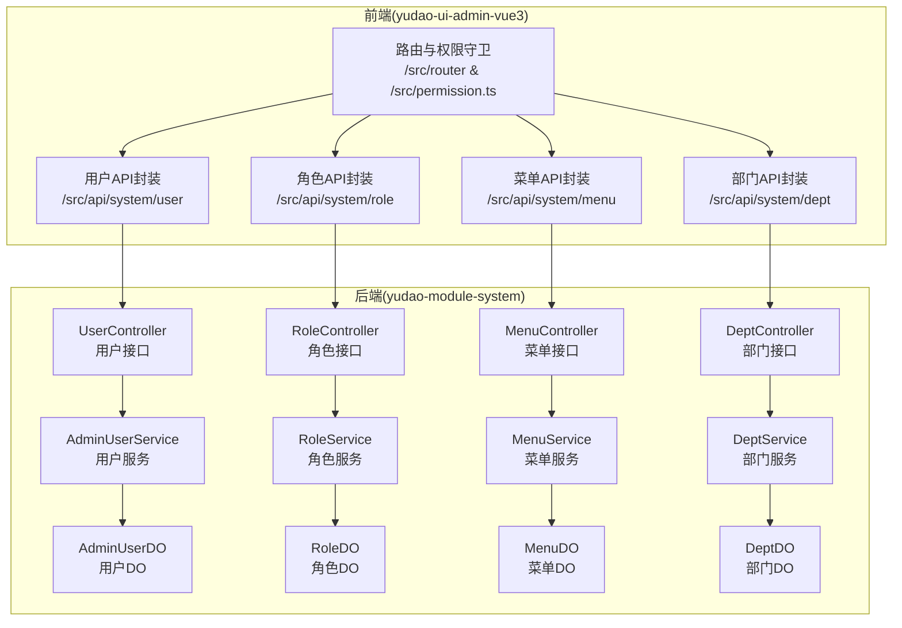
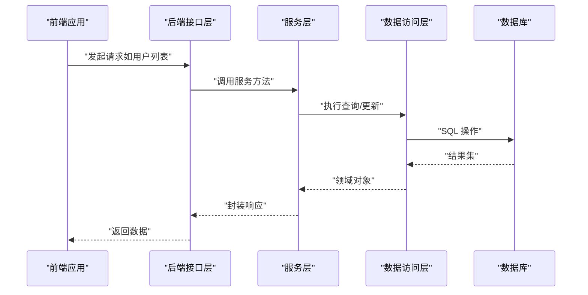
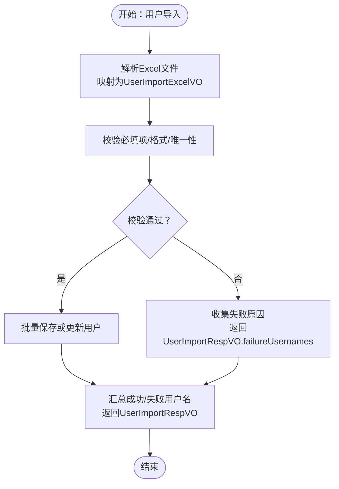
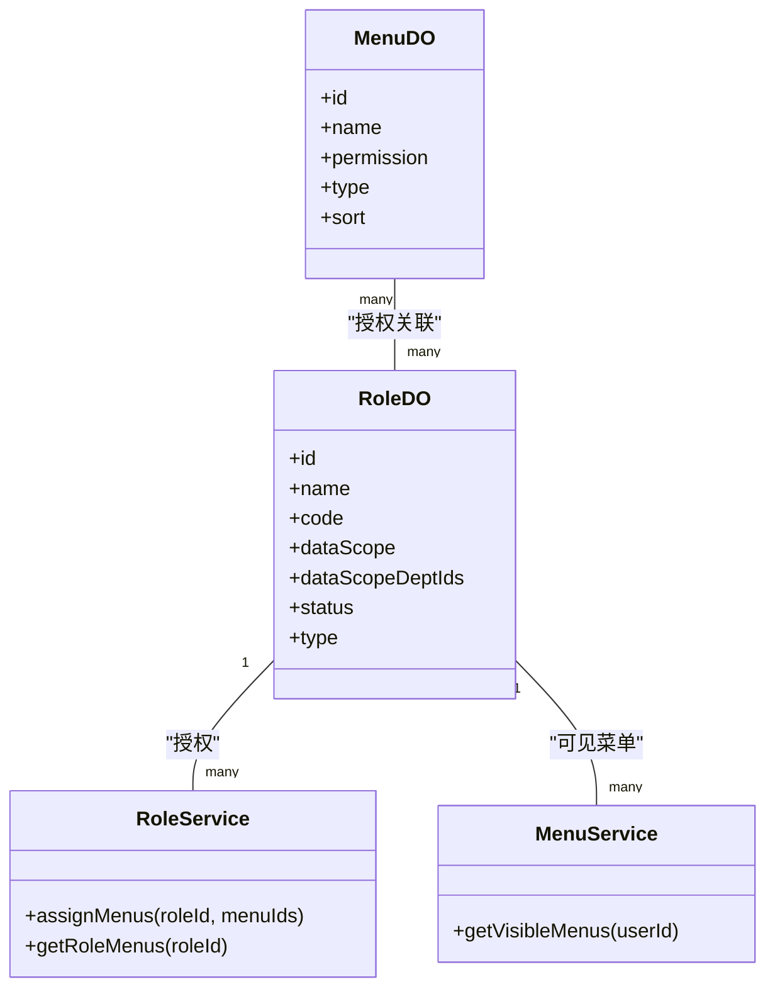
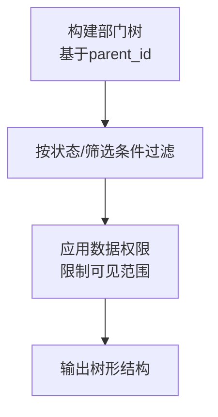
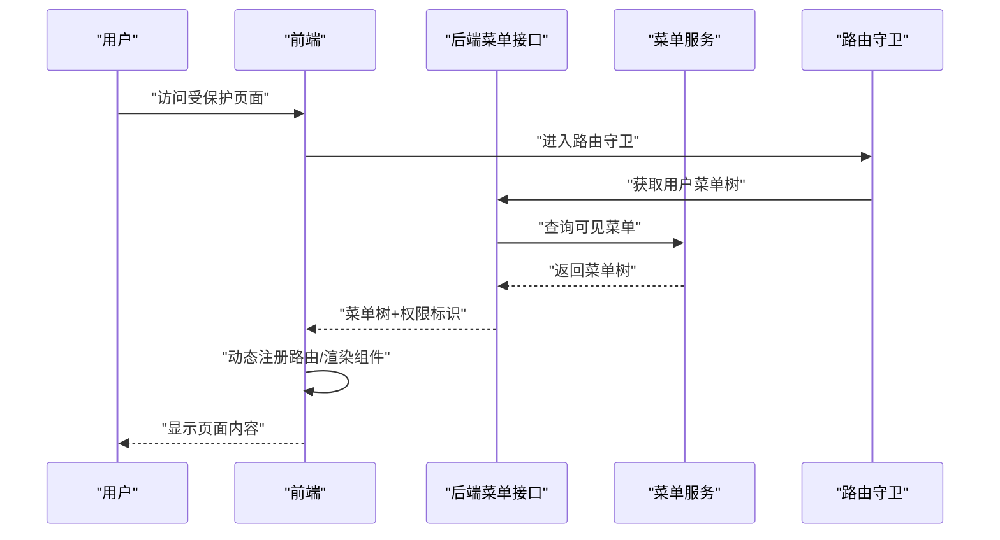
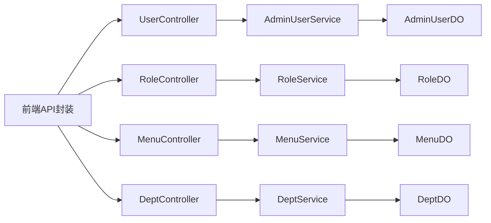

# 系统管理模块

<cite>
**本文引用的文件**
- [UserController.java](file://yudao-module-system/src/main/java/cn/iocoder/yudao/module/system/controller/admin/user/UserController.java)
- [AdminUserApiImpl.java](file://yudao-module-system/src/main/java/cn/iocoder/yudao/module/system/api/user/AdminUserApiImpl.java)
- [UserImportExcelVO.java](file://yudao-module-system/src/main/java/cn/iocoder/yudao/module/system/controller/admin/user/vo/user/UserImportExcelVO.java)
- [UserImportRespVO.java](file://yudao-module-system/src/main/java/cn/iocoder/yudao/module/system/controller/admin/user/vo/user/UserImportRespVO.java)
- [RoleController.java](file://yudao-module-system/src/main/java/cn/iocoder/yudao/module/system/controller/admin/permission/RoleController.java)
- [MenuController.java](file://yudao-module-system/src/main/java/cn/iocoder/yudao/module/system/controller/admin/permission/MenuController.java)
- [DeptController.java](file://yudao-module-system/src/main/java/cn/iocoder/yudao/module/system/controller/admin/dept/DeptController.java)
- [DeptService.java](file://yudao-module-system/src/main/java/cn/iocoder/yudao/module/system/service/dept/DeptService.java)
- [AdminUserService.java](file://yudao-module-system/src/main/java/cn/iocoder/yudao/module/system/service/user/AdminUserService.java)
- [RoleService.java](file://yudao-module-system/src/main/java/cn/iocoder/yudao/module/system/service/permission/RoleService.java)
- [MenuService.java](file://yudao-module-system/src/main/java/cn/iocoder/yudao/module/system/service/permission/MenuService.java)
- [DeptDO.java](file://yudao-module-system/src/main/java/cn/iocoder/yudao/module/system/dal/dataobject/dept/DeptDO.java)
- [RoleDO.java](file://yudao-module-system/src/main/java/cn/iocoder/yudao/module/system/dal/dataobject/permission/RoleDO.java)
- [MenuDO.java](file://yudao-module-system/src/main/java/cn/iocoder/yudao/module/system/dal/dataobject/permission/MenuDO.java)
- [AdminUserDO.java](file://yudao-module-system/src/main/java/cn/iocoder/yudao/module/system/dal/dataobject/user/AdminUserDO.java)
- [SecurityFrameworkUtils.java](file://yudao-framework/yudao-spring-boot-starter-security/src/main/java/cn/iocoder/yudao/framework/security/core/util/SecurityFrameworkUtils.java)
- [DataPermissionUtils.java](file://yudao-framework/yudao-spring-boot-starter-biz-data-permission/src/main/java/cn/iocoder/yudao/framework/datapermission/core/util/DataPermissionUtils.java)
- [TenantUtils.java](file://yudao-framework/yudao-spring-boot-starter-tenant/src/main/java/cn/iocoder/yudao/framework/tenant/core/util/TenantUtils.java)
- [application-dev.yaml](file://yudao-server/src/main/resources/application-dev.yaml)
- [application-local.yaml](file://yudao-server/src/main/resources/application-local.yaml)
- [index.ts](file://yudao-ui/yudao-ui-admin-vue3/src/api/system/user/index.ts)
- [index.ts](file://yudao-ui/yudao-ui-admin-vue3/src/api/system/role/index.ts)
- [index.ts](file://yudao-ui/yudao-ui-admin-vue3/src/api/system/menu/index.ts)
- [index.ts](file://yudao-ui/yudao-ui-admin-vue3/src/api/system/dept/index.ts)
- [permission.ts](file://yudao-ui/yudao-ui-admin-vue3/src/permission.ts)
- [router/index.ts](file://yudao-ui/yudao-ui-admin-vue3/src/router/index.ts)
- [create_tables.sql](file://yudao-module-system/src/test/resources/sql/create_tables.sql)
</cite>

## 目录
1. [简介](#简介)
2. [项目结构](#项目结构)
3. [核心组件](#核心组件)
4. [架构总览](#架构总览)
5. [详细组件分析](#详细组件分析)
6. [依赖关系分析](#依赖关系分析)
7. [性能考虑](#性能考虑)
8. [故障排查指南](#故障排查指南)
9. [结论](#结论)
10. [附录](#附录)

## 简介
本指南面向系统管理模块的开发者与实施人员，围绕用户管理、角色权限、部门管理、菜单管理等核心能力，提供从实体设计、状态管理、安全策略到导入导出的完整实现方法；同时阐述权限体系（权限分配、菜单授权、按钮权限控制、数据权限）、组织架构树形设计与数据隔离机制，以及菜单动态加载、权限验证与前端路由集成的实践方案。文档还给出后端 API 接口清单与参数说明、前端调用示例路径，并说明与 Spring Security 的安全集成（含 JWT 令牌管理与权限拦截器配置思路）。

## 项目结构
系统管理模块位于 yudao-module-system，采用分层架构：controller（控制层）、service（服务层）、dal（数据访问层）、convert/vo（视图对象）、enums（枚举）、framework（安全、数据权限、租户等基础设施集成），并与 yudao-ui 前端通过 axios 封装的 API 进行交互。

图表来源
- [UserController.java:1-200](file://yudao-module-system/src/main/java/cn/iocoder/yudao/module/system/controller/admin/user/UserController.java#L1-L200)
- [RoleController.java:1-200](file://yudao-module-system/src/main/java/cn/iocoder/yudao/module/system/controller/admin/permission/RoleController.java#L1-L200)
- [MenuController.java:1-200](file://yudao-module-system/src/main/java/cn/iocoder/yudao/module/system/controller/admin/permission/MenuController.java#L1-L200)
- [DeptController.java:1-200](file://yudao-module-system/src/main/java/cn/iocoder/yudao/module/system/controller/admin/dept/DeptController.java#L1-L200)
- [AdminUserService.java:1-200](file://yudao-module-system/src/main/java/cn/iocoder/yudao/module/system/service/user/AdminUserService.java#L1-L200)
- [RoleService.java:1-200](file://yudao-module-system/src/main/java/cn/iocoder/yudao/module/system/service/permission/RoleService.java#L1-L200)
- [MenuService.java:1-200](file://yudao-module-system/src/main/java/cn/iocoder/yudao/module/system/service/permission/MenuService.java#L1-L200)
- [DeptService.java:1-200](file://yudao-module-system/src/main/java/cn/iocoder/yudao/module/system/service/dept/DeptService.java#L1-L200)
- [AdminUserDO.java:1-200](file://yudao-module-system/src/main/java/cn/iocoder/yudao/module/system/dal/dataobject/user/AdminUserDO.java#L1-L200)
- [RoleDO.java:1-200](file://yudao-module-system/src/main/java/cn/iocoder/yudao/module/system/dal/dataobject/permission/RoleDO.java#L1-L200)
- [MenuDO.java:1-200](file://yudao-module-system/src/main/java/cn/iocoder/yudao/module/system/dal/dataobject/permission/MenuDO.java#L1-L200)
- [DeptDO.java:1-200](file://yudao-module-system/src/main/java/cn/iocoder/yudao/module/system/dal/dataobject/dept/DeptDO.java#L1-L200)
- [index.ts:1-200](file://yudao-ui/yudao-ui-admin-vue3/src/api/system/user/index.ts#L1-L200)
- [index.ts:1-200](file://yudao-ui/yudao-ui-admin-vue3/src/api/system/role/index.ts#L1-L200)
- [index.ts:1-200](file://yudao-ui/yudao-ui-admin-vue3/src/api/system/menu/index.ts#L1-L200)
- [index.ts:1-200](file://yudao-ui/yudao-ui-admin-vue3/src/api/system/dept/index.ts#L1-L200)
- [permission.ts:1-200](file://yudao-ui/yudao-ui-admin-vue3/src/permission.ts#L1-L200)
- [router/index.ts:1-200](file://yudao-ui/yudao-ui-admin-vue3/src/router/index.ts#L1-L200)

章节来源
- [UserController.java:1-200](file://yudao-module-system/src/main/java/cn/iocoder/yudao/module/system/controller/admin/user/UserController.java#L1-L200)
- [RoleController.java:1-200](file://yudao-module-system/src/main/java/cn/iocoder/yudao/module/system/controller/admin/permission/RoleController.java#L1-L200)
- [MenuController.java:1-200](file://yudao-module-system/src/main/java/cn/iocoder/yudao/module/system/controller/admin/permission/MenuController.java#L1-L200)
- [DeptController.java:1-200](file://yudao-module-system/src/main/java/cn/iocoder/yudao/module/system/controller/admin/dept/DeptController.java#L1-L200)

## 核心组件
- 用户管理：提供用户 CRUD、状态变更、密码安全策略、导入导出等能力，后端通过 AdminUserService 实现，前端通过 /src/api/system/user 封装调用。
- 角色权限：角色定义与数据范围（全部/本部门/自定义部门集），菜单授权与按钮权限控制，后端 RoleService/MenuService，前端 /src/api/system/role 与 /src/api/system/menu。
- 部门管理：树形组织架构、上下级关系、统计与数据隔离，后端 DeptService/DeptDO，前端 /src/api/system/dept。
- 菜单系统：动态加载、权限验证、前端路由集成，后端 MenuService，前端路由与权限守卫。
- 安全与数据权限：基于 Spring Security 的 JWT 令牌管理与权限拦截，结合数据权限注解与租户隔离。

章节来源
- [AdminUserService.java:1-200](file://yudao-module-system/src/main/java/cn/iocoder/yudao/module/system/service/user/AdminUserService.java#L1-L200)
- [RoleService.java:1-200](file://yudao-module-system/src/main/java/cn/iocoder/yudao/module/system/service/permission/RoleService.java#L1-L200)
- [MenuService.java:1-200](file://yudao-module-system/src/main/java/cn/iocoder/yudao/module/system/service/permission/MenuService.java#L1-L200)
- [DeptService.java:1-200](file://yudao-module-system/src/main/java/cn/iocoder/yudao/module/system/service/dept/DeptService.java#L1-L200)
- [SecurityFrameworkUtils.java:1-200](file://yudao-framework/yudao-spring-boot-starter-security/src/main/java/cn/iocoder/yudao/framework/security/core/util/SecurityFrameworkUtils.java#L1-L200)
- [DataPermissionUtils.java:1-200](file://yudao-framework/yudao-spring-boot-starter-biz-data-permission/src/main/java/cn/iocoder/yudao/framework/datapermission/core/util/DataPermissionUtils.java#L1-L200)
- [TenantUtils.java:1-200](file://yudao-framework/yudao-spring-boot-starter-tenant/src/main/java/cn/iocoder/yudao/framework/tenant/core/util/TenantUtils.java#L1-L200)

## 架构总览
系统管理模块遵循“接口-服务-数据对象”的分层设计，配合前端 axios 封装与路由守卫，形成前后端协同的权限闭环。

图表来源
- [UserController.java:1-200](file://yudao-module-system/src/main/java/cn/iocoder/yudao/module/system/controller/admin/user/UserController.java#L1-L200)
- [AdminUserService.java:1-200](file://yudao-module-system/src/main/java/cn/iocoder/yudao/module/system/service/user/AdminUserService.java#L1-L200)
- [AdminUserDO.java:1-200](file://yudao-module-system/src/main/java/cn/iocoder/yudao/module/system/dal/dataobject/user/AdminUserDO.java#L1-L200)

## 详细组件分析

### 用户管理
- 实体设计与状态管理
  - 用户实体 AdminUserDO 包含登录名、昵称、部门、邮箱、手机、性别、状态、创建/更新时间等字段，支持软删除与多租户隔离。
  - 用户状态通常包含启用/停用两类，状态变更由后端统一校验与记录。
- 密码安全策略
  - 登录认证采用 Spring Security 与 JWT 令牌管理，具体令牌签发与校验逻辑由安全框架提供。
  - 密码修改与重置流程需结合后端密码加密策略与前端输入校验。
- 导入导出
  - 导入：通过 Excel VO 映射（UserImportExcelVO）解析上传文件，批量校验与处理，返回导入结果（UserImportRespVO）。
  - 导出：根据筛选条件生成 Excel 文件，支持下载。
- 前端调用
  - 用户相关 API 封装于 /src/api/system/user，包含列表、新增、修改、删除、分页、导入、导出等方法。

图表来源
- [UserImportExcelVO.java:1-44](file://yudao-module-system/src/main/java/cn/iocoder/yudao/module/system/controller/admin/user/vo/user/UserImportExcelVO.java#L1-L44)
- [UserImportRespVO.java:1-24](file://yudao-module-system/src/main/java/cn/iocoder/yudao/module/system/controller/admin/user/vo/user/UserImportRespVO.java#L1-L24)
- [index.ts:1-200](file://yudao-ui/yudao-ui-admin-vue3/src/api/system/user/index.ts#L1-L200)

章节来源
- [AdminUserDO.java:1-200](file://yudao-module-system/src/main/java/cn/iocoder/yudao/module/system/dal/dataobject/user/AdminUserDO.java#L1-L200)
- [AdminUserApiImpl.java:1-100](file://yudao-module-system/src/main/java/cn/iocoder/yudao/module/system/api/user/AdminUserApiImpl.java#L1-L100)
- [UserImportExcelVO.java:1-44](file://yudao-module-system/src/main/java/cn/iocoder/yudao/module/system/controller/admin/user/vo/user/UserImportExcelVO.java#L1-L44)
- [UserImportRespVO.java:1-24](file://yudao-module-system/src/main/java/cn/iocoder/yudao/module/system/controller/admin/user/vo/user/UserImportRespVO.java#L1-L24)
- [index.ts:1-200](file://yudao-ui/yudao-ui-admin-vue3/src/api/system/user/index.ts#L1-L200)

### 角色权限体系
- 角色与数据范围
  - 角色实体 RoleDO 包含名称、编码、排序、数据范围类型、可访问部门集合、状态、类型、备注等，支持多租户隔离。
  - 数据范围类型用于控制数据权限边界（如全部、本部门、自定义部门集）。
- 权限分配与菜单授权
  - 通过角色绑定菜单（RoleMenu 关联表），实现页面级与按钮级权限控制。
  - 后端 RoleService/MenuService 提供角色授权与菜单查询能力。
- 按钮权限控制
  - 前端指令/组件根据后端返回的权限标识进行渲染与禁用。
- 数据权限管理
  - 使用数据权限注解与工具类，结合当前用户所在部门及角色数据范围，自动注入查询条件。

图表来源
- [RoleDO.java:1-200](file://yudao-module-system/src/main/java/cn/iocoder/yudao/module/system/dal/dataobject/permission/RoleDO.java#L1-L200)
- [MenuDO.java:1-200](file://yudao-module-system/src/main/java/cn/iocoder/yudao/module/system/dal/dataobject/permission/MenuDO.java#L1-L200)
- [RoleService.java:1-200](file://yudao-module-system/src/main/java/cn/iocoder/yudao/module/system/service/permission/RoleService.java#L1-L200)
- [MenuService.java:1-200](file://yudao-module-system/src/main/java/cn/iocoder/yudao/module/system/service/permission/MenuService.java#L1-L200)

章节来源
- [RoleDO.java:1-200](file://yudao-module-system/src/main/java/cn/iocoder/yudao/module/system/dal/dataobject/permission/RoleDO.java#L1-L200)
- [MenuDO.java:1-200](file://yudao-module-system/src/main/java/cn/iocoder/yudao/module/system/dal/dataobject/permission/MenuDO.java#L1-L200)
- [RoleService.java:1-200](file://yudao-module-system/src/main/java/cn/iocoder/yudao/module/system/service/permission/RoleService.java#L1-L200)
- [MenuService.java:1-200](file://yudao-module-system/src/main/java/cn/iocoder/yudao/module/system/service/permission/MenuService.java#L1-L200)

### 部门管理
- 组织架构树形设计
  - 部门实体 DeptDO 包含名称、父级、排序、负责人、电话、邮箱、状态、创建/更新时间等，支持软删除与多租户隔离。
  - 通过 parent_id 构建树形结构，支持层级查询与展开。
- 统计分析与数据隔离
  - 结合用户与角色数据，统计部门人数、活跃度等指标。
  - 租户隔离通过 tenant_id 字段实现，服务层可结合 TenantUtils 进行上下文透传。
- 数据权限
  - 数据权限注解与工具类确保查询仅返回允许的数据范围。

图表来源
- [DeptDO.java:1-200](file://yudao-module-system/src/main/java/cn/iocoder/yudao/module/system/dal/dataobject/dept/DeptDO.java#L1-L200)
- [DeptService.java:1-200](file://yudao-module-system/src/main/java/cn/iocoder/yudao/module/system/service/dept/DeptService.java#L1-L200)
- [DataPermissionUtils.java:1-200](file://yudao-framework/yudao-spring-boot-starter-biz-data-permission/src/main/java/cn/iocoder/yudao/framework/datapermission/core/util/DataPermissionUtils.java#L1-L200)
- [TenantUtils.java:1-200](file://yudao-framework/yudao-spring-boot-starter-tenant/src/main/java/cn/iocoder/yudao/framework/tenant/core/util/TenantUtils.java#L1-L200)

章节来源
- [DeptDO.java:1-200](file://yudao-module-system/src/main/java/cn/iocoder/yudao/module/system/dal/dataobject/dept/DeptDO.java#L1-L200)
- [DeptService.java:1-200](file://yudao-module-system/src/main/java/cn/iocoder/yudao/module/system/service/dept/DeptService.java#L1-L200)

### 菜单系统与动态加载
- 动态加载
  - 后端根据用户角色返回其可见菜单树，前端路由按菜单动态注册。
- 权限验证
  - 前端指令/组件根据后端返回的权限标识进行渲染控制。
- 前端路由集成
  - 路由守卫在进入页面前检查登录态与权限，未授权跳转至无权限页面。

图表来源
- [MenuController.java:1-200](file://yudao-module-system/src/main/java/cn/iocoder/yudao/module/system/controller/admin/permission/MenuController.java#L1-L200)
- [MenuService.java:1-200](file://yudao-module-system/src/main/java/cn/iocoder/yudao/module/system/service/permission/MenuService.java#L1-L200)
- [permission.ts:1-200](file://yudao-ui/yudao-ui-admin-vue3/src/permission.ts#L1-L200)
- [router/index.ts:1-200](file://yudao-ui/yudao-ui-admin-vue3/src/router/index.ts#L1-L200)

章节来源
- [MenuController.java:1-200](file://yudao-module-system/src/main/java/cn/iocoder/yudao/module/system/controller/admin/permission/MenuController.java#L1-L200)
- [MenuService.java:1-200](file://yudao-module-system/src/main/java/cn/iocoder/yudao/module/system/service/permission/MenuService.java#L1-L200)
- [permission.ts:1-200](file://yudao-ui/yudao-ui-admin-vue3/src/permission.ts#L1-L200)
- [router/index.ts:1-200](file://yudao-ui/yudao-ui-admin-vue3/src/router/index.ts#L1-L200)

## 依赖关系分析
- 控制器依赖服务层，服务层依赖数据对象与框架工具（安全、数据权限、租户）。
- 前端 API 封装与后端接口一一对应，路由守卫与权限指令共同完成前端权限控制。

图表来源
- [UserController.java:1-200](file://yudao-module-system/src/main/java/cn/iocoder/yudao/module/system/controller/admin/user/UserController.java#L1-L200)
- [RoleController.java:1-200](file://yudao-module-system/src/main/java/cn/iocoder/yudao/module/system/controller/admin/permission/RoleController.java#L1-L200)
- [MenuController.java:1-200](file://yudao-module-system/src/main/java/cn/iocoder/yudao/module/system/controller/admin/permission/MenuController.java#L1-L200)
- [DeptController.java:1-200](file://yudao-module-system/src/main/java/cn/iocoder/yudao/module/system/controller/admin/dept/DeptController.java#L1-L200)
- [AdminUserService.java:1-200](file://yudao-module-system/src/main/java/cn/iocoder/yudao/module/system/service/user/AdminUserService.java#L1-L200)
- [RoleService.java:1-200](file://yudao-module-system/src/main/java/cn/iocoder/yudao/module/system/service/permission/RoleService.java#L1-L200)
- [MenuService.java:1-200](file://yudao-module-system/src/main/java/cn/iocoder/yudao/module/system/service/permission/MenuService.java#L1-L200)
- [DeptService.java:1-200](file://yudao-module-system/src/main/java/cn/iocoder/yudao/module/system/service/dept/DeptService.java#L1-L200)
- [index.ts:1-200](file://yudao-ui/yudao-ui-admin-vue3/src/api/system/user/index.ts#L1-L200)
- [index.ts:1-200](file://yudao-ui/yudao-ui-admin-vue3/src/api/system/role/index.ts#L1-L200)
- [index.ts:1-200](file://yudao-ui/yudao-ui-admin-vue3/src/api/system/menu/index.ts#L1-L200)
- [index.ts:1-200](file://yudao-ui/yudao-ui-admin-vue3/src/api/system/dept/index.ts#L1-L200)

章节来源
- [create_tables.sql:1-200](file://yudao-module-system/src/test/resources/sql/create_tables.sql#L1-L200)

## 性能考虑
- 查询优化
  - 部门树查询建议使用一次性拉取全量后在内存构建树，避免 N+1 查询。
  - 用户/角色/菜单列表查询应配合分页与索引（如 status、dept_id、role_id）。
- 缓存策略
  - 菜单树与字典数据可缓存，结合变更事件失效。
- 并发控制
  - 导入导出建议异步化，避免阻塞主线程。
- 安全与鉴权
  - JWT 令牌有效期与刷新策略需平衡安全与体验。

## 故障排查指南
- 登录与权限
  - 若出现“无权限”提示，检查用户是否已分配角色、角色是否授权菜单、前端权限标识是否正确。
- 菜单不显示
  - 确认菜单状态为启用、用户具备相应权限、前端路由守卫已正确加载菜单树。
- 部门数据异常
  - 检查 parent_id 是否形成环路、数据权限范围是否过窄导致不可见。
- 导入失败
  - 查看 UserImportRespVO 中 failureUsernames，定位重复、格式错误或外键缺失等问题。
- 配置问题
  - 社交登录等第三方配置可在 application-dev.yaml 与 application-local.yaml 中核对。

章节来源
- [UserImportRespVO.java:1-24](file://yudao-module-system/src/main/java/cn/iocoder/yudao/module/system/controller/admin/user/vo/user/UserImportRespVO.java#L1-L24)
- [application-dev.yaml:181-212](file://yudao-server/src/main/resources/application-dev.yaml#L181-L212)
- [application-local.yaml:253-284](file://yudao-server/src/main/resources/application-local.yaml#L253-L284)

## 结论
系统管理模块通过清晰的分层设计与完善的权限体系，实现了用户、角色、菜单、部门的全生命周期管理。结合前端动态路由与权限守卫，可快速构建安全可控的后台管理系统。建议在生产环境中强化数据权限与租户隔离配置，并完善导入导出与审计日志能力。

## 附录

### API 接口清单（后端）
- 用户管理
  - 列表/分页：GET /system/user/list
  - 新增：POST /system/user/create
  - 修改：PUT /system/user/update
  - 删除：DELETE /system/user/delete
  - 导入：POST /system/user/import
  - 导出：GET /system/user/export
- 角色管理
  - 列表/分页：GET /system/role/list
  - 新增/修改/删除：POST/PUT/DELETE /system/role/*
  - 授权菜单：POST /system/role/menu
- 菜单管理
  - 列表/树：GET /system/menu/list
  - 新增/修改/删除：POST/PUT/DELETE /system/menu/*
  - 用户菜单树：GET /system/menu/tree
- 部门管理
  - 列表/分页：GET /system/dept/list
  - 精简列表：GET /system/dept/simple-list
  - 新增/修改/删除：POST/PUT/DELETE /system/dept/*

章节来源
- [UserController.java:1-200](file://yudao-module-system/src/main/java/cn/iocoder/yudao/module/system/controller/admin/user/UserController.java#L1-L200)
- [RoleController.java:1-200](file://yudao-module-system/src/main/java/cn/iocoder/yudao/module/system/controller/admin/permission/RoleController.java#L1-L200)
- [MenuController.java:1-200](file://yudao-module-system/src/main/java/cn/iocoder/yudao/module/system/controller/admin/permission/MenuController.java#L1-L200)
- [DeptController.java:1-200](file://yudao-module-system/src/main/java/cn/iocoder/yudao/module/system/controller/admin/dept/DeptController.java#L1-L200)

### 前端调用示例路径
- 用户：/src/api/system/user/index.ts
- 角色：/src/api/system/role/index.ts
- 菜单：/src/api/system/menu/index.ts
- 部门：/src/api/system/dept/index.ts

章节来源
- [index.ts:1-200](file://yudao-ui/yudao-ui-admin-vue3/src/api/system/user/index.ts#L1-L200)
- [index.ts:1-200](file://yudao-ui/yudao-ui-admin-vue3/src/api/system/role/index.ts#L1-L200)
- [index.ts:1-200](file://yudao-ui/yudao-ui-admin-vue3/src/api/system/menu/index.ts#L1-L200)
- [index.ts:1-200](file://yudao-ui/yudao-ui-admin-vue3/src/api/system/dept/index.ts#L1-L200)

### 安全集成与 JWT 管理
- 令牌管理
  - 登录成功后由安全框架签发 JWT，后续请求携带令牌进行身份识别。
- 权限拦截器
  - 基于 Spring Security 的拦截链，结合后端权限注解与前端指令实现细粒度控制。
- 工具类参考
  - SecurityFrameworkUtils 提供令牌解析与当前用户上下文能力。

章节来源
- [SecurityFrameworkUtils.java:1-200](file://yudao-framework/yudao-spring-boot-starter-security/src/main/java/cn/iocoder/yudao/framework/security/core/util/SecurityFrameworkUtils.java#L1-L200)