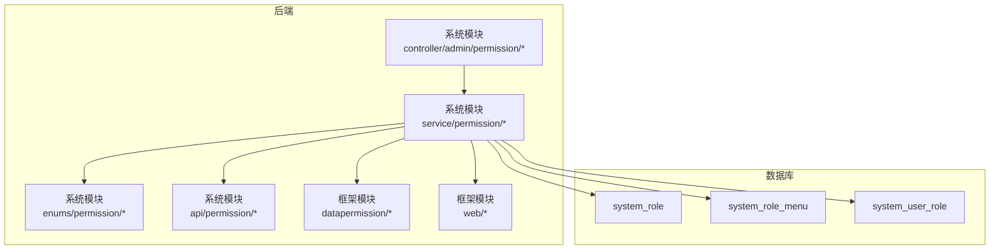
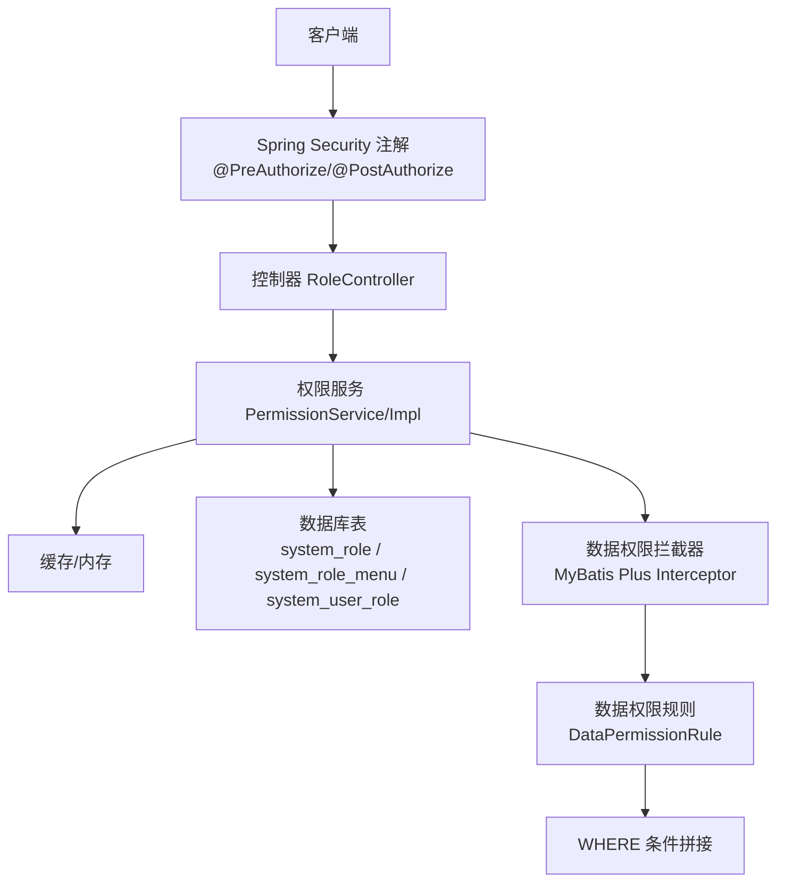
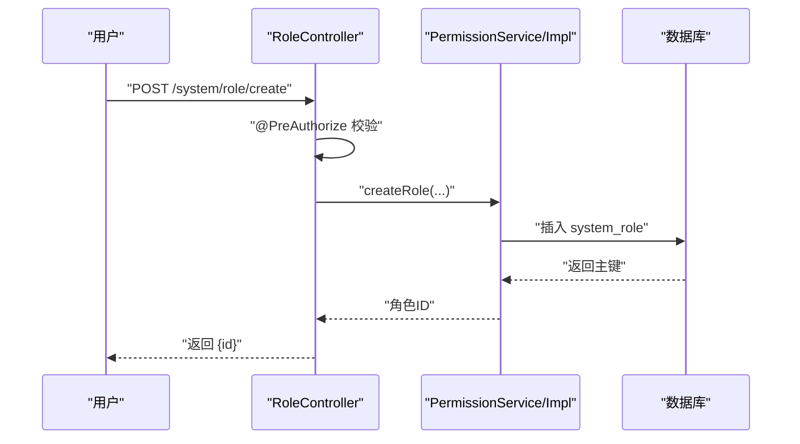
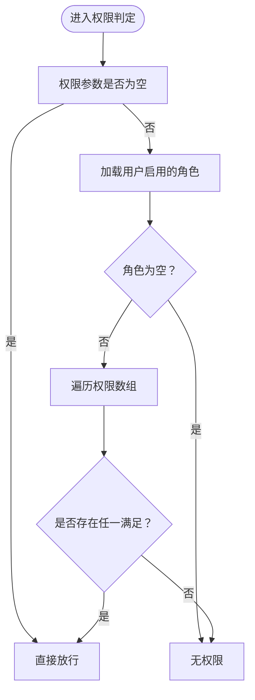
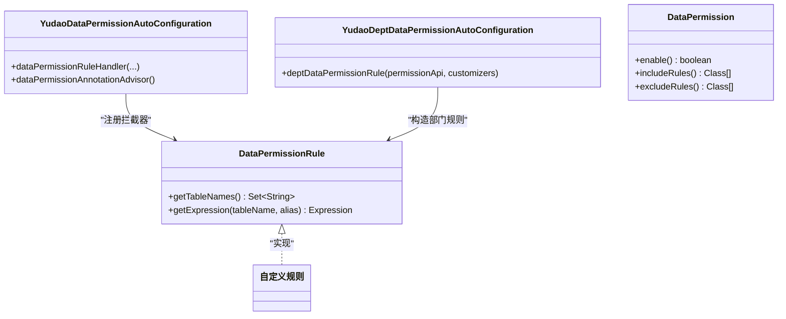
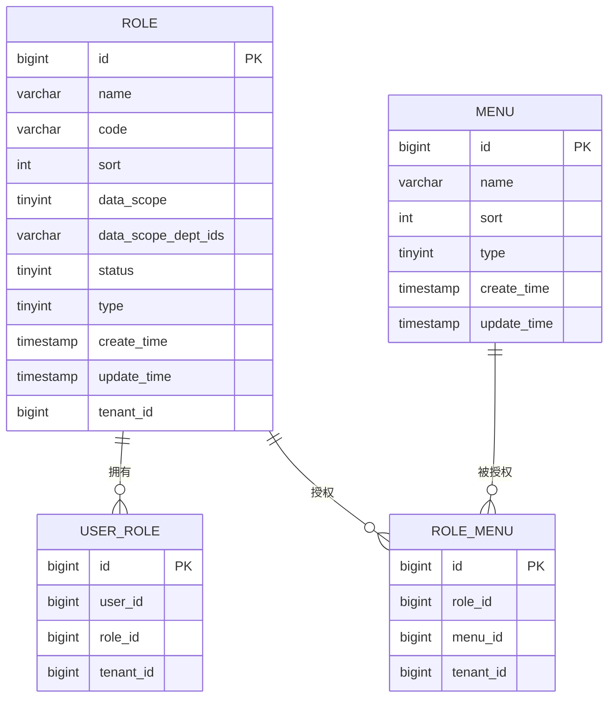
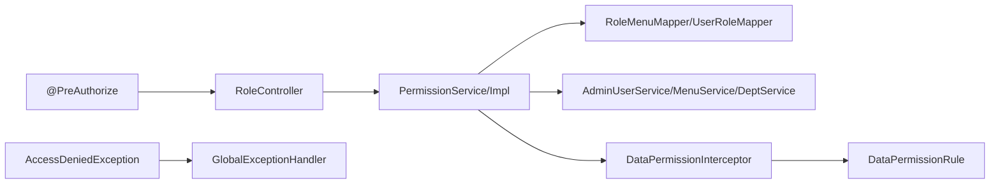

# 角色权限管理

<cite>
**本文引用的文件**
- [RoleController.java](file://yudao-module-system/src/main/java/cn/iocoder/yudao/module/system/controller/admin/permission/RoleController.java)
- [PermissionService.java](file://yudao-module-system/src/main/java/cn/iocoder/yudao/module/system/service/permission/PermissionService.java)
- [PermissionServiceImpl.java](file://yudao-module-system/src/main/java/cn/iocoder/yudao/module/system/service/permission/PermissionServiceImpl.java)
- [RoleApiImpl.java](file://yudao-module-system/src/main/java/cn/iocoder/yudao/module/system/api/permission/RoleApiImpl.java)
- [RoleCodeEnum.java](file://yudao-module-system/src/main/java/cn/iocoder/yudao/module/system/enums/permission/RoleCodeEnum.java)
- [MenuTypeEnum.java](file://yudao-module-system/src/main/java/cn/iocoder/yudao/module/system/enums/permission/MenuTypeEnum.java)
- [PermissionAssignRoleMenuReqVO.java](file://yudao-module-system/src/main/java/cn/iocoder/yudao/module/system/controller/admin/permission/vo/permission/PermissionAssignRoleMenuReqVO.java)
- [PermissionAssignUserRoleReqVO.java](file://yudao-module-system/src/main/java/cn/iocoder/yudao/module/system/controller/admin/permission/vo/permission/PermissionAssignUserRoleReqVO.java)
- [RolePageReqVO.java](file://yudao-module-system/src/main/java/cn/iocoder/yudao/module/system/controller/admin/permission/vo/role/RolePageReqVO.java)
- [YudaoDataPermissionAutoConfiguration.java](file://yudao-framework/yudao-spring-boot-starter-biz-data-permission/src/main/java/cn/iocoder/yudao/framework/datapermission/config/YudaoDataPermissionAutoConfiguration.java)
- [YudaoDeptDataPermissionAutoConfiguration.java](file://yudao-framework/yudao-spring-boot-starter-biz-data-permission/src/main/java/cn/iocoder/yudao/framework/datapermission/config/YudaoDeptDataPermissionAutoConfiguration.java)
- [DataPermission.java](file://yudao-framework/yudao-spring-boot-starter-biz-data-permission/src/main/java/cn/iocoder/yudao/framework/datapermission/core/annotation/DataPermission.java)
- [DataPermissionRule.java](file://yudao-framework/yudao-spring-boot-starter-biz-data-permission/src/main/java/cn/iocoder/yudao/framework/datapermission/core/rule/DataPermissionRule.java)
- [GlobalExceptionHandler.java](file://yudao-framework/yudao-spring-boot-starter-web/src/main/java/cn/iocoder/yudao/framework/web/core/handler/GlobalExceptionHandler.java)
- [create_tables.sql](file://yudao-module-system/src/test/resources/sql/create_tables.sql)
</cite>

## 目录
1. [简介](#简介)
2. [项目结构](#项目结构)
3. [核心组件](#核心组件)
4. [架构总览](#架构总览)
5. [详细组件分析](#详细组件分析)
6. [依赖分析](#依赖分析)
7. [性能考虑](#性能考虑)
8. [故障排查指南](#故障排查指南)
9. [结论](#结论)
10. [附录](#附录)

## 简介
本指南围绕角色权限管理功能展开，系统性讲解角色与权限体系设计、角色管理、权限分配、菜单授权、按钮权限控制以及数据权限管理。文档同时阐述基于角色的访问控制（RBAC）原理、权限表达式解析与动态权限判断机制，提供完整的 API 接口说明与集成要点，帮助开发者快速落地角色权限模块。

## 项目结构
角色权限相关能力主要分布在以下模块与包：
- 后端模块
  - 系统模块（system）：角色与权限的业务实现、控制器、VO 定义、枚举与数据库表结构
  - 框架模块（framework）：数据权限自动装配、注解与规则接口
- 前端模块（ui）
  - 基于 Vue3 的管理端界面，提供角色与权限的可视化操作入口

图表来源
- [RoleController.java:33-111](file://yudao-module-system/src/main/java/cn/iocoder/yudao/module/system/controller/admin/permission/RoleController.java#L33-L111)
- [PermissionService.java:17-146](file://yudao-module-system/src/main/java/cn/iocoder/yudao/module/system/service/permission/PermissionService.java#L17-L146)
- [YudaoDataPermissionAutoConfiguration.java:29-46](file://yudao-framework/yudao-spring-boot-starter-biz-data-permission/src/main/java/cn/iocoder/yudao/framework/datapermission/config/YudaoDataPermissionAutoConfiguration.java#L29-L46)
- [create_tables.sql:37-67](file://yudao-module-system/src/test/resources/sql/create_tables.sql#L37-L67)

章节来源
- [RoleController.java:33-111](file://yudao-module-system/src/main/java/cn/iocoder/yudao/module/system/controller/admin/permission/RoleController.java#L33-L111)
- [create_tables.sql:37-67](file://yudao-module-system/src/test/resources/sql/create_tables.sql#L37-L67)

## 核心组件
- 角色控制器（RoleController）
  - 提供角色的增删改查、分页、导出、简化列表等接口，配合 Spring Security 注解进行权限拦截
- 权限服务接口与实现（PermissionService/PermissionServiceImpl）
  - 统一封装用户-角色、角色-菜单、角色-数据范围等权限判定与授权逻辑
- 角色 API（RoleApiImpl）
  - 对外暴露角色查询与校验能力，便于其他模块调用
- 数据权限框架（YudaoDataPermissionAutoConfiguration、DataPermission 注解、DataPermissionRule）
  - 自动装配数据权限拦截器，支持注解式启用/排除规则，按表生成 WHERE 条件
- 枚举与 VO
  - 角色标识、菜单类型、权限赋权请求 VO、角色分页 VO 等

章节来源
- [RoleController.java:33-111](file://yudao-module-system/src/main/java/cn/iocoder/yudao/module/system/controller/admin/permission/RoleController.java#L33-L111)
- [PermissionService.java:17-146](file://yudao-module-system/src/main/java/cn/iocoder/yudao/module/system/service/permission/PermissionService.java#L17-L146)
- [PermissionServiceImpl.java:44-80](file://yudao-module-system/src/main/java/cn/iocoder/yudao/module/system/service/permission/PermissionServiceImpl.java#L44-L80)
- [RoleApiImpl.java:18-40](file://yudao-module-system/src/main/java/cn/iocoder/yudao/module/system/api/permission/RoleApiImpl.java#L18-L40)
- [RoleCodeEnum.java:10-32](file://yudao-module-system/src/main/java/cn/iocoder/yudao/module/system/enums/permission/RoleCodeEnum.java#L10-L32)
- [MenuTypeEnum.java:11-25](file://yudao-module-system/src/main/java/cn/iocoder/yudao/module/system/enums/permission/MenuTypeEnum.java#L11-L25)
- [PermissionAssignRoleMenuReqVO.java:10-21](file://yudao-module-system/src/main/java/cn/iocoder/yudao/module/system/controller/admin/permission/vo/permission/PermissionAssignRoleMenuReqVO.java#L10-L21)
- [PermissionAssignUserRoleReqVO.java:10-21](file://yudao-module-system/src/main/java/cn/iocoder/yudao/module/system/controller/admin/permission/vo/permission/PermissionAssignUserRoleReqVO.java#L10-L21)
- [RolePageReqVO.java:13-31](file://yudao-module-system/src/main/java/cn/iocoder/yudao/module/system/controller/admin/permission/vo/role/RolePageReqVO.java#L13-31)
- [YudaoDataPermissionAutoConfiguration.java:29-46](file://yudao-framework/yudao-spring-boot-starter-biz-data-permission/src/main/java/cn/iocoder/yudao/framework/datapermission/config/YudaoDataPermissionAutoConfiguration.java#L29-L46)
- [DataPermission.java:13-35](file://yudao-framework/yudao-spring-boot-starter-biz-data-permission/src/main/java/cn/iocoder/yudao/framework/datapermission/core/annotation/DataPermission.java#L13-L35)
- [DataPermissionRule.java:15-36](file://yudao-framework/yudao-spring-boot-starter-biz-data-permission/src/main/java/cn/iocoder/yudao/framework/datapermission/core/rule/DataPermissionRule.java#L15-L36)

## 架构总览
角色权限管理采用 RBAC 模型，结合 Spring Security 注解与数据权限拦截器，形成“接口层-服务层-数据层”的清晰分层。权限判定贯穿接口拦截、运行时判定与 SQL 层过滤三条路径。

图表来源
- [RoleController.java:42-111](file://yudao-module-system/src/main/java/cn/iocoder/yudao/module/system/controller/admin/permission/RoleController.java#L42-L111)
- [PermissionService.java:17-146](file://yudao-module-system/src/main/java/cn/iocoder/yudao/module/system/service/permission/PermissionService.java#L17-L146)
- [YudaoDataPermissionAutoConfiguration.java:29-46](file://yudao-framework/yudao-spring-boot-starter-biz-data-permission/src/main/java/cn/iocoder/yudao/framework/datapermission/config/YudaoDataPermissionAutoConfiguration.java#L29-L46)
- [DataPermissionRule.java:15-36](file://yudao-framework/yudao-spring-boot-starter-biz-data-permission/src/main/java/cn/iocoder/yudao/framework/datapermission/core/rule/DataPermissionRule.java#L15-L36)

## 详细组件分析

### 角色控制器（RoleController）
- 主要职责
  - 提供角色的创建、更新、删除、批量删除、详情查询、分页查询、简化列表、Excel 导出等接口
  - 使用 @PreAuthorize 注解对每个接口进行权限校验，统一由安全框架拦截
- 关键接口
  - POST /system/role/create：创建角色
  - PUT /system/role/update：更新角色
  - DELETE /system/role/delete：删除角色
  - DELETE /system/role/delete-list：批量删除角色
  - GET /system/role/get：获取角色详情
  - GET /system/role/page：分页查询角色
  - GET /system/role/list-all-simple：获取启用中的角色列表
  - GET /system/role/export-excel：导出角色 Excel

图表来源
- [RoleController.java:42-47](file://yudao-module-system/src/main/java/cn/iocoder/yudao/module/system/controller/admin/permission/RoleController.java#L42-L47)
- [PermissionService.java:17-146](file://yudao-module-system/src/main/java/cn/iocoder/yudao/module/system/service/permission/PermissionService.java#L17-L146)

章节来源
- [RoleController.java:33-111](file://yudao-module-system/src/main/java/cn/iocoder/yudao/module/system/controller/admin/permission/RoleController.java#L33-L111)

### 权限服务接口与实现（PermissionService/PermissionServiceImpl）
- 权限判定
  - hasAnyPermissions(userId, permissions...)：任一权限满足即通过
  - hasAnyRoles(userId, roles...)：任一角色满足即通过
- 角色-菜单
  - assignRoleMenu(roleId, menuIds)：设置角色菜单授权
  - getRoleMenuListByRoleId(roleId/Collection)：查询角色拥有的菜单集合
  - processRoleDeleted/processMenuDeleted：删除关联授权数据
- 用户-角色
  - assignUserRole(userId, roleIds)：赋予用户角色
  - getUserRoleIdListByUserId(userId/FromCache)：查询用户角色集合
  - processUserDeleted：删除关联授权数据
- 角色-数据范围
  - assignRoleDataScope(roleId, dataScope, dataScopeDeptIds)：设置角色数据权限范围
  - getDeptDataPermission(userId)：获取用户部门数据权限

图表来源
- [PermissionServiceImpl.java:62-80](file://yudao-module-system/src/main/java/cn/iocoder/yudao/module/system/service/permission/PermissionServiceImpl.java#L62-L80)

章节来源
- [PermissionService.java:17-146](file://yudao-module-system/src/main/java/cn/iocoder/yudao/module/system/service/permission/PermissionService.java#L17-L146)
- [PermissionServiceImpl.java:44-80](file://yudao-module-system/src/main/java/cn/iocoder/yudao/module/system/service/permission/PermissionServiceImpl.java#L44-L80)

### 角色 API（RoleApiImpl）
- 提供对外角色查询与校验能力，内部委托 RoleService 完成具体逻辑
- 支持根据 ID 或 ID 集合获取角色信息，用于跨模块复用

章节来源
- [RoleApiImpl.java:18-40](file://yudao-module-system/src/main/java/cn/iocoder/yudao/module/system/api/permission/RoleApiImpl.java#L18-L40)

### 数据权限框架（自动装配、注解与规则）
- 自动装配
  - YudaoDataPermissionAutoConfiguration：注册数据权限拦截器与 Advisor，确保拦截器优先级在分页之前
  - YudaoDeptDataPermissionAutoConfiguration：基于部门维度的数据权限规则装配
- 注解 DataPermission
  - enable：是否启用数据权限
  - includeRules/excludeRules：显式包含/排除规则，优先级控制
- 规则接口 DataPermissionRule
  - getTableNames：返回生效表名集合
  - getExpression：按表名与别名生成 WHERE 表达式

图表来源
- [YudaoDataPermissionAutoConfiguration.java:29-46](file://yudao-framework/yudao-spring-boot-starter-biz-data-permission/src/main/java/cn/iocoder/yudao/framework/datapermission/config/YudaoDataPermissionAutoConfiguration.java#L29-L46)
- [YudaoDeptDataPermissionAutoConfiguration.java:24-34](file://yudao-framework/yudao-spring-boot-starter-biz-data-permission/src/main/java/cn/iocoder/yudao/framework/datapermission/config/YudaoDeptDataPermissionAutoConfiguration.java#L24-L34)
- [DataPermission.java:13-35](file://yudao-framework/yudao-spring-boot-starter-biz-data-permission/src/main/java/cn/iocoder/yudao/framework/datapermission/core/annotation/DataPermission.java#L13-L35)
- [DataPermissionRule.java:15-36](file://yudao-framework/yudao-spring-boot-starter-biz-data-permission/src/main/java/cn/iocoder/yudao/framework/datapermission/core/rule/DataPermissionRule.java#L15-L36)

章节来源
- [YudaoDataPermissionAutoConfiguration.java:29-46](file://yudao-framework/yudao-spring-boot-starter-biz-data-permission/src/main/java/cn/iocoder/yudao/framework/datapermission/config/YudaoDataPermissionAutoConfiguration.java#L29-L46)
- [YudaoDeptDataPermissionAutoConfiguration.java:24-34](file://yudao-framework/yudao-spring-boot-starter-biz-data-permission/src/main/java/cn/iocoder/yudao/framework/datapermission/config/YudaoDeptDataPermissionAutoConfiguration.java#L24-L34)
- [DataPermission.java:13-35](file://yudao-framework/yudao-spring-boot-starter-biz-data-permission/src/main/java/cn/iocoder/yudao/framework/datapermission/core/annotation/DataPermission.java#L13-L35)
- [DataPermissionRule.java:15-36](file://yudao-framework/yudao-spring-boot-starter-biz-data-permission/src/main/java/cn/iocoder/yudao/framework/datapermission/core/rule/DataPermissionRule.java#L15-L36)

### 角色与用户、菜单、数据范围的关系
- 角色-用户：system_user_role 记录用户与角色的多对多关系
- 角色-菜单：system_role_menu 记录角色与菜单的多对多关系
- 角色-数据范围：system_role 记录 data_scope 与 data_scope_dept_ids 字段，用于限定数据可见范围

图表来源
- [create_tables.sql:37-67](file://yudao-module-system/src/test/resources/sql/create_tables.sql#L37-L67)

章节来源
- [create_tables.sql:37-67](file://yudao-module-system/src/test/resources/sql/create_tables.sql#L37-L67)

### 菜单类型与按钮权限控制
- 菜单类型枚举：目录、菜单、按钮三类，用于前端渲染与权限控制
- 按钮权限通常以“权限字符串”形式存在，配合 @PreAuthorize 在接口层进行校验

章节来源
- [MenuTypeEnum.java:11-25](file://yudao-module-system/src/main/java/cn/iocoder/yudao/module/system/enums/permission/MenuTypeEnum.java#L11-L25)

### 角色标识与超级管理员
- 角色标识枚举包含超级管理员、租户管理员等标识，便于快速识别与特殊处理

章节来源
- [RoleCodeEnum.java:10-32](file://yudao-module-system/src/main/java/cn/iocoder/yudao/module/system/enums/permission/RoleCodeEnum.java#L10-L32)

## 依赖分析
- 控制器依赖服务层，服务层依赖 DAO/Redis 与业务服务（用户、菜单、部门），并通过数据权限拦截器在 SQL 层面施加过滤
- 数据权限自动装配确保拦截器优先级，避免与分页插件冲突
- Spring Security 注解负责接口级权限拦截，未授权访问由全局异常处理器统一返回

图表来源
- [RoleController.java:42-111](file://yudao-module-system/src/main/java/cn/iocoder/yudao/module/system/controller/admin/permission/RoleController.java#L42-L111)
- [PermissionService.java:17-146](file://yudao-module-system/src/main/java/cn/iocoder/yudao/module/system/service/permission/PermissionService.java#L17-L146)
- [YudaoDataPermissionAutoConfiguration.java:29-46](file://yudao-framework/yudao-spring-boot-starter-biz-data-permission/src/main/java/cn/iocoder/yudao/framework/datapermission/config/YudaoDataPermissionAutoConfiguration.java#L29-L46)
- [GlobalExceptionHandler.java:270-290](file://yudao-framework/yudao-spring-boot-starter-web/src/main/java/cn/iocoder/yudao/framework/web/core/handler/GlobalExceptionHandler.java#L270-L290)

章节来源
- [YudaoDataPermissionAutoConfiguration.java:29-46](file://yudao-framework/yudao-spring-boot-starter-biz-data-permission/src/main/java/cn/iocoder/yudao/framework/datapermission/config/YudaoDataPermissionAutoConfiguration.java#L29-L46)
- [GlobalExceptionHandler.java:270-290](file://yudao-framework/yudao-spring-boot-starter-web/src/main/java/cn/iocoder/yudao/framework/web/core/handler/GlobalExceptionHandler.java#L270-L290)

## 性能考虑
- 缓存策略：用户角色集合建议从缓存读取，减少数据库频繁查询
- 批量操作：角色-菜单、角色-用户授权采用批量写入，降低事务开销
- 数据权限：尽量缩小 includeRules/excludeRules 范围，避免全表扫描
- 分页与排序：导出场景关闭分页，避免大结果集导致内存压力

## 故障排查指南
- 接口返回 403
  - 检查控制器上的 @PreAuthorize 权限表达式是否正确
  - 查看全局异常处理器对 AccessDeniedException 的统一返回
- 数据越权
  - 确认数据权限注解是否启用，规则是否正确配置
  - 核对 getTableNames 与 getExpression 的实现是否覆盖目标表
- 角色/菜单授权无效
  - 确认 assignRoleMenu/assignUserRole 是否成功提交事务
  - 检查缓存是否及时刷新

章节来源
- [GlobalExceptionHandler.java:270-290](file://yudao-framework/yudao-spring-boot-starter-web/src/main/java/cn/iocoder/yudao/framework/web/core/handler/GlobalExceptionHandler.java#L270-L290)

## 结论
本角色权限体系以 RBAC 为核心，结合 Spring Security 注解与数据权限拦截器，实现了接口级、运行时与 SQL 层的多维权限控制。通过清晰的分层与自动装配机制，既保证了扩展性，也降低了接入成本。建议在实际项目中遵循“最小权限原则”，合理划分角色与权限，并充分利用数据权限规则实现精细化数据隔离。

## 附录

### API 接口清单与说明
- 创建角色
  - 方法：POST
  - 路径：/system/role/create
  - 权限：system:role:create
  - 请求体：RoleSaveReqVO（字段参考控制器内定义）
  - 返回：{ id }
- 更新角色
  - 方法：PUT
  - 路径：/system/role/update
  - 权限：system:role:update
  - 请求体：RoleSaveReqVO
  - 返回：true
- 删除角色
  - 方法：DELETE
  - 路径：/system/role/delete
  - 权限：system:role:delete
  - 查询参数：id
  - 返回：true
- 批量删除角色
  - 方法：DELETE
  - 路径：/system/role/delete-list
  - 权限：system:role:delete
  - 查询参数：ids
  - 返回：true
- 获取角色详情
  - 方法：GET
  - 路径：/system/role/get
  - 权限：system:role:query
  - 查询参数：id
  - 返回：RoleRespVO
- 获取角色分页
  - 方法：GET
  - 路径：/system/role/page
  - 权限：system:role:query
  - 查询参数：RolePageReqVO（name/code/status/createTime）
  - 返回：分页结果（RoleRespVO 列表）
- 获取角色简化列表
  - 方法：GET
  - 路径：/system/role/list-all-simple
  - 权限：system:role:query
  - 返回：启用中的角色列表（RoleRespVO）
- 导出角色 Excel
  - 方法：GET
  - 路径：/system/role/export-excel
  - 权限：system:role:export
  - 查询参数：RolePageReqVO（pageSize 设为不限）
  - 返回：Excel 文件流

章节来源
- [RoleController.java:42-111](file://yudao-module-system/src/main/java/cn/iocoder/yudao/module/system/controller/admin/permission/RoleController.java#L42-L111)
- [RolePageReqVO.java:13-31](file://yudao-module-system/src/main/java/cn/iocoder/yudao/module/system/controller/admin/permission/vo/role/RolePageReqVO.java#L13-L31)

### 角色授权相关 VO
- 赋予角色菜单
  - 类：PermissionAssignRoleMenuReqVO
  - 字段：roleId（必填）、menuIds（Set<Long>）
- 赋予用户角色
  - 类：PermissionAssignUserRoleReqVO
  - 字段：userId（必填）、roleIds（Set<Long>）

章节来源
- [PermissionAssignRoleMenuReqVO.java:10-21](file://yudao-module-system/src/main/java/cn/iocoder/yudao/module/system/controller/admin/permission/vo/permission/PermissionAssignRoleMenuReqVO.java#L10-L21)
- [PermissionAssignUserRoleReqVO.java:10-21](file://yudao-module-system/src/main/java/cn/iocoder/yudao/module/system/controller/admin/permission/vo/permission/PermissionAssignUserRoleReqVO.java#L10-L21)

### 权限验证与集成要点
- Spring Security 注解
  - 使用 @PreAuthorize("@ss.hasPermission('...')") 对接口进行权限拦截
  - 使用 @PostAuthorize 对返回对象进行二次校验（如数据权限）
- 全局异常处理
  - AccessDeniedException 将统一返回 403 错误
- 数据权限注解
  - 在类或方法上使用 @DataPermission 控制规则生效范围
  - 通过 includeRules/excludeRules 精准控制规则优先级

章节来源
- [RoleController.java:42-111](file://yudao-module-system/src/main/java/cn/iocoder/yudao/module/system/controller/admin/permission/RoleController.java#L42-L111)
- [DataPermission.java:13-35](file://yudao-framework/yudao-spring-boot-starter-biz-data-permission/src/main/java/cn/iocoder/yudao/framework/datapermission/core/annotation/DataPermission.java#L13-L35)
- [GlobalExceptionHandler.java:270-290](file://yudao-framework/yudao-spring-boot-starter-web/src/main/java/cn/iocoder/yudao/framework/web/core/handler/GlobalExceptionHandler.java#L270-L290)