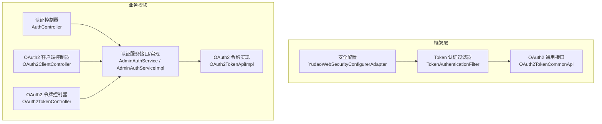
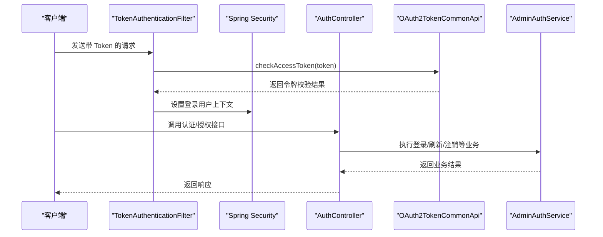
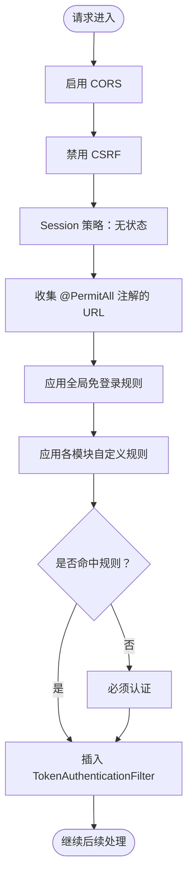
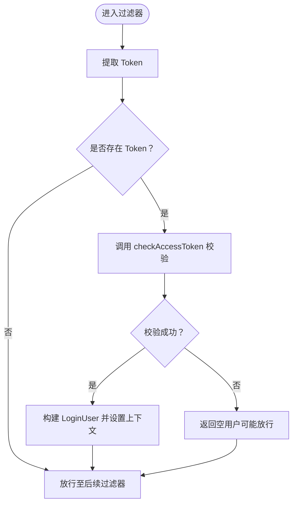
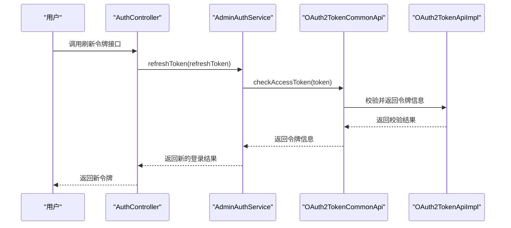
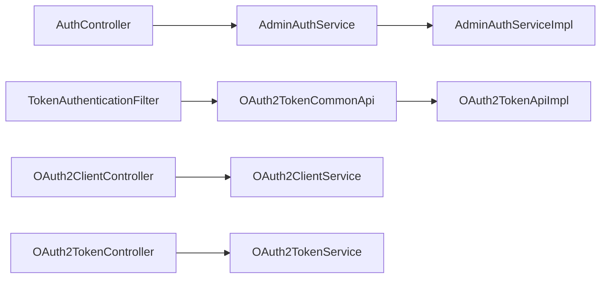

# 认证授权管理

<cite>
**本文引用的文件**
- [YudaoWebSecurityConfigurerAdapter.java](file://yudao-framework/yudao-spring-boot-starter-security/src/main/java/cn/iocoder/yudao/framework/security/config/YudaoWebSecurityConfigurerAdapter.java)
- [TokenAuthenticationFilter.java](file://yudao-framework/yudao-spring-boot-starter-security/src/main/java/cn/iocoder/yudao/framework/security/core/filter/TokenAuthenticationFilter.java)
- [AuthController.java](file://yudao-module-system/src/main/java/cn/iocoder/yudao/module/system/controller/admin/auth/AuthController.java)
- [OAuth2TokenController.java](file://yudao-module-system/src/main/java/cn/iocoder/yudao/module/system/controller/admin/oauth2/OAuth2TokenController.java)
- [OAuth2ClientController.java](file://yudao-module-system/src/main/java/cn/iocoder/yudao/module/system/controller/admin/oauth2/OAuth2ClientController.java)
- [SecurityConfiguration.java（基础设施模块）](file://yudao-module-infra/src/main/java/cn/iocoder/yudao/module/infra/framework/security/config/SecurityConfiguration.java)
- [SecurityConfiguration.java（报表模块）](file://yudao-module-report/src/main/java/cn/iocoder/yudao/module/report/framework/security/config/SecurityConfiguration.java)
- [AdminAuthService.java](file://yudao-module-system/src/main/java/cn/iocoder/yudao/module/system/service/auth/AdminAuthService.java)
- [AdminAuthServiceImpl.java](file://yudao-module-system/src/main/java/cn/iocoder/yudao/module/system/service/auth/AdminAuthServiceImpl.java)
- [OAuth2TokenCommonApi.java](file://yudao-framework/yudao-common/src/main/java/cn/iocoder/yudao/framework/common/biz/system/oauth2/OAuth2TokenCommonApi.java)
- [OAuth2TokenCommonApi 实现（系统模块）](file://yudao-module-system/src/main/java/cn/iocoder/yudao/module/system/api/oauth2/OAuth2TokenApiImpl.java)
- [OAuth2AccessTokenCheckRespDTO.java](file://yudao-framework/yudao-common/src/main/java/cn/iocoder/yudao/framework/common/biz/system/oauth2/dto/OAuth2AccessTokenCheckRespDTO.java)
- [OAuth2AccessTokenCreateReqDTO.java](file://yudao-framework/yudao-common/src/main/java/cn/iocoder/yudao/framework/common/biz/system/oauth2/dto/OAuth2AccessTokenCreateReqDTO.java)
- [OAuth2AccessTokenRespDTO.java](file://yudao-framework/yudao-common/src/main/java/cn/iocoder/yudao/framework/common/biz/system/oauth2/dto/OAuth2AccessTokenRespDTO.java)
</cite>

## 目录
1. [引言](#引言)
2. [项目结构](#项目结构)
3. [核心组件](#核心组件)
4. [架构总览](#架构总览)
5. [详细组件分析](#详细组件分析)
6. [依赖分析](#依赖分析)
7. [性能考量](#性能考量)
8. [故障排查指南](#故障排查指南)
9. [结论](#结论)
10. [附录](#附录)

## 引言
本指南围绕认证授权管理功能，系统性讲解用户认证体系与 OAuth2 开放平台集成。内容覆盖：
- 多种登录方式：用户名密码登录、手机验证码登录、社交登录（第三方授权码模式）、注册与重置密码
- OAuth2 客户端管理与令牌管理（分页查询、单/批量删除）
- JWT 令牌的生成、校验、刷新与注销机制及安全策略
- 完整 API 接口文档与调用示例路径
- 与 Spring Security 的集成：自定义认证过滤器、权限配置与安全拦截器

## 项目结构
认证授权相关能力由“框架层”和“业务模块”协同实现：
- 框架层提供安全配置、Token 过滤器、通用 OAuth2 令牌接口与 DTO
- 业务模块提供认证控制器、OAuth2 客户端与令牌控制器、认证服务实现

图表来源
- [YudaoWebSecurityConfigurerAdapter.java:110-153](file://yudao-framework/yudao-spring-boot-starter-security/src/main/java/cn/iocoder/yudao/framework/security/config/YudaoWebSecurityConfigurerAdapter.java#L110-L153)
- [TokenAuthenticationFilter.java:40-69](file://yudao-framework/yudao-spring-boot-starter-security/src/main/java/cn/iocoder/yudao/framework/security/core/filter/TokenAuthenticationFilter.java#L40-L69)
- [AuthController.java:66-176](file://yudao-module-system/src/main/java/cn/iocoder/yudao/module/system/controller/admin/auth/AuthController.java#L66-L176)
- [OAuth2ClientController.java:33-83](file://yudao-module-system/src/main/java/cn/iocoder/yudao/module/system/controller/admin/oauth2/OAuth2ClientController.java#L33-L83)
- [OAuth2TokenController.java:34-61](file://yudao-module-system/src/main/java/cn/iocoder/yudao/module/system/controller/admin/oauth2/OAuth2TokenController.java#L34-L61)
- [AdminAuthService.java](file://yudao-module-system/src/main/java/cn/iocoder/yudao/module/system/service/auth/AdminAuthService.java)
- [AdminAuthServiceImpl.java](file://yudao-module-system/src/main/java/cn/iocoder/yudao/module/system/service/auth/AdminAuthServiceImpl.java)
- [OAuth2TokenCommonApi.java](file://yudao-framework/yudao-common/src/main/java/cn/iocoder/yudao/framework/common/biz/system/oauth2/OAuth2TokenCommonApi.java)
- [OAuth2TokenApiImpl.java](file://yudao-module-system/src/main/java/cn/iocoder/yudao/module/system/api/oauth2/OAuth2TokenApiImpl.java)

章节来源
- [YudaoWebSecurityConfigurerAdapter.java:110-153](file://yudao-framework/yudao-spring-boot-starter-security/src/main/java/cn/iocoder/yudao/framework/security/config/YudaoWebSecurityConfigurerAdapter.java#L110-L153)
- [AuthController.java:66-176](file://yudao-module-system/src/main/java/cn/iocoder/yudao/module/system/controller/admin/auth/AuthController.java#L66-L176)

## 核心组件
- 安全配置适配器：统一配置 CORS、CSRF、Session、异常处理、URL 权限规则与过滤器链
- Token 认证过滤器：从请求中提取 Token，调用通用 OAuth2 接口校验，构建登录用户上下文
- 认证控制器：提供登录、登出、刷新令牌、发送短信验证码、社交授权跳转、社交登录、注册与重置密码等接口
- OAuth2 客户端与令牌控制器：提供客户端增删改查、分页查询与令牌删除（单/批量）
- 认证服务：封装登录、刷新、注销、短信验证码发送、社交登录等业务逻辑
- OAuth2 通用接口与实现：对外暴露令牌校验、创建、检查等能力

章节来源
- [YudaoWebSecurityConfigurerAdapter.java:46-90](file://yudao-framework/yudao-spring-boot-starter-security/src/main/java/cn/iocoder/yudao/framework/security/config/YudaoWebSecurityConfigurerAdapter.java#L46-L90)
- [TokenAuthenticationFilter.java:40-93](file://yudao-framework/yudao-spring-boot-starter-security/src/main/java/cn/iocoder/yudao/framework/security/core/filter/TokenAuthenticationFilter.java#L40-L93)
- [AuthController.java:66-176](file://yudao-module-system/src/main/java/cn/iocoder/yudao/module/system/controller/admin/auth/AuthController.java#L66-L176)
- [OAuth2ClientController.java:33-83](file://yudao-module-system/src/main/java/cn/iocoder/yudao/module/system/controller/admin/oauth2/OAuth2ClientController.java#L33-L83)
- [OAuth2TokenController.java:34-61](file://yudao-module-system/src/main/java/cn/iocoder/yudao/module/system/controller/admin/oauth2/OAuth2TokenController.java#L34-L61)
- [AdminAuthService.java](file://yudao-module-system/src/main/java/cn/iocoder/yudao/module/system/service/auth/AdminAuthService.java)
- [OAuth2TokenCommonApi.java](file://yudao-framework/yudao-common/src/main/java/cn/iocoder/yudao/framework/common/biz/system/oauth2/OAuth2TokenCommonApi.java)

## 架构总览
整体采用“无状态 Token + Spring Security 拦截”的架构：
- 请求进入后，先由 TokenAuthenticationFilter 校验 Token 并设置登录上下文
- 再根据 URL 规则决定是否需要认证或放行
- 认证控制器与 OAuth2 控制器提供业务接口，认证服务负责具体业务逻辑

图表来源
- [TokenAuthenticationFilter.java:40-93](file://yudao-framework/yudao-spring-boot-starter-security/src/main/java/cn/iocoder/yudao/framework/security/core/filter/TokenAuthenticationFilter.java#L40-L93)
- [OAuth2TokenCommonApi.java](file://yudao-framework/yudao-common/src/main/java/cn/iocoder/yudao/framework/common/biz/system/oauth2/OAuth2TokenCommonApi.java)
- [AuthController.java:66-176](file://yudao-module-system/src/main/java/cn/iocoder/yudao/module/system/controller/admin/auth/AuthController.java#L66-L176)
- [AdminAuthServiceImpl.java](file://yudao-module-system/src/main/java/cn/iocoder/yudao/module/system/service/auth/AdminAuthServiceImpl.java)

## 详细组件分析

### 安全配置与拦截链
- 禁用 CSRF、Session，开启 CORS
- 全局免登录 URL：静态资源、注解 @PermitAll 的接口、配置项 yudao.security.permit-all-urls
- 项目自定义权限规则：通过 AuthorizeRequestsCustomizer 注入
- 默认兜底规则：未命中上述规则的请求必须认证
- 在 UsernamePasswordAuthenticationFilter 之前插入 TokenAuthenticationFilter

图表来源
- [YudaoWebSecurityConfigurerAdapter.java:110-153](file://yudao-framework/yudao-spring-boot-starter-security/src/main/java/cn/iocoder/yudao/framework/security/config/YudaoWebSecurityConfigurerAdapter.java#L110-L153)
- [YudaoWebSecurityConfigurerAdapter.java:159-219](file://yudao-framework/yudao-spring-boot-starter-security/src/main/java/cn/iocoder/yudao/framework/security/config/YudaoWebSecurityConfigurerAdapter.java#L159-L219)

章节来源
- [YudaoWebSecurityConfigurerAdapter.java:110-153](file://yudao-framework/yudao-spring-boot-starter-security/src/main/java/cn/iocoder/yudao/framework/security/config/YudaoWebSecurityConfigurerAdapter.java#L110-L153)
- [SecurityConfiguration.java（基础设施模块）:15-36](file://yudao-module-infra/src/main/java/cn/iocoder/yudao/module/infra/framework/security/config/SecurityConfiguration.java#L15-L36)
- [SecurityConfiguration.java（报表模块）:15-31](file://yudao-module-report/src/main/java/cn/iocoder/yudao/module/report/framework/security/config/SecurityConfiguration.java#L15-L31)

### Token 认证过滤器
- 从请求头或参数中提取 Token
- 调用 OAuth2TokenCommonApi.checkAccessToken 校验令牌
- 若校验通过，构建 LoginUser 并写入安全上下文；若失败，允许后续规则处理（如放行）
- 支持模拟登录（开发调试），生产需关闭

图表来源
- [TokenAuthenticationFilter.java:40-93](file://yudao-framework/yudao-spring-boot-starter-security/src/main/java/cn/iocoder/yudao/framework/security/core/filter/TokenAuthenticationFilter.java#L40-L93)

章节来源
- [TokenAuthenticationFilter.java:40-117](file://yudao-framework/yudao-spring-boot-starter-security/src/main/java/cn/iocoder/yudao/framework/security/core/filter/TokenAuthenticationFilter.java#L40-L117)

### 认证控制器与接口
- 用户名密码登录：POST /system/auth/login
- 短信验证码登录：POST /system/auth/sms-login
- 发送短信验证码：POST /system/auth/send-sms-code
- 刷新令牌：GET /system/auth/refresh-token?refreshToken=...
- 登出：POST /system/auth/logout
- 获取权限信息：GET /system/auth/get-permission-info
- 注册：POST /system/auth/register
- 重置密码：POST /system/auth/reset-password
- 社交授权跳转：GET /system/auth/social-auth-redirect?type=&redirectUri=
- 社交快捷登录：POST /system/auth/social-login

章节来源
- [AuthController.java:66-176](file://yudao-module-system/src/main/java/cn/iocoder/yudao/module/system/controller/admin/auth/AuthController.java#L66-L176)

### OAuth2 客户端与令牌管理
- 创建客户端：POST /system/oauth2-client/create
- 更新客户端：PUT /system/oauth2-client/update
- 删除客户端：DELETE /system/oauth2-client/delete?id=
- 批量删除客户端：DELETE /system/oauth2-client/delete-list?ids=
- 查询客户端：GET /system/oauth2-client/get?id=
- 分页查询客户端：GET /system/oauth2-client/page
- 获得访问令牌分页：GET /system/oauth2-token/page
- 删除访问令牌：DELETE /system/oauth2-token/delete?accessToken=
- 批量删除访问令牌：DELETE /system/oauth2-token/delete-list?accessTokens=

章节来源
- [OAuth2ClientController.java:33-83](file://yudao-module-system/src/main/java/cn/iocoder/yudao/module/system/controller/admin/oauth2/OAuth2ClientController.java#L33-L83)
- [OAuth2TokenController.java:34-61](file://yudao-module-system/src/main/java/cn/iocoder/yudao/module/system/controller/admin/oauth2/OAuth2TokenController.java#L34-L61)

### OAuth2 令牌校验与刷新流程
- 令牌校验：TokenAuthenticationFilter 调用 OAuth2TokenCommonApi.checkAccessToken
- 令牌刷新：AuthController.refreshToken 调用认证服务刷新
- 令牌注销：AuthController.logout 或 OAuth2TokenController.delete/delete-list 调用认证服务执行注销

图表来源
- [AuthController.java:85-91](file://yudao-module-system/src/main/java/cn/iocoder/yudao/module/system/controller/admin/auth/AuthController.java#L85-L91)
- [AdminAuthServiceImpl.java](file://yudao-module-system/src/main/java/cn/iocoder/yudao/module/system/service/auth/AdminAuthServiceImpl.java)
- [OAuth2TokenCommonApi.java](file://yudao-framework/yudao-common/src/main/java/cn/iocoder/yudao/framework/common/biz/system/oauth2/OAuth2TokenCommonApi.java)
- [OAuth2TokenApiImpl.java](file://yudao-module-system/src/main/java/cn/iocoder/yudao/module/system/api/oauth2/OAuth2TokenApiImpl.java)

## 依赖分析
- 认证控制器依赖认证服务接口，认证服务实现负责具体业务
- TokenAuthenticationFilter 依赖 OAuth2TokenCommonApi 进行令牌校验
- OAuth2 客户端与令牌控制器分别依赖对应的服务接口
- 各模块可通过 AuthorizeRequestsCustomizer 扩展免登录规则

图表来源
- [AuthController.java:66-176](file://yudao-module-system/src/main/java/cn/iocoder/yudao/module/system/controller/admin/auth/AuthController.java#L66-L176)
- [AdminAuthService.java](file://yudao-module-system/src/main/java/cn/iocoder/yudao/module/system/service/auth/AdminAuthService.java)
- [AdminAuthServiceImpl.java](file://yudao-module-system/src/main/java/cn/iocoder/yudao/module/system/service/auth/AdminAuthServiceImpl.java)
- [TokenAuthenticationFilter.java:38](file://yudao-framework/yudao-spring-boot-starter-security/src/main/java/cn/iocoder/yudao/framework/security/core/filter/TokenAuthenticationFilter.java#L38)
- [OAuth2TokenCommonApi.java](file://yudao-framework/yudao-common/src/main/java/cn/iocoder/yudao/framework/common/biz/system/oauth2/OAuth2TokenCommonApi.java)
- [OAuth2TokenApiImpl.java](file://yudao-module-system/src/main/java/cn/iocoder/yudao/module/system/api/oauth2/OAuth2TokenApiImpl.java)
- [OAuth2ClientController.java:33-83](file://yudao-module-system/src/main/java/cn/iocoder/yudao/module/system/controller/admin/oauth2/OAuth2ClientController.java#L33-L83)
- [OAuth2TokenController.java:34-61](file://yudao-module-system/src/main/java/cn/iocoder/yudao/module/system/controller/admin/oauth2/OAuth2TokenController.java#L34-L61)

章节来源
- [YudaoWebSecurityConfigurerAdapter.java:77-78](file://yudao-framework/yudao-spring-boot-starter-security/src/main/java/cn/iocoder/yudao/framework/security/config/YudaoWebSecurityConfigurerAdapter.java#L77-L78)
- [SecurityConfiguration.java（基础设施模块）:15-36](file://yudao-module-infra/src/main/java/cn/iocoder/yudao/module/infra/framework/security/config/SecurityConfiguration.java#L15-L36)
- [SecurityConfiguration.java（报表模块）:15-31](file://yudao-module-report/src/main/java/cn/iocoder/yudao/module/report/framework/security/config/SecurityConfiguration.java#L15-L31)

## 性能考量
- 无状态会话：基于 Token，避免服务器端 Session 存储，降低扩展性压力
- 过滤器链轻量化：仅在必要时进行 Token 校验，减少无效计算
- 缓存与限流：短信登录可结合限流策略（如按手机号维度）控制刷验证码频率
- 令牌有效期：合理设置过期时间与刷新窗口，平衡安全性与用户体验

## 故障排查指南
- Token 校验失败
  - 检查请求头或参数中的 Token 是否正确传递
  - 确认 OAuth2TokenCommonApi.checkAccessToken 返回是否为空或抛出异常
  - 开发环境可启用模拟登录以便快速定位问题
- 权限不足
  - 确认用户类型与请求路径是否匹配（WebSocket 等特殊路径除外）
  - 检查 @PreAuthorize 权限注解与用户角色/权限是否一致
- 登出与注销
  - 使用 /system/auth/logout 或 /system/oauth2-token/delete* 接口触发注销
  - 确保认证服务实现中正确处理注销逻辑

章节来源
- [TokenAuthenticationFilter.java:71-93](file://yudao-framework/yudao-spring-boot-starter-security/src/main/java/cn/iocoder/yudao/framework/security/core/filter/TokenAuthenticationFilter.java#L71-L93)
- [AuthController.java:73-83](file://yudao-module-system/src/main/java/cn/iocoder/yudao/module/system/controller/admin/auth/AuthController.java#L73-L83)
- [OAuth2TokenController.java:42-59](file://yudao-module-system/src/main/java/cn/iocoder/yudao/module/system/controller/admin/oauth2/OAuth2TokenController.java#L42-L59)

## 结论
本项目通过“无状态 Token + Spring Security 拦截”的方式实现了完善的认证授权体系，支持多种登录方式与 OAuth2 客户端/令牌管理。配合灵活的权限规则与安全过滤器，既满足多场景需求，又便于扩展与维护。

## 附录

### API 接口清单与说明

- 认证相关
  - POST /system/auth/login
    - 说明：用户名密码登录
    - 参数：见请求体对象
    - 返回：登录结果对象
    - 示例路径：[AuthController.java:66-71](file://yudao-module-system/src/main/java/cn/iocoder/yudao/module/system/controller/admin/auth/AuthController.java#L66-L71)
  - POST /system/auth/sms-login
    - 说明：短信验证码登录
    - 参数：见请求体对象
    - 返回：登录结果对象
    - 示例路径：[AuthController.java:129-136](file://yudao-module-system/src/main/java/cn/iocoder/yudao/module/system/controller/admin/auth/AuthController.java#L129-L136)
  - POST /system/auth/send-sms-code
    - 说明：发送短信验证码
    - 参数：见请求体对象
    - 返回：布尔结果
    - 示例路径：[AuthController.java:138-144](file://yudao-module-system/src/main/java/cn/iocoder/yudao/module/system/controller/admin/auth/AuthController.java#L138-L144)
  - GET /system/auth/refresh-token?refreshToken=...
    - 说明：刷新访问令牌
    - 参数：refreshToken（字符串，必填）
    - 返回：新的登录结果对象
    - 示例路径：[AuthController.java:85-91](file://yudao-module-system/src/main/java/cn/iocoder/yudao/module/system/controller/admin/auth/AuthController.java#L85-L91)
  - POST /system/auth/logout
    - 说明：登出
    - 参数：无
    - 返回：布尔结果
    - 示例路径：[AuthController.java:73-83](file://yudao-module-system/src/main/java/cn/iocoder/yudao/module/system/controller/admin/auth/AuthController.java#L73-L83)
  - GET /system/auth/get-permission-info
    - 说明：获取当前登录用户的权限信息
    - 参数：无
    - 返回：权限信息对象
    - 示例路径：[AuthController.java:93-118](file://yudao-module-system/src/main/java/cn/iocoder/yudao/module/system/controller/admin/auth/AuthController.java#L93-L118)
  - POST /system/auth/register
    - 说明：注册用户
    - 参数：见请求体对象
    - 返回：登录结果对象
    - 示例路径：[AuthController.java:120-125](file://yudao-module-system/src/main/java/cn/iocoder/yudao/module/system/controller/admin/auth/AuthController.java#L120-L125)
  - POST /system/auth/reset-password
    - 说明：重置密码
    - 参数：见请求体对象
    - 返回：布尔结果
    - 示例路径：[AuthController.java:146-152](file://yudao-module-system/src/main/java/cn/iocoder/yudao/module/system/controller/admin/auth/AuthController.java#L146-L152)
  - GET /system/auth/social-auth-redirect?type=&redirectUri=
    - 说明：社交授权跳转（获取第三方授权地址）
    - 参数：type（社交类型，必填）、redirectUri（回调路径）
    - 返回：授权地址字符串
    - 示例路径：[AuthController.java:156-167](file://yudao-module-system/src/main/java/cn/iocoder/yudao/module/system/controller/admin/auth/AuthController.java#L156-L167)
  - POST /system/auth/social-login
    - 说明：社交快捷登录（使用授权码）
    - 参数：见请求体对象
    - 返回：登录结果对象
    - 示例路径：[AuthController.java:169-174](file://yudao-module-system/src/main/java/cn/iocoder/yudao/module/system/controller/admin/auth/AuthController.java#L169-L174)

- OAuth2 客户端管理
  - POST /system/oauth2-client/create
    - 说明：创建 OAuth2 客户端
    - 参数：见请求体对象
    - 返回：客户端编号
    - 示例路径：[OAuth2ClientController.java:33-38](file://yudao-module-system/src/main/java/cn/iocoder/yudao/module/system/controller/admin/oauth2/OAuth2ClientController.java#L33-L38)
  - PUT /system/oauth2-client/update
    - 说明：更新 OAuth2 客户端
    - 参数：见请求体对象
    - 返回：布尔结果
    - 示例路径：[OAuth2ClientController.java:40-46](file://yudao-module-system/src/main/java/cn/iocoder/yudao/module/system/controller/admin/oauth2/OAuth2ClientController.java#L40-L46)
  - DELETE /system/oauth2-client/delete?id=
    - 说明：删除 OAuth2 客户端
    - 参数：id（编号，必填）
    - 返回：布尔结果
    - 示例路径：[OAuth2ClientController.java:48-55](file://yudao-module-system/src/main/java/cn/iocoder/yudao/module/system/controller/admin/oauth2/OAuth2ClientController.java#L48-L55)
  - DELETE /system/oauth2-client/delete-list?ids=
    - 说明：批量删除 OAuth2 客户端
    - 参数：ids（编号列表，必填）
    - 返回：布尔结果
    - 示例路径：[OAuth2ClientController.java:57-64](file://yudao-module-system/src/main/java/cn/iocoder/yudao/module/system/controller/admin/oauth2/OAuth2ClientController.java#L57-L64)
  - GET /system/oauth2-client/get?id=
    - 说明：获取 OAuth2 客户端
    - 参数：id（编号，必填）
    - 返回：客户端信息对象
    - 示例路径：[OAuth2ClientController.java:66-73](file://yudao-module-system/src/main/java/cn/iocoder/yudao/module/system/controller/admin/oauth2/OAuth2ClientController.java#L66-L73)
  - GET /system/oauth2-client/page
    - 说明：分页查询 OAuth2 客户端
    - 参数：分页查询对象
    - 返回：分页结果对象
    - 示例路径：[OAuth2ClientController.java:75-81](file://yudao-module-system/src/main/java/cn/iocoder/yudao/module/system/controller/admin/oauth2/OAuth2ClientController.java#L75-L81)

- OAuth2 令牌管理
  - GET /system/oauth2-token/page
    - 说明：获得访问令牌分页（仅返回有效期内的）
    - 参数：分页查询对象
    - 返回：分页结果对象
    - 示例路径：[OAuth2TokenController.java:34-40](file://yudao-module-system/src/main/java/cn/iocoder/yudao/module/system/controller/admin/oauth2/OAuth2TokenController.java#L34-L40)
  - DELETE /system/oauth2-token/delete?accessToken=
    - 说明：删除访问令牌
    - 参数：accessToken（访问令牌，必填）
    - 返回：布尔结果
    - 示例路径：[OAuth2TokenController.java:42-49](file://yudao-module-system/src/main/java/cn/iocoder/yudao/module/system/controller/admin/oauth2/OAuth2TokenController.java#L42-L49)
  - DELETE /system/oauth2-token/delete-list?accessTokens=
    - 说明：批量删除访问令牌
    - 参数：accessTokens（访问令牌数组，必填）
    - 返回：布尔结果
    - 示例路径：[OAuth2TokenController.java:51-59](file://yudao-module-system/src/main/java/cn/iocoder/yudao/module/system/controller/admin/oauth2/OAuth2TokenController.java#L51-L59)

### OAuth2 令牌模型与接口
- 令牌校验响应 DTO：用于承载令牌校验结果
  - 字段：userId、userType、userInfo、tenantId、scopes、expiresTime
  - 示例路径：[OAuth2AccessTokenCheckRespDTO.java](file://yudao-framework/yudao-common/src/main/java/cn/iocoder/yudao/framework/common/biz/system/oauth2/dto/OAuth2AccessTokenCheckRespDTO.java)
- 令牌创建请求 DTO：用于创建令牌时的输入参数
  - 示例路径：[OAuth2AccessTokenCreateReqDTO.java](file://yudao-framework/yudao-common/src/main/java/cn/iocoder/yudao/framework/common/biz/system/oauth2/dto/OAuth2AccessTokenCreateReqDTO.java)
- 令牌响应 DTO：用于对外返回令牌信息
  - 示例路径：[OAuth2AccessTokenRespDTO.java](file://yudao-framework/yudao-common/src/main/java/cn/iocoder/yudao/framework/common/biz/system/oauth2/dto/OAuth2AccessTokenRespDTO.java)