# 通知公告管理

<cite>
**本文引用的文件**
- [NoticeController.java](file://yudao-module-system/src/main/java/cn/iocoder/yudao/module/system/controller/admin/notice/NoticeController.java)
- [NoticeService.java](file://yudao-module-system/src/main/java/cn/iocoder/yudao/module/system/service/notice/NoticeService.java)
- [NoticeServiceImpl.java](file://yudao-module-system/src/main/java/cn/iocoder/yudao/module/system/service/notice/NoticeServiceImpl.java)
- [NoticeDO.java](file://yudao-module-system/src/main/java/cn/iocoder/yudao/module/system/dal/dataobject/notice/NoticeDO.java)
- [NoticeRespVO.java](file://yudao-module-system/src/main/java/cn/iocoder/yudao/module/system/controller/admin/notice/vo/NoticeRespVO.java)
- [NoticePageReqVO.java](file://yudao-module-system/src/main/java/cn/iocoder/yudao/module/system/controller/admin/notice/vo/NoticePageReqVO.java)
- [NoticeSaveReqVO.java](file://yudao-module-system/src/main/java/cn/iocoder/yudao/module/system/controller/admin/notice/vo/NoticeSaveReqVO.java)
- [NoticeTypeEnum.java](file://yudao-module-system/src/main/java/cn/iocoder/yudao/module/system/enums/notice/NoticeTypeEnum.java)
- [NotifyMessageService.java](file://yudao-module-system/src/main/java/cn/iocoder/yudao/module/system/service/notify/NotifyMessageService.java)
- [NotifyMessageServiceImpl.java](file://yudao-module-system/src/main/java/cn/iocoder/yudao/module/system/service/notify/NotifyMessageServiceImpl.java)
- [NotifyTemplateService.java](file://yudao-module-system/src/main/java/cn/iocoder/yudao/module/system/service/notify/NotifyTemplateService.java)
- [NotifyTemplateServiceImpl.java](file://yudao-module-system/src/main/java/cn/iocoder/yudao/module/system/service/notify/NotifyTemplateServiceImpl.java)
- [NotifyMessageSendApiImpl.java](file://yudao-module-system/src/main/java/cn/iocoder/yudao/module/system/api/notify/NotifyMessageSendApiImpl.java)
- [NotifySendServiceImpl.java](file://yudao-module-system/src/main/java/cn/iocoder/yudao/module/system/service/notify/NotifySendServiceImpl.java)
- [NotifyMessageDO.java](file://yudao-module-system/src/main/java/cn/iocoder/yudao/module/system/dal/dataobject/notify/NotifyMessageDO.java)
- [NotifyTemplateDO.java](file://yudao-module-system/src/main/java/cn/iocoder/yudao/module/system/dal/dataobject/notify/NotifyTemplateDO.java)
- [NotifyMessagePageReqVO.java](file://yudao-module-system/src/main/java/cn/iocoder/yudao/module/system/controller/admin/notify/vo/message/NotifyMessagePageReqVO.java)
- [NotifyMessageMyPageReqVO.java](file://yudao-module-system/src/main/java/cn/iocoder/yudao/module/system/controller/admin/notify/vo/message/NotifyMessageMyPageReqVO.java)
- [NotifyTemplatePageReqVO.java](file://yudao-module-system/src/main/java/cn/iocoder/yudao/module/system/controller/admin/notify/vo/template/NotifyTemplatePageReqVO.java)
- [NotifyTemplateSaveReqVO.java](file://yudao-module-system/src/main/java/cn/iocoder/yudao/module/system/controller/admin/notify/vo/template/NotifyTemplateSaveReqVO.java)
- [NotifySendSingleToUserReqDTO.java](file://yudao-module-system/src/main/java/cn/iocoder/yudao/module/system/api/notify/dto/NotifySendSingleToUserReqDTO.java)
- [WebSocketSenderApi.java](file://yudao-module-infrastructure/src/main/java/cn/iocoder/yudao/module/infra/api/websocket/WebSocketSenderApi.java)
- [SmsChannelServiceImpl.java](file://yudao-module-system/src/main/java/cn/iocoder/yudao/module/system/service/sms/SmsChannelServiceImpl.java)
- [ImChannelMessageDO.java](file://yudao-module-im/src/main/java/cn/iocoder/yudao/module/im/dal/dataobject/message/ImChannelMessageDO.java)
- [create_tables.sql](file://yudao-module-system/src/test/resources/sql/create_tables.sql)
</cite>

## 目录
1. [简介](#简介)
2. [项目结构](#项目结构)
3. [核心组件](#核心组件)
4. [架构总览](#架构总览)
5. [详细组件分析](#详细组件分析)
6. [依赖关系分析](#依赖关系分析)
7. [性能考虑](#性能考虑)
8. [故障排查指南](#故障排查指南)
9. [结论](#结论)
10. [附录](#附录)

## 简介
本指南围绕“通知公告管理”与“站内信消息管理”的完整能力展开，覆盖以下关键主题：
- 通知公告：发布、类型管理、接收范围与状态控制
- 站内信：发送、接收、已读未读状态、消息模板管理
- 通知渠道：邮件、短信、微信公众号等多渠道通知机制
- API 文档：公告列表/详情/发布管理、站内信发送、模板配置等接口参数与返回说明
- 实战示例：公告发布流程、消息推送机制、通知状态跟踪、模板动态渲染与多渠道适配、通知记录审计

## 项目结构
系统采用模块化设计，通知公告与站内信主要位于 system 模块，IM 模块提供频道消息能力，基础设施模块提供 WebSocket 能力。

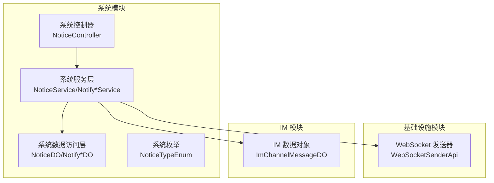

**图表来源**
- [NoticeController.java:1-34](file://yudao-module-system/src/main/java/cn/iocoder/yudao/module/system/controller/admin/notice/NoticeController.java#L1-L34)
- [NoticeService.java:1-60](file://yudao-module-system/src/main/java/cn/iocoder/yudao/module/system/service/notice/NoticeService.java#L1-L60)
- [NotifyMessageService.java:1-39](file://yudao-module-system/src/main/java/cn/iocoder/yudao/module/system/service/notify/NotifyMessageService.java#L1-L39)
- [WebSocketSenderApi.java](file://yudao-module-infrastructure/src/main/java/cn/iocoder/yudao/module/infra/api/websocket/WebSocketSenderApi.java)
- [ImChannelMessageDO.java:1-74](file://yudao-module-im/src/main/java/cn/iocoder/yudao/module/im/dal/dataobject/message/ImChannelMessageDO.java#L1-L74)

**章节来源**
- [NoticeController.java:1-34](file://yudao-module-system/src/main/java/cn/iocoder/yudao/module/system/controller/admin/notice/NoticeController.java#L1-L34)
- [NoticeService.java:1-60](file://yudao-module-system/src/main/java/cn/iocoder/yudao/module/system/service/notice/NoticeService.java#L1-L60)
- [NotifyMessageService.java:1-39](file://yudao-module-system/src/main/java/cn/iocoder/yudao/module/system/service/notify/NotifyMessageService.java#L1-L39)

## 核心组件
- 通知公告控制器与服务：负责公告的增删改查、分页查询、状态控制
- 站内信服务：负责站内信的创建、分页查询、发送与模板管理
- 通知模板服务：负责模板的保存、校验、缓存与参数校验
- 通知发送服务：负责单发站内信到管理员或会员
- 通知发送 API：对外暴露站内信发送接口
- 通知公告数据对象与枚举：定义公告字段与类型
- 通知消息数据对象：定义站内信消息字段
- 通知模板数据对象：定义模板字段
- WebSocket 发送器：用于实时推送
- IM 频道消息：用于频道推送场景
- 短信渠道服务：用于短信通道配置与客户端工厂集成

**章节来源**
- [NoticeService.java:1-60](file://yudao-module-system/src/main/java/cn/iocoder/yudao/module/system/service/notice/NoticeService.java#L1-L60)
- [NotifyMessageService.java:1-39](file://yudao-module-system/src/main/java/cn/iocoder/yudao/module/system/service/notify/NotifyMessageService.java#L1-L39)
- [NotifyTemplateService.java](file://yudao-module-system/src/main/java/cn/iocoder/yudao/module/system/service/notify/NotifyTemplateService.java)
- [NotifySendServiceImpl.java](file://yudao-module-system/src/main/java/cn/iocoder/yudao/module/system/service/notify/NotifySendServiceImpl.java)
- [NotifyMessageSendApiImpl.java:1-32](file://yudao-module-system/src/main/java/cn/iocoder/yudao/module/system/api/notify/NotifyMessageSendApiImpl.java#L1-L32)
- [NoticeDO.java](file://yudao-module-system/src/main/java/cn/iocoder/yudao/module/system/dal/dataobject/notice/NoticeDO.java)
- [NotifyMessageDO.java](file://yudao-module-system/src/main/java/cn/iocoder/yudao/module/system/dal/dataobject/notify/NotifyMessageDO.java)
- [NotifyTemplateDO.java](file://yudao-module-system/src/main/java/cn/iocoder/yudao/module/system/dal/dataobject/notify/NotifyTemplateDO.java)
- [NoticeTypeEnum.java:1-23](file://yudao-module-system/src/main/java/cn/iocoder/yudao/module/system/enums/notice/NoticeTypeEnum.java#L1-L23)
- [WebSocketSenderApi.java](file://yudao-module-infrastructure/src/main/java/cn/iocoder/yudao/module/infra/api/websocket/WebSocketSenderApi.java)
- [ImChannelMessageDO.java:1-74](file://yudao-module-im/src/main/java/cn/iocoder/yudao/module/im/dal/dataobject/message/ImChannelMessageDO.java#L1-L74)
- [SmsChannelServiceImpl.java:1-35](file://yudao-module-system/src/main/java/cn/iocoder/yudao/module/system/service/sms/SmsChannelServiceImpl.java#L1-L35)

## 架构总览
通知公告与站内信的整体架构由“控制器 -> 服务 -> 数据访问 -> 基础设施/IM”的层次组成，支持模板驱动的消息生成与多渠道推送。

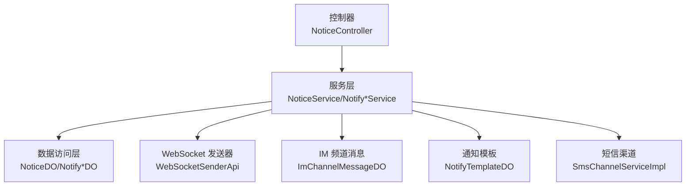

**图表来源**
- [NoticeController.java:1-34](file://yudao-module-system/src/main/java/cn/iocoder/yudao/module/system/controller/admin/notice/NoticeController.java#L1-L34)
- [NoticeService.java:1-60](file://yudao-module-system/src/main/java/cn/iocoder/yudao/module/system/service/notice/NoticeService.java#L1-L60)
- [NotifyMessageService.java:1-39](file://yudao-module-system/src/main/java/cn/iocoder/yudao/module/system/service/notify/NotifyMessageService.java#L1-L39)
- [WebSocketSenderApi.java](file://yudao-module-infrastructure/src/main/java/cn/iocoder/yudao/module/infra/api/websocket/WebSocketSenderApi.java)
- [ImChannelMessageDO.java:1-74](file://yudao-module-im/src/main/java/cn/iocoder/yudao/module/im/dal/dataobject/message/ImChannelMessageDO.java#L1-L74)
- [SmsChannelServiceImpl.java:1-35](file://yudao-module-system/src/main/java/cn/iocoder/yudao/module/system/service/sms/SmsChannelServiceImpl.java#L1-L35)

## 详细组件分析

### 通知公告模块

#### 控制器与服务接口
- 控制器提供公告的分页查询、详情获取、新增与更新、删除等接口
- 服务接口定义公告的创建、更新、删除、批量删除、分页查询与详情查询

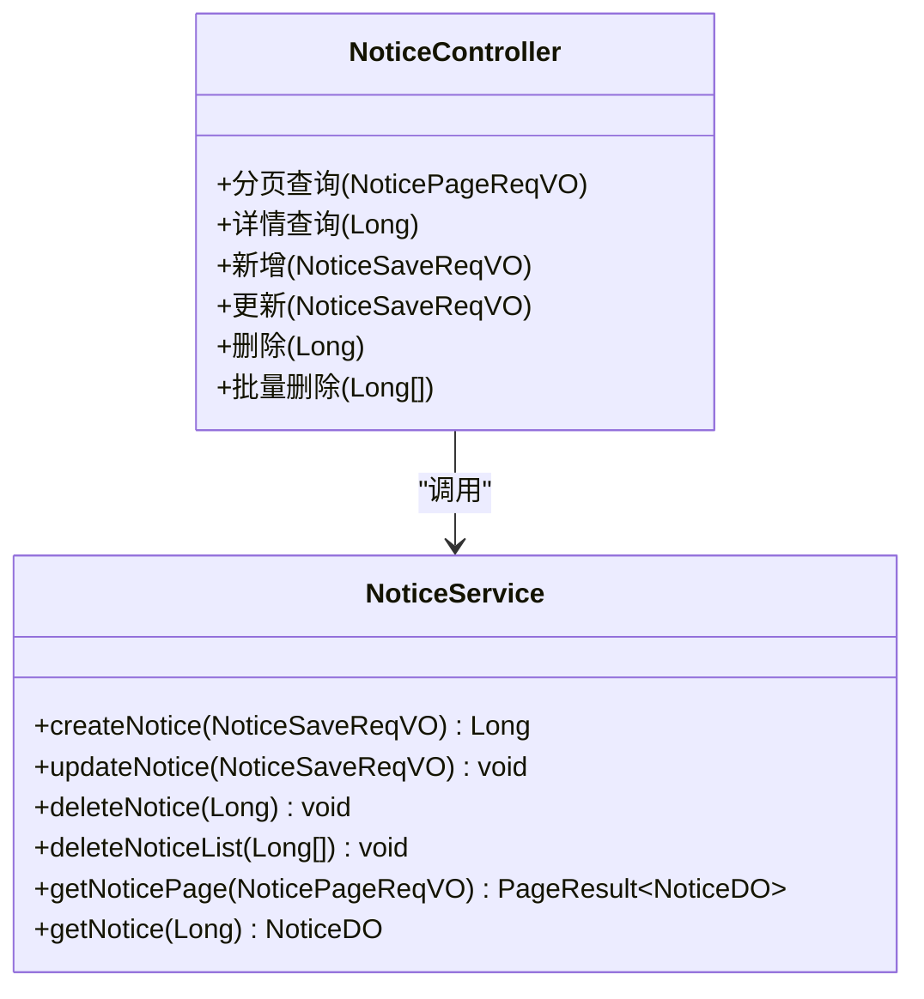

**图表来源**
- [NoticeController.java:1-34](file://yudao-module-system/src/main/java/cn/iocoder/yudao/module/system/controller/admin/notice/NoticeController.java#L1-L34)
- [NoticeService.java:1-60](file://yudao-module-system/src/main/java/cn/iocoder/yudao/module/system/service/notice/NoticeService.java#L1-L60)

**章节来源**
- [NoticeController.java:1-34](file://yudao-module-system/src/main/java/cn/iocoder/yudao/module/system/controller/admin/notice/NoticeController.java#L1-L34)
- [NoticeService.java:1-60](file://yudao-module-system/src/main/java/cn/iocoder/yudao/module/system/service/notice/NoticeService.java#L1-L60)

#### 数据模型与类型
- 公告数据对象包含标题、类型、内容、状态、创建时间等字段
- 公告类型枚举包含通知与公告两类

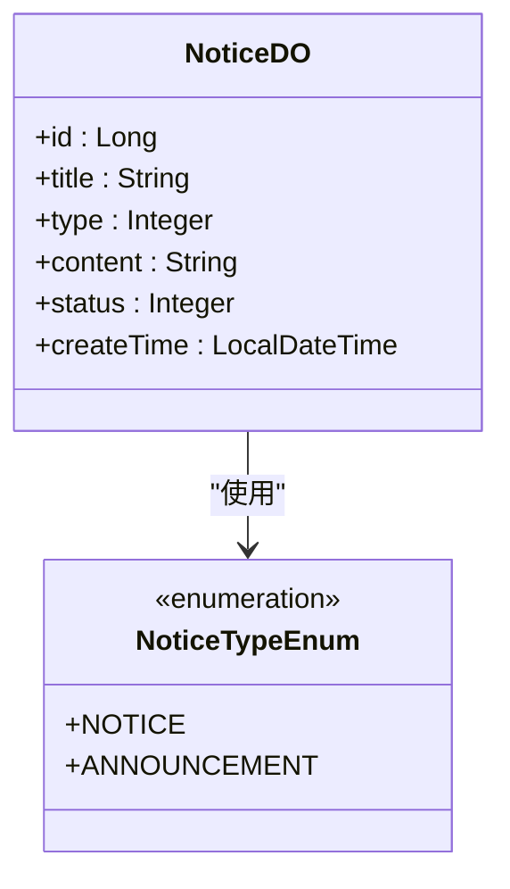

**图表来源**
- [NoticeDO.java](file://yudao-module-system/src/main/java/cn/iocoder/yudao/module/system/dal/dataobject/notice/NoticeDO.java)
- [NoticeTypeEnum.java:1-23](file://yudao-module-system/src/main/java/cn/iocoder/yudao/module/system/enums/notice/NoticeTypeEnum.java#L1-L23)

**章节来源**
- [NoticeDO.java](file://yudao-module-system/src/main/java/cn/iocoder/yudao/module/system/dal/dataobject/notice/NoticeDO.java)
- [NoticeTypeEnum.java:1-23](file://yudao-module-system/src/main/java/cn/iocoder/yudao/module/system/enums/notice/NoticeTypeEnum.java#L1-L23)

#### 公告发布流程时序
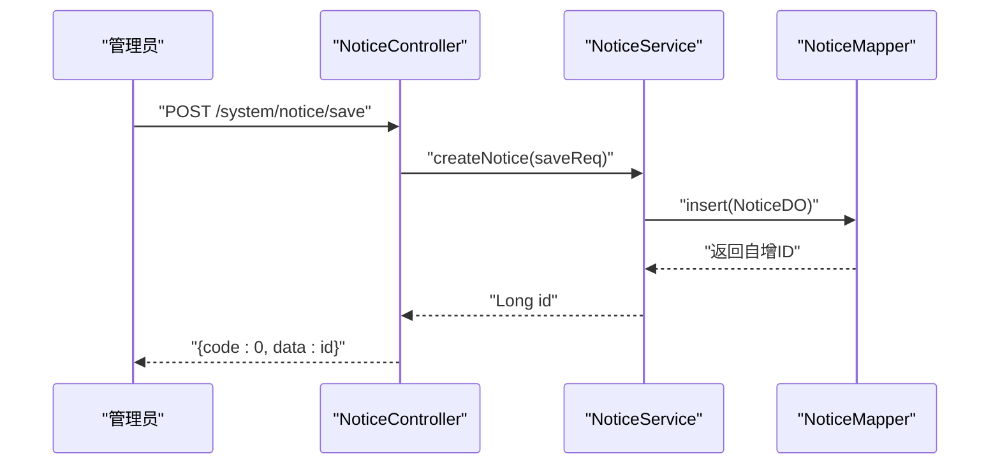

**图表来源**
- [NoticeController.java:1-34](file://yudao-module-system/src/main/java/cn/iocoder/yudao/module/system/controller/admin/notice/NoticeController.java#L1-L34)
- [NoticeService.java:1-60](file://yudao-module-system/src/main/java/cn/iocoder/yudao/module/system/service/notice/NoticeService.java#L1-L60)

### 站内信消息模块

#### 服务接口与实现
- 站内信服务接口定义创建消息、分页查询等方法
- 站内信实现类对接消息持久化与分页查询
- 通知模板服务负责模板的保存、校验、缓存与参数校验
- 通知发送服务负责单发站内信到管理员或会员
- 通知发送 API 对外暴露发送接口

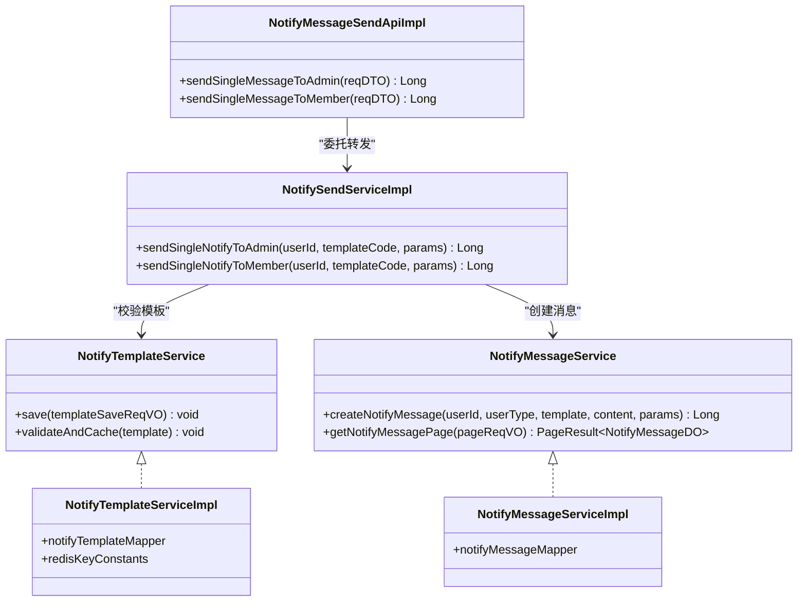

**图表来源**
- [NotifyMessageService.java:1-39](file://yudao-module-system/src/main/java/cn/iocoder/yudao/module/system/service/notify/NotifyMessageService.java#L1-L39)
- [NotifyMessageServiceImpl.java:1-27](file://yudao-module-system/src/main/java/cn/iocoder/yudao/module/system/service/notify/NotifyMessageServiceImpl.java#L1-L27)
- [NotifyTemplateService.java](file://yudao-module-system/src/main/java/cn/iocoder/yudao/module/system/service/notify/NotifyTemplateService.java)
- [NotifyTemplateServiceImpl.java:1-26](file://yudao-module-system/src/main/java/cn/iocoder/yudao/module/system/service/notify/NotifyTemplateServiceImpl.java#L1-L26)
- [NotifySendServiceImpl.java](file://yudao-module-system/src/main/java/cn/iocoder/yudao/module/system/service/notify/NotifySendServiceImpl.java)
- [NotifyMessageSendApiImpl.java:1-32](file://yudao-module-system/src/main/java/cn/iocoder/yudao/module/system/api/notify/NotifyMessageSendApiImpl.java#L1-L32)

**章节来源**
- [NotifyMessageService.java:1-39](file://yudao-module-system/src/main/java/cn/iocoder/yudao/module/system/service/notify/NotifyMessageService.java#L1-L39)
- [NotifyTemplateServiceImpl.java:1-26](file://yudao-module-system/src/main/java/cn/iocoder/yudao/module/system/service/notify/NotifyTemplateServiceImpl.java#L1-L26)
- [NotifySendServiceImpl.java](file://yudao-module-system/src/main/java/cn/iocoder/yudao/module/system/service/notify/NotifySendServiceImpl.java)
- [NotifyMessageSendApiImpl.java:1-32](file://yudao-module-system/src/main/java/cn/iocoder/yudao/module/system/api/notify/NotifyMessageSendApiImpl.java#L1-L32)

#### 站内信发送流程时序
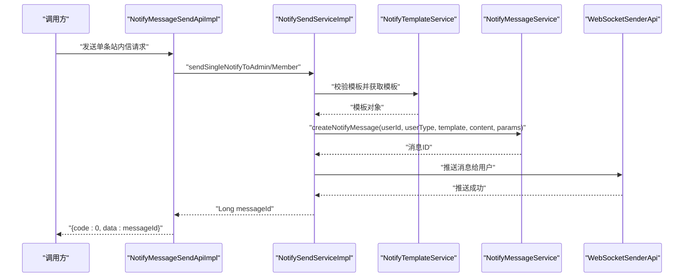

**图表来源**
- [NotifyMessageSendApiImpl.java:1-32](file://yudao-module-system/src/main/java/cn/iocoder/yudao/module/system/api/notify/NotifyMessageSendApiImpl.java#L1-L32)
- [NotifySendServiceImpl.java](file://yudao-module-system/src/main/java/cn/iocoder/yudao/module/system/service/notify/NotifySendServiceImpl.java)
- [NotifyTemplateService.java](file://yudao-module-system/src/main/java/cn/iocoder/yudao/module/system/service/notify/NotifyTemplateService.java)
- [NotifyMessageService.java:1-39](file://yudao-module-system/src/main/java/cn/iocoder/yudao/module/system/service/notify/NotifyMessageService.java#L1-L39)
- [WebSocketSenderApi.java](file://yudao-module-infrastructure/src/main/java/cn/iocoder/yudao/module/infra/api/websocket/WebSocketSenderApi.java)

### 通知渠道与模板管理

#### 短信渠道
- 短信渠道服务通过客户端工厂与数据库中的渠道配置进行对接
- 支持分页查询、保存、删除等操作

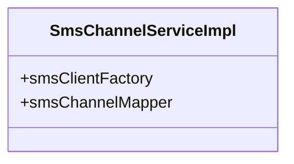

**图表来源**
- [SmsChannelServiceImpl.java:1-35](file://yudao-module-system/src/main/java/cn/iocoder/yudao/module/system/service/sms/SmsChannelServiceImpl.java#L1-L35)

**章节来源**
- [SmsChannelServiceImpl.java:1-35](file://yudao-module-system/src/main/java/cn/iocoder/yudao/module/system/service/sms/SmsChannelServiceImpl.java#L1-L35)

#### 模板数据模型与参数校验
- 模板对象包含类型、状态、编码、名称、内容、参数占位符、渠道等字段
- 模板服务对模板编码唯一性、参数完整性进行校验，并支持缓存

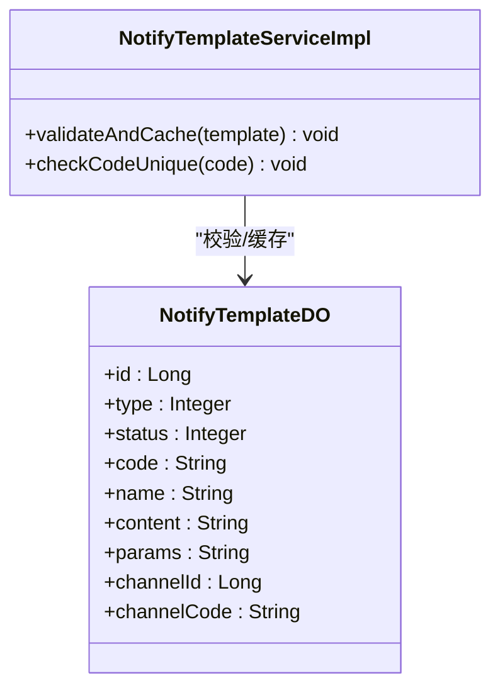

**图表来源**
- [NotifyTemplateDO.java](file://yudao-module-system/src/main/java/cn/iocoder/yudao/module/system/dal/dataobject/notify/NotifyTemplateDO.java)
- [NotifyTemplateServiceImpl.java:1-26](file://yudao-module-system/src/main/java/cn/iocoder/yudao/module/system/service/notify/NotifyTemplateServiceImpl.java#L1-L26)

**章节来源**
- [NotifyTemplateDO.java](file://yudao-module-system/src/main/java/cn/iocoder/yudao/module/system/dal/dataobject/notify/NotifyTemplateDO.java)
- [NotifyTemplateServiceImpl.java:1-26](file://yudao-module-system/src/main/java/cn/iocoder/yudao/module/system/service/notify/NotifyTemplateServiceImpl.java#L1-L26)

#### 模板参数校验流程
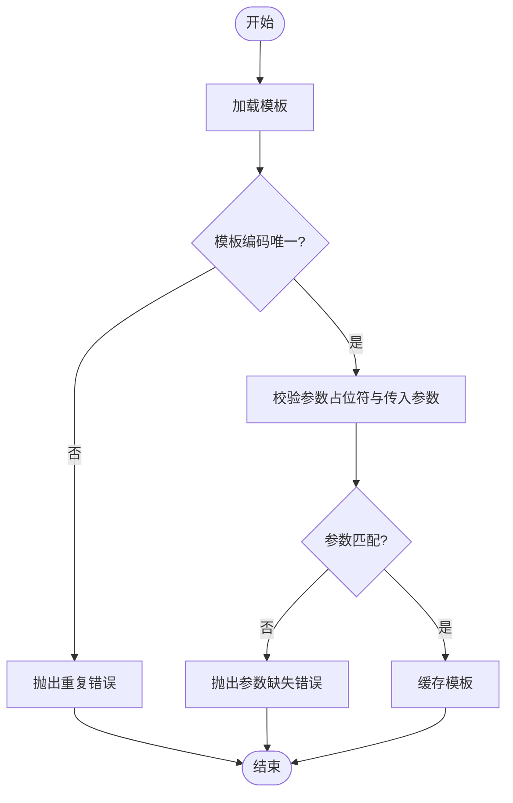

**图表来源**
- [NotifyTemplateServiceImpl.java:1-26](file://yudao-module-system/src/main/java/cn/iocoder/yudao/module/system/service/notify/NotifyTemplateServiceImpl.java#L1-L26)

### IM 频道消息推送
- IM 频道消息数据对象用于频道推送场景，包含频道编号、素材编号、消息类型、内容快照、接收人列表、发送时间等
- 可用于微信公众号推送等场景的消息落盘与查询

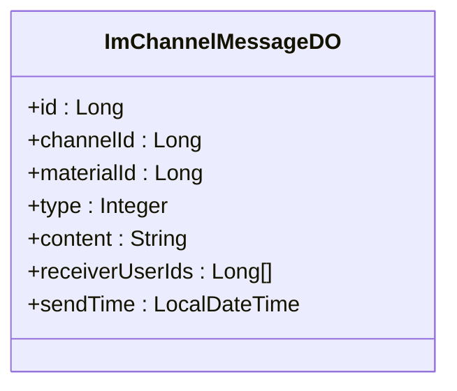

**图表来源**
- [ImChannelMessageDO.java:1-74](file://yudao-module-im/src/main/java/cn/iocoder/yudao/module/im/dal/dataobject/message/ImChannelMessageDO.java#L1-L74)

**章节来源**
- [ImChannelMessageDO.java:1-74](file://yudao-module-im/src/main/java/cn/iocoder/yudao/module/im/dal/dataobject/message/ImChannelMessageDO.java#L1-L74)

## 依赖关系分析
- 控制器依赖服务接口，服务实现依赖数据访问层与基础设施能力
- 站内信发送链路中，发送服务依赖模板服务与消息服务，最终通过 WebSocket 推送
- IM 模块提供频道消息能力，可作为多渠道推送的数据载体

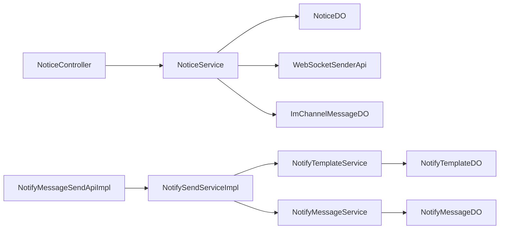

**图表来源**
- [NoticeController.java:1-34](file://yudao-module-system/src/main/java/cn/iocoder/yudao/module/system/controller/admin/notice/NoticeController.java#L1-L34)
- [NoticeService.java:1-60](file://yudao-module-system/src/main/java/cn/iocoder/yudao/module/system/service/notice/NoticeService.java#L1-L60)
- [NotifyMessageSendApiImpl.java:1-32](file://yudao-module-system/src/main/java/cn/iocoder/yudao/module/system/api/notify/NotifyMessageSendApiImpl.java#L1-L32)
- [NotifySendServiceImpl.java](file://yudao-module-system/src/main/java/cn/iocoder/yudao/module/system/service/notify/NotifySendServiceImpl.java)
- [NotifyTemplateService.java](file://yudao-module-system/src/main/java/cn/iocoder/yudao/module/system/service/notify/NotifyTemplateService.java)
- [NotifyMessageService.java:1-39](file://yudao-module-system/src/main/java/cn/iocoder/yudao/module/system/service/notify/NotifyMessageService.java#L1-L39)
- [WebSocketSenderApi.java](file://yudao-module-infrastructure/src/main/java/cn/iocoder/yudao/module/infra/api/websocket/WebSocketSenderApi.java)
- [ImChannelMessageDO.java:1-74](file://yudao-module-im/src/main/java/cn/iocoder/yudao/module/im/dal/dataobject/message/ImChannelMessageDO.java#L1-L74)

**章节来源**
- [NoticeController.java:1-34](file://yudao-module-system/src/main/java/cn/iocoder/yudao/module/system/controller/admin/notice/NoticeController.java#L1-L34)
- [NotifyMessageSendApiImpl.java:1-32](file://yudao-module-system/src/main/java/cn/iocoder/yudao/module/system/api/notify/NotifyMessageSendApiImpl.java#L1-L32)

## 性能考虑
- 模板缓存：通过缓存减少模板解析与参数校验开销
- 分页查询：公告与站内信均提供分页接口，避免一次性加载大量数据
- 批量删除：支持批量删除公告，降低多次交互成本
- WebSocket 推送：仅在需要实时通知时启用，避免不必要的推送压力

## 故障排查指南
- 模板参数缺失：当模板参数与占位符不匹配时会抛出异常，需检查模板参数是否完整
- 模板编码重复：保存模板时若编码重复会抛出异常，需确保模板编码唯一
- 公告不存在：查询或删除公告时若不存在会抛出异常，需确认公告ID正确
- 短信渠道异常：短信发送失败时检查渠道配置与客户端工厂初始化

**章节来源**
- [NotifyTemplateServiceImpl.java:1-26](file://yudao-module-system/src/main/java/cn/iocoder/yudao/module/system/service/notify/NotifyTemplateServiceImpl.java#L1-L26)
- [NoticeServiceImpl.java](file://yudao-module-system/src/main/java/cn/iocoder/yudao/module/system/service/notice/NoticeServiceImpl.java)
- [SmsChannelServiceImpl.java:1-35](file://yudao-module-system/src/main/java/cn/iocoder/yudao/module/system/service/sms/SmsChannelServiceImpl.java#L1-L35)

## 结论
本指南系统梳理了通知公告与站内信管理的关键能力，包括公告发布、类型管理、接收范围与状态控制，以及站内信的发送、接收、阅读状态与模板管理。同时介绍了多渠道通知机制（邮件、短信、微信公众号）与模板动态渲染、通知记录审计等实践建议。通过清晰的组件划分与接口约束，系统具备良好的扩展性与可维护性。

## 附录

### API 接口清单与说明

- 公告管理
  - 列表分页查询
    - 方法：GET
    - 路径：/system/notice/page
    - 请求体：分页查询参数对象
    - 返回：分页结果，包含公告列表
  - 获取公告详情
    - 方法：GET
    - 路径：/system/notice/get
    - 查询参数：id
    - 返回：公告详情对象
  - 新增公告
    - 方法：POST
    - 路径：/system/notice/save
    - 请求体：公告保存参数对象
    - 返回：公告编号
  - 更新公告
    - 方法：PUT
    - 路径：/system/notice/update
    - 请求体：公告保存参数对象
    - 返回：无
  - 删除公告
    - 方法：DELETE
    - 路径：/system/notice/delete
    - 查询参数：id
    - 返回：无
  - 批量删除公告
    - 方法：DELETE
    - 路径：/system/notice/delete-list
    - 请求体：ID 列表
    - 返回：无

- 站内信管理
  - 站内信分页查询
    - 方法：GET
    - 路径：/system/notify/message/page
    - 请求体：分页查询参数对象
    - 返回：分页结果，包含消息列表
  - 我的站内信分页查询
    - 方法：GET
    - 路径：/system/notify/message/my-page
    - 请求体：我的分页查询参数对象
    - 返回：分页结果，包含消息列表

- 站内信发送
  - 发送单条站内信（管理员）
    - 方法：POST
    - 路径：/system/notify/send-to-admin
    - 请求体：发送请求 DTO（用户ID、模板编码、模板参数）
    - 返回：消息编号
  - 发送单条站内信（会员）
    - 方法：POST
    - 路径：/system/notify/send-to-member
    - 请求体：发送请求 DTO（用户ID、模板编码、模板参数）
    - 返回：消息编号

- 消息模板管理
  - 模板分页查询
    - 方法：GET
    - 路径：/system/notify/template/page
    - 请求体：分页查询参数对象
    - 返回：分页结果，包含模板列表
  - 保存模板
    - 方法：POST
    - 路径：/system/notify/template/save
    - 请求体：模板保存参数对象
    - 返回：无
  - 删除模板
    - 方法：DELETE
    - 路径：/system/notify/template/delete
    - 查询参数：id
    - 返回：无

**章节来源**
- [NoticeController.java:1-34](file://yudao-module-system/src/main/java/cn/iocoder/yudao/module/system/controller/admin/notice/NoticeController.java#L1-L34)
- [NotifyMessageService.java:1-39](file://yudao-module-system/src/main/java/cn/iocoder/yudao/module/system/service/notify/NotifyMessageService.java#L1-L39)
- [NotifyMessageSendApiImpl.java:1-32](file://yudao-module-system/src/main/java/cn/iocoder/yudao/module/system/api/notify/NotifyMessageSendApiImpl.java#L1-L32)
- [NotifyTemplateServiceImpl.java:1-26](file://yudao-module-system/src/main/java/cn/iocoder/yudao/module/system/service/notify/NotifyTemplateServiceImpl.java#L1-L26)

### 数据模型与字段说明

- 公告数据对象
  - 字段：id、title、type、content、status、createTime
  - 类型：Long、String、Integer、String、Integer、LocalDateTime
  - 说明：公告主键、标题、类型、内容、状态、创建时间

- 站内信消息数据对象
  - 字段：id、userId、userType、templateCode、title、content、status、readStatus、createTime
  - 类型：Long、Long、Integer、String、String、String、Integer、Integer、LocalDateTime
  - 说明：消息主键、用户ID、用户类型、模板编码、标题、内容、状态、已读未读状态、创建时间

- 站内信模板数据对象
  - 字段：id、type、status、code、name、content、params、channelId、channelCode
  - 类型：Long、Integer、Integer、String、String、String、String、Long、String
  - 说明：模板主键、类型、状态、编码、名称、内容、参数占位符、渠道ID、渠道编码

- IM 频道消息数据对象
  - 字段：id、channelId、materialId、type、content、receiverUserIds、sendTime
  - 类型：Long、Long、Long、Integer、String、List<Long>、LocalDateTime
  - 说明：消息主键、频道ID、素材ID、消息类型、内容快照、接收人列表、发送时间

**章节来源**
- [NoticeDO.java](file://yudao-module-system/src/main/java/cn/iocoder/yudao/module/system/dal/dataobject/notice/NoticeDO.java)
- [NotifyMessageDO.java](file://yudao-module-system/src/main/java/cn/iocoder/yudao/module/system/dal/dataobject/notify/NotifyMessageDO.java)
- [NotifyTemplateDO.java](file://yudao-module-system/src/main/java/cn/iocoder/yudao/module/system/dal/dataobject/notify/NotifyTemplateDO.java)
- [ImChannelMessageDO.java:1-74](file://yudao-module-im/src/main/java/cn/iocoder/yudao/module/im/dal/dataobject/message/ImChannelMessageDO.java#L1-L74)

### 通知模板动态渲染与多渠道适配
- 动态渲染：模板内容与参数通过模板服务进行参数校验与缓存，渲染后写入站内信消息
- 多渠道适配：短信渠道通过客户端工厂对接不同供应商；IM 频道消息可用于微信公众号等推送场景

**章节来源**
- [NotifyTemplateServiceImpl.java:1-26](file://yudao-module-system/src/main/java/cn/iocoder/yudao/module/system/service/notify/NotifyTemplateServiceImpl.java#L1-L26)
- [SmsChannelServiceImpl.java:1-35](file://yudao-module-system/src/main/java/cn/iocoder/yudao/module/system/service/sms/SmsChannelServiceImpl.java#L1-L35)
- [ImChannelMessageDO.java:1-74](file://yudao-module-im/src/main/java/cn/iocoder/yudao/module/im/dal/dataobject/message/ImChannelMessageDO.java#L1-L74)

### 通知记录审计
- 系统提供消息分页查询与我的分页查询，便于审计与追溯
- WebSocket 推送记录可结合前端日志与后端日志进行审计

**章节来源**
- [NotifyMessageService.java:1-39](file://yudao-module-system/src/main/java/cn/iocoder/yudao/module/system/service/notify/NotifyMessageService.java#L1-L39)
- [WebSocketSenderApi.java](file://yudao-module-infrastructure/src/main/java/cn/iocoder/yudao/module/infra/api/websocket/WebSocketSenderApi.java)

### 数据库表结构参考
- 短信渠道与短信模板表结构（用于短信通知）
- 公告与站内信相关表结构（用于通知公告与站内信）

**章节来源**
- [create_tables.sql:247-282](file://yudao-module-system/src/test/resources/sql/create_tables.sql#L247-L282)