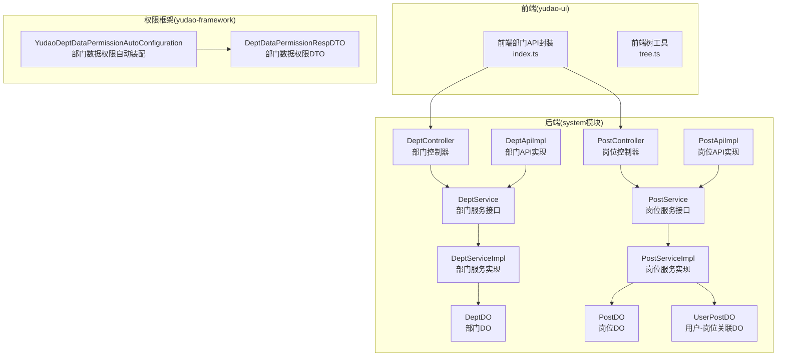
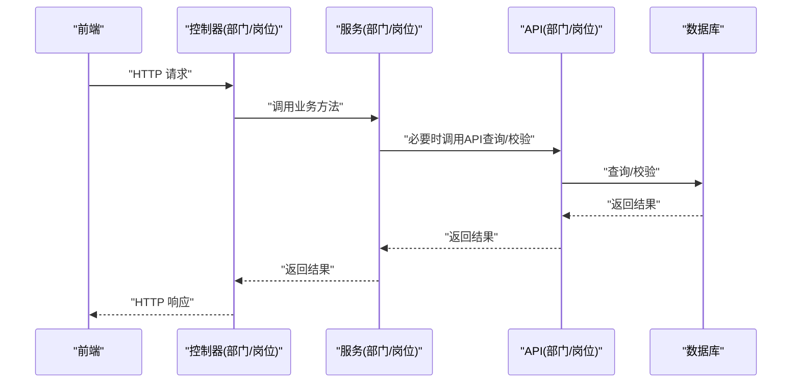
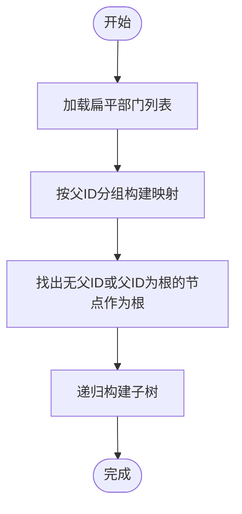
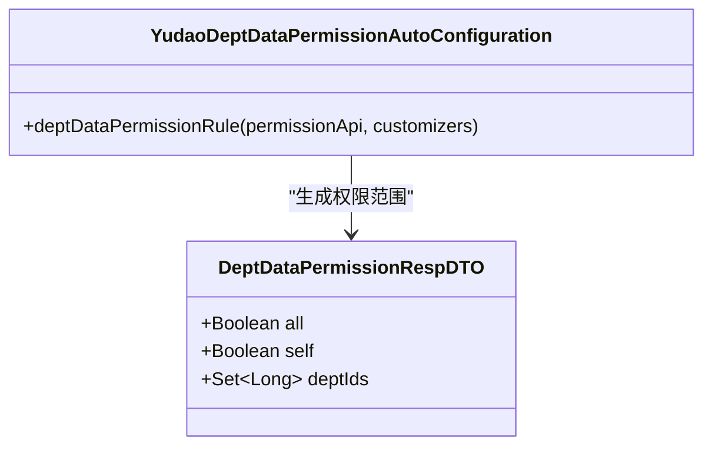
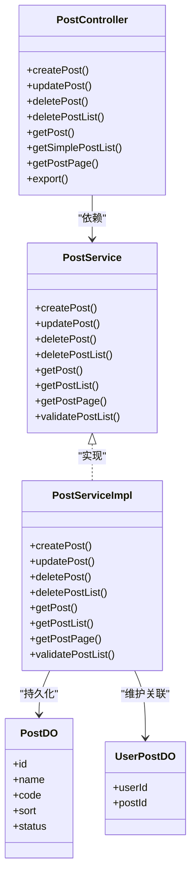
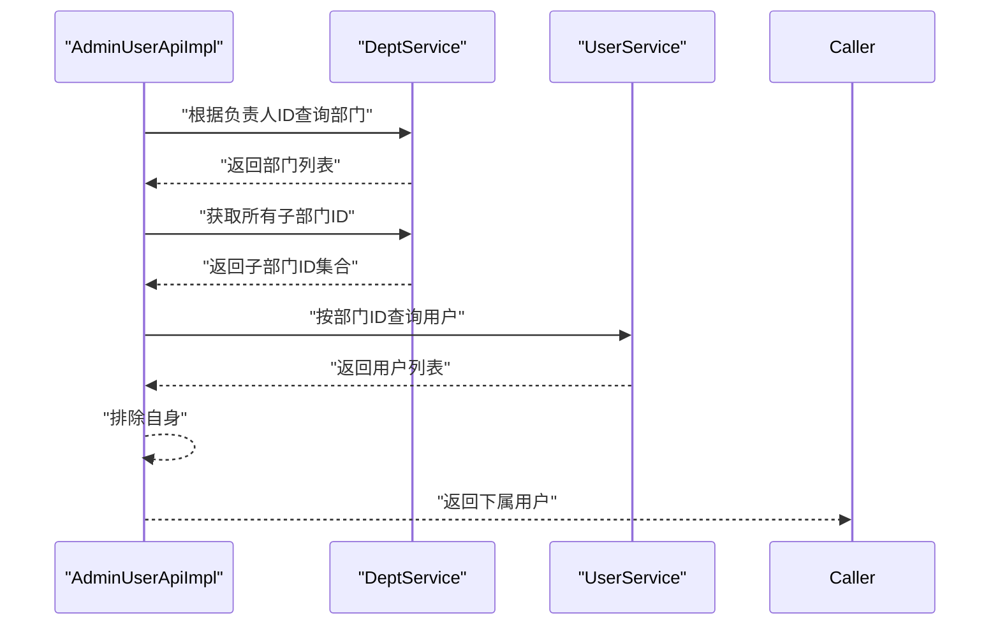
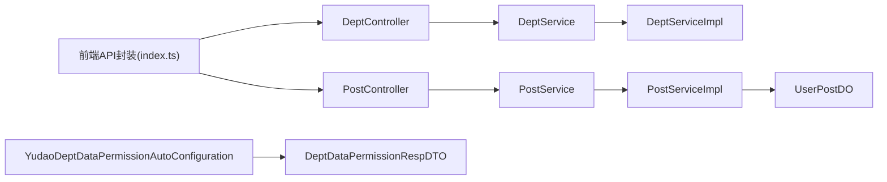

# 部门岗位管理

<cite>
**本文引用的文件**
- [DeptController.java](file://yudao-module-system/src/main/java/cn/iocoder/yudao/module/system/controller/admin/dept/DeptController.java)
- [PostController.java](file://yudao-module-system/src/main/java/cn/iocoder/yudao/module/system/controller/admin/dept/PostController.java)
- [DeptService.java](file://yudao-module-system/src/main/java/cn/iocoder/yudao/module/system/service/dept/DeptService.java)
- [PostService.java](file://yudao-module-system/src/main/java/cn/iocoder/yudao/module/system/service/dept/PostService.java)
- [DeptServiceImpl.java](file://yudao-module-system/src/main/java/cn/iocoder/yudao/module/system/service/dept/DeptServiceImpl.java)
- [PostServiceImpl.java](file://yudao-module-system/src/main/java/cn/iocoder/yudao/module/system/service/dept/PostServiceImpl.java)
- [DeptApiImpl.java](file://yudao-module-system/src/main/java/cn/iocoder/yudao/module/system/api/dept/DeptApiImpl.java)
- [PostApiImpl.java](file://yudao-module-system/src/main/java/cn/iocoder/yudao/module/system/api/dept/PostApiImpl.java)
- [DeptDO.java](file://yudao-module-system/src/main/java/cn/iocoder/yudao/module/system/dal/dataobject/DeptDO.java)
- [PostDO.java](file://yudao-module-system/src/main/java/cn/iocoder/yudao/module/system/dal/dataobject/PostDO.java)
- [UserPostDO.java](file://yudao-module-system/src/main/java/cn/iocoder/yudao/module/system/dal/dataobject/UserPostDO.java)
- [DeptDataPermissionRespDTO.java](file://yudao-framework/yudao-common/src/main/java/cn/iocoder/yudao/framework/common/biz/system/permission/dto/DeptDataPermissionRespDTO.java)
- [YudaoDeptDataPermissionAutoConfiguration.java](file://yudao-framework/yudao-spring-boot-starter-biz-data-permission/src/main/java/cn/iocoder/yudao/framework/datapermission/config/YudaoDeptDataPermissionAutoConfiguration.java)
- [AdminUserApiImpl.java](file://yudao-module-system/src/main/java/cn/iocoder/yudao/module/system/api/user/AdminUserApiImpl.java)
- [index.ts（前端部门API）](file://yudao-ui/yudao-ui-admin-vue3/src/api/system/dept/index.ts)
- [tree.ts（前端树工具）](file://yudao-ui/yudao-ui-admin-vue3/src/utils/tree.ts)
</cite>

## 目录
1. [简介](#简介)
2. [项目结构](#项目结构)
3. [核心组件](#核心组件)
4. [架构总览](#架构总览)
5. [详细组件分析](#详细组件分析)
6. [依赖分析](#依赖分析)
7. [性能考虑](#性能考虑)
8. [故障排查指南](#故障排查指南)
9. [结论](#结论)
10. [附录](#附录)

## 简介
本指南围绕“部门岗位管理”功能，系统化梳理部门组织架构的树形结构设计、层级关系管理、统计分析与数据隔离机制，并详细说明岗位管理（岗位设置、岗位与用户的关联关系、岗位权限控制）。同时给出部门树形结构的实现原理（父子节点关系、层级计算、继承规则、数据权限控制），提供完整的API接口文档与实际代码示例路径，帮助开发者快速落地与扩展。

## 项目结构
系统采用模块化分层架构，部门与岗位能力位于 system 模块，前端通过 axios 封装的 API 与后端交互，通用工具与权限框架位于 yudao-framework。

图表来源
- [DeptController.java:25-93](file://yudao-module-system/src/main/java/cn/iocoder/yudao/module/system/controller/admin/dept/DeptController.java#L25-L93)
- [PostController.java:34-114](file://yudao-module-system/src/main/java/cn/iocoder/yudao/module/system/controller/admin/dept/PostController.java#L34-L114)
- [DeptService.java:15-124](file://yudao-module-system/src/main/java/cn/iocoder/yudao/module/system/service/dept/DeptService.java#L15-L124)
- [PostService.java:12-91](file://yudao-module-system/src/main/java/cn/iocoder/yudao/module/system/service/dept/PostService.java#L12-L91)
- [DeptServiceImpl.java](file://yudao-module-system/src/main/java/cn/iocoder/yudao/module/system/service/dept/DeptServiceImpl.java)
- [PostServiceImpl.java:1-39](file://yudao-module-system/src/main/java/cn/iocoder/yudao/module/system/service/dept/PostServiceImpl.java#L1-L39)
- [DeptApiImpl.java:1-47](file://yudao-module-system/src/main/java/cn/iocoder/yudao/module/system/api/dept/DeptApiImpl.java#L1-L47)
- [PostApiImpl.java:1-35](file://yudao-module-system/src/main/java/cn/iocoder/yudao/module/system/api/dept/PostApiImpl.java#L1-L35)
- [DeptDO.java](file://yudao-module-system/src/main/java/cn/iocoder/yudao/module/system/dal/dataobject/DeptDO.java)
- [PostDO.java](file://yudao-module-system/src/main/java/cn/iocoder/yudao/module/system/dal/dataobject/PostDO.java)
- [UserPostDO.java](file://yudao-module-system/src/main/java/cn/iocoder/yudao/module/system/dal/dataobject/UserPostDO.java)
- [YudaoDeptDataPermissionAutoConfiguration.java:1-34](file://yudao-framework/yudao-spring-boot-starter-biz-data-permission/src/main/java/cn/iocoder/yudao/framework/datapermission/config/YudaoDeptDataPermissionAutoConfiguration.java#L1-L34)
- [DeptDataPermissionRespDTO.java:1-35](file://yudao-framework/yudao-common/src/main/java/cn/iocoder/yudao/framework/common/biz/system/permission/dto/DeptDataPermissionRespDTO.java#L1-L35)

章节来源
- [DeptController.java:25-93](file://yudao-module-system/src/main/java/cn/iocoder/yudao/module/system/controller/admin/dept/DeptController.java#L25-L93)
- [PostController.java:34-114](file://yudao-module-system/src/main/java/cn/iocoder/yudao/module/system/controller/admin/dept/PostController.java#L34-L114)
- [index.ts（前端部门API）:1-54](file://yudao-ui/yudao-ui-admin-vue3/src/api/system/dept/index.ts#L1-L54)

## 核心组件
- 部门控制器与服务
  - 控制器：提供部门 CRUD、列表、树形结构、详情等接口
  - 服务接口与实现：负责业务逻辑、校验、缓存与持久化
- 岗位控制器与服务
  - 控制器：提供岗位 CRUD、分页、导出等接口
  - 服务接口与实现：负责岗位数据管理与校验
- API 层
  - 部门与岗位 API 实现：对外暴露查询与校验能力
- 数据对象
  - DeptDO、PostDO、UserPostDO：对应数据库表结构
- 权限与数据隔离
  - 基于部门的数据权限自动装配与响应 DTO

章节来源
- [DeptService.java:15-124](file://yudao-module-system/src/main/java/cn/iocoder/yudao/module/system/service/dept/DeptService.java#L15-L124)
- [PostService.java:12-91](file://yudao-module-system/src/main/java/cn/iocoder/yudao/module/system/service/dept/PostService.java#L12-L91)
- [DeptApiImpl.java:1-47](file://yudao-module-system/src/main/java/cn/iocoder/yudao/module/system/api/dept/DeptApiImpl.java#L1-L47)
- [PostApiImpl.java:1-35](file://yudao-module-system/src/main/java/cn/iocoder/yudao/module/system/api/dept/PostApiImpl.java#L1-L35)
- [DeptDataPermissionRespDTO.java:1-35](file://yudao-framework/yudao-common/src/main/java/cn/iocoder/yudao/framework/common/biz/system/permission/dto/DeptDataPermissionRespDTO.java#L1-L35)
- [YudaoDeptDataPermissionAutoConfiguration.java:1-34](file://yudao-framework/yudao-spring-boot-starter-biz-data-permission/src/main/java/cn/iocoder/yudao/framework/datapermission/config/YudaoDeptDataPermissionAutoConfiguration.java#L1-L34)

## 架构总览
部门与岗位管理遵循典型的 MVC + 分层架构：
- 前端通过 axios 封装的 API 发起请求
- 控制器接收请求，进行鉴权与参数校验
- 服务层执行业务逻辑（含数据权限、缓存、校验）
- DAO 层访问数据库
- API 层提供跨模块查询与校验能力

图表来源
- [DeptController.java:25-93](file://yudao-module-system/src/main/java/cn/iocoder/yudao/module/system/controller/admin/dept/DeptController.java#L25-L93)
- [PostController.java:34-114](file://yudao-module-system/src/main/java/cn/iocoder/yudao/module/system/controller/admin/dept/PostController.java#L34-L114)
- [DeptApiImpl.java:1-47](file://yudao-module-system/src/main/java/cn/iocoder/yudao/module/system/api/dept/DeptApiImpl.java#L1-L47)
- [PostApiImpl.java:1-35](file://yudao-module-system/src/main/java/cn/iocoder/yudao/module/system/api/dept/PostApiImpl.java#L1-L35)

## 详细组件分析

### 部门树形结构与层级管理
- 设计要点
  - 使用 parentId 字段表示父子关系，根节点父 ID 通常为 0 或空
  - 通过“构造树型结构”的算法，将扁平数据转为树形结构
  - 支持获取子部门集合，用于权限范围与统计分析
- 关键实现
  - 前端树工具：提供 handleTree、handleTree2、eachTree、treeMap 等函数，支持构建树、遍历、映射等
  - 后端服务：提供 getChildDeptList、getChildDeptIdListFromCache 等方法，便于权限与统计使用
- 层级计算与继承规则
  - 层级可通过从叶子向上追溯 parentId 至根节点的路径长度计算
  - 继承规则：子部门在权限范围上继承父部门的授权范围

图表来源
- [tree.ts（前端树工具）:226-273](file://yudao-ui/yudao-ui-admin-vue3/src/utils/tree.ts#L226-L273)
- [DeptService.java:87-97](file://yudao-module-system/src/main/java/cn/iocoder/yudao/module/system/service/dept/DeptService.java#L87-L97)

章节来源
- [tree.ts（前端树工具）:226-273](file://yudao-ui/yudao-ui-admin-vue3/src/utils/tree.ts#L226-L273)
- [DeptService.java:87-97](file://yudao-module-system/src/main/java/cn/iocoder/yudao/module/system/service/dept/DeptService.java#L87-L97)

### 部门统计分析与数据权限
- 统计分析
  - 通过子部门集合统计用户数量、业务指标等
  - 结合前端树工具进行聚合计算
- 数据权限
  - 基于登录用户所在部门及其子部门的权限范围
  - 自动装配部门数据权限规则，确保查询仅返回允许的数据

图表来源
- [DeptDataPermissionRespDTO.java:1-35](file://yudao-framework/yudao-common/src/main/java/cn/iocoder/yudao/framework/common/biz/system/permission/dto/DeptDataPermissionRespDTO.java#L1-L35)
- [YudaoDeptDataPermissionAutoConfiguration.java:1-34](file://yudao-framework/yudao-spring-boot-starter-biz-data-permission/src/main/java/cn/iocoder/yudao/framework/datapermission/config/YudaoDeptDataPermissionAutoConfiguration.java#L1-L34)

章节来源
- [DeptDataPermissionRespDTO.java:1-35](file://yudao-framework/yudao-common/src/main/java/cn/iocoder/yudao/framework/common/biz/system/permission/dto/DeptDataPermissionRespDTO.java#L1-L35)
- [YudaoDeptDataPermissionAutoConfiguration.java:1-34](file://yudao-framework/yudao-spring-boot-starter-biz-data-permission/src/main/java/cn/iocoder/yudao/framework/datapermission/config/YudaoDeptDataPermissionAutoConfiguration.java#L1-L34)

### 岗位管理（设置、关联、权限）
- 岗位设置
  - 提供创建、更新、删除、批量删除、分页查询、导出等能力
- 岗位与用户关联
  - 通过 UserPostDO 维护用户与岗位的多对多关系
- 岗位权限控制
  - 岗位可作为角色授权的载体，结合系统权限体系进行控制

图表来源
- [PostController.java:34-114](file://yudao-module-system/src/main/java/cn/iocoder/yudao/module/system/controller/admin/dept/PostController.java#L34-L114)
- [PostService.java:12-91](file://yudao-module-system/src/main/java/cn/iocoder/yudao/module/system/service/dept/PostService.java#L12-L91)
- [PostServiceImpl.java:1-39](file://yudao-module-system/src/main/java/cn/iocoder/yudao/module/system/service/dept/PostServiceImpl.java#L1-L39)
- [PostDO.java](file://yudao-module-system/src/main/java/cn/iocoder/yudao/module/system/dal/dataobject/PostDO.java)
- [UserPostDO.java](file://yudao-module-system/src/main/java/cn/iocoder/yudao/module/system/dal/dataobject/UserPostDO.java)

章节来源
- [PostController.java:34-114](file://yudao-module-system/src/main/java/cn/iocoder/yudao/module/system/controller/admin/dept/PostController.java#L34-L114)
- [PostService.java:12-91](file://yudao-module-system/src/main/java/cn/iocoder/yudao/module/system/service/dept/PostService.java#L12-L91)
- [PostServiceImpl.java:1-39](file://yudao-module-system/src/main/java/cn/iocoder/yudao/module/system/service/dept/PostServiceImpl.java#L1-L39)
- [PostDO.java](file://yudao-module-system/src/main/java/cn/iocoder/yudao/module/system/dal/dataobject/PostDO.java)
- [UserPostDO.java](file://yudao-module-system/src/main/java/cn/iocoder/yudao/module/system/dal/dataobject/UserPostDO.java)

### 部门与用户、角色的数据关联
- 用户负责部门
  - 通过 DeptService 的 getDeptListByLeaderUserId 获取某用户负责的部门
- 子部门用户查询
  - 结合 getChildDeptList 获取所有子部门，再查询用户列表
- 数据权限忽略
  - 在某些查询场景下，可通过注解忽略数据权限，避免因过滤导致无法查询

图表来源
- [AdminUserApiImpl.java:31-61](file://yudao-module-system/src/main/java/cn/iocoder/yudao/module/system/api/user/AdminUserApiImpl.java#L31-L61)
- [DeptService.java:105-105](file://yudao-module-system/src/main/java/cn/iocoder/yudao/module/system/service/dept/DeptService.java#L105-L105)

章节来源
- [AdminUserApiImpl.java:31-61](file://yudao-module-system/src/main/java/cn/iocoder/yudao/module/system/api/user/AdminUserApiImpl.java#L31-L61)
- [DeptService.java:105-105](file://yudao-module-system/src/main/java/cn/iocoder/yudao/module/system/service/dept/DeptService.java#L105-L105)

## 依赖分析
- 控制器依赖服务接口，服务实现依赖 DAO 与 API
- 权限框架通过自动装配注入部门数据权限规则
- 前端通过统一的 API 封装与后端交互

图表来源
- [index.ts（前端部门API）:1-54](file://yudao-ui/yudao-ui-admin-vue3/src/api/system/dept/index.ts#L1-L54)
- [DeptController.java:25-93](file://yudao-module-system/src/main/java/cn/iocoder/yudao/module/system/controller/admin/dept/DeptController.java#L25-L93)
- [PostController.java:34-114](file://yudao-module-system/src/main/java/cn/iocoder/yudao/module/system/controller/admin/dept/PostController.java#L34-L114)
- [YudaoDeptDataPermissionAutoConfiguration.java:1-34](file://yudao-framework/yudao-spring-boot-starter-biz-data-permission/src/main/java/cn/iocoder/yudao/framework/datapermission/config/YudaoDeptDataPermissionAutoConfiguration.java#L1-L34)
- [DeptDataPermissionRespDTO.java:1-35](file://yudao-framework/yudao-common/src/main/java/cn/iocoder/yudao/framework/common/biz/system/permission/dto/DeptDataPermissionRespDTO.java#L1-L35)

章节来源
- [index.ts（前端部门API）:1-54](file://yudao-ui/yudao-ui-admin-vue3/src/api/system/dept/index.ts#L1-L54)
- [YudaoDeptDataPermissionAutoConfiguration.java:1-34](file://yudao-framework/yudao-spring-boot-starter-biz-data-permission/src/main/java/cn/iocoder/yudao/framework/datapermission/config/YudaoDeptDataPermissionAutoConfiguration.java#L1-L34)

## 性能考虑
- 树构建优化
  - 前端 handleTree 使用一次遍历建立父子映射，时间复杂度 O(n)，适合大数据量
- 缓存策略
  - 服务层提供从缓存获取子部门 ID 的方法，减少重复查询
- 分页与导出
  - 岗位分页查询支持大列表导出，建议分批处理以降低内存压力

章节来源
- [tree.ts（前端树工具）:226-273](file://yudao-ui/yudao-ui-admin-vue3/src/utils/tree.ts#L226-L273)
- [DeptService.java:113-113](file://yudao-module-system/src/main/java/cn/iocoder/yudao/module/system/service/dept/DeptService.java#L113-L113)
- [PostController.java:94-112](file://yudao-module-system/src/main/java/cn/iocoder/yudao/module/system/controller/admin/dept/PostController.java#L94-L112)

## 故障排查指南
- 部门树渲染异常
  - 检查数据是否包含 parentId 指向不存在的节点
  - 使用前端树工具 handleTree 进行二次校验与构建
- 数据权限范围不符
  - 确认 DeptDataPermissionRespDTO 中的 deptIds 是否包含当前用户可见范围
  - 检查权限自动装配是否生效
- 岗位校验失败
  - 确认 PostApiImpl 的校验逻辑是否覆盖了禁用状态与不存在 ID 的情况

章节来源
- [tree.ts（前端树工具）:226-273](file://yudao-ui/yudao-ui-admin-vue3/src/utils/tree.ts#L226-L273)
- [DeptDataPermissionRespDTO.java:1-35](file://yudao-framework/yudao-common/src/main/java/cn/iocoder/yudao/framework/common/biz/system/permission/dto/DeptDataPermissionRespDTO.java#L1-L35)
- [PostApiImpl.java:24-33](file://yudao-module-system/src/main/java/cn/iocoder/yudao/module/system/api/dept/PostApiImpl.java#L24-L33)

## 结论
本指南系统梳理了部门岗位管理的前后端实现与权限控制机制，明确了树形结构的设计与实现、数据权限的自动装配与过滤、岗位与用户的关联关系及权限控制策略。通过统一的 API 与分层架构，能够高效支撑多租户环境下的部门隔离与统计分析需求。

## 附录

### API 接口文档（后端）

- 部门
  - 创建部门
    - 方法：POST
    - 路径：/system/dept/create
    - 权限：system:dept:create
    - 请求体：DeptSaveReqVO
    - 返回：Long（部门编号）
  - 更新部门
    - 方法：PUT
    - 路径：/system/dept/update
    - 权限：system:dept:update
    - 请求体：DeptSaveReqVO
    - 返回：Boolean（true）
  - 删除部门
    - 方法：DELETE
    - 路径：/system/dept/delete
    - 权限：system:dept:delete
    - 参数：id（Long）
    - 返回：Boolean（true）
  - 批量删除部门
    - 方法：DELETE
    - 路径：/system/dept/delete-list
    - 权限：system:dept:delete
    - 参数：ids（List<Long>）
    - 返回：Boolean（true）
  - 获取部门列表
    - 方法：GET
    - 路径：/system/dept/list
    - 权限：system:dept:query
    - 参数：DeptListReqVO
    - 返回：List<DeptRespVO>
  - 获取部门精简列表
    - 方法：GET
    - 路径：/system/dept/simple-list
    - 返回：List<DeptSimpleRespVO>
  - 获取部门详情
    - 方法：GET
    - 路径：/system/dept/get
    - 权限：system:dept:query
    - 参数：id（Long）
    - 返回：DeptRespVO

- 岗位
  - 创建岗位
    - 方法：POST
    - 路径：/system/post/create
    - 权限：system:post:create
    - 请求体：PostSaveReqVO
    - 返回：Long（岗位编号）
  - 更新岗位
    - 方法：PUT
    - 路径：/system/post/update
    - 权限：system:post:update
    - 请求体：PostSaveReqVO
    - 返回：Boolean（true）
  - 删除岗位
    - 方法：DELETE
    - 路径：/system/post/delete
    - 权限：system:post:delete
    - 参数：id（Long）
    - 返回：Boolean（true）
  - 批量删除岗位
    - 方法：DELETE
    - 路径：/system/post/delete-list
    - 权限：system:post:delete
    - 参数：ids（List<Long>）
    - 返回：Boolean（true）
  - 获取岗位详情
    - 方法：GET
    - 路径：/system/post/get
    - 权限：system:post:query
    - 参数：id（Long）
    - 返回：PostRespVO
  - 获取岗位精简列表
    - 方法：GET
    - 路径：/system/post/simple-list
    - 返回：List<PostSimpleRespVO>
  - 获取岗位分页列表
    - 方法：GET
    - 路径：/system/post/page
    - 权限：system:post:query
    - 参数：PostPageReqVO
    - 返回：PageResult<PostRespVO>
  - 导出岗位数据
    - 方法：GET
    - 路径：/system/post/export-excel
    - 权限：system:post:export
    - 参数：PostPageReqVO
    - 返回：Excel 文件

章节来源
- [DeptController.java:34-91](file://yudao-module-system/src/main/java/cn/iocoder/yudao/module/system/controller/admin/dept/DeptController.java#L34-L91)
- [PostController.java:43-112](file://yudao-module-system/src/main/java/cn/iocoder/yudao/module/system/controller/admin/dept/PostController.java#L43-L112)

### 前端调用示例（路径）
- 部门列表查询
  - 路径：/system/dept/list
  - 示例：[index.ts:22-24](file://yudao-ui/yudao-ui-admin-vue3/src/api/system/dept/index.ts#L22-L24)
- 部门树形结构获取
  - 使用 handleTree 构建树：[tree.ts:226-273](file://yudao-ui/yudao-ui-admin-vue3/src/utils/tree.ts#L226-L273)
- 部门详情获取
  - 路径：/system/dept/get
  - 示例：[index.ts:32-34](file://yudao-ui/yudao-ui-admin-vue3/src/api/system/dept/index.ts#L32-L34)
- 部门创建/更新/删除
  - 创建：/system/dept/create
  - 更新：/system/dept/update
  - 删除：/system/dept/delete
  - 示例：[index.ts:37-49](file://yudao-ui/yudao-ui-admin-vue3/src/api/system/dept/index.ts#L37-L49)
- 岗位列表/分页/导出
  - 列表：/system/post/page
  - 导出：/system/post/export-excel
  - 示例：[PostController.java:94-112](file://yudao-module-system/src/main/java/cn/iocoder/yudao/module/system/controller/admin/dept/PostController.java#L94-L112)

章节来源
- [index.ts（前端部门API）:1-54](file://yudao-ui/yudao-ui-admin-vue3/src/api/system/dept/index.ts#L1-L54)
- [tree.ts（前端树工具）:226-273](file://yudao-ui/yudao-ui-admin-vue3/src/utils/tree.ts#L226-L273)
- [PostController.java:94-112](file://yudao-module-system/src/main/java/cn/iocoder/yudao/module/system/controller/admin/dept/PostController.java#L94-L112)