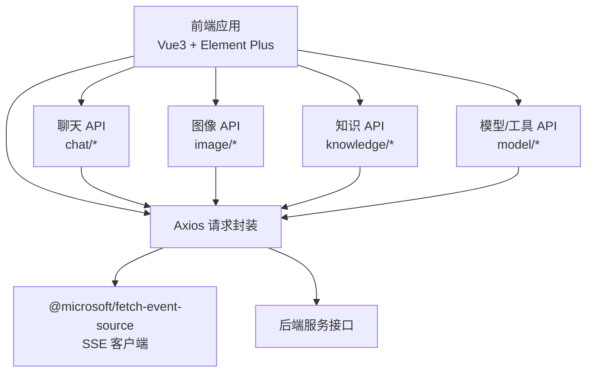
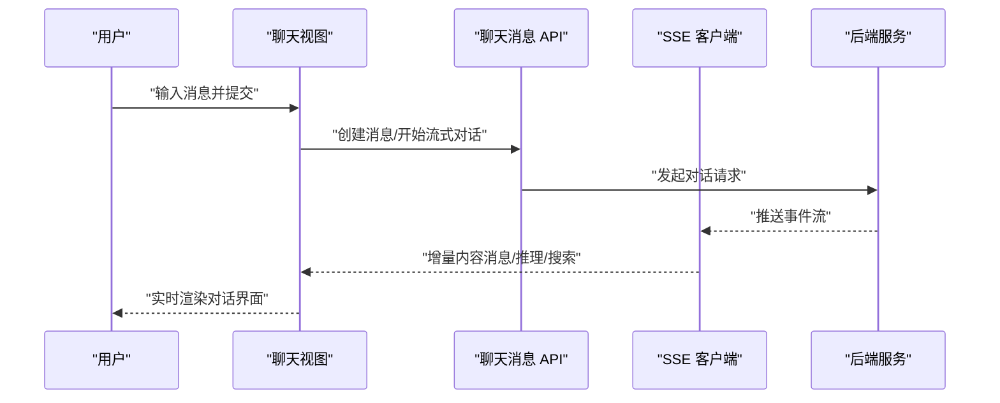
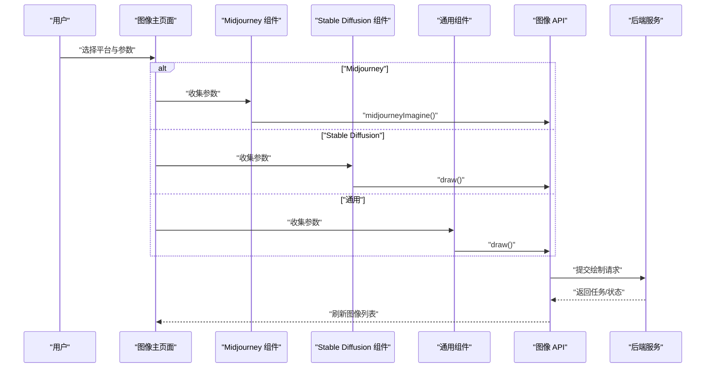
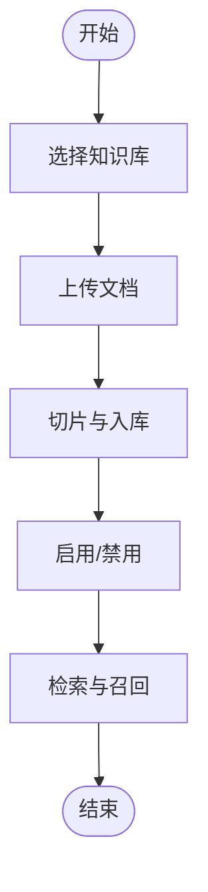
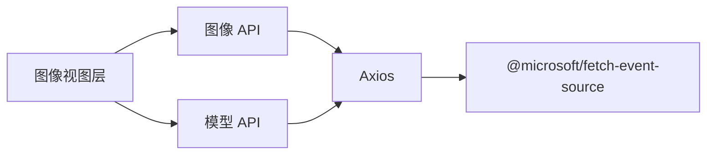

# AI 集成功能 API

<cite>
**本文引用的文件**
- [chat/message/index.ts](file://yudao-ui/yudao-ui-admin-vue3/src/api/ai/chat/message/index.ts)
- [chat/conversation/index.ts](file://yudao-ui/yudao-ui-admin-vue3/src/api/ai/chat/conversation/index.ts)
- [image/index.ts](file://yudao-ui/yudao-ui-admin-vue3/src/api/ai/image/index.ts)
- [knowledge/knowledge/index.ts](file://yudao-ui/yudao-ui-admin-vue3/src/api/ai/knowledge/knowledge/index.ts)
- [knowledge/document/index.ts](file://yudao-ui/yudao-ui-admin-vue3/src/api/ai/knowledge/document/index.ts)
- [knowledge/segment/index.ts](file://yudao-ui/yudao-ui-admin-vue3/src/api/ai/knowledge/segment/index.ts)
- [mindmap/index.ts](file://yudao-ui/yudao-ui-admin-vue3/src/api/ai/mindmap/index.ts)
- [workflow/index.ts](file://yudao-ui/yudao-ui-admin-vue3/src/api/ai/workflow/index.ts)
- [write/index.ts](file://yudao-ui/yudao-ui-admin-vue3/src/api/ai/write/index.ts)
- [music/index.ts](file://yudao-ui/yudao-ui-admin-vue3/src/api/ai/music/index.ts)
- [model/apiKey/index.ts](file://yudao-ui/yudao-ui-admin-vue3/src/api/ai/model/apiKey/index.ts)
- [model/chatRole/index.ts](file://yudao-ui/yudao-ui-admin-vue3/src/api/ai/model/chatRole/index.ts)
- [model/model/index.ts](file://yudao-ui/yudao-ui-admin-vue3/src/api/ai/model/model/index.ts)
- [model/tool/index.ts](file://yudao-ui/yudao-ui-admin-vue3/src/api/ai/model/tool/index.ts)
- [views/ai/utils/constants.ts](file://yudao-ui/yudao-ui-admin-vue3/src/views/ai/utils/constants.ts)
- [views/ai/image/index/index.vue](file://yudao-ui/yudao-ui-admin-vue3/src/views/ai/image/index/index.vue)
- [views/ai/image/index/components/midjourney/index.vue](file://yudao-ui/yudao-ui-admin-vue3/src/views/ai/image/index/components/midjourney/index.vue)
- [views/ai/image/index/components/stableDiffusion/index.vue](file://yudao-ui/yudao-ui-admin-vue3/src/views/ai/image/index/components/stableDiffusion/index.vue)
- [views/ai/image/index/components/common/index.vue](file://yudao-ui/yudao-ui-admin-vue3/src/views/ai/image/index/components/common/index.vue)
</cite>

## 目录
1. [简介](#简介)
2. [项目结构](#项目结构)
3. [核心组件](#核心组件)
4. [架构总览](#架构总览)
5. [详细组件分析](#详细组件分析)
6. [依赖关系分析](#依赖关系分析)
7. [性能考虑](#性能考虑)
8. [故障排除指南](#故障排除指南)
9. [结论](#结论)
10. [附录](#附录)

## 简介
本文件面向前端开发者与后端对接人员，系统化梳理该仓库中“AI 集成模块”的 API 封装与交互设计，覆盖以下能力域：
- AI 聊天：会话与消息管理、流式输出、推理与网络搜索结果展示
- 图像生成：多平台（DALL·E、Midjourney、Stable Diffusion）统一接口封装
- 知识管理：知识库、文档、分段的增删改查与召回检索
- 思维导图：节点与关系的可视化编辑与管理
- 工作流：流程编排与执行
- 内容写作：文案生成与回复
- 音乐：音乐相关能力封装
- 模型与工具：模型、角色、API 密钥、工具的管理
- 权限与成本控制：通过模型参数与状态控制消耗与访问
- 多模态处理：消息支持文本、附件、推理内容、网页搜索等多模态内容

## 项目结构
AI 功能主要由两部分构成：
- 前端 API 层：位于 src/api/ai 下，按功能域划分目录，每个域提供 VO 类型与 API 方法集合
- 前端视图层：位于 src/views/ai 下，承载具体页面与组件，调用 API 层完成业务操作

```mermaid
graph TB
subgraph "前端 API 层"
A1["聊天消息 API<br/>chat/message/index.ts"]
A2["聊天会话 API<br/>chat/conversation/index.ts"]
A3["图像生成 API<br/>image/index.ts"]
A4["知识库 API<br/>knowledge/knowledge/index.ts"]
A5["知识文档 API<br/>knowledge/document/index.ts"]
A6["知识分段 API<br/>knowledge/segment/index.ts"]
A7["思维导图 API<br/>mindmap/index.ts"]
A8["工作流 API<br/>workflow/index.ts"]
A9["写作 API<br/>write/index.ts"]
A10["音乐 API<br/>music/index.ts"]
A11["模型 API<br/>model/model/index.ts"]
A12["角色 API<br/>model/chatRole/index.ts"]
A13["密钥 API<br/>model/apiKey/index.ts"]
A14["工具 API<br/>model/tool/index.ts"]
end
subgraph "前端视图层"
V1["图像主页面<br/>views/ai/image/index/index.vue"]
V2["Midjourney 组件<br/>views/ai/image/index/components/midjourney/index.vue"]
V3["Stable Diffusion 组件<br/>views/ai/image/index/components/stableDiffusion/index.vue"]
V4["通用绘图组件<br/>views/ai/image/index/components/common/index.vue"]
end
V1 --> A3
V2 --> A3
V3 --> A3
V4 --> A3
V1 --> A11
A1 --> A2
A3 --> A11
A4 --> A5
A5 --> A6
```

图表来源
- [views/ai/image/index/index.vue:45-91](file://yudao-ui/yudao-ui-admin-vue3/src/views/ai/image/index/index.vue#L45-L91)
- [views/ai/image/index/components/midjourney/index.vue:110-121](file://yudao-ui/yudao-ui-admin-vue3/src/views/ai/image/index/components/midjourney/index.vue#L110-L121)
- [views/ai/image/index/components/stableDiffusion/index.vue:144-153](file://yudao-ui/yudao-ui-admin-vue3/src/views/ai/image/index/components/stableDiffusion/index.vue#L144-L153)
- [views/ai/image/index/components/common/index.vue:92-95](file://yudao-ui/yudao-ui-admin-vue3/src/views/ai/image/index/components/common/index.vue#L92-L95)

章节来源
- [views/ai/image/index/index.vue:45-91](file://yudao-ui/yudao-ui-admin-vue3/src/views/ai/image/index/index.vue#L45-L91)

## 核心组件
本节从“数据模型 + API 方法 + 视图交互”三个维度，对关键模块进行概览。

- 聊天消息与会话
  - 数据模型：聊天消息 VO、聊天会话 VO，包含消息类型、用户与角色关联、模型参数、Token 消耗、附件与检索结果等
  - API 方法：按会话查询消息列表、获取/创建/更新我的会话
  - 流式输出：前端通过事件源拉取增量内容，支持推理与网络搜索结果的逐步渲染

- 图像生成
  - 数据模型：图像 VO、绘制请求 VO、Midjourney 请求 VO、动作 VO
  - API 方法：通用绘制、DALL·E、Midjourney 专属（Imagine、Action）、分页查询、更新公开状态、删除
  - 视图交互：在图像主页面按平台切换，传入提示词、模型、尺寸、风格等参数，触发绘制并刷新列表

- 知识库与文档
  - 数据模型：知识库 VO、文档 VO、分段 VO
  - API 方法：分页查询、详情、创建/更新/删除、批量创建、状态变更、切片预览、处理进度、检索

- 思维导图、工作流、写作、音乐
  - 数据模型与 API 方法：分别提供对应 VO 与 CRUD/查询方法，支撑前端页面的增删改查与状态管理

- 模型与工具
  - 数据模型：模型、角色、API 密钥、工具 VO
  - API 方法：分页、详情、创建/更新/删除、简单列表、绑定关系等

章节来源
- [chat/message/index.ts:6-37](file://yudao-ui/yudao-ui-admin-vue3/src/api/ai/chat/message/index.ts#L6-L37)
- [chat/conversation/index.ts:3-22](file://yudao-ui/yudao-ui-admin-vue3/src/api/ai/chat/conversation/index.ts#L3-L22)
- [image/index.ts:3-39](file://yudao-ui/yudao-ui-admin-vue3/src/api/ai/image/index.ts#L3-L39)
- [knowledge/knowledge/index.ts:3-11](file://yudao-ui/yudao-ui-admin-vue3/src/api/ai/knowledge/knowledge/index.ts#L3-L11)
- [knowledge/document/index.ts:3-13](file://yudao-ui/yudao-ui-admin-vue3/src/api/ai/knowledge/document/index.ts#L3-L13)
- [knowledge/segment/index.ts:44-75](file://yudao-ui/yudao-ui-admin-vue3/src/api/ai/knowledge/segment/index.ts#L44-L75)
- [mindmap/index.ts](file://yudao-ui/yudao-ui-admin-vue3/src/api/ai/mindmap/index.ts)
- [workflow/index.ts](file://yudao-ui/yudao-ui-admin-vue3/src/api/ai/workflow/index.ts)
- [write/index.ts](file://yudao-ui/yudao-ui-admin-vue3/src/api/ai/write/index.ts)
- [music/index.ts](file://yudao-ui/yudao-ui-admin-vue3/src/api/ai/music/index.ts)
- [model/model/index.ts](file://yudao-ui/yudao-ui-admin-vue3/src/api/ai/model/model/index.ts)
- [model/chatRole/index.ts](file://yudao-ui/yudao-ui-admin-vue3/src/api/ai/model/chatRole/index.ts)
- [model/apiKey/index.ts:3-11](file://yudao-ui/yudao-ui-admin-vue3/src/api/ai/model/apiKey/index.ts#L3-L11)
- [model/tool/index.ts](file://yudao-ui/yudao-ui-admin-vue3/src/api/ai/model/tool/index.ts)

## 架构总览
前端通过统一的 Axios 请求封装与事件源（SSE）实现与后端服务的交互；各功能域以“VO + API 对象”的方式组织，便于类型约束与调用规范。

图表来源
- [chat/message/index.ts:1-5](file://yudao-ui/yudao-ui-admin-vue3/src/api/ai/chat/message/index.ts#L1-L5)
- [image/index.ts:1](file://yudao-ui/yudao-ui-admin-vue3/src/api/ai/image/index.ts#L1)

## 详细组件分析

### 聊天组件分析
- 数据模型要点
  - 消息包含：会话编号、消息类型、用户与角色标识、模型与 Token 消耗、附件 URL、推理内容、分段引用、网页搜索结果等
  - 会话包含：用户、角色、模型、温度、最大 Token、上下文数量、系统消息、模型名与限制等
- API 能力
  - 按会话查询消息列表
  - 我的会话的获取/创建/更新
- 流式输出
  - 使用事件源拉取增量内容，逐步渲染消息、推理与搜索结果

图表来源
- [chat/message/index.ts:1-5](file://yudao-ui/yudao-ui-admin-vue3/src/api/ai/chat/message/index.ts#L1-L5)
- [chat/message/index.ts:42-46](file://yudao-ui/yudao-ui-admin-vue3/src/api/ai/chat/message/index.ts#L42-L46)
- [chat/conversation/index.ts:25-39](file://yudao-ui/yudao-ui-admin-vue3/src/api/ai/chat/conversation/index.ts#L25-L39)

章节来源
- [chat/message/index.ts:6-37](file://yudao-ui/yudao-ui-admin-vue3/src/api/ai/chat/message/index.ts#L6-L37)
- [chat/conversation/index.ts:3-22](file://yudao-ui/yudao-ui-admin-vue3/src/api/ai/chat/conversation/index.ts#L3-L22)
- [chat/conversation/index.ts:25-39](file://yudao-ui/yudao-ui-admin-vue3/src/api/ai/chat/conversation/index.ts#L25-L39)

### 图像生成组件分析
- 数据模型要点
  - 图像 VO：平台、模型、提示词、宽高、状态、公开状态、任务编号、按钮、错误信息、选项等
  - 绘制请求 VO：提示词、模型、风格、宽高、参数映射
  - Midjourney 请求 VO：提示词、模型、Base64 数组、宽高、版本
  - 动作 VO：图片编号与自定义动作标识
- API 能力
  - 通用绘制、DALL·E、Midjourney Imagine、Action
  - 分页查询、更新公开状态、删除
- 视图交互
  - 在图像主页面选择平台（通用/DALL·E/MJ/SD），传入模型、尺寸、风格等参数，触发绘制并刷新列表

图表来源
- [views/ai/image/index/index.vue:45-91](file://yudao-ui/yudao-ui-admin-vue3/src/views/ai/image/index/index.vue#L45-L91)
- [views/ai/image/index/components/midjourney/index.vue:110-121](file://yudao-ui/yudao-ui-admin-vue3/src/views/ai/image/index/components/midjourney/index.vue#L110-L121)
- [views/ai/image/index/components/stableDiffusion/index.vue:144-153](file://yudao-ui/yudao-ui-admin-vue3/src/views/ai/image/index/components/stableDiffusion/index.vue#L144-L153)
- [views/ai/image/index/components/common/index.vue:92-95](file://yudao-ui/yudao-ui-admin-vue3/src/views/ai/image/index/components/common/index.vue#L92-L95)
- [image/index.ts:77-101](file://yudao-ui/yudao-ui-admin-vue3/src/api/ai/image/index.ts#L77-L101)

章节来源
- [image/index.ts:3-39](file://yudao-ui/yudao-ui-admin-vue3/src/api/ai/image/index.ts#L3-L39)
- [image/index.ts:77-101](file://yudao-ui/yudao-ui-admin-vue3/src/api/ai/image/index.ts#L77-L101)

### 知识管理组件分析
- 数据模型要点
  - 知识库：名称、描述、嵌入模型、TopK、相似度阈值
  - 文档：所属知识库、名称、字符数、Token、分片最大 Token、召回次数、状态
  - 分段：用于检索与召回
- API 能力
  - 知识库：分页、详情、创建/更新/删除、简单列表
  - 文档：分页、详情、单个/批量创建、更新状态、删除
  - 分段：更新状态、切片内容预览、处理进度、检索

图表来源
- [knowledge/knowledge/index.ts:14-44](file://yudao-ui/yudao-ui-admin-vue3/src/api/ai/knowledge/knowledge/index.ts#L14-L44)
- [knowledge/document/index.ts:16-54](file://yudao-ui/yudao-ui-admin-vue3/src/api/ai/knowledge/document/index.ts#L16-L54)
- [knowledge/segment/index.ts:44-75](file://yudao-ui/yudao-ui-admin-vue3/src/api/ai/knowledge/segment/index.ts#L44-L75)

章节来源
- [knowledge/knowledge/index.ts:3-11](file://yudao-ui/yudao-ui-admin-vue3/src/api/ai/knowledge/knowledge/index.ts#L3-L11)
- [knowledge/document/index.ts:3-13](file://yudao-ui/yudao-ui-admin-vue3/src/api/ai/knowledge/document/index.ts#L3-L13)
- [knowledge/segment/index.ts:44-75](file://yudao-ui/yudao-ui-admin-vue3/src/api/ai/knowledge/segment/index.ts#L44-L75)

### 思维导图、工作流、写作、音乐
- 思维导图：提供节点与关系的可视化编辑与管理接口
- 工作流：提供流程编排与执行接口
- 写作：提供内容生成与回复接口
- 音乐：提供音乐相关能力接口

章节来源
- [mindmap/index.ts](file://yudao-ui/yudao-ui-admin-vue3/src/api/ai/mindmap/index.ts)
- [workflow/index.ts](file://yudao-ui/yudao-ui-admin-vue3/src/api/ai/workflow/index.ts)
- [write/index.ts](file://yudao-ui/yudao-ui-admin-vue3/src/api/ai/write/index.ts)
- [music/index.ts](file://yudao-ui/yudao-ui-admin-vue3/src/api/ai/music/index.ts)

### 模型与工具组件分析
- 模型：提供模型列表、详情、创建/更新/删除、简单列表等
- 角色：提供角色列表、详情、创建/更新/删除、简单列表等
- API 密钥：提供密钥列表、详情、创建/更新/删除、简单列表等
- 工具：提供工具列表、详情、创建/更新/删除、简单列表等

章节来源
- [model/model/index.ts](file://yudao-ui/yudao-ui-admin-vue3/src/api/ai/model/model/index.ts)
- [model/chatRole/index.ts](file://yudao-ui/yudao-ui-admin-vue3/src/api/ai/model/chatRole/index.ts)
- [model/apiKey/index.ts:3-11](file://yudao-ui/yudao-ui-admin-vue3/src/api/ai/model/apiKey/index.ts#L3-L11)
- [model/tool/index.ts](file://yudao-ui/yudao-ui-admin-vue3/src/api/ai/model/tool/index.ts)

## 依赖关系分析
- 组件耦合
  - 视图层通过 API 层调用后端接口，API 层之间低耦合，仅在业务上存在“模型/会话/知识库”等弱关联
- 外部依赖
  - Axios 作为统一请求封装
  - 事件源客户端用于流式输出
  - 平台常量与枚举用于 UI 选择与参数校验

图表来源
- [views/ai/image/index/index.vue:45-91](file://yudao-ui/yudao-ui-admin-vue3/src/views/ai/image/index/index.vue#L45-L91)
- [image/index.ts:1](file://yudao-ui/yudao-ui-admin-vue3/src/api/ai/image/index.ts#L1)
- [model/model/index.ts](file://yudao-ui/yudao-ui-admin-vue3/src/api/ai/model/model/index.ts)

## 性能考虑
- 流式输出
  - 使用事件源逐步渲染，避免一次性加载大量内容导致卡顿
- 分页与状态
  - 图像、知识库、文档、分段均提供分页查询与状态管理，降低单次请求负载
- 参数控制
  - 通过模型温度、最大 Token、上下文数量等参数控制生成质量与成本
- 并发与重试
  - 建议在前端对失败请求进行有限重试，并对高频接口增加去抖/节流

## 故障排除指南
- 绘图失败
  - 检查平台参数是否正确（如模型、尺寸、版本）
  - 查看错误信息字段，定位后端返回的异常原因
  - 刷新列表确认任务状态
- 聊天无输出
  - 确认事件源连接正常，检查网络与跨域设置
  - 核对会话参数（温度、上下文数量、模型）
- 知识检索无结果
  - 检查知识库 TopK 与相似度阈值设置
  - 确认文档已启用且已完成切片入库

章节来源
- [image/index.ts:10-20](file://yudao-ui/yudao-ui-admin-vue3/src/api/ai/image/index.ts#L10-L20)
- [knowledge/segment/index.ts:68-75](file://yudao-ui/yudao-ui-admin-vue3/src/api/ai/knowledge/segment/index.ts#L68-L75)

## 结论
本项目的 AI 集成模块以清晰的“VO + API + 视图”三层结构组织，覆盖聊天、绘图、知识管理、思维导图、工作流、写作、音乐以及模型/工具管理等能力域。通过事件源实现流式输出，结合分页与状态控制，兼顾易用性与性能。建议在生产环境中配合权限与成本控制策略，确保资源合理使用与用户体验稳定。

## 附录
- 常用枚举与常量
  - 平台枚举、图像尺寸与采样器、热词等
- UI 交互要点
  - 平台切换、参数校验、加载状态与错误提示

章节来源
- [views/ai/utils/constants.ts:73-154](file://yudao-ui/yudao-ui-admin-vue3/src/views/ai/utils/constants.ts#L73-L154)