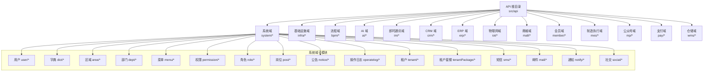
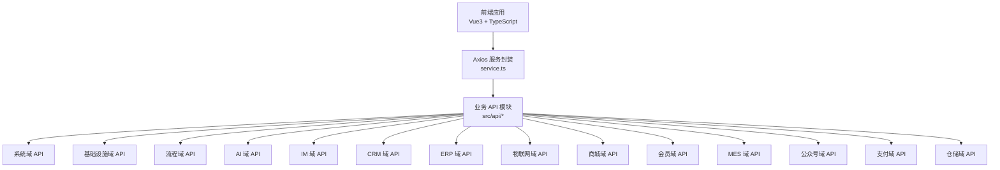
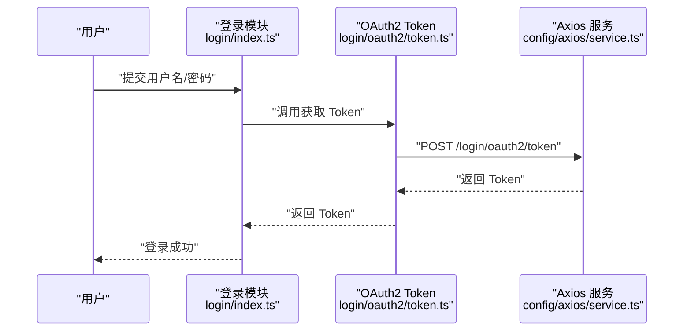
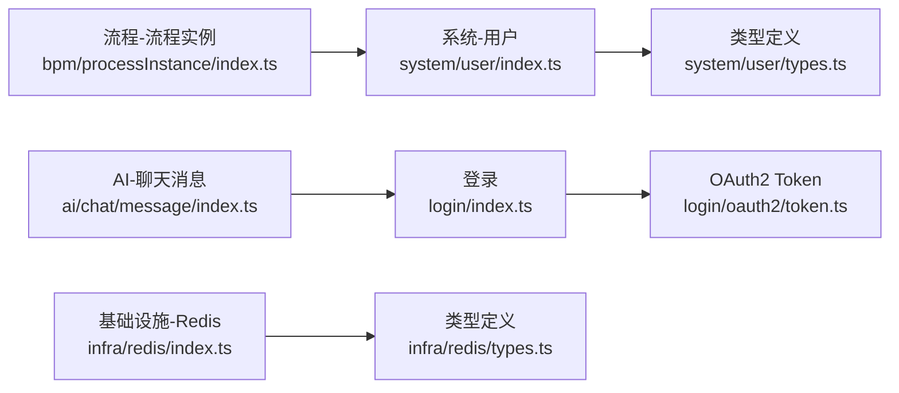

# API 模块化封装

<cite>
**本文引用的文件**
- [index.ts](file://yudao-ui/yudao-ui-admin-vue3/src/api/system/user/index.ts)
- [types.ts](file://yudao-ui/yudao-ui-admin-vue3/src/api/system/user/types.ts)
- [profile.ts](file://yudao-ui/yudao-ui-admin-vue3/src/api/system/user/profile.ts)
- [socialUser.ts](file://yudao-ui/yudao-ui-admin-vue3/src/api/system/user/socialUser.ts)
- [login.ts](file://yudao-ui/yudao-ui-admin-vue3/src/api/login/index.ts)
- [oauth2.ts](file://yudao-ui/yudao-ui-admin-vue3/src/api/login/oauth2/token.ts)
- [dict.data.ts](file://yudao-ui/yudao-ui-admin-vue3/src/api/system/dict/dict.data.ts)
- [dict.type.ts](file://yudao-ui/yudao-ui-admin-vue3/src/api/system/dict/dict.type.ts)
- [area.ts](file://yudao-ui/yudao-ui-admin-vue3/src/api/system/area/index.ts)
- [dept.ts](file://yudao-ui/yudao-ui-admin-vue3/src/api/system/dept/index.ts)
- [menu.ts](file://yudao-ui/yudao-ui-admin-vue3/src/api/system/menu/index.ts)
- [permission.ts](file://yudao-ui/yudao-ui-admin-vue3/src/api/system/permission/index.ts)
- [role.ts](file://yudao-ui/yudao-ui-admin-vue3/src/api/system/role/index.ts)
- [post.ts](file://yudao-ui/yudao-ui-admin-vue3/src/api/system/post/index.ts)
- [notice.ts](file://yudao-ui/yudao-ui-admin-vue3/src/api/system/notice/index.ts)
- [operatelog.ts](file://yudao-ui/yudao-ui-admin-vue3/src/api/system/operatelog/index.ts)
- [tenant.ts](file://yudao-ui/yudao-ui-admin-vue3/src/api/system/tenant/index.ts)
- [tenantPackage.ts](file://yudao-ui/yudao-ui-admin-vue3/src/api/system/tenantPackage/index.ts)
- [smsChannel.ts](file://yudao-ui/yudao-ui-admin-vue3/src/api/system/sms/smsChannel/index.ts)
- [smsLog.ts](file://yudao-ui/yudao-ui-admin-vue3/src/api/system/sms/smsLog/index.ts)
- [smsTemplate.ts](file://yudao-ui/yudao-ui-admin-vue3/src/api/system/sms/smsTemplate/index.ts)
- [mailAccount.ts](file://yudao-ui/yudao-ui-admin-vue3/src/api/system/mail/account/index.ts)
- [mailLog.ts](file://yudao-ui/yudao-ui-admin-vue3/src/api/system/mail/log/index.ts)
- [mailTemplate.ts](file://yudao-ui/yudao-ui-admin-vue3/src/api/system/mail/template/index.ts)
- [notifyMessage.ts](file://yudao-ui/yudao-ui-admin-vue3/src/api/system/notify/message/index.ts)
- [notifyTemplate.ts](file://yudao-ui/yudao-ui-admin-vue3/src/api/system/notify/template/index.ts)
- [socialClient.ts](file://yudao-ui/yudao-ui-admin-vue3/src/api/system/social/client/index.ts)
- [socialUser.ts](file://yudao-ui/yudao-ui-admin-vue3/src/api/system/social/user/index.ts)
- [codegen.ts](file://yudao-ui/yudao-ui-admin-vue3/src/api/infra/codegen/index.ts)
- [apiAccessLog.ts](file://yudao-ui/yudao-ui-admin-vue3/src/api/infra/apiAccessLog/index.ts)
- [apiErrorLog.ts](file://yudao-ui/yudao-ui-admin-vue3/src/api/infra/apiErrorLog/index.ts)
- [file.ts](file://yudao-ui/yudao-ui-admin-vue3/src/api/infra/file/index.ts)
- [job.ts](file://yudao-ui/yudao-ui-admin-vue3/src/api/infra/job/index.ts)
- [jobLog.ts](file://yudao-ui/yudao-ui-admin-vue3/src/api/infra/jobLog/index.ts)
- [redis.ts](file://yudao-ui/yudao-ui-admin-vue3/src/api/infra/redis/index.ts)
- [types.ts](file://yudao-ui/yudao-ui-admin-vue3/src/api/infra/redis/types.ts)
- [config.ts](file://yudao-ui/yudao-ui-admin-vue3/src/config/axios/config.ts)
- [service.ts](file://yudao-ui/yudao-ui-admin-vue3/src/config/axios/service.ts)
- [errorCode.ts](file://yudao-ui/yudao-ui-admin-vue3/src/config/axios/errorCode.ts)
- [index.ts](file://yudao-ui/yudao-ui-admin-vue3/src/api/bpm/category/index.ts)
- [definition.ts](file://yudao-ui/yudao-ui-admin-vue3/src/api/bpm/definition/index.ts)
- [processInstance.ts](file://yudao-ui/yudao-ui-admin-vue3/src/api/bpm/processInstance/index.ts)
- [task.ts](file://yudao-ui/yudao-ui-admin-vue3/src/api/bpm/task/index.ts)
- [leave.ts](file://yudao-ui/yudao-ui-admin-vue3/src/api/bpm/leave/index.ts)
- [model.ts](file://yudao-ui/yudao-ui-admin-vue3/src/api/bpm/model/index.ts)
- [processExpression.ts](file://yudao-ui/yudao-ui-admin-vue3/src/api/bpm/processExpression/index.ts)
- [processListener.ts](file://yudao-ui/yudao-ui-admin-vue3/src/api/bpm/processListener/index.ts)
- [simple.ts](file://yudao-ui/yudao-ui-admin-vue3/src/api/bpm/simple/index.ts)
- [userGroup.ts](file://yudao-ui/yudao-ui-admin-vue3/src/api/bpm/userGroup/index.ts)
- [conversation.ts](file://yudao-ui/yudao-ui-admin-vue3/src/api/ai/chat/conversation/index.ts)
- [message.ts](file://yudao-ui/yudao-ui-admin-vue3/src/api/ai/chat/message/index.ts)
- [image.ts](file://yudao-ui/yudao-ui-admin-vue3/src/api/ai/image/index.ts)
- [mindmap.ts](file://yudao-ui/yudao-ui-admin-vue3/src/api/ai/mindmap/index.ts)
- [workflow.ts](file://yudao-ui/yudao-ui-admin-vue3/src/api/ai/workflow/index.ts)
- [write.ts](file://yudao-ui/yudao-ui-admin-vue3/src/api/ai/write/index.ts)
- [knowledgeDocument.ts](file://yudao-ui/yudao-ui-admin-vue3/src/api/ai/knowledge/document/index.ts)
- [knowledgeKnowledge.ts](file://yudao-ui/yudao-ui-admin-vue3/src/api/ai/knowledge/knowledge/index.ts)
- [knowledgeSegment.ts](file://yudao-ui/yudao-ui-admin-vue3/src/api/ai/knowledge/segment/index.ts)
- [modelApiKey.ts](file://yudao-ui/yudao-ui-admin-vue3/src/api/ai/model/apiKey/index.ts)
- [modelChatRole.ts](file://yudao-ui/yudao-ui-admin-vue3/src/api/ai/model/chatRole/index.ts)
- [modelModel.ts](file://yudao-ui/yudao-ui-admin-vue3/src/api/ai/model/model/index.ts)
- [modelTool.ts](file://yudao-ui/yudao-ui-admin-vue3/src/api/ai/model/tool/index.ts)
- [music.ts](file://yudao-ui/yudao-ui-admin-vue3/src/api/ai/music/index.ts)
- [channelMaterial.ts](file://yudao-ui/yudao-ui-admin-vue3/src/api/im/channel/material/index.ts)
- [facePack.ts](file://yudao-ui/yudao-ui-admin-vue3/src/api/im/face/pack/index.ts)
- [faceUseritem.ts](file://yudao-ui/yudao-ui-admin-vue3/src/api/im/face/useritem/index.ts)
- [friendRequest.ts](file://yudao-ui/yudao-ui-admin-vue3/src/api/im/friend/request/index.ts)
- [groupMember.ts](file://yudao-ui/yudao-ui-admin-vue3/src/api/im/group/member/index.ts)
- [groupRequest.ts](file://yudao-ui/yudao-ui-admin-vue3/src/api/im/group/request/index.ts)
- [managerChannel.ts](file://yudao-ui/yudao-ui-admin-vue3/src/api/im/manager/channel/index.ts)
- [managerFace.ts](file://yudao-ui/yudao-ui-admin-vue3/src/api/im/manager/face/index.ts)
- [managerFriend.ts](file://yudao-ui/yudao-ui-admin-vue3/src/api/im/manager/friend/index.ts)
- [managerGroup.ts](file://yudao-ui/yudao-ui-admin-vue3/src/api/im/manager/group/index.ts)
- [managerMessage.ts](file://yudao-ui/yudao-ui-admin-vue3/src/api/im/manager/message/index.ts)
- [managerRtc.ts](file://yudao-ui/yudao-ui-admin-vue3/src/api/im/manager/rtc/index.ts)
- [managerSensitiveWord.ts](file://yudao-ui/yudao-ui-admin-vue3/src/api/im/manager/sensitiveword/index.ts)
- [managerStatistics.ts](file://yudao-ui/yudao-ui-admin-vue3/src/api/im/manager/statistics/index.ts)
- [messageChannel.ts](file://yudao-ui/yudao-ui-admin-vue3/src/api/im/message/channel/index.ts)
- [messageGroup.ts](file://yudao-ui/yudao-ui-admin-vue3/src/api/im/message/group/index.ts)
- [messagePrivate.ts](file://yudao-ui/yudao-ui-admin-vue3/src/api/im/message/private/index.ts)
- [rtc.ts](file://yudao-ui/yudao-ui-admin-vue3/src/api/im/rtc/index.ts)
- [demo01.ts](file://yudao-ui/yudao-ui-admin-vue3/src/api/infra/demo/demo01/index.ts)
- [demo02.ts](file://yudao-ui/yudao-ui-admin-vue3/src/api/infra/demo/demo02/index.ts)
- [demo03.ts](file://yudao-ui/yudao-ui-admin-vue3/src/api/infra/demo/demo03/index.ts)
- [business.ts](file://yudao-ui/yudao-ui-admin-vue3/src/api/crm/business/index.ts)
- [clue.ts](file://yudao-ui/yudao-ui-admin-vue3/src/api/crm/clue/index.ts)
- [contact.ts](file://yudao-ui/yudao-ui-admin-vue3/src/api/crm/contact/index.ts)
- [contract.ts](file://yudao-ui/yudao-ui-admin-vue3/src/api/crm/contract/index.ts)
- [customer.ts](file://yudao-ui/yudao-ui-admin-vue3/src/api/crm/customer/index.ts)
- [followup.ts](file://yudao-ui/yudao-ui-admin-vue3/src/api/crm/followup/index.ts)
- [operateLog.ts](file://yudao-ui/yudao-ui-admin-vue3/src/api/crm/operateLog/index.ts)
- [permission.ts](file://yudao-ui/yudao-ui-admin-vue3/src/api/crm/permission/index.ts)
- [product.ts](file://yudao-ui/yudao-ui-admin-vue3/src/api/crm/product/index.ts)
- [receivable.ts](file://yudao-ui/yudao-ui-admin-vue3/src/api/crm/receivable/index.ts)
- [statistics.ts](file://yudao-ui/yudao-ui-admin-vue3/src/api/crm/statistics/index.ts)
- [finance.ts](file://yudao-ui/yudao-ui-admin-vue3/src/api/erp/finance/index.ts)
- [product.ts](file://yudao-ui/yudao-ui-admin-vue3/src/api/erp/product/index.ts)
- [purchase.ts](file://yudao-ui/yudao-ui-admin-vue3/src/api/erp/purchase/index.ts)
- [sale.ts](file://yudao-ui/yudao-ui-admin-vue3/src/api/erp/sale/index.ts)
- [statistics.ts](file://yudao-ui/yudao-ui-admin-vue3/src/api/erp/statistics/index.ts)
- [stock.ts](file://yudao-ui/yudao-ui-admin-vue3/src/api/erp/stock/index.ts)
- [alert.ts](file://yudao-ui/yudao-ui-admin-vue3/src/api/iot/alert/index.ts)
- [device.ts](file://yudao-ui/yudao-ui-admin-vue3/src/api/iot/device/index.ts)
- [ota.ts](file://yudao-ui/yudao-ui-admin-vue3/src/api/iot/ota/index.ts)
- [product.ts](file://yudao-ui/yudao-ui-admin-vue3/src/api/iot/product/index.ts)
- [rule.ts](file://yudao-ui/yudao-ui-admin-vue3/src/api/iot/rule/index.ts)
- [statistics.ts](file://yudao-ui/yudao-ui-admin-vue3/src/api/iot/statistics/index.ts)
- [thingModel.ts](file://yudao-ui/yudao-ui-admin-vue3/src/api/iot/thingmodel/index.ts)
- [banner.ts](file://yudao-ui/yudao-ui-admin-vue3/src/api/mall/market/banner/index.ts)
- [product.ts](file://yudao-ui/yudao-ui-admin-vue3/src/api/mall/product/index.ts)
- [promotion.ts](file://yudao-ui/yudao-ui-admin-vue3/src/api/mall/promotion/index.ts)
- [statistics.ts](file://yudao-ui/yudao-ui-admin-vue3/src/api/mall/statistics/index.ts)
- [trade.ts](file://yudao-ui/yudao-ui-admin-vue3/src/api/mall/trade/index.ts)
- [address.ts](file://yudao-ui/yudao-ui-admin-vue3/src/api/member/address/index.ts)
- [config.ts](file://yudao-ui/yudao-ui-admin-vue3/src/api/member/config/index.ts)
- [experienceRecord.ts](file://yudao-ui/yudao-ui-admin-vue3/src/api/member/experience-record/index.ts)
- [group.ts](file://yudao-ui/yudao-ui-admin-vue3/src/api/member/group/index.ts)
- [level.ts](file://yudao-ui/yudao-ui-admin-vue3/src/api/member/level/index.ts)
- [pointRecord.ts](file://yudao-ui/yudao-ui-admin-vue3/src/api/member/point/record/index.ts)
- [signin.ts](file://yudao-ui/yudao-ui-admin-vue3/src/api/member/signin/index.ts)
- [tag.ts](file://yudao-ui/yudao-ui-admin-vue3/src/api/member/tag/index.ts)
- [user.ts](file://yudao-ui/yudao-ui-admin-vue3/src/api/member/user/index.ts)
- [cal.ts](file://yudao-ui/yudao-ui-admin-vue3/src/api/mes/cal/index.ts)
- [dv.ts](file://yudao-ui/yudao-ui-admin-vue3/src/api/mes/dv/index.ts)
- [home.ts](file://yudao-ui/yudao-ui-admin-vue3/src/api/mes/home/index.ts)
- [md.ts](file://yudao-ui/yudao-ui-admin-vue3/src/api/mes/md/index.ts)
- [pro.ts](file://yudao-ui/yudao-ui-admin-vue3/src/api/mes/pro/index.ts)
- [qc.ts](file://yudao-ui/yudao-ui-admin-vue3/src/api/mes/qc/index.ts)
- [tmTool.ts](file://yudao-ui/yudao-ui-admin-vue3/src/api/mes/tm/tool/index.ts)
- [wm.ts](file://yudao-ui/yudao-ui-admin-vue3/src/api/mes/wm/index.ts)
- [account.ts](file://yudao-ui/yudao-ui-admin-vue3/src/api/mp/account/index.ts)
- [autoReply.ts](file://yudao-ui/yudao-ui-admin-vue3/src/api/mp/autoReply/index.ts)
- [draft.ts](file://yudao-ui/yudao-ui-admin-vue3/src/api/mp/draft/index.ts)
- [freePublish.ts](file://yudao-ui/yudao-ui-admin-vue3/src/api/mp/freePublish/index.ts)
- [material.ts](file://yudao-ui/yudao-ui-admin-vue3/src/api/mp/material/index.ts)
- [menu.ts](file://yudao-ui/yudao-ui-admin-vue3/src/api/mp/menu/index.ts)
- [message.ts](file://yudao-ui/yudao-ui-admin-vue3/src/api/mp/message/index.ts)
- [messageTemplate.ts](file://yudao-ui/yudao-ui-admin-vue3/src/api/mp/messageTemplate/index.ts)
- [statistics.ts](file://yudao-ui/yudao-ui-admin-vue3/src/api/mp/statistics/index.ts)
- [tag.ts](file://yudao-ui/yudao-ui-admin-vue3/src/api/mp/tag/index.ts)
- [user.ts](file://yudao-ui/yudao-ui-admin-vue3/src/api/mp/user/index.ts)
- [app.ts](file://yudao-ui/yudao-ui-admin-vue3/src/api/pay/app/index.ts)
- [channel.ts](file://yudao-ui/yudao-ui-admin-vue3/src/api/pay/channel/index.ts)
- [demo.ts](file://yudao-ui/yudao-ui-admin-vue3/src/api/pay/demo/index.ts)
- [notify.ts](file://yudao-ui/yudao-ui-admin-vue3/src/api/pay/notify/index.ts)
- [order.ts](file://yudao-ui/yudao-ui-admin-vue3/src/api/pay/order/index.ts)
- [refund.ts](file://yudao-ui/yudao-ui-admin-vue3/src/api/pay/refund/index.ts)
- [transfer.ts](file://yudao-ui/yudao-ui-admin-vue3/src/api/pay/transfer/index.ts)
- [wallet.ts](file://yudao-ui/yudao-ui-admin-vue3/src/api/pay/wallet/index.ts)
- [home.ts](file://yudao-ui/yudao-ui-admin-vue3/src/api/wms/home/index.ts)
- [inventory.ts](file://yudao-ui/yudao-ui-admin-vue3/src/api/wms/inventory/index.ts)
- [md.ts](file://yudao-ui/yudao-ui-admin-vue3/src/api/wms/md/index.ts)
- [order.ts](file://yudao-ui/yudao-ui-admin-vue3/src/api/wms/order/index.ts)
</cite>

## 目录
1. [简介](#简介)
2. [项目结构](#项目结构)
3. [核心组件](#核心组件)
4. [架构总览](#架构总览)
5. [详细组件分析](#详细组件分析)
6. [依赖关系分析](#依赖关系分析)
7. [性能考虑](#性能考虑)
8. [故障排查指南](#故障排查指南)
9. [结论](#结论)
10. [附录](#附录)

## 简介
本文件面向“芋道 ruoyi-vue-pro”前端工程，系统化梳理 API 模块化封装方案。重点覆盖：
- 按业务域划分的 API 目录结构与命名规范
- 各模块 CRUD、列表查询与复杂业务接口的封装策略
- 参数校验与 TypeScript 类型约束最佳实践
- 模块间 API 调用与依赖管理
- API 版本管理与向后兼容
- 可复用的代码示例与调试技巧

## 项目结构
前端 API 层位于 yudao-ui/yudao-ui-admin-vue3/src/api 下，采用“按业务域分层 + 按功能模块细分”的两级目录结构：
- 一级：按业务域划分（如 system、infra、bpm、ai、im、crm、erp、iot、mall、member、mes、mp、pay、wms）
- 二级：按具体资源或领域功能细分（如 system/user、infra/codegen、bpm/processInstance）

该结构便于：
- 明确职责边界，降低耦合
- 统一参数校验与响应处理
- 提升可维护性与可扩展性

图表来源
- [index.ts](file://yudao-ui/yudao-ui-admin-vue3/src/api/system/user/index.ts)
- [index.ts](file://yudao-ui/yudao-ui-admin-vue3/src/api/system/dict/dict.data.ts)
- [index.ts](file://yudao-ui/yudao-ui-admin-vue3/src/api/system/area/index.ts)
- [index.ts](file://yudao-ui/yudao-ui-admin-vue3/src/api/system/dept/index.ts)
- [index.ts](file://yudao-ui/yudao-ui-admin-vue3/src/api/system/menu/index.ts)
- [index.ts](file://yudao-ui/yudao-ui-admin-vue3/src/api/system/permission/index.ts)
- [index.ts](file://yudao-ui/yudao-ui-admin-vue3/src/api/system/role/index.ts)
- [index.ts](file://yudao-ui/yudao-ui-admin-vue3/src/api/system/post/index.ts)
- [index.ts](file://yudao-ui/yudao-ui-admin-vue3/src/api/system/notice/index.ts)
- [index.ts](file://yudao-ui/yudao-ui-admin-vue3/src/api/system/operatelog/index.ts)
- [index.ts](file://yudao-ui/yudao-ui-admin-vue3/src/api/system/tenant/index.ts)
- [index.ts](file://yudao-ui/yudao-ui-admin-vue3/src/api/system/tenantPackage/index.ts)
- [index.ts](file://yudao-ui/yudao-ui-admin-vue3/src/api/system/sms/smsChannel/index.ts)
- [index.ts](file://yudao-ui/yudao-ui-admin-vue3/src/api/system/sms/smsLog/index.ts)
- [index.ts](file://yudao-ui/yudao-ui-admin-vue3/src/api/system/sms/smsTemplate/index.ts)
- [index.ts](file://yudao-ui/yudao-ui-admin-vue3/src/api/system/mail/account/index.ts)
- [index.ts](file://yudao-ui/yudao-ui-admin-vue3/src/api/system/mail/log/index.ts)
- [index.ts](file://yudao-ui/yudao-ui-admin-vue3/src/api/system/mail/template/index.ts)
- [index.ts](file://yudao-ui/yudao-ui-admin-vue3/src/api/system/notify/message/index.ts)
- [index.ts](file://yudao-ui/yudao-ui-admin-vue3/src/api/system/notify/template/index.ts)
- [index.ts](file://yudao-ui/yudao-ui-admin-vue3/src/api/system/social/client/index.ts)
- [index.ts](file://yudao-ui/yudao-ui-admin-vue3/src/api/system/social/user/index.ts)

章节来源
- [index.ts](file://yudao-ui/yudao-ui-admin-vue3/src/api/system/user/index.ts)
- [index.ts](file://yudao-ui/yudao-ui-admin-vue3/src/api/system/dict/dict.data.ts)
- [index.ts](file://yudao-ui/yudao-ui-admin-vue3/src/api/system/area/index.ts)
- [index.ts](file://yudao-ui/yudao-ui-admin-vue3/src/api/system/dept/index.ts)
- [index.ts](file://yudao-ui/yudao-ui-admin-vue3/src/api/system/menu/index.ts)
- [index.ts](file://yudao-ui/yudao-ui-admin-vue3/src/api/system/permission/index.ts)
- [index.ts](file://yudao-ui/yudao-ui-admin-vue3/src/api/system/role/index.ts)
- [index.ts](file://yudao-ui/yudao-ui-admin-vue3/src/api/system/post/index.ts)
- [index.ts](file://yudao-ui/yudao-ui-admin-vue3/src/api/system/notice/index.ts)
- [index.ts](file://yudao-ui/yudao-ui-admin-vue3/src/api/system/operatelog/index.ts)
- [index.ts](file://yudao-ui/yudao-ui-admin-vue3/src/api/system/tenant/index.ts)
- [index.ts](file://yudao-ui/yudao-ui-admin-vue3/src/api/system/tenantPackage/index.ts)
- [index.ts](file://yudao-ui/yudao-ui-admin-vue3/src/api/system/sms/smsChannel/index.ts)
- [index.ts](file://yudao-ui/yudao-ui-admin-vue3/src/api/system/sms/smsLog/index.ts)
- [index.ts](file://yudao-ui/yudao-ui-admin-vue3/src/api/system/sms/smsTemplate/index.ts)
- [index.ts](file://yudao-ui/yudao-ui-admin-vue3/src/api/system/mail/account/index.ts)
- [index.ts](file://yudao-ui/yudao-ui-admin-vue3/src/api/system/mail/log/index.ts)
- [index.ts](file://yudao-ui/yudao-ui-admin-vue3/src/api/system/mail/template/index.ts)
- [index.ts](file://yudao-ui/yudao-ui-admin-vue3/src/api/system/notify/message/index.ts)
- [index.ts](file://yudao-ui/yudao-ui-admin-vue3/src/api/system/notify/template/index.ts)
- [index.ts](file://yudao-ui/yudao-ui-admin-vue3/src/api/system/social/client/index.ts)
- [index.ts](file://yudao-ui/yudao-ui-admin-vue3/src/api/system/social/user/index.ts)

## 核心组件
- Axios 服务封装：统一请求拦截、错误码映射、超时与重试策略
- 模块化 API 文件：每个资源一个 index.ts，集中导出 CRUD 方法与类型
- 类型定义：每个模块配套 types.ts，确保参数与响应强类型约束
- 登录与鉴权：登录相关 API 与 OAuth2 Token 管理
- 基础设施与运维：代码生成、访问日志、作业调度、Redis 等

章节来源
- [config.ts](file://yudao-ui/yudao-ui-admin-vue3/src/config/axios/config.ts)
- [service.ts](file://yudao-ui/yudao-ui-admin-vue3/src/config/axios/service.ts)
- [errorCode.ts](file://yudao-ui/yudao-ui-admin-vue3/src/config/axios/errorCode.ts)

## 架构总览
前端 API 层通过 Axios 服务进行统一请求，各业务模块在 src/api 下按域/功能组织，形成清晰的“域-功能-接口”三层结构。

图表来源
- [service.ts](file://yudao-ui/yudao-ui-admin-vue3/src/config/axios/service.ts)
- [index.ts](file://yudao-ui/yudao-ui-admin-vue3/src/api/system/user/index.ts)
- [index.ts](file://yudao-ui/yudao-ui-admin-vue3/src/api/infra/codegen/index.ts)
- [index.ts](file://yudao-ui/yudao-ui-admin-vue3/src/api/bpm/processInstance/index.ts)
- [index.ts](file://yudao-ui/yudao-ui-admin-vue3/src/api/ai/chat/conversation/index.ts)
- [index.ts](file://yudao-ui/yudao-ui-admin-vue3/src/api/im/message/channel/index.ts)
- [index.ts](file://yudao-ui/yudao-ui-admin-vue3/src/api/crm/customer/index.ts)
- [index.ts](file://yudao-ui/yudao-ui-admin-vue3/src/api/erp/product/index.ts)
- [index.ts](file://yudao-ui/yudao-ui-admin-vue3/src/api/iot/device/index.ts)
- [index.ts](file://yudao-ui/yudao-ui-admin-vue3/src/api/mall/product/index.ts)
- [index.ts](file://yudao-ui/yudao-ui-admin-vue3/src/api/member/user/index.ts)
- [index.ts](file://yudao-ui/yudao-ui-admin-vue3/src/api/mes/pro/index.ts)
- [index.ts](file://yudao-ui/yudao-ui-admin-vue3/src/api/mp/account/index.ts)
- [index.ts](file://yudao-ui/yudao-ui-admin-vue3/src/api/pay/order/index.ts)
- [index.ts](file://yudao-ui/yudao-ui-admin-vue3/src/api/wms/order/index.ts)

## 详细组件分析

### 系统域 API 封装
系统域涵盖用户、字典、区域、部门、菜单、权限、角色、岗位、公告、操作日志、租户、租户套餐、短信、邮件、通知、社交等。

- 用户模块
  - 文件：src/api/system/user/index.ts、profile.ts、socialUser.ts
  - 能力：用户 CRUD、个人资料、社交账号绑定等
  - 类型：src/api/system/user/types.ts
  - 示例路径：[用户列表查询](file://yudao-ui/yudao-ui-admin-vue3/src/api/system/user/index.ts)，[用户类型定义](file://yudao-ui/yudao-ui-admin-vue3/src/api/system/user/types.ts)

- 字典模块
  - 文件：src/api/system/dict/dict.data.ts、dict.type.ts
  - 能力：字典数据与类型的增删改查
  - 示例路径：[字典数据](file://yudao-ui/yudao-ui-admin-vue3/src/api/system/dict/dict.data.ts)，[字典类型](file://yudao-ui/yudao-ui-admin-vue3/src/api/system/dict/dict.type.ts)

- 区域、部门、菜单、权限、角色、岗位、公告、操作日志、租户、租户套餐
  - 文件：对应 index.ts
  - 示例路径：[区域](file://yudao-ui/yudao-ui-admin-vue3/src/api/system/area/index.ts)，[部门](file://yudao-ui/yudao-ui-admin-vue3/src/api/system/dept/index.ts)，[菜单](file://yudao-ui/yudao-ui-admin-vue3/src/api/system/menu/index.ts)，[权限](file://yudao-ui/yudao-ui-admin-vue3/src/api/system/permission/index.ts)，[角色](file://yudao-ui/yudao-ui-admin-vue3/src/api/system/role/index.ts)，[岗位](file://yudao-ui/yudao-ui-admin-vue3/src/api/system/post/index.ts)，[公告](file://yudao-ui/yudao-ui-admin-vue3/src/api/system/notice/index.ts)，[操作日志](file://yudao-ui/yudao-ui-admin-vue3/src/api/system/operatelog/index.ts)，[租户](file://yudao-ui/yudao-ui-admin-vue3/src/api/system/tenant/index.ts)，[租户套餐](file://yudao-ui/yudao-ui-admin-vue3/src/api/system/tenantPackage/index.ts)

- 短信、邮件、通知、社交
  - 文件：对应 index.ts 或子目录下的 index.ts
  - 示例路径：[短信通道](file://yudao-ui/yudao-ui-admin-vue3/src/api/system/sms/smsChannel/index.ts)，[短信日志](file://yudao-ui/yudao-ui-admin-vue3/src/api/system/sms/smsLog/index.ts)，[短信模板](file://yudao-ui/yudao-ui-admin-vue3/src/api/system/sms/smsTemplate/index.ts)，[邮件账户](file://yudao-ui/yudao-ui-admin-vue3/src/api/system/mail/account/index.ts)，[邮件日志](file://yudao-ui/yudao-ui-admin-vue3/src/api/system/mail/log/index.ts)，[邮件模板](file://yudao-ui/yudao-ui-admin-vue3/src/api/system/mail/template/index.ts)，[通知消息](file://yudao-ui/yudao-ui-admin-vue3/src/api/system/notify/message/index.ts)，[通知模板](file://yudao-ui/yudao-ui-admin-vue3/src/api/system/notify/template/index.ts)，[社交客户端](file://yudao-ui/yudao-ui-admin-vue3/src/api/system/social/client/index.ts)，[社交用户](file://yudao-ui/yudao-ui-admin-vue3/src/api/system/social/user/index.ts)

章节来源
- [index.ts](file://yudao-ui/yudao-ui-admin-vue3/src/api/system/user/index.ts)
- [types.ts](file://yudao-ui/yudao-ui-admin-vue3/src/api/system/user/types.ts)
- [profile.ts](file://yudao-ui/yudao-ui-admin-vue3/src/api/system/user/profile.ts)
- [socialUser.ts](file://yudao-ui/yudao-ui-admin-vue3/src/api/system/user/socialUser.ts)
- [dict.data.ts](file://yudao-ui/yudao-ui-admin-vue3/src/api/system/dict/dict.data.ts)
- [dict.type.ts](file://yudao-ui/yudao-ui-admin-vue3/src/api/system/dict/dict.type.ts)
- [area.ts](file://yudao-ui/yudao-ui-admin-vue3/src/api/system/area/index.ts)
- [dept.ts](file://yudao-ui/yudao-ui-admin-vue3/src/api/system/dept/index.ts)
- [menu.ts](file://yudao-ui/yudao-ui-admin-vue3/src/api/system/menu/index.ts)
- [permission.ts](file://yudao-ui/yudao-ui-admin-vue3/src/api/system/permission/index.ts)
- [role.ts](file://yudao-ui/yudao-ui-admin-vue3/src/api/system/role/index.ts)
- [post.ts](file://yudao-ui/yudao-ui-admin-vue3/src/api/system/post/index.ts)
- [notice.ts](file://yudao-ui/yudao-ui-admin-vue3/src/api/system/notice/index.ts)
- [operatelog.ts](file://yudao-ui/yudao-ui-admin-vue3/src/api/system/operatelog/index.ts)
- [tenant.ts](file://yudao-ui/yudao-ui-admin-vue3/src/api/system/tenant/index.ts)
- [tenantPackage.ts](file://yudao-ui/yudao-ui-admin-vue3/src/api/system/tenantPackage/index.ts)
- [smsChannel.ts](file://yudao-ui/yudao-ui-admin-vue3/src/api/system/sms/smsChannel/index.ts)
- [smsLog.ts](file://yudao-ui/yudao-ui-admin-vue3/src/api/system/sms/smsLog/index.ts)
- [smsTemplate.ts](file://yudao-ui/yudao-ui-admin-vue3/src/api/system/sms/smsTemplate/index.ts)
- [mailAccount.ts](file://yudao-ui/yudao-ui-admin-vue3/src/api/system/mail/account/index.ts)
- [mailLog.ts](file://yudao-ui/yudao-ui-admin-vue3/src/api/system/mail/log/index.ts)
- [mailTemplate.ts](file://yudao-ui/yudao-ui-admin-vue3/src/api/system/mail/template/index.ts)
- [notifyMessage.ts](file://yudao-ui/yudao-ui-admin-vue3/src/api/system/notify/message/index.ts)
- [notifyTemplate.ts](file://yudao-ui/yudao-ui-admin-vue3/src/api/system/notify/template/index.ts)
- [socialClient.ts](file://yudao-ui/yudao-ui-admin-vue3/src/api/system/social/client/index.ts)
- [socialUser.ts](file://yudao-ui/yudao-ui-admin-vue3/src/api/system/social/user/index.ts)

### 登录与鉴权 API
- 登录入口：src/api/login/index.ts
- OAuth2 Token：src/api/login/oauth2/token.ts
- 类型：src/api/login/types.ts

图表来源
- [login.ts](file://yudao-ui/yudao-ui-admin-vue3/src/api/login/index.ts)
- [oauth2.ts](file://yudao-ui/yudao-ui-admin-vue3/src/api/login/oauth2/token.ts)
- [service.ts](file://yudao-ui/yudao-ui-admin-vue3/src/config/axios/service.ts)

章节来源
- [login.ts](file://yudao-ui/yudao-ui-admin-vue3/src/api/login/index.ts)
- [oauth2.ts](file://yudao-ui/yudao-ui-admin-vue3/src/api/login/oauth2/token.ts)
- [types.ts](file://yudao-ui/yudao-ui-admin-vue3/src/api/login/types.ts)

### 基础设施域 API
- 代码生成：src/api/infra/codegen/index.ts
- 访问日志：src/api/infra/apiAccessLog/index.ts
- 错误日志：src/api/infra/apiErrorLog/index.ts
- 文件：src/api/infra/file/index.ts
- 作业：src/api/infra/job/index.ts
- 作业日志：src/api/infra/jobLog/index.ts
- Redis：src/api/infra/redis/index.ts、types.ts

章节来源
- [codegen.ts](file://yudao-ui/yudao-ui-admin-vue3/src/api/infra/codegen/index.ts)
- [apiAccessLog.ts](file://yudao-ui/yudao-ui-admin-vue3/src/api/infra/apiAccessLog/index.ts)
- [apiErrorLog.ts](file://yudao-ui/yudao-ui-admin-vue3/src/api/infra/apiErrorLog/index.ts)
- [file.ts](file://yudao-ui/yudao-ui-admin-vue3/src/api/infra/file/index.ts)
- [job.ts](file://yudao-ui/yudao-ui-admin-vue3/src/api/infra/job/index.ts)
- [jobLog.ts](file://yudao-ui/yudao-ui-admin-vue3/src/api/infra/jobLog/index.ts)
- [redis.ts](file://yudao-ui/yudao-ui-admin-vue3/src/api/infra/redis/index.ts)
- [types.ts](file://yudao-ui/yudao-ui-admin-vue3/src/api/infra/redis/types.ts)

### 流程域 API
- 流程分类：src/api/bpm/category/index.ts
- 流程定义：src/api/bpm/definition/index.ts
- 请假流程：src/api/bpm/leave/index.ts
- 流程实例：src/api/bpm/processInstance/index.ts
- 流程监听器：src/api/bpm/processListener/index.ts
- 流程表达式：src/api/bpm/processExpression/index.ts
- 流程模型：src/api/bpm/model/index.ts
- 简化流程：src/api/bpm/simple/index.ts
- 用户组：src/api/bpm/userGroup/index.ts
- 任务：src/api/bpm/task/index.ts

章节来源
- [index.ts](file://yudao-ui/yudao-ui-admin-vue3/src/api/bpm/category/index.ts)
- [definition.ts](file://yudao-ui/yudao-ui-admin-vue3/src/api/bpm/definition/index.ts)
- [leave.ts](file://yudao-ui/yudao-ui-admin-vue3/src/api/bpm/leave/index.ts)
- [processInstance.ts](file://yudao-ui/yudao-ui-admin-vue3/src/api/bpm/processInstance/index.ts)
- [processListener.ts](file://yudao-ui/yudao-ui-admin-vue3/src/api/bpm/processListener/index.ts)
- [processExpression.ts](file://yudao-ui/yudao-ui-admin-vue3/src/api/bpm/processExpression/index.ts)
- [model.ts](file://yudao-ui/yudao-ui-admin-vue3/src/api/bpm/model/index.ts)
- [simple.ts](file://yudao-ui/yudao-ui-admin-vue3/src/api/bpm/simple/index.ts)
- [userGroup.ts](file://yudao-ui/yudao-ui-admin-vue3/src/api/bpm/userGroup/index.ts)
- [task.ts](file://yudao-ui/yudao-ui-admin-vue3/src/api/bpm/task/index.ts)

### AI 域 API
- 聊天对话：src/api/ai/chat/conversation/index.ts
- 聊天消息：src/api/ai/chat/message/index.ts
- 图像：src/api/ai/image/index.ts
- 思维导图：src/api/ai/mindmap/index.ts
- 工作流：src/api/ai/workflow/index.ts
- 写作：src/api/ai/write/index.ts
- 知识库文档：src/api/ai/knowledge/document/index.ts
- 知识库知识：src/api/ai/knowledge/knowledge/index.ts
- 知识库分段：src/api/ai/knowledge/segment/index.ts
- 模型 API Key：src/api/ai/model/apiKey/index.ts
- 模型聊天角色：src/api/ai/model/chatRole/index.ts
- 模型：src/api/ai/model/model/index.ts
- 模型工具：src/api/ai/model/tool/index.ts
- 音乐：src/api/ai/music/index.ts

章节来源
- [conversation.ts](file://yudao-ui/yudao-ui-admin-vue3/src/api/ai/chat/conversation/index.ts)
- [message.ts](file://yudao-ui/yudao-ui-admin-vue3/src/api/ai/chat/message/index.ts)
- [image.ts](file://yudao-ui/yudao-ui-admin-vue3/src/api/ai/image/index.ts)
- [mindmap.ts](file://yudao-ui/yudao-ui-admin-vue3/src/api/ai/mindmap/index.ts)
- [workflow.ts](file://yudao-ui/yudao-ui-admin-vue3/src/api/ai/workflow/index.ts)
- [write.ts](file://yudao-ui/yudao-ui-admin-vue3/src/api/ai/write/index.ts)
- [knowledgeDocument.ts](file://yudao-ui/yudao-ui-admin-vue3/src/api/ai/knowledge/document/index.ts)
- [knowledgeKnowledge.ts](file://yudao-ui/yudao-ui-admin-vue3/src/api/ai/knowledge/knowledge/index.ts)
- [knowledgeSegment.ts](file://yudao-ui/yudao-ui-admin-vue3/src/api/ai/knowledge/segment/index.ts)
- [modelApiKey.ts](file://yudao-ui/yudao-ui-admin-vue3/src/api/ai/model/apiKey/index.ts)
- [modelChatRole.ts](file://yudao-ui/yudao-ui-admin-vue3/src/api/ai/model/chatRole/index.ts)
- [modelModel.ts](file://yudao-ui/yudao-ui-admin-vue3/src/api/ai/model/model/index.ts)
- [modelTool.ts](file://yudao-ui/yudao-ui-admin-vue3/src/api/ai/model/tool/index.ts)
- [music.ts](file://yudao-ui/yudao-ui-admin-vue3/src/api/ai/music/index.ts)

### 即时通讯域 API
- 频道素材：src/api/im/channel/material/index.ts
- 表情包：src/api/im/face/pack/index.ts
- 表情用户项：src/api/im/face/useritem/index.ts
- 好友请求：src/api/im/friend/request/index.ts
- 群成员：src/api/im/group/member/index.ts
- 群请求：src/api/im/group/request/index.ts
- 管理员频道：src/api/im/manager/channel/index.ts
- 管理员表情：src/api/im/manager/face/index.ts
- 管理员好友：src/api/im/manager/friend/index.ts
- 管理员群组：src/api/im/manager/group/index.ts
- 管理员消息：src/api/im/manager/message/index.ts
- 管理员 RTC：src/api/im/manager/rtc/index.ts
- 敏感词：src/api/im/manager/sensitiveword/index.ts
- 统计：src/api/im/manager/statistics/index.ts
- 频道消息：src/api/im/message/channel/index.ts
- 群消息：src/api/im/message/group/index.ts
- 私聊消息：src/api/im/message/private/index.ts
- RTC：src/api/im/rtc/index.ts

章节来源
- [channelMaterial.ts](file://yudao-ui/yudao-ui-admin-vue3/src/api/im/channel/material/index.ts)
- [facePack.ts](file://yudao-ui/yudao-ui-admin-vue3/src/api/im/face/pack/index.ts)
- [faceUseritem.ts](file://yudao-ui/yudao-ui-admin-vue3/src/api/im/face/useritem/index.ts)
- [friendRequest.ts](file://yudao-ui/yudao-ui-admin-vue3/src/api/im/friend/request/index.ts)
- [groupMember.ts](file://yudao-ui/yudao-ui-admin-vue3/src/api/im/group/member/index.ts)
- [groupRequest.ts](file://yudao-ui/yudao-ui-admin-vue3/src/api/im/group/request/index.ts)
- [managerChannel.ts](file://yudao-ui/yudao-ui-admin-vue3/src/api/im/manager/channel/index.ts)
- [managerFace.ts](file://yudao-ui/yudao-ui-admin-vue3/src/api/im/manager/face/index.ts)
- [managerFriend.ts](file://yudao-ui/yudao-ui-admin-vue3/src/api/im/manager/friend/index.ts)
- [managerGroup.ts](file://yudao-ui/yudao-ui-admin-vue3/src/api/im/manager/group/index.ts)
- [managerMessage.ts](file://yudao-ui/yudao-ui-admin-vue3/src/api/im/manager/message/index.ts)
- [managerRtc.ts](file://yudao-ui/yudao-ui-admin-vue3/src/api/im/manager/rtc/index.ts)
- [managerSensitiveWord.ts](file://yudao-ui/yudao-ui-admin-vue3/src/api/im/manager/sensitiveword/index.ts)
- [managerStatistics.ts](file://yudao-ui/yudao-ui-admin-vue3/src/api/im/manager/statistics/index.ts)
- [messageChannel.ts](file://yudao-ui/yudao-ui-admin-vue3/src/api/im/message/channel/index.ts)
- [messageGroup.ts](file://yudao-ui/yudao-ui-admin-vue3/src/api/im/message/group/index.ts)
- [messagePrivate.ts](file://yudao-ui/yudao-ui-admin-vue3/src/api/im/message/private/index.ts)
- [rtc.ts](file://yudao-ui/yudao-ui-admin-vue3/src/api/im/rtc/index.ts)

### CRM 域 API
- 业务：src/api/crm/business/index.ts
- 线索：src/api/crm/clue/index.ts
- 联系人：src/api/crm/contact/index.ts
- 合同：src/api/crm/contract/index.ts
- 客户：src/api/crm/customer/index.ts
- 跟进：src/api/crm/followup/index.ts
- 操作日志：src/api/crm/operateLog/index.ts
- 权限：src/api/crm/permission/index.ts
- 产品：src/api/crm/product/index.ts
- 应收账款：src/api/crm/receivable/index.ts
- 统计：src/api/crm/statistics/index.ts

章节来源
- [business.ts](file://yudao-ui/yudao-ui-admin-vue3/src/api/crm/business/index.ts)
- [clue.ts](file://yudao-ui/yudao-ui-admin-vue3/src/api/crm/clue/index.ts)
- [contact.ts](file://yudao-ui/yudao-ui-admin-vue3/src/api/crm/contact/index.ts)
- [contract.ts](file://yudao-ui/yudao-ui-admin-vue3/src/api/crm/contract/index.ts)
- [customer.ts](file://yudao-ui/yudao-ui-admin-vue3/src/api/crm/customer/index.ts)
- [followup.ts](file://yudao-ui/yudao-ui-admin-vue3/src/api/crm/followup/index.ts)
- [operateLog.ts](file://yudao-ui/yudao-ui-admin-vue3/src/api/crm/operateLog/index.ts)
- [permission.ts](file://yudao-ui/yudao-ui-admin-vue3/src/api/crm/permission/index.ts)
- [product.ts](file://yudao-ui/yudao-ui-admin-vue3/src/api/crm/product/index.ts)
- [receivable.ts](file://yudao-ui/yudao-ui-admin-vue3/src/api/crm/receivable/index.ts)
- [statistics.ts](file://yudao-ui/yudao-ui-admin-vue3/src/api/crm/statistics/index.ts)

### ERP 域 API
- 财务：src/api/erp/finance/index.ts
- 产品：src/api/erp/product/index.ts
- 采购：src/api/erp/purchase/index.ts
- 销售：src/api/erp/sale/index.ts
- 统计：src/api/erp/statistics/index.ts
- 库存：src/api/erp/stock/index.ts

章节来源
- [finance.ts](file://yudao-ui/yudao-ui-admin-vue3/src/api/erp/finance/index.ts)
- [product.ts](file://yudao-ui/yudao-ui-admin-vue3/src/api/erp/product/index.ts)
- [purchase.ts](file://yudao-ui/yudao-ui-admin-vue3/src/api/erp/purchase/index.ts)
- [sale.ts](file://yudao-ui/yudao-ui-admin-vue3/src/api/erp/sale/index.ts)
- [statistics.ts](file://yudao-ui/yudao-ui-admin-vue3/src/api/erp/statistics/index.ts)
- [stock.ts](file://yudao-ui/yudao-ui-admin-vue3/src/api/erp/stock/index.ts)

### 物联网域 API
- 告警：src/api/iot/alert/index.ts
- 设备：src/api/iot/device/index.ts
- OTA：src/api/iot/ota/index.ts
- 产品：src/api/iot/product/index.ts
- 规则：src/api/iot/rule/index.ts
- 统计：src/api/iot/statistics/index.ts
- 物模型：src/api/iot/thingmodel/index.ts

章节来源
- [alert.ts](file://yudao-ui/yudao-ui-admin-vue3/src/api/iot/alert/index.ts)
- [device.ts](file://yudao-ui/yudao-ui-admin-vue3/src/api/iot/device/index.ts)
- [ota.ts](file://yudao-ui/yudao-ui-admin-vue3/src/api/iot/ota/index.ts)
- [product.ts](file://yudao-ui/yudao-ui-admin-vue3/src/api/iot/product/index.ts)
- [rule.ts](file://yudao-ui/yudao-ui-admin-vue3/src/api/iot/rule/index.ts)
- [statistics.ts](file://yudao-ui/yudao-ui-admin-vue3/src/api/iot/statistics/index.ts)
- [thingModel.ts](file://yudao-ui/yudao-ui-admin-vue3/src/api/iot/thingmodel/index.ts)

### 商城域 API
- 营销：src/api/mall/promotion/index.ts
- 商品：src/api/mall/product/index.ts
- 交易：src/api/mall/trade/index.ts
- 统计：src/api/mall/statistics/index.ts
- 轮播：src/api/mall/market/banner/index.ts

章节来源
- [promotion.ts](file://yudao-ui/yudao-ui-admin-vue3/src/api/mall/promotion/index.ts)
- [product.ts](file://yudao-ui/yudao-ui-admin-vue3/src/api/mall/product/index.ts)
- [trade.ts](file://yudao-ui/yudao-ui-admin-vue3/src/api/mall/trade/index.ts)
- [statistics.ts](file://yudao-ui/yudao-ui-admin-vue3/src/api/mall/statistics/index.ts)
- [banner.ts](file://yudao-ui/yudao-ui-admin-vue3/src/api/mall/market/banner/index.ts)

### 会员域 API
- 地址：src/api/member/address/index.ts
- 配置：src/api/member/config/index.ts
- 经验记录：src/api/member/experience-record/index.ts
- 分组：src/api/member/group/index.ts
- 等级：src/api/member/level/index.ts
- 积分记录：src/api/member/point/record/index.ts
- 签到：src/api/member/signin/index.ts
- 标签：src/api/member/tag/index.ts
- 用户：src/api/member/user/index.ts

章节来源
- [address.ts](file://yudao-ui/yudao-ui-admin-vue3/src/api/member/address/index.ts)
- [config.ts](file://yudao-ui/yudao-ui-admin-vue3/src/api/member/config/index.ts)
- [experienceRecord.ts](file://yudao-ui/yudao-ui-admin-vue3/src/api/member/experience-record/index.ts)
- [group.ts](file://yudao-ui/yudao-ui-admin-vue3/src/api/member/group/index.ts)
- [level.ts](file://yudao-ui/yudao-ui-admin-vue3/src/api/member/level/index.ts)
- [pointRecord.ts](file://yudao-ui/yudao-ui-admin-vue3/src/api/member/point/record/index.ts)
- [signin.ts](file://yudao-ui/yudao-ui-admin-vue3/src/api/member/signin/index.ts)
- [tag.ts](file://yudao-ui/yudao-ui-admin-vue3/src/api/member/tag/index.ts)
- [user.ts](file://yudao-ui/yudao-ui-admin-vue3/src/api/member/user/index.ts)

### 制造执行域 API
- CAL：src/api/mes/cal/index.ts
- DV：src/api/mes/dv/index.ts
- HOME：src/api/mes/home/index.ts
- MD：src/api/mes/md/index.ts
- PRO：src/api/mes/pro/index.ts
- QC：src/api/mes/qc/index.ts
- TM 工具：src/api/mes/tm/tool/index.ts
- WM：src/api/mes/wm/index.ts

章节来源
- [cal.ts](file://yudao-ui/yudao-ui-admin-vue3/src/api/mes/cal/index.ts)
- [dv.ts](file://yudao-ui/yudao-ui-admin-vue3/src/api/mes/dv/index.ts)
- [home.ts](file://yudao-ui/yudao-ui-admin-vue3/src/api/mes/home/index.ts)
- [md.ts](file://yudao-ui/yudao-ui-admin-vue3/src/api/mes/md/index.ts)
- [pro.ts](file://yudao-ui/yudao-ui-admin-vue3/src/api/mes/pro/index.ts)
- [qc.ts](file://yudao-ui/yudao-ui-admin-vue3/src/api/mes/qc/index.ts)
- [tmTool.ts](file://yudao-ui/yudao-ui-admin-vue3/src/api/mes/tm/tool/index.ts)
- [wm.ts](file://yudao-ui/yudao-ui-admin-vue3/src/api/mes/wm/index.ts)

### 公众号域 API
- 账号：src/api/mp/account/index.ts
- 自动回复：src/api/mp/autoReply/index.ts
- 草稿：src/api/mp/draft/index.ts
- 自由发布：src/api/mp/freePublish/index.ts
- 素材：src/api/mp/material/index.ts
- 菜单：src/api/mp/menu/index.ts
- 消息：src/api/mp/message/index.ts
- 消息模板：src/api/mp/messageTemplate/index.ts
- 统计：src/api/mp/statistics/index.ts
- 标签：src/api/mp/tag/index.ts
- 用户：src/api/mp/user/index.ts

章节来源
- [account.ts](file://yudao-ui/yudao-ui-admin-vue3/src/api/mp/account/index.ts)
- [autoReply.ts](file://yudao-ui/yudao-ui-admin-vue3/src/api/mp/autoReply/index.ts)
- [draft.ts](file://yudao-ui/yudao-ui-admin-vue3/src/api/mp/draft/index.ts)
- [freePublish.ts](file://yudao-ui/yudao-ui-admin-vue3/src/api/mp/freePublish/index.ts)
- [material.ts](file://yudao-ui/yudao-ui-admin-vue3/src/api/mp/material/index.ts)
- [menu.ts](file://yudao-ui/yudao-ui-admin-vue3/src/api/mp/menu/index.ts)
- [message.ts](file://yudao-ui/yudao-ui-admin-vue3/src/api/mp/message/index.ts)
- [messageTemplate.ts](file://yudao-ui/yudao-ui-admin-vue3/src/api/mp/messageTemplate/index.ts)
- [statistics.ts](file://yudao-ui/yudao-ui-admin-vue3/src/api/mp/statistics/index.ts)
- [tag.ts](file://yudao-ui/yudao-ui-admin-vue3/src/api/mp/tag/index.ts)
- [user.ts](file://yudao-ui/yudao-ui-admin-vue3/src/api/mp/user/index.ts)

### 支付域 API
- 应用：src/api/pay/app/index.ts
- 渠道：src/api/pay/channel/index.ts
- 演示：src/api/pay/demo/index.ts
- 通知：src/api/pay/notify/index.ts
- 订单：src/api/pay/order/index.ts
- 退款：src/api/pay/refund/index.ts
- 转账：src/api/pay/transfer/index.ts
- 钱包：src/api/pay/wallet/index.ts

章节来源
- [app.ts](file://yudao-ui/yudao-ui-admin-vue3/src/api/pay/app/index.ts)
- [channel.ts](file://yudao-ui/yudao-ui-admin-vue3/src/api/pay/channel/index.ts)
- [demo.ts](file://yudao-ui/yudao-ui-admin-vue3/src/api/pay/demo/index.ts)
- [notify.ts](file://yudao-ui/yudao-ui-admin-vue3/src/api/pay/notify/index.ts)
- [order.ts](file://yudao-ui/yudao-ui-admin-vue3/src/api/pay/order/index.ts)
- [refund.ts](file://yudao-ui/yudao-ui-admin-vue3/src/api/pay/refund/index.ts)
- [transfer.ts](file://yudao-ui/yudao-ui-admin-vue3/src/api/pay/transfer/index.ts)
- [wallet.ts](file://yudao-ui/yudao-ui-admin-vue3/src/api/pay/wallet/index.ts)

### 仓储域 API
- 首页：src/api/wms/home/index.ts
- 库存：src/api/wms/inventory/index.ts
- MD：src/api/wms/md/index.ts
- 订单：src/api/wms/order/index.ts

章节来源
- [home.ts](file://yudao-ui/yudao-ui-admin-vue3/src/api/wms/home/index.ts)
- [inventory.ts](file://yudao-ui/yudao-ui-admin-vue3/src/api/wms/inventory/index.ts)
- [md.ts](file://yudao-ui/yudao-ui-admin-vue3/src/api/wms/md/index.ts)
- [order.ts](file://yudao-ui/yudao-ui-admin-vue3/src/api/wms/order/index.ts)

### 基础设施演示 API
- Demo01：src/api/infra/demo/demo01/index.ts
- Demo02：src/api/infra/demo/demo02/index.ts
- Demo03：src/api/infra/demo/demo03/index.ts

章节来源
- [demo01.ts](file://yudao-ui/yudao-ui-admin-vue3/src/api/infra/demo/demo01/index.ts)
- [demo02.ts](file://yudao-ui/yudao-ui-admin-vue3/src/api/infra/demo/demo02/index.ts)
- [demo03.ts](file://yudao-ui/yudao-ui-admin-vue3/src/api/infra/demo/demo03/index.ts)

## 依赖关系分析
- 模块内依赖：同一业务域内的 API 文件通常相互独立，避免循环依赖
- 跨域调用：通过统一 Axios 服务进行网络请求，减少重复配置
- 类型共享：各模块 types.ts 与 index.ts 成对出现，便于 IDE 类型提示与编译期检查

图表来源
- [index.ts](file://yudao-ui/yudao-ui-admin-vue3/src/api/system/user/index.ts)
- [types.ts](file://yudao-ui/yudao-ui-admin-vue3/src/api/system/user/types.ts)
- [login.ts](file://yudao-ui/yudao-ui-admin-vue3/src/api/login/index.ts)
- [oauth2.ts](file://yudao-ui/yudao-ui-admin-vue3/src/api/login/oauth2/token.ts)
- [redis.ts](file://yudao-ui/yudao-ui-admin-vue3/src/api/infra/redis/index.ts)
- [types.ts](file://yudao-ui/yudao-ui-admin-vue3/src/api/infra/redis/types.ts)
- [processInstance.ts](file://yudao-ui/yudao-ui-admin-vue3/src/api/bpm/processInstance/index.ts)
- [message.ts](file://yudao-ui/yudao-ui-admin-vue3/src/api/ai/chat/message/index.ts)

章节来源
- [index.ts](file://yudao-ui/yudao-ui-admin-vue3/src/api/system/user/index.ts)
- [types.ts](file://yudao-ui/yudao-ui-admin-vue3/src/api/system/user/types.ts)
- [login.ts](file://yudao-ui/yudao-ui-admin-vue3/src/api/login/index.ts)
- [oauth2.ts](file://yudao-ui/yudao-ui-admin-vue3/src/api/login/oauth2/token.ts)
- [redis.ts](file://yudao-ui/yudao-ui-admin-vue3/src/api/infra/redis/index.ts)
- [types.ts](file://yudao-ui/yudao-ui-admin-vue3/src/api/infra/redis/types.ts)
- [processInstance.ts](file://yudao-ui/yudao-ui-admin-vue3/src/api/bpm/processInstance/index.ts)
- [message.ts](file://yudao-ui/yudao-ui-admin-vue3/src/api/ai/chat/message/index.ts)

## 性能考虑
- 请求合并与批量查询：对列表查询支持分页与过滤，避免一次性拉取大量数据
- 缓存策略：结合前端状态管理与本地缓存，减少重复请求
- 错误重试：统一错误码映射与重试策略，提升稳定性
- 并行请求：对跨模块依赖的数据，采用 Promise.all 并行加载，缩短等待时间

## 故障排查指南
- 统一错误码映射：参考 [errorCode.ts](file://yudao-ui/yudao-ui-admin-vue3/src/config/axios/errorCode.ts)，快速定位错误类型
- 请求拦截器：在 [service.ts](file://yudao-ui/yudao-ui-admin-vue3/src/config/axios/service.ts) 中设置统一拦截逻辑，便于调试
- 日志与监控：结合基础设施域的日志 API（如访问日志、错误日志）定位问题

章节来源
- [errorCode.ts](file://yudao-ui/yudao-ui-admin-vue3/src/config/axios/errorCode.ts)
- [service.ts](file://yudao-ui/yudao-ui-admin-vue3/src/config/axios/service.ts)

## 结论
通过按业务域划分的 API 模块化封装，ruoyi-vue-pro 实现了高内聚、低耦合的前端接口体系。配合统一的 Axios 服务、严格的 TypeScript 类型约束以及完善的错误处理机制，显著提升了开发效率与系统稳定性。建议在后续迭代中持续完善模块间依赖管理与版本控制策略，确保向后兼容与平滑升级。

## 附录
- 命名规范建议
  - 目录：小写 + 复数名词（如 system/user）
  - 文件：index.ts（主入口）、types.ts（类型定义）
  - 接口：GET/POST/PUT/DELETE + 资源名（如 getUserList、createUser、updateUser、deleteUser）
- 参数校验与类型约束
  - 使用 TypeScript 接口定义请求体与响应体
  - 在调用前进行必填字段与格式校验
- 版本管理与兼容
  - 以模块为单位进行版本标注，变更时提供迁移指南
  - 保持接口入参与返回值的向后兼容，新增字段采用可选策略