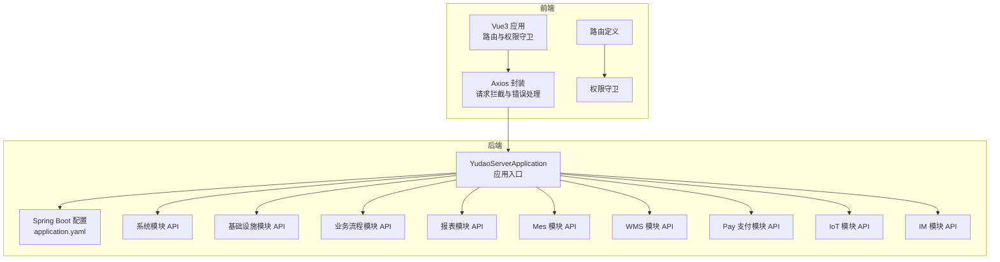
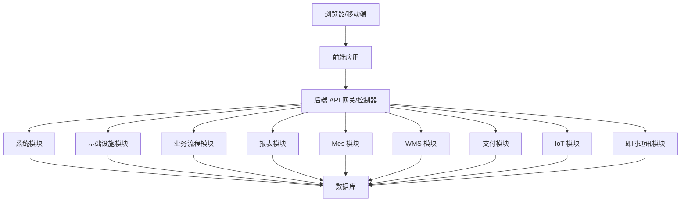
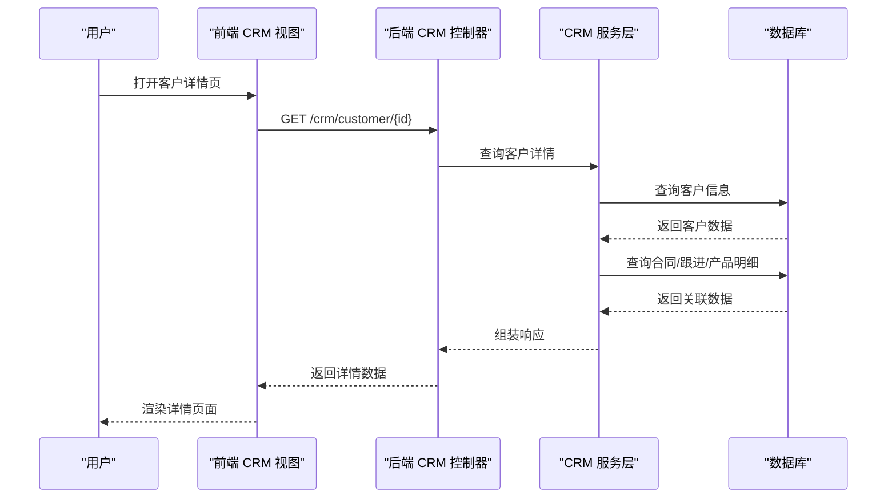
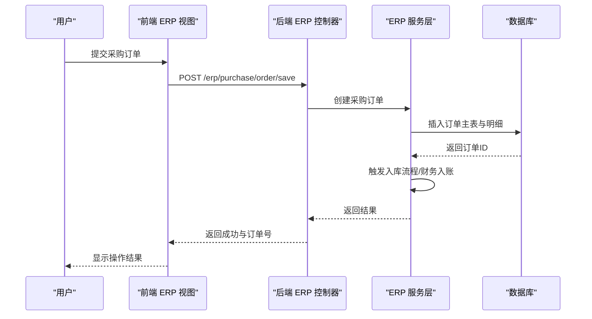
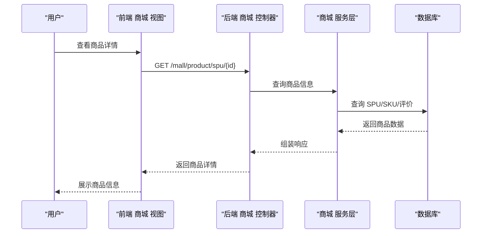
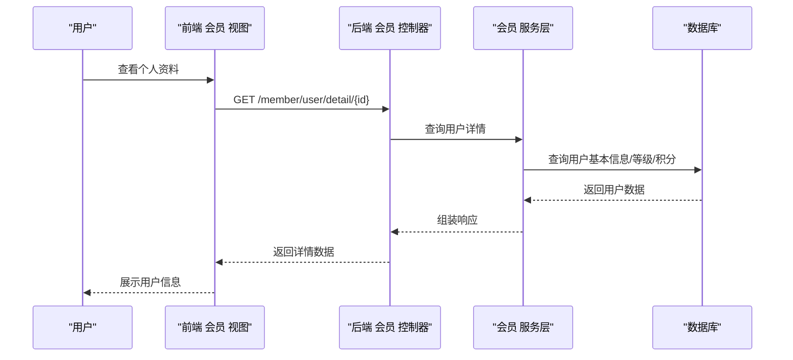
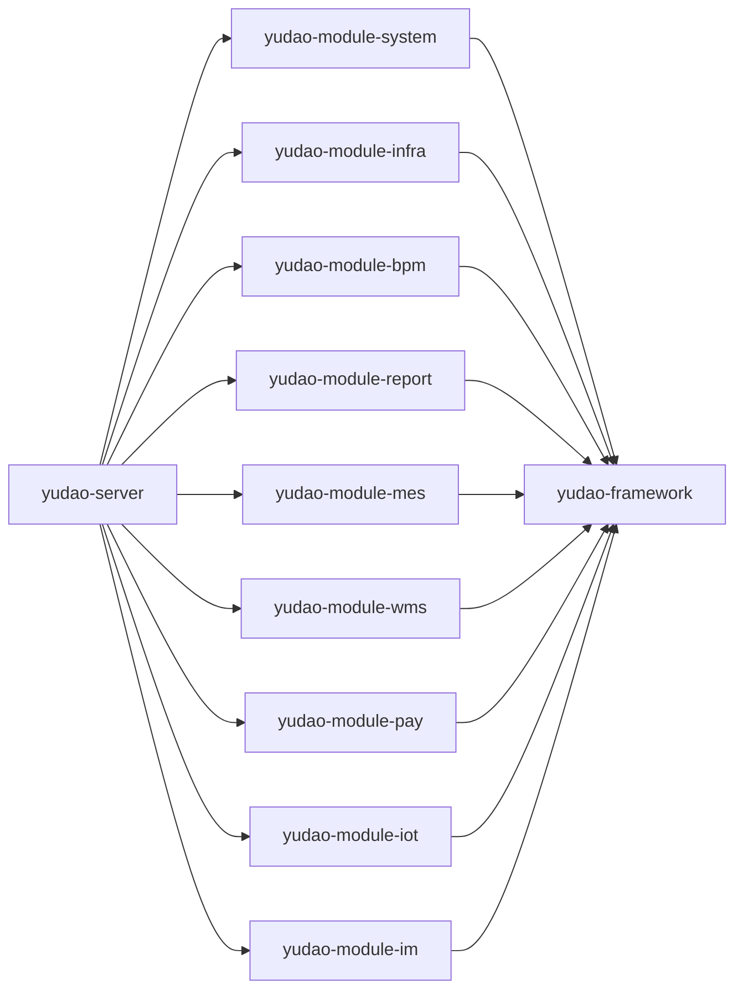

# 业务模块 API

<cite>
**本文引用的文件**
- [YudaoServerApplication.java](file://yudao-server/src/main/java/cn/iocoder/yudao/server/YudaoServerApplication.java)
- [application.yaml](file://yudao-server/src/main/resources/application.yaml)
- [application-dev.yaml](file://yudao-server/src/main/resources/application-dev.yaml)
- [application-local.yaml](file://yudao-server/src/main/resources/application-local.yaml)
- [pom.xml](file://yudao-server/pom.xml)
- [README.md](file://README.md)
- [yudao-ui-admin-vue3/package.json](file://yudao-ui/yudao-ui-admin-vue3/package.json)
- [Axios 配置](file://yudao-ui/yudao-ui-admin-vue3/src/config/axios/config.ts)
- [Axios 服务封装](file://yudao-ui/yudao-ui-admin-vue3/src/config/axios/service.ts)
- [错误码映射](file://yudao-ui/yudao-ui-admin-vue3/src/config/axios/errorCode.ts)
- [权限守卫](file://yudao-ui/yudao-ui-admin-vue3/src/permission.ts)
- [路由定义](file://yudao-ui/yudao-ui-admin-vue3/src/router/index.ts)
- [CRM 客户列表视图](file://yudao-ui/yudao-ui-admin-vue3/src/views/crm/customer/index.vue)
- [CRM 合同详情视图](file://yudao-ui/yudao-ui-admin-vue3/src/views/crm/contract/detail/index.vue)
- [ERP 采购订单表单](file://yudao-ui/yudao-ui-admin-vue3/src/views/erp/purchase/order/PurchaseOrderForm.vue)
- [ERP 销售出库组件](file://yudao-ui/yudao-ui-admin-vue3/src/views/erp/sale/out/index.vue)
- [ERP 库存盘点表单](file://yudao-ui/yudao-ui-admin-vue3/src/views/erp/stock/check/StockCheckForm.vue)
- [ERP 财务收款表单](file://yudao-ui/yudao-ui-admin-vue3/src/views/erp/finance/receipt/FinanceReceiptForm.vue)
- [商城订单详情视图](file://yudao-ui/yudao-ui-admin-vue3/src/views/mall/trade/order/detail/index.vue)
- [商城商品 SPU 表单](file://yudao-ui/yudao-ui-admin-vue3/src/views/mall/product/spu/form/index.vue)
- [会员用户详情视图](file://yudao-ui/yudao-ui-admin-vue3/src/views/member/user/detail/index.vue)
- [会员等级选择器](file://yudao-ui/yudao-ui-admin-vue3/src/views/member/level/components/MemberLevelSelect.vue)
- [会员签到配置表单](file://yudao-ui/yudao-ui-admin-vue3/src/views/member/signin/config/SignInConfigForm.vue)
- [系统模块依赖](file://yudao-module-system/pom.xml)
- [基础框架依赖](file://yudao-framework/pom.xml)
- [业务流程模块依赖](file://yudao-module-bpm/pom.xml)
- [基础设施模块依赖](file://yudao-module-infra/pom.xml)
- [报表模块依赖](file://yudao-module-report/pom.xml)
- [Mes 模块依赖](file://yudao-module-mes/pom.xml)
- [WMS 模块依赖](file://yudao-module-wms/pom.xml)
- [Pay 支付模块依赖](file://yudao-module-pay/pom.xml)
- [IoT 模块依赖](file://yudao-module-iot/pom.xml)
- [IM 即时通讯模块依赖](file://yudao-module-im/pom.xml)
- [BPM 流程引擎 API](file://yudao-module-bpm/src/main/java/cn/iocoder/yudao/module/bpm/api/)
- [系统模块 API](file://yudao-module-system/src/main/java/cn/iocoder/yudao/module/system/api/)
- [基础设施模块 API](file://yudao-module-infra/src/main/java/cn/iocoder/yudao/module/infra/api/)
- [报表模块 API](file://yudao-module-report/src/main/java/cn/iocoder/yudao/module/report/)
- [Mes 模块 API](file://yudao-module-mes/src/main/java/cn/iocoder/yudao/module/mes/)
- [WMS 模块 API](file://yudao-module-wms/src/main/java/cn/iocoder/yudao/module/wms/)
- [Pay 支付模块 API](file://yudao-module-pay/src/main/java/cn/iocoder/yudao/module/pay/)
- [IoT 模块 API](file://yudao-module-iot/src/main/java/cn/iocoder/yudao/module/iot/)
- [IM 即时通讯模块 API](file://yudao-module-im/src/main/java/cn/iocoder/yudao/module/im/)
</cite>

## 目录
1. [引言](#引言)
2. [项目结构](#项目结构)
3. [核心组件](#核心组件)
4. [架构总览](#架构总览)
5. [详细组件分析](#详细组件分析)
6. [依赖关系分析](#依赖关系分析)
7. [性能考虑](#性能考虑)
8. [故障排除指南](#故障排除指南)
9. [结论](#结论)
10. [附录](#附录)

## 引言
本文件面向企业级业务模块的 API 设计与集成，聚焦 CRM、ERP、商城与会员管理四大核心系统。文档从系统架构、模块职责、数据流与处理逻辑、API 协调机制与数据一致性保障等方面进行深入解析，并提供复杂业务场景的 API 使用示例与最佳实践建议，帮助开发者快速理解并高效扩展业务能力。

## 项目结构
后端采用多模块 Maven 架构，前端基于 Vue3 + Vite 的单页应用，通过 Axios 统一封装请求与错误处理。服务启动入口位于 yudao-server 模块，前端通过路由与权限守卫控制访问，各业务模块在 yudao-ui 中以功能域划分组织。

**图表来源**
- [YudaoServerApplication.java:1-50](file://yudao-server/src/main/java/cn/iocoder/yudao/server/YudaoServerApplication.java#L1-L50)
- [application.yaml:1-100](file://yudao-server/src/main/resources/application.yaml#L1-L100)
- [Axios 服务封装:1-120](file://yudao-ui/yudao-ui-admin-vue3/src/config/axios/service.ts#L1-L120)
- [路由定义:1-120](file://yudao-ui/yudao-ui-admin-vue3/src/router/index.ts#L1-L120)
- [权限守卫:1-120](file://yudao-ui/yudao-ui-admin-vue3/src/permission.ts#L1-L120)

**章节来源**
- [YudaoServerApplication.java:1-120](file://yudao-server/src/main/java/cn/iocoder/yudao/server/YudaoServerApplication.java#L1-L120)
- [application.yaml:1-200](file://yudao-server/src/main/resources/application.yaml#L1-L200)
- [application-dev.yaml:1-200](file://yudao-server/src/main/resources/application-dev.yaml#L1-L200)
- [application-local.yaml:1-200](file://yudao-server/src/main/resources/application-local.yaml#L1-L200)
- [pom.xml:1-200](file://yudao-server/pom.xml#L1-L200)
- [yudao-ui-admin-vue3/package.json:1-120](file://yudao-ui/yudao-ui-admin-vue3/package.json#L1-L120)

## 核心组件
- 前端 Axios 封装：统一处理请求头、超时、重试、错误码映射与提示，支持业务异常与网络异常分层处理。
- 权限与路由：基于角色/权限的前端路由守卫，结合后端菜单与按钮级权限控制。
- 后端多模块：按领域拆分系统、基础设施、流程、报表、Mes、WMS、支付、IoT、IM 等模块，便于独立演进与复用。
- 配置中心：通过 application.yaml 及环境配置文件集中管理数据库、缓存、消息队列等外部依赖。

**章节来源**
- [Axios 配置:1-120](file://yudao-ui/yudao-ui-admin-vue3/src/config/axios/config.ts#L1-L120)
- [Axios 服务封装:1-200](file://yudao-ui/yudao-ui-admin-vue3/src/config/axios/service.ts#L1-L200)
- [错误码映射:1-120](file://yudao-ui/yudao-ui-admin-vue3/src/config/axios/errorCode.ts#L1-L120)
- [权限守卫:1-120](file://yudao-ui/yudao-ui-admin-vue3/src/permission.ts#L1-L120)
- [路由定义:1-120](file://yudao-ui/yudao-ui-admin-vue3/src/router/index.ts#L1-L120)

## 架构总览
系统采用前后端分离架构，前端负责交互与状态管理，后端提供 RESTful API 与领域服务。业务模块通过统一的 API 层暴露能力，内部通过模块化设计实现高内聚低耦合。

**图表来源**
- [YudaoServerApplication.java:1-120](file://yudao-server/src/main/java/cn/iocoder/yudao/server/YudaoServerApplication.java#L1-L120)
- [系统模块依赖:1-120](file://yudao-module-system/pom.xml#L1-L120)
- [基础设施模块依赖:1-120](file://yudao-module-infra/pom.xml#L1-L120)
- [业务流程模块依赖:1-120](file://yudao-module-bpm/pom.xml#L1-L120)
- [报表模块依赖:1-120](file://yudao-module-report/pom.xml#L1-L120)
- [Mes 模块依赖:1-120](file://yudao-module-mes/pom.xml#L1-L120)
- [WMS 模块依赖:1-120](file://yudao-module-wms/pom.xml#L1-L120)
- [Pay 支付模块依赖:1-120](file://yudao-module-pay/pom.xml#L1-L120)
- [IoT 模块依赖:1-120](file://yudao-module-iot/pom.xml#L1-L120)
- [IM 即时通讯模块依赖:1-120](file://yudao-module-im/pom.xml#L1-L120)

## 详细组件分析

### CRM 客户管理、销售跟进、合同管理与数据分析
- 客户管理：提供客户列表、详情、导入、池管理与限制配置等能力，支撑客户生命周期管理。
- 销售跟进：记录跟进记录，关联商机、联系人，支持提醒与统计分析。
- 合同管理：合同新建、编辑、产品明细、计划回款与审批流程。
- 数据分析：漏斗分析、客户画像、业绩排行、转化率等可视化统计。

**图表来源**
- [CRM 客户列表视图:1-200](file://yudao-ui/yudao-ui-admin-vue3/src/views/crm/customer/index.vue#L1-L200)
- [CRM 合同详情视图:1-200](file://yudao-ui/yudao-ui-admin-vue3/src/views/crm/contract/detail/index.vue#L1-L200)

**章节来源**
- [CRM 客户列表视图:1-200](file://yudao-ui/yudao-ui-admin-vue3/src/views/crm/customer/index.vue#L1-L200)
- [CRM 合同详情视图:1-200](file://yudao-ui/yudao-ui-admin-vue3/src/views/crm/contract/detail/index.vue#L1-L200)

### ERP 采购管理、销售管理、库存管理与财务管理
- 采购管理：供应商管理、采购订单、入库与退货流程，支持启用项选择与付款联动。
- 销售管理：客户管理、销售订单、出库与退货流程，支持出库启用与退款联动。
- 库存管理：库存盘点、移库、入库与出库记录，支持仓库与货品维度统计。
- 财务管理：收款与付款单据，支持明细项与账户管理。

**图表来源**
- [ERP 采购订单表单:1-200](file://yudao-ui/yudao-ui-admin-vue3/src/views/erp/purchase/order/PurchaseOrderForm.vue#L1-L200)
- [ERP 销售出库组件:1-200](file://yudao-ui/yudao-ui-admin-vue3/src/views/erp/sale/out/index.vue#L1-L200)
- [ERP 库存盘点表单:1-200](file://yudao-ui/yudao-ui-admin-vue3/src/views/erp/stock/check/StockCheckForm.vue#L1-L200)
- [ERP 财务收款表单:1-200](file://yudao-ui/yudao-ui-admin-vue3/src/views/erp/finance/receipt/FinanceReceiptForm.vue#L1-L200)

**章节来源**
- [ERP 采购订单表单:1-200](file://yudao-ui/yudao-ui-admin-vue3/src/views/erp/purchase/order/PurchaseOrderForm.vue#L1-L200)
- [ERP 销售出库组件:1-200](file://yudao-ui/yudao-ui-admin-vue3/src/views/erp/sale/out/index.vue#L1-L200)
- [ERP 库存盘点表单:1-200](file://yudao-ui/yudao-ui-admin-vue3/src/views/erp/stock/check/StockCheckForm.vue#L1-L200)
- [ERP 财务收款表单:1-200](file://yudao-ui/yudao-ui-admin-vue3/src/views/erp/finance/receipt/FinanceReceiptForm.vue#L1-L200)

### 商城 商品管理、订单处理、促销活动与交易管理
- 商品管理：品牌、分类、属性与 SKU 管理，SPU 编辑与展示。
- 订单处理：订单详情、发货、售后与佣金结算。
- 促销活动：拼团、砍价、优惠券、限时秒杀、满减等营销工具。
- 交易管理：运费模板、快递公司、提货点与提现管理。

**图表来源**
- [商城订单详情视图:1-200](file://yudao-ui/yudao-ui-admin-vue3/src/views/mall/trade/order/detail/index.vue#L1-L200)
- [商城商品 SPU 表单:1-200](file://yudao-ui/yudao-ui-admin-vue3/src/views/mall/product/spu/form/index.vue#L1-L200)

**章节来源**
- [商城订单详情视图:1-200](file://yudao-ui/yudao-ui-admin-vue3/src/views/mall/trade/order/detail/index.vue#L1-L200)
- [商城商品 SPU 表单:1-200](file://yudao-ui/yudao-ui-admin-vue3/src/views/mall/product/spu/form/index.vue#L1-L200)

### 会员体系 用户管理、积分系统与等级制度
- 用户管理：用户详情、账户信息、地址与订单历史查询。
- 积分系统：积分记录、积分变动与积分商城。
- 等级制度：等级配置、等级选择与升级规则。
- 签到管理：签到配置与签到记录统计。

**图表来源**
- [会员用户详情视图:1-200](file://yudao-ui/yudao-ui-admin-vue3/src/views/member/user/detail/index.vue#L1-L200)
- [会员等级选择器:1-200](file://yudao-ui/yudao-ui-admin-vue3/src/views/member/level/components/MemberLevelSelect.vue#L1-L200)
- [会员签到配置表单:1-200](file://yudao-ui/yudao-ui-admin-vue3/src/views/member/signin/config/SignInConfigForm.vue#L1-L200)

**章节来源**
- [会员用户详情视图:1-200](file://yudao-ui/yudao-ui-admin-vue3/src/views/member/user/detail/index.vue#L1-L200)
- [会员等级选择器:1-200](file://yudao-ui/yudao-ui-admin-vue3/src/views/member/level/components/MemberLevelSelect.vue#L1-L200)
- [会员签到配置表单:1-200](file://yudao-ui/yudao-ui-admin-vue3/src/views/member/signin/config/SignInConfigForm.vue#L1-L200)

## 依赖关系分析
后端通过 Maven 多模块管理，yudao-server 作为聚合入口，其他模块按领域划分，避免循环依赖并提升可维护性。

**图表来源**
- [pom.xml:1-200](file://yudao-server/pom.xml#L1-L200)
- [系统模块依赖:1-120](file://yudao-module-system/pom.xml#L1-L120)
- [基础设施模块依赖:1-120](file://yudao-module-infra/pom.xml#L1-L120)
- [业务流程模块依赖:1-120](file://yudao-module-bpm/pom.xml#L1-L120)
- [报表模块依赖:1-120](file://yudao-module-report/pom.xml#L1-L120)
- [Mes 模块依赖:1-120](file://yudao-module-mes/pom.xml#L1-L120)
- [WMS 模块依赖:1-120](file://yudao-module-wms/pom.xml#L1-L120)
- [Pay 支付模块依赖:1-120](file://yudao-module-pay/pom.xml#L1-L120)
- [IoT 模块依赖:1-120](file://yudao-module-iot/pom.xml#L1-L120)
- [IM 即时通讯模块依赖:1-120](file://yudao-module-im/pom.xml#L1-L120)

**章节来源**
- [pom.xml:1-200](file://yudao-server/pom.xml#L1-L200)
- [基础框架依赖:1-120](file://yudao-framework/pom.xml#L1-L120)

## 性能考虑
- 前端优化：使用虚拟滚动、懒加载与缓存策略减少渲染压力；Axios 统一超时与重试配置降低失败率。
- 后端优化：模块化拆分避免单体膨胀；合理使用缓存与批量查询；对高频接口进行分页与索引优化。
- 数据一致性：事务边界清晰，跨模块调用通过消息队列异步解耦，必要时引入 Saga 或 TCC 模式保证最终一致。

## 故障排除指南
- 请求失败排查：检查 Axios 错误码映射与提示，区分网络异常与业务异常；查看后端日志定位具体模块。
- 权限问题：确认路由守卫与菜单权限配置，核对用户角色与资源授权。
- 配置问题：核对 application.yaml 与环境配置文件，确保数据库、缓存与消息中间件连通性。

**章节来源**
- [错误码映射:1-120](file://yudao-ui/yudao-ui-admin-vue3/src/config/axios/errorCode.ts#L1-L120)
- [权限守卫:1-120](file://yudao-ui/yudao-ui-admin-vue3/src/permission.ts#L1-L120)

## 结论
该系统通过前后端分离与模块化设计，为 CRM、ERP、商城与会员管理提供了清晰的 API 设计模式与集成路径。依托统一的前端 Axios 封装与后端多模块架构，能够有效支撑复杂业务场景下的数据一致性与性能优化需求。建议在扩展新业务时遵循现有模块边界与接口规范，确保系统长期可维护性与可演进性。

## 附录
- 快速开始：参考 yudao-server 的启动配置与 yudao-ui 的构建脚本，完成本地开发环境搭建。
- API 文档：结合各模块的控制器与服务层注释，生成 OpenAPI/Swagger 文档以供联调使用。
- 最佳实践：统一错误码、参数校验、分页查询与幂等设计；对关键流程增加审计日志与链路追踪。

**章节来源**
- [README.md:1-200](file://README.md#L1-L200)
- [yudao-ui-admin-vue3/package.json:1-120](file://yudao-ui/yudao-ui-admin-vue3/package.json#L1-L120)