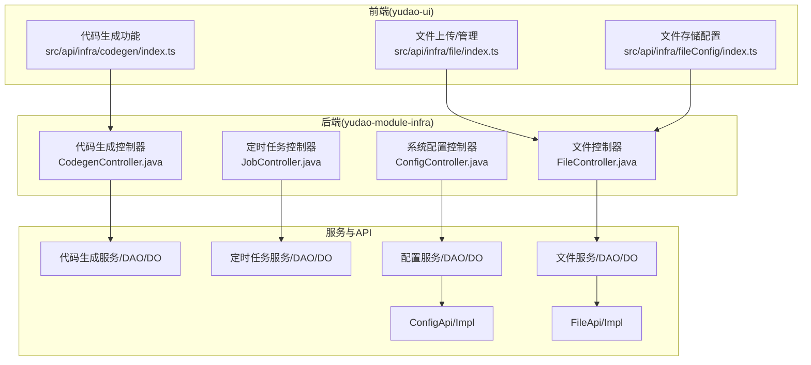
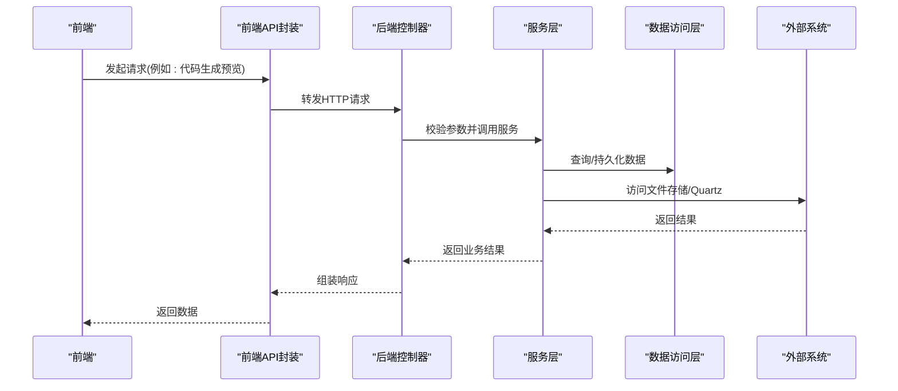
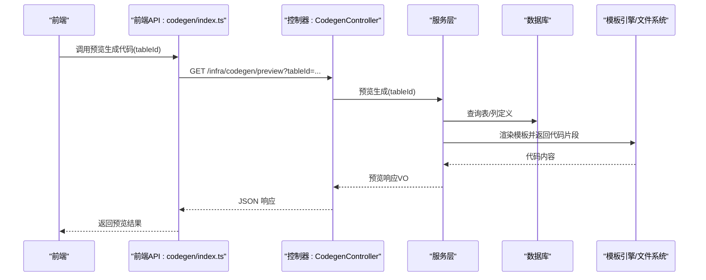
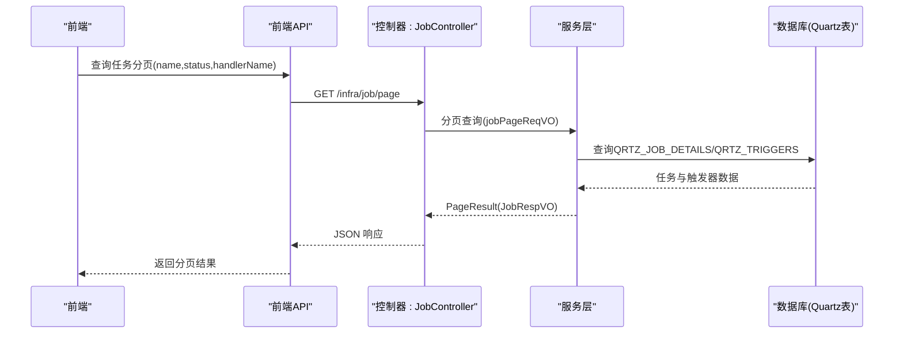
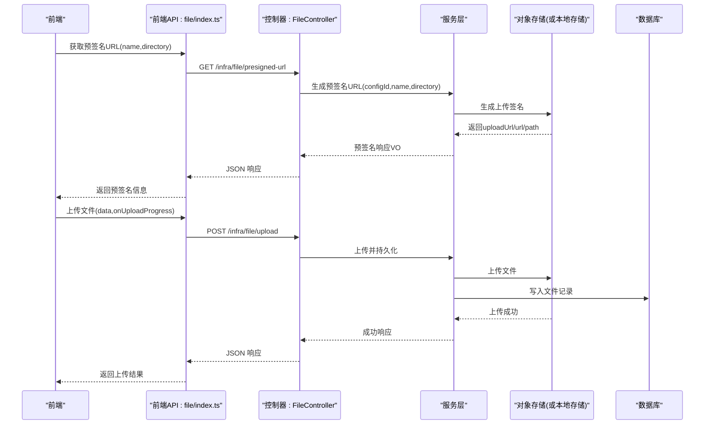
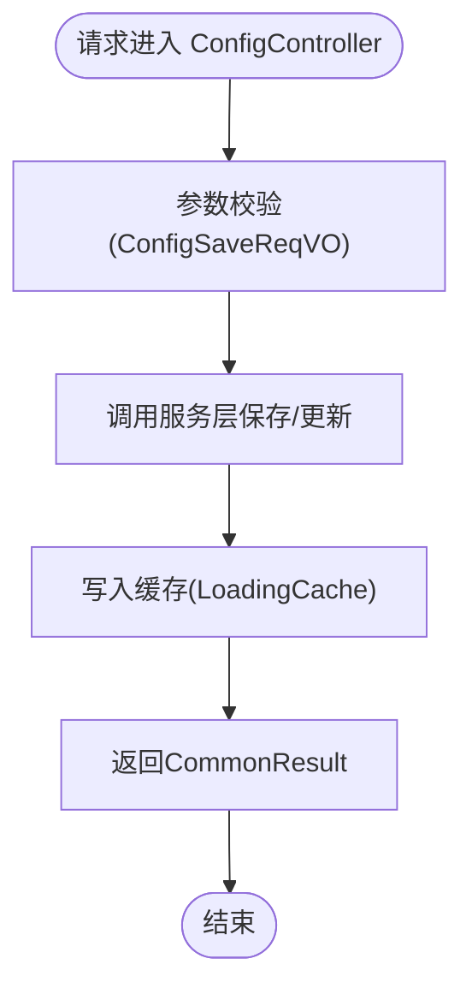
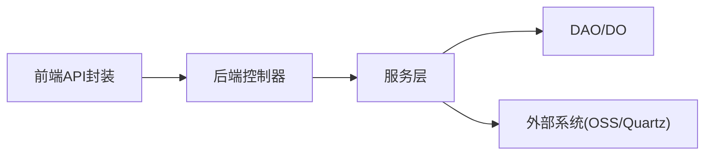

# 基础设施 API

<cite>
**本文引用的文件**
- [yudao-module-infra/src/main/java/cn/iocoder/yudao/module/infra/controller/admin/codegen/CodegenController.java](file://yudao-module-infra/src/main/java/cn/iocoder/yudao/module/infra/controller/admin/codegen/CodegenController.java)
- [yudao-module-infra/src/main/java/cn/iocoder/yudao/module/infra/controller/admin/codegen/vo/table/CodegenTableSaveReqVO.java](file://yudao-module-infra/src/main/java/cn/iocoder/yudao/module/infra/controller/admin/codegen/vo/table/CodegenTableSaveReqVO.java)
- [yudao-module-infra/src/main/java/cn/iocoder/yudao/module/infra/controller/admin/codegen/vo/table/CodegenTableRespVO.java](file://yudao-module-infra/src/main/java/cn/iocoder/yudao/module/infra/controller/admin/codegen/vo/table/CodegenTableRespVO.java)
- [yudao-module-infra/src/main/java/cn/iocoder/yudao/module/infra/controller/admin/codegen/vo/table/CodegenTablePageReqVO.java](file://yudao-module-infra/src/main/java/cn/iocoder/yudao/module/infra/controller/admin/codegen/vo/table/CodegenTablePageReqVO.java)
- [yudao-module-infra/src/main/java/cn/iocoder/yudao/module/infra/controller/admin/codegen/vo/CodegenDetailRespVO.java](file://yudao-module-infra/src/main/java/cn/iocoder/yudao/module/infra/controller/admin/codegen/vo/CodegenDetailRespVO.java)
- [yudao-module-infra/src/main/java/cn/iocoder/yudao/module/infra/controller/admin/codegen/vo/CodegenPreviewRespVO.java](file://yudao-module-infra/src/main/java/cn/iocoder/yudao/module/infra/controller/admin/codegen/vo/CodegenPreviewRespVO.java)
- [yudao-module-infra/src/main/java/cn/iocoder/yudao/module/infra/controller/admin/codegen/vo/CodegenUpdateReqVO.java](file://yudao-module-infra/src/main/java/cn/iocoder/yudao/module/infra/controller/admin/codegen/vo/CodegenUpdateReqVO.java)
- [yudao-module-infra/src/main/java/cn/iocoder/yudao/module/infra/controller/admin/codegen/vo/CodegenCreateListReqVO.java](file://yudao-module-infra/src/main/java/cn/iocoder/yudao/module/infra/controller/admin/codegen/vo/CodegenCreateListReqVO.java)
- [yudao-module-infra/src/main/java/cn/iocoder/yudao/module/infra/controller/admin/codegen/vo/column/CodegenColumnSaveReqVO.java](file://yudao-module-infra/src/main/java/cn/iocoder/yudao/module/infra/controller/admin/codegen/vo/column/CodegenColumnSaveReqVO.java)
- [yudao-module-infra/src/main/java/cn/iocoder/yudao/module/infra/controller/admin/codegen/vo/column/CodegenColumnRespVO.java](file://yudao-module-infra/src/main/java/cn/iocoder/yudao/module/infra/controller/admin/codegen/vo/column/CodegenColumnRespVO.java)
- [yudao-module-infra/src/main/java/cn/iocoder/yudao/module/infra/controller/admin/codegen/vo/table/DatabaseTableRespVO.java](file://yudao-module-infra/src/main/java/cn/iocoder/yudao/module/infra/controller/admin/codegen/vo/table/DatabaseTableRespVO.java)
- [yudao-module-infra/src/main/java/cn/iocoder/yudao/module/infra/controller/admin/job/JobController.java](file://yudao-module-infra/src/main/java/cn/iocoder/yudao/module/infra/controller/admin/job/JobController.java)
- [yudao-module-infra/src/main/java/cn/iocoder/yudao/module/infra/controller/admin/job/vo/job/JobSaveReqVO.java](file://yudao-module-infra/src/main/java/cn/iocoder/yudao/module/infra/controller/admin/job/vo/job/JobSaveReqVO.java)
- [yudao-module-infra/src/main/java/cn/iocoder/yudao/module/infra/controller/admin/job/vo/job/JobPageReqVO.java](file://yudao-module-infra/src/main/java/cn/iocoder/yudao/module/infra/controller/admin/job/vo/job/JobPageReqVO.java)
- [yudao-module-infra/src/main/java/cn/iocoder/yudao/module/infra/controller/admin/job/vo/job/JobRespVO.java](file://yudao-module-infra/src/main/java/cn/iocoder/yudao/module/infra/controller/admin/job/vo/job/JobRespVO.java)
- [yudao-module-infra/src/main/java/cn/iocoder/yudao/module/infra/controller/admin/job/vo/log/JobLogPageReqVO.java](file://yudao-module-infra/src/main/java/cn/iocoder/yudao/module/infra/controller/admin/job/vo/log/JobLogPageReqVO.java)
- [yudao-module-infra/src/main/java/cn/iocoder/yudao/module/infra/controller/admin/job/vo/log/JobLogRespVO.java](file://yudao-module-infra/src/main/java/cn/iocoder/yudao/module/infra/controller/admin/job/vo/log/JobLogRespVO.java)
- [yudao-module-infra/src/main/java/cn/iocoder/yudao/module/infra/controller/admin/file/FileController.java](file://yudao-module-infra/src/main/java/cn/iocoder/yudao/module/infra/controller/admin/file/FileController.java)
- [yudao-module-infra/src/main/java/cn/iocoder/yudao/module/infra/controller/admin/file/vo/file/FileUploadReqVO.java](file://yudao-module-infra/src/main/java/cn/iocoder/yudao/module/infra/controller/admin/file/vo/file/FileUploadReqVO.java)
- [yudao-module-infra/src/main/java/cn/iocoder/yudao/module/infra/controller/admin/file/vo/file/FileCreateReqVO.java](file://yudao-module-infra/src/main/java/cn/iocoder/yudao/module/infra/controller/admin/file/vo/file/FileCreateReqVO.java)
- [yudao-module-infra/src/main/java/cn/iocoder/yudao/module/infra/controller/admin/file/vo/file/FilePresignedUrlRespVO.java](file://yudao-module-infra/src/main/java/cn/iocoder/yudao/module/infra/controller/admin/file/vo/file/FilePresignedUrlRespVO.java)
- [yudao-module-infra/src/main/java/cn/iocoder/yudao/module/infra/controller/admin/file/vo/config/FileConfigSaveReqVO.java](file://yudao-module-infra/src/main/java/cn/iocoder/yudao/module/infra/controller/admin/file/vo/config/FileConfigSaveReqVO.java)
- [yudao-module-infra/src/main/java/cn/iocoder/yudao/module/infra/controller/admin/file/vo/config/FileConfigRespVO.java](file://yudao-module-infra/src/main/java/cn/iocoder/yudao/module/infra/controller/admin/file/vo/config/FileConfigRespVO.java)
- [yudao-module-infra/src/main/java/cn/iocoder/yudao/module/infra/controller/admin/file/vo/config/FileConfigPageReqVO.java](file://yudao-module-infra/src/main/java/cn/iocoder/yudao/module/infra/controller/admin/file/vo/config/FileConfigPageReqVO.java)
- [yudao-module-infra/src/main/java/cn/iocoder/yudao/module/infra/controller/admin/config/ConfigController.java](file://yudao-module-infra/src/main/java/cn/iocoder/yudao/module/infra/controller/admin/config/ConfigController.java)
- [yudao-module-infra/src/main/java/cn/iocoder/yudao/module/infra/controller/admin/config/vo/ConfigSaveReqVO.java](file://yudao-module-infra/src/main/java/cn/iocoder/yudao/module/infra/controller/admin/config/vo/ConfigSaveReqVO.java)
- [yudao-module-infra/src/main/java/cn/iocoder/yudao/module/infra/controller/admin/config/vo/ConfigRespVO.java](file://yudao-module-infra/src/main/java/cn/iocoder/yudao/module/infra/controller/admin/config/vo/ConfigRespVO.java)
- [yudao-module-infra/src/main/java/cn/iocoder/yudao/module/infra/controller/admin/config/vo/ConfigPageReqVO.java](file://yudao-module-infra/src/main/java/cn/iocoder/yudao/module/infra/controller/admin/config/vo/ConfigPageReqVO.java)
- [yudao-module-infra/src/main/java/cn/iocoder/yudao/module/infra/api/config/ConfigApi.java](file://yudao-module-infra/src/main/java/cn/iocoder/yudao/module/infra/api/config/ConfigApi.java)
- [yudao-module-infra/src/main/java/cn/iocoder/yudao/module/infra/api/config/ConfigApiImpl.java](file://yudao-module-infra/src/main/java/cn/iocoder/yudao/module/infra/api/config/ConfigApiImpl.java)
- [yudao-module-infra/src/main/java/cn/iocoder/yudao/module/infra/api/file/FileApi.java](file://yudao-module-infra/src/main/java/cn/iocoder/yudao/module/infra/api/file/FileApi.java)
- [yudao-module-infra/src/main/java/cn/iocoder/yudao/module/infra/api/file/FileApiImpl.java](file://yudao-module-infra/src/main/java/cn/iocoder/yudao/module/infra/api/file/FileApiImpl.java)
- [yudao-module-infra/src/main/java/cn/iocoder/yudao/module/infra/framework/quartz/core/util/CronUtils.java](file://yudao-module-infra/src/main/java/cn/iocoder/yudao/module/infra/framework/quartz/core/util/CronUtils.java)
- [yudao-server/src/main/resources/application-local.yaml](file://yudao-server/src/main/resources/application-local.yaml)
- [sql/postgresql/quartz.sql](file://sql/postgresql/quartz.sql)
- [yudao-ui/yudao-ui-admin-vue3/src/api/infra/codegen/index.ts](file://yudao-ui/yudao-ui-admin-vue3/src/api/infra/codegen/index.ts)
- [yudao-ui/yudao-ui-admin-vue3/src/api/infra/file/index.ts](file://yudao-ui/yudao-ui-admin-vue3/src/api/infra/file/index.ts)
- [yudao-ui/yudao-ui-admin-vue3/src/api/infra/fileConfig/index.ts](file://yudao-ui/yudao-ui-admin-vue3/src/api/infra/fileConfig/index.ts)
- [yudao-ui/yudao-ui-admin-vue3/src/utils/constants.ts](file://yudao-ui/yudao-ui-admin-vue3/src/utils/constants.ts)
- [yudao-framework/yudao-common/src/main/java/cn/iocoder/yudao/framework/common/util/cache/CacheUtils.java](file://yudao-framework/yudao-common/src/main/java/cn/iocoder/yudao/framework/common/util/cache/CacheUtils.java)
</cite>

## 目录
1. [简介](#简介)
2. [项目结构](#项目结构)
3. [核心组件](#核心组件)
4. [架构总览](#架构总览)
5. [详细组件分析](#详细组件分析)
6. [依赖分析](#依赖分析)
7. [性能考虑](#性能考虑)
8. [故障排查指南](#故障排查指南)
9. [结论](#结论)
10. [附录](#附录)

## 简介
本文件面向基础设施模块的 API 封装，聚焦以下支撑能力：
- 代码生成：模板选择、批量生成、预览与下载
- 定时任务：CRUD 与执行状态监控
- 文件管理：上传、存储配置、文件管理
- 系统配置：动态更新与缓存机制

文档对各模块的接口设计、参数校验、错误处理与安全控制进行深入解析，并提供使用示例与集成指南。

## 项目结构
基础设施模块在后端以控制器层暴露 REST API，在前端通过 axios 请求封装调用；同时提供通用的缓存工具与定时任务持久化脚本支持。

图表来源
- [yudao-ui/yudao-ui-admin-vue3/src/api/infra/codegen/index.ts](file://yudao-ui/yudao-ui-admin-vue3/src/api/infra/codegen/index.ts)
- [yudao-ui/yudao-ui-admin-vue3/src/api/infra/file/index.ts](file://yudao-ui/yudao-ui-admin-vue3/src/api/infra/file/index.ts)
- [yudao-ui/yudao-ui-admin-vue3/src/api/infra/fileConfig/index.ts](file://yudao-ui/yudao-ui-admin-vue3/src/api/infra/fileConfig/index.ts)
- [yudao-module-infra/src/main/java/cn/iocoder/yudao/module/infra/controller/admin/codegen/CodegenController.java](file://yudao-module-infra/src/main/java/cn/iocoder/yudao/module/infra/controller/admin/codegen/CodegenController.java)
- [yudao-module-infra/src/main/java/cn/iocoder/yudao/module/infra/controller/admin/job/JobController.java](file://yudao-module-infra/src/main/java/cn/iocoder/yudao/module/infra/controller/admin/job/JobController.java)
- [yudao-module-infra/src/main/java/cn/iocoder/yudao/module/infra/controller/admin/file/FileController.java](file://yudao-module-infra/src/main/java/cn/iocoder/yudao/module/infra/controller/admin/file/FileController.java)
- [yudao-module-infra/src/main/java/cn/iocoder/yudao/module/infra/controller/admin/config/ConfigController.java](file://yudao-module-infra/src/main/java/cn/iocoder/yudao/module/infra/controller/admin/config/ConfigController.java)

章节来源
- [yudao-module-infra/src/main/java/cn/iocoder/yudao/module/infra/controller/admin/codegen/CodegenController.java](file://yudao-module-infra/src/main/java/cn/iocoder/yudao/module/infra/controller/admin/codegen/CodegenController.java)
- [yudao-module-infra/src/main/java/cn/iocoder/yudao/module/infra/controller/admin/job/JobController.java](file://yudao-module-infra/src/main/java/cn/iocoder/yudao/module/infra/controller/admin/job/JobController.java)
- [yudao-module-infra/src/main/java/cn/iocoder/yudao/module/infra/controller/admin/file/FileController.java](file://yudao-module-infra/src/main/java/cn/iocoder/yudao/module/infra/controller/admin/file/FileController.java)
- [yudao-module-infra/src/main/java/cn/iocoder/yudao/module/infra/controller/admin/config/ConfigController.java](file://yudao-module-infra/src/main/java/cn/iocoder/yudao/module/infra/controller/admin/config/ConfigController.java)

## 核心组件
- 代码生成：提供表定义、列定义、模板选择、批量生成、预览与下载接口
- 定时任务：提供任务的增删改查、状态变更、日志查询与执行状态监控
- 文件管理：提供文件上传、预签名地址、文件列表与删除、存储配置的增删改查与测试
- 系统配置：提供配置的增删改查与动态更新，结合本地缓存工具实现缓存与异步刷新

章节来源
- [yudao-module-infra/src/main/java/cn/iocoder/yudao/module/infra/controller/admin/codegen/CodegenController.java](file://yudao-module-infra/src/main/java/cn/iocoder/yudao/module/infra/controller/admin/codegen/CodegenController.java)
- [yudao-module-infra/src/main/java/cn/iocoder/yudao/module/infra/controller/admin/job/JobController.java](file://yudao-module-infra/src/main/java/cn/iocoder/yudao/module/infra/controller/admin/job/JobController.java)
- [yudao-module-infra/src/main/java/cn/iocoder/yudao/module/infra/controller/admin/file/FileController.java](file://yudao-module-infra/src/main/java/cn/iocoder/yudao/module/infra/controller/admin/file/FileController.java)
- [yudao-module-infra/src/main/java/cn/iocoder/yudao/module/infra/controller/admin/config/ConfigController.java](file://yudao-module-infra/src/main/java/cn/iocoder/yudao/module/infra/controller/admin/config/ConfigController.java)

## 架构总览
基础设施模块采用前后端分离架构，前端通过统一的 axios 请求封装调用后端控制器，控制器调用服务层完成业务逻辑，服务层访问 DAO/DO 并与外部系统交互（如文件存储、Quartz 定时任务）。系统配置与文件配置通过 API 层实现动态更新与缓存。

图表来源
- [yudao-ui/yudao-ui-admin-vue3/src/api/infra/codegen/index.ts](file://yudao-ui/yudao-ui-admin-vue3/src/api/infra/codegen/index.ts)
- [yudao-module-infra/src/main/java/cn/iocoder/yudao/module/infra/controller/admin/codegen/CodegenController.java](file://yudao-module-infra/src/main/java/cn/iocoder/yudao/module/infra/controller/admin/codegen/CodegenController.java)

## 详细组件分析

### 代码生成 API
- 功能要点
  - 表定义与列定义的增删改查
  - 模板选择（基础 CRUD、树形 CRUD、主子表）
  - 基于数据库表结构批量创建代码生成配置
  - 同步数据库表与字段定义
  - 预览生成代码与打包下载
- 关键接口
  - 分页查询表定义
  - 查询表详情
  - 修改表定义
  - 同步数据库表与字段
  - 预览生成代码
  - 下载生成代码
  - 基于数据库表批量创建代码生成配置
  - 删除/批量删除表定义
- 参数与模型
  - 表保存请求 VO、表响应 VO、分页请求 VO
  - 列保存请求 VO、列响应 VO
  - 详情响应 VO、预览响应 VO、更新请求 VO、批量创建请求 VO、数据库表响应 VO
- 前端封装
  - 提供对应的 axios 封装函数，支持下载与预签名 URL

图表来源
- [yudao-ui/yudao-ui-admin-vue3/src/api/infra/codegen/index.ts](file://yudao-ui/yudao-ui-admin-vue3/src/api/infra/codegen/index.ts)
- [yudao-module-infra/src/main/java/cn/iocoder/yudao/module/infra/controller/admin/codegen/CodegenController.java](file://yudao-module-infra/src/main/java/cn/iocoder/yudao/module/infra/controller/admin/codegen/CodegenController.java)

章节来源
- [yudao-ui/yudao-ui-admin-vue3/src/api/infra/codegen/index.ts](file://yudao-ui/yudao-ui-admin-vue3/src/api/infra/codegen/index.ts)
- [yudao-module-infra/src/main/java/cn/iocoder/yudao/module/infra/controller/admin/codegen/CodegenController.java](file://yudao-module-infra/src/main/java/cn/iocoder/yudao/module/infra/controller/admin/codegen/CodegenController.java)
- [yudao-module-infra/src/main/java/cn/iocoder/yudao/module/infra/controller/admin/codegen/vo/table/CodegenTableSaveReqVO.java](file://yudao-module-infra/src/main/java/cn/iocoder/yudao/module/infra/controller/admin/codegen/vo/table/CodegenTableSaveReqVO.java)
- [yudao-module-infra/src/main/java/cn/iocoder/yudao/module/infra/controller/admin/codegen/vo/table/CodegenTableRespVO.java](file://yudao-module-infra/src/main/java/cn/iocoder/yudao/module/infra/controller/admin/codegen/vo/table/CodegenTableRespVO.java)
- [yudao-module-infra/src/main/java/cn/iocoder/yudao/module/infra/controller/admin/codegen/vo/table/CodegenTablePageReqVO.java](file://yudao-module-infra/src/main/java/cn/iocoder/yudao/module/infra/controller/admin/codegen/vo/table/CodegenTablePageReqVO.java)
- [yudao-module-infra/src/main/java/cn/iocoder/yudao/module/infra/controller/admin/codegen/vo/CodegenDetailRespVO.java](file://yudao-module-infra/src/main/java/cn/iocoder/yudao/module/infra/controller/admin/codegen/vo/CodegenDetailRespVO.java)
- [yudao-module-infra/src/main/java/cn/iocoder/yudao/module/infra/controller/admin/codegen/vo/CodegenPreviewRespVO.java](file://yudao-module-infra/src/main/java/cn/iocoder/yudao/module/infra/controller/admin/codegen/vo/CodegenPreviewRespVO.java)
- [yudao-module-infra/src/main/java/cn/iocoder/yudao/module/infra/controller/admin/codegen/vo/CodegenUpdateReqVO.java](file://yudao-module-infra/src/main/java/cn/iocoder/yudao/module/infra/controller/admin/codegen/vo/CodegenUpdateReqVO.java)
- [yudao-module-infra/src/main/java/cn/iocoder/yudao/module/infra/controller/admin/codegen/vo/CodegenCreateListReqVO.java](file://yudao-module-infra/src/main/java/cn/iocoder/yudao/module/infra/controller/admin/codegen/vo/CodegenCreateListReqVO.java)
- [yudao-module-infra/src/main/java/cn/iocoder/yudao/module/infra/controller/admin/codegen/vo/column/CodegenColumnSaveReqVO.java](file://yudao-module-infra/src/main/java/cn/iocoder/yudao/module/infra/controller/admin/codegen/vo/column/CodegenColumnSaveReqVO.java)
- [yudao-module-infra/src/main/java/cn/iocoder/yudao/module/infra/controller/admin/codegen/vo/column/CodegenColumnRespVO.java](file://yudao-module-infra/src/main/java/cn/iocoder/yudao/module/infra/controller/admin/codegen/vo/column/CodegenColumnRespVO.java)
- [yudao-module-infra/src/main/java/cn/iocoder/yudao/module/infra/controller/admin/codegen/vo/table/DatabaseTableRespVO.java](file://yudao-module-infra/src/main/java/cn/iocoder/yudao/module/infra/controller/admin/codegen/vo/table/DatabaseTableRespVO.java)

### 定时任务 API
- 功能要点
  - 任务的新增、修改、删除、分页查询
  - 任务状态变更（初始化、运行中、暂停）
  - 任务日志分页查询与详情
  - Cron 表达式校验与工具
- 关键接口
  - 任务分页查询
  - 任务详情查询
  - 任务保存/更新
  - 任务删除/批量删除
  - 任务日志分页查询
- 参数与模型
  - 任务分页请求 VO、任务响应 VO、任务保存请求 VO
  - 任务日志分页请求 VO、任务日志响应 VO
- 配置与持久化
  - Quartz JDBC 存储配置与集群参数
  - PostgreSQL Quartz 表结构脚本

图表来源
- [yudao-module-infra/src/main/java/cn/iocoder/yudao/module/infra/controller/admin/job/JobController.java](file://yudao-module-infra/src/main/java/cn/iocoder/yudao/module/infra/controller/admin/job/JobController.java)
- [yudao-module-infra/src/main/java/cn/iocoder/yudao/module/infra/controller/admin/job/vo/job/JobPageReqVO.java](file://yudao-module-infra/src/main/java/cn/iocoder/yudao/module/infra/controller/admin/job/vo/job/JobPageReqVO.java)
- [yudao-module-infra/src/main/java/cn/iocoder/yudao/module/infra/controller/admin/job/vo/job/JobRespVO.java](file://yudao-module-infra/src/main/java/cn/iocoder/yudao/module/infra/controller/admin/job/vo/job/JobRespVO.java)
- [yudao-module-infra/src/main/java/cn/iocoder/yudao/module/infra/controller/admin/job/vo/log/JobLogPageReqVO.java](file://yudao-module-infra/src/main/java/cn/iocoder/yudao/module/infra/controller/admin/job/vo/log/JobLogPageReqVO.java)
- [yudao-module-infra/src/main/java/cn/iocoder/yudao/module/infra/controller/admin/job/vo/log/JobLogRespVO.java](file://yudao-module-infra/src/main/java/cn/iocoder/yudao/module/infra/controller/admin/job/vo/log/JobLogRespVO.java)
- [yudao-module-infra/src/main/java/cn/iocoder/yudao/module/infra/framework/quartz/core/util/CronUtils.java](file://yudao-module-infra/src/main/java/cn/iocoder/yudao/module/infra/framework/quartz/core/util/CronUtils.java)
- [yudao-server/src/main/resources/application-local.yaml](file://yudao-server/src/main/resources/application-local.yaml)
- [sql/postgresql/quartz.sql](file://sql/postgresql/quartz.sql)

章节来源
- [yudao-module-infra/src/main/java/cn/iocoder/yudao/module/infra/controller/admin/job/JobController.java](file://yudao-module-infra/src/main/java/cn/iocoder/yudao/module/infra/controller/admin/job/JobController.java)
- [yudao-module-infra/src/main/java/cn/iocoder/yudao/module/infra/controller/admin/job/vo/job/JobPageReqVO.java](file://yudao-module-infra/src/main/java/cn/iocoder/yudao/module/infra/controller/admin/job/vo/job/JobPageReqVO.java)
- [yudao-module-infra/src/main/java/cn/iocoder/yudao/module/infra/controller/admin/job/vo/job/JobRespVO.java](file://yudao-module-infra/src/main/java/cn/iocoder/yudao/module/infra/controller/admin/job/vo/job/JobRespVO.java)
- [yudao-module-infra/src/main/java/cn/iocoder/yudao/module/infra/controller/admin/job/vo/log/JobLogPageReqVO.java](file://yudao-module-infra/src/main/java/cn/iocoder/yudao/module/infra/controller/admin/job/vo/log/JobLogPageReqVO.java)
- [yudao-module-infra/src/main/java/cn/iocoder/yudao/module/infra/controller/admin/job/vo/log/JobLogRespVO.java](file://yudao-module-infra/src/main/java/cn/iocoder/yudao/module/infra/controller/admin/job/vo/log/JobLogRespVO.java)
- [yudao-module-infra/src/main/java/cn/iocoder/yudao/module/infra/framework/quartz/core/util/CronUtils.java](file://yudao-module-infra/src/main/java/cn/iocoder/yudao/module/infra/framework/quartz/core/util/CronUtils.java)
- [yudao-server/src/main/resources/application-local.yaml](file://yudao-server/src/main/resources/application-local.yaml)
- [sql/postgresql/quartz.sql](file://sql/postgresql/quartz.sql)

### 文件管理 API
- 功能要点
  - 文件上传（支持进度回调）
  - 预签名地址生成（直传到对象存储）
  - 文件列表分页与删除
  - 存储配置的增删改查与测试
- 关键接口
  - 文件分页查询
  - 文件删除/批量删除
  - 获取预签名地址
  - 创建文件记录
  - 上传文件
  - 文件配置分页查询
  - 文件配置详情查询
  - 更新主配置
  - 新增/修改/删除文件配置
  - 测试文件配置
- 参数与模型
  - 文件上传请求 VO、文件创建请求 VO、预签名响应 VO
  - 文件配置保存请求 VO、文件配置响应 VO、文件配置分页请求 VO

图表来源
- [yudao-ui/yudao-ui-admin-vue3/src/api/infra/file/index.ts](file://yudao-ui/yudao-ui-admin-vue3/src/api/infra/file/index.ts)
- [yudao-module-infra/src/main/java/cn/iocoder/yudao/module/infra/controller/admin/file/FileController.java](file://yudao-module-infra/src/main/java/cn/iocoder/yudao/module/infra/controller/admin/file/FileController.java)
- [yudao-module-infra/src/main/java/cn/iocoder/yudao/module/infra/controller/admin/file/vo/file/FileUploadReqVO.java](file://yudao-module-infra/src/main/java/cn/iocoder/yudao/module/infra/controller/admin/file/vo/file/FileUploadReqVO.java)
- [yudao-module-infra/src/main/java/cn/iocoder/yudao/module/infra/controller/admin/file/vo/file/FileCreateReqVO.java](file://yudao-module-infra/src/main/java/cn/iocoder/yudao/module/infra/controller/admin/file/vo/file/FileCreateReqVO.java)
- [yudao-module-infra/src/main/java/cn/iocoder/yudao/module/infra/controller/admin/file/vo/file/FilePresignedUrlRespVO.java](file://yudao-module-infra/src/main/java/cn/iocoder/yudao/module/infra/controller/admin/file/vo/file/FilePresignedUrlRespVO.java)

章节来源
- [yudao-ui/yudao-ui-admin-vue3/src/api/infra/file/index.ts](file://yudao-ui/yudao-ui-admin-vue3/src/api/infra/file/index.ts)
- [yudao-module-infra/src/main/java/cn/iocoder/yudao/module/infra/controller/admin/file/FileController.java](file://yudao-module-infra/src/main/java/cn/iocoder/yudao/module/infra/controller/admin/file/FileController.java)
- [yudao-module-infra/src/main/java/cn/iocoder/yudao/module/infra/controller/admin/file/vo/file/FileUploadReqVO.java](file://yudao-module-infra/src/main/java/cn/iocoder/yudao/module/infra/controller/admin/file/vo/file/FileUploadReqVO.java)
- [yudao-module-infra/src/main/java/cn/iocoder/yudao/module/infra/controller/admin/file/vo/file/FileCreateReqVO.java](file://yudao-module-infra/src/main/java/cn/iocoder/yudao/module/infra/controller/admin/file/vo/file/FileCreateReqVO.java)
- [yudao-module-infra/src/main/java/cn/iocoder/yudao/module/infra/controller/admin/file/vo/file/FilePresignedUrlRespVO.java](file://yudao-module-infra/src/main/java/cn/iocoder/yudao/module/infra/controller/admin/file/vo/file/FilePresignedUrlRespVO.java)

### 系统配置 API
- 功能要点
  - 配置的增删改查与分页
  - 动态更新配置值
  - 结合本地缓存工具实现缓存与异步刷新
- 关键接口
  - 配置分页查询
  - 配置详情查询
  - 配置保存/更新
  - 配置删除/批量删除
- 参数与模型
  - 配置保存请求 VO、配置响应 VO、配置分页请求 VO
- 缓存机制
  - 通过本地缓存工具构建异步/同步刷新的 LoadingCache，支持过期时间与最大容量

图表来源
- [yudao-module-infra/src/main/java/cn/iocoder/yudao/module/infra/controller/admin/config/ConfigController.java](file://yudao-module-infra/src/main/java/cn/iocoder/yudao/module/infra/controller/admin/config/ConfigController.java)
- [yudao-module-infra/src/main/java/cn/iocoder/yudao/module/infra/controller/admin/config/vo/ConfigSaveReqVO.java](file://yudao-module-infra/src/main/java/cn/iocoder/yudao/module/infra/controller/admin/config/vo/ConfigSaveReqVO.java)
- [yudao-module-infra/src/main/java/cn/iocoder/yudao/module/infra/controller/admin/config/vo/ConfigRespVO.java](file://yudao-module-infra/src/main/java/cn/iocoder/yudao/module/infra/controller/admin/config/vo/ConfigRespVO.java)
- [yudao-module-infra/src/main/java/cn/iocoder/yudao/module/infra/controller/admin/config/vo/ConfigPageReqVO.java](file://yudao-module-infra/src/main/java/cn/iocoder/yudao/module/infra/controller/admin/config/vo/ConfigPageReqVO.java)
- [yudao-framework/yudao-common/src/main/java/cn/iocoder/yudao/framework/common/util/cache/CacheUtils.java](file://yudao-framework/yudao-common/src/main/java/cn/iocoder/yudao/framework/common/util/cache/CacheUtils.java)

章节来源
- [yudao-module-infra/src/main/java/cn/iocoder/yudao/module/infra/controller/admin/config/ConfigController.java](file://yudao-module-infra/src/main/java/cn/iocoder/yudao/module/infra/controller/admin/config/ConfigController.java)
- [yudao-module-infra/src/main/java/cn/iocoder/yudao/module/infra/controller/admin/config/vo/ConfigSaveReqVO.java](file://yudao-module-infra/src/main/java/cn/iocoder/yudao/module/infra/controller/admin/config/vo/ConfigSaveReqVO.java)
- [yudao-module-infra/src/main/java/cn/iocoder/yudao/module/infra/controller/admin/config/vo/ConfigRespVO.java](file://yudao-module-infra/src/main/java/cn/iocoder/yudao/module/infra/controller/admin/config/vo/ConfigRespVO.java)
- [yudao-module-infra/src/main/java/cn/iocoder/yudao/module/infra/controller/admin/config/vo/ConfigPageReqVO.java](file://yudao-module-infra/src/main/java/cn/iocoder/yudao/module/infra/controller/admin/config/vo/ConfigPageReqVO.java)
- [yudao-framework/yudao-common/src/main/java/cn/iocoder/yudao/framework/common/util/cache/CacheUtils.java](file://yudao-framework/yudao-common/src/main/java/cn/iocoder/yudao/framework/common/util/cache/CacheUtils.java)

## 依赖分析
- 控制器层依赖服务层，服务层依赖 DAO/DO 与外部系统（对象存储、Quartz）
- 前端 API 封装统一调用后端控制器，便于版本演进与契约稳定
- 配置与文件模块通过 API 层实现动态更新，结合本地缓存提升性能

图表来源
- [yudao-ui/yudao-ui-admin-vue3/src/api/infra/codegen/index.ts](file://yudao-ui/yudao-ui-admin-vue3/src/api/infra/codegen/index.ts)
- [yudao-module-infra/src/main/java/cn/iocoder/yudao/module/infra/controller/admin/codegen/CodegenController.java](file://yudao-module-infra/src/main/java/cn/iocoder/yudao/module/infra/controller/admin/codegen/CodegenController.java)

章节来源
- [yudao-ui/yudao-ui-admin-vue3/src/api/infra/codegen/index.ts](file://yudao-ui/yudao-ui-admin-vue3/src/api/infra/codegen/index.ts)
- [yudao-module-infra/src/main/java/cn/iocoder/yudao/module/infra/controller/admin/codegen/CodegenController.java](file://yudao-module-infra/src/main/java/cn/iocoder/yudao/module/infra/controller/admin/codegen/CodegenController.java)

## 性能考虑
- 代码生成预览与下载采用模板渲染与文件打包，建议在服务层对模板与输出进行缓存，避免重复 IO
- 文件上传建议使用预签名直传对象存储，减少应用服务器带宽压力
- 定时任务使用 Quartz JDBC 存储，建议启用集群模式与合理的线程池大小
- 系统配置使用本地缓存工具构建 LoadingCache，合理设置过期时间与最大容量，避免内存膨胀

## 故障排查指南
- 代码生成
  - 若预览为空，检查表定义与模板是否存在
  - 下载失败时确认打包流程与临时目录权限
- 定时任务
  - Quartz 表缺失时先执行数据库脚本
  - 状态异常时检查调度器启动与集群配置
- 文件管理
  - 预签名 URL 失败时检查存储配置与凭证
  - 上传失败时检查对象存储可用性与网络策略
- 系统配置
  - 更新后不生效时检查缓存是否刷新
  - 缓存异常时查看本地缓存工具配置

章节来源
- [sql/postgresql/quartz.sql](file://sql/postgresql/quartz.sql)
- [yudao-server/src/main/resources/application-local.yaml](file://yudao-server/src/main/resources/application-local.yaml)
- [yudao-framework/yudao-common/src/main/java/cn/iocoder/yudao/framework/common/util/cache/CacheUtils.java](file://yudao-framework/yudao-common/src/main/java/cn/iocoder/yudao/framework/common/util/cache/CacheUtils.java)

## 结论
基础设施模块提供了完善的代码生成、定时任务、文件管理与系统配置 API，具备良好的扩展性与可维护性。通过前端统一的 API 封装与后端控制器的服务化设计，能够满足多场景下的支撑需求。建议在生产环境中结合缓存与对象存储优化性能，并完善监控与告警体系。

## 附录
- 前端枚举与常量
  - 代码生成模板类型：基础 CRUD、树形 CRUD、主子表
  - 任务状态：初始化、运行中、暂停
  - API 异常日志处理状态：未处理、已处理、已忽略

章节来源
- [yudao-ui/yudao-ui-admin-vue3/src/utils/constants.ts](file://yudao-ui/yudao-ui-admin-vue3/src/utils/constants.ts)