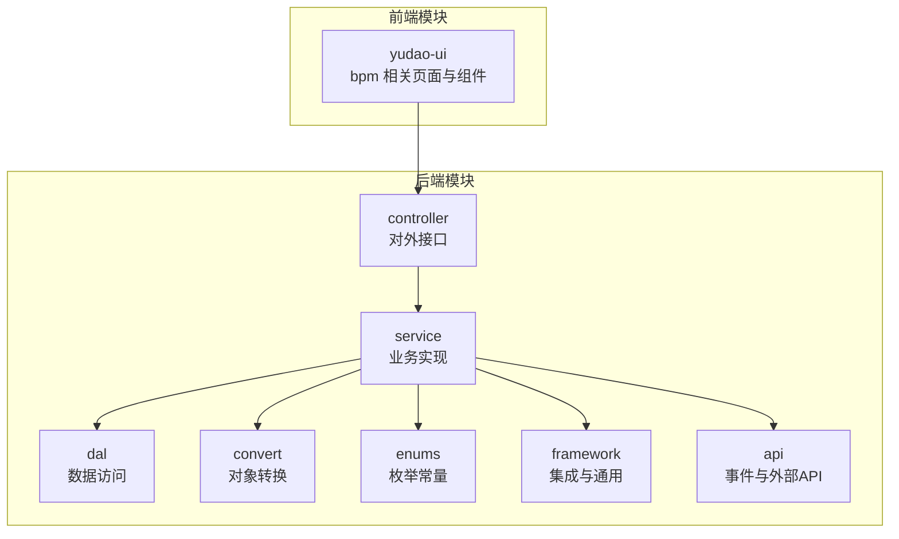
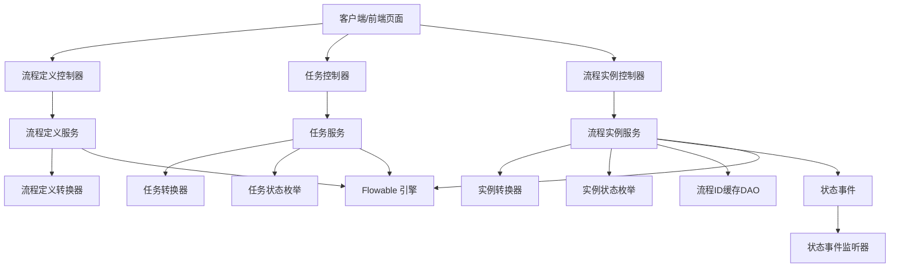
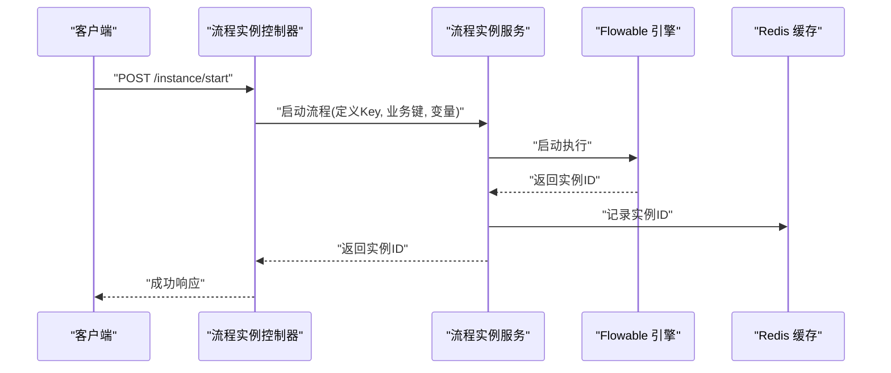
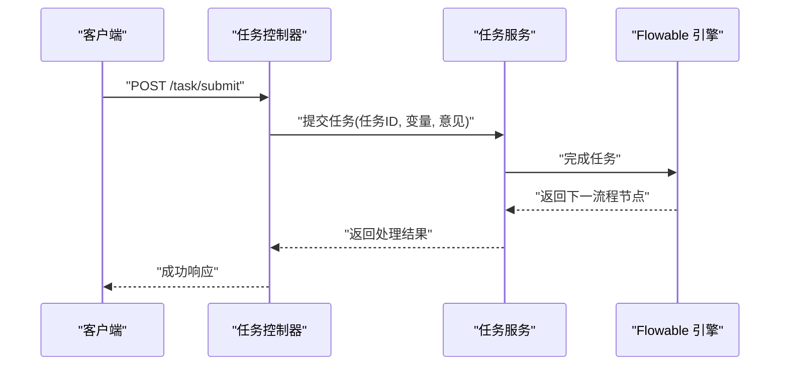
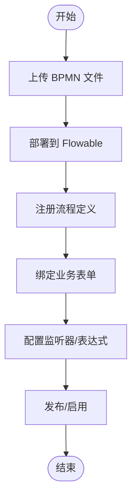
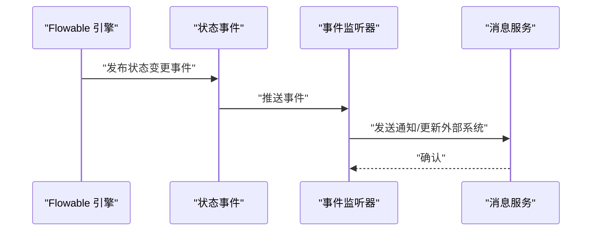
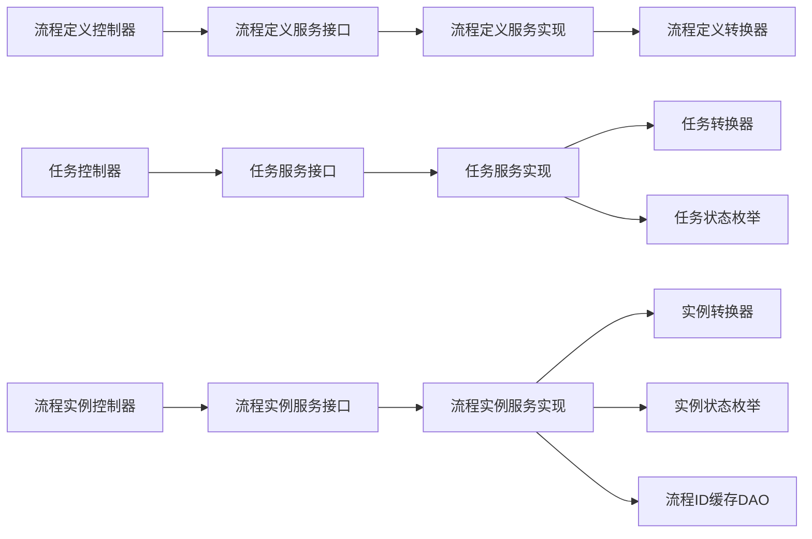

# 工作流 API

<cite>
**本文引用的文件**
- [BpmProcessInstanceApi.java](file://yudao-module-bpm/src/main/java/cn/iocoder/yudao/module/bpm/api/task/BpmProcessInstanceApi.java)
- [BpmProcessTaskApi.java](file://yudao-module-bpm/src/main/java/cn/iocoder/yudao/module/bpm/api/task/BpmProcessTaskApi.java)
- [BpmProcessInstanceApiImpl.java](file://yudao-module-bpm/src/main/java/cn/iocoder/yudao/module/bpm/api/task/BpmProcessInstanceApiImpl.java)
- [BpmProcessTaskApiImpl.java](file://yudao-module-bpm/src/main/java/cn/iocoder/yudao/module/bpm/api/task/BpmProcessTaskApiImpl.java)
- [BpmProcessDefinitionController.java](file://yudao-module-bpm/src/main/java/cn/iocoder/yudao/module/bpm/controller/admin/definition/BpmProcessDefinitionController.java)
- [BpmTaskController.java](file://yudao-module-bpm/src/main/java/cn/iocoder/yudao/module/bpm/controller/admin/task/BpmTaskController.java)
- [BpmProcessInstanceService.java](file://yudao-module-bpm/src/main/java/cn/iocoder/yudao/module/bpm/service/task/BpmProcessInstanceService.java)
- [BpmProcessInstanceServiceImpl.java](file://yudao-module-bpm/src/main/java/cn/iocoder/yudao/module/bpm/service/task/BpmProcessInstanceServiceImpl.java)
- [BpmTaskService.java](file://yudao-module-bpm/src/main/java/cn/iocoder/yudao/module/bpm/service/task/BpmTaskService.java)
- [BpmTaskServiceImpl.java](file://yudao-module-bpm/src/main/java/cn/iocoder/yudao/module/bpm/service/task/BpmTaskServiceImpl.java)
- [BpmProcessDefinitionService.java](file://yudao-module-bpm/src/main/java/cn/iocoder/yudao/module/bpm/service/definition/BpmProcessDefinitionService.java)
- [BpmProcessDefinitionServiceImpl.java](file://yudao-module-bpm/src/main/java/cn/iocoder/yudao/module/bpm/service/definition/BpmProcessDefinitionServiceImpl.java)
- [BpmProcessInstanceStatusEvent.java](file://yudao-module-bpm/src/main/java/cn/iocoder/yudao/module/bpm/api/event/BpmProcessInstanceStatusEvent.java)
- [BpmProcessInstanceStatusEventListener.java](file://yudao-module-bpm/src/main/java/cn/iocoder/yudao/module/bpm/api/event/BpmProcessInstanceStatusEventListener.java)
- [BpmProcessInstanceStatusEnum.java](file://yudao-module-bpm/src/main/java/cn/iocoder/yudao/module/bpm/enums/task/BpmProcessInstanceStatusEnum.java)
- [BpmTaskStatusEnum.java](file://yudao-module-bpm/src/main/java/cn/iocoder/yudao/module/bpm/enums/task/BpmTaskStatusEnum.java)
- [BpmProcessInstanceCreateReqDTO.java](file://yudao-module-bpm/src/main/java/cn/iocoder/yudao/module/bpm/api/task/dto/BpmProcessInstanceCreateReqDTO.java)
- [BpmProcessInstanceConvert.java](file://yudao-module-bpm/src/main/java/cn/iocoder/yudao/module/bpm/convert/task/BpmProcessInstanceConvert.java)
- [BpmTaskConvert.java](file://yudao-module-bpm/src/main/java/cn/iocoder/yudao/module/bpm/convert/task/BpmTaskConvert.java)
- [BpmProcessDefinitionConvert.java](file://yudao-module-bpm/src/main/java/cn/iocoder/yudao/module/bpm/convert/definition/BpmProcessDefinitionConvert.java)
- [BpmModelConvert.java](file://yudao-module-bpm/src/main/java/cn/iocoder/yudao/module/bpm/convert/definition/BpmModelConvert.java)
- [BpmProcessIdRedisDAO.java](file://yudao-module-bpm/src/main/java/cn/iocoder/yudao/module/bpm/dal/redis/BpmProcessIdRedisDAO.java)
- [RedisKeyConstants.java](file://yudao-module-bpm/src/main/java/cn/iocoder/yudao/module/bpm/dal/redis/RedisKeyConstants.java)
- [BpmModelService.java](file://yudao-module-bpm/src/main/java/cn/iocoder/yudao/module/bpm/service/definition/BpmModelService.java)
- [BpmModelServiceImpl.java](file://yudao-module-bpm/src/main/java/cn/iocoder/yudao/module/bpm/service/definition/BpmModelServiceImpl.java)
- [BpmFormService.java](file://yudao-module-bpm/src/main/java/cn/iocoder/yudao/module/bpm/service/definition/BpmFormService.java)
- [BpmFormServiceImpl.java](file://yudao-module-bpm/src/main/java/cn/iocoder/yudao/module/bpm/service/definition/BpmFormServiceImpl.java)
- [BpmCategoryService.java](file://yudao-module-bpm/src/main/java/cn/iocoder/yudao/module/bpm/service/definition/BpmCategoryService.java)
- [BpmCategoryServiceImpl.java](file://yudao-module-bpm/src/main/java/cn/iocoder/yudao/module/bpm/service/definition/BpmCategoryServiceImpl.java)
- [BpmProcessExpressionService.java](file://yudao-module-bpm/src/main/java/cn/iocoder/yudao/module/bpm/service/definition/BpmProcessExpressionService.java)
- [BpmProcessExpressionServiceImpl.java](file://yudao-module-bpm/src/main/java/cn/iocoder/yudao/module/bpm/service/definition/BpmProcessExpressionServiceImpl.java)
- [BpmProcessListenerService.java](file://yudao-module-bpm/src/main/java/cn/iocoder/yudao/module/bpm/service/definition/BpmProcessListenerService.java)
- [BpmProcessListenerServiceImpl.java](file://yudao-module-bpm/src/main/java/cn/iocoder/yudao/module/bpm/service/definition/BpmProcessListenerServiceImpl.java)
- [BpmUserGroupService.java](file://yudao-module-bpm/src/main/java/cn/iocoder/yudao/module/bpm/service/definition/BpmUserGroupService.java)
- [BpmUserGroupServiceImpl.java](file://yudao-module-bpm/src/main/java/cn/iocoder/yudao/module/bpm/service/definition/BpmUserGroupServiceImpl.java)
- [BpmMessageService.java](file://yudao-module-bpm/src/main/java/cn/iocoder/yudao/module/bpm/service/message/BpmMessageService.java)
- [BpmMessageServiceImpl.java](file://yudao-module-bpm/src/main/java/cn/iocoder/yudao/module/bpm/service/message/BpmMessageServiceImpl.java)
- [BpmProcessInstanceCopyService.java](file://yudao-module-bpm/src/main/java/cn/iocoder/yudao/module/bpm/service/task/BpmProcessInstanceCopyService.java)
- [BpmProcessInstanceCopyServiceImpl.java](file://yudao-module-bpm/src/main/java/cn/iocoder/yudao/module/bpm/service/task/BpmProcessInstanceCopyServiceImpl.java)
- [BpmProcessInstanceStatusEvent.java](file://yudao-module-bpm/src/main/java/cn/iocoder/yudao/module/bpm/api/event/BpmProcessInstanceStatusEvent.java)
- [BpmProcessInstanceStatusEventListener.java](file://yudao-module-bpm/src/main/java/cn/iocoder/yudao/module/bpm/api/event/BpmProcessInstanceStatusEventListener.java)
- [YudaoServerApplication.java](file://yudao-server/src/main/java/cn/iocoder/yudao/server/YudaoServerApplication.java)
- [application.yaml](file://yudao-server/src/main/resources/application.yaml)
- [application-dev.yaml](file://yudao-server/src/main/resources/application-dev.yaml)
- [application-local.yaml](file://yudao-server/src/main/resources/application-local.yaml)
</cite>

## 目录
1. [引言](#引言)
2. [项目结构](#项目结构)
3. [核心组件](#核心组件)
4. [架构总览](#架构总览)
5. [详细组件分析](#详细组件分析)
6. [依赖关系分析](#依赖关系分析)
7. [性能考虑](#性能考虑)
8. [故障排查指南](#故障排查指南)
9. [结论](#结论)
10. [附录](#附录)

## 引言
本文件面向工作流模块的 API 封装与集成，系统性梳理 BPMN 流程设计、流程实例管理、任务处理、流程监控、流程变量传递、权限控制、异常处理与性能优化等能力。文档以 Flowable 作为工作流引擎，结合后端 Java 控制器与服务层、前端 Vue 组件与 API 调用，给出接口设计模式与最佳实践，帮助开发者快速理解与扩展。

## 项目结构
工作流模块位于 yudao-module-bpm，采用按领域分层的组织方式：controller（对外接口）、service（业务逻辑）、dal（数据访问）、convert（对象转换）、enums（枚举）、framework（集成与通用能力）、api（事件与外部 API）。前端在 yudao-ui 中通过独立的 bpm 目录提供流程设计器、流程列表、任务中心等页面与 API 调用。

图表来源
- [BpmProcessDefinitionController.java](file://yudao-module-bpm/src/main/java/cn/iocoder/yudao/module/bpm/controller/admin/definition/BpmProcessDefinitionController.java)
- [BpmTaskController.java](file://yudao-module-bpm/src/main/java/cn/iocoder/yudao/module/bpm/controller/admin/task/BpmTaskController.java)
- [BpmProcessInstanceService.java](file://yudao-module-bpm/src/main/java/cn/iocoder/yudao/module/bpm/service/task/BpmProcessInstanceService.java)
- [BpmTaskService.java](file://yudao-module-bpm/src/main/java/cn/iocoder/yudao/module/bpm/service/task/BpmTaskService.java)
- [BpmProcessDefinitionService.java](file://yudao-module-bpm/src/main/java/cn/iocoder/yudao/module/bpm/service/definition/BpmProcessDefinitionService.java)

章节来源
- [BpmProcessDefinitionController.java](file://yudao-module-bpm/src/main/java/cn/iocoder/yudao/module/bpm/controller/admin/definition/BpmProcessDefinitionController.java)
- [BpmTaskController.java](file://yudao-module-bpm/src/main/java/cn/iocoder/yudao/module/bpm/controller/admin/task/BpmTaskController.java)

## 核心组件
- 流程实例 API：封装流程启动、挂起/激活、撤销、查询等能力，支持传入流程变量与业务键。
- 任务 API：封装任务提交、转办、委派、退回、撤回、强制结束等操作。
- 流程定义 API：提供流程定义的部署、查询、删除、版本管理与监听器配置。
- 服务实现：基于 Flowable 的 ServiceTask、TaskListener、ExecutionListener 等扩展点，实现业务规则与状态变更。
- 事件与监听：通过进程状态事件驱动消息通知与后续动作。
- 转换器：统一 DTO/DO/VO 的映射，保证前后端契约一致。
- 缓存与 ID 分配：Redis 记录流程实例 ID，避免冲突与提升查询效率。

章节来源
- [BpmProcessInstanceApi.java](file://yudao-module-bpm/src/main/java/cn/iocoder/yudao/module/bpm/api/task/BpmProcessInstanceApi.java)
- [BpmProcessTaskApi.java](file://yudao-module-bpm/src/main/java/cn/iocoder/yudao/module/bpm/api/task/BpmProcessTaskApi.java)
- [BpmProcessInstanceApiImpl.java](file://yudao-module-bpm/src/main/java/cn/iocoder/yudao/module/bpm/api/task/BpmProcessInstanceApiImpl.java)
- [BpmProcessTaskApiImpl.java](file://yudao-module-bpm/src/main/java/cn/iocoder/yudao/module/bpm/api/task/BpmProcessTaskApiImpl.java)

## 架构总览
工作流模块遵循“控制器-服务-数据访问-转换-枚举”的分层架构，配合 Flowable 引擎完成 BPMN 解析、执行与状态管理；同时通过事件机制与消息服务实现异步通知与流程监控。

图表来源
- [BpmProcessDefinitionController.java](file://yudao-module-bpm/src/main/java/cn/iocoder/yudao/module/bpm/controller/admin/definition/BpmProcessDefinitionController.java)
- [BpmTaskController.java](file://yudao-module-bpm/src/main/java/cn/iocoder/yudao/module/bpm/controller/admin/task/BpmTaskController.java)
- [BpmProcessDefinitionService.java](file://yudao-module-bpm/src/main/java/cn/iocoder/yudao/module/bpm/service/definition/BpmProcessDefinitionService.java)
- [BpmProcessInstanceService.java](file://yudao-module-bpm/src/main/java/cn/iocoder/yudao/module/bpm/service/task/BpmProcessInstanceService.java)
- [BpmTaskService.java](file://yudao-module-bpm/src/main/java/cn/iocoder/yudao/module/bpm/service/task/BpmTaskService.java)
- [BpmProcessDefinitionConvert.java](file://yudao-module-bpm/src/main/java/cn/iocoder/yudao/module/bpm/convert/definition/BpmProcessDefinitionConvert.java)
- [BpmProcessInstanceConvert.java](file://yudao-module-bpm/src/main/java/cn/iocoder/yudao/module/bpm/convert/task/BpmProcessInstanceConvert.java)
- [BpmTaskConvert.java](file://yudao-module-bpm/src/main/java/cn/iocoder/yudao/module/bpm/convert/task/BpmTaskConvert.java)
- [BpmProcessIdRedisDAO.java](file://yudao-module-bpm/src/main/java/cn/iocoder/yudao/module/bpm/dal/redis/BpmProcessIdRedisDAO.java)
- [BpmProcessInstanceStatusEvent.java](file://yudao-module-bpm/src/main/java/cn/iocoder/yudao/module/bpm/api/event/BpmProcessInstanceStatusEvent.java)
- [BpmProcessInstanceStatusEventListener.java](file://yudao-module-bpm/src/main/java/cn/iocoder/yudao/module/bpm/api/event/BpmProcessInstanceStatusEventListener.java)

## 详细组件分析

### 流程实例 API 与服务
- 接口职责
  - 启动流程：接收流程定义 Key、业务键、发起人、流程变量等参数，返回实例 ID。
  - 查询流程：支持分页、筛选条件（发起人、状态、时间范围等）。
  - 挂起/激活：对流程实例进行暂停与恢复。
  - 撤销申请：对正在运行的流程发起撤销请求。
- 关键实现
  - 控制器层：Admin 与 App 双入口，App 侧重移动端或轻量调用。
  - 服务层：封装 Flowable RuntimeService、RepositoryService、HistoryService 的调用，统一异常与日志。
  - 转换器：将 DO/DTO 映射为 Flowable 所需的变量与查询条件。
  - 状态管理：通过状态枚举与事件监听器驱动后续动作与通知。
- 流程变量传递
  - 支持字符串、数值、布尔、JSON 等类型，建议通过 DTO 统一封装，便于校验与审计。
- 权限控制
  - 基于用户身份与角色判断是否可查看/操作某流程实例。
- 异常处理
  - 包装为统一错误码与提示，区分业务异常与引擎异常。
- 性能优化
  - Redis 缓存流程实例 ID，减少数据库压力。
  - 分页查询与索引优化，避免大结果集扫描。

图表来源
- [BpmProcessInstanceApi.java](file://yudao-module-bpm/src/main/java/cn/iocoder/yudao/module/bpm/api/task/BpmProcessInstanceApi.java)
- [BpmProcessInstanceApiImpl.java](file://yudao-module-bpm/src/main/java/cn/iocoder/yudao/module/bpm/api/task/BpmProcessInstanceApiImpl.java)
- [BpmProcessInstanceService.java](file://yudao-module-bpm/src/main/java/cn/iocoder/yudao/module/bpm/service/task/BpmProcessInstanceService.java)
- [BpmProcessInstanceServiceImpl.java](file://yudao-module-bpm/src/main/java/cn/iocoder/yudao/module/bpm/service/task/BpmProcessInstanceServiceImpl.java)
- [BpmProcessIdRedisDAO.java](file://yudao-module-bpm/src/main/java/cn/iocoder/yudao/module/bpm/dal/redis/BpmProcessIdRedisDAO.java)

章节来源
- [BpmProcessInstanceApi.java](file://yudao-module-bpm/src/main/java/cn/iocoder/yudao/module/bpm/api/task/BpmProcessInstanceApi.java)
- [BpmProcessInstanceApiImpl.java](file://yudao-module-bpm/src/main/java/cn/iocoder/yudao/module/bpm/api/task/BpmProcessInstanceApiImpl.java)
- [BpmProcessInstanceService.java](file://yudao-module-bpm/src/main/java/cn/iocoder/yudao/module/bpm/service/task/BpmProcessInstanceService.java)
- [BpmProcessInstanceServiceImpl.java](file://yudao-module-bpm/src/main/java/cn/iocoder/yudao/module/bpm/service/task/BpmProcessInstanceServiceImpl.java)
- [BpmProcessInstanceStatusEnum.java](file://yudao-module-bpm/src/main/java/cn/iocoder/yudao/module/bpm/enums/task/BpmProcessInstanceStatusEnum.java)
- [BpmProcessInstanceCreateReqDTO.java](file://yudao-module-bpm/src/main/java/cn/iocoder/yudao/module/bpm/api/task/dto/BpmProcessInstanceCreateReqDTO.java)
- [BpmProcessInstanceConvert.java](file://yudao-module-bpm/src/main/java/cn/iocoder/yudao/module/bpm/convert/task/BpmProcessInstanceConvert.java)
- [BpmProcessIdRedisDAO.java](file://yudao-module-bpm/src/main/java/cn/iocoder/yudao/module/bpm/dal/redis/BpmProcessIdRedisDAO.java)

### 任务 API 与服务
- 接口职责
  - 任务提交：根据任务定义与审批意见完成节点流转。
  - 任务转办/委派：将当前任务转移给其他用户或代理执行。
  - 任务退回/撤回：支持退回至上一节点或撤回至发起人。
  - 强制结束：在特定条件下终止流程。
- 关键实现
  - 服务层封装 TaskService 的常用操作，统一变量与评论处理。
  - 与流程实例状态联动，确保状态一致性。
- 权限控制
  - 仅限当前任务的处理人或有授权的角色方可操作。
- 异常处理
  - 对越权、重复提交、引擎异常进行分类处理与提示。

图表来源
- [BpmProcessTaskApi.java](file://yudao-module-bpm/src/main/java/cn/iocoder/yudao/module/bpm/api/task/BpmProcessTaskApi.java)
- [BpmProcessTaskApiImpl.java](file://yudao-module-bpm/src/main/java/cn/iocoder/yudao/module/bpm/api/task/BpmProcessTaskApiImpl.java)
- [BpmTaskService.java](file://yudao-module-bpm/src/main/java/cn/iocoder/yudao/module/bpm/service/task/BpmTaskService.java)
- [BpmTaskServiceImpl.java](file://yudao-module-bpm/src/main/java/cn/iocoder/yudao/module/bpm/service/task/BpmTaskServiceImpl.java)
- [BpmTaskStatusEnum.java](file://yudao-module-bpm/src/main/java/cn/iocoder/yudao/module/bpm/enums/task/BpmTaskStatusEnum.java)

章节来源
- [BpmProcessTaskApi.java](file://yudao-module-bpm/src/main/java/cn/iocoder/yudao/module/bpm/api/task/BpmProcessTaskApi.java)
- [BpmProcessTaskApiImpl.java](file://yudao-module-bpm/src/main/java/cn/iocoder/yudao/module/bpm/api/task/BpmProcessTaskApiImpl.java)
- [BpmTaskService.java](file://yudao-module-bpm/src/main/java/cn/iocoder/yudao/module/bpm/service/task/BpmTaskService.java)
- [BpmTaskServiceImpl.java](file://yudao-module-bpm/src/main/java/cn/iocoder/yudao/module/bpm/service/task/BpmTaskServiceImpl.java)

### 流程定义 API 与服务
- 接口职责
  - 部署流程：上传 BPMN 文件并注册为流程定义。
  - 查询流程：支持分页、按分类、关键字、状态等筛选。
  - 删除流程：支持批量删除与版本清理。
  - 监听器与表达式：配置流程级监听器与表达式规则。
  - 表单与模型：绑定业务表单与模型，支撑表单渲染与校验。
- 关键实现
  - 服务层对接 RepositoryService，维护流程定义与版本。
  - 转换器负责模型与定义的双向映射。
- 权限控制
  - 仅管理员或授权角色可进行部署与删除。
- 异常处理
  - 对 BPMN 校验失败、重复部署、版本冲突等进行明确提示。

图表来源
- [BpmProcessDefinitionController.java](file://yudao-module-bpm/src/main/java/cn/iocoder/yudao/module/bpm/controller/admin/definition/BpmProcessDefinitionController.java)
- [BpmProcessDefinitionService.java](file://yudao-module-bpm/src/main/java/cn/iocoder/yudao/module/bpm/service/definition/BpmProcessDefinitionService.java)
- [BpmProcessDefinitionServiceImpl.java](file://yudao-module-bpm/src/main/java/cn/iocoder/yudao/module/bpm/service/definition/BpmProcessDefinitionServiceImpl.java)
- [BpmModelService.java](file://yudao-module-bpm/src/main/java/cn/iocoder/yudao/module/bpm/service/definition/BpmModelService.java)
- [BpmModelServiceImpl.java](file://yudao-module-bpm/src/main/java/cn/iocoder/yudao/module/bpm/service/definition/BpmModelServiceImpl.java)
- [BpmFormService.java](file://yudao-module-bpm/src/main/java/cn/iocoder/yudao/module/bpm/service/definition/BpmFormService.java)
- [BpmFormServiceImpl.java](file://yudao-module-bpm/src/main/java/cn/iocoder/yudao/module/bpm/service/definition/BpmFormServiceImpl.java)
- [BpmCategoryService.java](file://yudao-module-bpm/src/main/java/cn/iocoder/yudao/module/bpm/service/definition/BpmCategoryService.java)
- [BpmCategoryServiceImpl.java](file://yudao-module-bpm/src/main/java/cn/iocoder/yudao/module/bpm/service/definition/BpmCategoryServiceImpl.java)
- [BpmProcessExpressionService.java](file://yudao-module-bpm/src/main/java/cn/iocoder/yudao/module/bpm/service/definition/BpmProcessExpressionService.java)
- [BpmProcessExpressionServiceImpl.java](file://yudao-module-bpm/src/main/java/cn/iocoder/yudao/module/bpm/service/definition/BpmProcessExpressionServiceImpl.java)
- [BpmProcessListenerService.java](file://yudao-module-bpm/src/main/java/cn/iocoder/yudao/module/bpm/service/definition/BpmProcessListenerService.java)
- [BpmProcessListenerServiceImpl.java](file://yudao-module-bpm/src/main/java/cn/iocoder/yudao/module/bpm/service/definition/BpmProcessListenerServiceImpl.java)
- [BpmUserGroupService.java](file://yudao-module-bpm/src/main/java/cn/iocoder/yudao/module/bpm/service/definition/BpmUserGroupService.java)
- [BpmUserGroupServiceImpl.java](file://yudao-module-bpm/src/main/java/cn/iocoder/yudao/module/bpm/service/definition/BpmUserGroupServiceImpl.java)

章节来源
- [BpmProcessDefinitionController.java](file://yudao-module-bpm/src/main/java/cn/iocoder/yudao/module/bpm/controller/admin/definition/BpmProcessDefinitionController.java)
- [BpmProcessDefinitionService.java](file://yudao-module-bpm/src/main/java/cn/iocoder/yudao/module/bpm/service/definition/BpmProcessDefinitionService.java)
- [BpmProcessDefinitionServiceImpl.java](file://yudao-module-bpm/src/main/java/cn/iocoder/yudao/module/bpm/service/definition/BpmProcessDefinitionServiceImpl.java)

### 事件与状态管理
- 状态事件
  - 当流程实例状态发生变更（如启动、完成、撤销、挂起）时，触发状态事件。
- 事件监听器
  - 监听器消费事件，发送消息通知、更新外部系统、记录审计日志。
- 与消息服务集成
  - 通过消息服务实现异步通知与解耦。

图表来源
- [BpmProcessInstanceStatusEvent.java](file://yudao-module-bpm/src/main/java/cn/iocoder/yudao/module/bpm/api/event/BpmProcessInstanceStatusEvent.java)
- [BpmProcessInstanceStatusEventListener.java](file://yudao-module-bpm/src/main/java/cn/iocoder/yudao/module/bpm/api/event/BpmProcessInstanceStatusEventListener.java)

章节来源
- [BpmProcessInstanceStatusEvent.java](file://yudao-module-bpm/src/main/java/cn/iocoder/yudao/module/bpm/api/event/BpmProcessInstanceStatusEvent.java)
- [BpmProcessInstanceStatusEventListener.java](file://yudao-module-bpm/src/main/java/cn/iocoder/yudao/module/bpm/api/event/BpmProcessInstanceStatusEventListener.java)

### 前端集成与流程图绘制
- 设计器组件
  - 提供 BPMN 图编辑、节点配置、连线设置、监听器与表达式配置。
- 页面与路由
  - 定义流程设计、流程列表、任务中心、历史查询等页面。
- API 调用
  - 通过 axios 封装的 service 调用后端接口，统一错误处理与加载态。

章节来源
- [BpmProcessDefinitionController.java](file://yudao-module-bpm/src/main/java/cn/iocoder/yudao/module/bpm/controller/admin/definition/BpmProcessDefinitionController.java)
- [BpmTaskController.java](file://yudao-module-bpm/src/main/java/cn/iocoder/yudao/module/bpm/controller/admin/task/BpmTaskController.java)

## 依赖关系分析
- 控制器依赖服务接口，服务实现依赖 Flowable 引擎与 DAO 层。
- 转换器贯穿服务与控制器之间，保证数据形态一致。
- 枚举用于状态与策略控制，增强可读性与可维护性。
- RedisDAO 与缓存键常量用于流程实例 ID 的持久化与检索。

图表来源
- [BpmProcessDefinitionController.java](file://yudao-module-bpm/src/main/java/cn/iocoder/yudao/module/bpm/controller/admin/definition/BpmProcessDefinitionController.java)
- [BpmTaskController.java](file://yudao-module-bpm/src/main/java/cn/iocoder/yudao/module/bpm/controller/admin/task/BpmTaskController.java)
- [BpmProcessDefinitionService.java](file://yudao-module-bpm/src/main/java/cn/iocoder/yudao/module/bpm/service/definition/BpmProcessDefinitionService.java)
- [BpmTaskService.java](file://yudao-module-bpm/src/main/java/cn/iocoder/yudao/module/bpm/service/task/BpmTaskService.java)
- [BpmProcessInstanceService.java](file://yudao-module-bpm/src/main/java/cn/iocoder/yudao/module/bpm/service/task/BpmProcessInstanceService.java)
- [BpmProcessDefinitionConvert.java](file://yudao-module-bpm/src/main/java/cn/iocoder/yudao/module/bpm/convert/definition/BpmProcessDefinitionConvert.java)
- [BpmProcessInstanceConvert.java](file://yudao-module-bpm/src/main/java/cn/iocoder/yudao/module/bpm/convert/task/BpmProcessInstanceConvert.java)
- [BpmTaskConvert.java](file://yudao-module-bpm/src/main/java/cn/iocoder/yudao/module/bpm/convert/task/BpmTaskConvert.java)
- [BpmProcessIdRedisDAO.java](file://yudao-module-bpm/src/main/java/cn/iocoder/yudao/module/bpm/dal/redis/BpmProcessIdRedisDAO.java)

章节来源
- [BpmProcessDefinitionController.java](file://yudao-module-bpm/src/main/java/cn/iocoder/yudao/module/bpm/controller/admin/definition/BpmProcessDefinitionController.java)
- [BpmTaskController.java](file://yudao-module-bpm/src/main/java/cn/iocoder/yudao/module/bpm/controller/admin/task/BpmTaskController.java)
- [BpmProcessDefinitionService.java](file://yudao-module-bpm/src/main/java/cn/iocoder/yudao/module/bpm/service/definition/BpmProcessDefinitionService.java)
- [BpmTaskService.java](file://yudao-module-bpm/src/main/java/cn/iocoder/yudao/module/bpm/service/task/BpmTaskService.java)
- [BpmProcessInstanceService.java](file://yudao-module-bpm/src/main/java/cn/iocoder/yudao/module/bpm/service/task/BpmProcessInstanceService.java)

## 性能考虑
- 缓存策略
  - 使用 Redis 缓存流程实例 ID 与关键元数据，降低数据库访问频率。
- 分页与索引
  - 列表查询默认分页，确保对大数据量的稳定响应。
- 异步通知
  - 通过事件与消息服务异步处理通知与后续动作，避免阻塞主流程。
- 变量大小控制
  - 控制流程变量体积，避免影响引擎性能与持久化开销。
- 并发控制
  - 在高并发场景下，合理设置任务加锁与重试策略，防止重复提交。

## 故障排查指南
- 常见问题
  - 流程无法启动：检查流程定义是否已部署、变量是否缺失、监听器是否报错。
  - 任务无法提交：确认当前用户是否有处理权限、任务是否存在、引擎是否抛出异常。
  - 状态不一致：检查事件监听器是否正常触发、消息服务是否成功投递。
- 排查步骤
  - 查看服务日志与异常栈，定位具体环节。
  - 核对流程变量与业务键，确保与流程定义一致。
  - 检查 Redis 缓存是否命中，必要时清空缓存验证。
- 回滚机制
  - 对关键操作提供补偿与回滚策略，例如撤销流程、退回任务、恢复状态等。
- 最佳实践
  - 统一异常处理与错误码，便于前端展示与用户理解。
  - 对敏感操作增加二次确认与审计日志。

章节来源
- [BpmProcessInstanceStatusEvent.java](file://yudao-module-bpm/src/main/java/cn/iocoder/yudao/module/bpm/api/event/BpmProcessInstanceStatusEvent.java)
- [BpmProcessInstanceStatusEventListener.java](file://yudao-module-bpm/src/main/java/cn/iocoder/yudao/module/bpm/api/event/BpmProcessInstanceStatusEventListener.java)
- [BpmProcessInstanceStatusEnum.java](file://yudao-module-bpm/src/main/java/cn/iocoder/yudao/module/bpm/enums/task/BpmProcessInstanceStatusEnum.java)
- [BpmTaskStatusEnum.java](file://yudao-module-bpm/src/main/java/cn/iocoder/yudao/module/bpm/enums/task/BpmTaskStatusEnum.java)

## 结论
本工作流模块以 Flowable 为核心，围绕流程定义、流程实例与任务处理构建了完整的 API 封装体系。通过清晰的分层架构、事件驱动与缓存优化，实现了高可用、可扩展与易维护的工作流平台。建议在实际业务中结合权限控制、异常处理与性能优化策略，持续完善流程设计与用户体验。

## 附录
- 配置文件
  - 应用配置位于 yudao-server 的 resources 目录，包含开发、本地与生产环境的 YAML 配置。
- 启动应用
  - 通过 YudaoServerApplication 启动后端服务，前端通过 npm 或打包产物提供页面与交互。

章节来源
- [YudaoServerApplication.java](file://yudao-server/src/main/java/cn/iocoder/yudao/server/YudaoServerApplication.java)
- [application.yaml](file://yudao-server/src/main/resources/application.yaml)
- [application-dev.yaml](file://yudao-server/src/main/resources/application-dev.yaml)
- [application-local.yaml](file://yudao-server/src/main/resources/application-local.yaml)