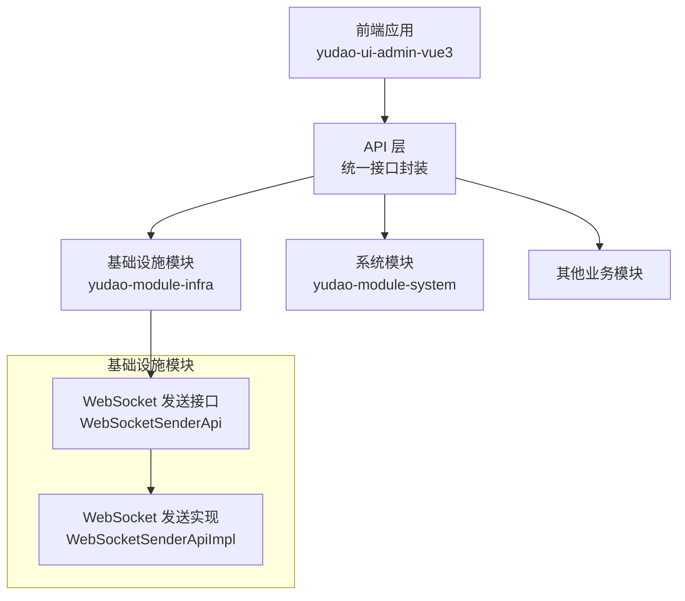
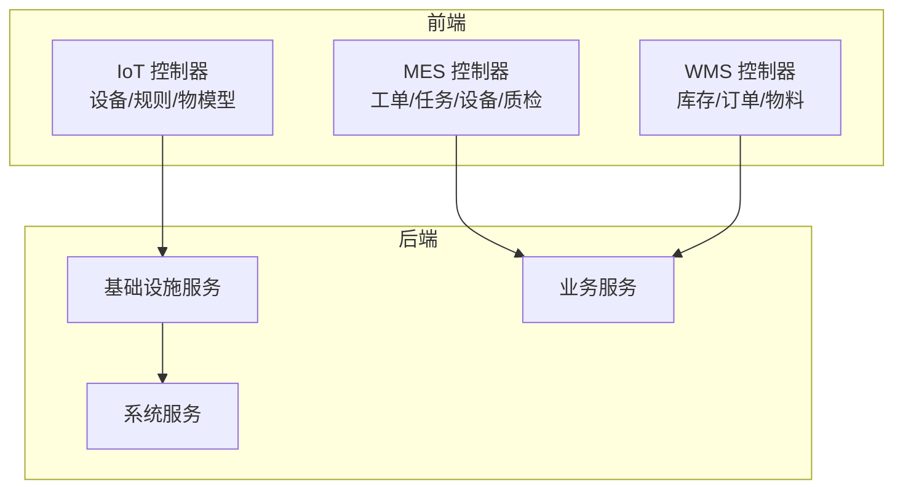
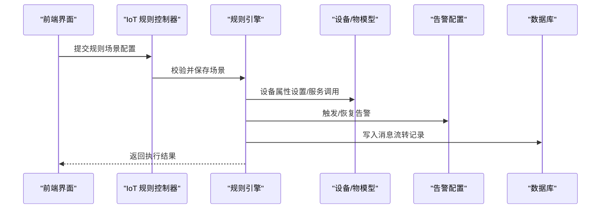
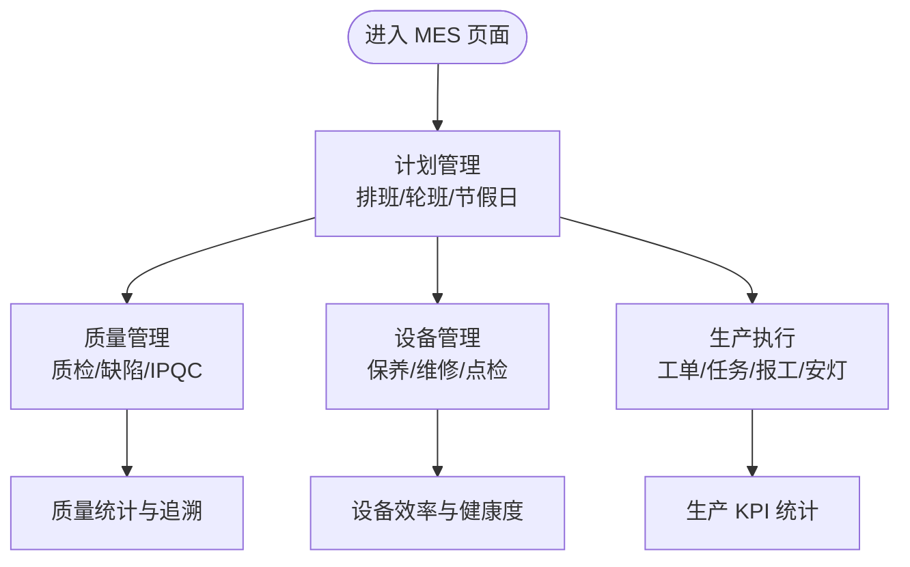
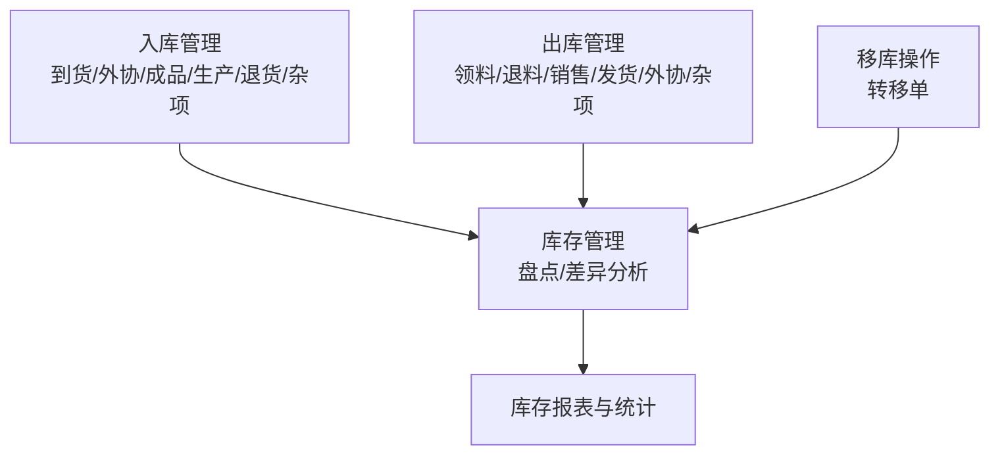
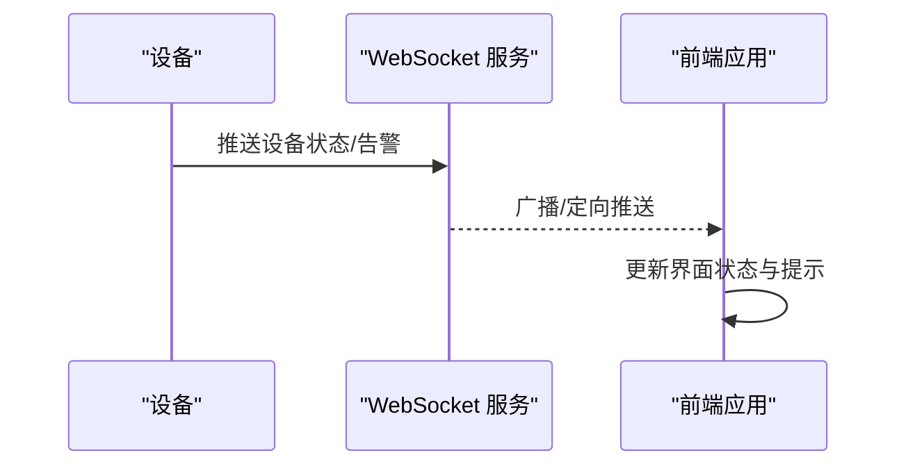
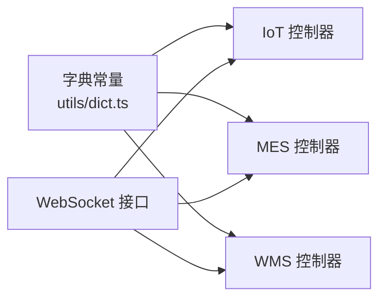

# 物联网与制造 API

<cite>
**本文引用的文件**
- [dict.ts](file://yudao-ui/yudao-ui-admin-vue3/src/utils/dict.ts)
- [ActionSection.vue](file://yudao-ui/yudao-ui-admin-vue3/src/views/iot/rule/scene/form/sections/ActionSection.vue)
- [DatabaseConfigForm.vue](file://yudao-ui/yudao-ui-admin-vue3/src/views/iot/rule/data/sink/config/DatabaseConfigForm.vue)
- [WebSocketSenderApi.java](file://yudao-module-infra/src/main/java/cn/iocoder/yudao/module/infra/api/websocket/WebSocketSenderApi.java)
- [WebSocketSenderApiImpl.java](file://yudao-module-infra/src/main/java/cn/iocoder/yudao/module/infra/api/websocket/WebSocketSenderApiImpl.java)
- [MesProWorkOrderController.java](file://yudao-ui/yudao-ui-admin-vue3/src/views/mes/pro/work-order/MesProWorkOrderController.java)
- [MesProTaskController.java](file://yudao-ui/yudao-ui-admin-vue3/src/views/mes/pro/task/MesProTaskController.java)
- [MesDvMachineryController.java](file://yudao-ui/yudao-ui-admin-vue3/src/views/mes/dv/machinery/MesDvMachineryController.java)
- [MesQcInspectionController.java](file://yudao-ui/yudao-ui-admin-vue3/src/views/mes/qc/inspection/MesQcInspectionController.java)
- [MesHomeDashboardController.java](file://yudao-ui/yudao-ui-admin-vue3/src/views/mes/home/dashboard/MesHomeDashboardController.java)
- [MesInventoryController.java](file://yudao-ui/yudao-ui-admin-vue3/src/views/wms/inventory/MesInventoryController.java)
- [MesOrderController.java](file://yudao-ui/yudao-ui-admin-vue3/src/views/wms/order/MesOrderController.java)
- [MesMdProductController.java](file://yudao-ui/yudao-ui-admin-vue3/src/views/wms/md/product/MesMdProductController.java)
- [MesHomeDashboardController.java](file://yudao-ui/yudao-ui-admin-vue3/src/views/mes/home/dashboard/MesHomeDashboardController.java)
</cite>

## 目录
1. [简介](#简介)
2. [项目结构](#项目结构)
3. [核心组件](#核心组件)
4. [架构总览](#架构总览)
5. [详细组件分析](#详细组件分析)
6. [依赖分析](#依赖分析)
7. [性能考虑](#性能考虑)
8. [故障排查指南](#故障排查指南)
9. [结论](#结论)
10. [附录](#附录)

## 简介
本文件面向工业物联网（IoT）、制造执行系统（MES）与仓储管理（WMS）场景，提供专业级 API 封装文档。内容覆盖：
- IoT 设备管理、数据采集与告警处理的 API 设计与实现要点
- MES 计划管理、质量管理、设备管理、生产执行的接口规范
- WMS 入库管理、出库管理、库存盘点与移库操作的 API 方案
- 工业物联网数据传输协议与实时通信机制
- 设备状态监控、生产数据统计与质量追溯的 API 实现路径
- 工业场景下的 API 性能优化与可靠性保障策略

## 项目结构
后端采用多模块分层架构，前端通过统一的 API 层进行交互。IoT、MES、WMS 功能在前端以视图控制器与字典常量形式组织，后端基础设施模块提供 WebSocket 实时通信能力。

图表来源
- [WebSocketSenderApi.java](file://yudao-module-infra/src/main/java/cn/iocoder/yudao/module/infra/api/websocket/WebSocketSenderApi.java)
- [WebSocketSenderApiImpl.java](file://yudao-module-infra/src/main/java/cn/iocoder/yudao/module/infra/api/websocket/WebSocketSenderApiImpl.java)

章节来源
- [dict.ts:239-329](file://yudao-ui/yudao-ui-admin-vue3/src/utils/dict.ts#L239-L329)

## 核心组件
- 字典常量体系：前端通过统一的字典常量定义 IoT、MES、WMS 的枚举类型与状态码，确保前后端一致性与可维护性。
- WebSocket 实时通信：基础设施模块提供 WebSocket 发送接口，支持设备状态、告警等实时推送。
- 视图控制器：MES/WMS 前端以控制器形式组织页面逻辑，便于扩展与复用。

章节来源
- [dict.ts:239-329](file://yudao-ui/yudao-ui-admin-vue3/src/utils/dict.ts#L239-L329)
- [WebSocketSenderApi.java](file://yudao-module-infra/src/main/java/cn/iocoder/yudao/module/infra/api/websocket/WebSocketSenderApi.java)
- [WebSocketSenderApiImpl.java](file://yudao-module-infra/src/main/java/cn/iocoder/yudao/module/infra/api/websocket/WebSocketSenderApiImpl.java)

## 架构总览
IoT、MES、WMS 的 API 通过前端控制器与后端服务协同工作，基础设施模块负责实时通信与日志记录，系统模块提供通用能力（如权限、字典、短信等）。

图表来源
- [dict.ts:239-329](file://yudao-ui/yudao-ui-admin-vue3/src/utils/dict.ts#L239-L329)
- [WebSocketSenderApi.java](file://yudao-module-infra/src/main/java/cn/iocoder/yudao/module/infra/api/websocket/WebSocketSenderApi.java)

## 详细组件分析

### IoT 物联网 API 封装
IoT 模块涵盖设备管理、物模型、规则引擎与告警处理。前端通过字典常量统一管理协议、序列化、联网方式、设备状态、告警级别等；规则场景支持设备控制与告警动作联动。

- 设备与物模型
  - 设备状态、协议类型、序列化类型、联网方式、定位类型等通过字典常量统一管理。
  - 物模型字段类型、单位、读写类型等通过字典常量定义，保证前后端一致。

- 规则引擎与动作
  - 规则场景支持多种动作类型，包括设备属性设置、触发/恢复告警等。
  - 动作配置包含设备选择、标识符、参数以及告警配置 ID。

- 数据流与存储
  - 规则场景支持将消息落库，数据库表结构包含租户编号、请求方法、上报时间、完整消息 JSON 等字段，便于审计与回放。

图表来源
- [ActionSection.vue:100-307](file://yudao-ui/yudao-ui-admin-vue3/src/views/iot/rule/scene/form/sections/ActionSection.vue#L100-L307)
- [DatabaseConfigForm.vue:54-66](file://yudao-ui/yudao-ui-admin-vue3/src/views/iot/rule/data/sink/config/DatabaseConfigForm.vue#L54-L66)

章节来源
- [dict.ts:239-260](file://yudao-ui/yudao-ui-admin-vue3/src/utils/dict.ts#L239-L260)
- [ActionSection.vue:100-307](file://yudao-ui/yudao-ui-admin-vue3/src/views/iot/rule/scene/form/sections/ActionSection.vue#L100-L307)
- [DatabaseConfigForm.vue:54-66](file://yudao-ui/yudao-ui-admin-vue3/src/views/iot/rule/data/sink/config/DatabaseConfigForm.vue#L54-L66)

### MES 制造执行系统 API 封装
MES 模块围绕计划管理、质量管理、设备管理与生产执行构建，前端通过控制器组织页面逻辑，并以字典常量统一状态与类型。

- 计划管理
  - 轮班方式、倒班方式、节假日类型、班组类型、排班计划状态等通过字典常量定义，确保计划编制与执行的一致性。

- 质量管理
  - 质检方案类型、检测项类型、缺陷等级、检测结果、IPQC 类型等通过字典常量统一，支撑质量追溯与统计分析。

- 设备管理
  - 工具状态、保养维护类型、设备状态、点检保养项目类型、维修工单状态、保养记录状态等通过字典常量统一，便于设备生命周期管理。

- 生产执行
  - 工单状态、工单来源类型、工单类型、工序关系类型、生产任务状态、安灯级别与处置状态、上下工状态类型等通过字典常量统一，支撑生产过程可视化与统计。

图表来源
- [dict.ts:262-329](file://yudao-ui/yudao-ui-admin-vue3/src/utils/dict.ts#L262-L329)

章节来源
- [dict.ts:262-329](file://yudao-ui/yudao-ui-admin-vue3/src/utils/dict.ts#L262-L329)

### WMS 仓储管理 API 封装
WMS 模块围绕入库、出库、库存盘点与移库展开，前端通过控制器组织页面逻辑，并以字典常量统一单据状态与类型。

- 入库管理
  - 到货通知单、外协入库单、成品入库单、生产入库单、销售退货单、供应商退货单、杂项入库单等状态与类型通过字典常量统一。

- 出库管理
  - 领料出库单、生产退料单、销售出库单、发货通知单、外协出库单、杂项出库单等状态与类型通过字典常量统一。

- 库存管理
  - 盘点类型、盘点任务状态、盘点任务行状态、盘点方案参数类型等通过字典常量统一，支撑库存准确性与差异分析。

- 移库操作
  - 转移单状态与类型通过字典常量统一，支持跨库位、跨仓库的移库流程。

图表来源
- [dict.ts:262-329](file://yudao-ui/yudao-ui-admin-vue3/src/utils/dict.ts#L262-L329)

章节来源
- [dict.ts:262-329](file://yudao-ui/yudao-ui-admin-vue3/src/utils/dict.ts#L262-L329)

### 实时通信与数据传输
- WebSocket 实时通信
  - 基础设施模块提供 WebSocket 发送接口与实现，支持设备状态、告警信息的实时推送，前端可通过统一接口订阅与接收。

图表来源
- [WebSocketSenderApi.java](file://yudao-module-infra/src/main/java/cn/iocoder/yudao/module/infra/api/websocket/WebSocketSenderApi.java)
- [WebSocketSenderApiImpl.java](file://yudao-module-infra/src/main/java/cn/iocoder/yudao/module/infra/api/websocket/WebSocketSenderApiImpl.java)

章节来源
- [WebSocketSenderApi.java](file://yudao-module-infra/src/main/java/cn/iocoder/yudao/module/infra/api/websocket/WebSocketSenderApi.java)
- [WebSocketSenderApiImpl.java](file://yudao-module-infra/src/main/java/cn/iocoder/yudao/module/infra/api/websocket/WebSocketSenderApiImpl.java)

## 依赖分析
- 前端依赖
  - 字典常量集中于 utils/dict.ts，被各模块控制器引用，确保状态与类型的一致性。
  - 规则场景控制器依赖设备/物模型与告警配置，最终落库审计。

- 后端依赖
  - 基础设施模块提供 WebSocket 能力，供 IoT 与 MES/WMS 实时场景使用。
  - 系统模块提供通用能力（权限、字典、日志等），支撑业务模块稳定运行。

图表来源
- [dict.ts:239-329](file://yudao-ui/yudao-ui-admin-vue3/src/utils/dict.ts#L239-L329)
- [WebSocketSenderApi.java](file://yudao-module-infra/src/main/java/cn/iocoder/yudao/module/infra/api/websocket/WebSocketSenderApi.java)

章节来源
- [dict.ts:239-329](file://yudao-ui/yudao-ui-admin-vue3/src/utils/dict.ts#L239-L329)
- [WebSocketSenderApi.java](file://yudao-module-infra/src/main/java/cn/iocoder/yudao/module/infra/api/websocket/WebSocketSenderApi.java)

## 性能考虑
- 实时通信优化
  - 使用 WebSocket 进行长连接，减少 HTTP 请求开销；对设备状态与告警推送进行去重与合并，避免频繁刷新。
- 数据落库与查询
  - 规则场景的消息落库需建立合适索引（如时间字段），并定期清理历史数据，避免表膨胀影响查询性能。
- 前端渲染
  - 控制器按需加载与懒渲染，结合虚拟列表与分页，降低大数据量页面的内存占用。
- 缓存与降级
  - 对高频读取的字典常量进行本地缓存；在网络异常时提供离线提示与重试机制。

## 故障排查指南
- WebSocket 推送失败
  - 检查 WebSocket 服务是否正常启动与连接；确认客户端订阅通道与权限。
- 规则场景执行异常
  - 校验设备标识符与参数配置；查看数据库消息流转记录，定位失败原因。
- 字典状态不一致
  - 确认前端字典常量与后端枚举同步；检查缓存是否过期。

章节来源
- [WebSocketSenderApi.java](file://yudao-module-infra/src/main/java/cn/iocoder/yudao/module/infra/api/websocket/WebSocketSenderApi.java)
- [DatabaseConfigForm.vue:54-66](file://yudao-ui/yudao-ui-admin-vue3/src/views/iot/rule/data/sink/config/DatabaseConfigForm.vue#L54-L66)

## 结论
本文件基于现有代码结构，梳理了 IoT、MES、WMS 的 API 封装思路与实现要点。通过统一的字典常量体系、规则引擎与实时通信能力，能够有效支撑工业场景下的设备管理、生产执行与仓储作业。建议在后续迭代中持续完善性能优化与可靠性保障策略，提升系统在高并发与复杂业务场景下的稳定性。

## 附录
- 前端控制器示例路径
  - [MesProWorkOrderController.java](file://yudao-ui/yudao-ui-admin-vue3/src/views/mes/pro/work-order/MesProWorkOrderController.java)
  - [MesProTaskController.java](file://yudao-ui/yudao-ui-admin-vue3/src/views/mes/pro/task/MesProTaskController.java)
  - [MesDvMachineryController.java](file://yudao-ui/yudao-ui-admin-vue3/src/views/mes/dv/machinery/MesDvMachineryController.java)
  - [MesQcInspectionController.java](file://yudao-ui/yudao-ui-admin-vue3/src/views/mes/qc/inspection/MesQcInspectionController.java)
  - [MesHomeDashboardController.java](file://yudao-ui/yudao-ui-admin-vue3/src/views/mes/home/dashboard/MesHomeDashboardController.java)
  - [MesInventoryController.java](file://yudao-ui/yudao-ui-admin-vue3/src/views/wms/inventory/MesInventoryController.java)
  - [MesOrderController.java](file://yudao-ui/yudao-ui-admin-vue3/src/views/wms/order/MesOrderController.java)
  - [MesMdProductController.java](file://yudao-ui/yudao-ui-admin-vue3/src/views/wms/md/product/MesMdProductController.java)