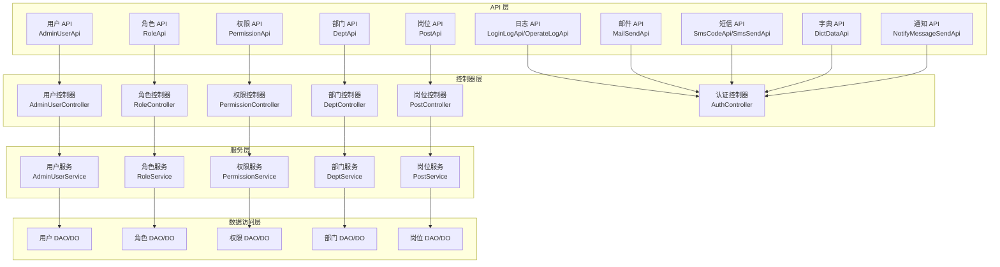
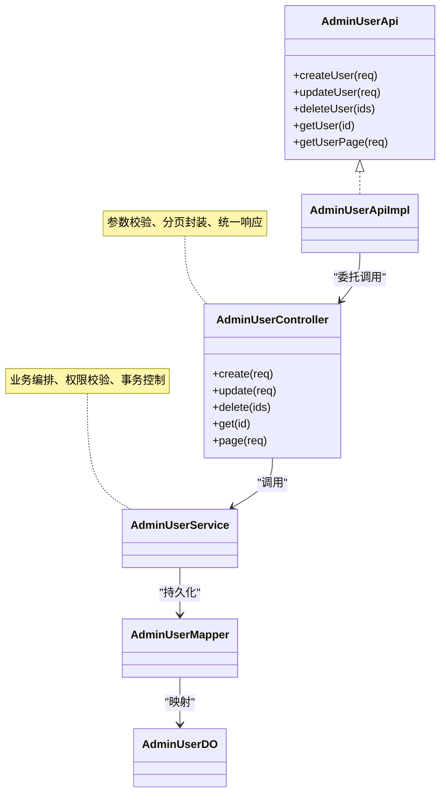
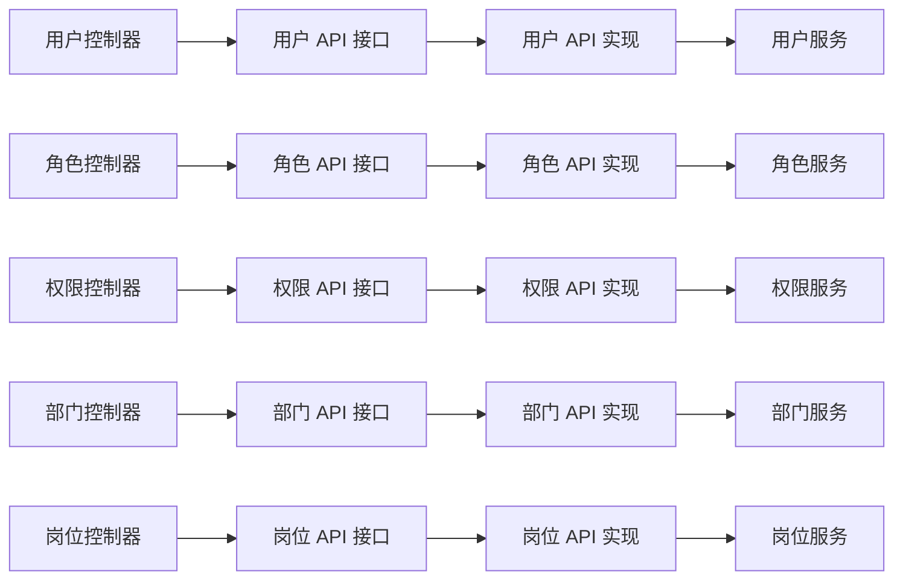

# 系统管理 API

<cite>
**本文引用的文件**
- [DeptApi.java](file://yudao-module-system/src/main/java/cn/iocoder/yudao/module/system/api/dept/DeptApi.java)
- [DeptApiImpl.java](file://yudao-module-system/src/main/java/cn/iocoder/yudao/module/system/api/dept/DeptApiImpl.java)
- [DeptRespDTO.java](file://yudao-module-system/src/main/java/cn/iocoder/yudao/module/system/api/dept/dto/DeptRespDTO.java)
- [PostApi.java](file://yudao-module-system/src/main/java/cn/iocoder/yudao/module/system/api/dept/PostApi.java)
- [PostApiImpl.java](file://yudao-module-system/src/main/java/cn/iocoder/yudao/module/system/api/dept/PostApiImpl.java)
- [PostRespDTO.java](file://yudao-module-system/src/main/java/cn/iocoder/yudao/module/system/api/dept/dto/PostRespDTO.java)
- [RoleApi.java](file://yudao-module-system/src/main/java/cn/iocoder/yudao/module/system/api/permission/RoleApi.java)
- [RoleApiImpl.java](file://yudao-module-system/src/main/java/cn/iocoder/yudao/module/system/api/permission/RoleApiImpl.java)
- [PermissionApi.java](file://yudao-module-system/src/main/java/cn/iocoder/yudao/module/system/api/permission/PermissionApi.java)
- [PermissionApiImpl.java](file://yudao-module-system/src/main/java/cn/iocoder/yudao/module/system/api/permission/PermissionApiImpl.java)
- [AdminUserApi.java](file://yudao-module-system/src/main/java/cn/iocoder/yudao/module/system/api/user/AdminUserApi.java)
- [AdminUserApiImpl.java](file://yudao-module-system/src/main/java/cn/iocoder/yudao/module/system/api/user/AdminUserApiImpl.java)
- [DeptController.java](file://yudao-module-system/src/main/java/cn/iocoder/yudao/module/system/controller/admin/dept/DeptController.java)
- [PostController.java](file://yudao-module-system/src/main/java/cn/iocoder/yudao/module/system/controller/admin/dept/PostController.java)
- [DeptListReqVO.java](file://yudao-module-system/src/main/java/cn/iocoder/yudao/module/system/controller/admin/dept/vo/dept/DeptListReqVO.java)
- [DeptRespVO.java](file://yudao-module-system/src/main/java/cn/iocoder/yudao/module/system/controller/admin/dept/vo/dept/DeptRespVO.java)
- [DeptSaveReqVO.java](file://yudao-module-system/src/main/java/cn/iocoder/yudao/module/system/controller/admin/dept/vo/dept/DeptSaveReqVO.java)
- [DeptSimpleRespVO.java](file://yudao-module-system/src/main/java/cn/iocoder/yudao/module/system/controller/admin/dept/vo/dept/DeptSimpleRespVO.java)
- [PostPageReqVO.java](file://yudao-module-system/src/main/java/cn/iocoder/yudao/module/system/controller/admin/dept/vo/post/PostPageReqVO.java)
- [PostRespVO.java](file://yudao-module-system/src/main/java/cn/iocoder/yudao/module/system/controller/admin/dept/vo/post/PostRespVO.java)
- [AuthController.java](file://yudao-module-system/src/main/java/cn/iocoder/yudao/module/system/controller/admin/auth/AuthController.java)
- [AuthLoginReqVO.java](file://yudao-module-system/src/main/java/cn/iocoder/yudao/module/system/controller/admin/auth/vo/AuthLoginReqVO.java)
- [AuthLoginRespVO.java](file://yudao-module-system/src/main/java/cn/iocoder/yudao/module/system/controller/admin/auth/vo/AuthLoginRespVO.java)
- [AuthMenuRespVO.java](file://yudao-module-system/src/main/java/cn/iocoder/yudao/module/system/controller/admin/auth/vo/AuthMenuRespVO.java)
- [AuthPermissionInfoRespVO.java](file://yudao-module-system/src/main/java/cn/iocoder/yudao/module/system/controller/admin/auth/vo/AuthPermissionInfoRespVO.java)
- [ErrorCodeConstants.java](file://yudao-module-system/src/main/java/cn/iocoder/yudao/module/system/enums/ErrorCodeConstants.java)
- [LoginLogApi.java](file://yudao-module-system/src/main/java/cn/iocoder/yudao/module/system/api/logger/LoginLogApi.java)
- [LoginLogApiImpl.java](file://yudao-module-system/src/main/java/cn/iocoder/yudao/module/system/api/logger/LoginLogApiImpl.java)
- [OperateLogApi.java](file://yudao-module-system/src/main/java/cn/iocoder/yudao/module/system/api/logger/OperateLogApi.java)
- [OperateLogApiImpl.java](file://yudao-module-system/src/main/java/cn/iocoder/yudao/module/system/api/logger/OperateLogApiImpl.java)
- [LoginLogCreateReqDTO.java](file://yudao-module-system/src/main/java/cn/iocoder/yudao/module/system/api/logger/dto/LoginLogCreateReqDTO.java)
- [OperateLogPageReqDTO.java](file://yudao-module-system/src/main/java/cn/iocoder/yudao/module/system/api/logger/dto/OperateLogPageReqDTO.java)
- [OperateLogRespDTO.java](file://yudao-module-system/src/main/java/cn/iocoder/yudao/module/system/api/logger/dto/OperateLogRespDTO.java)
- [MailSendApi.java](file://yudao-module-system/src/main/java/cn/iocoder/yudao/module/system/api/mail/MailSendApi.java)
- [MailSendApiImpl.java](file://yudao-module-system/src/main/java/cn/iocoder/yudao/module/system/api/mail/MailSendApiImpl.java)
- [MailSendSingleToUserReqDTO.java](file://yudao-module-system/src/main/java/cn/iocoder/yudao/module/system/api/mail/dto/MailSendSingleToUserReqDTO.java)
- [SmsCodeApi.java](file://yudao-module-system/src/main/java/cn/iocoder/yudao/module/system/api/sms/SmsCodeApi.java)
- [SmsCodeApiImpl.java](file://yudao-module-system/src/main/java/cn/iocoder/yudao/module/system/api/sms/SmsCodeApiImpl.java)
- [SmsSendApi.java](file://yudao-module-system/src/main/java/cn/iocoder/yudao/module/system/api/sms/SmsSendApi.java)
- [SmsSendApiImpl.java](file://yudao-module-system/src/main/java/cn/iocoder/yudao/module/system/api/sms/SmsSendApiImpl.java)
- [SmsCodeApi.java](file://yudao-module-system/src/main/java/cn/iocoder/yudao/module/system/api/sms/dto/SmsCodeApi.java)
- [SmsSendApi.java](file://yudao-module-system/src/main/java/cn/iocoder/yudao/module/system/api/sms/dto/SmsSendApi.java)
- [DictDataApi.java](file://yudao-module-system/src/main/java/cn/iocoder/yudao/module/system/api/dict/DictDataApi.java)
- [DictDataApiImpl.java](file://yudao-module-system/src/main/java/cn/iocoder/yudao/module/system/api/dict/DictDataApiImpl.java)
- [NotifyMessageSendApi.java](file://yudao-module-system/src/main/java/cn/iocoder/yudao/module/system/api/notify/NotifyMessageSendApi.java)
- [NotifyMessageSendApiImpl.java](file://yudao-module-system/src/main/java/cn/iocoder/yudao/module/system/api/notify/NotifyMessageSendApiImpl.java)
- [AdminUserProfileUpdateMessage.java](file://yudao-module-system/src/main/java/cn/iocoder/yudao/module/system/api/message/user/AdminUserProfileUpdateMessage.java)
</cite>

## 目录
1. [简介](#简介)
2. [项目结构](#项目结构)
3. [核心组件](#核心组件)
4. [架构总览](#架构总览)
5. [详细组件分析](#详细组件分析)
6. [依赖关系分析](#依赖关系分析)
7. [性能考虑](#性能考虑)
8. [故障排查指南](#故障排查指南)
9. [结论](#结论)
10. [附录](#附录)

## 简介
本文件面向系统管理模块的 API 封装，聚焦用户管理、角色权限、菜单管理与部门管理等核心能力，系统性阐述以下主题：
- 标准 CRUD 实现：分页查询、条件筛选、批量操作的接口设计与最佳实践
- TypeScript 类型定义建议：请求参数接口与响应数据结构的规范化
- 权限控制：RBAC 权限验证与接口访问控制在 API 层的落地
- 错误处理与状态码规范：统一错误码与响应格式
- API 版本管理策略：版本演进与兼容性保障
- 调试技巧与实战示例路径：帮助快速定位问题并验证接口行为

## 项目结构
系统管理模块采用“API 层 → 控制器层 → 服务层 → 数据访问层”的分层架构，围绕用户、角色、菜单、部门等实体构建标准 CRUD 能力，并通过 DTO/VO 进行数据传输建模。

图表来源
- [AdminUserApi.java](file://yudao-module-system/src/main/java/cn/iocoder/yudao/module/system/api/user/AdminUserApi.java)
- [RoleApi.java](file://yudao-module-system/src/main/java/cn/iocoder/yudao/module/system/api/permission/RoleApi.java)
- [PermissionApi.java](file://yudao-module-system/src/main/java/cn/iocoder/yudao/module/system/api/permission/PermissionApi.java)
- [DeptApi.java](file://yudao-module-system/src/main/java/cn/iocoder/yudao/module/system/api/dept/DeptApi.java)
- [PostApi.java](file://yudao-module-system/src/main/java/cn/iocoder/yudao/module/system/api/dept/PostApi.java)
- [LoginLogApi.java](file://yudao-module-system/src/main/java/cn/iocoder/yudao/module/system/api/logger/LoginLogApi.java)
- [OperateLogApi.java](file://yudao-module-system/src/main/java/cn/iocoder/yudao/module/system/api/logger/OperateLogApi.java)
- [MailSendApi.java](file://yudao-module-system/src/main/java/cn/iocoder/yudao/module/system/api/mail/MailSendApi.java)
- [SmsCodeApi.java](file://yudao-module-system/src/main/java/cn/iocoder/yudao/module/system/api/sms/SmsCodeApi.java)
- [SmsSendApi.java](file://yudao-module-system/src/main/java/cn/iocoder/yudao/module/system/api/sms/SmsSendApi.java)
- [DictDataApi.java](file://yudao-module-system/src/main/java/cn/iocoder/yudao/module/system/api/dict/DictDataApi.java)
- [NotifyMessageSendApi.java](file://yudao-module-system/src/main/java/cn/iocoder/yudao/module/system/api/notify/NotifyMessageSendApi.java)

章节来源
- [DeptApi.java](file://yudao-module-system/src/main/java/cn/iocoder/yudao/module/system/api/dept/DeptApi.java)
- [RoleApi.java](file://yudao-module-system/src/main/java/cn/iocoder/yudao/module/system/api/permission/RoleApi.java)
- [PermissionApi.java](file://yudao-module-system/src/main/java/cn/iocoder/yudao/module/system/api/permission/PermissionApi.java)
- [AdminUserApi.java](file://yudao-module-system/src/main/java/cn/iocoder/yudao/module/system/api/user/AdminUserApi.java)

## 核心组件
本节梳理系统管理模块的关键 API 组件及其职责边界，涵盖用户、角色、权限、菜单、部门、岗位、日志、邮件、短信、字典与通知等子域。

- 用户管理
  - API 接口：AdminUserApi
  - 实现类：AdminUserApiImpl
  - 控制器：对应 AdminUserController（位于 controller.admin.user 包）
  - 关键 DTO/VO：用户分页、详情、新增/修改、状态变更、导出等 VO
  - 典型能力：分页查询、条件筛选、批量操作、重置密码、导入导出

- 角色权限
  - 角色 API：RoleApi
  - 权限 API：PermissionApi
  - 实现类：RoleApiImpl、PermissionApiImpl
  - 控制器：对应 RoleController、PermissionController
  - 关键 DTO/VO：角色分页、详情、授权菜单/数据范围等

- 菜单管理
  - 认证控制器：AuthController 提供菜单与权限信息查询
  - 响应模型：AuthMenuRespVO、AuthPermissionInfoRespVO
  - 用于前端渲染动态菜单与按钮级权限

- 部门管理
  - API 接口：DeptApi
  - 实现类：DeptApiImpl
  - 控制器：DeptController
  - 关键 DTO/VO：DeptListReqVO、DeptRespVO、DeptSaveReqVO、DeptSimpleRespVO

- 岗位管理
  - API 接口：PostApi
  - 实现类：PostApiImpl
  - 控制器：PostController
  - 关键 DTO/VO：PostPageReqVO、PostRespVO

- 日志管理
  - 登录日志 API：LoginLogApi
  - 操作日志 API：OperateLogApi
  - 实现类：LoginLogApiImpl、OperateLogApiImpl
  - 关键 DTO/VO：LoginLogCreateReqDTO、OperateLogPageReqDTO、OperateLogRespDTO

- 邮件与短信
  - 邮件发送 API：MailSendApi
  - 短信验证码 API：SmsCodeApi
  - 短信发送 API：SmsSendApi
  - 实现类：对应 Impl
  - 关键 DTO/VO：MailSendSingleToUserReqDTO 等

- 字典与通知
  - 字典数据 API：DictDataApi
  - 通知消息发送 API：NotifyMessageSendApi
  - 实现类：对应 Impl

章节来源
- [AdminUserApi.java](file://yudao-module-system/src/main/java/cn/iocoder/yudao/module/system/api/user/AdminUserApi.java)
- [AdminUserApiImpl.java](file://yudao-module-system/src/main/java/cn/iocoder/yudao/module/system/api/user/AdminUserApiImpl.java)
- [RoleApi.java](file://yudao-module-system/src/main/java/cn/iocoder/yudao/module/system/api/permission/RoleApi.java)
- [RoleApiImpl.java](file://yudao-module-system/src/main/java/cn/iocoder/yudao/module/system/api/permission/RoleApiImpl.java)
- [PermissionApi.java](file://yudao-module-system/src/main/java/cn/iocoder/yudao/module/system/api/permission/PermissionApi.java)
- [PermissionApiImpl.java](file://yudao-module-system/src/main/java/cn/iocoder/yudao/module/system/api/permission/PermissionApiImpl.java)
- [DeptApi.java](file://yudao-module-system/src/main/java/cn/iocoder/yudao/module/system/api/dept/DeptApi.java)
- [DeptApiImpl.java](file://yudao-module-system/src/main/java/cn/iocoder/yudao/module/system/api/dept/DeptApiImpl.java)
- [PostApi.java](file://yudao-module-system/src/main/java/cn/iocoder/yudao/module/system/api/dept/PostApi.java)
- [PostApiImpl.java](file://yudao-module-system/src/main/java/cn/iocoder/yudao/module/system/api/dept/PostApiImpl.java)
- [LoginLogApi.java](file://yudao-module-system/src/main/java/cn/iocoder/yudao/module/system/api/logger/LoginLogApi.java)
- [LoginLogApiImpl.java](file://yudao-module-system/src/main/java/cn/iocoder/yudao/module/system/api/logger/LoginLogApiImpl.java)
- [OperateLogApi.java](file://yudao-module-system/src/main/java/cn/iocoder/yudao/module/system/api/logger/OperateLogApi.java)
- [OperateLogApiImpl.java](file://yudao-module-system/src/main/java/cn/iocoder/yudao/module/system/api/logger/OperateLogApiImpl.java)
- [MailSendApi.java](file://yudao-module-system/src/main/java/cn/iocoder/yudao/module/system/api/mail/MailSendApi.java)
- [MailSendApiImpl.java](file://yudao-module-system/src/main/java/cn/iocoder/yudao/module/system/api/mail/MailSendApiImpl.java)
- [SmsCodeApi.java](file://yudao-module-system/src/main/java/cn/iocoder/yudao/module/system/api/sms/SmsCodeApi.java)
- [SmsCodeApiImpl.java](file://yudao-module-system/src/main/java/cn/iocoder/yudao/module/system/api/sms/SmsCodeApiImpl.java)
- [SmsSendApi.java](file://yudao-module-system/src/main/java/cn/iocoder/yudao/module/system/api/sms/SmsSendApi.java)
- [SmsSendApiImpl.java](file://yudao-module-system/src/main/java/cn/iocoder/yudao/module/system/api/sms/SmsSendApiImpl.java)
- [DictDataApi.java](file://yudao-module-system/src/main/java/cn/iocoder/yudao/module/system/api/dict/DictDataApi.java)
- [DictDataApiImpl.java](file://yudao-module-system/src/main/java/cn/iocoder/yudao/module/system/api/dict/DictDataApiImpl.java)
- [NotifyMessageSendApi.java](file://yudao-module-system/src/main/java/cn/iocoder/yudao/module/system/api/notify/NotifyMessageSendApi.java)
- [NotifyMessageSendApiImpl.java](file://yudao-module-system/src/main/java/cn/iocoder/yudao/module/system/api/notify/NotifyMessageSendApiImpl.java)

## 架构总览
系统管理模块遵循“接口 + 实现 + 控制器 + 服务 + DAO/DO”的分层设计，API 层负责对外暴露能力，控制器负责参数解析与返回值封装，服务层编排业务逻辑，DAO/DO 负责持久化。

图表来源
- [AdminUserApi.java](file://yudao-module-system/src/main/java/cn/iocoder/yudao/module/system/api/user/AdminUserApi.java)
- [AdminUserApiImpl.java](file://yudao-module-system/src/main/java/cn/iocoder/yudao/module/system/api/user/AdminUserApiImpl.java)
- [DeptApi.java](file://yudao-module-system/src/main/java/cn/iocoder/yudao/module/system/api/dept/DeptApi.java)
- [DeptApiImpl.java](file://yudao-module-system/src/main/java/cn/iocoder/yudao/module/system/api/dept/DeptApiImpl.java)

## 详细组件分析

### 用户管理 API
- 设计要点
  - 分页查询：支持关键字、状态、时间区间等多维条件筛选
  - 批量操作：支持批量删除、批量状态变更
  - 导入导出：提供模板下载与导入校验、导出列表
  - 安全控制：重置密码、锁定解锁需管理员权限
- 请求参数接口（建议的 TypeScript 定义）
  - 用户分页请求：包含分页参数、状态、关键词、时间范围等字段
  - 用户保存请求：包含基本信息、部门、岗位、角色等关联字段
  - 用户状态变更请求：包含用户 ID 列表与目标状态
- 响应数据结构（建议的 TypeScript 定义）
  - 分页响应：包含列表、总数、当前页、每页大小
  - 用户详情响应：包含基础信息、角色列表、岗位列表、部门名称等

章节来源
- [AdminUserApi.java](file://yudao-module-system/src/main/java/cn/iocoder/yudao/module/system/api/user/AdminUserApi.java)
- [AdminUserApiImpl.java](file://yudao-module-system/src/main/java/cn/iocoder/yudao/module/system/api/user/AdminUserApiImpl.java)

### 角色权限 API
- 设计要点
  - 角色管理：支持角色增删改查、角色与菜单/数据权限的授权
  - 权限校验：接口级 RBAC 校验，确保资源访问受控
  - 数据范围：支持按部门或自定义规则限制数据可见范围
- 请求参数接口（建议的 TypeScript 定义）
  - 角色分页请求：包含角色编码、角色名称、状态等筛选条件
  - 授权请求：包含角色 ID、菜单 ID 列表、数据范围类型与值
- 响应数据结构（建议的 TypeScript 定义）
  - 角色分页响应：包含角色列表与总数
  - 菜单树形结构：包含菜单 ID、名称、类型、路径、按钮标识等

章节来源
- [RoleApi.java](file://yudao-module-system/src/main/java/cn/iocoder/yudao/module/system/api/permission/RoleApi.java)
- [RoleApiImpl.java](file://yudao-module-system/src/main/java/cn/iocoder/yudao/module/system/api/permission/RoleApiImpl.java)
- [PermissionApi.java](file://yudao-module-system/src/main/java/cn/iocoder/yudao/module/system/api/permission/PermissionApi.java)
- [PermissionApiImpl.java](file://yudao-module-system/src/main/java/cn/iocoder/yudao/module/system/api/permission/PermissionApiImpl.java)

### 菜单管理 API
- 设计要点
  - 动态菜单：根据用户权限返回可访问菜单树
  - 按钮级权限：通过权限字符串控制按钮显示与禁用
  - 菜单树构建：支持层级菜单、路由配置、图标与排序
- 响应数据结构（建议的 TypeScript 定义）
  - 菜单树响应：包含节点 ID、标题、路径、组件、权限标识、子节点等
  - 权限信息响应：包含用户拥有的所有权限字符串集合

章节来源
- [AuthController.java](file://yudao-module-system/src/main/java/cn/iocoder/yudao/module/system/controller/admin/auth/AuthController.java)
- [AuthMenuRespVO.java](file://yudao-module-system/src/main/java/cn/iocoder/yudao/module/system/controller/admin/auth/vo/AuthMenuRespVO.java)
- [AuthPermissionInfoRespVO.java](file://yudao-module-system/src/main/java/cn/iocoder/yudao/module/system/controller/admin/auth/vo/AuthPermissionInfoRespVO.java)

### 部门管理 API
- 设计要点
  - 树形结构：支持部门层级展示与父子关系维护
  - 查询优化：提供简单列表与完整详情两种视图
  - 批量操作：支持批量删除（含子部门）、批量移动
- 请求参数接口（建议的 TypeScript 定义）
  - 部门列表请求：包含状态、关键词等筛选条件
  - 部门保存请求：包含上级部门 ID、部门名称、排序、状态等
- 响应数据结构（建议的 TypeScript 定义）
  - 部门树形列表：包含部门 ID、名称、子部门等
  - 简明部门列表：仅包含必要字段用于选择器

章节来源
- [DeptApi.java](file://yudao-module-system/src/main/java/cn/iocoder/yudao/module/system/api/dept/DeptApi.java)
- [DeptApiImpl.java](file://yudao-module-system/src/main/java/cn/iocoder/yudao/module/system/api/dept/DeptApiImpl.java)
- [DeptListReqVO.java](file://yudao-module-system/src/main/java/cn/iocoder/yudao/module/system/controller/admin/dept/vo/dept/DeptListReqVO.java)
- [DeptRespVO.java](file://yudao-module-system/src/main/java/cn/iocoder/yudao/module/system/controller/admin/dept/vo/dept/DeptRespVO.java)
- [DeptSaveReqVO.java](file://yudao-module-system/src/main/java/cn/iocoder/yudao/module/system/controller/admin/dept/vo/dept/DeptSaveReqVO.java)
- [DeptSimpleRespVO.java](file://yudao-module-system/src/main/java/cn/iocoder/yudao/module/system/controller/admin/dept/vo/dept/DeptSimpleRespVO.java)

### 岗位管理 API
- 设计要点
  - 岗位分页：支持岗位名称、编码、状态等条件筛选
  - 关联约束：用户与岗位存在多对多关系，需注意删除保护
- 请求参数接口（建议的 TypeScript 定义）
  - 岗位分页请求：包含分页参数与筛选条件
- 响应数据结构（建议的 TypeScript 定义）
  - 岗位分页响应：包含岗位列表与总数

章节来源
- [PostApi.java](file://yudao-module-system/src/main/java/cn/iocoder/yudao/module/system/api/dept/PostApi.java)
- [PostApiImpl.java](file://yudao-module-system/src/main/java/cn/iocoder/yudao/module/system/api/dept/PostApiImpl.java)
- [PostPageReqVO.java](file://yudao-module-system/src/main/java/cn/iocoder/yudao/module/system/controller/admin/dept/vo/post/PostPageReqVO.java)
- [PostRespVO.java](file://yudao-module-system/src/main/java/cn/iocoder/yudao/module/system/controller/admin/dept/vo/post/PostRespVO.java)

### 日志管理 API
- 登录日志
  - 支持分页查询登录记录，包含用户、IP、地点、状态等
- 操作日志
  - 记录用户关键操作轨迹，支持分页与筛选
- 请求参数接口（建议的 TypeScript 定义）
  - 登录日志创建请求：包含用户账号、IP、用户代理、结果等
  - 操作日志分页请求：包含模块、操作人、开始/结束时间等
- 响应数据结构（建议的 TypeScript 定义）
  - 操作日志分页响应：包含日志条目列表与总数

章节来源
- [LoginLogApi.java](file://yudao-module-system/src/main/java/cn/iocoder/yudao/module/system/api/logger/LoginLogApi.java)
- [LoginLogApiImpl.java](file://yudao-module-system/src/main/java/cn/iocoder/yudao/module/system/api/logger/LoginLogApiImpl.java)
- [OperateLogApi.java](file://yudao-module-system/src/main/java/cn/iocoder/yudao/module/system/api/logger/OperateLogApi.java)
- [OperateLogApiImpl.java](file://yudao-module-system/src/main/java/cn/iocoder/yudao/module/system/api/logger/OperateLogApiImpl.java)
- [LoginLogCreateReqDTO.java](file://yudao-module-system/src/main/java/cn/iocoder/yudao/module/system/api/logger/dto/LoginLogCreateReqDTO.java)
- [OperateLogPageReqDTO.java](file://yudao-module-system/src/main/java/cn/iocoder/yudao/module/system/api/logger/dto/OperateLogPageReqDTO.java)
- [OperateLogRespDTO.java](file://yudao-module-system/src/main/java/cn/iocoder/yudao/module/system/api/logger/dto/OperateLogRespDTO.java)

### 邮件与短信 API
- 邮件发送
  - 支持单用户发送与批量发送，包含模板变量替换
- 短信验证码
  - 发送与校验流程，支持图形验证码与手机验证码
- 请求参数接口（建议的 TypeScript 定义）
  - 邮件发送请求：包含收件人、主题、内容、附件等
  - 短信发送请求：包含手机号、模板编号、参数数组等
- 响应数据结构（建议的 TypeScript 定义）
  - 发送结果：包含是否成功、消息 ID、失败原因等

章节来源
- [MailSendApi.java](file://yudao-module-system/src/main/java/cn/iocoder/yudao/module/system/api/mail/MailSendApi.java)
- [MailSendApiImpl.java](file://yudao-module-system/src/main/java/cn/iocoder/yudao/module/system/api/mail/MailSendApiImpl.java)
- [MailSendSingleToUserReqDTO.java](file://yudao-module-system/src/main/java/cn/iocoder/yudao/module/system/api/mail/dto/MailSendSingleToUserReqDTO.java)
- [SmsCodeApi.java](file://yudao-module-system/src/main/java/cn/iocoder/yudao/module/system/api/sms/SmsCodeApi.java)
- [SmsCodeApiImpl.java](file://yudao-module-system/src/main/java/cn/iocoder/yudao/module/system/api/sms/SmsCodeApiImpl.java)
- [SmsSendApi.java](file://yudao-module-system/src/main/java/cn/iocoder/yudao/module/system/api/sms/SmsSendApi.java)
- [SmsSendApiImpl.java](file://yudao-module-system/src/main/java/cn/iocoder/yudao/module/system/api/sms/SmsSendApiImpl.java)

### 字典与通知 API
- 字典数据
  - 支持字典类型下的数据项查询与缓存
- 通知消息
  - 支持站内信、公告等消息的发送与查询

章节来源
- [DictDataApi.java](file://yudao-module-system/src/main/java/cn/iocoder/yudao/module/system/api/dict/DictDataApi.java)
- [DictDataApiImpl.java](file://yudao-module-system/src/main/java/cn/iocoder/yudao/module/system/api/dict/DictDataApiImpl.java)
- [NotifyMessageSendApi.java](file://yudao-module-system/src/main/java/cn/iocoder/yudao/module/system/api/notify/NotifyMessageSendApi.java)
- [NotifyMessageSendApiImpl.java](file://yudao-module-system/src/main/java/cn/iocoder/yudao/module/system/api/notify/NotifyMessageSendApiImpl.java)

## 依赖关系分析
系统管理模块各子域之间存在清晰的依赖关系与耦合度控制：
- 控制器依赖 API 接口，避免直接依赖实现类
- 服务层聚合多个 DAO，承担业务编排与权限校验
- DTO/VO 作为跨层数据载体，保持接口稳定与前后端解耦

图表来源
- [AdminUserApi.java](file://yudao-module-system/src/main/java/cn/iocoder/yudao/module/system/api/user/AdminUserApi.java)
- [RoleApi.java](file://yudao-module-system/src/main/java/cn/iocoder/yudao/module/system/api/permission/RoleApi.java)
- [PermissionApi.java](file://yudao-module-system/src/main/java/cn/iocoder/yudao/module/system/api/permission/PermissionApi.java)
- [DeptApi.java](file://yudao-module-system/src/main/java/cn/iocoder/yudao/module/system/api/dept/DeptApi.java)
- [PostApi.java](file://yudao-module-system/src/main/java/cn/iocoder/yudao/module/system/api/dept/PostApi.java)

## 性能考虑
- 分页查询
  - 使用数据库索引覆盖常见筛选字段（如状态、创建时间），避免全表扫描
  - 合理设置分页大小上限，防止超大页导致内存压力
- 缓存策略
  - 菜单树、字典项、权限字符串等高频只读数据使用本地缓存
- 并发控制
  - 批量操作采用批处理与异步执行，避免阻塞主线程
- 日志与审计
  - 操作日志异步入库，减少主业务路径开销

## 故障排查指南
- 统一错误码
  - 使用模块内统一的错误码常量，便于前端一致化提示
- 响应格式
  - 成功响应包含数据体；失败响应包含错误码与错误信息
- 常见问题定位
  - 权限不足：检查用户角色与权限字符串是否匹配
  - 参数校验失败：核对请求 DTO 字段类型与必填项
  - 数据不存在：确认主键是否存在或已被软删除
- 调试技巧
  - 开启 SQL 日志与链路追踪，定位慢查询与异常调用栈
  - 使用接口文档工具对比请求/响应结构，快速发现不一致

章节来源
- [ErrorCodeConstants.java](file://yudao-module-system/src/main/java/cn/iocoder/yudao/module/system/enums/ErrorCodeConstants.java)

## 结论
系统管理模块以清晰的分层架构与标准化的 API 设计，提供了完善的用户、角色、权限、菜单、部门、岗位与运维相关能力。通过统一的 DTO/VO、RBAC 权限控制与错误码规范，既保证了接口稳定性，也为前端交互提供了可靠支撑。建议在后续版本中持续完善 API 文档、引入版本管理策略与自动化测试，进一步提升可维护性与扩展性。

## 附录
- TypeScript 类型定义最佳实践
  - 请求参数接口：字段命名与后端 DTO 保持一致，使用联合类型表达可选/必填
  - 响应数据结构：分页接口统一包装 total、records 字段，避免散落字段
  - 枚举与字典：使用字典项枚举替代魔法值，增强可读性
- API 版本管理策略
  - 路径版本：/api/v1/xxx
  - 头部版本：X-API-Version
  - 渐进式弃用：保留过渡期并输出弃用警告
- 调试技巧清单
  - 使用抓包工具观察请求头与响应体
  - 在网关层开启限流与熔断，隔离异常流量
  - 对关键接口增加幂等性与去重机制