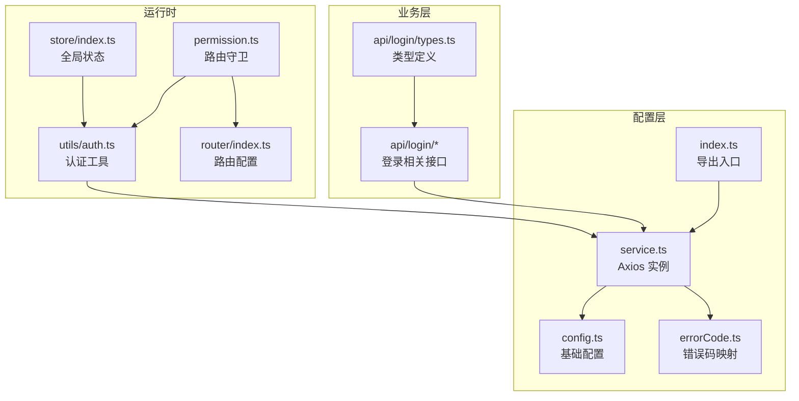
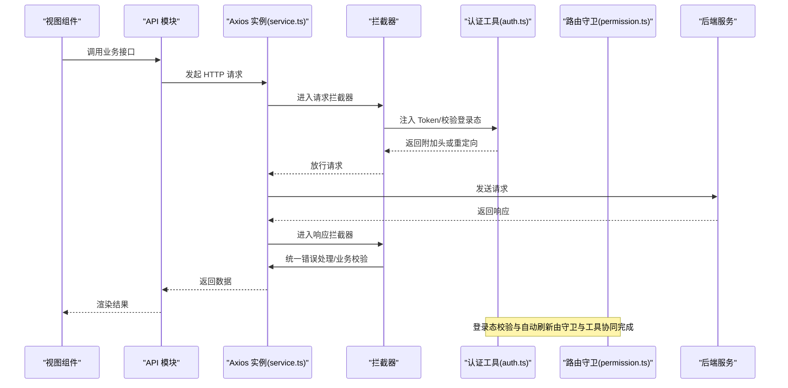
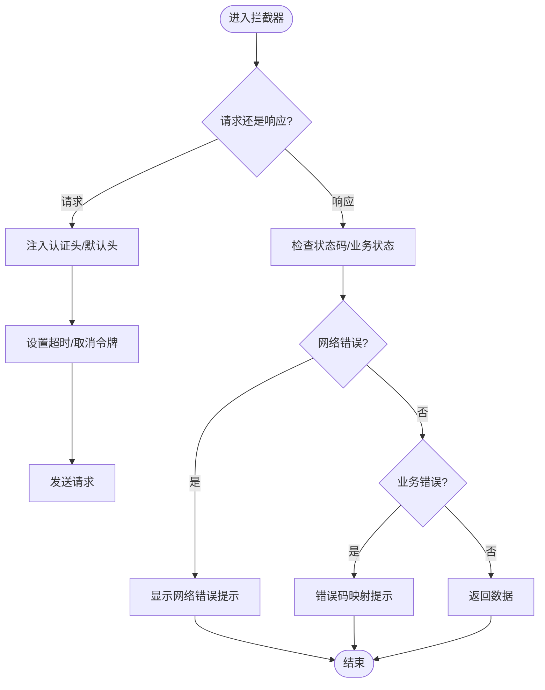
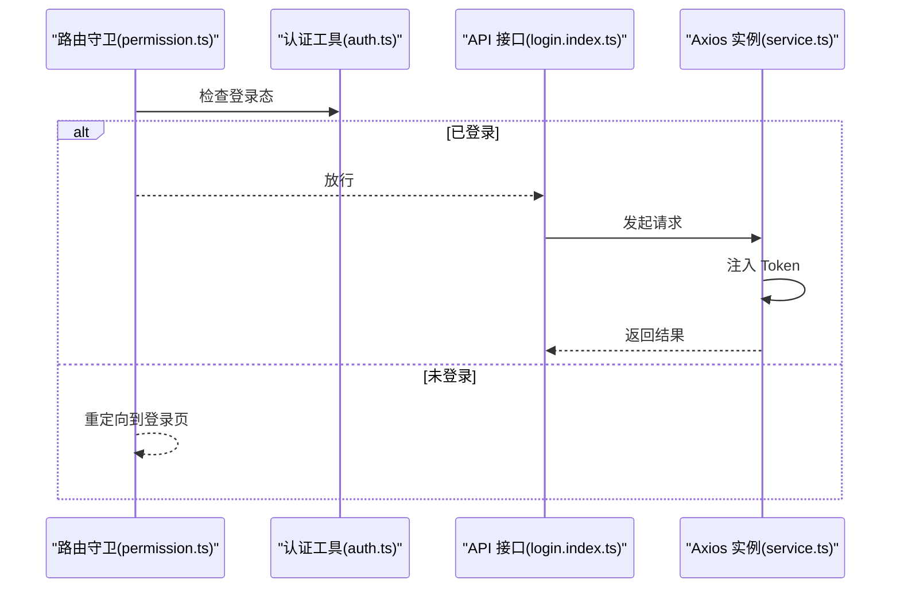
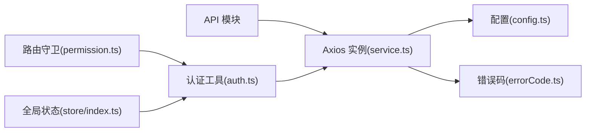

# API 集成

<cite>
**本文引用的文件**   
- [index.ts](file://yudao-ui/yudao-ui-admin-vue3/src/config/axios/index.ts)
- [service.ts](file://yudao-ui/yudao-ui-admin-vue3/src/config/axios/service.ts)
- [config.ts](file://yudao-ui/yudao-ui-admin-vue3/src/config/axios/config.ts)
- [errorCode.ts](file://yudao-ui/yudao-ui-admin-vue3/src/config/axios/errorCode.ts)
- [auth.ts](file://yudao-ui/yudao-ui-admin-vue3/src/utils/auth.ts)
- [permission.ts](file://yudao-ui/yudao-ui-admin-vue3/src/permission.ts)
- [login.index.ts](file://yudao-ui/yudao-ui-admin-vue3/src/api/login/index.ts)
- [login.types.ts](file://yudao-ui/yudao-ui-admin-vue3/src/api/login/types.ts)
- [router.index.ts](file://yudao-ui/yudao-ui-admin-vue3/src/router/index.ts)
- [store.index.ts](file://yudao-ui/yudao-ui-admin-vue3/src/store/index.ts)
- [AxiosResponse](file://yudao-ui/yudao-ui-admin-vue3/src/types/auto-imports.d.ts)
</cite>

## 目录
1. [简介](#简介)
2. [项目结构](#项目结构)
3. [核心组件](#核心组件)
4. [架构总览](#架构总览)
5. [详细组件分析](#详细组件分析)
6. [依赖关系分析](#依赖关系分析)
7. [性能考虑](#性能考虑)
8. [故障排查指南](#故障排查指南)
9. [结论](#结论)
10. [附录](#附录)

## 简介
本文件面向“芋道 ruoyi-vue-pro”前端工程，系统性梳理基于 Axios 的 API 集成方案，覆盖以下主题：
- Axios 配置与使用：请求/响应拦截器、错误处理机制
- API 封装策略：模块化组织、参数与响应处理
- 认证机制：Token 管理、登录状态检查、自动刷新
- 请求控制：取消与并发、去重策略
- 错误处理与异常捕获：网络、业务与用户提示
- 调试与测试：Mock 与联调技巧
- 性能优化：缓存、批量请求、超时控制

## 项目结构
前端 API 相关代码集中在 src/config/axios 与 src/api 下，并通过路由守卫与全局状态进行统一接入。

图表来源
- [config.ts:1-200](file://yudao-ui/yudao-ui-admin-vue3/src/config/axios/config.ts#L1-L200)
- [errorCode.ts:1-200](file://yudao-ui/yudao-ui-admin-vue3/src/config/axios/errorCode.ts#L1-L200)
- [index.ts:1-200](file://yudao-ui/yudao-ui-admin-vue3/src/config/axios/index.ts#L1-L200)
- [service.ts:1-200](file://yudao-ui/yudao-ui-admin-vue3/src/config/axios/service.ts#L1-L200)
- [auth.ts:1-200](file://yudao-ui/yudao-ui-admin-vue3/src/utils/auth.ts#L1-L200)
- [permission.ts:1-200](file://yudao-ui/yudao-ui-admin-vue3/src/permission.ts#L1-L200)
- [store.index.ts:1-200](file://yudao-ui/yudao-ui-admin-vue3/src/store/index.ts#L1-L200)
- [router.index.ts:1-200](file://yudao-ui/yudao-ui-admin-vue3/src/router/index.ts#L1-L200)
- [login.index.ts:1-200](file://yudao-ui/yudao-ui-admin-vue3/src/api/login/index.ts#L1-L200)
- [login.types.ts:1-200](file://yudao-ui/yudao-ui-admin-vue3/src/api/login/types.ts#L1-L200)

章节来源
- [index.ts:1-200](file://yudao-ui/yudao-ui-admin-vue3/src/config/axios/index.ts#L1-L200)
- [service.ts:1-200](file://yudao-ui/yudao-ui-admin-vue3/src/config/axios/service.ts#L1-L200)
- [config.ts:1-200](file://yudao-ui/yudao-ui-admin-vue3/src/config/axios/config.ts#L1-L200)
- [errorCode.ts:1-200](file://yudao-ui/yudao-ui-admin-vue3/src/config/axios/errorCode.ts#L1-L200)
- [auth.ts:1-200](file://yudao-ui/yudao-ui-admin-vue3/src/utils/auth.ts#L1-L200)
- [permission.ts:1-200](file://yudao-ui/yudao-ui-admin-vue3/src/permission.ts#L1-L200)
- [login.index.ts:1-200](file://yudao-ui/yudao-ui-admin-vue3/src/api/login/index.ts#L1-L200)
- [login.types.ts:1-200](file://yudao-ui/yudao-ui-admin-vue3/src/api/login/types.ts#L1-L200)
- [router.index.ts:1-200](file://yudao-ui/yudao-ui-admin-vue3/src/router/index.ts#L1-L200)
- [store.index.ts:1-200](file://yudao-ui/yudao-ui-admin-vue3/src/store/index.ts#L1-L200)

## 核心组件
- Axios 实例与拦截器
  - 在服务层创建并导出 Axios 实例，集中配置请求/响应拦截器与错误处理。
  - 参考：[service.ts:1-200](file://yudao-ui/yudao-ui-admin-vue3/src/config/axios/service.ts#L1-L200)
- 配置与默认值
  - 基础 URL、超时、Content-Type、是否携带凭证等在配置文件中统一管理。
  - 参考：[config.ts:1-200](file://yudao-ui/yudao-ui-admin-vue3/src/config/axios/config.ts#L1-L200)
- 错误码映射
  - 将后端错误码映射到前端可读提示，便于统一处理。
  - 参考：[errorCode.ts:1-200](file://yudao-ui/yudao-ui-admin-vue3/src/config/axios/errorCode.ts#L1-L200)
- 导出入口
  - 统一导出实例与工具函数，供业务模块按需引入。
  - 参考：[index.ts:1-200](file://yudao-ui/yudao-ui-admin-vue3/src/config/axios/index.ts#L1-L200)
- 登录与认证
  - 认证工具负责 Token 存取与过期判断；路由守卫结合权限模块进行登录态校验。
  - 参考：[auth.ts:1-200](file://yudao-ui/yudao-ui-admin-vue3/src/utils/auth.ts#L1-L200)、[permission.ts:1-200](file://yudao-ui/yudao-ui-admin-vue3/src/permission.ts#L1-L200)
- API 模块化
  - 以业务域划分 API 文件夹，每个接口模块独立维护，便于扩展与维护。
  - 示例：[login.index.ts:1-200](file://yudao-ui/yudao-ui-admin-vue3/src/api/login/index.ts#L1-L200)

章节来源
- [service.ts:1-200](file://yudao-ui/yudao-ui-admin-vue3/src/config/axios/service.ts#L1-L200)
- [config.ts:1-200](file://yudao-ui/yudao-ui-admin-vue3/src/config/axios/config.ts#L1-L200)
- [errorCode.ts:1-200](file://yudao-ui/yudao-ui-admin-vue3/src/config/axios/errorCode.ts#L1-L200)
- [index.ts:1-200](file://yudao-ui/yudao-ui-admin-vue3/src/config/axios/index.ts#L1-L200)
- [auth.ts:1-200](file://yudao-ui/yudao-ui-admin-vue3/src/utils/auth.ts#L1-L200)
- [permission.ts:1-200](file://yudao-ui/yudao-ui-admin-vue3/src/permission.ts#L1-L200)
- [login.index.ts:1-200](file://yudao-ui/yudao-ui-admin-vue3/src/api/login/index.ts#L1-L200)

## 架构总览
下图展示从页面调用到后端请求的整体流程，以及认证与错误处理的关键节点。

图表来源
- [service.ts:1-200](file://yudao-ui/yudao-ui-admin-vue3/src/config/axios/service.ts#L1-L200)
- [auth.ts:1-200](file://yudao-ui/yudao-ui-admin-vue3/src/utils/auth.ts#L1-L200)
- [permission.ts:1-200](file://yudao-ui/yudao-ui-admin-vue3/src/permission.ts#L1-L200)
- [login.index.ts:1-200](file://yudao-ui/yudao-ui-admin-vue3/src/api/login/index.ts#L1-L200)

## 详细组件分析

### Axios 配置与拦截器
- 请求拦截器职责
  - 注入认证信息（如 Authorization）
  - 设置默认请求头（Content-Type、Accept 等）
  - 并发控制与请求去重（可选）
  - 超时控制与取消令牌（AbortController）
- 响应拦截器职责
  - 统一业务错误处理（根据错误码映射提示）
  - Token 刷新与重试（必要时）
  - 成功数据透传
- 错误处理机制
  - 区分网络错误、HTTP 状态错误、业务错误
  - 用户友好提示与日志记录

图表来源
- [service.ts:1-200](file://yudao-ui/yudao-ui-admin-vue3/src/config/axios/service.ts#L1-L200)
- [errorCode.ts:1-200](file://yudao-ui/yudao-ui-admin-vue3/src/config/axios/errorCode.ts#L1-L200)

章节来源
- [service.ts:1-200](file://yudao-ui/yudao-ui-admin-vue3/src/config/axios/service.ts#L1-L200)
- [config.ts:1-200](file://yudao-ui/yudao-ui-admin-vue3/src/config/axios/config.ts#L1-L200)
- [errorCode.ts:1-200](file://yudao-ui/yudao-ui-admin-vue3/src/config/axios/errorCode.ts#L1-L200)

### API 封装策略
- 模块化组织
  - 以业务域划分 API 文件夹，如 login、system、infra 等，每个模块内按功能拆分文件。
  - 示例：[login.index.ts:1-200](file://yudao-ui/yudao-ui-admin-vue3/src/api/login/index.ts#L1-L200)
- 类型定义
  - 使用 TypeScript 定义请求参数与响应结构，提升可维护性与 IDE 支持。
  - 示例：[login.types.ts:1-200](file://yudao-ui/yudao-ui-admin-vue3/src/api/login/types.ts#L1-L200)
- 参数与响应处理
  - 统一序列化/反序列化策略
  - 响应数据二次加工（如分页、树形结构、字典标签）

章节来源
- [login.index.ts:1-200](file://yudao-ui/yudao-ui-admin-vue3/src/api/login/index.ts#L1-L200)
- [login.types.ts:1-200](file://yudao-ui/yudao-ui-admin-vue3/src/api/login/types.ts#L1-L200)

### 认证机制
- Token 管理
  - 读取/存储 Token，判断是否过期
  - 提供刷新 Token 的能力（必要时）
- 登录状态检查
  - 路由守卫在跳转前检查登录态，未登录则重定向至登录页
- 自动刷新
  - 在请求拦截器中检测 Token 过期，触发刷新流程并重试原请求

图表来源
- [permission.ts:1-200](file://yudao-ui/yudao-ui-admin-vue3/src/permission.ts#L1-L200)
- [auth.ts:1-200](file://yudao-ui/yudao-ui-admin-vue3/src/utils/auth.ts#L1-L200)
- [login.index.ts:1-200](file://yudao-ui/yudao-ui-admin-vue3/src/api/login/index.ts#L1-L200)
- [service.ts:1-200](file://yudao-ui/yudao-ui-admin-vue3/src/config/axios/service.ts#L1-L200)

章节来源
- [auth.ts:1-200](file://yudao-ui/yudao-ui-admin-vue3/src/utils/auth.ts#L1-L200)
- [permission.ts:1-200](file://yudao-ui/yudao-ui-admin-vue3/src/permission.ts#L1-L200)
- [login.index.ts:1-200](file://yudao-ui/yudao-ui-admin-vue3/src/api/login/index.ts#L1-L200)

### 请求取消与并发控制
- 取消令牌（AbortController）
  - 为每个请求生成取消令牌，在组件卸载或重复请求时主动取消
- 并发控制
  - 限制同时请求数量，避免风暴效应
- 请求去重
  - 基于请求标识（URL+参数）去重，相同请求未完成时不重复发起

章节来源
- [service.ts:1-200](file://yudao-ui/yudao-ui-admin-vue3/src/config/axios/service.ts#L1-L200)

### 错误处理与异常捕获
- 网络错误
  - 超时、断网、DNS 解析失败等，统一提示“网络不可用”
- 业务错误
  - 根据错误码映射到用户可理解的提示
- 异常捕获
  - 在响应拦截器中捕获并上报，结合日志工具定位问题

章节来源
- [errorCode.ts:1-200](file://yudao-ui/yudao-ui-admin-vue3/src/config/axios/errorCode.ts#L1-L200)
- [service.ts:1-200](file://yudao-ui/yudao-ui-admin-vue3/src/config/axios/service.ts#L1-L200)

### API 调试与测试
- 调试
  - 使用浏览器 Network 面板观察请求/响应
  - 在开发环境开启详细日志
- 测试
  - 单元测试：对 API 方法与工具函数进行断言
  - 集成测试：模拟后端接口，验证拦截器与错误处理链路
- Mock
  - 在本地或测试环境使用 Mock 数据，减少对真实后端的依赖

章节来源
- [service.ts:1-200](file://yudao-ui/yudao-ui-admin-vue3/src/config/axios/service.ts#L1-L200)

## 依赖关系分析
- 组件耦合
  - API 模块仅依赖 Axios 实例，降低与具体拦截器实现的耦合
  - 认证工具与路由守卫相互配合，确保全局登录态一致
- 外部依赖
  - Axios、Vue Router、Pinia（状态管理）等

图表来源
- [service.ts:1-200](file://yudao-ui/yudao-ui-admin-vue3/src/config/axios/service.ts#L1-L200)
- [config.ts:1-200](file://yudao-ui/yudao-ui-admin-vue3/src/config/axios/config.ts#L1-L200)
- [errorCode.ts:1-200](file://yudao-ui/yudao-ui-admin-vue3/src/config/axios/errorCode.ts#L1-L200)
- [auth.ts:1-200](file://yudao-ui/yudao-ui-admin-vue3/src/utils/auth.ts#L1-L200)
- [permission.ts:1-200](file://yudao-ui/yudao-ui-admin-vue3/src/permission.ts#L1-L200)
- [store.index.ts:1-200](file://yudao-ui/yudao-ui-admin-vue3/src/store/index.ts#L1-L200)

章节来源
- [service.ts:1-200](file://yudao-ui/yudao-ui-admin-vue3/src/config/axios/service.ts#L1-L200)
- [auth.ts:1-200](file://yudao-ui/yudao-ui-admin-vue3/src/utils/auth.ts#L1-L200)
- [permission.ts:1-200](file://yudao-ui/yudao-ui-admin-vue3/src/permission.ts#L1-L200)
- [store.index.ts:1-200](file://yudao-ui/yudao-ui-admin-vue3/src/store/index.ts#L1-L200)

## 性能考虑
- 请求缓存
  - 对只读列表/枚举类接口启用缓存，减少重复请求
- 批量请求
  - 合并多个小请求为批量请求，降低 RTT
- 超时控制
  - 为不同接口设置合理超时时间，避免长时间阻塞
- 并发控制
  - 限制同时请求数，保护前端与后端资源

## 故障排查指南
- 常见问题
  - Token 过期导致 401：检查自动刷新逻辑与重试策略
  - 重复请求堆积：启用请求去重与并发限制
  - 网络波动：增加重试次数与更友好的提示
- 排查步骤
  - 查看拦截器日志与错误码映射
  - 使用 Network 面板确认请求头与响应体
  - 结合路由守卫与认证工具定位登录态问题

章节来源
- [service.ts:1-200](file://yudao-ui/yudao-ui-admin-vue3/src/config/axios/service.ts#L1-L200)
- [errorCode.ts:1-200](file://yudao-ui/yudao-ui-admin-vue3/src/config/axios/errorCode.ts#L1-L200)
- [auth.ts:1-200](file://yudao-ui/yudao-ui-admin-vue3/src/utils/auth.ts#L1-L200)
- [permission.ts:1-200](file://yudao-ui/yudao-ui-admin-vue3/src/permission.ts#L1-L200)

## 结论
通过集中化的 Axios 配置、模块化的 API 组织、完善的认证与错误处理机制，以及合理的请求控制策略，“芋道 ruoyi-vue-pro”实现了高可用、易维护的前端 API 集成方案。建议在后续迭代中持续完善 Mock 与测试体系，进一步提升交付质量与效率。

## 附录
- 关键文件索引
  - Axios 配置与实例：[config.ts:1-200](file://yudao-ui/yudao-ui-admin-vue3/src/config/axios/config.ts#L1-L200)、[service.ts:1-200](file://yudao-ui/yudao-ui-admin-vue3/src/config/axios/service.ts#L1-L200)
  - 错误码映射：[errorCode.ts:1-200](file://yudao-ui/yudao-ui-admin-vue3/src/config/axios/errorCode.ts#L1-L200)
  - 认证与守卫：[auth.ts:1-200](file://yudao-ui/yudao-ui-admin-vue3/src/utils/auth.ts#L1-L200)、[permission.ts:1-200](file://yudao-ui/yudao-ui-admin-vue3/src/permission.ts#L1-L200)
  - 登录 API 与类型：[login.index.ts:1-200](file://yudao-ui/yudao-ui-admin-vue3/src/api/login/index.ts#L1-L200)、[login.types.ts:1-200](file://yudao-ui/yudao-ui-admin-vue3/src/api/login/types.ts#L1-L200)
  - 路由与状态：[router.index.ts:1-200](file://yudao-ui/yudao-ui-admin-vue3/src/router/index.ts#L1-L200)、[store.index.ts:1-200](file://yudao-ui/yudao-ui-admin-vue3/src/store/index.ts#L1-L200)