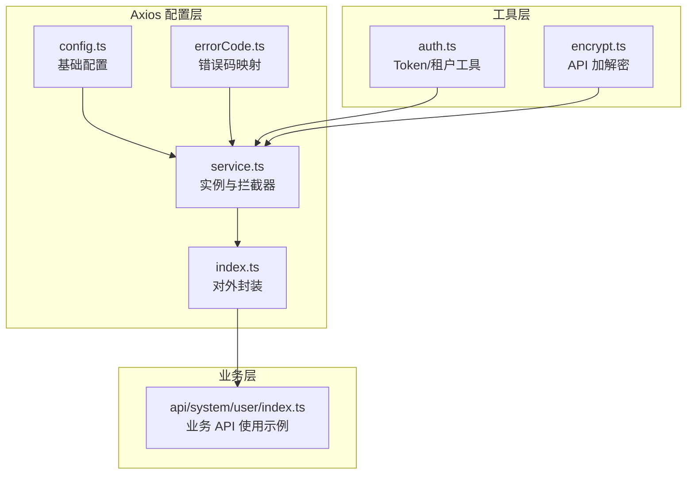
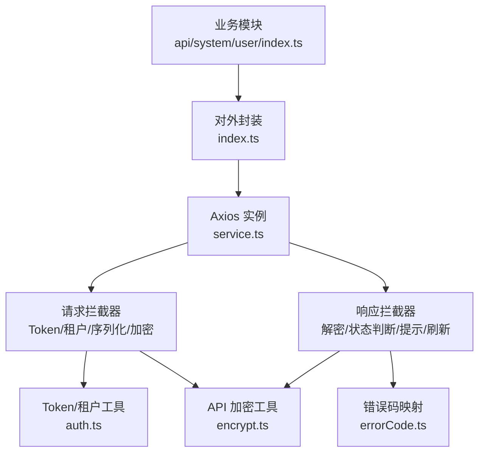
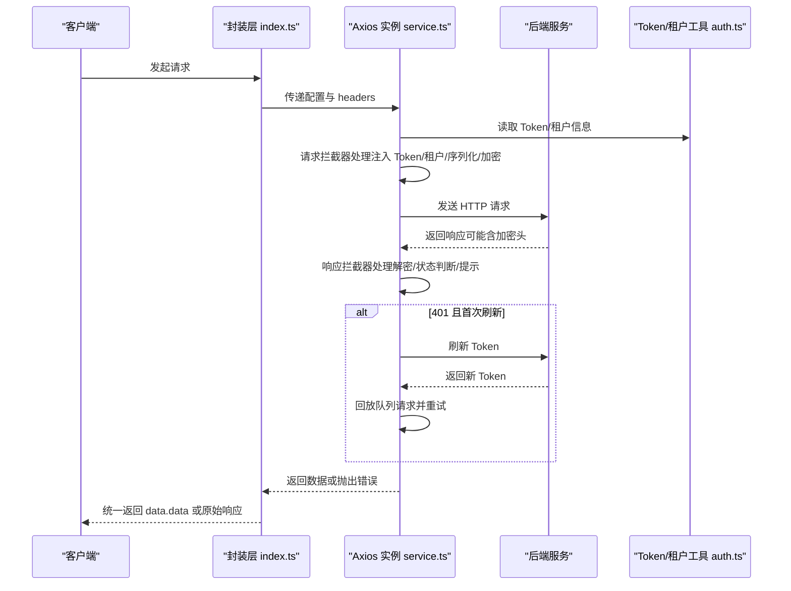
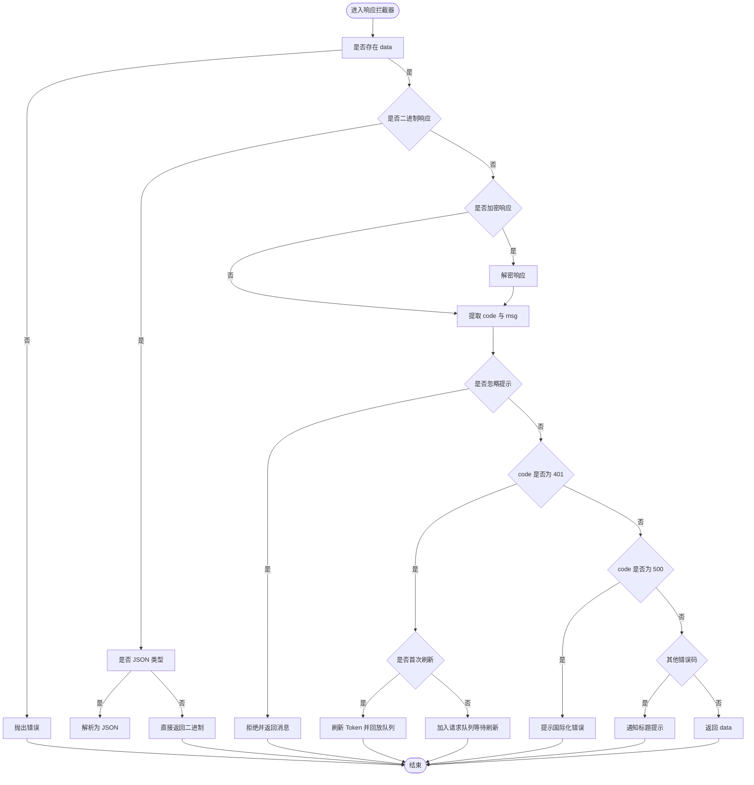
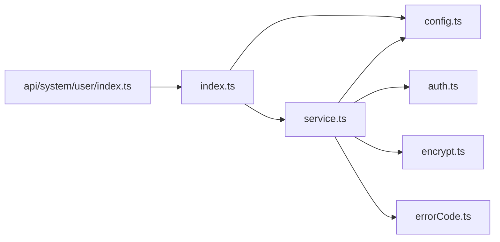

# Axios 配置

<cite>
**本文引用的文件**
- [index.ts](file://yudao-ui/yudao-ui-admin-vue3/src/config/axios/index.ts)
- [config.ts](file://yudao-ui/yudao-ui-admin-vue3/src/config/axios/config.ts)
- [service.ts](file://yudao-ui/yudao-ui-admin-vue3/src/config/axios/service.ts)
- [errorCode.ts](file://yudao-ui/yudao-ui-admin-vue3/src/config/axios/errorCode.ts)
- [auth.ts](file://yudao-ui/yudao-ui-admin-vue3/src/utils/auth.ts)
- [encrypt.ts](file://yudao-ui/yudao-ui-admin-vue3/src/utils/encrypt.ts)
- [user/index.ts](file://yudao-ui/yudao-ui-admin-vue3/src/api/system/user/index.ts)
</cite>

## 目录
1. [简介](#简介)
2. [项目结构](#项目结构)
3. [核心组件](#核心组件)
4. [架构总览](#架构总览)
5. [详细组件分析](#详细组件分析)
6. [依赖关系分析](#依赖关系分析)
7. [性能考量](#性能考量)
8. [故障排查指南](#故障排查指南)
9. [结论](#结论)
10. [附录](#附录)

## 简介
本文件面向芋道 ruoyi-vue-pro 前端工程，系统性梳理 Axios 配置与封装，覆盖以下主题：
- Axios 实例创建与基础配置（baseURL、超时、序列化等）
- 请求拦截器（Token 注入、租户注入、GET 缓存禁用、参数序列化、请求加密）
- 响应拦截器（二进制/JSON 解析、业务状态判断、错误映射、无感刷新令牌、统一提示）
- 错误码映射与错误处理策略（网络错误、业务错误、国际化提示）
- 请求取消与并发控制（请求队列与防重复刷新）
- 请求重试机制设计（基于刷新令牌后的回放）
- 最佳实践与性能优化建议

## 项目结构
Axios 配置位于前端工程的配置模块中，采用分层设计：
- config.ts：全局配置（baseURL、超时、默认 Content-Type）
- service.ts：Axios 实例创建与拦截器实现
- index.ts：对外请求方法封装（get/post/put/delete/download/upload）
- errorCode.ts：错误码映射表
- auth.ts：Token 与租户信息的读取/设置
- encrypt.ts：API 加解密工具（AES/RSA）

图表来源
- [config.ts:1-29](file://yudao-ui/yudao-ui-admin-vue3/src/config/axios/config.ts#L1-L29)
- [service.ts:1-272](file://yudao-ui/yudao-ui-admin-vue3/src/config/axios/service.ts#L1-L272)
- [index.ts:1-48](file://yudao-ui/yudao-ui-admin-vue3/src/config/axios/index.ts#L1-L48)
- [errorCode.ts:1-7](file://yudao-ui/yudao-ui-admin-vue3/src/config/axios/errorCode.ts#L1-L7)
- [auth.ts:1-87](file://yudao-ui/yudao-ui-admin-vue3/src/utils/auth.ts#L1-L87)
- [encrypt.ts:1-232](file://yudao-ui/yudao-ui-admin-vue3/src/utils/encrypt.ts#L1-L232)
- [user/index.ts:1-101](file://yudao-ui/yudao-ui-admin-vue3/src/api/system/user/index.ts#L1-L101)

章节来源
- [config.ts:1-29](file://yudao-ui/yudao-ui-admin-vue3/src/config/axios/config.ts#L1-L29)
- [service.ts:1-272](file://yudao-ui/yudao-ui-admin-vue3/src/config/axios/service.ts#L1-L272)
- [index.ts:1-48](file://yudao-ui/yudao-ui-admin-vue3/src/config/axios/index.ts#L1-L48)
- [errorCode.ts:1-7](file://yudao-ui/yudao-ui-admin-vue3/src/config/axios/errorCode.ts#L1-L7)
- [auth.ts:1-87](file://yudao-ui/yudao-ui-admin-vue3/src/utils/auth.ts#L1-L87)
- [encrypt.ts:1-232](file://yudao-ui/yudao-ui-admin-vue3/src/utils/encrypt.ts#L1-L232)
- [user/index.ts:1-101](file://yudao-ui/yudao-ui-admin-vue3/src/api/system/user/index.ts#L1-L101)

## 核心组件
- 基础配置（config.ts）
  - baseURL：由 Vite 环境变量拼接生成
  - request_timeout：默认 30000ms
  - default_headers：默认 application/json
  - result_code：接口成功状态码约定（用于兼容空 data.code 场景）
- Axios 实例（service.ts）
  - 创建 axios 实例，设置 baseURL、timeout、paramsSerializer
  - 请求拦截器：Token 注入、租户注入、GET 缓存禁用、POST 表单序列化、请求加密
  - 响应拦截器：二进制/JSON 解析、业务状态判断、错误提示、401 无感刷新、忽略提示
- 对外封装（index.ts）
  - get/post/put/delete/download/upload 方法，统一透传 headersType 与 headers
  - 返回值处理：data.data 或原始响应（download/postOriginal）
- 错误码映射（errorCode.ts）
  - 401/403/404/默认错误码映射
- 工具（auth.ts、encrypt.ts）
  - Token 与租户信息读取/设置
  - API 加解密（AES/RSA），支持请求加密与响应解密

章节来源
- [config.ts:1-29](file://yudao-ui/yudao-ui-admin-vue3/src/config/axios/config.ts#L1-L29)
- [service.ts:1-272](file://yudao-ui/yudao-ui-admin-vue3/src/config/axios/service.ts#L1-L272)
- [index.ts:1-48](file://yudao-ui/yudao-ui-admin-vue3/src/config/axios/index.ts#L1-L48)
- [errorCode.ts:1-7](file://yudao-ui/yudao-ui-admin-vue3/src/config/axios/errorCode.ts#L1-L7)
- [auth.ts:1-87](file://yudao-ui/yudao-ui-admin-vue3/src/utils/auth.ts#L1-L87)
- [encrypt.ts:1-232](file://yudao-ui/yudao-ui-admin-vue3/src/utils/encrypt.ts#L1-L232)

## 架构总览
下图展示 Axios 配置的整体架构与调用链：

图表来源
- [user/index.ts:1-101](file://yudao-ui/yudao-ui-admin-vue3/src/api/system/user/index.ts#L1-L101)
- [index.ts:1-48](file://yudao-ui/yudao-ui-admin-vue3/src/config/axios/index.ts#L1-L48)
- [service.ts:1-272](file://yudao-ui/yudao-ui-admin-vue3/src/config/axios/service.ts#L1-L272)
- [auth.ts:1-87](file://yudao-ui/yudao-ui-admin-vue3/src/utils/auth.ts#L1-L87)
- [encrypt.ts:1-232](file://yudao-ui/yudao-ui-admin-vue3/src/utils/encrypt.ts#L1-L232)
- [errorCode.ts:1-7](file://yudao-ui/yudao-ui-admin-vue3/src/config/axios/errorCode.ts#L1-L7)

## 详细组件分析

### 基础配置（config.ts）
- baseURL：通过 Vite 环境变量拼接生成，确保开发/生产环境可切换
- request_timeout：统一超时时间，避免长时间阻塞
- default_headers：默认 JSON 类型，可通过 headersType 覆盖
- result_code：用于兼容后端未返回 code 字段时的默认成功判定

章节来源
- [config.ts:1-29](file://yudao-ui/yudao-ui-admin-vue3/src/config/axios/config.ts#L1-L29)

### Axios 实例与拦截器（service.ts）
- 实例创建
  - 设置 baseURL、timeout、paramsSerializer（支持点号语法）
  - 禁用 withCredentials，避免跨域凭据问题
- 请求拦截器
  - Token 注入：Authorization Bearer 方式，白名单接口除外
  - 租户注入：当开启多租户时，自动注入 tenant-id 与 visit-tenant-id
  - GET 缓存禁用：添加 Cache-Control 与 Pragma
  - POST 表单序列化：application/x-www-form-urlencoded 自动 qs 序列化
  - 请求加密：按需对请求体进行 AES/RSA 加密，并设置加密头
- 响应拦截器
  - 二进制/数组缓冲处理：Blob/ArrayBuffer 直接返回，JSON 类型兜底解析
  - 响应解密：若响应头含加密标志，则对字符串响应进行解密
  - 业务状态判断：code=200/0 成功，其他错误码统一提示
  - 错误映射：优先使用 data.msg，其次 errorCode 映射，最后默认提示
  - 401 无感刷新：首次触发刷新，其余请求排队等待，刷新成功后回放
  - 忽略提示：部分刷新相关提示直接抛出消息，不重复弹窗
  - 网络错误：统一国际化提示
- 刷新令牌与登出
  - refreshToken：调用后端刷新接口，成功后更新 Token 并回放队列
  - handleAuthorized：弹窗提示并重置路由、缓存、Token 后强制刷新页面

图表来源
- [service.ts:1-272](file://yudao-ui/yudao-ui-admin-vue3/src/config/axios/service.ts#L1-L272)
- [auth.ts:1-87](file://yudao-ui/yudao-ui-admin-vue3/src/utils/auth.ts#L1-L87)

章节来源
- [service.ts:1-272](file://yudao-ui/yudao-ui-admin-vue3/src/config/axios/service.ts#L1-L272)

### 对外封装（index.ts）
- 方法族：get/post/put/delete/download/upload
- 参数合并：支持 headersType 与 headers 覆盖默认值
- 返回值：除 download/postOriginal 外，默认返回 data.data

章节来源
- [index.ts:1-48](file://yudao-ui/yudao-ui-admin-vue3/src/config/axios/index.ts#L1-L48)

### 错误码映射与错误处理（errorCode.ts、service.ts）
- 映射表：401/403/404/默认错误码
- 处理流程：
  - 忽略提示：直接抛出消息，不重复提示
  - 401：无感刷新，刷新失败则登出
  - 500：国际化错误提示
  - 其他错误码：通知标题提示
  - 网络错误：国际化提示

图表来源
- [service.ts:108-239](file://yudao-ui/yudao-ui-admin-vue3/src/config/axios/service.ts#L108-L239)
- [errorCode.ts:1-7](file://yudao-ui/yudao-ui-admin-vue3/src/config/axios/errorCode.ts#L1-L7)

章节来源
- [service.ts:108-239](file://yudao-ui/yudao-ui-admin-vue3/src/config/axios/service.ts#L108-L239)
- [errorCode.ts:1-7](file://yudao-ui/yudao-ui-admin-vue3/src/config/axios/errorCode.ts#L1-L7)

### 请求加密与解密（encrypt.ts）
- 算法支持：AES（ECB/PKCS7）、RSA
- 配置项：开关、头名、算法、请求/响应密钥
- 流程：
  - 请求加密：按算法与密钥对请求体进行加密，并设置加密头
  - 响应解密：按算法与密钥对响应进行解密，尝试 JSON 解析

章节来源
- [encrypt.ts:1-232](file://yudao-ui/yudao-ui-admin-vue3/src/utils/encrypt.ts#L1-L232)
- [service.ts:86-98](file://yudao-ui/yudao-ui-admin-vue3/src/config/axios/service.ts#L86-L98)
- [service.ts:119-131](file://yudao-ui/yudao-ui-admin-vue3/src/config/axios/service.ts#L119-L131)

### 使用示例（api/system/user/index.ts）
- 通过 request.get/post/put/delete/download 等方法发起请求
- 统一返回 data.data，便于业务层直接消费

章节来源
- [user/index.ts:1-101](file://yudao-ui/yudao-ui-admin-vue3/src/api/system/user/index.ts#L1-L101)
- [index.ts:17-46](file://yudao-ui/yudao-ui-admin-vue3/src/config/axios/index.ts#L17-L46)

## 依赖关系分析
- 组件耦合
  - index.ts 仅依赖 service.ts 与 config.ts
  - service.ts 依赖 config.ts、auth.ts、encrypt.ts、errorCode.ts
  - 业务 API 仅依赖 index.ts
- 外部依赖
  - axios、qs、Element Plus（提示与确认框）、CryptoJS/jsencrypt（加密）

图表来源
- [index.ts:1-48](file://yudao-ui/yudao-ui-admin-vue3/src/config/axios/index.ts#L1-L48)
- [service.ts:1-272](file://yudao-ui/yudao-ui-admin-vue3/src/config/axios/service.ts#L1-L272)
- [config.ts:1-29](file://yudao-ui/yudao-ui-admin-vue3/src/config/axios/config.ts#L1-L29)
- [auth.ts:1-87](file://yudao-ui/yudao-ui-admin-vue3/src/utils/auth.ts#L1-L87)
- [encrypt.ts:1-232](file://yudao-ui/yudao-ui-admin-vue3/src/utils/encrypt.ts#L1-L232)
- [errorCode.ts:1-7](file://yudao-ui/yudao-ui-admin-vue3/src/config/axios/errorCode.ts#L1-L7)
- [user/index.ts:1-101](file://yudao-ui/yudao-ui-admin-vue3/src/api/system/user/index.ts#L1-L101)

章节来源
- [index.ts:1-48](file://yudao-ui/yudao-ui-admin-vue3/src/config/axios/index.ts#L1-L48)
- [service.ts:1-272](file://yudao-ui/yudao-ui-admin-vue3/src/config/axios/service.ts#L1-L272)
- [user/index.ts:1-101](file://yudao-ui/yudao-ui-admin-vue3/src/api/system/user/index.ts#L1-L101)

## 性能考量
- 超时与序列化
  - 合理设置 request_timeout，避免长时间挂起
  - paramsSerializer 支持复杂对象序列化，减少后端解析成本
- GET 缓存禁用
  - 防止浏览器缓存 GET 请求，保证数据一致性
- 二进制响应直返
  - 导出/下载场景直接返回二进制，避免额外解析
- 请求加密
  - 在高安全场景启用 API 加密，注意加密/解密开销与密钥管理
- 无感刷新
  - 401 时仅首次触发刷新，其余请求排队，降低重复请求与刷新风暴

[本节为通用性能建议，无需特定文件引用]

## 故障排查指南
- 常见问题与定位
  - 401 未认证：检查 Token 是否存在与过期；确认刷新逻辑是否生效
  - 403 权限不足：核对后端权限与租户隔离
  - 404 资源不存在：核对 URL 与后端接口
  - 网络错误/超时：检查 baseURL 与网络连通性
  - 响应解密失败：确认加密算法与密钥配置一致
- 关键日志与断点
  - 请求拦截器与响应拦截器中的错误分支
  - 刷新令牌与回放队列逻辑
- 建议排查步骤
  - 打开浏览器开发者工具 Network 面板，观察请求头与响应头
  - 查看 Console 中错误堆栈与国际化提示
  - 核对 Vite 环境变量与加密配置

章节来源
- [service.ts:225-239](file://yudao-ui/yudao-ui-admin-vue3/src/config/axios/service.ts#L225-L239)
- [service.ts:152-194](file://yudao-ui/yudao-ui-admin-vue3/src/config/axios/service.ts#L152-L194)
- [encrypt.ts:181-230](file://yudao-ui/yudao-ui-admin-vue3/src/utils/encrypt.ts#L181-L230)

## 结论
该 Axios 配置以“最小封装、强拦截器”为核心思想，实现了：
- 统一的请求/响应处理与错误映射
- 无感刷新与请求队列，提升用户体验
- 多租户与 Token 注入、参数序列化、请求加密等企业级能力
- 二进制响应直返与国际化提示，兼顾性能与可用性

建议在实际项目中结合业务场景启用 API 加密、合理设置超时与并发策略，并持续完善错误码映射与国际化文案。

[本节为总结性内容，无需特定文件引用]

## 附录

### 配置最佳实践
- 环境变量
  - baseURL：通过 Vite 环境变量统一管理，区分 dev/prod
  - API 加密：按需开启，严格管理密钥与算法
- 请求头
  - headersType 与 headers 由上层灵活传入，避免硬编码
- 并发与取消
  - 建议引入 CancelToken 或 AbortController，在路由切换/组件销毁时取消未完成请求
- 重试策略
  - 对幂等请求（GET/HEAD）可考虑指数退避重试，非幂等请求谨慎重试
- 日志与监控
  - 在开发环境输出请求/响应摘要，生产环境仅记录必要错误

[本节为通用最佳实践，无需特定文件引用]