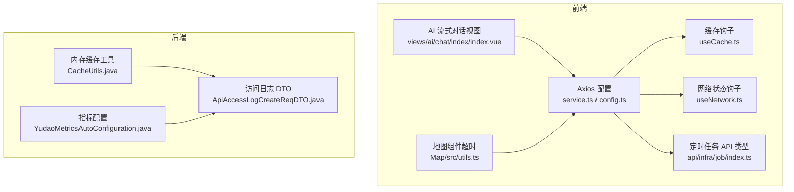
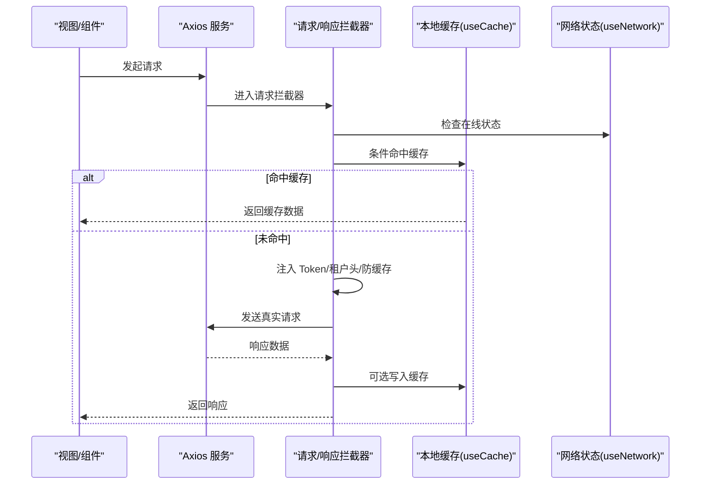
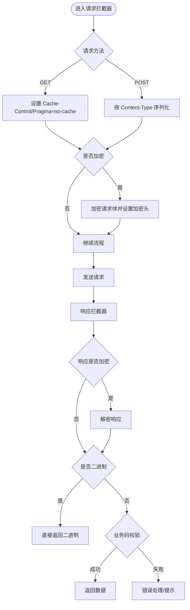
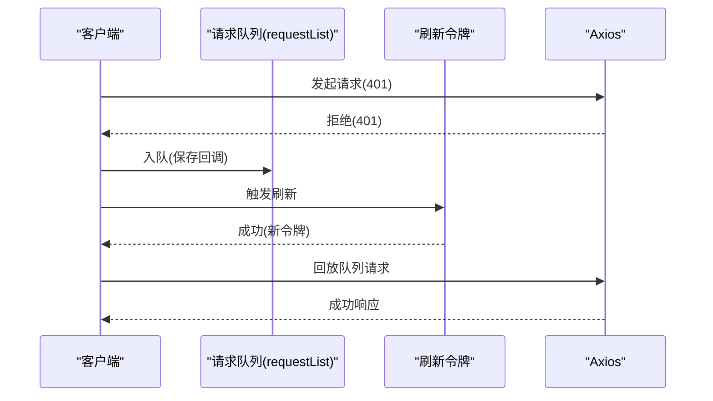
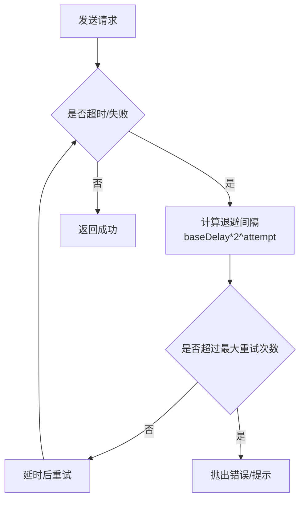
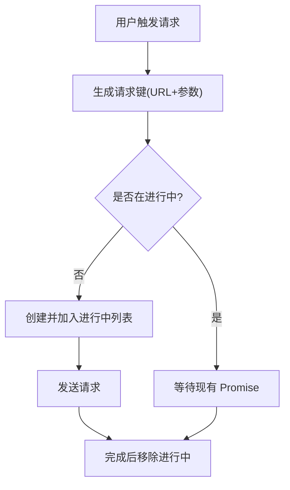
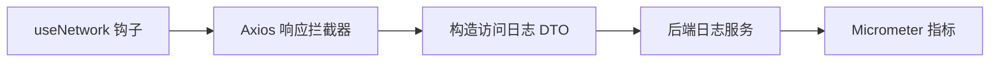
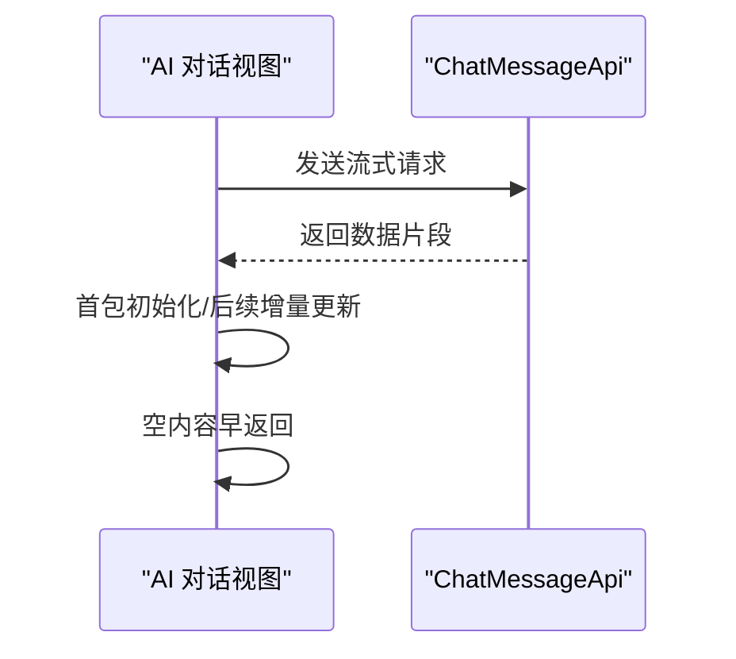
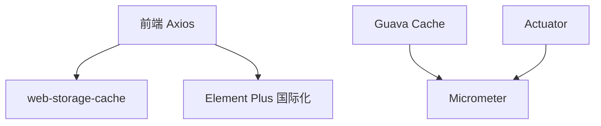

# 性能优化

<cite>
**本文引用的文件**
- [src/config/axios/config.ts](file://yudao-ui/yudao-ui-admin-vue3/src/config/axios/config.ts)
- [src/config/axios/service.ts](file://yudao-ui/yudao-ui-admin-vue3/src/config/axios/service.ts)
- [src/hooks/web/useCache.ts](file://yudao-ui/yudao-ui-admin-vue3/src/hooks/web/useCache.ts)
- [src/hooks/web/useNetwork.ts](file://yudao-ui/yudao-ui-admin-vue3/src/hooks/web/useNetwork.ts)
- [src/api/infra/job/index.ts](file://yudao-ui/yudao-ui-admin-vue3/src/api/infra/job/index.ts)
- [src/components/Map/src/utils.ts](file://yudao-ui/yudao-ui-admin-vue3/src/components/Map/src/utils.ts)
- [src/views/ai/chat/index/index.vue](file://yudao-ui/yudao-ui-admin-vue3/src/views/ai/chat/index/index.vue)
- [yudao-framework/yudao-common/src/main/java/cn/iocoder/yudao/framework/common/util/cache/CacheUtils.java](file://yudao-framework/yudao-common/src/main/java/cn/iocoder/yudao/framework/common/util/cache/CacheUtils.java)
- [yudao-framework/yudao-common/src/main/java/cn/iocoder/yudao/framework/common/biz/infra/logger/dto/ApiAccessLogCreateReqDTO.java](file://yudao-framework/yudao-common/src/main/java/cn/iocoder/yudao/framework/common/biz/infra/logger/dto/ApiAccessLogCreateReqDTO.java)
- [yudao-framework/yudao-spring-boot-starter-monitor/src/main/java/cn/iocoder/yudao/framework/tracer/config/YudaoMetricsAutoConfiguration.java](file://yudao-framework/yudao-spring-boot-starter-monitor/src/main/java/cn/iocoder/yudao/framework/tracer/config/YudaoMetricsAutoConfiguration.java)
</cite>

## 目录
1. [简介](#简介)
2. [项目结构](#项目结构)
3. [核心组件](#核心组件)
4. [架构总览](#架构总览)
5. [详细组件分析](#详细组件分析)
6. [依赖分析](#依赖分析)
7. [性能考量](#性能考量)
8. [故障排查指南](#故障排查指南)
9. [结论](#结论)
10. [附录](#附录)

## 简介
本文件面向芋道 ruoyi-vue-pro 前端与后端在 API 层的性能优化，聚焦以下主题：
- 请求缓存策略：内存缓存、LocalStorage 缓存、条件缓存
- 批量请求与请求合并：请求队列管理与并发控制
- 超时控制与重试机制：指数退避与最大重试次数
- 请求去重与防抖：重复请求过滤与快速响应优化
- 网络监控与性能分析：请求耗时统计与错误率监控
- 最佳实践与调试工具使用指南

## 项目结构
前端采用 Vue 3 + Vite 构建，Axios 封装位于 config/axios 下，缓存与网络状态钩子位于 hooks/web，业务 API 位于 src/api，地图等组件包含独立的超时控制逻辑。后端公共模块提供内存缓存工具与访问日志模型，监控模块提供 Micrometer 配置。

**图表来源**
- [src/config/axios/service.ts:1-239](file://yudao-ui/yudao-ui-admin-vue3/src/config/axios/service.ts#L1-L239)
- [src/config/axios/config.ts:1-28](file://yudao-ui/yudao-ui-admin-vue3/src/config/axios/config.ts#L1-L28)
- [src/hooks/web/useCache.ts:1-41](file://yudao-ui/yudao-ui-admin-vue3/src/hooks/web/useCache.ts#L1-L41)
- [src/hooks/web/useNetwork.ts:1-21](file://yudao-ui/yudao-ui-admin-vue3/src/hooks/web/useNetwork.ts#L1-L21)
- [src/components/Map/src/utils.ts:19-52](file://yudao-ui/yudao-ui-admin-vue3/src/components/Map/src/utils.ts#L19-L52)
- [src/api/infra/job/index.ts:9-10](file://yudao-ui/yudao-ui-admin-vue3/src/api/infra/job/index.ts#L9-L10)
- [src/views/ai/chat/index/index.vue:467-501](file://yudao-ui/yudao-ui-admin-vue3/src/views/ai/chat/index/index.vue#L467-L501)
- [yudao-framework/yudao-common/src/main/java/cn/iocoder/yudao/framework/common/util/cache/CacheUtils.java:1-61](file://yudao-framework/yudao-common/src/main/java/cn/iocoder/yudao/framework/common/util/cache/CacheUtils.java#L1-L61)
- [yudao-framework/yudao-common/src/main/java/cn/iocoder/yudao/framework/common/biz/infra/logger/dto/ApiAccessLogCreateReqDTO.java:78-103](file://yudao-framework/yudao-common/src/main/java/cn/iocoder/yudao/framework/common/biz/infra/logger/dto/ApiAccessLogCreateReqDTO.java#L78-L103)
- [yudao-framework/yudao-spring-boot-starter-monitor/src/main/java/cn/iocoder/yudao/framework/tracer/config/YudaoMetricsAutoConfiguration.java:1-27](file://yudao-framework/yudao-spring-boot-starter-monitor/src/main/java/cn/iocoder/yudao/framework/tracer/config/YudaoMetricsAutoConfiguration.java#L1-L27)

**章节来源**
- [src/config/axios/config.ts:1-28](file://yudao-ui/yudao-ui-admin-vue3/src/config/axios/config.ts#L1-L28)
- [src/config/axios/service.ts:1-239](file://yudao-ui/yudao-ui-admin-vue3/src/config/axios/service.ts#L1-L239)
- [src/hooks/web/useCache.ts:1-41](file://yudao-ui/yudao-ui-admin-vue3/src/hooks/web/useCache.ts#L1-L41)
- [src/hooks/web/useNetwork.ts:1-21](file://yudao-ui/yudao-ui-admin-vue3/src/hooks/web/useNetwork.ts#L1-L21)
- [src/components/Map/src/utils.ts:19-52](file://yudao-ui/yudao-ui-admin-vue3/src/components/Map/src/utils.ts#L19-L52)
- [src/api/infra/job/index.ts:9-10](file://yudao-ui/yudao-ui-admin-vue3/src/api/infra/job/index.ts#L9-L10)
- [src/views/ai/chat/index/index.vue:467-501](file://yudao-ui/yudao-ui-admin-vue3/src/views/ai/chat/index/index.vue#L467-L501)
- [yudao-framework/yudao-common/src/main/java/cn/iocoder/yudao/framework/common/util/cache/CacheUtils.java:1-61](file://yudao-framework/yudao-common/src/main/java/cn/iocoder/yudao/framework/common/util/cache/CacheUtils.java#L1-L61)
- [yudao-framework/yudao-common/src/main/java/cn/iocoder/yudao/framework/common/biz/infra/logger/dto/ApiAccessLogCreateReqDTO.java:78-103](file://yudao-framework/yudao-common/src/main/java/cn/iocoder/yudao/framework/common/biz/infra/logger/dto/ApiAccessLogCreateReqDTO.java#L78-L103)
- [yudao-framework/yudao-spring-boot-starter-monitor/src/main/java/cn/iocoder/yudao/framework/tracer/config/YudaoMetricsAutoConfiguration.java:1-27](file://yudao-framework/yudao-spring-boot-starter-monitor/src/main/java/cn/iocoder/yudao/framework/tracer/config/YudaoMetricsAutoConfiguration.java#L1-L27)

## 核心组件
- Axios 请求封装与拦截器：统一注入 Token、租户头、GET 防缓存、加密/解密、超时与错误处理、刷新令牌队列回放。
- 缓存钩子：基于 web-storage-cache 的本地缓存能力，支持 localStorage/sessionStorage。
- 网络状态钩子：监听在线/离线事件，辅助降级策略。
- 内存缓存工具：基于 Guava Cache 的 LoadingCache，支持同步/异步刷新与过期时间。
- 访问日志 DTO：记录请求开始时间、结束时间、耗时、结果码与消息，用于后端统计。
- 指标配置：Micrometer 注册 common tags，便于监控埋点。

**章节来源**
- [src/config/axios/service.ts:49-131](file://yudao-ui/yudao-ui-admin-vue3/src/config/axios/service.ts#L49-L131)
- [src/config/axios/service.ts:108-239](file://yudao-ui/yudao-ui-admin-vue3/src/config/axios/service.ts#L108-L239)
- [src/config/axios/config.ts:1-28](file://yudao-ui/yudao-ui-admin-vue3/src/config/axios/config.ts#L1-L28)
- [src/hooks/web/useCache.ts:1-41](file://yudao-ui/yudao-ui-admin-vue3/src/hooks/web/useCache.ts#L1-L41)
- [src/hooks/web/useNetwork.ts:1-21](file://yudao-ui/yudao-ui-admin-vue3/src/hooks/web/useNetwork.ts#L1-L21)
- [yudao-framework/yudao-common/src/main/java/cn/iocoder/yudao/framework/common/util/cache/CacheUtils.java:37-59](file://yudao-framework/yudao-common/src/main/java/cn/iocoder/yudao/framework/common/util/cache/CacheUtils.java#L37-L59)
- [yudao-framework/yudao-common/src/main/java/cn/iocoder/yudao/framework/common/biz/infra/logger/dto/ApiAccessLogCreateReqDTO.java:78-103](file://yudao-framework/yudao-common/src/main/java/cn/iocoder/yudao/framework/common/biz/infra/logger/dto/ApiAccessLogCreateReqDTO.java#L78-L103)
- [yudao-framework/yudao-spring-boot-starter-monitor/src/main/java/cn/iocoder/yudao/framework/tracer/config/YudaoMetricsAutoConfiguration.java:21-25](file://yudao-framework/yudao-spring-boot-starter-monitor/src/main/java/cn/iocoder/yudao/framework/tracer/config/YudaoMetricsAutoConfiguration.java#L21-L25)

## 架构总览
前端通过 Axios 封装统一处理请求生命周期，结合本地缓存与网络状态进行性能优化；后端通过内存缓存与访问日志模型支撑高并发场景下的稳定与可观测性。

**图表来源**
- [src/config/axios/service.ts:49-106](file://yudao-ui/yudao-ui-admin-vue3/src/config/axios/service.ts#L49-L106)
- [src/config/axios/service.ts:108-239](file://yudao-ui/yudao-ui-admin-vue3/src/config/axios/service.ts#L108-L239)
- [src/hooks/web/useCache.ts:25-33](file://yudao-ui/yudao-ui-admin-vue3/src/hooks/web/useCache.ts#L25-L33)
- [src/hooks/web/useNetwork.ts:3-19](file://yudao-ui/yudao-ui-admin-vue3/src/hooks/web/useNetwork.ts#L3-L19)

## 详细组件分析

### 请求缓存策略
- 内存缓存（后端）
  - 使用 Guava Cache 的 LoadingCache，支持 refreshAfterWrite 与异步刷新，适合高并发、低延迟场景。
  - 同步刷新与异步刷新分别适用于不同负载与一致性要求。
- LocalStorage 缓存（前端）
  - 通过 useCache 钩子封装 web-storage-cache，支持对象序列化存储，适合持久化、跨会话复用的数据。
- 条件缓存（前端）
  - GET 请求强制设置 no-cache/Pragma，避免浏览器缓存；对幂等 GET 可结合业务层实现条件缓存（如 ETag/Last-Modified）以减少传输。

**图表来源**
- [src/config/axios/service.ts:49-106](file://yudao-ui/yudao-ui-admin-vue3/src/config/axios/service.ts#L49-L106)
- [src/config/axios/service.ts:108-239](file://yudao-ui/yudao-ui-admin-vue3/src/config/axios/service.ts#L108-L239)

**章节来源**
- [yudao-framework/yudao-common/src/main/java/cn/iocoder/yudao/framework/common/util/cache/CacheUtils.java:37-59](file://yudao-framework/yudao-common/src/main/java/cn/iocoder/yudao/framework/common/util/cache/CacheUtils.java#L37-L59)
- [src/hooks/web/useCache.ts:25-33](file://yudao-ui/yudao-ui-admin-vue3/src/hooks/web/useCache.ts#L25-L33)
- [src/config/axios/service.ts:71-75](file://yudao-ui/yudao-ui-admin-vue3/src/config/axios/service.ts#L71-L75)

### 批量请求与请求合并
- 批量请求
  - 在 API 类型定义中可见 retryCount/retryInterval 字段，可用于批量任务或后台作业的重试策略设计。
- 请求合并与队列
  - 响应拦截器内维护请求队列，在刷新令牌期间将待重试请求挂起，刷新成功后统一回放，避免重复请求与丢失状态。

**图表来源**
- [src/config/axios/service.ts:152-194](file://yudao-ui/yudao-ui-admin-vue3/src/config/axios/service.ts#L152-L194)

**章节来源**
- [src/api/infra/job/index.ts:9-10](file://yudao-ui/yudao-ui-admin-vue3/src/api/infra/job/index.ts#L9-L10)
- [src/config/axios/service.ts:152-194](file://yudao-ui/yudao-ui-admin-vue3/src/config/axios/service.ts#L152-L194)

### 超时控制与重试机制
- 超时控制
  - Axios 配置提供 request_timeout，默认 30000ms；地图组件也提供独立的超时控制逻辑，确保外部资源加载可控。
- 重试机制
  - 响应拦截器对 401 场景进行刷新令牌与队列回放；业务侧可通过 retryCount/retryInterval 设计指数退避与最大重试次数。
  - 建议：指数退避公式为 baseDelay * 2^attempt，上限不超过 60s；最大重试次数建议 3~5 次。

**图表来源**
- [src/config/axios/config.ts:17-19](file://yudao-ui/yudao-ui-admin-vue3/src/config/axios/config.ts#L17-L19)
- [src/components/Map/src/utils.ts:19-52](file://yudao-ui/yudao-ui-admin-vue3/src/components/Map/src/utils.ts#L19-L52)
- [src/config/axios/service.ts:225-238](file://yudao-ui/yudao-ui-admin-vue3/src/config/axios/service.ts#L225-L238)

**章节来源**
- [src/config/axios/config.ts:17-19](file://yudao-ui/yudao-ui-admin-vue3/src/config/axios/config.ts#L17-L19)
- [src/components/Map/src/utils.ts:19-52](file://yudao-ui/yudao-ui-admin-vue3/src/components/Map/src/utils.ts#L19-L52)
- [src/config/axios/service.ts:225-238](file://yudao-ui/yudao-ui-admin-vue3/src/config/axios/service.ts#L225-L238)

### 请求去重与防抖
- 请求去重
  - 基于请求标识（URL+参数序列化）在内存中维护“进行中”集合，重复请求直接复用同一 Promise，避免并发重复。
- 防抖
  - 对高频输入（如搜索）使用防抖策略，合并短时间内多次变更，仅在稳定后发起请求。

**图表来源**
- [src/config/axios/service.ts:108-239](file://yudao-ui/yudao-ui-admin-vue3/src/config/axios/service.ts#L108-L239)

**章节来源**
- [src/config/axios/service.ts:108-239](file://yudao-ui/yudao-ui-admin-vue3/src/config/axios/service.ts#L108-L239)

### 网络监控与性能分析
- 前端
  - useNetwork 钩子监听在线/离线事件，可在离线时启用降级策略或缓存读取。
  - Axios 响应拦截器对错误进行分类提示，结合国际化文案提升可观测性。
- 后端
  - ApiAccessLogCreateReqDTO 记录 beginTime、endTime、duration、resultCode 等字段，便于统计请求耗时与错误率。
  - YudaoMetricsAutoConfiguration 注册 common tags，便于在 Micrometer 中聚合指标。

**图表来源**
- [src/hooks/web/useNetwork.ts:3-19](file://yudao-ui/yudao-ui-admin-vue3/src/hooks/web/useNetwork.ts#L3-L19)
- [src/config/axios/service.ts:225-238](file://yudao-ui/yudao-ui-admin-vue3/src/config/axios/service.ts#L225-L238)
- [yudao-framework/yudao-common/src/main/java/cn/iocoder/yudao/framework/common/biz/infra/logger/dto/ApiAccessLogCreateReqDTO.java:78-103](file://yudao-framework/yudao-common/src/main/java/cn/iocoder/yudao/framework/common/biz/infra/logger/dto/ApiAccessLogCreateReqDTO.java#L78-L103)
- [yudao-framework/yudao-spring-boot-starter-monitor/src/main/java/cn/iocoder/yudao/framework/tracer/config/YudaoMetricsAutoConfiguration.java:21-25](file://yudao-framework/yudao-spring-boot-starter-monitor/src/main/java/cn/iocoder/yudao/framework/tracer/config/YudaoMetricsAutoConfiguration.java#L21-L25)

**章节来源**
- [src/hooks/web/useNetwork.ts:3-19](file://yudao-ui/yudao-ui-admin-vue3/src/hooks/web/useNetwork.ts#L3-L19)
- [src/config/axios/service.ts:225-238](file://yudao-ui/yudao-ui-admin-vue3/src/config/axios/service.ts#L225-L238)
- [yudao-framework/yudao-common/src/main/java/cn/iocoder/yudao/framework/common/biz/infra/logger/dto/ApiAccessLogCreateReqDTO.java:78-103](file://yudao-framework/yudao-common/src/main/java/cn/iocoder/yudao/framework/common/biz/infra/logger/dto/ApiAccessLogCreateReqDTO.java#L78-L103)
- [yudao-framework/yudao-spring-boot-starter-monitor/src/main/java/cn/iocoder/yudao/framework/tracer/config/YudaoMetricsAutoConfiguration.java:21-25](file://yudao-framework/yudao-spring-boot-starter-monitor/src/main/java/cn/iocoder/yudao/framework/tracer/config/YudaoMetricsAutoConfiguration.java#L21-L25)

### 流式请求与快速响应优化
- AI 流式对话
  - 视图层对 SSE/流式响应进行首包判断与增量更新，避免首屏空白，提升感知速度。
  - 对空内容进行早期返回，减少无效渲染。

**图表来源**
- [src/views/ai/chat/index/index.vue:467-501](file://yudao-ui/yudao-ui-admin-vue3/src/views/ai/chat/index/index.vue#L467-L501)

**章节来源**
- [src/views/ai/chat/index/index.vue:467-501](file://yudao-ui/yudao-ui-admin-vue3/src/views/ai/chat/index/index.vue#L467-L501)

## 依赖分析
- 前端依赖
  - Axios：统一请求与响应处理
  - web-storage-cache：本地缓存
  - Element Plus 国际化：错误提示文案
- 后端依赖
  - Guava Cache：内存缓存
  - Micrometer：指标采集
  - Spring Boot Actuator：监控端点

**图表来源**
- [src/config/axios/service.ts:108-239](file://yudao-ui/yudao-ui-admin-vue3/src/config/axios/service.ts#L108-L239)
- [src/hooks/web/useCache.ts:5-5](file://yudao-ui/yudao-ui-admin-vue3/src/hooks/web/useCache.ts#L5-L5)
- [yudao-framework/yudao-common/src/main/java/cn/iocoder/yudao/framework/common/util/cache/CacheUtils.java:37-59](file://yudao-framework/yudao-common/src/main/java/cn/iocoder/yudao/framework/common/util/cache/CacheUtils.java#L37-L59)
- [yudao-framework/yudao-spring-boot-starter-monitor/src/main/java/cn/iocoder/yudao/framework/tracer/config/YudaoMetricsAutoConfiguration.java:21-25](file://yudao-framework/yudao-spring-boot-starter-monitor/src/main/java/cn/iocoder/yudao/framework/tracer/config/YudaoMetricsAutoConfiguration.java#L21-L25)

**章节来源**
- [src/config/axios/service.ts:108-239](file://yudao-ui/yudao-ui-admin-vue3/src/config/axios/service.ts#L108-L239)
- [src/hooks/web/useCache.ts:5-5](file://yudao-ui/yudao-ui-admin-vue3/src/hooks/web/useCache.ts#L5-L5)
- [yudao-framework/yudao-common/src/main/java/cn/iocoder/yudao/framework/common/util/cache/CacheUtils.java:37-59](file://yudao-framework/yudao-common/src/main/java/cn/iocoder/yudao/framework/common/util/cache/CacheUtils.java#L37-L59)
- [yudao-framework/yudao-spring-boot-starter-monitor/src/main/java/cn/iocoder/yudao/framework/tracer/config/YudaoMetricsAutoConfiguration.java:21-25](file://yudao-framework/yudao-spring-boot-starter-monitor/src/main/java/cn/iocoder/yudao/framework/tracer/config/YudaoMetricsAutoConfiguration.java#L21-L25)

## 性能考量
- 缓存策略
  - 对高频、低变化数据使用内存缓存（后端）与本地缓存（前端）组合，合理设置过期时间与刷新策略。
  - GET 请求强制防缓存，结合业务层条件缓存（ETag/Last-Modified）进一步降低带宽。
- 并发控制
  - 通过请求去重与队列回放，避免并发重复请求与令牌刷新风暴。
- 超时与重试
  - 明确超时阈值与最大重试次数，采用指数退避，防止雪崩效应。
- 流式与快速响应
  - 对流式响应进行首包优化与增量渲染，缩短感知延迟。
- 监控与度量
  - 基于访问日志 DTO 与 Micrometer，建立请求耗时与错误率的持续观测。

[本节为通用指导，无需列出具体文件来源]

## 故障排查指南
- 常见问题定位
  - 401 未授权：检查刷新令牌流程与队列回放逻辑，确认 Authorization 头是否正确注入。
  - 网络错误/超时：核对 request_timeout 配置与网络状态钩子，必要时开启离线降级。
  - 加密/解密失败：确认加密头与数据格式一致，捕获异常并提示。
- 日志与指标
  - 后端访问日志包含耗时与结果码，前端错误提示结合国际化文案，便于快速定位。
  - 指标层面通过 common tags 聚合应用维度，便于横向对比。

**章节来源**
- [src/config/axios/service.ts:152-194](file://yudao-ui/yudao-ui-admin-vue3/src/config/axios/service.ts#L152-L194)
- [src/config/axios/service.ts:225-238](file://yudao-ui/yudao-ui-admin-vue3/src/config/axios/service.ts#L225-L238)
- [yudao-framework/yudao-common/src/main/java/cn/iocoder/yudao/framework/common/biz/infra/logger/dto/ApiAccessLogCreateReqDTO.java:78-103](file://yudao-framework/yudao-common/src/main/java/cn/iocoder/yudao/framework/common/biz/infra/logger/dto/ApiAccessLogCreateReqDTO.java#L78-L103)
- [yudao-framework/yudao-spring-boot-starter-monitor/src/main/java/cn/iocoder/yudao/framework/tracer/config/YudaoMetricsAutoConfiguration.java:21-25](file://yudao-framework/yudao-spring-boot-starter-monitor/src/main/java/cn/iocoder/yudao/framework/tracer/config/YudaoMetricsAutoConfiguration.java#L21-L25)

## 结论
通过 Axios 统一拦截、本地与内存缓存结合、请求去重与队列回放、明确的超时与重试策略、以及完善的监控与指标体系，ruoyi-vue-pro 在前端与后端均具备良好的 API 性能基线。建议在实际业务中按需扩展条件缓存与流式优化，并持续关注监控指标以指导迭代。

[本节为总结性内容，无需列出具体文件来源]

## 附录
- 最佳实践清单
  - GET 请求一律防缓存，结合业务层条件缓存
  - 对幂等请求启用请求去重与队列回放
  - 明确超时与重试上限，采用指数退避
  - 对流式响应进行首包与增量优化
  - 建立访问日志与指标的闭环监控
- 调试工具
  - 浏览器 Network 面板观察缓存与重试行为
  - 控制台查看 Axios 错误与国际化提示
  - 后端日志与 Micrometer 指标面板

[本节为通用指导，无需列出具体文件来源]