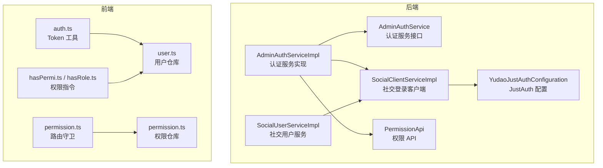
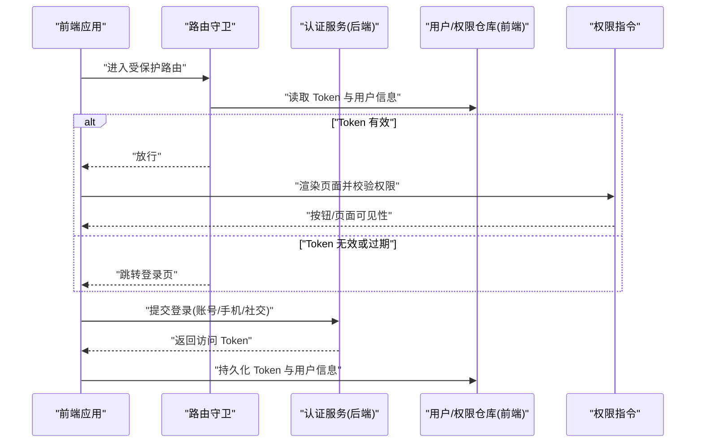
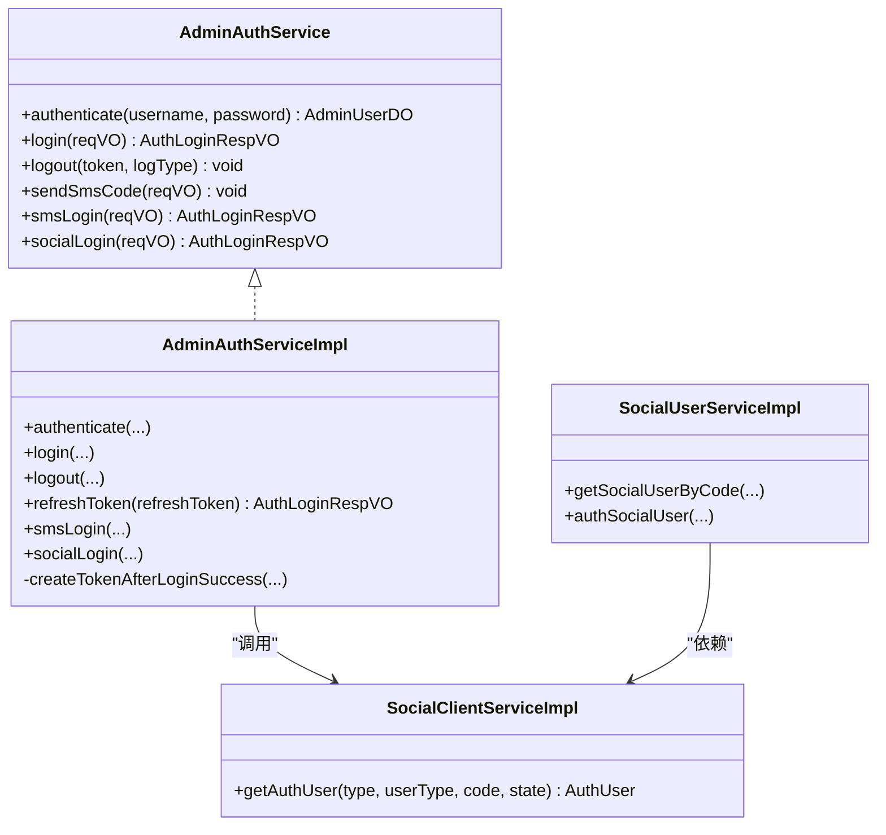
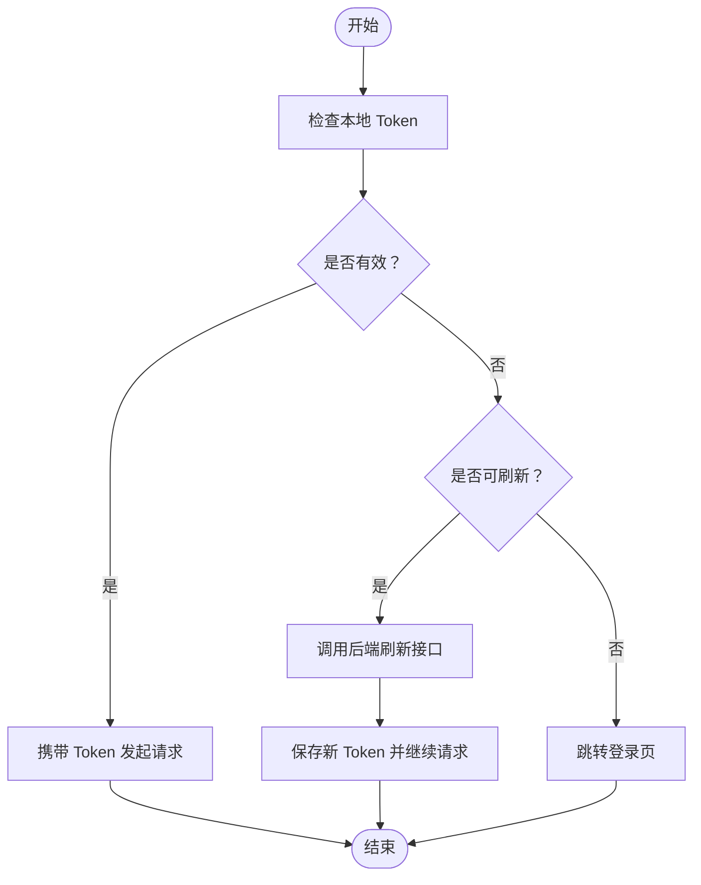
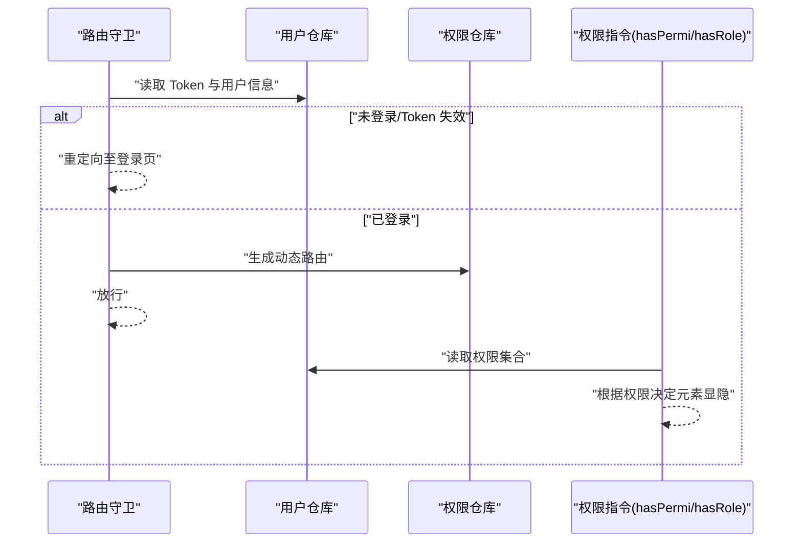
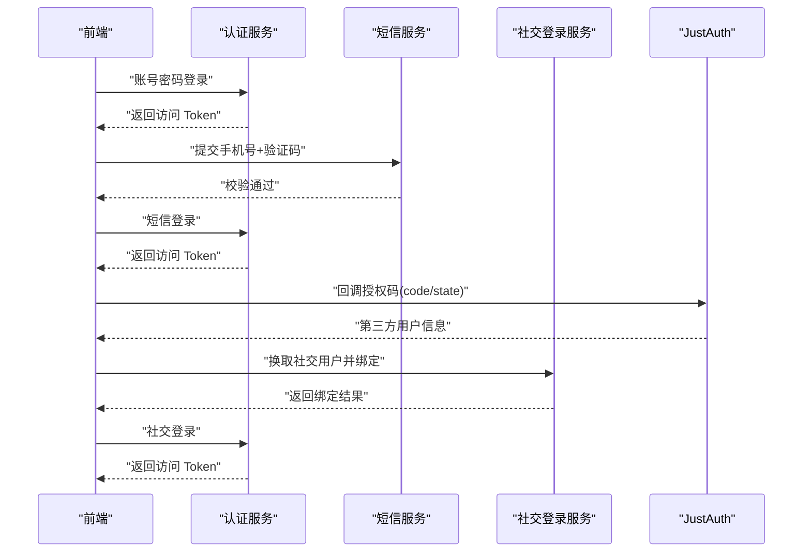
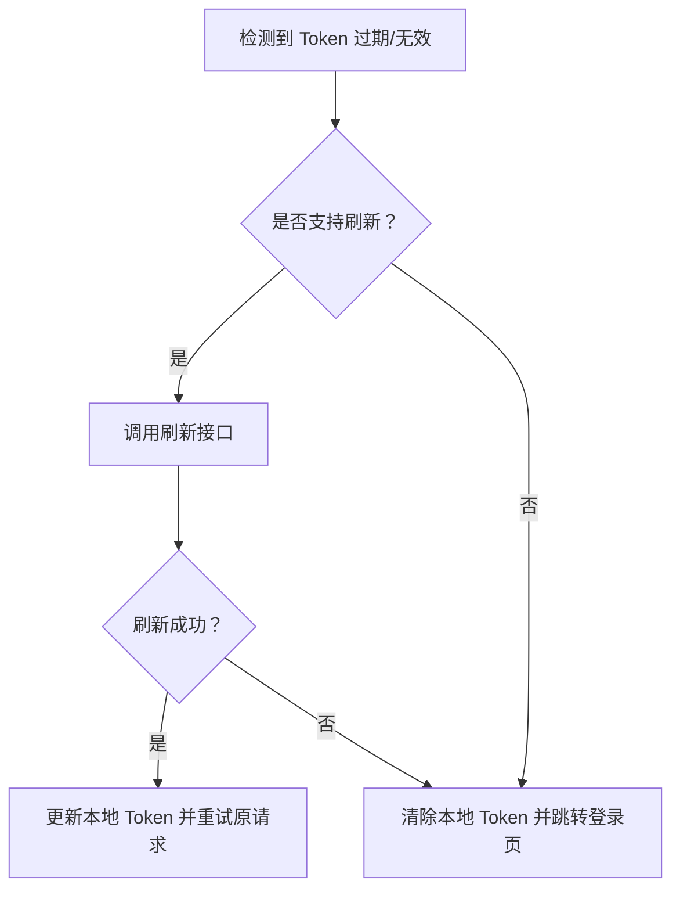
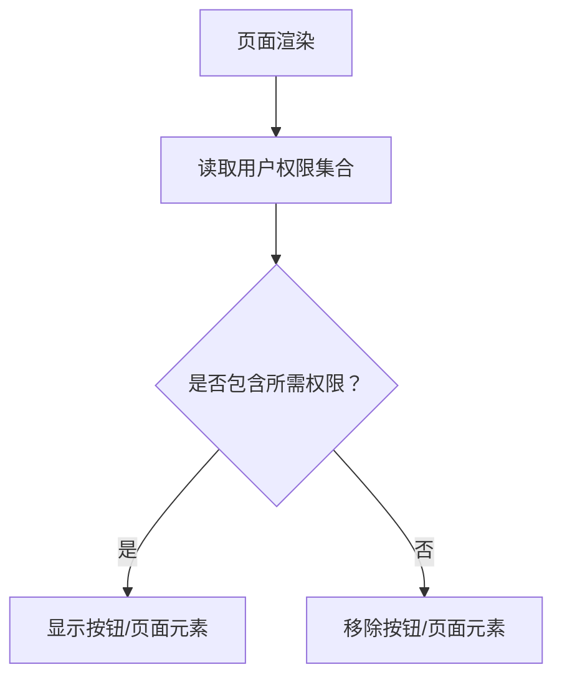
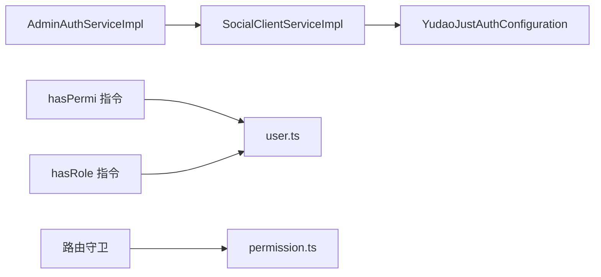

# 认证机制

<cite>
**本文引用的文件**
- [yudao-module-system/src/main/java/cn/iocoder/yudao/module/system/service/auth/AdminAuthService.java](file://yudao-module-system/src/main/java/cn/iocoder/yudao/module/system/service/auth/AdminAuthService.java)
- [yudao-module-system/src/main/java/cn/iocoder/yudao/module/system/service/auth/AdminAuthServiceImpl.java](file://yudao-module-system/src/main/java/cn/iocoder/yudao/module/system/service/auth/AdminAuthServiceImpl.java)
- [yudao-module-system/src/main/java/cn/iocoder/yudao/module/system/controller/admin/auth/vo/AuthLoginReqVO.java](file://yudao-module-system/src/main/java/cn/iocoder/yudao/module/system/controller/admin/auth/vo/AuthLoginReqVO.java)
- [yudao-module-system/src/main/java/cn/iocoder/yudao/module/system/controller/admin/auth/vo/AuthSmsLoginReqVO.java](file://yudao-module-system/src/main/java/cn/iocoder/yudao/module/system/controller/admin/auth/vo/AuthSmsLoginReqVO.java)
- [yudao-module-system/src/main/java/cn/iocoder/yudao/module/system/controller/admin/auth/vo/AuthSocialLoginReqVO.java](file://yudao-module-system/src/main/java/cn/iocoder/yudao/module/system/controller/admin/auth/vo/AuthSocialLoginReqVO.java)
- [yudao-module-system/src/main/java/cn/iocoder/yudao/module/system/controller/admin/auth/vo/AuthLoginRespVO.java](file://yudao-module-system/src/main/java/cn/iocoder/yudao/module/system/controller/admin/auth/vo/AuthLoginRespVO.java)
- [yudao-module-system/src/main/java/cn/iocoder/yudao/module/system/service/social/SocialClientServiceImpl.java](file://yudao-module-system/src/main/java/cn/iocoder/yudao/module/system/service/social/SocialClientServiceImpl.java)
- [yudao-module-system/src/main/java/cn/iocoder/yudao/module/system/service/social/SocialUserServiceImpl.java](file://yudao-module-system/src/main/java/cn/iocoder/yudao/module/system/service/social/SocialUserServiceImpl.java)
- [yudao-module-system/src/main/java/cn/iocoder/yudao/module/system/framework/justauth/config/YudaoJustAuthConfiguration.java](file://yudao-module-system/src/main/java/cn/iocoder/yudao/module/system/framework/justauth/config/YudaoJustAuthConfiguration.java)
- [yudao-module-system/src/main/java/cn/iocoder/yudao/module/system/enums/sms/SmsSceneEnum.java](file://yudao-module-system/src/main/java/cn/iocoder/yudao/module/system/enums/sms/SmsSceneEnum.java)
- [yudao-module-system/src/test/java/cn/iocoder/yudao/module/system/service/auth/AdminAuthServiceImplTest.java](file://yudao-module-system/src/test/java/cn/iocoder/yudao/module/system/service/auth/AdminAuthServiceImplTest.java)
- [yudao-module-system/src/test/java/cn/iocoder/yudao/module/system/service/auth/AdminAuthServiceImplTest.java](file://yudao-module-system/src/test/java/cn/iocoder/yudao/module/system/service/auth/AdminAuthServiceImplTest.java)
- [yudao-ui/yudao-ui-admin-vue3/src/utils/auth.ts](file://yudao-ui/yudao-ui-admin-vue3/src/utils/auth.ts)
- [yudao-ui/yudao-ui-admin-vue3/src/permission.ts](file://yudao-ui/yudao-ui-admin-vue3/src/permission.ts)
- [yudao-ui/yudao-ui-admin-vue3/src/store/modules/permission.ts](file://yudao-ui/yudao-ui-admin-vue3/src/store/modules/permission.ts)
- [yudao-ui/yudao-ui-admin-vue3/src/store/modules/user.ts](file://yudao-ui/yudao-ui-admin-vue3/src/store/modules/user.ts)
- [yudao-ui/yudao-ui-admin-vue3/src/directives/permission/hasPermi.ts](file://yudao-ui/yudao-ui-admin-vue3/src/directives/permission/hasPermi.ts)
- [yudao-ui/yudao-ui-admin-vue3/src/directives/permission/hasRole.ts](file://yudao-ui/yudao-ui-admin-vue3/src/directives/permission/hasRole.ts)
- [yudao-ui/yudao-ui-admin-vue3/src/utils/permission.ts](file://yudao-ui/yudao-ui-admin-vue3/src/utils/permission.ts)
- [yudao-module-system/src/main/java/cn/iocoder/yudao/module/system/api/permission/PermissionApi.java](file://yudao-module-system/src/main/java/cn/iocoder/yudao/module/system/api/permission/PermissionApi.java)
</cite>

## 目录
1. [简介](#简介)
2. [项目结构](#项目结构)
3. [核心组件](#核心组件)
4. [架构总览](#架构总览)
5. [详细组件分析](#详细组件分析)
6. [依赖关系分析](#依赖关系分析)
7. [性能考量](#性能考量)
8. [故障排查指南](#故障排查指南)
9. [结论](#结论)
10. [附录](#附录)

## 简介
本文件系统性梳理“芋道 ruoyi-vue-pro”项目的认证与权限体系，覆盖后端认证服务、前端路由与页面权限控制、多种登录方式（账号密码、手机验证码、第三方社交登录）、Token 管理与自动刷新、会话与安全策略（过期与强制下线）、以及权限校验（按钮级与页面级）。文档以代码为依据，配合图示帮助读者快速理解并落地实践。

## 项目结构
认证与权限相关的关键位置如下：
- 后端模块：yudao-module-system 的认证与社交登录服务、JustAuth 配置、权限 API
- 前端模块：yudao-ui-admin-vue3 的 Token 工具、路由守卫、权限仓库与指令

图表来源
- [yudao-module-system/src/main/java/cn/iocoder/yudao/module/system/service/auth/AdminAuthService.java:1-63](file://yudao-module-system/src/main/java/cn/iocoder/yudao/module/system/service/auth/AdminAuthService.java#L1-L63)
- [yudao-module-system/src/main/java/cn/iocoder/yudao/module/system/service/auth/AdminAuthServiceImpl.java:137-150](file://yudao-module-system/src/main/java/cn/iocoder/yudao/module/system/service/auth/AdminAuthServiceImpl.java#L137-L150)
- [yudao-module-system/src/main/java/cn/iocoder/yudao/module/system/service/social/SocialClientServiceImpl.java:178-215](file://yudao-module-system/src/main/java/cn/iocoder/yudao/module/system/service/social/SocialClientServiceImpl.java#L178-L215)
- [yudao-module-system/src/main/java/cn/iocoder/yudao/module/system/framework/justauth/config/YudaoJustAuthConfiguration.java:1-39](file://yudao-module-system/src/main/java/cn/iocoder/yudao/module/system/framework/justauth/config/YudaoJustAuthConfiguration.java#L1-L39)
- [yudao-module-system/src/main/java/cn/iocoder/yudao/module/system/api/permission/PermissionApi.java:1-23](file://yudao-module-system/src/main/java/cn/iocoder/yudao/module/system/api/permission/PermissionApi.java#L1-L23)
- [yudao-ui/yudao-ui-admin-vue3/src/utils/auth.ts](file://yudao-ui/yudao-ui-admin-vue3/src/utils/auth.ts)
- [yudao-ui/yudao-ui-admin-vue3/src/directives/permission/hasPermi.ts:1-31](file://yudao-ui/yudao-ui-admin-vue3/src/directives/permission/hasPermi.ts#L1-L31)
- [yudao-ui/yudao-ui-admin-vue3/src/directives/permission/hasRole.ts:1-28](file://yudao-ui/yudao-ui-admin-vue3/src/directives/permission/hasRole.ts#L1-L28)
- [yudao-ui/yudao-ui-admin-vue3/src/store/modules/permission.ts:1-79](file://yudao-ui/yudao-ui-admin-vue3/src/store/modules/permission.ts#L1-L79)
- [yudao-ui/yudao-ui-admin-vue3/src/store/modules/user.ts](file://yudao-ui/yudao-ui-admin-vue3/src/store/modules/user.ts)
- [yudao-ui/yudao-ui-admin-vue3/src/permission.ts](file://yudao-ui/yudao-ui-admin-vue3/src/permission.ts)

章节来源
- [yudao-module-system/src/main/java/cn/iocoder/yudao/module/system/service/auth/AdminAuthService.java:1-63](file://yudao-module-system/src/main/java/cn/iocoder/yudao/module/system/service/auth/AdminAuthService.java#L1-L63)
- [yudao-ui/yudao-ui-admin-vue3/src/utils/auth.ts](file://yudao-ui/yudao-ui-admin-vue3/src/utils/auth.ts)
- [yudao-ui/yudao-ui-admin-vue3/src/store/modules/permission.ts:1-79](file://yudao-ui/yudao-ui-admin-vue3/src/store/modules/permission.ts#L1-L79)

## 核心组件
- 后端认证服务接口与实现：负责账号密码登录、短信验证码登录、社交登录、Token 刷新与登出
- 前端 Token 工具与路由守卫：负责 Token 存取、刷新、路由拦截与页面权限渲染
- 权限指令与权限仓库：负责按钮级与页面级权限控制
- 社交登录与 JustAuth 集成：负责第三方授权码换取用户信息与配置缓存

章节来源
- [yudao-module-system/src/main/java/cn/iocoder/yudao/module/system/service/auth/AdminAuthService.java:1-63](file://yudao-module-system/src/main/java/cn/iocoder/yudao/module/system/service/auth/AdminAuthService.java#L1-L63)
- [yudao-module-system/src/main/java/cn/iocoder/yudao/module/system/service/auth/AdminAuthServiceImpl.java:137-150](file://yudao-module-system/src/main/java/cn/iocoder/yudao/module/system/service/auth/AdminAuthServiceImpl.java#L137-L150)
- [yudao-ui/yudao-ui-admin-vue3/src/utils/auth.ts](file://yudao-ui/yudao-ui-admin-vue3/src/utils/auth.ts)
- [yudao-ui/yudao-ui-admin-vue3/src/store/modules/permission.ts:1-79](file://yudao-ui/yudao-ui-admin-vue3/src/store/modules/permission.ts#L1-L79)
- [yudao-ui/yudao-ui-admin-vue3/src/directives/permission/hasPermi.ts:1-31](file://yudao-ui/yudao-ui-admin-vue3/src/directives/permission/hasPermi.ts#L1-L31)
- [yudao-ui/yudao-ui-admin-vue3/src/directives/permission/hasRole.ts:1-28](file://yudao-ui/yudao-ui-admin-vue3/src/directives/permission/hasRole.ts#L1-L28)

## 架构总览
整体认证流程由“前端发起登录 → 后端认证与签发 Token → 前端存储与携带 Token → 后端鉴权 → 前端路由与权限控制”构成。

图表来源
- [yudao-ui/yudao-ui-admin-vue3/src/permission.ts](file://yudao-ui/yudao-ui-admin-vue3/src/permission.ts)
- [yudao-ui/yudao-ui-admin-vue3/src/store/modules/user.ts](file://yudao-ui/yudao-ui-admin-vue3/src/store/modules/user.ts)
- [yudao-ui/yudao-ui-admin-vue3/src/store/modules/permission.ts:1-79](file://yudao-ui/yudao-ui-admin-vue3/src/store/modules/permission.ts#L1-L79)
- [yudao-ui/yudao-ui-admin-vue3/src/directives/permission/hasPermi.ts:1-31](file://yudao-ui/yudao-ui-admin-vue3/src/directives/permission/hasPermi.ts#L1-L31)
- [yudao-module-system/src/main/java/cn/iocoder/yudao/module/system/service/auth/AdminAuthServiceImpl.java:212-226](file://yudao-module-system/src/main/java/cn/iocoder/yudao/module/system/service/auth/AdminAuthServiceImpl.java#L212-L226)

## 详细组件分析

### 后端认证服务：登录、刷新与登出
- 支持三种登录方式：
  - 账号密码登录：校验用户名与密码，创建访问令牌
  - 手机验证码登录：校验短信验证码，按手机号匹配用户并创建访问令牌
  - 社交登录：通过 JustAuth 获取授权用户信息，完成绑定或创建用户后创建访问令牌
- Token 刷新：基于刷新令牌刷新访问令牌
- 登出：删除访问令牌并记录登出日志

图表来源
- [yudao-module-system/src/main/java/cn/iocoder/yudao/module/system/service/auth/AdminAuthService.java:1-63](file://yudao-module-system/src/main/java/cn/iocoder/yudao/module/system/service/auth/AdminAuthService.java#L1-L63)
- [yudao-module-system/src/main/java/cn/iocoder/yudao/module/system/service/auth/AdminAuthServiceImpl.java:137-150](file://yudao-module-system/src/main/java/cn/iocoder/yudao/module/system/service/auth/AdminAuthServiceImpl.java#L137-L150)
- [yudao-module-system/src/main/java/cn/iocoder/yudao/module/system/service/social/SocialClientServiceImpl.java:178-215](file://yudao-module-system/src/main/java/cn/iocoder/yudao/module/system/service/social/SocialClientServiceImpl.java#L178-L215)
- [yudao-module-system/src/main/java/cn/iocoder/yudao/module/system/service/social/SocialUserServiceImpl.java:109-174](file://yudao-module-system/src/main/java/cn/iocoder/yudao/module/system/service/social/SocialUserServiceImpl.java#L109-L174)

章节来源
- [yudao-module-system/src/main/java/cn/iocoder/yudao/module/system/service/auth/AdminAuthService.java:1-63](file://yudao-module-system/src/main/java/cn/iocoder/yudao/module/system/service/auth/AdminAuthService.java#L1-L63)
- [yudao-module-system/src/main/java/cn/iocoder/yudao/module/system/service/auth/AdminAuthServiceImpl.java:137-150](file://yudao-module-system/src/main/java/cn/iocoder/yudao/module/system/service/auth/AdminAuthServiceImpl.java#L137-L150)
- [yudao-module-system/src/main/java/cn/iocoder/yudao/module/system/service/auth/AdminAuthServiceImpl.java:212-226](file://yudao-module-system/src/main/java/cn/iocoder/yudao/module/system/service/auth/AdminAuthServiceImpl.java#L212-L226)
- [yudao-module-system/src/main/java/cn/iocoder/yudao/module/system/service/auth/AdminAuthServiceImpl.java:228-237](file://yudao-module-system/src/main/java/cn/iocoder/yudao/module/system/service/auth/AdminAuthServiceImpl.java#L228-L237)

### 前端 Token 管理与自动刷新
- Token 存储：前端使用本地缓存保存访问令牌与用户信息
- 自动刷新：在请求前检查 Token 是否即将过期，必要时触发刷新逻辑
- 登录后持久化：登录成功后写入用户信息与权限集合，供路由与指令使用

图表来源
- [yudao-ui/yudao-ui-admin-vue3/src/utils/auth.ts](file://yudao-ui/yudao-ui-admin-vue3/src/utils/auth.ts)
- [yudao-module-system/src/main/java/cn/iocoder/yudao/module/system/service/auth/AdminAuthServiceImpl.java:222-226](file://yudao-module-system/src/main/java/cn/iocoder/yudao/module/system/service/auth/AdminAuthServiceImpl.java#L222-L226)

章节来源
- [yudao-ui/yudao-ui-admin-vue3/src/utils/auth.ts](file://yudao-ui/yudao-ui-admin-vue3/src/utils/auth.ts)
- [yudao-module-system/src/main/java/cn/iocoder/yudao/module/system/service/auth/AdminAuthServiceImpl.java:222-226](file://yudao-module-system/src/main/java/cn/iocoder/yudao/module/system/service/auth/AdminAuthServiceImpl.java#L222-L226)

### 登录状态检查：路由守卫与页面权限控制
- 路由守卫：在进入受保护路由前，读取 Token 与用户信息，决定放行或重定向
- 页面权限：
  - 按钮级：通过 v-hasPermi 指令判断当前用户是否具备某权限字符串
  - 角色级：通过 v-hasRole 指令判断当前用户是否属于某角色集合
- 动态路由：根据用户角色生成可访问菜单与路由，避免无权限访问

图表来源
- [yudao-ui/yudao-ui-admin-vue3/src/permission.ts](file://yudao-ui/yudao-ui-admin-vue3/src/permission.ts)
- [yudao-ui/yudao-ui-admin-vue3/src/store/modules/permission.ts:1-79](file://yudao-ui/yudao-ui-admin-vue3/src/store/modules/permission.ts#L1-L79)
- [yudao-ui/yudao-ui-admin-vue3/src/directives/permission/hasPermi.ts:1-31](file://yudao-ui/yudao-ui-admin-vue3/src/directives/permission/hasPermi.ts#L1-L31)
- [yudao-ui/yudao-ui-admin-vue3/src/directives/permission/hasRole.ts:1-28](file://yudao-ui/yudao-ui-admin-vue3/src/directives/permission/hasRole.ts#L1-L28)

章节来源
- [yudao-ui/yudao-ui-admin-vue3/src/permission.ts](file://yudao-ui/yudao-ui-admin-vue3/src/permission.ts)
- [yudao-ui/yudao-ui-admin-vue3/src/store/modules/permission.ts:1-79](file://yudao-ui/yudao-ui-admin-vue3/src/store/modules/permission.ts#L1-L79)
- [yudao-ui/yudao-ui-admin-vue3/src/directives/permission/hasPermi.ts:1-31](file://yudao-ui/yudao-ui-admin-vue3/src/directives/permission/hasPermi.ts#L1-L31)
- [yudao-ui/yudao-ui-admin-vue3/src/directives/permission/hasRole.ts:1-28](file://yudao-ui/yudao-ui-admin-vue3/src/directives/permission/hasRole.ts#L1-L28)

### 多种认证方式支持
- 账号密码登录：输入用户名与密码，后端校验并通过后签发访问令牌
- 手机验证码登录：输入手机号与短信验证码，后端校验并通过后签发访问令牌
- 第三方社交登录：通过 JustAuth 获取授权码，换取第三方用户信息，完成绑定或创建用户后签发访问令牌

图表来源
- [yudao-module-system/src/main/java/cn/iocoder/yudao/module/system/service/auth/AdminAuthServiceImpl.java:137-150](file://yudao-module-system/src/main/java/cn/iocoder/yudao/module/system/service/auth/AdminAuthServiceImpl.java#L137-L150)
- [yudao-module-system/src/main/java/cn/iocoder/yudao/module/system/service/auth/AdminAuthServiceImpl.java:180-188](file://yudao-module-system/src/main/java/cn/iocoder/yudao/module/system/service/auth/AdminAuthServiceImpl.java#L180-L188)
- [yudao-module-system/src/main/java/cn/iocoder/yudao/module/system/service/social/SocialClientServiceImpl.java:178-215](file://yudao-module-system/src/main/java/cn/iocoder/yudao/module/system/service/social/SocialClientServiceImpl.java#L178-L215)
- [yudao-module-system/src/main/java/cn/iocoder/yudao/module/system/enums/sms/SmsSceneEnum.java:17-26](file://yudao-module-system/src/main/java/cn/iocoder/yudao/module/system/enums/sms/SmsSceneEnum.java#L17-L26)

章节来源
- [yudao-module-system/src/main/java/cn/iocoder/yudao/module/system/service/auth/AdminAuthServiceImpl.java:137-150](file://yudao-module-system/src/main/java/cn/iocoder/yudao/module/system/service/auth/AdminAuthServiceImpl.java#L137-L150)
- [yudao-module-system/src/main/java/cn/iocoder/yudao/module/system/service/auth/AdminAuthServiceImpl.java:180-188](file://yudao-module-system/src/main/java/cn/iocoder/yudao/module/system/service/auth/AdminAuthServiceImpl.java#L180-L188)
- [yudao-module-system/src/main/java/cn/iocoder/yudao/module/system/service/social/SocialClientServiceImpl.java:178-215](file://yudao-module-system/src/main/java/cn/iocoder/yudao/module/system/service/social/SocialClientServiceImpl.java#L178-L215)
- [yudao-module-system/src/main/java/cn/iocoder/yudao/module/system/enums/sms/SmsSceneEnum.java:17-26](file://yudao-module-system/src/main/java/cn/iocoder/yudao/module/system/enums/sms/SmsSceneEnum.java#L17-L26)

### 会话管理与安全策略
- Token 过期处理：前端在请求前检查 Token 有效期，若接近过期则尝试刷新；若无法刷新则引导登录
- 强制下线机制：后端登出时删除访问令牌并记录登出日志，前端收到登出信号后清理本地状态并跳转登录

图表来源
- [yudao-module-system/src/main/java/cn/iocoder/yudao/module/system/service/auth/AdminAuthServiceImpl.java:222-226](file://yudao-module-system/src/main/java/cn/iocoder/yudao/module/system/service/auth/AdminAuthServiceImpl.java#L222-L226)
- [yudao-module-system/src/main/java/cn/iocoder/yudao/module/system/service/auth/AdminAuthServiceImpl.java:228-237](file://yudao-module-system/src/main/java/cn/iocoder/yudao/module/system/service/auth/AdminAuthServiceImpl.java#L228-L237)
- [yudao-ui/yudao-ui-admin-vue3/src/utils/auth.ts](file://yudao-ui/yudao-ui-admin-vue3/src/utils/auth.ts)

章节来源
- [yudao-module-system/src/main/java/cn/iocoder/yudao/module/system/service/auth/AdminAuthServiceImpl.java:222-226](file://yudao-module-system/src/main/java/cn/iocoder/yudao/module/system/service/auth/AdminAuthServiceImpl.java#L222-L226)
- [yudao-module-system/src/main/java/cn/iocoder/yudao/module/system/service/auth/AdminAuthServiceImpl.java:228-237](file://yudao-module-system/src/main/java/cn/iocoder/yudao/module/system/service/auth/AdminAuthServiceImpl.java#L228-L237)
- [yudao-ui/yudao-ui-admin-vue3/src/utils/auth.ts](file://yudao-ui/yudao-ui-admin-vue3/src/utils/auth.ts)

### 权限验证：按钮级与页面级控制
- 按钮级权限：v-hasPermi 指令根据用户权限集合判断是否显示按钮
- 角色级权限：v-hasRole 指令根据用户角色集合判断是否显示元素
- 页面级权限：路由守卫与权限仓库结合，仅渲染用户具备访问权限的菜单与路由

图表来源
- [yudao-ui/yudao-ui-admin-vue3/src/directives/permission/hasPermi.ts:24-31](file://yudao-ui/yudao-ui-admin-vue3/src/directives/permission/hasPermi.ts#L24-L31)
- [yudao-ui/yudao-ui-admin-vue3/src/directives/permission/hasRole.ts:6-27](file://yudao-ui/yudao-ui-admin-vue3/src/directives/permission/hasRole.ts#L6-L27)
- [yudao-ui/yudao-ui-admin-vue3/src/store/modules/permission.ts:38-66](file://yudao-ui/yudao-ui-admin-vue3/src/store/modules/permission.ts#L38-L66)

章节来源
- [yudao-ui/yudao-ui-admin-vue3/src/directives/permission/hasPermi.ts:1-31](file://yudao-ui/yudao-ui-admin-vue3/src/directives/permission/hasPermi.ts#L1-L31)
- [yudao-ui/yudao-ui-admin-vue3/src/directives/permission/hasRole.ts:1-28](file://yudao-ui/yudao-ui-admin-vue3/src/directives/permission/hasRole.ts#L1-L28)
- [yudao-ui/yudao-ui-admin-vue3/src/store/modules/permission.ts:1-79](file://yudao-ui/yudao-ui-admin-vue3/src/store/modules/permission.ts#L1-L79)

## 依赖关系分析
- 认证服务依赖社交登录服务与 JustAuth 配置，用于第三方登录
- 前端权限指令依赖用户仓库中的权限集合
- 路由守卫依赖用户与权限仓库，确保仅放行具备权限的路由

图表来源
- [yudao-module-system/src/main/java/cn/iocoder/yudao/module/system/service/auth/AdminAuthServiceImpl.java:137-150](file://yudao-module-system/src/main/java/cn/iocoder/yudao/module/system/service/auth/AdminAuthServiceImpl.java#L137-L150)
- [yudao-module-system/src/main/java/cn/iocoder/yudao/module/system/service/social/SocialClientServiceImpl.java:178-215](file://yudao-module-system/src/main/java/cn/iocoder/yudao/module/system/service/social/SocialClientServiceImpl.java#L178-L215)
- [yudao-module-system/src/main/java/cn/iocoder/yudao/module/system/framework/justauth/config/YudaoJustAuthConfiguration.java:1-39](file://yudao-module-system/src/main/java/cn/iocoder/yudao/module/system/framework/justauth/config/YudaoJustAuthConfiguration.java#L1-L39)
- [yudao-ui/yudao-ui-admin-vue3/src/directives/permission/hasPermi.ts:1-31](file://yudao-ui/yudao-ui-admin-vue3/src/directives/permission/hasPermi.ts#L1-L31)
- [yudao-ui/yudao-ui-admin-vue3/src/directives/permission/hasRole.ts:1-28](file://yudao-ui/yudao-ui-admin-vue3/src/directives/permission/hasRole.ts#L1-L28)
- [yudao-ui/yudao-ui-admin-vue3/src/permission.ts](file://yudao-ui/yudao-ui-admin-vue3/src/permission.ts)

章节来源
- [yudao-module-system/src/main/java/cn/iocoder/yudao/module/system/service/auth/AdminAuthServiceImpl.java:137-150](file://yudao-module-system/src/main/java/cn/iocoder/yudao/module/system/service/auth/AdminAuthServiceImpl.java#L137-L150)
- [yudao-module-system/src/main/java/cn/iocoder/yudao/module/system/service/social/SocialClientServiceImpl.java:178-215](file://yudao-module-system/src/main/java/cn/iocoder/yudao/module/system/service/social/SocialClientServiceImpl.java#L178-L215)
- [yudao-module-system/src/main/java/cn/iocoder/yudao/module/system/framework/justauth/config/YudaoJustAuthConfiguration.java:1-39](file://yudao-module-system/src/main/java/cn/iocoder/yudao/module/system/framework/justauth/config/YudaoJustAuthConfiguration.java#L1-L39)
- [yudao-ui/yudao-ui-admin-vue3/src/directives/permission/hasPermi.ts:1-31](file://yudao-ui/yudao-ui-admin-vue3/src/directives/permission/hasPermi.ts#L1-L31)
- [yudao-ui/yudao-ui-admin-vue3/src/directives/permission/hasRole.ts:1-28](file://yudao-ui/yudao-ui-admin-vue3/src/directives/permission/hasRole.ts#L1-L28)
- [yudao-ui/yudao-ui-admin-vue3/src/permission.ts](file://yudao-ui/yudao-ui-admin-vue3/src/permission.ts)

## 性能考量
- Token 刷新策略：避免频繁刷新，建议在请求前统一检查有效期并在临界窗口内刷新
- 前端权限缓存：将用户权限与角色集合缓存于内存或持久化存储，减少重复拉取
- 路由动态生成：仅在登录后生成一次动态路由，避免重复计算
- 社交登录：第三方授权码仅使用一次，需在服务端妥善保存与复用，降低网络往返

## 故障排查指南
- 登录失败
  - 账号密码：检查用户名是否存在、密码是否匹配、是否被禁用
  - 短信验证码：确认验证码是否正确、是否过期、是否与手机号匹配
  - 社交登录：确认授权码是否有效、第三方平台返回是否成功
- Token 过期或无效
  - 前端：检查本地 Token 是否存在、是否接近过期；尝试刷新
  - 后端：确认访问令牌是否被删除、是否已登出
- 权限不足
  - 检查用户权限集合与角色集合是否正确下发
  - 确认指令使用方式与权限字符串是否一致

章节来源
- [yudao-module-system/src/test/java/cn/iocoder/yudao/module/system/service/auth/AdminAuthServiceImplTest.java:204-235](file://yudao-module-system/src/test/java/cn/iocoder/yudao/module/system/service/auth/AdminAuthServiceImplTest.java#L204-L235)
- [yudao-module-system/src/test/java/cn/iocoder/yudao/module/system/service/auth/AdminAuthServiceImplTest.java:127-154](file://yudao-module-system/src/test/java/cn/iocoder/yudao/module/system/service/auth/AdminAuthServiceImplTest.java#L127-L154)
- [yudao-ui/yudao-ui-admin-vue3/src/directives/permission/hasPermi.ts:1-31](file://yudao-ui/yudao-ui-admin-vue3/src/directives/permission/hasPermi.ts#L1-L31)
- [yudao-ui/yudao-ui-admin-vue3/src/directives/permission/hasRole.ts:1-28](file://yudao-ui/yudao-ui-admin-vue3/src/directives/permission/hasRole.ts#L1-L28)

## 结论
本项目采用“后端认证 + 前端路由与指令控制”的双层保障机制，覆盖多种登录方式、完善的 Token 生命周期管理、动态路由与细粒度权限控制。通过统一的认证服务与权限 API，前后端职责清晰、协作高效，能够满足企业级系统的安全与可用性要求。

## 附录
- 关键 VO 类型（用于登录请求与响应）
  - 账号密码登录请求与响应：AuthLoginReqVO、AuthLoginRespVO
  - 短信登录请求：AuthSmsLoginReqVO
  - 社交登录请求：AuthSocialLoginReqVO
- 短信场景枚举：SmsSceneEnum（含后台用户短信登录场景）

章节来源
- [yudao-module-system/src/main/java/cn/iocoder/yudao/module/system/controller/admin/auth/vo/AuthLoginReqVO.java](file://yudao-module-system/src/main/java/cn/iocoder/yudao/module/system/controller/admin/auth/vo/AuthLoginReqVO.java)
- [yudao-module-system/src/main/java/cn/iocoder/yudao/module/system/controller/admin/auth/vo/AuthLoginRespVO.java](file://yudao-module-system/src/main/java/cn/iocoder/yudao/module/system/controller/admin/auth/vo/AuthLoginRespVO.java)
- [yudao-module-system/src/main/java/cn/iocoder/yudao/module/system/controller/admin/auth/vo/AuthSmsLoginReqVO.java](file://yudao-module-system/src/main/java/cn/iocoder/yudao/module/system/controller/admin/auth/vo/AuthSmsLoginReqVO.java)
- [yudao-module-system/src/main/java/cn/iocoder/yudao/module/system/controller/admin/auth/vo/AuthSocialLoginReqVO.java](file://yudao-module-system/src/main/java/cn/iocoder/yudao/module/system/controller/admin/auth/vo/AuthSocialLoginReqVO.java)
- [yudao-module-system/src/main/java/cn/iocoder/yudao/module/system/enums/sms/SmsSceneEnum.java:17-26](file://yudao-module-system/src/main/java/cn/iocoder/yudao/module/system/enums/sms/SmsSceneEnum.java#L17-L26)