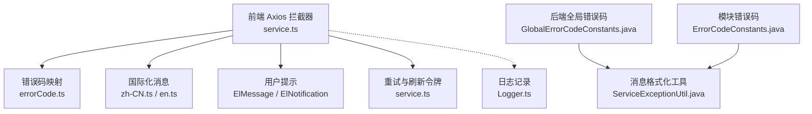
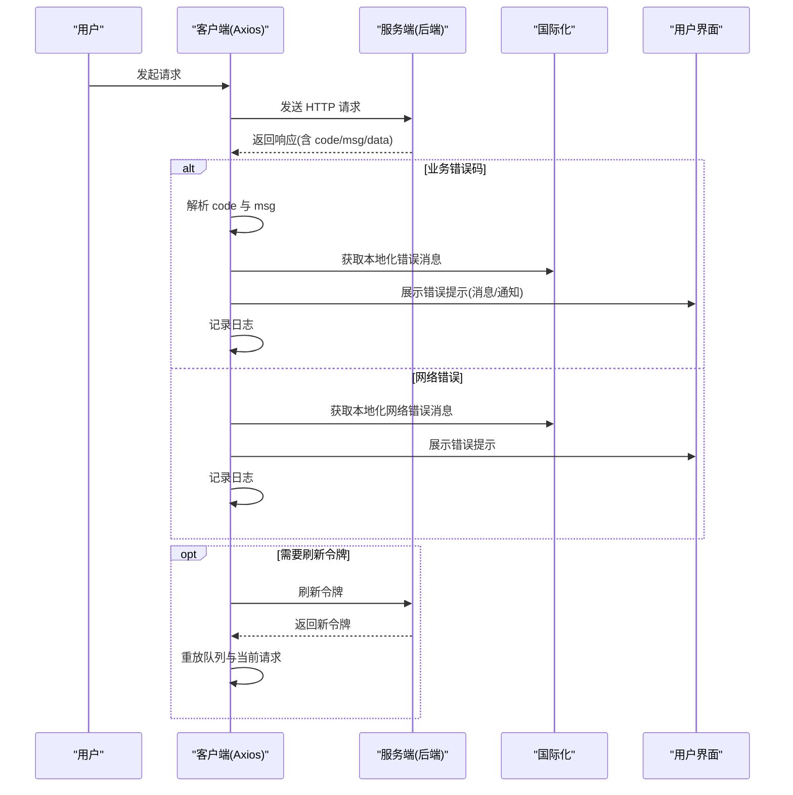
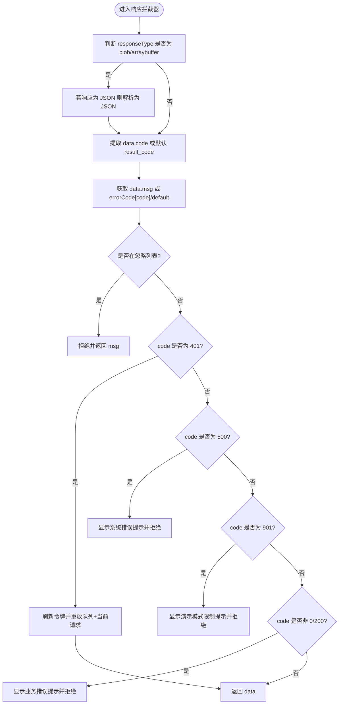
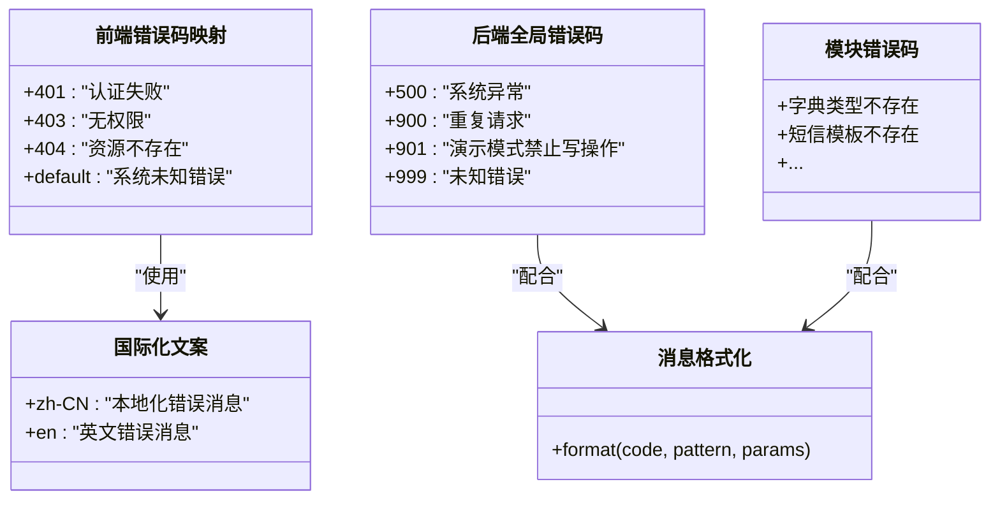
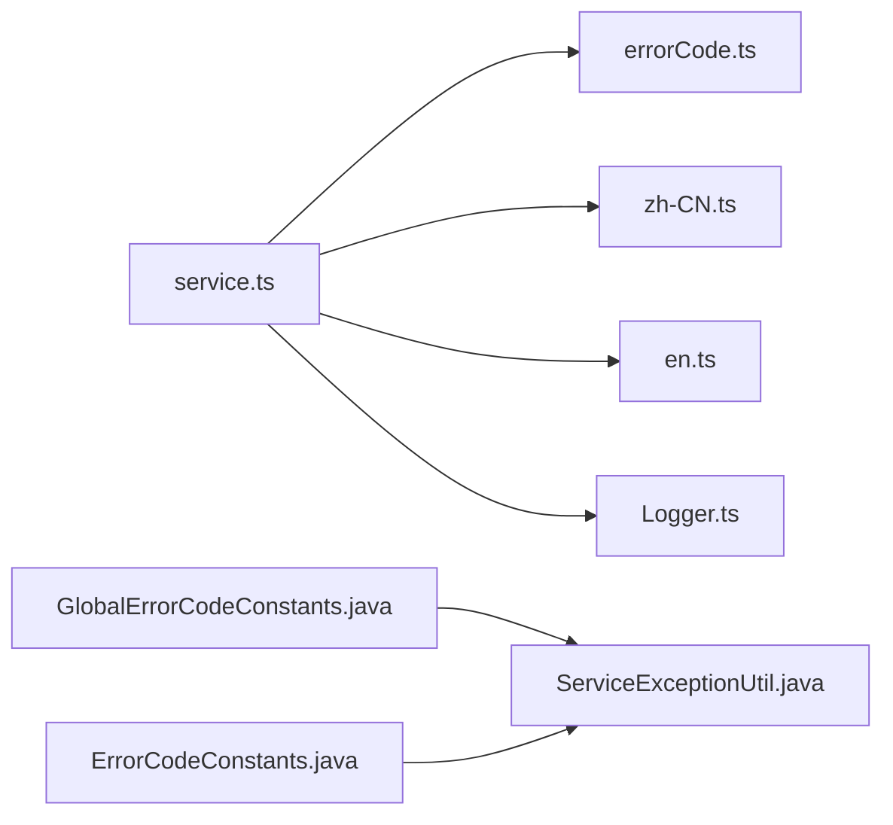

# 错误处理

<cite>
**本文引用的文件**
- [service.ts](file://yudao-ui/yudao-ui-admin-vue3/src/config/axios/service.ts)
- [errorCode.ts](file://yudao-ui/yudao-ui-admin-vue3/src/config/axios/errorCode.ts)
- [zh-CN.ts](file://yudao-ui/yudao-ui-admin-vue3/src/locales/zh-CN.ts)
- [en.ts](file://yudao-ui/yudao-ui-admin-vue3/src/locales/en.ts)
- [GlobalErrorCodeConstants.java](file://yudao-framework/yudao-common/src/main/java/cn/iocoder/yudao/framework/common/exception/enums/GlobalErrorCodeConstants.java)
- [ServiceExceptionUtil.java](file://yudao-framework/yudao-common/src/main/java/cn/iocoder/yudao/framework/common/exception/util/ServiceExceptionUtil.java)
- [ErrorCodeConstants.java](file://yudao-module-system/src/main/java/cn/iocoder/yudao/module/system/enums/ErrorCodeConstants.java)
- [Logger.ts](file://yudao-ui/yudao-ui-admin-vue3/src/utils/Logger.ts)
</cite>

## 目录
1. [简介](#简介)
2. [项目结构](#项目结构)
3. [核心组件](#核心组件)
4. [架构总览](#架构总览)
5. [详细组件分析](#详细组件分析)
6. [依赖关系分析](#依赖关系分析)
7. [性能考虑](#性能考虑)
8. [故障排查指南](#故障排查指南)
9. [结论](#结论)
10. [附录](#附录)

## 简介
本文件面向芋道 ruoyi-vue-pro 的前端与后端错误处理体系，系统性阐述错误分类与处理策略，覆盖网络错误、业务错误与系统错误；详解全局错误拦截器的实现（错误信息提取、用户提示与日志记录）；介绍错误码映射机制（含国际化错误消息与自定义处理逻辑）；给出用户友好的错误提示设计（Toast 提示、弹窗提醒与表单错误高亮）；并提供错误恢复与重试机制、错误上报与监控集成建议及常见场景的最佳实践。

## 项目结构
ruoyi-vue-pro 的错误处理由前后端协同完成：
- 前端通过 Axios 拦截器统一处理网络层错误与业务错误码映射，结合 Element Plus 提示组件与国际化消息实现用户可见的错误反馈。
- 后端通过统一的错误码枚举与消息格式化工具，确保错误语义标准化与可维护性。
- 国际化层提供多语言错误文案，提升用户体验。

图表来源
- [service.ts:109-239](file://yudao-ui/yudao-ui-admin-vue3/src/config/axios/service.ts#L109-L239)
- [errorCode.ts:1-6](file://yudao-ui/yudao-ui-admin-vue3/src/config/axios/errorCode.ts#L1-L6)
- [zh-CN.ts](file://yudao-ui/yudao-ui-admin-vue3/src/locales/zh-CN.ts)
- [en.ts](file://yudao-ui/yudao-ui-admin-vue3/src/locales/en.ts)
- [GlobalErrorCodeConstants.java:29-41](file://yudao-framework/yudao-common/src/main/java/cn/iocoder/yudao/framework/common/exception/enums/GlobalErrorCodeConstants.java#L29-L41)
- [ServiceExceptionUtil.java:38-77](file://yudao-framework/yudao-common/src/main/java/cn/iocoder/yudao/framework/common/exception/util/ServiceExceptionUtil.java#L38-L77)
- [ErrorCodeConstants.java:65-91](file://yudao-module-system/src/main/java/cn/iocoder/yudao/module/system/enums/ErrorCodeConstants.java#L65-L91)
- [Logger.ts](file://yudao-ui/yudao-ui-admin-vue3/src/utils/Logger.ts)

章节来源
- [service.ts:109-239](file://yudao-ui/yudao-ui-admin-vue3/src/config/axios/service.ts#L109-L239)
- [errorCode.ts:1-6](file://yudao-ui/yudao-ui-admin-vue3/src/config/axios/errorCode.ts#L1-L6)
- [GlobalErrorCodeConstants.java:29-41](file://yudao-framework/yudao-common/src/main/java/cn/iocoder/yudao/framework/common/exception/enums/GlobalErrorCodeConstants.java#L29-L41)
- [ServiceExceptionUtil.java:38-77](file://yudao-framework/yudao-common/src/main/java/cn/iocoder/yudao/framework/common/exception/util/ServiceExceptionUtil.java#L38-L77)
- [ErrorCodeConstants.java:65-91](file://yudao-module-system/src/main/java/cn/iocoder/yudao/module/system/enums/ErrorCodeConstants.java#L65-L91)
- [Logger.ts](file://yudao-ui/yudao-ui-admin-vue3/src/utils/Logger.ts)

## 核心组件
- 前端 Axios 拦截器：负责统一处理响应体中的业务错误码、网络错误、二进制导出场景、令牌刷新与重试、用户提示与日志记录。
- 错误码映射表：将后端返回的 code 映射到前端可展示的错误消息或默认消息。
- 国际化消息：基于 Vue I18n 提供多语言错误文案。
- 后端错误码枚举：定义全局与模块级错误码，配合消息格式化工具生成带参数的错误提示。
- 日志记录：在前端控制台输出错误信息，便于调试与问题定位。

章节来源
- [service.ts:109-239](file://yudao-ui/yudao-ui-admin-vue3/src/config/axios/service.ts#L109-L239)
- [errorCode.ts:1-6](file://yudao-ui/yudao-ui-admin-vue3/src/config/axios/errorCode.ts#L1-L6)
- [zh-CN.ts](file://yudao-ui/yudao-ui-admin-vue3/src/locales/zh-CN.ts)
- [en.ts](file://yudao-ui/yudao-ui-admin-vue3/src/locales/en.ts)
- [GlobalErrorCodeConstants.java:29-41](file://yudao-framework/yudao-common/src/main/java/cn/iocoder/yudao/framework/common/exception/enums/GlobalErrorCodeConstants.java#L29-L41)
- [ServiceExceptionUtil.java:38-77](file://yudao-framework/yudao-common/src/main/java/cn/iocoder/yudao/framework/common/exception/util/ServiceExceptionUtil.java#L38-L77)
- [Logger.ts](file://yudao-ui/yudao-ui-admin-vue3/src/utils/Logger.ts)

## 架构总览
下图展示了从前端请求到后端响应、再到错误处理与用户提示的整体流程。

图表来源
- [service.ts:109-239](file://yudao-ui/yudao-ui-admin-vue3/src/config/axios/service.ts#L109-L239)
- [zh-CN.ts](file://yudao-ui/yudao-ui-admin-vue3/src/locales/zh-CN.ts)
- [en.ts](file://yudao-ui/yudao-ui-admin-vue3/src/locales/en.ts)

## 详细组件分析

### 前端错误拦截器（Axios）
- 职责
  - 统一解析响应体中的 code 与 msg，支持二进制导出场景。
  - 处理网络错误（如 Network Error、超时、状态码失败），并进行国际化提示。
  - 处理 401 未认证：尝试刷新令牌并重放队列与当前请求。
  - 处理 500 系统错误与 901 演示模式限制等特殊错误码，提供用户提示。
  - 忽略特定错误消息（ignoreMsgs）以避免重复提示。
  - 记录错误日志到控制台，便于调试。
- 关键流程
  - 响应拦截：提取 code 与 msg，按优先级选择本地化消息，根据 code 分支处理。
  - 请求拦截：对表单数据进行序列化，必要时对请求/响应进行加解密。
  - 网络错误分支：根据错误字符串匹配国际化文案，统一提示。

图表来源
- [service.ts:109-239](file://yudao-ui/yudao-ui-admin-vue3/src/config/axios/service.ts#L109-L239)

章节来源
- [service.ts:109-239](file://yudao-ui/yudao-ui-admin-vue3/src/config/axios/service.ts#L109-L239)

### 错误码映射与国际化
- 错误码映射
  - 前端 errorCode.ts 定义了基础错误码到默认消息的映射，用于兜底与通用提示。
- 国际化
  - zh-CN.ts 与 en.ts 提供多语言错误文案，拦截器通过 useI18n 获取对应语言的消息。
- 后端错误码
  - GlobalErrorCodeConstants.java 定义全局错误码（如 500、900、901 等）。
  - 模块错误码（如系统模块）在 ErrorCodeConstants.java 中定义，支持带占位符的格式化消息。
  - ServiceExceptionUtil.java 提供消息格式化能力，支持 {} 占位符与参数替换。

图表来源
- [errorCode.ts:1-6](file://yudao-ui/yudao-ui-admin-vue3/src/config/axios/errorCode.ts#L1-L6)
- [zh-CN.ts](file://yudao-ui/yudao-ui-admin-vue3/src/locales/zh-CN.ts)
- [en.ts](file://yudao-ui/yudao-ui-admin-vue3/src/locales/en.ts)
- [GlobalErrorCodeConstants.java:29-41](file://yudao-framework/yudao-common/src/main/java/cn/iocoder/yudao/framework/common/exception/enums/GlobalErrorCodeConstants.java#L29-L41)
- [ServiceExceptionUtil.java:38-77](file://yudao-framework/yudao-common/src/main/java/cn/iocoder/yudao/framework/common/exception/util/ServiceExceptionUtil.java#L38-L77)
- [ErrorCodeConstants.java:65-91](file://yudao-module-system/src/main/java/cn/iocoder/yudao/module/system/enums/ErrorCodeConstants.java#L65-L91)

章节来源
- [errorCode.ts:1-6](file://yudao-ui/yudao-ui-admin-vue3/src/config/axios/errorCode.ts#L1-L6)
- [GlobalErrorCodeConstants.java:29-41](file://yudao-framework/yudao-common/src/main/java/cn/iocoder/yudao/framework/common/exception/enums/GlobalErrorCodeConstants.java#L29-L41)
- [ServiceExceptionUtil.java:38-77](file://yudao-framework/yudao-common/src/main/java/cn/iocoder/yudao/framework/common/exception/util/ServiceExceptionUtil.java#L38-L77)
- [ErrorCodeConstants.java:65-91](file://yudao-module-system/src/main/java/cn/iocoder/yudao/module/system/enums/ErrorCodeConstants.java#L65-L91)

### 用户友好提示设计
- Toast 提示
  - 使用 ElMessage.error 展示网络错误与业务错误提示。
- 弹窗提醒
  - 使用 ElNotification.error 展示业务错误标题。
- 表单错误高亮
  - 可结合表单校验与字段级错误提示，将后端返回的字段级错误映射到对应输入框，实现高亮与聚焦。
- 特殊场景
  - 401 未认证：自动刷新令牌并重放请求，减少用户干预。
  - 901 演示模式：提供引导链接与说明，帮助用户理解限制。

章节来源
- [service.ts:195-220](file://yudao-ui/yudao-ui-admin-vue3/src/config/axios/service.ts#L195-L220)
- [service.ts:225-238](file://yudao-ui/yudao-ui-admin-vue3/src/config/axios/service.ts#L225-L238)

### 错误恢复与重试机制
- 令牌刷新与重放
  - 首次遇到 401 时触发刷新令牌流程；若刷新成功，将队列中的请求与当前请求重新发送。
- 网络错误重试
  - 可在上层封装中增加指数退避重试策略（建议），避免瞬时网络波动导致失败。
- 导出场景
  - 对于二进制导出，若响应为 JSON 则视为失败，避免错误下载。

章节来源
- [service.ts:152-194](file://yudao-ui/yudao-ui-admin-vue3/src/config/axios/service.ts#L152-L194)
- [service.ts:136-144](file://yudao-ui/yudao-ui-admin-vue3/src/config/axios/service.ts#L136-L144)

### 错误上报与监控集成
- 前端日志
  - 控制台输出错误信息，便于开发调试。
- 建议集成
  - 结合前端监控 SDK（如错误采样、性能指标采集）上报异常。
  - 在拦截器中增加错误上报接口，统一收集错误上下文（URL、参数、用户信息、时间戳等）。

章节来源
- [Logger.ts](file://yudao-ui/yudao-ui-admin-vue3/src/utils/Logger.ts)
- [service.ts:225-238](file://yudao-ui/yudao-ui-admin-vue3/src/config/axios/service.ts#L225-L238)

## 依赖关系分析
- 前端 Axios 拦截器依赖错误码映射与国际化消息，同时与用户提示组件耦合。
- 后端错误码与消息格式化工具为前端提供稳定的消息来源。
- 模块错误码与全局错误码共同构成完整的错误语义体系。

图表来源
- [service.ts:109-239](file://yudao-ui/yudao-ui-admin-vue3/src/config/axios/service.ts#L109-L239)
- [errorCode.ts:1-6](file://yudao-ui/yudao-ui-admin-vue3/src/config/axios/errorCode.ts#L1-L6)
- [zh-CN.ts](file://yudao-ui/yudao-ui-admin-vue3/src/locales/zh-CN.ts)
- [en.ts](file://yudao-ui/yudao-ui-admin-vue3/src/locales/en.ts)
- [Logger.ts](file://yudao-ui/yudao-ui-admin-vue3/src/utils/Logger.ts)
- [GlobalErrorCodeConstants.java:29-41](file://yudao-framework/yudao-common/src/main/java/cn/iocoder/yudao/framework/common/exception/enums/GlobalErrorCodeConstants.java#L29-L41)
- [ServiceExceptionUtil.java:38-77](file://yudao-framework/yudao-common/src/main/java/cn/iocoder/yudao/framework/common/exception/util/ServiceExceptionUtil.java#L38-L77)
- [ErrorCodeConstants.java:65-91](file://yudao-module-system/src/main/java/cn/iocoder/yudao/module/system/enums/ErrorCodeConstants.java#L65-L91)

章节来源
- [service.ts:109-239](file://yudao-ui/yudao-ui-admin-vue3/src/config/axios/service.ts#L109-L239)
- [GlobalErrorCodeConstants.java:29-41](file://yudao-framework/yudao-common/src/main/java/cn/iocoder/yudao/framework/common/exception/enums/GlobalErrorCodeConstants.java#L29-L41)
- [ServiceExceptionUtil.java:38-77](file://yudao-framework/yudao-common/src/main/java/cn/iocoder/yudao/framework/common/exception/util/ServiceExceptionUtil.java#L38-L77)
- [ErrorCodeConstants.java:65-91](file://yudao-module-system/src/main/java/cn/iocoder/yudao/module/system/enums/ErrorCodeConstants.java#L65-L91)

## 性能考虑
- 避免在错误拦截器中进行重型计算或同步阻塞操作。
- 对网络错误的重试采用指数退避策略，防止雪崩效应。
- 二进制导出场景仅在必要时解析 JSON，减少不必要的 IO。

## 故障排查指南
- 常见问题
  - 401 未认证：检查令牌是否过期或刷新失败；确认刷新令牌可用。
  - 500 系统错误：查看后端日志与错误码，确认异常堆栈。
  - 901 演示模式：确认当前环境为演示模式，避免写操作。
  - 网络错误：检查网络连通性、代理配置与超时设置。
- 调试建议
  - 打开浏览器开发者工具，观察请求与响应详情。
  - 查看控制台日志，定位错误发生位置。
  - 在 Logger.ts 中补充上下文信息以便快速定位。

章节来源
- [service.ts:152-238](file://yudao-ui/yudao-ui-admin-vue3/src/config/axios/service.ts#L152-L238)
- [Logger.ts](file://yudao-ui/yudao-ui-admin-vue3/src/utils/Logger.ts)

## 结论
ruoyi-vue-pro 的错误处理体系通过前端 Axios 拦截器与后端统一错误码相结合，实现了从网络错误到业务错误的全链路覆盖。借助国际化与用户提示组件，系统提供了清晰、一致的错误反馈；通过令牌刷新与重放机制提升了用户体验。建议在现有基础上进一步完善错误上报与监控集成，并在上层增加网络错误的智能重试策略，持续优化稳定性与可维护性。

## 附录
- 最佳实践
  - 统一错误码命名规范，避免重复与歧义。
  - 为每个模块建立错误码清单与对应文案，便于维护。
  - 对于表单提交，优先返回字段级错误，结合表单校验组件实现精准提示。
  - 对于高频失败的接口，增加限流与熔断策略，保护系统稳定性。
- 常见场景示例
  - 登录失败：401 未认证 → 刷新令牌 → 重放请求。
  - 导出失败：响应为 JSON → 视为业务错误 → 展示错误提示。
  - 网络异常：Network Error/timeout → 国际化提示并记录日志。