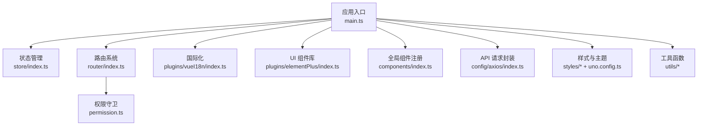
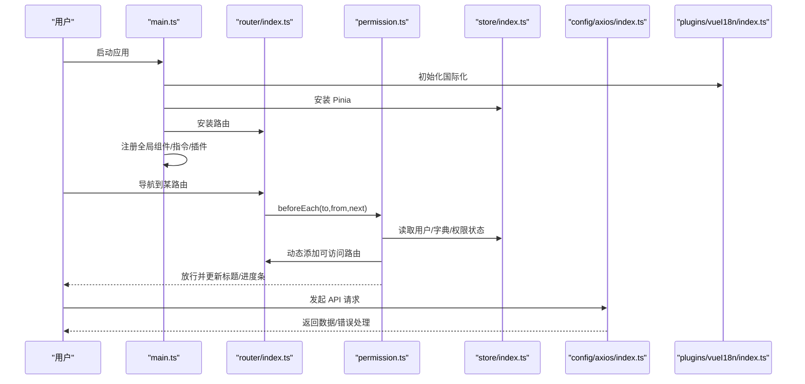
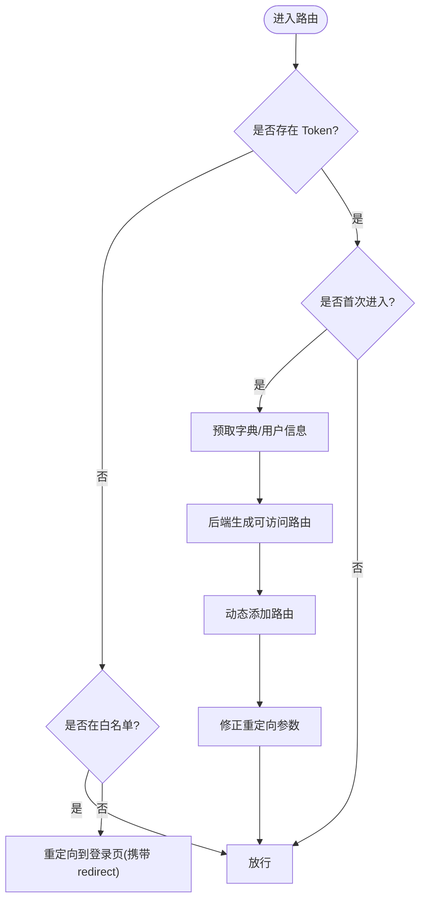
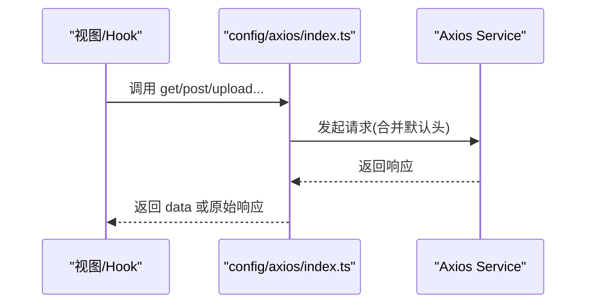

# 前端开发指南

<cite>
**本文引用的文件**
- [package.json](file://yudao-ui/yudao-ui-admin-vue3/package.json)
- [vite.config.ts](file://yudao-ui/yudao-ui-admin-vue3/vite.config.ts)
- [tsconfig.json](file://yudao-ui/yudao-ui-admin-vue3/tsconfig.json)
- [eslint.config.mjs](file://yudao-ui/yudao-ui-admin-vue3/eslint.config.mjs)
- [postcss.config.js](file://yudao-ui/yudao-ui-admin-vue3/postcss.config.js)
- [uno.config.ts](file://yudao-ui/yudao-ui-admin-vue3/uno.config.ts)
- [main.ts](file://yudao-ui/yudao-ui-admin-vue3/src/main.ts)
- [App.vue](file://yudao-ui/yudao-ui-admin-vue3/src/App.vue)
- [router/index.ts](file://yudao-ui/yudao-ui-admin-vue3/src/router/index.ts)
- [store/index.ts](file://yudao-ui/yudao-ui-admin-vue3/src/store/index.ts)
- [config/axios/index.ts](file://yudao-ui/yudao-ui-admin-vue3/src/config/axios/index.ts)
- [permission.ts](file://yudao-ui/yudao-ui-admin-vue3/src/permission.ts)
- [components/index.ts](file://yudao-ui/yudao-ui-admin-vue3/src/components/index.ts)
- [plugins/elementPlus/index.ts](file://yudao-ui/yudao-ui-admin-vue3/src/plugins/elementPlus/index.ts)
- [plugins/vueI18n/index.ts](file://yudao-ui/yudao-ui-admin-vue3/src/plugins/vueI18n/index.ts)
- [hooks/web/useDesign.ts](file://yudao-ui/yudao-ui-admin-vue3/src/hooks/web/useDesign.ts)
- [utils/auth.ts](file://yudao-ui/yudao-ui-admin-vue3/src/utils/auth.ts)
- [utils/constants.ts](file://yudao-ui/yudao-ui-admin-vue3/src/utils/constants.ts)
</cite>

## 目录
1. [简介](#简介)
2. [项目结构](#项目结构)
3. [核心组件](#核心组件)
4. [架构总览](#架构总览)
5. [详细组件分析](#详细组件分析)
6. [依赖分析](#依赖分析)
7. [性能考虑](#性能考虑)
8. [故障排查指南](#故障排查指南)
9. [结论](#结论)
10. [附录](#附录)

## 简介
本指南面向使用 Vue 3 + TypeScript + Element Plus 技术栈的前端开发者，围绕“芋道 ruoyi-vue-pro”项目的实际实现，系统讲解工程化配置、组件开发、状态管理、路由与权限、API 集成、国际化、样式与主题、以及开发工具与调试技巧。内容以仓库现有实现为依据，避免臆测，确保可操作性与一致性。

## 项目结构
该前端工程位于 yudao-ui/yudao-ui-admin-vue3 目录，采用“按功能域分层 + 模块化组织”的结构：
- 根配置：Vite、TypeScript、ESLint、UnoCSS、PostCSS 等
- 应用入口：main.ts 注册插件、状态、路由、指令等
- 路由：router/index.ts + modules/remaining 动态挂载
- 状态：store/index.ts + modules 子模块
- API：config/axios/* 封装请求与拦截
- 国际化：plugins/vueI18n + locales/*
- 样式：styles/* + UnoCSS 自定义规则
- 工具：utils/* 常量、鉴权、缓存、格式化等
- 组件：components/* 全局组件与业务组件

图示来源
- [main.ts:1-92](file://yudao-ui/yudao-ui-admin-vue3/src/main.ts#L1-L92)
- [store/index.ts:1-13](file://yudao-ui/yudao-ui-admin-vue3/src/store/index.ts#L1-L13)
- [router/index.ts:1-47](file://yudao-ui/yudao-ui-admin-vue3/src/router/index.ts#L1-L47)
- [permission.ts:1-79](file://yudao-ui/yudao-ui-admin-vue3/src/permission.ts#L1-L79)
- [plugins/vueI18n/index.ts:1-43](file://yudao-ui/yudao-ui-admin-vue3/src/plugins/vueI18n/index.ts#L1-L43)
- [plugins/elementPlus/index.ts:1-18](file://yudao-ui/yudao-ui-admin-vue3/src/plugins/elementPlus/index.ts#L1-L18)
- [components/index.ts:1-7](file://yudao-ui/yudao-ui-admin-vue3/src/components/index.ts#L1-L7)
- [config/axios/index.ts:1-48](file://yudao-ui/yudao-ui-admin-vue3/src/config/axios/index.ts#L1-L48)
- [uno.config.ts:1-108](file://yudao-ui/yudao-ui-admin-vue3/uno.config.ts#L1-L108)

章节来源
- [main.ts:1-92](file://yudao-ui/yudao-ui-admin-vue3/src/main.ts#L1-L92)
- [vite.config.ts:1-102](file://yudao-ui/yudao-ui-admin-vue3/vite.config.ts#L1-L102)
- [tsconfig.json:1-45](file://yudao-ui/yudao-ui-admin-vue3/tsconfig.json#L1-L45)
- [eslint.config.mjs:1-116](file://yudao-ui/yudao-ui-admin-vue3/eslint.config.mjs#L1-L116)
- [postcss.config.js:1-6](file://yudao-ui/yudao-ui-admin-vue3/postcss.config.js#L1-L6)
- [uno.config.ts:1-108](file://yudao-ui/yudao-ui-admin-vue3/uno.config.ts#L1-L108)

## 核心组件
- 应用启动与插件装配：在 main.ts 中统一初始化 i18n、store、全局组件、Element Plus、路由、指令、打印、安全净化等，并处理 Vite 预加载失败自动刷新。
- 路由与权限：router/index.ts 创建路由实例并挂载剩余路由；permission.ts 实现登录态校验、字典预取、菜单/权限动态注入、标题与进度条更新。
- 状态管理：store/index.ts 基于 Pinia 并启用持久化插件，便于跨会话保持状态。
- API 封装：config/axios/index.ts 提供 get/post/put/delete/upload/download 等方法，统一默认头与响应数据抽取。
- 国际化：plugins/vueI18n/index.ts 动态加载当前语言包，设置 HTML lang，同步多语言列表。
- UI 组件库：plugins/elementPlus/index.ts 全局注册 Loading 与常用组件，保证下拉等组件样式一致。
- 全局组件：components/index.ts 注册 Icon 等全局组件。
- 工具与常量：utils/auth.ts 提供 Token 与用户信息缓存；utils/constants.ts 提供各模块枚举常量。

章节来源
- [main.ts:1-92](file://yudao-ui/yudao-ui-admin-vue3/src/main.ts#L1-L92)
- [router/index.ts:1-47](file://yudao-ui/yudao-ui-admin-vue3/src/router/index.ts#L1-L47)
- [permission.ts:1-79](file://yudao-ui/yudao-ui-admin-vue3/src/permission.ts#L1-L79)
- [store/index.ts:1-13](file://yudao-ui/yudao-ui-admin-vue3/src/store/index.ts#L1-L13)
- [config/axios/index.ts:1-48](file://yudao-ui/yudao-ui-admin-vue3/src/config/axios/index.ts#L1-L48)
- [plugins/vueI18n/index.ts:1-43](file://yudao-ui/yudao-ui-admin-vue3/src/plugins/vueI18n/index.ts#L1-L43)
- [plugins/elementPlus/index.ts:1-18](file://yudao-ui/yudao-ui-admin-vue3/src/plugins/elementPlus/index.ts#L1-L18)
- [components/index.ts:1-7](file://yudao-ui/yudao-ui-admin-vue3/src/components/index.ts#L1-L7)
- [utils/auth.ts:1-87](file://yudao-ui/yudao-ui-admin-vue3/src/utils/auth.ts#L1-L87)
- [utils/constants.ts:1-485](file://yudao-ui/yudao-ui-admin-vue3/src/utils/constants.ts#L1-L485)

## 架构总览
下图展示了从应用启动到路由守卫、状态管理、API 请求与国际化的关键交互路径。

图示来源
- [main.ts:1-92](file://yudao-ui/yudao-ui-admin-vue3/src/main.ts#L1-L92)
- [router/index.ts:1-47](file://yudao-ui/yudao-ui-admin-vue3/src/router/index.ts#L1-L47)
- [permission.ts:1-79](file://yudao-ui/yudao-ui-admin-vue3/src/permission.ts#L1-L79)
- [store/index.ts:1-13](file://yudao-ui/yudao-ui-admin-vue3/src/store/index.ts#L1-L13)
- [config/axios/index.ts:1-48](file://yudao-ui/yudao-ui-admin-vue3/src/config/axios/index.ts#L1-L48)
- [plugins/vueI18n/index.ts:1-43](file://yudao-ui/yudao-ui-admin-vue3/src/plugins/vueI18n/index.ts#L1-L43)

## 详细组件分析

### Vite 构建与开发配置
- 环境变量加载：根据命令行参数或 --mode 读取 .env 文件，支持 dev/test/prod 等模式。
- 服务端配置：端口、主机、是否自动打开浏览器；当前注释掉本地代理（服务端已支持跨域）。
- 插件体系：通过 createVitePlugins 统一管理，包含 Vue、JSX、SVG、压缩、进度条等。
- CSS 预处理器：SCSS 注入全局变量，避免重复定义；lightningcss 错误恢复。
- 路径别名：@/ 指向 src，提升导入便捷性。
- 依赖预构建：optimizeDeps.include/exclude 控制预构建集合。
- 产物优化：terser 压缩、移除 debugger/console；Rollup 分包策略对大依赖单独打包。

章节来源
- [vite.config.ts:1-102](file://yudao-ui/yudao-ui-admin-vue3/vite.config.ts#L1-L102)

### TypeScript 配置
- 严格模式：开启严格类型检查，允许部分宽松规则以兼容项目现状。
- JSX 支持：preserve 模式，配合 Vue JSX 插件。
- 路径映射：@/* -> src/*。
- 类型根：包含 types 与自动生成的 auto-imports.d.ts/auto-components.d.ts。
- 编译输出：保留 outDir 以避免 IDE 报错。

章节来源
- [tsconfig.json:1-45](file://yudao-ui/yudao-ui-admin-vue3/tsconfig.json#L1-L45)

### ESLint 与代码规范
- 配置采用 flat config，集成 Vue 与 TypeScript 推荐规则。
- 忽略构建产物、单元测试覆盖率、main.ts、auto-components.d.ts 等文件。
- Vue 与 TS 规则进行适度放宽，降低噪音；UnoCSS 规则顺序关闭以避免干扰。
- 与 Prettier/Stylelint 协同，通过 lint-staged 在提交时统一校验。

章节来源
- [eslint.config.mjs:1-116](file://yudao-ui/yudao-ui-admin-vue3/eslint.config.mjs#L1-L116)

### UnoCSS 与 PostCSS
- UnoCSS：自定义规则（如布局边框、悬停样式）、暗色适配、快捷类；支持 dark 属性与类名切换。
- PostCSS：启用 autoprefixer 自动补全浏览器前缀。

章节来源
- [uno.config.ts:1-108](file://yudao-ui/yudao-ui-admin-vue3/uno.config.ts#L1-L108)
- [postcss.config.js:1-6](file://yudao-ui/yudao-ui-admin-vue3/postcss.config.js#L1-L6)

### 应用入口与插件装配
- 初始化顺序：i18n → store → 全局组件 → Element Plus → 路由 → 指令 → WangWangEditor → 打印 → 安全净化。
- 处理 Vite 预加载失败自动刷新，提升开发体验。
- App.vue 中通过 ConfigGlobal 与 useDesign 提供尺寸与主题上下文，支持灰度模式。

章节来源
- [main.ts:1-92](file://yudao-ui/yudao-ui-admin-vue3/src/main.ts#L1-L92)
- [App.vue:1-58](file://yudao-ui/yudao-ui-admin-vue3/src/App.vue#L1-L58)
- [hooks/web/useDesign.ts:1-19](file://yudao-ui/yudao-ui-admin-vue3/src/hooks/web/useDesign.ts#L1-L19)

### 路由系统与权限控制
- 路由创建：history 基于 basePath；滚动行为统一回到顶部。
- 错误处理：动态导入失败时自动跳转目标页面。
- 权限守卫：
  - 白名单放行（登录、授权回调等）。
  - 登录态校验：无 Token 跳转登录并携带 redirect。
  - 首次进入：预取字典、获取用户信息、后端生成可访问路由并动态注入。
  - 标题与进度条：afterEach 更新页面标题与结束进度。

图示来源
- [permission.ts:1-79](file://yudao-ui/yudao-ui-admin-vue3/src/permission.ts#L1-L79)
- [router/index.ts:1-47](file://yudao-ui/yudao-ui-admin-vue3/src/router/index.ts#L1-L47)

章节来源
- [router/index.ts:1-47](file://yudao-ui/yudao-ui-admin-vue3/src/router/index.ts#L1-L47)
- [permission.ts:1-79](file://yudao-ui/yudao-ui-admin-vue3/src/permission.ts#L1-L79)

### 状态管理（Pinia）
- 创建 Pinia 实例并启用持久化插件，支持跨会话保存状态。
- 在 main.ts 中安装到应用实例，随后在各模块 store 中使用。

章节来源
- [store/index.ts:1-13](file://yudao-ui/yudao-ui-admin-vue3/src/store/index.ts#L1-L13)
- [main.ts:1-92](file://yudao-ui/yudao-ui-admin-vue3/src/main.ts#L1-L92)

### API 集成与拦截器
- 统一封装：get/post/put/delete/upload/download 等方法，统一 Content-Type 与默认头。
- 响应处理：默认抽取 data 字段；upload 显式设置 multipart/form-data。
- 与权限联动：在 permission.ts 中通过 isRelogin.show 控制登录重试提示。

图示来源
- [config/axios/index.ts:1-48](file://yudao-ui/yudao-ui-admin-vue3/src/config/axios/index.ts#L1-L48)
- [permission.ts:1-79](file://yudao-ui/yudao-ui-admin-vue3/src/permission.ts#L1-L79)

章节来源
- [config/axios/index.ts:1-48](file://yudao-ui/yudao-ui-admin-vue3/src/config/axios/index.ts#L1-L48)
- [permission.ts:1-79](file://yudao-ui/yudao-ui-admin-vue3/src/permission.ts#L1-L79)

### 国际化（vue-i18n）
- 动态加载当前语言包，设置 HTML lang，同步可用语言列表。
- 通过 store/modules/locale 维护当前语言与语言列表，支持切换。

章节来源
- [plugins/vueI18n/index.ts:1-43](file://yudao-ui/yudao-ui-admin-vue3/src/plugins/vueI18n/index.ts#L1-L43)

### UI 组件库（Element Plus）
- 全局注册 Loading 与常用组件（如 ElButton、ElScrollbar），保证下拉等组件样式一致。
- 与 UnoCSS 协作，通过 CSS 变量与暗色模式实现主题适配。

章节来源
- [plugins/elementPlus/index.ts:1-18](file://yudao-ui/yudao-ui-admin-vue3/src/plugins/elementPlus/index.ts#L1-L18)

### 全局组件与命名规范
- components/index.ts 注册 Icon 等全局组件。
- hooks/web/useDesign.ts 提供 getPrefixCls，结合 styles/global.module.scss 的 namespace 统一命名空间。

章节来源
- [components/index.ts:1-7](file://yudao-ui/yudao-ui-admin-vue3/src/components/index.ts#L1-L7)
- [hooks/web/useDesign.ts:1-19](file://yudao-ui/yudao-ui-admin-vue3/src/hooks/web/useDesign.ts#L1-L19)

### 工具与常量
- utils/auth.ts：Token 读取/设置/删除、加密存储登录表单、租户切换等。
- utils/constants.ts：系统/模块枚举常量集中管理，便于全局复用。

章节来源
- [utils/auth.ts:1-87](file://yudao-ui/yudao-ui-admin-vue3/src/utils/auth.ts#L1-L87)
- [utils/constants.ts:1-485](file://yudao-ui/yudao-ui-admin-vue3/src/utils/constants.ts#L1-L485)

## 依赖分析
- 运行时依赖：Vue 3、Vue Router 5、Pinia、Element Plus、axios、vue-i18n、echarts、wangeditor、cropperjs、sortablejs 等。
- 开发依赖：Vite、TypeScript、ESLint、UnoCSS、Prettier、Stylelint、Sass、Terser、unplugin-* 等。
- 脚本命令：dev/build/preview/lint 等，覆盖开发、构建、预览与格式化校验。

章节来源
- [package.json:1-158](file://yudao-ui/yudao-ui-admin-vue3/package.json#L1-L158)

## 性能考虑
- 依赖预构建：optimizeDeps.include/exclude 控制预构建集合，减少冷启动时间。
- 产物优化：terser 压缩、移除 console/debugger；Rollup 分包策略对大依赖单独打包（如 echarts、form-create）。
- SCSS 注入：避免重复注入全局变量，减少编译开销。
- UnoCSS：按需生成原子类，减少无效样式体积。

章节来源
- [vite.config.ts:76-99](file://yudao-ui/yudao-ui-admin-vue3/vite.config.ts#L76-L99)
- [uno.config.ts:1-108](file://yudao-ui/yudao-ui-admin-vue3/uno.config.ts#L1-L108)

## 故障排查指南
- 动态导入失败：路由 onError 捕获并自动跳转目标页面，避免白屏。
- 预加载失败：main.ts 监听 vite:preloadError，自动刷新页面。
- 跨域问题：当前注释本地代理，服务端已支持跨域；如需本地联调可临时开启代理。
- 路由重定向异常：permission.ts 修复跳转时参数丢失问题，确保 redirectLocation 正确解析。
- 进度条与标题：afterEach 更新页面标题与进度条，若异常检查 useNProgress/useTitle 的实现。

章节来源
- [router/index.ts:22-30](file://yudao-ui/yudao-ui-admin-vue3/src/router/index.ts#L22-L30)
- [main.ts:50-54](file://yudao-ui/yudao-ui-admin-vue3/src/main.ts#L50-L54)
- [permission.ts:52-60](file://yudao-ui/yudao-ui-admin-vue3/src/permission.ts#L52-L60)

## 结论
本项目以 Vite 为基础，结合 TypeScript、Element Plus、Pinia、Vue Router、axios 与 vue-i18n，形成一套完整的前端工程化方案。通过统一的入口装配、严格的路由权限控制、完善的 API 封装与国际化、以及 UnoCSS/SCSS 的样式体系，既保证了开发效率，也兼顾了可维护性与性能。建议在新增功能时遵循既有约定（命名空间、权限守卫、API 封装、国际化消息键等），以保持一致性。

## 附录
- 开发命令
  - 启动：npm run dev 或 pnpm dev
  - 构建：npm run build:dev / build:test / build:prod
  - 预览：npm run serve:dev / serve:prod
  - 代码检查：npm run lint:eslint / lint:format / lint:style
- 环境变量
  - VITE_BASE_PATH、VITE_PORT、VITE_OPEN、VITE_SOURCEMAP、VITE_OUT_DIR、VITE_DROP_DEBUGGER、VITE_DROP_CONSOLE 等
- 路径别名
  - @/ 指向 src，便于相对路径导入

章节来源
- [package.json:7-26](file://yudao-ui/yudao-ui-admin-vue3/package.json#L7-L26)
- [vite.config.ts:25-26](file://yudao-ui/yudao-ui-admin-vue3/vite.config.ts#L25-L26)