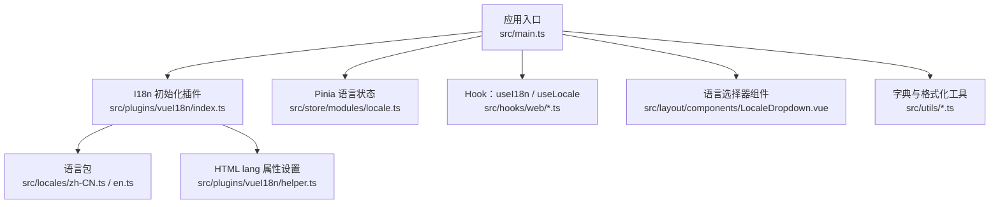
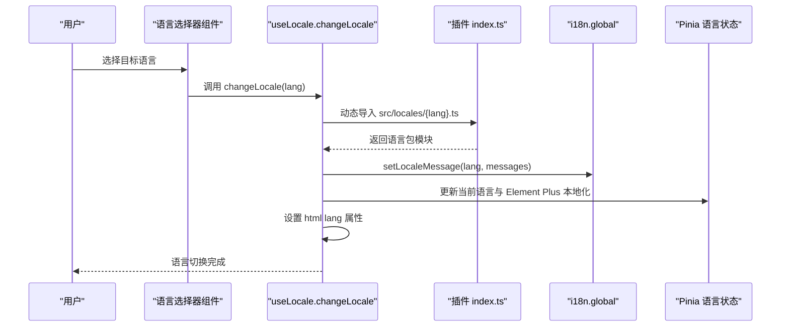
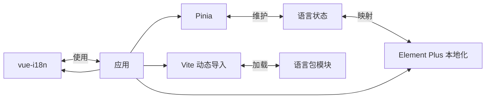
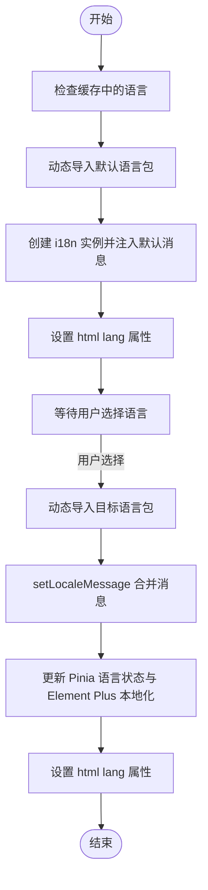
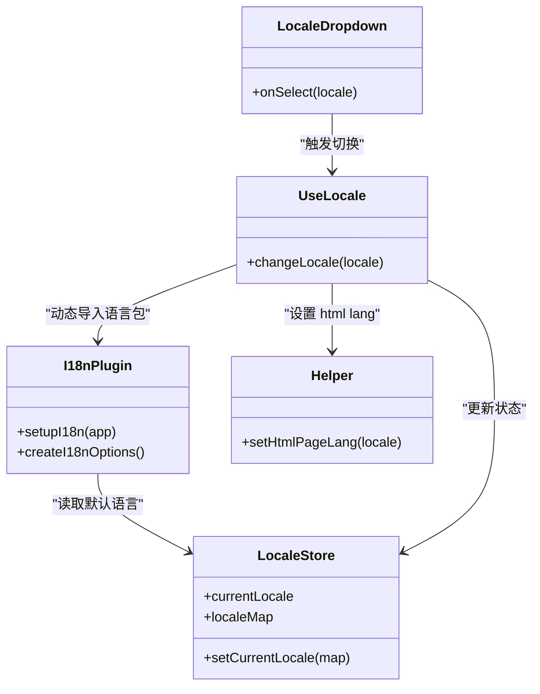

# 国际化

<cite>
**本文引用的文件**
- [yudao-ui-admin-vue3/src/plugins/vueI18n/index.ts](file://yudao-ui/yudao-ui-admin-vue3/src/plugins/vueI18n/index.ts)
- [yudao-ui-admin-vue3/src/plugins/vueI18n/helper.ts](file://yudao-ui/yudao-ui-admin-vue3/src/plugins/vueI18n/helper.ts)
- [yudao-ui-admin-vue3/src/hooks/web/useI18n.ts](file://yudao-ui/yudao-ui-admin-vue3/src/hooks/web/useI18n.ts)
- [yudao-ui-admin-vue3/src/hooks/web/useLocale.ts](file://yudao-ui/yudao-ui-admin-vue3/src/hooks/web/useLocale.ts)
- [yudao-ui-admin-vue3/src/store/modules/locale.ts](file://yudao-ui/yudao-ui-admin-vue3/src/store/modules/locale.ts)
- [yudao-ui-admin-vue3/src/types/localeDropdown.d.ts](file://yudao-ui/yudao-ui-admin-vue3/src/types/localeDropdown.d.ts)
- [yudao-ui-admin-vue3/src/locales/zh-CN.ts](file://yudao-ui/yudao-ui-admin-vue3/src/locales/zh-CN.ts)
- [yudao-ui-admin-vue3/src/locales/en.ts](file://yudao-ui/yudao-ui-admin-vue3/src/locales/en.ts)
- [yudao-ui-admin-vue3/src/utils/formatter.ts](file://yudao-ui/yudao-ui-admin-vue3/src/utils/formatter.ts)
- [yudao-ui-admin-vue3/src/utils/index.ts](file://yudao-ui/yudao-ui-admin-vue3/src/utils/index.ts)
- [yudao-ui-admin-vue3/src/components/DictTag/index.ts](file://yudao-ui/yudao-ui-admin-vue3/src/components/DictTag/index.ts)
- [yudao-ui-admin-vue3/src/utils/dict.ts](file://yudao-ui/yudao-ui-admin-vue3/src/utils/dict.ts)
- [yudao-ui-admin-vue3/src/layout/components/LocaleDropdown.vue](file://yudao-ui/yudao-ui-admin-vue3/src/layout/components/LocaleDropdown.vue)
- [yudao-ui-admin-vue3/src/main.ts](file://yudao-ui/yudao-ui-admin-vue3/src/main.ts)
- [yudao-ui-admin-vue3/package.json](file://yudao-ui/yudao-ui-admin-vue3/package.json)
- [yudao-ui-admin-vue3/vite.config.ts](file://yudao-ui/yudao-ui-admin-vue3/vite.config.ts)
- [yudao-ui-admin-vue3/tsconfig.json](file://yudao-ui/yudao-ui-admin-vue3/tsconfig.json)
</cite>

## 目录
1. [简介](#简介)
2. [项目结构](#项目结构)
3. [核心组件](#核心组件)
4. [架构总览](#架构总览)
5. [详细组件分析](#详细组件分析)
6. [依赖关系分析](#依赖关系分析)
7. [性能考虑](#性能考虑)
8. [故障排查指南](#故障排查指南)
9. [结论](#结论)
10. [附录](#附录)

## 简介
本文件面向“芋道 ruoyi-vue-pro”前端工程，系统性阐述基于 vue-i18n 的国际化实现与最佳实践。内容覆盖语言包组织、翻译键值管理、按需加载与动态导入、语言切换流程、Element Plus 本地化、日期/数字/货币格式化、字典数据国际化、语言选择器组件与状态管理、测试与验证方法以及性能优化建议。

## 项目结构
ruoyi-vue-pro 前端采用 Pinia + Vue 3 + vue-i18n 的组合，国际化相关代码集中在以下目录与文件：
- 语言包：src/locales/zh-CN.ts、src/locales/en.ts
- 插件与初始化：src/plugins/vueI18n/index.ts、src/plugins/vueI18n/helper.ts
- 业务 Hook：src/hooks/web/useI18n.ts、src/hooks/web/useLocale.ts
- 状态管理：src/store/modules/locale.ts
- 类型定义：src/types/localeDropdown.d.ts
- 字典与格式化：src/utils/dict.ts、src/utils/formatter.ts、src/utils/index.ts
- 语言选择器组件：src/layout/components/LocaleDropdown.vue
- 应用入口：src/main.ts
- 构建与类型：vite.config.ts、tsconfig.json、package.json

图表来源
- [yudao-ui-admin-vue3/src/main.ts](file://yudao-ui/yudao-ui-admin-vue3/src/main.ts)
- [yudao-ui-admin-vue3/src/plugins/vueI18n/index.ts](file://yudao-ui/yudao-ui-admin-vue3/src/plugins/vueI18n/index.ts)
- [yudao-ui-admin-vue3/src/plugins/vueI18n/helper.ts](file://yudao-ui/yudao-ui-admin-vue3/src/plugins/vueI18n/helper.ts)
- [yudao-ui-admin-vue3/src/store/modules/locale.ts](file://yudao-ui/yudao-ui-admin-vue3/src/store/modules/locale.ts)
- [yudao-ui-admin-vue3/src/hooks/web/useI18n.ts](file://yudao-ui/yudao-ui-admin-vue3/src/hooks/web/useI18n.ts)
- [yudao-ui-admin-vue3/src/hooks/web/useLocale.ts](file://yudao-ui/yudao-ui-admin-vue3/src/hooks/web/useLocale.ts)
- [yudao-ui-admin-vue3/src/layout/components/LocaleDropdown.vue](file://yudao-ui/yudao-ui-admin-vue3/src/layout/components/LocaleDropdown.vue)
- [yudao-ui-admin-vue3/src/utils/dict.ts](file://yudao-ui/yudao-ui-admin-vue3/src/utils/dict.ts)
- [yudao-ui-admin-vue3/src/utils/formatter.ts](file://yudao-ui/yudao-ui-admin-vue3/src/utils/formatter.ts)
- [yudao-ui-admin-vue3/src/utils/index.ts](file://yudao-ui/yudao-ui-admin-vue3/src/utils/index.ts)

章节来源
- [yudao-ui-admin-vue3/src/main.ts](file://yudao-ui/yudao-ui-admin-vue3/src/main.ts)
- [yudao-ui-admin-vue3/src/plugins/vueI18n/index.ts](file://yudao-ui/yudao-ui-admin-vue3/src/plugins/vueI18n/index.ts)
- [yudao-ui-admin-vue3/src/plugins/vueI18n/helper.ts](file://yudao-ui/yudao-ui-admin-vue3/src/plugins/vueI18n/helper.ts)
- [yudao-ui-admin-vue3/src/store/modules/locale.ts](file://yudao-ui/yudao-ui-admin-vue3/src/store/modules/locale.ts)
- [yudao-ui-admin-vue3/src/hooks/web/useI18n.ts](file://yudao-ui/yudao-ui-admin-vue3/src/hooks/web/useI18n.ts)
- [yudao-ui-admin-vue3/src/hooks/web/useLocale.ts](file://yudao-ui/yudao-ui-admin-vue3/src/hooks/web/useLocale.ts)
- [yudao-ui-admin-vue3/src/layout/components/LocaleDropdown.vue](file://yudao-ui/yudao-ui-admin-vue3/src/layout/components/LocaleDropdown.vue)
- [yudao-ui-admin-vue3/src/utils/dict.ts](file://yudao-ui/yudao-ui-admin-vue3/src/utils/dict.ts)
- [yudao-ui-admin-vue3/src/utils/formatter.ts](file://yudao-ui/yudao-ui-admin-vue3/src/utils/formatter.ts)
- [yudao-ui-admin-vue3/src/utils/index.ts](file://yudao-ui/yudao-ui-admin-vue3/src/utils/index.ts)

## 核心组件
- I18n 初始化与选项生成：负责创建 i18n 实例、注入默认语言包、设置可用语言列表、同步与静默警告策略。
- 语言包：按语言拆分的模块，导出翻译键值对象。
- Hook useI18n：封装 t 函数，支持命名空间拼接与参数透传。
- Hook useLocale：封装语言切换逻辑，动态导入目标语言包并更新全局 locale 与 Element Plus 本地化。
- Pinia 语言状态：维护当前语言与语言列表，并持久化到缓存。
- HTML lang 设置：在切换语言时同步设置 html lang 属性。
- 语言选择器组件：提供下拉选择，触发 useLocale.changeLocale。
- 字典与格式化：提供字典标签国际化渲染与金额/数量等格式化工具。

章节来源
- [yudao-ui-admin-vue3/src/plugins/vueI18n/index.ts](file://yudao-ui/yudao-ui-admin-vue3/src/plugins/vueI18n/index.ts)
- [yudao-ui-admin-vue3/src/locales/zh-CN.ts](file://yudao-ui/yudao-ui-admin-vue3/src/locales/zh-CN.ts)
- [yudao-ui-admin-vue3/src/locales/en.ts](file://yudao-ui/yudao-ui-admin-vue3/src/locales/en.ts)
- [yudao-ui-admin-vue3/src/hooks/web/useI18n.ts](file://yudao-ui/yudao-ui-admin-vue3/src/hooks/web/useI18n.ts)
- [yudao-ui-admin-vue3/src/hooks/web/useLocale.ts](file://yudao-ui/yudao-ui-admin-vue3/src/hooks/web/useLocale.ts)
- [yudao-ui-admin-vue3/src/store/modules/locale.ts](file://yudao-ui/yudao-ui-admin-vue3/src/store/modules/locale.ts)
- [yudao-ui-admin-vue3/src/plugins/vueI18n/helper.ts](file://yudao-ui/yudao-ui-admin-vue3/src/plugins/vueI18n/helper.ts)
- [yudao-ui-admin-vue3/src/layout/components/LocaleDropdown.vue](file://yudao-ui/yudao-ui-admin-vue3/src/layout/components/LocaleDropdown.vue)
- [yudao-ui-admin-vue3/src/utils/dict.ts](file://yudao-ui/yudao-ui-admin-vue3/src/utils/dict.ts)
- [yudao-ui-admin-vue3/src/utils/formatter.ts](file://yudao-ui/yudao-ui-admin-vue3/src/utils/formatter.ts)
- [yudao-ui-admin-vue3/src/utils/index.ts](file://yudao-ui/yudao-ui-admin-vue3/src/utils/index.ts)

## 架构总览
ruoyi-vue-pro 的国际化采用“按需加载 + 动态导入”的策略，在应用启动时仅加载默认语言包，切换语言时再异步加载对应语言包并注入到 i18n.global.messages 中，避免首屏体积膨胀。

图表来源
- [yudao-ui-admin-vue3/src/hooks/web/useLocale.ts](file://yudao-ui/yudao-ui-admin-vue3/src/hooks/web/useLocale.ts)
- [yudao-ui-admin-vue3/src/plugins/vueI18n/index.ts](file://yudao-ui/yudao-ui-admin-vue3/src/plugins/vueI18n/index.ts)
- [yudao-ui-admin-vue3/src/store/modules/locale.ts](file://yudao-ui/yudao-ui-admin-vue3/src/store/modules/locale.ts)
- [yudao-ui-admin-vue3/src/plugins/vueI18n/helper.ts](file://yudao-ui/yudao-ui-admin-vue3/src/plugins/vueI18n/helper.ts)

## 详细组件分析

### I18n 初始化与选项生成
- 初始化时机：在应用入口中调用 setupI18n(app)，内部通过 createI18nOptions 生成配置。
- 默认语言包：根据当前语言从 src/locales 下动态导入对应模块作为初始 messages。
- 可用语言：从 Pinia 语言状态中读取 localeMap 并映射为 availableLocales。
- 同步与静默：开启 sync，关闭缺失与回退告警，减少开发噪音。
- HTML lang：初始化时设置 document.documentElement lang。

章节来源
- [yudao-ui-admin-vue3/src/plugins/vueI18n/index.ts](file://yudao-ui/yudao-ui-admin-vue3/src/plugins/vueI18n/index.ts)
- [yudao-ui-admin-vue3/src/plugins/vueI18n/helper.ts](file://yudao-ui/yudao-ui-admin-vue3/src/plugins/vueI18n/helper.ts)
- [yudao-ui-admin-vue3/src/store/modules/locale.ts](file://yudao-ui/yudao-ui-admin-vue3/src/store/modules/locale.ts)

### 语言包组织与命名规范
- 文件命名：按语言代码命名，如 zh-CN.ts、en.ts。
- 导出结构：默认导出一个包含层级键值的对象，便于按模块划分（如 common、system、bpm 等）。
- 键值规范：建议采用“模块名.功能.语义”的层级命名，避免冲突并提升可维护性。
- 版本控制：新增或修改键值时，遵循最小变更原则，配合 Git 提交信息明确变更范围。

章节来源
- [yudao-ui-admin-vue3/src/locales/zh-CN.ts](file://yudao-ui/yudao-ui-admin-vue3/src/locales/zh-CN.ts)
- [yudao-ui-admin-vue3/src/locales/en.ts](file://yudao-ui/yudao-ui-admin-vue3/src/locales/en.ts)

### useI18n Hook：命名空间与 t 函数
- 命名空间：支持传入 namespace，自动拼接 key，避免重复键名。
- 参数透传：t 函数支持位置参数与命名参数，兼容 vue-i18n 的复数、选择等格式化能力。
- 降级处理：当 i18n 未就绪或 key 缺失时，返回原 key 或空字符串，保证 UI 不崩溃。

章节来源
- [yudao-ui-admin-vue3/src/hooks/web/useI18n.ts](file://yudao-ui/yudao-ui-admin-vue3/src/hooks/web/useI18n.ts)

### useLocale Hook：语言切换与动态导入
- 动态导入：通过 import(`../../locales/${locale}.ts`) 按需加载目标语言包。
- 注入消息：调用 i18n.global.setLocaleMessage 将新语言包合并进 messages。
- 状态同步：更新 Pinia 语言状态，同时设置 Element Plus 本地化与 html lang。
- 兼容模式：根据 i18n.mode 判断 legacy 或组合式 API 的 locale 写法。

章节来源
- [yudao-ui-admin-vue3/src/hooks/web/useLocale.ts](file://yudao-ui/yudao-ui-admin-vue3/src/hooks/web/useLocale.ts)
- [yudao-ui-admin-vue3/src/plugins/vueI18n/helper.ts](file://yudao-ui/yudao-ui-admin-vue3/src/plugins/vueI18n/helper.ts)
- [yudao-ui-admin-vue3/src/store/modules/locale.ts](file://yudao-ui/yudao-ui-admin-vue3/src/store/modules/locale.ts)

### Pinia 语言状态：currentLocale 与 localeMap
- currentLocale：保存当前语言与 Element Plus 本地化对象。
- localeMap：语言列表，用于语言选择器展示。
- 缓存：通过 useCache 将语言持久化到浏览器缓存，刷新后保持上次选择。

章节来源
- [yudao-ui-admin-vue3/src/store/modules/locale.ts](file://yudao-ui/yudao-ui-admin-vue3/src/store/modules/locale.ts)
- [yudao-ui-admin-vue3/src/types/localeDropdown.d.ts](file://yudao-ui/yudao-ui-admin-vue3/src/types/localeDropdown.d.ts)

### 语言选择器组件：LocaleDropdown
- 功能：展示 localeMap，触发 useLocale.changeLocale 完成切换。
- 交互：点击项后更新 Pinia 状态并同步至 i18n 与 DOM。

章节来源
- [yudao-ui-admin-vue3/src/layout/components/LocaleDropdown.vue](file://yudao-ui/yudao-ui-admin-vue3/src/layout/components/LocaleDropdown.vue)
- [yudao-ui-admin-vue3/src/hooks/web/useLocale.ts](file://yudao-ui/yudao-ui-admin-vue3/src/hooks/web/useLocale.ts)

### Element Plus 本地化集成
- 映射：通过 elLocaleMap 将语言代码映射到 Element Plus 的本地化对象。
- 更新：切换语言时同步更新 currentLocale.elLocale，确保表格、弹窗等组件文案本地化。

章节来源
- [yudao-ui-admin-vue3/src/store/modules/locale.ts](file://yudao-ui/yudao-ui-admin-vue3/src/store/modules/locale.ts)

### 日期、数字与货币本地化格式化
- 工具函数：提供金额（分转元）、数量与价格格式化、百分比计算等工具函数，满足不同业务场景。
- 建议：对于通用的日期/数字/货币格式化，优先使用 Intl API（如 Intl.DateTimeFormat、Intl.NumberFormat），并在需要时结合项目工具函数进行二次封装。

章节来源
- [yudao-ui-admin-vue3/src/utils/formatter.ts](file://yudao-ui/yudao-ui-admin-vue3/src/utils/formatter.ts)
- [yudao-ui-admin-vue3/src/utils/index.ts](file://yudao-ui/yudao-ui-admin-vue3/src/utils/index.ts)

### 字典数据的国际化处理
- 字典标签组件：通过 DictTag 组件结合字典值与当前语言，渲染对应语言的标签文本。
- 字典工具：dict.ts 提供字典查询与缓存能力，结合 useI18n 的 t 函数实现枚举值的多语言显示。
- 动态字典：支持运行时拉取字典数据并按需更新，确保切换语言后字典文案同步变化。

章节来源
- [yudao-ui-admin-vue3/src/components/DictTag/index.ts](file://yudao-ui/yudao-ui-admin-vue3/src/components/DictTag/index.ts)
- [yudao-ui-admin-vue3/src/utils/dict.ts](file://yudao-ui/yudao-ui-admin-vue3/src/utils/dict.ts)
- [yudao-ui-admin-vue3/src/hooks/web/useI18n.ts](file://yudao-ui/yudao-ui-admin-vue3/src/hooks/web/useI18n.ts)

### 应用入口与初始化流程
- 在 main.ts 中调用 setupI18n(app)，完成 i18n 插件注册与默认语言包注入。
- 该流程确保应用启动即具备国际化能力，且后续可通过 useLocale 动态切换语言。

章节来源
- [yudao-ui-admin-vue3/src/main.ts](file://yudao-ui/yudao-ui-admin-vue3/src/main.ts)
- [yudao-ui-admin-vue3/src/plugins/vueI18n/index.ts](file://yudao-ui/yudao-ui-admin-vue3/src/plugins/vueI18n/index.ts)

## 依赖关系分析
- vue-i18n：核心国际化库，提供 t 函数、locale 管理与消息注入。
- Element Plus：提供本地化语言包，与 Pinia 状态联动。
- Pinia：维护语言状态与缓存。
- Vite：通过动态导入实现按需加载语言包。
- TypeScript：通过类型声明约束语言类型与接口。

图表来源
- [yudao-ui-admin-vue3/src/plugins/vueI18n/index.ts](file://yudao-ui/yudao-ui-admin-vue3/src/plugins/vueI18n/index.ts)
- [yudao-ui-admin-vue3/src/store/modules/locale.ts](file://yudao-ui/yudao-ui-admin-vue3/src/store/modules/locale.ts)
- [yudao-ui-admin-vue3/src/layout/components/LocaleDropdown.vue](file://yudao-ui/yudao-ui-admin-vue3/src/layout/components/LocaleDropdown.vue)
- [yudao-ui-admin-vue3/vite.config.ts](file://yudao-ui/yudao-ui-admin-vue3/vite.config.ts)
- [yudao-ui-admin-vue3/package.json](file://yudao-ui/yudao-ui-admin-vue3/package.json)

章节来源
- [yudao-ui-admin-vue3/src/plugins/vueI18n/index.ts](file://yudao-ui/yudao-ui-admin-vue3/src/plugins/vueI18n/index.ts)
- [yudao-ui-admin-vue3/src/store/modules/locale.ts](file://yudao-ui/yudao-ui-admin-vue3/src/store/modules/locale.ts)
- [yudao-ui-admin-vue3/vite.config.ts](file://yudao-ui/yudao-ui-admin-vue3/vite.config.ts)
- [yudao-ui-admin-vue3/package.json](file://yudao-ui/yudao-ui-admin-vue3/package.json)
- [yudao-ui-admin-vue3/tsconfig.json](file://yudao-ui/yudao-ui-admin-vue3/tsconfig.json)

## 性能考虑
- 按需加载：仅在切换语言时动态导入对应语言包，降低首屏体积。
- 语言包拆分：建议按模块拆分语言包，避免单文件过大；必要时可进一步拆分子模块。
- 缓存策略：利用浏览器缓存与 Pinia 持久化，减少重复加载。
- 静默告警：关闭缺失与回退告警，避免控制台噪声影响开发体验。
- 渲染优化：字典标签与格式化工具尽量复用，避免重复计算。

## 故障排查指南
- 语言切换无效：检查 useLocale.changeLocale 是否正确调用 setLocaleMessage 与 Pinia 更新。
- 语言包未生效：确认动态导入路径是否正确，语言包模块是否默认导出对象。
- Element Plus 文案未更新：确认 elLocaleMap 是否包含目标语言，Pinia 状态是否同步更新。
- HTML lang 未变化：检查 helper.ts 中 setHtmlPageLang 是否被调用。
- 键值缺失：useI18n 在无匹配键时会返回原 key，需在构建阶段或测试阶段发现并修复。

章节来源
- [yudao-ui-admin-vue3/src/hooks/web/useLocale.ts](file://yudao-ui/yudao-ui-admin-vue3/src/hooks/web/useLocale.ts)
- [yudao-ui-admin-vue3/src/plugins/vueI18n/helper.ts](file://yudao-ui/yudao-ui-admin-vue3/src/plugins/vueI18n/helper.ts)
- [yudao-ui-admin-vue3/src/hooks/web/useI18n.ts](file://yudao-ui/yudao-ui-admin-vue3/src/hooks/web/useI18n.ts)
- [yudao-ui-admin-vue3/src/store/modules/locale.ts](file://yudao-ui/yudao-ui-admin-vue3/src/store/modules/locale.ts)

## 结论
ruoyi-vue-pro 的国际化方案以 vue-i18n 为核心，结合 Pinia 状态管理与 Vite 动态导入，实现了低耦合、高性能的语言切换与本地化渲染。通过规范化的语言包组织、命名空间化的键值管理、字典与格式化工具的配套，能够有效支撑复杂业务的多语言需求。建议在团队内建立翻译键值管理规范与自动化校验流程，持续提升翻译质量与维护效率。

## 附录

### 语言包加载流程（算法）

图表来源
- [yudao-ui-admin-vue3/src/plugins/vueI18n/index.ts](file://yudao-ui/yudao-ui-admin-vue3/src/plugins/vueI18n/index.ts)
- [yudao-ui-admin-vue3/src/hooks/web/useLocale.ts](file://yudao-ui/yudao-ui-admin-vue3/src/hooks/web/useLocale.ts)
- [yudao-ui-admin-vue3/src/plugins/vueI18n/helper.ts](file://yudao-ui/yudao-ui-admin-vue3/src/plugins/vueI18n/helper.ts)
- [yudao-ui-admin-vue3/src/store/modules/locale.ts](file://yudao-ui/yudao-ui-admin-vue3/src/store/modules/locale.ts)

### 语言切换类图（代码级）

图表来源
- [yudao-ui-admin-vue3/src/plugins/vueI18n/index.ts](file://yudao-ui/yudao-ui-admin-vue3/src/plugins/vueI18n/index.ts)
- [yudao-ui-admin-vue3/src/hooks/web/useLocale.ts](file://yudao-ui/yudao-ui-admin-vue3/src/hooks/web/useLocale.ts)
- [yudao-ui-admin-vue3/src/store/modules/locale.ts](file://yudao-ui/yudao-ui-admin-vue3/src/store/modules/locale.ts)
- [yudao-ui-admin-vue3/src/plugins/vueI18n/helper.ts](file://yudao-ui/yudao-ui-admin-vue3/src/plugins/vueI18n/helper.ts)
- [yudao-ui-admin-vue3/src/layout/components/LocaleDropdown.vue](file://yudao-ui/yudao-ui-admin-vue3/src/layout/components/LocaleDropdown.vue)