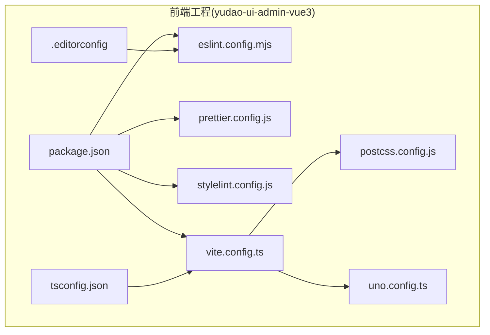
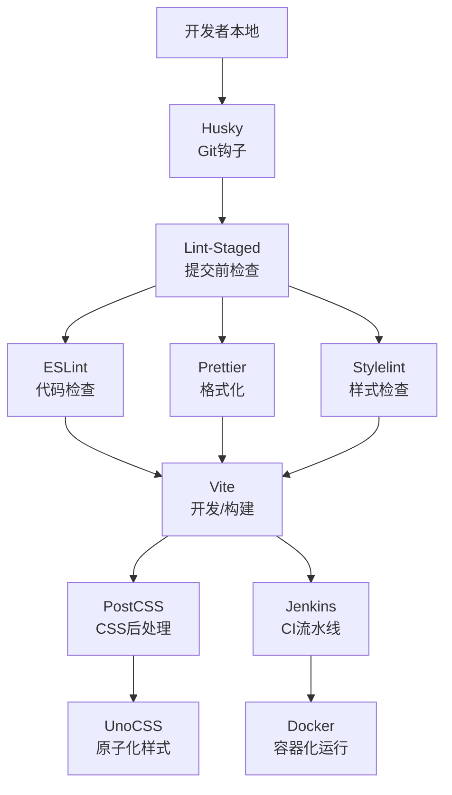
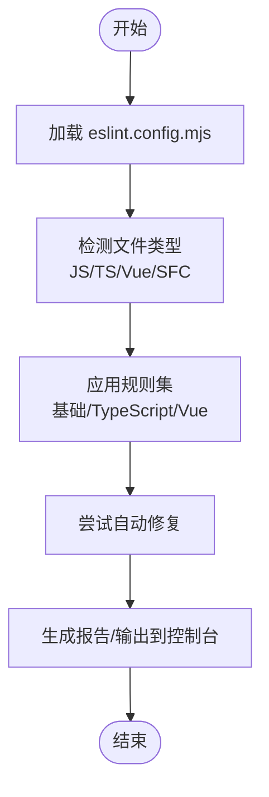
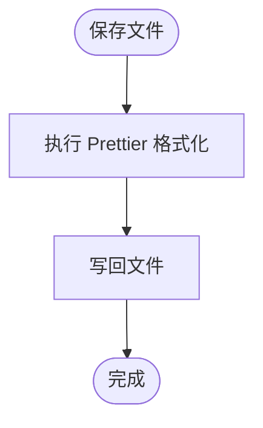
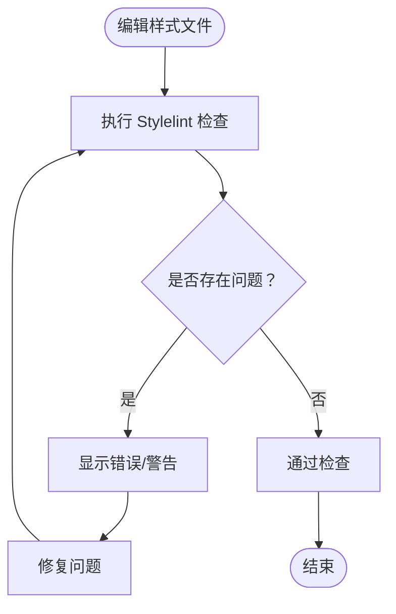
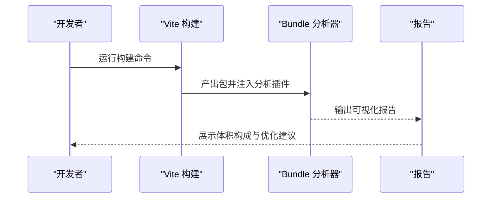
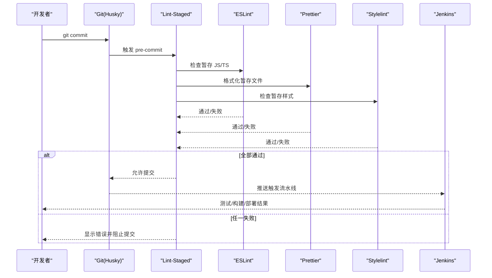
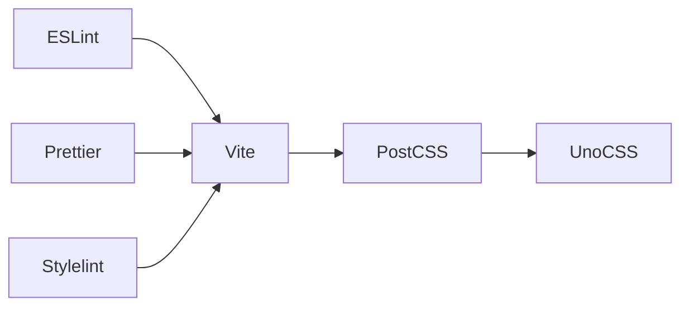

# 开发工具与调试

<cite>
**本文引用的文件**
- [package.json](file://yudao-ui/yudao-ui-admin-vue3/package.json)
- [eslint.config.mjs](file://yudao-ui/yudao-ui-admin-vue3/eslint.config.mjs)
- [prettier.config.js](file://yudao-ui/yudao-ui-admin-vue3/prettier.config.js)
- [stylelint.config.js](file://yudao-ui/yudao-ui-admin-vue3/stylelint.config.js)
- [vite.config.ts](file://yudao-ui/yudao-ui-admin-vue3/vite.config.ts)
- [postcss.config.js](file://yudao-ui/yudao-ui-admin-vue3/postcss.config.js)
- [uno.config.ts](file://yudao-ui/yudao-ui-admin-vue3/uno.config.ts)
- [.editorconfig](file://yudao-ui/yudao-ui-admin-vue3/.editorconfig)
- [tsconfig.json](file://yudao-ui/yudao-ui-admin-vue3/tsconfig.json)
- [Jenkinsfile](file://script/jenkins/Jenkinsfile)
- [docker-compose.yml](file://script/docker/docker-compose.yml)
- [docker.env](file://script/docker/docker.env)
- [deploy.sh](file://script/shell/deploy.sh)
- [http-client.env.json](file://script/idea/http-client.env.json)
</cite>

## 目录
1. [简介](#简介)
2. [项目结构](#项目结构)
3. [核心组件](#核心组件)
4. [架构总览](#架构总览)
5. [详细组件分析](#详细组件分析)
6. [依赖关系分析](#依赖关系分析)
7. [性能考虑](#性能考虑)
8. [故障排查指南](#故障排查指南)
9. [结论](#结论)
10. [附录](#附录)

## 简介
本文件面向芋道 ruoyi-vue-pro 前端工程（yudao-ui-admin-vue3），系统性梳理开发工具链与调试实践，覆盖代码质量工具（ESLint、Prettier、Stylelint）、开发环境配置（IDE/编辑器、插件、工作区）、调试技巧（浏览器开发者工具、Vue DevTools、网络面板）、性能分析（Lighthouse、Web Vitals、内存泄漏检测）、构建优化（Bundle 分析、代码分割、资源优化）、Git 工作流与代码审查、自动化工具（Husky、Lint-Staged、CI）等主题。目标是帮助团队建立一致、高效且可维护的前端开发体验。

## 项目结构
前端工程位于 yudao-ui/yudao-ui-admin-vue3，采用 Vite 作为构建工具，结合 UnoCSS、PostCSS、TypeScript 等技术栈。关键配置文件包括：
- 包管理与脚本：package.json
- 质量工具：eslint.config.mjs、prettier.config.js、stylelint.config.js
- 构建与工具链：vite.config.ts、postcss.config.js、uno.config.ts
- 编辑器与语言：.editorconfig、tsconfig.json
- 自动化与部署：Jenkinsfile、docker-compose.yml、docker.env、deploy.sh
- IDEA 集成：http-client.env.json

图表来源
- [package.json](file://yudao-ui/yudao-ui-admin-vue3/package.json)
- [eslint.config.mjs](file://yudao-ui/yudao-ui-admin-vue3/eslint.config.mjs)
- [prettier.config.js](file://yudao-ui/yudao-ui-admin-vue3/prettier.config.js)
- [stylelint.config.js](file://yudao-ui/yudao-ui-admin-vue3/stylelint.config.js)
- [vite.config.ts](file://yudao-ui/yudao-ui-admin-vue3/vite.config.ts)
- [postcss.config.js](file://yudao-ui/yudao-ui-admin-vue3/postcss.config.js)
- [uno.config.ts](file://yudao-ui/yudao-ui-admin-vue3/uno.config.ts)
- [.editorconfig](file://yudao-ui/yudao-ui-admin-vue3/.editorconfig)
- [tsconfig.json](file://yudao-ui/yudao-ui-admin-vue3/tsconfig.json)

章节来源
- [package.json](file://yudao-ui/yudao-ui-admin-vue3/package.json)
- [vite.config.ts](file://yudao-ui/yudao-ui-admin-vue3/vite.config.ts)

## 核心组件
- 代码质量三件套
  - ESLint：统一 JavaScript/TypeScript 规则，集成自动导入、Vue 文件支持与错误修复能力
  - Prettier：统一格式化风格，与编辑器保存钩子配合
  - Stylelint：约束样式文件规范，确保 SCSS/CSS 一致性
- 构建与工具链
  - Vite：快速开发与生产构建，支持按需加载与热更新
  - PostCSS：CSS 后处理，适配浏览器兼容与特性
  - UnoCSS：原子化 CSS 引擎，提升样式开发效率
- 开发环境与编辑器
  - .editorconfig：统一缩进、换行、编码等基础约定
  - tsconfig.json：TypeScript 编译选项与路径映射
- 自动化与部署
  - Jenkinsfile：持续集成流水线
  - docker-compose.yml / docker.env：容器化运行与环境变量
  - deploy.sh：部署脚本

章节来源
- [eslint.config.mjs](file://yudao-ui/yudao-ui-admin-vue3/eslint.config.mjs)
- [prettier.config.js](file://yudao-ui/yudao-ui-admin-vue3/prettier.config.js)
- [stylelint.config.js](file://yudao-ui/yudao-ui-admin-vue3/stylelint.config.js)
- [vite.config.ts](file://yudao-ui/yudao-ui-admin-vue3/vite.config.ts)
- [postcss.config.js](file://yudao-ui/yudao-ui-admin-vue3/postcss.config.js)
- [uno.config.ts](file://yudao-ui/yudao-ui-admin-vue3/uno.config.ts)
- [.editorconfig](file://yudao-ui/yudao-ui-admin-vue3/.editorconfig)
- [tsconfig.json](file://yudao-ui/yudao-ui-admin-vue3/tsconfig.json)
- [Jenkinsfile](file://script/jenkins/Jenkinsfile)
- [docker-compose.yml](file://script/docker/docker-compose.yml)
- [docker.env](file://script/docker/docker.env)
- [deploy.sh](file://script/shell/deploy.sh)

## 架构总览
下图展示前端开发工具链在本地与 CI 中的协作关系：

图表来源
- [eslint.config.mjs](file://yudao-ui/yudao-ui-admin-vue3/eslint.config.mjs)
- [prettier.config.js](file://yudao-ui/yudao-ui-admin-vue3/prettier.config.js)
- [stylelint.config.js](file://yudao-ui/yudao-ui-admin-vue3/stylelint.config.js)
- [vite.config.ts](file://yudao-ui/yudao-ui-admin-vue3/vite.config.ts)
- [postcss.config.js](file://yudao-ui/yudao-ui-admin-vue3/postcss.config.js)
- [uno.config.ts](file://yudao-ui/yudao-ui-admin-vue3/uno.config.ts)
- [Jenkinsfile](file://script/jenkins/Jenkinsfile)
- [docker-compose.yml](file://script/docker/docker-compose.yml)

## 详细组件分析

### 代码质量工具配置与使用

#### ESLint 配置与规则
- 规则范围：覆盖 Vue SFC、TypeScript、自动导入、错误修复等
- 建议在 IDE 中启用 ESLint 插件，并配置“保存时自动修复”
- 常见规则策略
  - 禁止未使用变量与无意义空块
  - 统一函数命名与参数数量限制
  - Vue 文件中禁止未使用的模板变量
- 与 Prettier 协同：通过解析器与插件避免格式冲突

图表来源
- [eslint.config.mjs](file://yudao-ui/yudao-ui-admin-vue3/eslint.config.mjs)

章节来源
- [eslint.config.mjs](file://yudao-ui/yudao-ui-admin-vue3/eslint.config.mjs)

#### Prettier 格式化规则
- 统一缩进、引号、分号、尾逗号等风格
- 与 .editorconfig 协同，保证 IDE 与命令行一致
- 保存即格式化：在 IDE 中配置“保存时格式化”，或使用 VSCode/Prettier 插件
- 忽略文件：.prettierignore 控制不参与格式化的目录/文件

图表来源
- [prettier.config.js](file://yudao-ui/yudao-ui-admin-vue3/prettier.config.js)
- [.editorconfig](file://yudao-ui/yudao-ui-admin-vue3/.editorconfig)

章节来源
- [prettier.config.js](file://yudao-ui/yudao-ui-admin-vue3/prettier.config.js)
- [.editorconfig](file://yudao-ui/yudao-ui-admin-vue3/.editorconfig)

#### Stylelint 样式检查
- 针对 SCSS/CSS 文件进行检查，避免无效选择器、重复属性等
- 与 UnoCSS 协同：优先使用原子类，减少全局样式污染
- 在 IDE 中启用 Stylelint 插件，实时提示

图表来源
- [stylelint.config.js](file://yudao-ui/yudao-ui-admin-vue3/stylelint.config.js)

章节来源
- [stylelint.config.js](file://yudao-ui/yudao-ui-admin-vue3/stylelint.config.js)

### 开发环境配置优化
- IDE 设置
  - VSCode：安装 ESLint、Prettier、Vue Language Features、Stylelint 等插件
  - 设置默认 formatter 为 Prettier，default editor 为 ESLint
  - 启用“保存时格式化”和“保存时自动修复”
- 插件推荐
  - Vue DevTools（浏览器扩展）
  - Lighthouse（Chrome 扩展）
  - Web Vitals（Chrome 扩展）
- 工作区配置
  - .editorconfig：统一团队基础编辑约定
  - tsconfig.json：严格模式、路径别名、模块解析策略
  - vite.config.ts：开发服务器、代理、插件注册

章节来源
- [.editorconfig](file://yudao-ui/yudao-ui-admin-vue3/.editorconfig)
- [tsconfig.json](file://yudao-ui/yudao-ui-admin-vue3/tsconfig.json)
- [vite.config.ts](file://yudao-ui/yudao-ui-admin-vue3/vite.config.ts)

### 调试技巧与工具使用
- 浏览器开发者工具
  - Elements：检查 DOM 结构与样式
  - Console：查看日志、错误与警告
  - Network：分析请求耗时、缓存与重定向
  - Performance/Memory：分析渲染瓶颈与内存占用
- Vue DevTools
  - 组件树、状态、事件、路由信息一目了然
  - 使用时间旅行调试 Vuex/Pinia 状态
- 网络面板
  - 过滤 XHR/Fetch，查看请求头与响应体
  - 利用 Throttling 模拟弱网环境

章节来源
- [vite.config.ts](file://yudao-ui/yudao-ui-admin-vue3/vite.config.ts)

### 性能分析与监控
- Lighthouse
  - 评估性能、可访问性、最佳实践与 SEO
  - 建议在 CI 中集成 Lighthouse 报告阈值
- Web Vitals
  - 关注 LCP、FID、CLS 等指标
  - 在真实用户监控（RUM）场景中采集
- 内存泄漏检测
  - 使用 Performance 面板录制长列表/弹窗交互
  - 使用 Memory 面板快照对比，定位未释放对象

章节来源
- [vite.config.ts](file://yudao-ui/yudao-ui-admin-vue3/vite.config.ts)

### 构建优化与打包分析
- Bundle 分析
  - 使用 webpack-bundle-analyzer 或 vite-plugin-bundle-analyzer
  - 识别大体积依赖与重复模块
- 代码分割
  - 路由级懒加载、动态 import 第三方库
  - Vite 默认支持动态 import，结合路由实现按需加载
- 资源优化
  - 图片压缩、SVG 内联、字体子集化
  - 启用 Gzip/Brotli 压缩与 CDN
- Vite 优化要点
  - rollupOptions.external：排除不打包的外部依赖
  - 插件顺序与条件编译

图表来源
- [vite.config.ts](file://yudao-ui/yudao-ui-admin-vue3/vite.config.ts)

章节来源
- [vite.config.ts](file://yudao-ui/yudao-ui-admin-vue3/vite.config.ts)

### Git 工作流与代码审查
- 推荐流程
  - 功能分支：feature/xxx
  - 修复分支：fix/xxx
  - 发布分支：release/x.y.z
- 提交规范
  - type(scope): subject
  - 示例：feat(auth): 添加登录页
- 代码审查
  - PR 描述清晰，附带截图/录屏
  - 本地通过 ESLint、Prettier、Stylelint 与单元测试
  - CI 通过后再合并

章节来源
- [Jenkinsfile](file://script/jenkins/Jenkinsfile)

### 自动化工具配置
- Husky + Lint-Staged
  - 在 pre-commit 阶段仅对暂存文件执行 ESLint、Prettier、Stylelint
  - 避免全仓库扫描带来的性能问题
- 持续集成（CI）
  - Jenkinsfile：定义拉取、安装依赖、测试、构建、部署步骤
  - Docker：容器化运行，隔离环境差异
  - 部署：deploy.sh 脚本负责镜像构建与发布

图表来源
- [Jenkinsfile](file://script/jenkins/Jenkinsfile)

章节来源
- [Jenkinsfile](file://script/jenkins/Jenkinsfile)
- [docker-compose.yml](file://script/docker/docker-compose.yml)
- [docker.env](file://script/docker/docker.env)
- [deploy.sh](file://script/shell/deploy.sh)

## 依赖关系分析
- 质量工具依赖关系
  - ESLint 与 Prettier 存在格式冲突风险，需通过解析器与插件协同
  - Stylelint 与 UnoCSS 并行工作，建议优先使用原子类减少全局样式
- 构建链路
  - Vite -> PostCSS -> UnoCSS；ESLint/Prettier/Stylelint 在开发期介入，CI 中再次验证

图表来源
- [eslint.config.mjs](file://yudao-ui/yudao-ui-admin-vue3/eslint.config.mjs)
- [prettier.config.js](file://yudao-ui/yudao-ui-admin-vue3/prettier.config.js)
- [stylelint.config.js](file://yudao-ui/yudao-ui-admin-vue3/stylelint.config.js)
- [vite.config.ts](file://yudao-ui/yudao-ui-admin-vue3/vite.config.ts)
- [postcss.config.js](file://yudao-ui/yudao-ui-admin-vue3/postcss.config.js)
- [uno.config.ts](file://yudao-ui/yudao-ui-admin-vue3/uno.config.ts)

章节来源
- [eslint.config.mjs](file://yudao-ui/yudao-ui-admin-vue3/eslint.config.mjs)
- [prettier.config.js](file://yudao-ui/yudao-ui-admin-vue3/prettier.config.js)
- [stylelint.config.js](file://yudao-ui/yudao-ui-admin-vue3/stylelint.config.js)
- [vite.config.ts](file://yudao-ui/yudao-ui-admin-vue3/vite.config.ts)
- [postcss.config.js](file://yudao-ui/yudao-ui-admin-vue3/postcss.config.js)
- [uno.config.ts](file://yudao-ui/yudao-ui-admin-vue3/uno.config.ts)

## 性能考虑
- 代码层面
  - 避免不必要的响应式数据与深层嵌套
  - 合理使用计算属性与缓存
- 资源层面
  - 图片懒加载、骨架屏、CDN 加速
  - CSS/JS 按需加载与 Tree Shaking
- 工具层面
  - Lighthouse 定期跑分，Web Vitals 实时监控
  - 内存快照对比，定位泄漏点

## 故障排查指南
- ESLint 报错
  - 检查规则配置是否与项目风格一致
  - 使用“保存时自动修复”快速解决简单问题
- Prettier 格式异常
  - 确认 .editorconfig 与 IDE 设置一致
  - 清理缓存后重新格式化
- Stylelint 报错
  - 检查样式文件是否被正确识别
  - 优先使用 UnoCSS 原子类替代复杂选择器
- Vite 启动/热更新问题
  - 清理 node_modules 与缓存后重装依赖
  - 检查代理与端口占用
- CI 失败
  - 查看 Jenkins 日志，确认依赖安装与测试步骤
  - 使用 docker-compose 本地复现 CI 环境

章节来源
- [eslint.config.mjs](file://yudao-ui/yudao-ui-admin-vue3/eslint.config.mjs)
- [prettier.config.js](file://yudao-ui/yudao-ui-admin-vue3/prettier.config.js)
- [stylelint.config.js](file://yudao-ui/yudao-ui-admin-vue3/stylelint.config.js)
- [vite.config.ts](file://yudao-ui/yudao-ui-admin-vue3/vite.config.ts)
- [Jenkinsfile](file://script/jenkins/Jenkinsfile)
- [docker-compose.yml](file://script/docker/docker-compose.yml)

## 结论
通过统一的代码质量工具链、完善的开发与调试实践、持续的性能监控与优化，以及规范的 Git 工作流与自动化流水线，可以显著提升芋道 ruoyi-vue-pro 前端工程的开发效率与交付质量。建议团队在日常工作中坚持“保存即格式化、提交即检查、推送即构建”的原则，并定期回顾与迭代工具链配置。

## 附录
- IDE 推荐设置
  - VSCode：启用 ESLint、Prettier、Vue 插件；设置默认 formatter 与保存行为
  - Chrome：安装 Vue DevTools、Lighthouse、Web Vitals
- 常用命令参考（基于 package.json 脚本）
  - 启动开发：npm run dev 或对应脚本
  - 构建产物：npm run build 或对应脚本
  - 代码检查：npm run lint 或对应脚本
  - 格式化：npm run format 或对应脚本
- 环境变量与容器化
  - docker-compose.yml：服务编排与端口映射
  - docker.env：数据库、Redis 等环境变量
  - deploy.sh：一键部署脚本

章节来源
- [package.json](file://yudao-ui/yudao-ui-admin-vue3/package.json)
- [docker-compose.yml](file://script/docker/docker-compose.yml)
- [docker.env](file://script/docker/docker.env)
- [deploy.sh](file://script/shell/deploy.sh)
- [http-client.env.json](file://script/idea/http-client.env.json)