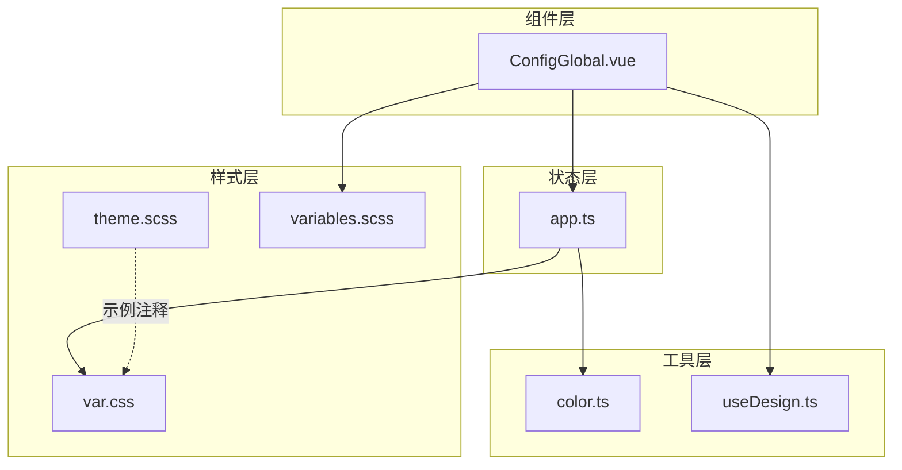
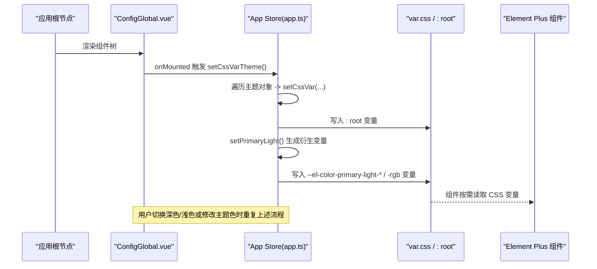
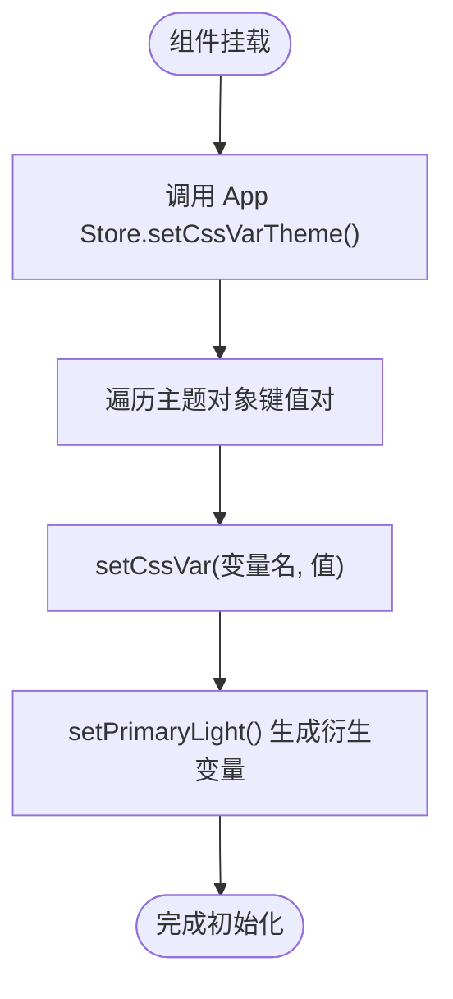
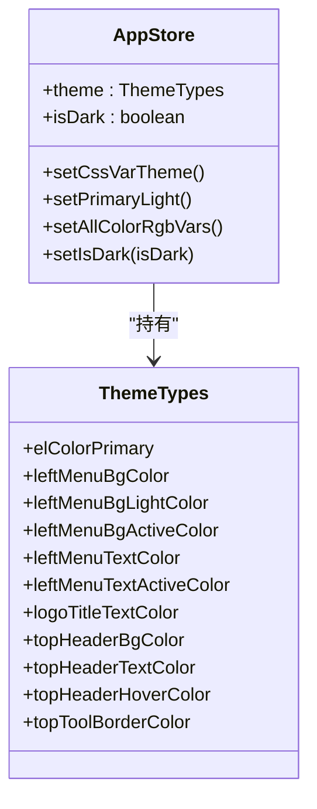
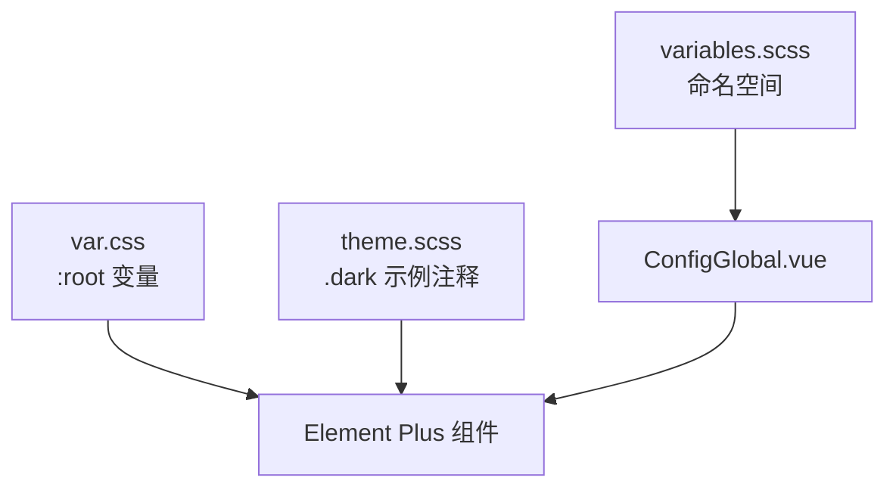
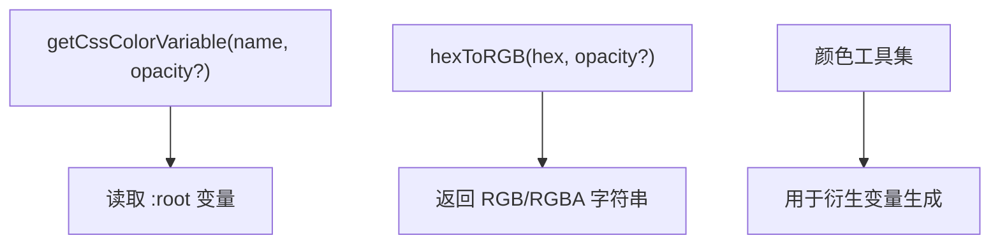
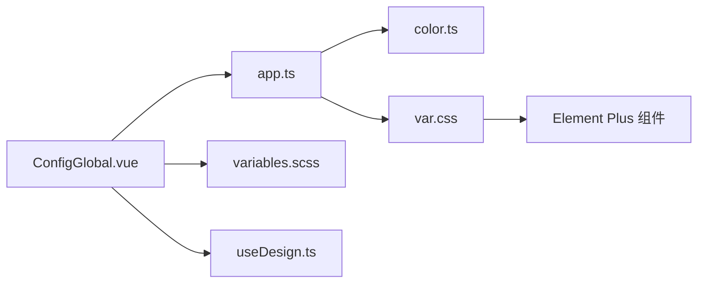

# Element Plus 主题定制

<cite>
**本文引用的文件**
- [ConfigGlobal.vue](file://yudao-ui/yudao-ui-admin-vue3/src/components/ConfigGlobal/src/ConfigGlobal.vue)
- [index.ts](file://yudao-ui/yudao-ui-admin-vue3/src/components/ConfigGlobal/index.ts)
- [theme.scss](file://yudao-ui/yudao-ui-admin-vue3/src/styles/theme.scss)
- [var.css](file://yudao-ui/yudao-ui-admin-vue3/src/styles/var.css)
- [variables.scss](file://yudao-ui/yudao-ui-admin-vue3/src/styles/variables.scss)
- [color.ts](file://yudao-ui/yudao-ui-admin-vue3/src/utils/color.ts)
- [useDesign.ts](file://yudao-ui/yudao-ui-admin-vue3/src/hooks/web/useDesign.ts)
- [app.ts](file://yudao-ui/yudao-ui-admin-vue3/src/store/modules/app.ts)
</cite>

## 目录
1. [简介](#简介)
2. [项目结构](#项目结构)
3. [核心组件](#核心组件)
4. [架构总览](#架构总览)
5. [详细组件分析](#详细组件分析)
6. [依赖关系分析](#依赖关系分析)
7. [性能考量](#性能考量)
8. [故障排查指南](#故障排查指南)
9. [结论](#结论)
10. [附录](#附录)

## 简介
本文件面向 Element Plus 主题定制与切换的完整实践，结合仓库中的实际实现，系统讲解以下内容：
- Element Plus 主题系统工作原理与 CSS 变量覆盖机制
- 静态主题与动态主题的配置方法
- ConfigGlobal 组件的主题配置能力与使用方式
- 用户自定义主题的实现路径
- 主题变量修改、样式编译与效果验证的完整步骤
- 深色/浅色主题的实现示例与最佳实践
- 主题兼容性与浏览器支持情况

## 项目结构
围绕主题定制的关键目录与文件如下：
- 组件层：ConfigGlobal 提供全局主题上下文与尺寸、国际化等配置
- 样式层：CSS 变量定义与 SCSS 变量、主题样式片段
- 工具层：颜色计算、CSS 变量读取与设置、命名空间工具
- 状态层：Pinia Store 中的主题状态与动态变量注入

图表来源
- [ConfigGlobal.vue:1-66](file://yudao-ui/yudao-ui-admin-vue3/src/components/ConfigGlobal/src/ConfigGlobal.vue#L1-L66)
- [var.css:1-75](file://yudao-ui/yudao-ui-admin-vue3/src/styles/var.css#L1-L75)
- [theme.scss:1-7](file://yudao-ui/yudao-ui-admin-vue3/src/styles/theme.scss#L1-L7)
- [variables.scss:1-5](file://yudao-ui/yudao-ui-admin-vue3/src/styles/variables.scss#L1-L5)
- [color.ts:1-218](file://yudao-ui/yudao-ui-admin-vue3/src/utils/color.ts#L1-L218)
- [useDesign.ts:1-19](file://yudao-ui/yudao-ui-admin-vue3/src/hooks/web/useDesign.ts#L1-L19)
- [app.ts:1-325](file://yudao-ui/yudao-ui-admin-vue3/src/store/modules/app.ts#L1-L325)

章节来源
- [ConfigGlobal.vue:1-66](file://yudao-ui/yudao-ui-admin-vue3/src/components/ConfigGlobal/src/ConfigGlobal.vue#L1-L66)
- [var.css:1-75](file://yudao-ui/yudao-ui-admin-vue3/src/styles/var.css#L1-L75)
- [theme.scss:1-7](file://yudao-ui/yudao-ui-admin-vue3/src/styles/theme.scss#L1-L7)
- [variables.scss:1-5](file://yudao-ui/yudao-ui-admin-vue3/src/styles/variables.scss#L1-L5)
- [color.ts:1-218](file://yudao-ui/yudao-ui-admin-vue3/src/utils/color.ts#L1-L218)
- [useDesign.ts:1-19](file://yudao-ui/yudao-ui-admin-vue3/src/hooks/web/useDesign.ts#L1-L19)
- [app.ts:1-325](file://yudao-ui/yudao-ui-admin-vue3/src/store/modules/app.ts#L1-L325)

## 核心组件
- ConfigGlobal：在应用根部提供 Element Plus 的 ConfigProvider 上下文，注入命名空间、语言、消息提示数量上限、组件尺寸等；同时负责初始化主题变量与响应式布局适配。
- App Store：集中管理主题状态（如主色、菜单/头部/Logo 等颜色）、深色模式开关、尺寸映射，并通过 CSS 变量实现动态主题切换。
- 样式变量：var.css 定义页面级 CSS 变量（如菜单宽度、头部颜色、内容区背景等），theme.scss 提供深色/浅色主题示例注释，variables.scss 定义 SCSS 命名空间。

章节来源
- [ConfigGlobal.vue:1-66](file://yudao-ui/yudao-ui-admin-vue3/src/components/ConfigGlobal/src/ConfigGlobal.vue#L1-L66)
- [app.ts:1-325](file://yudao-ui/yudao-ui-admin-vue3/src/store/modules/app.ts#L1-L325)
- [var.css:1-75](file://yudao-ui/yudao-ui-admin-vue3/src/styles/var.css#L1-L75)
- [theme.scss:1-7](file://yudao-ui/yudao-ui-admin-vue3/src/styles/theme.scss#L1-L7)
- [variables.scss:1-5](file://yudao-ui/yudao-ui-admin-vue3/src/styles/variables.scss#L1-L5)

## 架构总览
Element Plus 主题定制采用“CSS 变量 + Store 动态注入”的架构：
- 应用启动时，ConfigGlobal 在根节点挂载 ConfigProvider，并触发 App Store 注入主题变量到 :root
- App Store 将主题对象映射为 CSS 变量，同时根据主色生成一系列衍生变量（如浅色阶、深色阶、RGB 变量）
- 用户切换深色/浅色或修改主题色时，Store 更新变量，页面即时生效

图表来源
- [ConfigGlobal.vue:22-25](file://yudao-ui/yudao-ui-admin-vue3/src/components/ConfigGlobal/src/ConfigGlobal.vue#L22-L25)
- [app.ts:309-314](file://yudao-ui/yudao-ui-admin-vue3/src/store/modules/app.ts#L309-L314)
- [app.ts:188-200](file://yudao-ui/yudao-ui-admin-vue3/src/store/modules/app.ts#L188-L200)
- [app.ts:203-221](file://yudao-ui/yudao-ui-admin-vue3/src/store/modules/app.ts#L203-L221)
- [var.css:1-75](file://yudao-ui/yudao-ui-admin-vue3/src/styles/var.css#L1-L75)

## 详细组件分析

### ConfigGlobal 组件
- 职责：提供 Element Plus ConfigProvider 上下文，注入命名空间、语言、消息提示最大数、组件尺寸；在挂载时初始化主题变量。
- 关键点：
  - 使用 provide/inject 传递配置上下文
  - 通过 App Store 的 setCssVarTheme() 将主题对象映射为 CSS 变量
  - 响应窗口尺寸变化，动态调整菜单最小宽度与布局模式
  - 读取多语言与设计命名空间

图表来源
- [ConfigGlobal.vue:22-25](file://yudao-ui/yudao-ui-admin-vue3/src/components/ConfigGlobal/src/ConfigGlobal.vue#L22-L25)
- [app.ts:309-314](file://yudao-ui/yudao-ui-admin-vue3/src/store/modules/app.ts#L309-L314)

章节来源
- [ConfigGlobal.vue:1-66](file://yudao-ui/yudao-ui-admin-vue3/src/components/ConfigGlobal/src/ConfigGlobal.vue#L1-L66)
- [index.ts:1-4](file://yudao-ui/yudao-ui-admin-vue3/src/components/ConfigGlobal/index.ts#L1-L4)

### App Store 主题状态与动态变量注入
- 主题状态：包含主色、菜单/头部/Logo 等颜色配置，默认值来自本地缓存或内置默认值
- 动态变量注入：setCssVarTheme() 将驼峰键转换为连字符变量名写入 :root
- 衍生变量生成：
  - setPrimaryLight()：基于主色与目标色混合生成浅色阶（3/5/7/8/9 成浅色阶，20% 深色阶）
  - setAllColorRgbVars()：将 --el-color-{type} 转换为 --el-color-{type}-rgb
- 深色模式：切换时为 html 添加/移除 dark/light 类，随后重新生成衍生变量

图表来源
- [app.ts:14-42](file://yudao-ui/yudao-ui-admin-vue3/src/store/modules/app.ts#L14-L42)
- [app.ts:309-314](file://yudao-ui/yudao-ui-admin-vue3/src/store/modules/app.ts#L309-L314)
- [app.ts:188-200](file://yudao-ui/yudao-ui-admin-vue3/src/store/modules/app.ts#L188-L200)
- [app.ts:203-221](file://yudao-ui/yudao-ui-admin-vue3/src/store/modules/app.ts#L203-L221)
- [app.ts:286-297](file://yudao-ui/yudao-ui-admin-vue3/src/store/modules/app.ts#L286-L297)

章节来源
- [app.ts:1-325](file://yudao-ui/yudao-ui-admin-vue3/src/store/modules/app.ts#L1-L325)

### CSS 变量覆盖与主题样式
- 页面级变量：var.css 定义菜单宽度、头部颜色、内容区背景、过渡时间等
- 深色/浅色示例：theme.scss 提供注释示例，展示如何在 .dark 或普通选择器中覆盖文本颜色
- 命名空间：variables.scss 定义 SCSS 层的命名空间（如 el 命名空间）

图表来源
- [var.css:1-75](file://yudao-ui/yudao-ui-admin-vue3/src/styles/var.css#L1-L75)
- [theme.scss:1-7](file://yudao-ui/yudao-ui-admin-vue3/src/styles/theme.scss#L1-L7)
- [variables.scss:1-5](file://yudao-ui/yudao-ui-admin-vue3/src/styles/variables.scss#L1-L5)
- [ConfigGlobal.vue:57-64](file://yudao-ui/yudao-ui-admin-vue3/src/components/ConfigGlobal/src/ConfigGlobal.vue#L57-L64)

章节来源
- [var.css:1-75](file://yudao-ui/yudao-ui-admin-vue3/src/styles/var.css#L1-L75)
- [theme.scss:1-7](file://yudao-ui/yudao-ui-admin-vue3/src/styles/theme.scss#L1-L7)
- [variables.scss:1-5](file://yudao-ui/yudao-ui-admin-vue3/src/styles/variables.scss#L1-L5)

### 颜色工具与变量读取
- 颜色工具：提供十六进制判断、RGB/HEX 转换、明暗判断、加亮/变暗、颜色混合、获取 CSS 变量值等能力
- 变量读取：getCssColorVariable() 从 :root 读取 Element Plus 颜色变量，hexToRGB() 支持带透明度输出
- 设计命名空间：useDesign() 提供命名空间拼接与 SCSS 变量访问

图表来源
- [color.ts:196-218](file://yudao-ui/yudao-ui-admin-vue3/src/utils/color.ts#L196-L218)
- [color.ts:22-52](file://yudao-ui/yudao-ui-admin-vue3/src/utils/color.ts#L22-L52)
- [useDesign.ts:1-19](file://yudao-ui/yudao-ui-admin-vue3/src/hooks/web/useDesign.ts#L1-L19)

章节来源
- [color.ts:1-218](file://yudao-ui/yudao-ui-admin-vue3/src/utils/color.ts#L1-L218)
- [useDesign.ts:1-19](file://yudao-ui/yudao-ui-admin-vue3/src/hooks/web/useDesign.ts#L1-L19)

## 依赖关系分析
- ConfigGlobal 依赖 App Store 进行主题变量注入与尺寸配置
- App Store 依赖颜色工具进行衍生变量生成与颜色转换
- 样式层通过 CSS 变量与 Element Plus 组件形成解耦的样式契约
- 命名空间工具为组件类名提供统一前缀

图表来源
- [ConfigGlobal.vue:1-66](file://yudao-ui/yudao-ui-admin-vue3/src/components/ConfigGlobal/src/ConfigGlobal.vue#L1-L66)
- [app.ts:1-325](file://yudao-ui/yudao-ui-admin-vue3/src/store/modules/app.ts#L1-L325)
- [color.ts:1-218](file://yudao-ui/yudao-ui-admin-vue3/src/utils/color.ts#L1-L218)
- [var.css:1-75](file://yudao-ui/yudao-ui-admin-vue3/src/styles/var.css#L1-L75)
- [variables.scss:1-5](file://yudao-ui/yudao-ui-admin-vue3/src/styles/variables.scss#L1-L5)
- [useDesign.ts:1-19](file://yudao-ui/yudao-ui-admin-vue3/src/hooks/web/useDesign.ts#L1-L19)

章节来源
- [ConfigGlobal.vue:1-66](file://yudao-ui/yudao-ui-admin-vue3/src/components/ConfigGlobal/src/ConfigGlobal.vue#L1-L66)
- [app.ts:1-325](file://yudao-ui/yudao-ui-admin-vue3/src/store/modules/app.ts#L1-L325)
- [color.ts:1-218](file://yudao-ui/yudao-ui-admin-vue3/src/utils/color.ts#L1-L218)
- [var.css:1-75](file://yudao-ui/yudao-ui-admin-vue3/src/styles/var.css#L1-L75)
- [variables.scss:1-5](file://yudao-ui/yudao-ui-admin-vue3/src/styles/variables.scss#L1-L5)
- [useDesign.ts:1-19](file://yudao-ui/yudao-ui-admin-vue3/src/hooks/web/useDesign.ts#L1-L19)

## 性能考量
- CSS 变量注入成本低：仅写入 :root，无需重排重绘
- 衍生变量按需生成：仅在切换深色/浅色或修改主色时执行，避免频繁计算
- 缓存策略：Store 使用本地缓存保存主题与尺寸，减少重复初始化开销
- 组件尺寸与语言配置在 ConfigProvider 中一次性注入，避免重复渲染

## 故障排查指南
- 主题未生效
  - 检查 ConfigGlobal 是否在根节点正确渲染
  - 确认 App Store 的 setCssVarTheme() 是否被调用
  - 核对 CSS 变量名是否与主题对象键一致（驼峰转连字符）
- 深色模式无效
  - 确认 setIsDark() 是否为 html 添加/移除 dark/light 类
  - 检查 setPrimaryLight() 是否在切换后重新生成衍生变量
- 颜色对比度问题
  - 使用颜色工具的明暗判断与最佳文本色计算函数辅助优化
- 命名空间冲突
  - 检查 variables.scss 的命名空间配置与 useDesign 的前缀拼接

章节来源
- [ConfigGlobal.vue:22-25](file://yudao-ui/yudao-ui-admin-vue3/src/components/ConfigGlobal/src/ConfigGlobal.vue#L22-L25)
- [app.ts:286-297](file://yudao-ui/yudao-ui-admin-vue3/src/store/modules/app.ts#L286-L297)
- [app.ts:188-200](file://yudao-ui/yudao-ui-admin-vue3/src/store/modules/app.ts#L188-L200)
- [color.ts:54-61](file://yudao-ui/yudao-ui-admin-vue3/src/utils/color.ts#L54-L61)
- [variables.scss:1-5](file://yudao-ui/yudao-ui-admin-vue3/src/styles/variables.scss#L1-L5)
- [useDesign.ts:10-12](file://yudao-ui/yudao-ui-admin-vue3/src/hooks/web/useDesign.ts#L10-L12)

## 结论
本项目以 CSS 变量为核心，结合 Pinia Store 实现了灵活且高性能的主题定制体系。通过 ConfigGlobal 提供统一的上下文，App Store 负责变量注入与衍生变量生成，最终由 Element Plus 组件按需消费。该方案既支持静态主题（预置变量），也支持动态主题（运行时修改），并具备良好的深色/浅色切换能力与扩展性。

## 附录

### 主题定制步骤（完整）
- 步骤一：修改主题对象
  - 在 App Store 中更新主题对象（如主色、菜单/头部/Logo 颜色）
  - 参考路径：[app.ts:75-104](file://yudao-ui/yudao-ui-admin-vue3/src/store/modules/app.ts#L75-L104)
- 步骤二：注入 CSS 变量
  - 调用 setCssVarTheme() 将主题对象映射为 :root 变量
  - 参考路径：[app.ts:309-314](file://yudao-ui/yudao-ui-admin-vue3/src/store/modules/app.ts#L309-L314)
- 步骤三：生成衍生变量
  - 调用 setPrimaryLight() 生成浅/深色阶与 --el-color-*-rgb 变量
  - 参考路径：[app.ts:188-200](file://yudao-ui/yudao-ui-admin-vue3/src/store/modules/app.ts#L188-L200)、[app.ts:203-221](file://yudao-ui/yudao-ui-admin-vue3/src/store/modules/app.ts#L203-L221)
- 步骤四：样式编译与验证
  - 在 var.css 中确认变量生效；在 theme.scss 中参考深色/浅色示例注释
  - 参考路径：[var.css:1-75](file://yudao-ui/yudao-ui-admin-vue3/src/styles/var.css#L1-L75)、[theme.scss:1-7](file://yudao-ui/yudao-ui-admin-vue3/src/styles/theme.scss#L1-L7)
- 步骤五：深色/浅色切换
  - 调用 setIsDark() 切换 html 的 dark/light 类，并重新生成衍生变量
  - 参考路径：[app.ts:286-297](file://yudao-ui/yudao-ui-admin-vue3/src/store/modules/app.ts#L286-L297)

### 深色/浅色主题实现示例与最佳实践
- 深色主题示例
  - 在 theme.scss 中参考注释示例，为 .dark 选择器覆盖文本颜色等
  - 参考路径：[theme.scss:4-6](file://yudao-ui/yudao-ui-admin-vue3/src/styles/theme.scss#L4-L6)
- 最佳实践
  - 使用 CSS 变量统一管理颜色，避免硬编码
  - 通过颜色工具计算对比度与最佳文本色，提升可读性
  - 保持命名空间一致性，避免类名冲突
  - 将主题对象持久化到本地缓存，保证刷新后仍保持用户偏好

章节来源
- [theme.scss:1-7](file://yudao-ui/yudao-ui-admin-vue3/src/styles/theme.scss#L1-L7)
- [color.ts:136-141](file://yudao-ui/yudao-ui-admin-vue3/src/utils/color.ts#L136-L141)
- [variables.scss:1-5](file://yudao-ui/yudao-ui-admin-vue3/src/styles/variables.scss#L1-L5)

### 主题兼容性与浏览器支持
- CSS 变量广泛支持现代浏览器，建议在项目构建时保留对较老浏览器的支持策略（如降级方案或 polyfill）
- Element Plus 组件对 CSS 变量有良好支持，确保变量名与组件内部变量一致
- 深色/浅色切换依赖 html 的类名变更，主流浏览器均支持