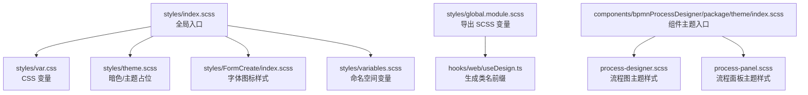
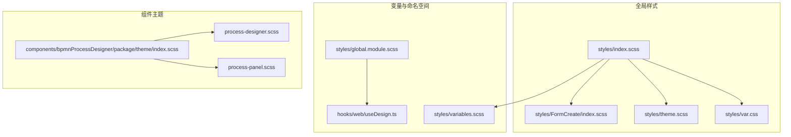
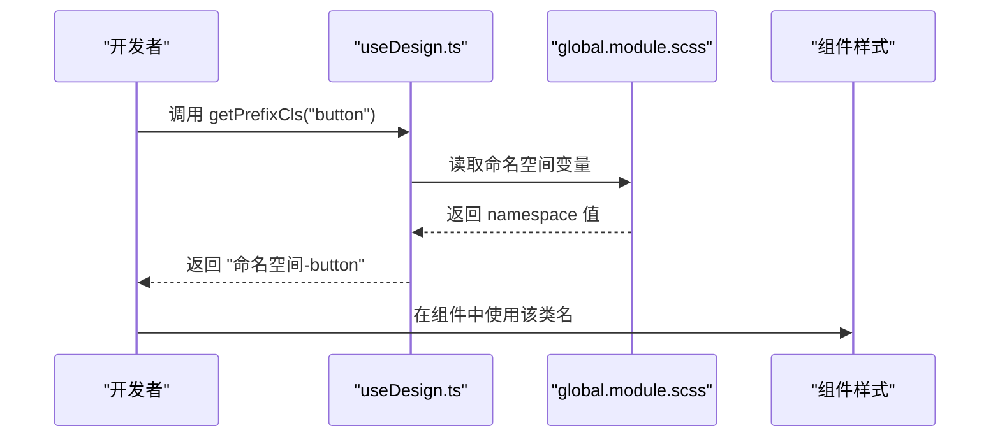
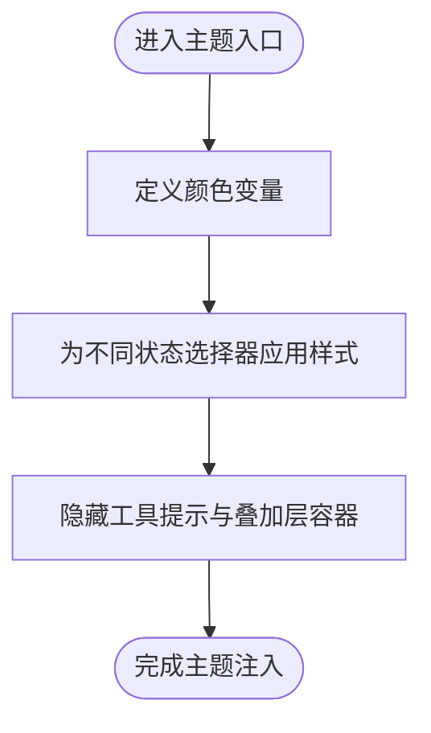
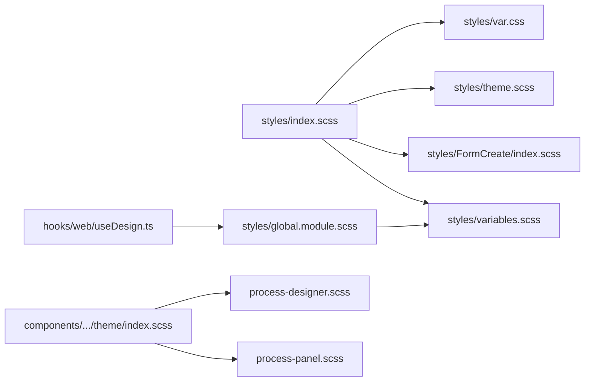

# SCSS 使用规范

<cite>
**本文引用的文件**
- [variables.scss](file://yudao-ui/yudao-ui-admin-vue3/src/styles/variables.scss)
- [index.scss](file://yudao-ui/yudao-ui-admin-vue3/src/styles/index.scss)
- [theme.scss](file://yudao-ui/yudao-ui-admin-vue3/src/styles/theme.scss)
- [var.css](file://yudao-ui/yudao-ui-admin-vue3/src/styles/var.css)
- [global.module.scss](file://yudao-ui/yudao-ui-admin-vue3/src/styles/global.module.scss)
- [FormCreate/index.scss](file://yudao-ui/yudao-ui-admin-vue3/src/styles/FormCreate/index.scss)
- [bpmnProcessDesigner 主题入口 index.scss](file://yudao-ui/yudao-ui-admin-vue3/src/components/bpmnProcessDesigner/package/theme/index.scss)
- [useDesign.ts](file://yudao-ui/yudao-ui-admin-vue3/src/hooks/web/useDesign.ts)
- [color.ts](file://yudao-ui/yudao-ui-admin-vue3/src/utils/color.ts)
</cite>

## 目录
1. [引言](#引言)
2. [项目结构](#项目结构)
3. [核心组件](#核心组件)
4. [架构总览](#架构总览)
5. [详细组件分析](#详细组件分析)
6. [依赖分析](#依赖分析)
7. [性能考虑](#性能考虑)
8. [故障排查指南](#故障排查指南)
9. [结论](#结论)
10. [附录](#附录)

## 引言
本规范面向前端开发者，系统性阐述本项目中 SCSS 的使用方式与最佳实践，涵盖变量体系、模块化组织、命名约定、CSS Modules 集成、以及常见问题的规避与调试技巧。通过统一的变量与模块化策略，确保样式具备可维护性、可扩展性与一致性。

## 项目结构
本项目在前端 UI 工程中采用“全局样式 + 组件主题样式”的分层组织方式：
- 全局样式入口：统一引入基础变量、主题、第三方适配与通用重置。
- 变量与 CSS 变量：集中管理命名空间、颜色与布局常量。
- 模块化样式：按功能域拆分文件，通过 @use 组织导入。
- CSS Modules：通过 global.module.scss 将 SCSS 变量导出给 TS/Hook 使用，实现命名空间与类名前缀的统一生成。

图表来源
- [index.scss:1-38](file://yudao-ui/yudao-ui-admin-vue3/src/styles/index.scss#L1-L38)
- [var.css:1-75](file://yudao-ui/yudao-ui-admin-vue3/src/styles/var.css#L1-L75)
- [theme.scss:1-7](file://yudao-ui/yudao-ui-admin-vue3/src/styles/theme.scss#L1-L7)
- [FormCreate/index.scss:1-23](file://yudao-ui/yudao-ui-admin-vue3/src/styles/FormCreate/index.scss#L1-L23)
- [variables.scss:1-5](file://yudao-ui/yudao-ui-admin-vue3/src/styles/variables.scss#L1-L5)
- [global.module.scss:1-7](file://yudao-ui/yudao-ui-admin-vue3/src/styles/global.module.scss#L1-L7)
- [useDesign.ts:1-18](file://yudao-ui/yudao-ui-admin-vue3/src/hooks/web/useDesign.ts#L1-L18)
- [bpmnProcessDesigner 主题入口 index.scss:1-118](file://yudao-ui/yudao-ui-admin-vue3/src/components/bpmnProcessDesigner/package/theme/index.scss#L1-L118)

章节来源
- [index.scss:1-38](file://yudao-ui/yudao-ui-admin-vue3/src/styles/index.scss#L1-L38)
- [variables.scss:1-5](file://yudao-ui/yudao-ui-admin-vue3/src/styles/variables.scss#L1-L5)
- [var.css:1-75](file://yudao-ui/yudao-ui-admin-vue3/src/styles/var.css#L1-L75)
- [global.module.scss:1-7](file://yudao-ui/yudao-ui-admin-vue3/src/styles/global.module.scss#L1-L7)
- [useDesign.ts:1-18](file://yudao-ui/yudao-ui-admin-vue3/src/hooks/web/useDesign.ts#L1-L18)
- [bpmnProcessDesigner 主题入口 index.scss:1-118](file://yudao-ui/yudao-ui-admin-vue3/src/components/bpmnProcessDesigner/package/theme/index.scss#L1-L118)

## 核心组件
- 命名空间与变量
  - 通过 variables.scss 定义命名空间与 Element Plus 命名空间变量，供全局与组件主题复用。
  - 通过 var.css 定义大量 CSS 变量，覆盖菜单、头部、标签页、内容区等布局与主题色常量，并支持暗色模式切换。
- 全局入口与第三方适配
  - index.scss 作为全局入口，统一引入 CSS 变量、第三方主题变量、表单创建样式与通用修复样式。
- CSS Modules 集成
  - global.module.scss 将 SCSS 变量导出为 JS 可用对象；useDesign.ts 提供 getPrefixCls 方法，统一生成带命名空间的类名，避免冲突。
- 组件主题模块化
  - bpmnProcessDesigner 主题入口通过 @use 聚合子主题文件，集中管理颜色变量与选择器映射，便于维护与扩展。

章节来源
- [variables.scss:1-5](file://yudao-ui/yudao-ui-admin-vue3/src/styles/variables.scss#L1-L5)
- [index.scss:1-38](file://yudao-ui/yudao-ui-admin-vue3/src/styles/index.scss#L1-L38)
- [var.css:1-75](file://yudao-ui/yudao-ui-admin-vue3/src/styles/var.css#L1-L75)
- [global.module.scss:1-7](file://yudao-ui/yudao-ui-admin-vue3/src/styles/global.module.scss#L1-L7)
- [useDesign.ts:1-18](file://yudao-ui/yudao-ui-admin-vue3/src/hooks/web/useDesign.ts#L1-L18)
- [bpmnProcessDesigner 主题入口 index.scss:1-118](file://yudao-ui/yudao-ui-admin-vue3/src/components/bpmnProcessDesigner/package/theme/index.scss#L1-L118)

## 架构总览
下图展示了从样式入口到组件主题的加载与依赖关系，体现模块化与命名空间控制的总体架构。

图表来源
- [index.scss:1-38](file://yudao-ui/yudao-ui-admin-vue3/src/styles/index.scss#L1-L38)
- [var.css:1-75](file://yudao-ui/yudao-ui-admin-vue3/src/styles/var.css#L1-L75)
- [theme.scss:1-7](file://yudao-ui/yudao-ui-admin-vue3/src/styles/theme.scss#L1-L7)
- [FormCreate/index.scss:1-23](file://yudao-ui/yudao-ui-admin-vue3/src/styles/FormCreate/index.scss#L1-L23)
- [variables.scss:1-5](file://yudao-ui/yudao-ui-admin-vue3/src/styles/variables.scss#L1-L5)
- [global.module.scss:1-7](file://yudao-ui/yudao-ui-admin-vue3/src/styles/global.module.scss#L1-L7)
- [useDesign.ts:1-18](file://yudao-ui/yudao-ui-admin-vue3/src/hooks/web/useDesign.ts#L1-L18)
- [bpmnProcessDesigner 主题入口 index.scss:1-118](file://yudao-ui/yudao-ui-admin-vue3/src/components/bpmnProcessDesigner/package/theme/index.scss#L1-L118)

## 详细组件分析

### 变量系统与命名规范
- 命名空间
  - 通过 variables.scss 定义 $namespace 与 $elNamespace，用于统一生成组件类名前缀，避免全局污染。
- CSS 变量
  - var.css 定义了菜单宽度、背景色、文字色、Logo 高度、标签页高度、内容区内边距、过渡时间等关键变量，并在暗色模式下进行覆盖。
- 使用建议
  - 优先使用 CSS 变量进行主题与布局控制，减少硬编码。
  - 在 SCSS 中通过 var(--xxx) 或预设变量进行引用，保持一致性。

章节来源
- [variables.scss:1-5](file://yudao-ui/yudao-ui-admin-vue3/src/styles/variables.scss#L1-L5)
- [var.css:1-75](file://yudao-ui/yudao-ui-admin-vue3/src/styles/var.css#L1-L75)

### 混合器（Mixins）与常用布局/文本/动画
- 现状
  - 仓库未发现显式的 SCSS mixin 定义与使用。颜色混合与 CSS 变量解析能力由工具函数提供，不依赖 SCSS mixin。
- 建议
  - 对于重复出现的复杂样式片段（如圆角、阴影、渐变、动画序列），可在独立的 mixins 文件中定义并集中管理，提升复用性与可读性。
  - 若需在 SCSS 中进行颜色混合或条件样式处理，可参考 color.ts 的颜色混合思路，在 SCSS 中通过函数或变量组合实现。

章节来源
- [color.ts:177-217](file://yudao-ui/yudao-ui-admin-vue3/src/utils/color.ts#L177-L217)

### 模块化样式组织
- 文件拆分
  - 全局样式入口 index.scss 负责聚合：CSS 变量、第三方主题变量、表单创建样式与通用修复。
  - 组件主题通过 bpmnProcessDesigner 的主题入口 index.scss 聚合子主题文件，便于按功能域维护。
- 导入顺序
  - 先导入基础变量与 CSS 变量，再引入第三方主题与业务样式，最后放置通用修复与覆盖。
- 命名约定
  - 使用语义化命名，结合命名空间前缀，避免类名冲突。
  - 组件主题文件以组件名或功能域命名，子主题文件按作用域细分。

章节来源
- [index.scss:1-38](file://yudao-ui/yudao-ui-admin-vue3/src/styles/index.scss#L1-L38)
- [bpmnProcessDesigner 主题入口 index.scss:1-118](file://yudao-ui/yudao-ui-admin-vue3/src/components/bpmnProcessDesigner/package/theme/index.scss#L1-L118)

### CSS Modules 与类名生成
- 变量导出
  - global.module.scss 将 SCSS 变量导出为 JS 对象，供 TS/Hook 使用。
- 类名生成
  - useDesign.ts 提供 getPrefixCls(scope) 方法，返回 “命名空间-类名” 的形式，统一生成带前缀的类名。
- 实践要点
  - 所有组件类名应通过 getPrefixCls 生成，避免直接硬编码类名。
  - 在组件样式中使用命名空间变量，保证与全局命名空间一致。

图表来源
- [global.module.scss:1-7](file://yudao-ui/yudao-ui-admin-vue3/src/styles/global.module.scss#L1-L7)
- [useDesign.ts:1-18](file://yudao-ui/yudao-ui-admin-vue3/src/hooks/web/useDesign.ts#L1-L18)

章节来源
- [global.module.scss:1-7](file://yudao-ui/yudao-ui-admin-vue3/src/styles/global.module.scss#L1-L7)
- [useDesign.ts:1-18](file://yudao-ui/yudao-ui-admin-vue3/src/hooks/web/useDesign.ts#L1-L18)

### 第三方样式与覆盖
- Element Plus 适配
  - index.scss 引入 Element Plus 暗色主题变量文件，并通过 CSS 变量适配进度条等第三方组件的主题色。
- 通用修复
  - 针对抽屉弹出时 body 宽度变化、表格横向滚动条对齐等问题提供针对性修复。

章节来源
- [index.scss:1-38](file://yudao-ui/yudao-ui-admin-vue3/src/styles/index.scss#L1-L38)

### 字体图标与资源组织
- 字体图标
  - FormCreate/index.scss 通过 @font-face 引入自定义字体，并定义图标类与 Unicode 映射，便于在组件中使用。
- 资源路径
  - 字体文件采用相对路径引入，确保构建时资源正确打包。

章节来源
- [FormCreate/index.scss:1-23](file://yudao-ui/yudao-ui-admin-vue3/src/styles/FormCreate/index.scss#L1-L23)

### 流程图组件主题
- 颜色变量
  - 主题入口集中定义成功、主色、危险、取消等颜色变量，统一组件主题配色。
- 选择器映射
  - 通过类名与 djs-* 前缀选择器映射不同状态下的填充、描边与透明度，形成一致的主题风格。
- 子主题拆分
  - process-designer.scss 与 process-panel.scss 分别负责画布与面板主题，主题入口统一聚合。

图表来源
- [bpmnProcessDesigner 主题入口 index.scss:1-118](file://yudao-ui/yudao-ui-admin-vue3/src/components/bpmnProcessDesigner/package/theme/index.scss#L1-L118)

章节来源
- [bpmnProcessDesigner 主题入口 index.scss:1-118](file://yudao-ui/yudao-ui-admin-vue3/src/components/bpmnProcessDesigner/package/theme/index.scss#L1-L118)

## 依赖分析
- 入口依赖
  - index.scss 依赖 var.css、theme.scss、第三方主题变量与业务样式模块。
- 命名空间依赖
  - global.module.scss 依赖 variables.scss；useDesign.ts 依赖 global.module.scss。
- 组件主题依赖
  - bpmnProcessDesigner 主题入口依赖子主题文件，形成清晰的层次结构。

图表来源
- [index.scss:1-38](file://yudao-ui/yudao-ui-admin-vue3/src/styles/index.scss#L1-L38)
- [var.css:1-75](file://yudao-ui/yudao-ui-admin-vue3/src/styles/var.css#L1-L75)
- [theme.scss:1-7](file://yudao-ui/yudao-ui-admin-vue3/src/styles/theme.scss#L1-L7)
- [FormCreate/index.scss:1-23](file://yudao-ui/yudao-ui-admin-vue3/src/styles/FormCreate/index.scss#L1-L23)
- [variables.scss:1-5](file://yudao-ui/yudao-ui-admin-vue3/src/styles/variables.scss#L1-L5)
- [global.module.scss:1-7](file://yudao-ui/yudao-ui-admin-vue3/src/styles/global.module.scss#L1-L7)
- [useDesign.ts:1-18](file://yudao-ui/yudao-ui-admin-vue3/src/hooks/web/useDesign.ts#L1-L18)
- [bpmnProcessDesigner 主题入口 index.scss:1-118](file://yudao-ui/yudao-ui-admin-vue3/src/components/bpmnProcessDesigner/package/theme/index.scss#L1-L118)

章节来源
- [index.scss:1-38](file://yudao-ui/yudao-ui-admin-vue3/src/styles/index.scss#L1-L38)
- [variables.scss:1-5](file://yudao-ui/yudao-ui-admin-vue3/src/styles/variables.scss#L1-L5)
- [global.module.scss:1-7](file://yudao-ui/yudao-ui-admin-vue3/src/styles/global.module.scss#L1-L7)
- [useDesign.ts:1-18](file://yudao-ui/yudao-ui-admin-vue3/src/hooks/web/useDesign.ts#L1-L18)
- [bpmnProcessDesigner 主题入口 index.scss:1-118](file://yudao-ui/yudao-ui-admin-vue3/src/components/bpmnProcessDesigner/package/theme/index.scss#L1-L118)

## 性能考虑
- 减少重复计算与变量嵌套层级，避免深层 @use 带来的编译开销。
- 合理拆分模块，仅在需要时引入对应主题或样式文件，降低打包体积。
- 使用 CSS 变量替代 SCSS 变量进行主题切换，减少运行时样式重排。

## 故障排查指南
- 类名冲突
  - 确认所有组件类名均通过 getPrefixCls 生成，避免硬编码类名导致冲突。
- 主题色不生效
  - 检查 var.css 中的 CSS 变量是否被覆盖，确认 index.scss 是否正确引入第三方主题变量。
- 流程图主题异常
  - 检查主题入口是否正确 @use 子主题文件，确认颜色变量与选择器映射是否匹配。
- 字体图标不显示
  - 确认字体资源路径正确，构建后资源被打包。

章节来源
- [useDesign.ts:1-18](file://yudao-ui/yudao-ui-admin-vue3/src/hooks/web/useDesign.ts#L1-L18)
- [index.scss:1-38](file://yudao-ui/yudao-ui-admin-vue3/src/styles/index.scss#L1-L38)
- [bpmnProcessDesigner 主题入口 index.scss:1-118](file://yudao-ui/yudao-ui-admin-vue3/src/components/bpmnProcessDesigner/package/theme/index.scss#L1-L118)
- [FormCreate/index.scss:1-23](file://yudao-ui/yudao-ui-admin-vue3/src/styles/FormCreate/index.scss#L1-L23)

## 结论
本项目通过“全局样式入口 + CSS 变量 + 命名空间 + 模块化主题”的方式，实现了样式的一致性与可维护性。建议在现有基础上补充 SCSS mixin 与更细粒度的工具函数，进一步提升复用性与开发效率；同时坚持 CSS Modules 与命名空间前缀策略，有效避免样式冲突。

## 附录
- 实际编码示例（以路径代替具体代码）
  - 生成带命名空间的类名：[useDesign.ts:10-12](file://yudao-ui/yudao-ui-admin-vue3/src/hooks/web/useDesign.ts#L10-L12)
  - 引入全局样式入口：[index.scss:1-4](file://yudao-ui/yudao-ui-admin-vue3/src/styles/index.scss#L1-L4)
  - 定义组件主题颜色变量与选择器映射：[bpmnProcessDesigner 主题入口 index.scss:4-113](file://yudao-ui/yudao-ui-admin-vue3/src/components/bpmnProcessDesigner/package/theme/index.scss#L4-L113)
  - 使用 CSS 变量进行主题色适配：[index.scss:22-36](file://yudao-ui/yudao-ui-admin-vue3/src/styles/index.scss#L22-L36)
  - 自定义字体图标与 Unicode 映射：[FormCreate/index.scss:3-22](file://yudao-ui/yudao-ui-admin-vue3/src/styles/FormCreate/index.scss#L3-L22)